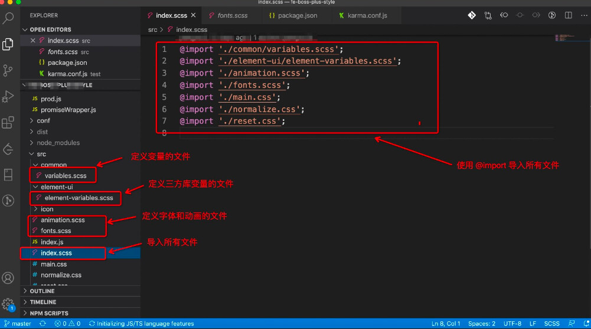
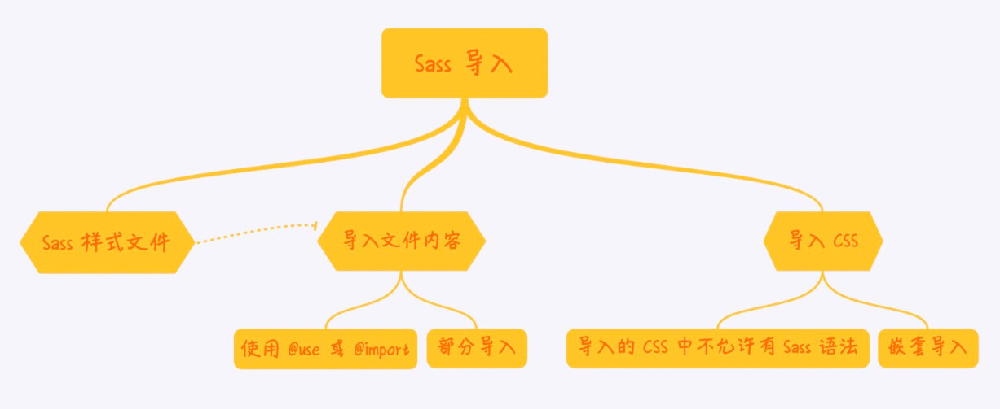

# Sass语法介绍-导入

## 1.前言

在 CSS 中我们可以通过 @import 来导入一个样式文件，Sass 扩展了 CSS 的 @import 规则，使得可以导入 CSS 后缀的样式文件和 Scss 后缀的样式文件，并且提供了对 mixin 、函数和变量的访问。

与 CSS 的 @import 不同的是， CSS 使用 @import 导入文件是在页面渲染的时候发起多个 http 请求来获取文件内容，而 Sass 的导入 @import 是在编译时获取文件内容导入的。


## 2.语法详情

Sass 的导入和 CSS 中的导入语法类似，只不过在 Sass 中**可以导入用逗号分隔的多个文件**， 我们举个例子看下：

```scss
@import 'a.scss', 'b.scss';
```

上面的代码意思是导入 a.scss 和 b.scss 文件，那么导入后 a 和 b 中的任何mixin 、函数和变量都是可以使用的。

我们知道在 CSS 中也有 @import 语句，在以下几种情况 Sass 会认为 @import 是 CSS 语句：

- 使用 url()
- 文件的扩展名是 .css
- @import 包含 media queries
- 文件名以 http:// 开头

在使用的时候要注意上面的几种情况，如果导入的扩展名是 .scss 或 .sass 那么肯定用的是 Sass 提供的 @import 。如果**导入文件没有指定文件扩展名，那么 Sass 会尝试寻找文件名相同的扩展名为 .sass 或 .scss 的文件**。


## 3.加载路径

Sass 允许我们自行提供文件的加载路径，在我们导入文件的时候，Sass 总是会相对于当前文件进行解析，如果没有加载到则会使用**加载路径**。假如我们将加载路径设置为 node_modules/public/sass ，那么我们使用如下的导入方式：

```scss
@import 'a';
```

假如当前目录下没有 a.scss 文件，那么 Sass 就会去加载 node_modules/public/sass/a.scss ，这就是使用了加载路径，不过这种方式我们在项目中**极少应用**，你只需要了解即可。


## 4.部分导入

什么是部分导入呢？ 我的理解是**局部的使用导入**，也就是说可以**仅导入 Sass 或 Scss 文件，而不将它们编译为 CSS，** 那么应该怎么做呢？假如我要导入一个 my.scss 文件，我不希望将它编译为 CSS ，那么需要**使用下划线开头的文件名**，也就是说需要改名为 _my.scss ，然后使用如下导入代码：

```scss
@import 'my';
```

上面的代码导入的就是 _my.scss 文件，并且不会将它编译为 CSS 。另外需要注意的是：**不可以同时存在带有下划线和不带下划线的同名文件！**


## 5.索引文件

在 Sass 中什么是索引文件呢？_index.scss 文件，那它有什么用呢？假如我有一个 my 目录，这个目录下有两个文件，一个是 a.scss 一个是 _index.scss ，那么我使用如下文件导入代码：

```scss
@import 'my'；
```

那么上面的代码导入的就是 _index.scss 文件，也就是说 _index.scss 是这个目录下的**默认文件**，这就想你在写 vue 或者 html 中目录下的 index 文件类似。


## 6.使用 @use 替代 @import

Sass 官方团队不鼓励使用 @import 导入，并且在未来几年将逐步淘汰它，并最终将 @import 从 Sass 中完全删除。所以使用 @use 是官方团队更推荐的方式，下面我们开始讲解使用 @use 导入。

@use 与 @import 的语法基本相同，我们先看一个简单的使用 @use 导入的例子：

```scss
@use 'my/a.scss';
@use 'my/b';
```

从上面的代码中可以看到其使用方式与 @import 是相同的，那么为什么还要替换掉 @import 呢？ 主要是以下几个原因你需要了解下：

- @import 会使得所有变量、mixin 和函数都可以全局访问，这使开发者很难去维护这些定义的东西。
- 因为所有的都是全局的，那么 Sass 必须为所有的成员添加前缀，以避免命名冲突。
- @extend 也是全局的，这样将很难预测哪些样式将被扩展。
- 每次使用 @import 时，每个样式表都会被执行，这会增加编译时间
- 无法定义下游样式表无法访问的私有成员。

基于上述的这些原因，Sass 官方团队将会逐渐淘汰 @import，可以使用 @use 替代，语法是相同的，所以我们在 **v4.x.x 及以上的版本**中尽量使用 @use 来导入。


## 7.实战经验

其实在实际的项目中我们一般就是用 @import 来简单的导入文件，更多的时候是用它来方便整个项目中的 Sass 样式管理，如下图所示：

image-20220825230946960

图中所演示的是我的项目中的一个使用方式。每个项目的样式管理方式都不同，你的公司中的项目中肯定也会使用 @import 或 @use 来管理样式文件，不过目前应该是使用 @import 的居多，这个功能其实很简单也没有太多的说法，在你的项目中需要你灵活的使用它，当然，慢慢的使用 @use 去替换掉它也是非常重要的！


## 8.小结



本节内容我们讲解了 Sass 中的导入 @import，这在 CSS 中也是有这个功能的，这个功能我们可以理解就是导入文件中的内容的，一般在项目中我们也是用它来操作文件而已。

还有需要注意的是，Sass 官方推荐使用 @use 来替代 @import 使用，所以我们在导入的时候尽量使用 @use，如果你的项目中已经大量的使用了 @import （这是目前很常见的现状），可以找个时机替换掉，不过一定要确保 Sass 的**版本是 v4.x.x 及以上！**