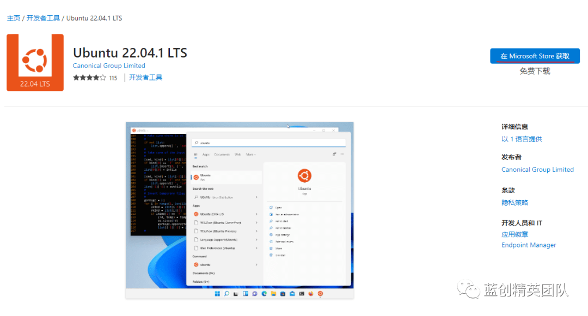
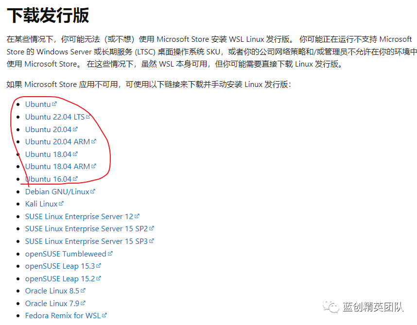
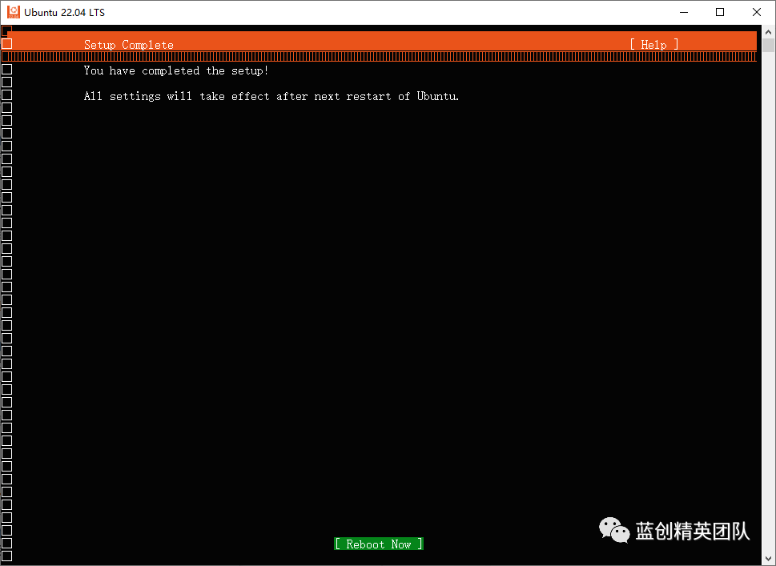

# Docker 系列之 DockerDesktop 初步安装 

2022-09-20 07:36

> Docker 是一个开源的应用容器引擎，让开发者可以打包他们的应用以及依赖包到一个可移植的镜像中，然后发布到任何流行的 Linux 或 Windows 操作系统的机器上，也可以实现虚拟化。容器是完全使用沙箱机制，相互之间不会有任何接口。

> 用简单的话来讲，它就是一个轻量级的虚拟机，类似于 VMware Workstation 和 VirtualBox 的轻量版，没有那么重(Docker 只有几十 M 左右，虚拟机都上 G 的大小)，当然，对于 linux 系统来讲，它就是基于 linux 自身的一个虚拟机，所以，启动快，运行也快，但是，资源（cpu，内存，网络，存储）都是隔离的，现在 Windows 也有这样的概念吧，它就是容器，应该跟 Docker 是一个概念，所以，现在有 Linux 容器和 Windows 容器两种容器(Windows 的容器太大，我试了都几个 G)。

> DockerDesktop，不仅仅可以在 Windwos(Win10++)安装，其实现在也可以在 MAC 和 Linux 里安装，参考地址[1]。

> 开发的时候，用 Visual Studio 2022 之类的 IDE 是可以把服务直接运行到 Docker 服务里的，所以，在开发的机器上安装一个适用的 Docker，在日常工作中，也是十分的方便的。

> 特别是，我想安装一个数据库，又想安装一个 Redis 和 Nginx，但是，又不想它们与我的系统之间有太多的交叉联系，那么，就可以用 Docker 来实现这些服务的隔离，不用了，直接结束了就好，省的，它还在后台一直运行(类似，Mysql)。

> 所以，从隔离性上来讲，Docker 是一个很方便的服务，用着也方便。

DockerDestop 的安装

分为两个步骤，第一个是设置好 WSL2 的环境，第二个就是下载 DockerDesktop 应用。

设置好 WSL2 (Windows Subsystem for Linux) 的环境(Windows 子系统和 hyper-v)

windows 桌面端的 docker 是基于 Windows 子系统(WSL2)的，所以，得把这个功能从控制面板里打开(Hyper-v不开启也是可以的)。

同时要打开的还有 Hyper-V 功能。（注：最新版的 VMware Workstation 是可以与 Hyper-V 共存的）

配置后，会重启电脑，按照提示保存好重要的资料，重启即可。

也可以通过以下 PowerShell 或 CMD 命令来实现

Enable-WindowsOptionalFeature -Online -FeatureName VirtualMachinePlatform

Enable-WindowsOptionalFeature -Online -FeatureName Microsoft-Windows-Subsystem-Linux

开启了功能后，还是需要安装具体的 linux 系统，我这边是通过 Microsoft Store 里搜索 Ubuntu 22.04 LTS 进行安装的， Ubuntu 22.04 LTS 是通过控制台方块字进行操作的，也可以下载 Ubuntu 20.04 LTS 版本或者 18 版本。

如果 Microsoft Store 打不开，或者太慢，也可以通过链接通过迅雷等工具下载，速度也挺快，

地址就在参考地址里(参考地址[2])。

运行后，就到了这个界面

然后选择，所需的语言，我直接选中文了。

然后，选择，账号和密码，自己设置一个

然后，就是所挂载的目录，默认就可以了。

然后，开始应用你自己的更改，开始安装了。

安装完毕，然后，重启

安装成功，欧耶

至此，WSL 已经安装成功了，但是，还要设置成 WSL2 模式,可以通过以下命令。

wsl //进去子系统，也就是从cmd进入到 linux的 bin命令行

wsl -l -v //查看所有安装的子系统，可以有多个

wsl -s name // wsl -s ubuntu 设置 ubuntu为默认子系统

wsl -- set- default-version X // wsl --set-default-version 2 设置默认系统为 2也就是WLS2

wsl -- set-version ubuntu X // wsl --set-version ubuntu 2 设置指定子系统版本为2

wsl --status //查看当前子系统状态

wsl --list --verbose // 可简写为 wsl -l -v，非常常用！

wsl --unregister ubuntu // 移除某个子系统

先执行以下命令

wsl -- set- default-version 2

通过查询命令可以看到，已经开启了 wsl2 功能

安装 DockerDesktop 应用服务

可以直接在链接[1]主页进行下载。

直接就开始解压了。

直接就安装完成了

桌面有快捷方式，直接双击打开即可。

我直接就接受了

默认开始启动（启动的时候，如果有报错，可以复制报错信息到网上搜一下，大部分都是没有配置好导致的，也可以从头到尾再来一遍）

现在已经安装OK了。

现在这个版本还有引导页

step1

step2

step3

step4

至此，DockerDesktop Windows版，已经安装完毕了。

配置镜像地址

大部分用户都是中国的用户，所以，还是需要更改一下镜像地址为国内，这样，下载镜像速度会快许多，当然，如果有科技，那另说。

修改配置内容为 下面的内容即可

{

"builder": {

"gc": {

"defaultKeepStorage": "20GB",

"enabled": true

}

},

"experimental": false,

"features": {

"buildkit": true

},

"registry-mirrors": [

"https://hub-mirror.c.163.com",

"https://1rlt72n0.mirror.aliyuncs.com",

"https://registry.docker-cn.com",

"https://mirror.ccs.tencentyun.com",

"https://mirror.baidubce.com"

]

} 用docker 运行起来一个应用服务

docker run -p 3306: 3306--name mysql -v /d/dockerConfig/mysql/data:/ var/lib/mysql -v /d/dockerConfig/mysql/config:/etc/mysql/conf.d -e MYSQL_ROOT_PASSWORD= 123456-d mysql

此命令会把存储的数据映射到本地D盘，防止数据丢失，因为运行在docker里，docker没了，数据就没了。

直接控制台执行即可.

没有镜像，它会直接从hub.docker.com上拉取，然后，运行起来，如果本地有镜像，就会直接用本地的

红线的那一行是容器ID，至此服务已经运行起来了，我们也可以通过 DockerDesktop 应用查看.

可以看到容器里已经有了mysql服务,

这个容器界面可以对容器进行，删除，暂停，启动，以及进入到容器内部的命令控制台里。

当然，直接选中此容器，就会查看容器运行的日志信息。

控制台信息

日志信息

端口映射，网络，等信息

查看当前应用的状态等信息

镜像里也有mysql镜像了，下一次使用，就不用重新下载镜像了

通过Dbeaver 连接 Mysql

可以连接上，还是上次我存储的数据，数据也米有丢失。

总结

一直想写个关于Docker相关的文，这次写的比较完善了，如果捋不顺，那就按照官方的来。

Docker的潜力，不仅仅在于开发侧，我个人认为在应用侧也有它的潜力，毕竟，现在Win10++系统也不少，那么，每个系统如果都有docker，那完全可以玩着游戏，玩docker，甚至可以windows端docker 分布式和集群的支持。让一个算力复杂的任务，分配给多个闲散客户端主机，成为可能。

阅

一键三连呦！，感谢大佬的支持，您的支持就是我的动力!

参考资料地址

[1] https://www.docker.com/

[2] https://learn.microsoft.com/zh-cn/windows/wsl/install-manual#step-4---download-the-linux-kernel-update-package[返回搜狐，查看更多](http://www.sohu.com/?strategyid=00001&spm=smpc.content.content.2.1688732801880fZustaI)