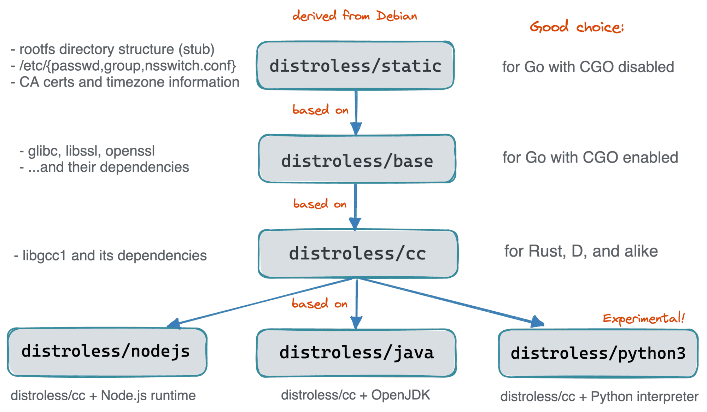

## Distroless容器镜像

https://github.com/GoogleContainerTools/distroless


GoogleContainerTools 的 [distroless基础镜像](https://github.com/GoogleContainerTools/distroless)经常被称为生产小型（er）、快速（er）和安全（r）容器的方法之一。


“Distroless”镜像仅包含您的应用程序及其运行时依赖项。它们不包含包管理器、shell 或您希望在标准 Linux 发行版中找到的任何其他程序。


**为什么要使用 distroless 镜像？**

将运行时容器中的内容限制为您的应用程序所必需的内容是 Google 和其他技术巨头采用的最佳实践，这些技术巨头已在生产环境中使用容器多年。它提高了扫描器（例如 CVE）的信噪比，并减轻了根据您的需要确定出处的负担。


Distroless 镜像非常小：

最小的 distroless 映像：gcr.io/distroless/static-debian11大约 2 MiB。

这大约是alpine(~5 MiB) 大小的 50%，不到debian(124 MiB) 大小的 2%。


**以下产品正在使用distroless**


- \- Kubernetes (for its service containers)
- \- Kubebuilder (for the operator's deployment)
- \- Knative
- \- Jib 和ko!


**第一个 distroless 镜像 - distroless/static**

Distroless 背后的想法非常简单 - 制作一堆最小可行的基础镜像（使它们尽可能接近零）并自动化创建过程。

熟悉项目产品的一个很好的起点是无发行[版/静态](https://github.com/GoogleContainerTools/distroless/blob/d959ed9faa10bdf41e96e13123f1d4b9980fd343/base/README.md)基础镜像：


```
$ docker pull gcr.io/distroless/**static** # Inspect it with github.com/wagoodman/dive $ dive gcr.io/distroless/**static** 
```


dive输出告诉我们：


- 该镜像是基于 Debian 的（但实际上与原始发行版相比并没有多少）。
- 它只有约 2MB大，并且只有一层（非常棒）。
- 里面有一个类似 Linux 发行版的目录结构。
- 、/etc/passwd和/etc/groupeven/etc/nsswitch.conf文件都存在。
- 证书和时区数据库似乎也已经到位。
- 最后但并非最不重要的一点是，许可证似乎得到了保留（但我不是专家）。

就是这样！所以，它是99.99%的静态资产（嗯，有一个tzconfig可执行文件）。没有包，没有包管理器，甚至没有libc的痕迹！


**第二个 distroless 镜像 - distroless/base**

如果您的程序是静态链接的 Go 二进制文件，则该distroless/static图像听起来像是基础图像的完美选择。但是如果你必须使用 CGO 怎么办？或者你用 Rust、C 或任何其他对静态构建的支持不如 Go 完美的编译语言编写的程序呢？

使用[distroless/base](https://github.com/GoogleContainerTools/distroless/blob/main/base/README.md)：


```
$ docker pull gcr.io/distroless/base $ dive gcr.io/distroless/base 
```


dive输出告诉我们什么：


- 它比distroless/static（但仍然只有~20MB）大 10 倍。
- 它有两层（和第一层IS distroless/static）。
- 第二层带来了大量的共享库——最著名的是libc和openssl。
- 同样，没有典型的 Linux 发行版大。


**第三个 distroless 镜像 - distroless/cc**

出于某种原因，Rust 对 有运行时libgcc依赖，而它不存在于上述第二个distroless镜像容器中。

这种依赖关系非常普遍，因此有了一个单独的基础镜像 - [distroless/cc](https://github.com/GoogleContainerTools/distroless/blob/d959ed9faa10bdf41e96e13123f1d4b9980fd343/cc/README.md)：


```
$ docker pull gcr.io/distroless/cc $ dive gcr.io/distroless/cc 
```


dive输出告诉我们：


- 这是一个三层图像（基于distroless/base），
- 新层只有约 2MB大。
- 新层包含libstdc++一堆静态资源，甚至还有一些 Python 脚本（但没有 Python 本身）！


**解释型或基于 VM 的语言的基础映像**

某些语言（如 Python）需要解释器才能运行脚本。其他一些（如 JavaScript 或 Java）需要完整的运行时（如 Node.js 或 JVM）。由于目前考虑的 distroless 映像缺少包管理器，因此向它们添加 Python、OpenJDK 或 Node.js 可能会有问题。

幸运的是，distroless 项目似乎支持开箱即用的最流行的运行时：


- [Java 11 和 17](https://github.com/GoogleContainerTools/distroless/blob/d959ed9faa10bdf41e96e13123f1d4b9980fd343/java/README.md)
- [Node.js 14 & 16 & 18](https://github.com/GoogleContainerTools/distroless/blob/d959ed9faa10bdf41e96e13123f1d4b9980fd343/nodejs/README.md)
- [Python 3](https://github.com/GoogleContainerTools/distroless/blob/d959ed9faa10bdf41e96e13123f1d4b9980fd343/experimental/python3/README.md)（实验性）

上面的基础镜像构建在distroless/cc镜像之上，添加了额外的一两层以及相应的运行时或解释器。


这是最终图像层次结构的样子：





# Documentation for `gcr.io/distroless/java`

## Image Contents

This image contains a minimal Linux, OpenJDK-based runtime.

Specifically, the image contains everything in the [base image](https://github.com/GoogleContainerTools/distroless/blob/d959ed9faa10bdf41e96e13123f1d4b9980fd343/base/README.md), plus:

- OpenJDK 11 (`gcr.io/distroless/java11-debian11`) and its dependencies.
- OpenJDK 17 (`gcr.io/distroless/java17-debian11`) and its dependencies.

## Usage

The entrypoint of this image is set to the equivalent of "java -jar", so this image expects users to supply a path to a JAR file in the CMD.


 Documentation for `gcr.io/distroless/nodejs`

## Image Contents

These images contain a minimal Linux, Node.js-based runtime. The supported versions match the [Node.js LTS releases](https://nodejs.org/en/about/releases/).

Specifically, these images contain everything in the [base image](https://github.com/GoogleContainerTools/distroless/blob/d959ed9faa10bdf41e96e13123f1d4b9980fd343/base/README.md), plus one of:

- Node.js v14 (`gcr.io/distroless/nodejs:14`) and its dependencies.
- Node.js v16 (`gcr.io/distroless/nodejs:16`) and its dependencies.
- Node.js v18 (`gcr.io/distroless/nodejs:18`) and its dependencies.

**Note:** the `latest` tag maps to Node.js v18 to follow the official node docker images. However we recommend that users of these images should explicitly set the LTS version tag they wish to use.

## Usage

The entrypoint of this image is set to "node", so this image expects users to supply a path to a .js file in the CMD.

See the Node.js [Hello World](https://github.com/GoogleContainerTools/distroless/blob/d959ed9faa10bdf41e96e13123f1d4b9980fd343/examples/nodejs) directory for an example.

