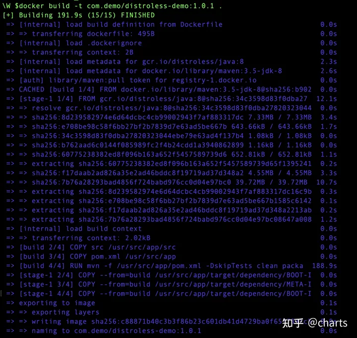
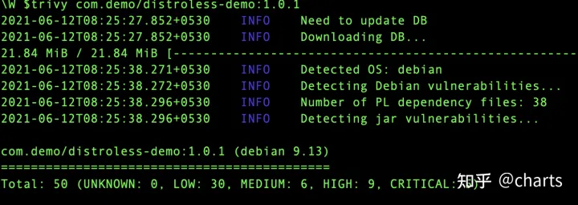
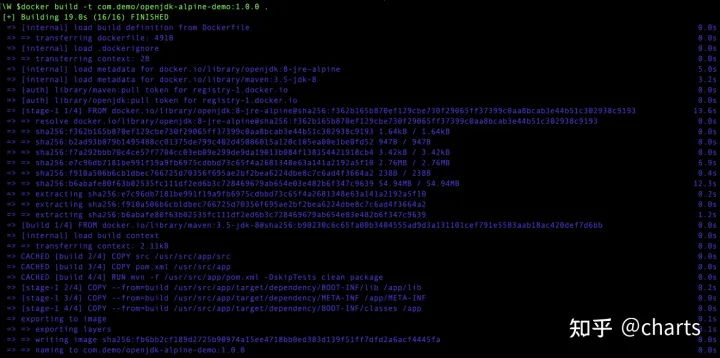
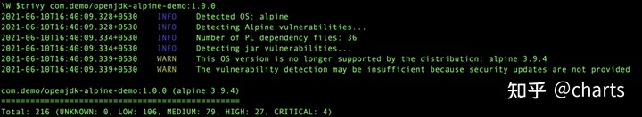

## 使用哪个容器镜像Distroless还是Alpine

```
这是一个实验来更好地理解这一点
```

如今你，用于应用程序开发和部署的 spring 容器非常普遍。

```
虽然容器确实带来了很多价值，但它们也带来了一些挑战，例如——
更大的镜像意味着增加构建时间，以及增加成本
镜像中包含的更多库可以增加漏洞扫描工具的范围
等等。
```

这个问题最常见的解决方案是——使用较小的发行版！

使用像 Alpine 这样的轻量级发行版是开发人员中一种非常常见的技术，以避免使容器镜像变得庞大。即使您可以实现这一点，也始终存在由底层库引起的开放漏洞的风险。

谷歌通过引入 **「Distroless」** 镜像解决了这个问题。

“Distroless”镜像仅包含您的应用程序及其运行时依赖项。它们不包含您希望在标准 Linux 发行版中找到的包管理器、shell 或任何其他程序。

看完高拉夫·阿加瓦尔关于如何使用 Distroless Docker 镜像强化容器的故事

```
https://betterprogramming.pub/how-to-harden-your-containers-with-distroless-docker-images-c2abd7c71fdb
```

现在我们决定尝试一下 在本文中，我将使用 Distroless 和 Alpine 镜像创建一个 Java 应用程序容器，在两者上运行漏洞扫描，并比较构建时间、镜像大小等内容。

让我们开始吧。

### **使用 Distroless 图像**

我为此实验创建了一个简单的 Hello World Spring Boot Java 应用程序。

首先，我创建了一个Dockerfile使用 Distroless 的镜像，如下所示——

```text
FROM maven:3.5-jdk-8 AS build
COPY src /usr/src/app/src
COPY pom.xml /usr/src/app
RUN mvn -f /usr/src/app/pom.xml clean package
FROM gcr.io/distroless/java:8
ARG DEPENDENCY=/usr/src/app/target/dependency
COPY --from=build ${DEPENDENCY}/BOOT-INF/lib /app/lib
COPY --from=build ${DEPENDENCY}/META-INF /app/META-INF
COPY --from=build ${DEPENDENCY}/BOOT-INF/classes /app
ENTRYPOINT ["java","-cp","app:app/lib/*","DemoApplication.Application"]
```

构建完成，如下图所示——



然后我使用Trivy运行镜像扫描。 `https://github.com/aquasecurity/trivy` 结果如下图——



### **使用Alpine镜像**

接下来，我使用 Alpine 基础镜像重复了该实验。在Dockerfile该实验如下所示-

```dockerfile
FROM maven:3.5-jdk-8 AS build
COPY src /usr/src/app/src
COPY pom.xml /usr/src/app
RUN mvn -f /usr/src/app/pom.xml clean package
FROM openjdk:8-jre-alpine
ARG DEPENDENCY=/usr/src/app/target/dependency
COPY --from=build ${DEPENDENCY}/BOOT-INF/lib /app/lib
COPY --from=build ${DEPENDENCY}/BOOT-INF/classes /app
COPY --from=build ${DEPENDENCY}/META-INF /app/META-INF
ENTRYPOINT ["java","-cp","app:app/lib/*","DemoApplication.Application"]
```

构建成功完成——




然后我对这个镜像进行了 Trivy 扫描，结果如下——



### **头对头比较**

基于这个实验，这是我在我的环境中观察到的——

`镜像大小`— 使用 Alpine 基础镜像编译的镜像为93.5 MB，而 distroless 镜像为139 MB。因此，与 distroless 镜像相比，Alpine 镜像更轻巧。

`漏洞数量`——Alpine 镜像共有：216 个漏洞（未知：0，低：106，中：79，高：27，关键：4）而 Distroless Image 共有：50 个漏洞（未知：0，低） : 30, 中: 6, 高: 9, 关键: 5)

总而言之，如果您更关心安全性，那么当然建议使用 Distroless 镜像。如果您担心镜像尺寸大小，那么 Alpine 可能是更好的选择。 你可以在这里找到这个实验的完整代码——

**「[https://github.com/deshpandetanmay/distroless](https://github.com/deshpandetanmay/distroless)」**

