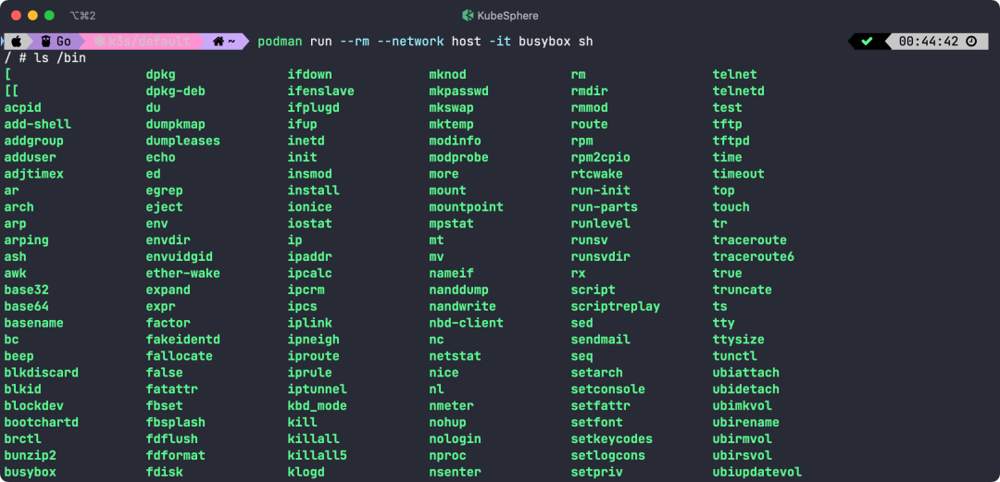
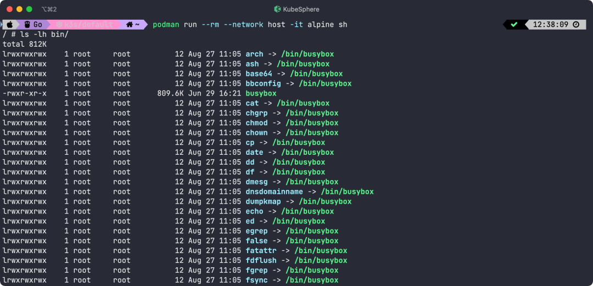
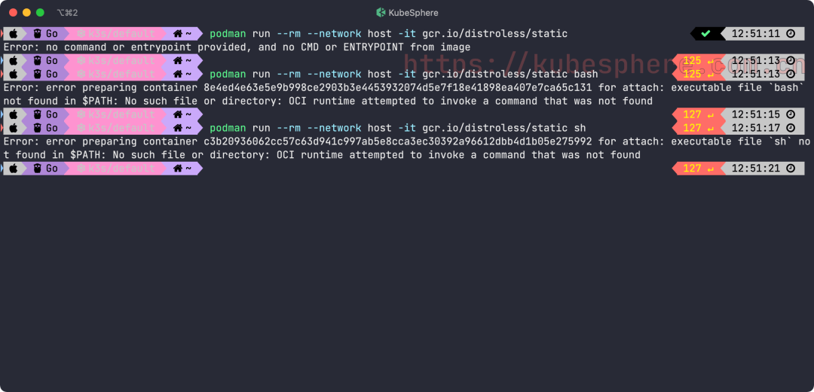

# 容器基础镜像的选择 Alpine、Busybox、Distroless 

大多数情况下，我们构建容器镜像时选择的基础镜像无外乎是 `busybox`、`alpine` 和 `google/distroless` 这几种，这几个基础镜像在云原生的世界很吃香，被广泛应用于各个应用的容器化。

那么问题来了，为什么这几个基础镜像如此受欢迎呢？

我们先来看下这几个基础镜像的大小：

```bash
🐳  → podman image ls 
REPOSITORY                 TAG         IMAGE ID      CREATED       SIZE
docker.io/library/alpine   latest      14119a10abf4  6 days ago    5.87 MB
docker.io/library/busybox  latest      42b97d3c2ae9  13 days ago   1.46 MB
gcr.io/distroless/static   latest      e0851a4aa136  51 years ago  3.06 MB
```

可以看到这些镜像的体积都非常小，几乎可以忽略不计。

## Busybox

先启动一个 Busybox 容器进去一探究竟：



这个镜像的大小只有 `1.24MB`，确容纳了这么多 GNU 命令，麻雀虽小五脏俱全啊，这到底是怎么做到的？

事实上这一切都要归功于 `Multi-Call binary`。什么是 `Multi-Call binary` 呢？

顾名思义，Multi-Call binary 就是**多重调用二进制文件**，是一个用C语言编写的程序，它允许多次调用来执行二进制文件。它包含了很多函数，每个执行独特动作的函数都可以通过一个名字来调用，这个名字同时也是 Multi-Call binary 的一个符号链接。Multi-Call binary 最好的应用范例便是 Busybox。


Busybox 里面的函数可以通过两种方式来调用：

- `busybox ls`
- `ls`

例如：


Busybox 容器

很明显，这些不是我们所熟知的 GNU 二进制文件，因为所有的二进制文件都具有相同的属性，比如大小、日期等。这些都不是独立的二进制文件，而是 Multi-Call binary 每个调用函数的别名。这个 Multi-Call binary 就叫 `Busybox`。

遗憾的是，这些 Busybox 命令并不完全等同于 GNU 命令，某些命令的某些参数是无法执行的，相当于阉割版。

## Alpine

看完了 Busybox，我们再来看看 Alpine 是怎么做的。



巧了，Alpine 的二进制文件竟然是指向 busybox 二进制文件的，这就很明显了，Alpine 镜像的底层使用了 busybox 二进制文件。除此之外，Alpine 还包含了 `apk` 包管理器和一些额外的可执行文件，所以 Alpine 镜像的体积才会比 Busybox 大。

## Distroless

`Distroless` 就不用说了，它来自 Google[1]。该镜像几乎就是空的，只包含应用程序及其运行时所需的依赖，不包含软件包管理器、shell 和其他 GNU 二进制文件，当然还包含一些时区配置和部分 ca-certificates。



可以看到这个镜像中既没有 `shell` 也没有 `bash`，为了一探究竟，可以先把镜像保存为 tar 包，然后把 `rootfs` 解压出来：

```go
🐳  → mkdir image
🐳  → tar xvf distroless.tar.gz -C image/
16679402dc206c982b5552ab8de7d898547100e5468be29d4f67d393c0eadfdb.tar
e0851a4aa13657fc8dcd01e0e5e08cb817123ccb82e2c604b34f9ec9c1755e3f.json
2e18de03719583329b7fa8374130e57cc7cddf2b5a487fe4a4988622ca60575c/layer.tar
2e18de03719583329b7fa8374130e57cc7cddf2b5a487fe4a4988622ca60575c/VERSION
2e18de03719583329b7fa8374130e57cc7cddf2b5a487fe4a4988622ca60575c/json
manifest.json
repositories
 
🐳  → cd image
🐳  → ls -lh
total 3.0M
-r--r--r--. 1 root root 3.0M Jan  1  1970 16679402dc206c982b5552ab8de7d898547100e5468be29d4f67d393c0eadfdb.tar
drwxr-xr-x. 2 root root   50 Sep  3 17:42 2e18de03719583329b7fa8374130e57cc7cddf2b5a487fe4a4988622ca60575c
-r--r--r--. 1 root root  462 Jan  1  1970 e0851a4aa13657fc8dcd01e0e5e08cb817123ccb82e2c604b34f9ec9c1755e3f.json
-r--r--r--. 1 root root  213 Jan  1  1970 manifest.json
-r--r--r--. 1 root root  106 Jan  1  1970 repositories
 
🐳  → mkdir rootfs
🐳  → tar xf 16679402dc206c982b5552ab8de7d898547100e5468be29d4f67d393c0eadfdb.tar -C rootfs
 
🐳  → tree rootfs
rootfs
├── bin
├── boot
├── dev
├── etc
│   ├── debian_version
│   ├── default
│   ├── dpkg
│   │   └── origins
│   │       └── debian
│   ├── group
│   ├── host.conf
│   ├── issue
│   ├── issue.net
│   ├── nsswitch.conf
│   ├── os-release
│   ├── passwd
│   ├── profile.d
│   ├── protocols
│   ├── rpc
│   ├── services
│   ├── skel
│   ├── ssl
│   │   └── certs
│   │       └── ca-certificates.crt
│   └── update-motd.d
│       └── 10-uname
├── home
│   └── nonroot
├── lib
├── proc
├── root
├── run
├── sbin
├── sys
├── tmp
├── usr
│   ├── bin
│   ├── games
│   ├── include
│   ├── lib
│   │   └── os-release
│   ├── sbin
│   │   └── tzconfig
│   ├── share
│   │   ├── base-files
│   │   │   ├── dot.bashrc
│   │   │   ├── dot.profile
│   │   │   ├── dot.profile.md5sums
│   │   │   ├── info.dir
│   │   │   ├── motd
│   │   │   ├── profile
│   │   │   ├── profile.md5sums
│   │   │   └── staff-group-for-usr-local
...
...
```

该镜像只有一层，大小为 3MB，也没有二进制文件，只有一些证书文件和目录。如果向下滚动，还能看到许可证和时区配置。看来 Distroless 采取的是非常极端的手段，直接把不需要的二进制文件全部抛弃了，只留下一个空镜像和部分必需品。

## 总结

由此看来，这几个基础镜像如此受欢迎的主要原因就是体积小。镜像越小，漏洞就越少，可攻击面也会大幅减少，而且很容易维护。所以大家构建镜像时尽量选择这些镜像作为基础镜像。

### 引用链接

[1]

Google: *https://github.com/GoogleContainerTools/distroless