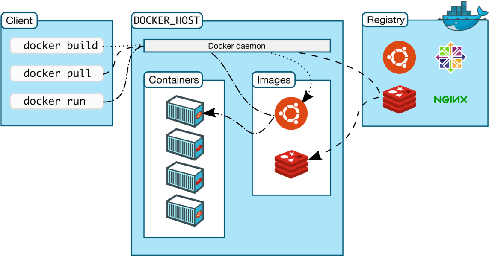
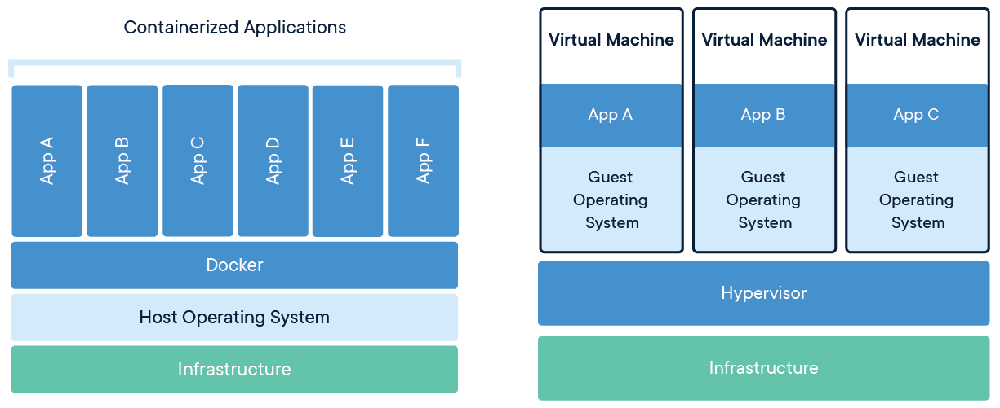

# Docker架构

K8S：CRI（Container Runtime Interface）

Client： 客户端；操作docker服务器的客户端（命令行或者界面）

Docker_Host：Docker主机；安装Docker服务的主机

Docker_Daemon：后台进程；运行在Docker服务器的后台进程

Containers：容器；在Docker服务器中的容器（一个容器一般是一个应用实例，容器间互相隔离）

Images：镜像、映像、程序包；Image是只读模板，其中包含创建Docker容器的说明。容器是由Image运行而来，Image固定不变。

Registries：仓库；存储Docker Image的地方。官方远程仓库地址： https://hub.docker.com/search

Docker用Go编程语言编写，并利用Linux内核的多种功能来交付其功能。 Docker使用一种称为名称空间的技术来提供容器的隔离工作区。 运行容器时，Docker会为该容器创建一组名称空间。 这些名称空间提供了一层隔离。 容器的每个方面都在单独的名称空间中运行，并且对其的访问仅限于该名称空间。  

| Docker            | 面向对象     |
| ----------------- | ------------ |
| 镜像（Image）     | 类           |
| 容器（Container） | 对象（实例） |

容器与虚拟机  

