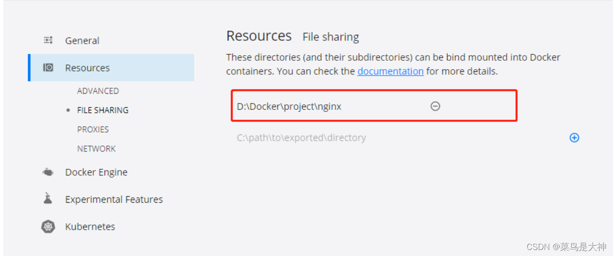
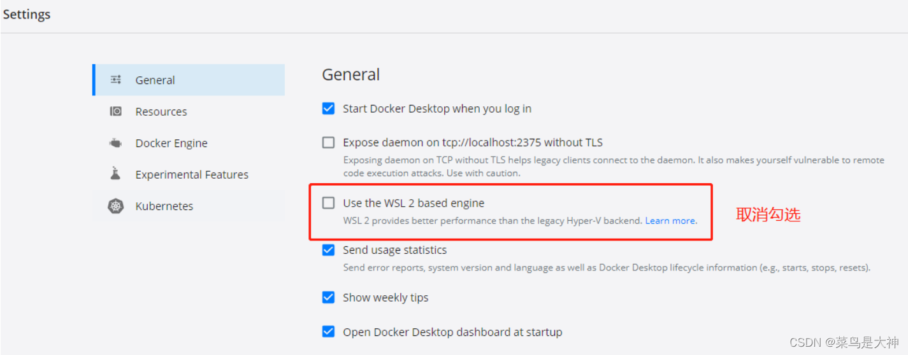
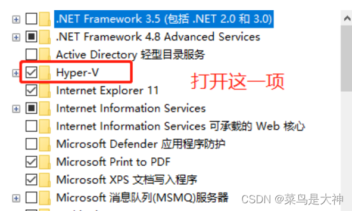
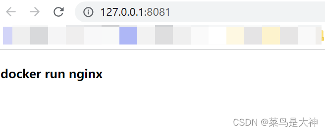

# 在windows中使用docker搭建nginx


### 1.拉取nginx镜像

```bash
docker pull nginx
```


### 2.运行容器

```bash
docker run -d -p 80:80 --name nginx nginx
```


### 3.本地磁盘创建nginx目录

```bash
D:\develop\docker\volume\nginx
```

创建3个子目录

```bash
config
html
log
```


### 4.复制docker中的nginx配置文件

查看运行的容器

```bash
docker ps -a
```

```bash
CONTAINER ID   IMAGE          COMMAND                  CREATED          STATUS          PORTS                NAMES
ac33ee2f18f2   nginx:latest   "/docker-entrypoint.…"   43 seconds ago   Up 42 seconds   0.0.0.0:80->80/tcp   nginx
```

进入容器

```bash
docker exec -it ac33ee2f18f2 /bin/bash
```

退出

```
exit
```

注意路径分隔符使用 `/` 或者 `\\`

```bash
docker cp ac33ee2f18f2:/etc/nginx/nginx.conf D:/develop/docker/volume/nginx/config/nginx.conf
```


### 5.停止刚启动的nginx容器

```bash
docker stop ac33ee2f18f2
```

```bash
docker rm ac33ee2f18f2
```


### 6.启动一个新的nginx容器，并将容器中的配置目录挂载到本地磁盘的目录中

```bash
docker run -d -p 80:80 --name my-nginx -v D:/develop/docker/volume/nginx/html:/usr/share/nginx/html -v D:/develop/docker/volume/nginx/config/nginx.conf:/etc/nginx/nginx.conf -v D:/develop/docker/volume/nginx/log:/var/log/nginx nginx:latest
```


运行报错，是因为没有设置可以挂载的目录



 如果没有FILE SHARING是因为是SWL2模式运行的docker，这里要更改为虚拟机



 

 再次运行就OK了

在 D:\develop\docker\volume\nginx\html 目录中新建index.html


```html
<!DOCTYPE html>
<html>
<head>
    <title>docker run nginx</title>
</head>
<body>
    <h4>docker run nginx</h4>
</body>
</html>
```


本地浏览器访问 http://localhost:80



 