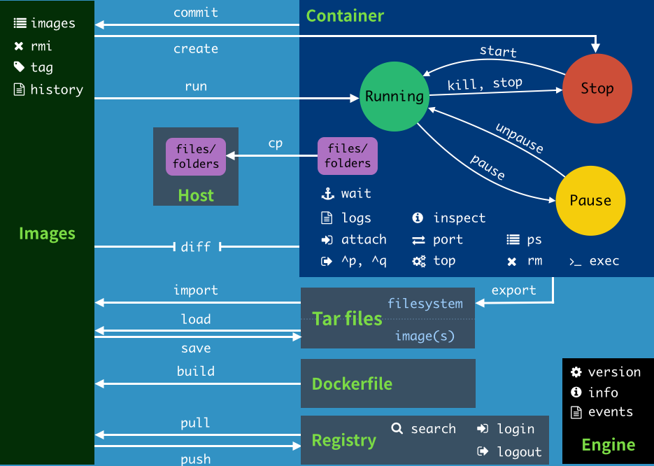
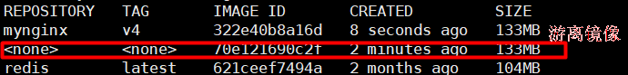

# Docker命令

[toc]

所有Docker命令手册

https://docs.docker.com/engine/reference/commandline/docker/


## 1 常见命令列表

| 命令      | 作用                                                         |
| --------- | ------------------------------------------------------------ |
| attach    | 绑定到运行中容器的 标准输入, 输出,以及错误流（这样似乎也能进入容器内容，但是一定小心，他们操作的就是控制台，控制台的退出命令会生效，比如redis,nginx...） |
| build     | 从一个 Dockerfile 文件构建镜像                               |
| commit    | 把容器的改变 提交创建一个新的镜像                            |
| cp        | 容器和本地文件系统间 复制 文件/文件夹                        |
| create    | 创建新容器，但并不启动（注意与docker run 的区分）需要手动启动。start\stop |
| diff      | 检查容器里文件系统结构的更改【A：添加文件或目录 D：文件或者目录删除 C：文件或者目录更改】 |
| events    | 获取服务器的实时事件                                         |
| exec      | 在运行时的容器内运行命令                                     |
| export    | 导出容器的文件系统为一个tar文件。commit是直接提交成镜像，export是导出成文件方便传输 |
| history   | 显示镜像的历史                                               |
| images    | 列出所有镜像                                                 |
| import    | 导入tar的内容创建一个镜像，再导入进来的镜像直接启动不了容器。/docker-entrypoint.sh nginx -g 'daemon ow;'docker ps --no-trunc 看下之前的完整启动命令再用他 |
| info      | 显示系统信息                                                 |
| inspect   | 获取docker对象的底层信息                                     |
| kill      | 杀死一个或者多个容器                                         |
| load      | 从 tar 文件加载镜像                                          |
| login     | 登录Docker registry                                          |
| logout    | 退出Docker registry                                          |
| logs      | 获取容器日志；容器以前在前台控制台能输出的所有内容，都可以看到 |
| pause     | 暂停一个或者多个容器                                         |
| port      | 列出容器的端口映射                                           |
| ps        | 列出所有容器                                                 |
| pull      | 从registry下载一个image 或者repository                       |
| push      | 给registry推送一个image或者repository                        |
| rename    | 重命名一个容器                                               |
| restart   | 重启一个或者多个容器                                         |
| rm        | 移除一个或者多个容器                                         |
| rmi       | 移除一个或者多个镜像                                         |
| run       | 创建并启动容器                                               |
| save      | 把一个或者多个镜像保存为tar文件                              |
| search    | 去docker hub寻找镜像                                         |
| start     | 启动一个或者多个容器                                         |
| stats     | 显示容器资源的实时使用状态                                   |
| stop      | 停止一个或者多个容器                                         |
| tag       | 给源镜像创建一个新的标签，变成新的镜像                       |
| top       | 显示正在运行容器的进程                                       |
| unpause   | pause的反操作                                                |
| update    | 更新一个或者多个docker容器配置                               |
| version   | Show the Docker version information                          |
| container | 管理容器                                                     |
| image     | 管理镜像                                                     |
| network   | 管理网络                                                     |
| volume    | 管理卷                                                       |


## 2 Docker命令的关系图



正向过程 : 根据镜像启动一个容器  docker run

反向过程: 根据正在运行的容器制作出相关的镜像 docker commit


有了Docker： 

1、先去软件市场 docker hub 搜镜像：https://registry.hub.docker.com/

2、下载镜像 docker pull xxx

3、启动软件 docker run 镜像名；


对于镜像的所有管理操作都在这一个命令：docker image --help

docker images == docker image ls


镜像必须要有标签

docker pull redis == docker pull redis:latest（最新版）

阿里云的镜像是从docker hub来的，我们配置了加速，默认是从阿里云（缓存）下载, 阿里云的镜像是从dockerhub上拉取的

下载默认版本(latest)

```bash
docker pull redis
```

下载指定版本

```bash
docker pull redis:5.0.12-alpine3.13
```

查看镜像:

```bash
docker image ls
```

```bash
REPOSITORY（名） TAG （标签）        IMAGE ID（镜像id） CREATED（镜像的创建时间） SIZE
redis           5.0.12-alpine3.13  50ae27fed589     6 days ago             29.3MB
redis           latest             621ceef7494a     2 months ago           104MB
```

从上面可以看到 redis:latest 的大小为 104MB 而 redis:5.0.12-alpine3.13 只有 29.3MB , 差距很大, 原因是什么?


镜像是怎么做成的? 

基础环境+软件


redis的完整镜像应该是： linux系统+redis软件

alpine：超级精简版的linux 5.61mb；

redis = 29.0mb

没有alpine3的：就是centos基本版,73.15MB


建议:

以后自己选择下载镜像的时候尽量使用alpine： slim：


常用的基础镜像

```bash
docker pull alpine
docker pull busybox
```

alpine就是基于busybox构建的


删除镜像

先删除镜像关联的容器

```bash
docker rm <container-id>
```

再删除镜像

```bash
docker rmi <image-name>:<tag>
```


批量删除全部镜像

docker images -a 列出全部镜像 -q 只列出镜像的 id

```bash
docker rmi -f $(docker images -aq) 
```


移除游离镜像

```bash
docker image prune
```

提示 This will remove all dangling images . 这里 dangling images 是游离的镜像, 就是没有镜像名的镜像


镜像重命名

```bash
docker tag 原镜像:标签 新镜像名:标签
```


查看所有运行中的容器

```bash
docker ps
```

查看所欲的容易( 不论是否在运行 )

```bash
docker ps -a
```


删除所有容器

docker ps -a 列出所有容器 -q 只输出容器id

```bash
docker rm -f $(docker ps -aq)
```


启动容器

```
docker create [OPTIONS] IMAGE [COMMAND] [ARG...]
```

```
docker create [设置项] 镜像名 [启动] [启动参数...]
```

`[]`内的是可选项, 最少的设置按照redis:latest镜像启动一个容器

```bash
docker create redis
```

添加一些参数

```bash
docker create --name myredis -p 6379:6379 redis
```

--name 给容器分配一个名字 -p / --publish 发布容器的端口到主机, 也就是端口绑定 -p 6379 ( 主机的端口 ) : 6379 ( 容器的端口 )

外部想要访问container中的服务, 首先要访问容器所在主机的端口(主机端口), 而容器本身是一个小型的linux系统, 也有自己的端口, 需要将请求从主机端口转发给容器的端口, 因此需要端口绑定

创建之后查看容器 

```bash
docker ps
```

看不到刚才创建的容器, 原因是此时容器虽然创建了, 但是还没有启动,状态是 Created,  使用命令查看容器

```bash
docker ps -a
```

可以看到刚创建的还未运行的容器


启动容器

```bash
docker start <container-name>
```

或者

```bash
docker start <container-id>
```

其中 container-id 可以不输入完整的, 只需要输入前面的部分, 不与其他的容器相同, 可以区分容器即可

启动之后再使用

```bash
docker ps
```

就可以看到容器, 并且状态为 Up


docker create 只能创建容器, 创建出来的容器还需要使用 docker start 启动 docker stop 停止 docker pause 暂停 docker unpause 继续 等操作


端口说明

例如:

```bash
docker create --name myredis -p 6379（主机的端口）:6379（容器的端口） 
```

其中 redis -p port1:port2 port1哪个是可以重复的? 哪个是必须唯一的?

port1是必须唯一的，port1 是主机的端口, 不能重复占用

port2 是容器内服务使用的端口, 是容器内部所运行的linux系统的端口, 与其他的容器无关, 也与主机无关, 所以不同的容器之间, 这个port2可以重复

绑定多个主机端口

```bash
docker run --name myredis2 -p 6379:6379 -p 8888:6379 redis
```

是可以的, 只要主机端口没有被占用, 可以绑定多个主机端口, 此时外部的redis客户端通过主机的IP + 6379 或者 8888 都可以访问redis服务

这里使用的是 docker run, docker run = docker create + docker start 

docker run 没有 -d 参数默认前台启动, 在终端运行, 终端Ctrl+C或者关闭终端, 容器会立即停止, 所以一般要加一个 -d 参数后台运行


停止容器

是强制kill -9（直接拔电源）；

```bash
docker kill
```

可以允许优雅停机(当前正在运行中的程序处理完所有事情后再停止)

```bash
docker stop
```


查看日志

```bash
docker logs <container-name>
```

如

```bash
docker logs mynginx
```

这样只会一次性展示一部分日志, 一般需要追踪日志,类似于 tail -f

```bash
docker logs -f mynginx
```

如果只查看最后 n 行:

```
docker logs -n 10
```


进入容器

想要进入容器执行命令, 可以使用 

```bash
docker attach <container-id>
```

但是 docker attach 绑定的是控制台. 如果输入了 Ctrl+C等操作可能导致容器停止。这个命令一般不用, 而是使用 docker exec


```bash
docker exec [options] container command [args]
```

常用的option:

-i 以交互模式运行, 输入一个命令, 返回一个相应

-t 重新分配一个 tty 终端

-u 以特性身份进入, 如 -u 0:0 就是 root身份, root组

示例:

```bash
docker exec -it mynginx /bin/bash
```

进入mynginx容器执行 /bin/bash 控制台, 进入容器的控制台之后再使用 exit 退出, 不会导致容器停止

进入容器,可以进行任意操作

```bash
docker exec -it -u 0:0 --privileged mynginx /bin/bash
```

加上 --privileged 以特权方式进入, 可以进行任意操作,   -u 0:0 有一些操作也可能没有权限


查看详情

查看容器详情

```bash
docker inspect <container-name>/<container-id>
```

或者

```
docker container inspect <container-name>/<container-id>
```


查看镜像详情

```bash
docker inspect image <image-name>/<image-id>
```


其他的还有

```bash
docker inspect network / volume ...
```


## docker cp

文件的复制

将容器内的文件复制到主机

```
docker cp [OPTIONS] CONTAINER:SRC_PATH DEST_PATH|-
```

如:

```bash
docker cp mynginx:/etc/nginx/nginx.conf nginx.conf
```


将主机中的文件复制到容器

```bash
docker cp [OPTIONS] SRC_PATH|- CONTAINER:DEST_PATH
```

如:

```bash
docker cp index.html mynginx:/usr/share/nginx/html
```


关于路径:

```bash
SRC_PATH 指定为一个文件
	DEST_PATH 不存在：文件名为 DEST_PATH ，内容为SRC的内容
	DEST_PATH 不存在并且以 / 结尾：报错
	DEST_PATH 存在并且是文件：目标文件内容被替换为SRC_PATH的文件内容。
	DEST_PATH 存在并且是目录：文件复制到目录内，文件名为SRC_PATH指定的名字

SRC_PATH 指定为一个目录
	DEST_PATH 不存在： DEST_PATH 创建文件夹，复制源文件夹内的所有内容
	DEST_PATH 存在是文件：报错
	DEST_PATH 存在是目录
		SRC_PATH 不以 /. 结束：源文件夹复制到目标里面
		SRC_PATH 以 /. 结束：源文件夹里面的内容复制到目标里面

自动创建文件夹不会做递归。把父文件夹做好
```

示例:

```bash
docker cp index.html mynginx4:/usr/share/nginx/html
docker cp mynginx4:/etc/nginx/nginx.conf nginx.conf
```


#### docker diff

比较差异, 比较容器下载后到运行容器到现在的改变,  会检查容器里文件系统结构的更改,会有三种结果【A：添加文件或目录 D：文件或者目录删除 C：文件或者目录更改】 , 如:

```bash
docker diff <container-name> / <container-id>
```

如:

```bash
docker diff mynginx
```

生产环境的容器在运行时可能会产生一些变化, 如果希望这些变化在新容器部署时要应用在新容器中,就需要使用下面的指令


#### docker commit

把容器的改变提交创建一个新的镜像

建议提交容器前先停止容器

```bash
docker stop mynginx
```

停止后还是可以查看修改的

```bash
docker diff mynginx
```

进行提交:

```bash
docker commit -a tom -m "first commit" mynginx my-custom-nginx:v2
```

-a --author 作者信息

-m --message  提交信息

docker commit 底层使用的就是git的commit机制


提交之后再查看 

```bash
docker imags
```

就可以看到新创建的自定义镜像了


修改容器的内容后,再次提交

```bash
docker commit -a tom -m "second commit" mynginx my-custom-nginx:v2
```

此时在查看镜像列表

```bash
docker images
```

就可以看到会有一个 repository 和 tag 都为 `<none>` 的镜像



 这个就是游离镜像 ( dangling images  ), 其实就是之前的 my-custom-nginx:v2 镜像, 但是由于此时又提交了一次, 创建了一个新的 my-custom-nginx:v2 镜像, 之前的镜像就不能再叫做 my-custom-nginx:v2 , 就会自动变成游离镜像了, 没有 name 和 tag 了. 通过

```bash
docker image prune
```

可以清除所有的游离镜像


repository: 同样的名字的镜像, 比如 nginx , 会有很多个版本, 如 v1, v2 ... 所以 nginx 是镜像的repository的名字, nginx:latest 才是完整的镜像的名字


产生镜像

1、基于已经存在的容器，提取成镜像

2、人家给了我tar包，导入成镜像

3、dockerfile构建镜像

​	1)、准备一个文件Dockerfile 

```dockerfile
FROM busybox
CMD ping baidu.com 
```

​	2)、编写Dockerfile 

​	3)、构建镜像

```bash
docker build -t mybusy66:v6 -f Dockerfile .
```


build 和 commit 的区别

docker build 是根据一个Dockerfile构建出镜像

docker commit 是正在运行中的容器提交成一个镜像


容器的状态

Created（新建）、Up（运行中）、Pause（暂停）、Exited（退出）

docker run的立即启动，docker create得稍后自己启动


### 推送镜像

1 在 dockerhub  https://hub.docker.com/ 上注册账号并登录

2 在dockerhub上登录自己的账号, 比如 tom ,并创建一个 mynginx 的仓库, 设置为 public,这一步可选, 不创建仓库, push的时候也会自动创建

3 推送

dockerhub上的镜像的完整路径是 `docker.io/library/nginx:latest` , 其中 library 是docker官方的镜像仓库, 在本地使用 docker images 显示镜像列表时把前缀  docker.io/library 省略了, 默认官方镜像都不显示这个前缀 .  非官方镜像, 比如

```bash
docker pull rediscommander/redis-commander:latest
```

再查看镜像列表 

```bash
docker images
```

可以看到镜像名称为

```bash
docker.io/rediscommander/redis-commander:latest
```

所以自制镜像的完整名称是 docker.io/tom/mynginx:latest 

推送之前要先登录

```bash
docker login
```

根据提示输入用户名和密码, 或者

```bash
docker login -u tom -p xxx
```

注: 如果要登录指定的私有镜像服务:

```bash
docker login registry.harbor.com -u tom -p xxx
```

或者

```bash
docker login 192.168.0.150:30003 -u tom -p xxx
```


登录成功后, 会提示 password 被保存到 `/root/.docker/config.json` 文件中, 

登录之后就会创建一个 docker 会话, 后面使用 docker push 指令都会推送到当前用户的仓库中. 要把镜像推送到仓库, 镜像的名字一定要是全名, 而且要符合正确的格式, `<registry-domain>/<project>/<image-name>:tag`, 如:

docker.io/tom/mynginx:latest

或者

registry.harbor.com/myproject/mynginx:v1.00

或者

192.168.0.150:3003/myproject/mynginx:v1.00


镜像改名:

```bash
docker tag 镜像的旧的名称 镜像的新的名称
```

如:

```bash
docker tag mynginx:latest docker.io/tom/mynginx:latest
```

如果是登录了 dockerhub, 并且向dockerhub推送镜像, 可以省略 docker.io 前缀:

```bash
docker tag mynginx:latest tom/mynginx:latest
```


推送

```
docker push docker.io/tom/mynginx:latest
```

或者

```
docker push tom/mynginx:latest
```


docker hub太慢了，用阿里云的镜像仓库，或者以后的habor仓库  

```bash
docker tag [ImageId] registry.cn-hangzhou.aliyuncs.com/tom/mynginx: [镜像版本号]
```

```bash
docker push registry.cn-hangzhou.aliyuncs.com/tom/mynginx:[镜像版本号]
```

镜像的完整名字格式 : 仓库网址/名称空间(tom/myproject)/仓库名:版本号


镜像的转移

import 和 export

docker export 导出容器的文件系统为一个 tar 文件

docker import 导入 tar 文件内的内容创建一个镜像


示例:

```bash
docker run -d  -P --name=mynginx nginx
```

-P 使用随机端口

查看容器列表, 找到容器id

```bash
docker ps
```

导出:

```bash
docker export -o mynginx.tar <container-id>
```

导出后的 mynginx.tar 可以传输到其他的服务器, 再导入成镜像

```bash
docker import mynginx.tar mynginx:v2.0
```

注意是从 **容器** 中导出, 导入之后是 **镜像**

container -> tar -- 网络传输 / u盘 / ... -> tar -> image


与 `docker commit` 不同 commit是直接提交成镜像,  export+import 中间要转为 tar 文件


注意: 直接使用导入的镜像启动容器

```bash
docker run -d -P --name=mynginx2 mynginx:v2.0
```

 会报错, 无法运行. 原因是通过 export + import 导入的镜像无法直接启动容器 , 需要直到这个容器的启动命令, 这个容器的启动命名与导出的原始容器的启动命令一致.  

查找启动命令

方式1 : 

在原始容器的服务器上执行

```bash
docker inspect <container-id>
```

找到

```json
"Entrypoint":[
	"/docker-entrypoint.sh"
],
//...
"Cmd":[
    "nginx",
    "-g",
    "daemon off;"
]
```

启动命令就是 entrypoint + cmd , 注意: cmd中含有空格的参数加上 `''`

```bash
/docker-entrypoint.sh nginx -g 'deamon off;'
```


方式 2:

在原始容器的服务器上执行

```bash
docker ps --no-trunc
```

--no-trunc 输出的内容不要因为字符串过长而截串

得到原始容器的启动命令:  

```bash
/docker-entrypoint.sh nginx -g 'deamon off;'
```


加上启动命令再次使用导入的镜像启动容器

```bash
docker run -d -P --name=mynginx2 mynginx:v2.0 /docker-entrypoint.sh nginx -g 'deamon off;'
```

这次就可以正常启动了


docker save / docker load

将 **镜像** 导出为 tar 文件, 再将 tar 文件导入为 **镜像**  , image -> tar -- 网络传输 / u盘 / ... --> tar -> image

注意与 export / impo 不同

示例:

```bash
docker save -o busybox.tar busybox:latest
```

可以看到产生的 busybox.tar 文件, 可以一次导出多个镜像

```bash
docker save -o combine.tar busybox:latest redis:latest
```

一般不会这样混用, 建议只导出一个镜像


在另一个服务器中导入

```bash
docker load -i busybox.tar
```

 -i 指定要读取的文件


大部分容器为什么可以长久运行?

原因是容器启动时,容器内启动了一个阻塞进程一直在运行, 这个进程是由镜像内部启动命令指定, 如

```bash
docker run -d --name=mynginx nginx
```

没有指定启动命令, 使用的是默认的启动命令

可以通过

```bash
docker image inspect nginx
```

查看镜像的启动命令,可以找到镜像的 Entrypoint 和 Cmd


由于busybox镜像仅仅是一个linux系统, 不带任何的任务, 所以启动busybox容器没有任何效果, 要想让busybox容器长久运行, 需要给容器加上启动命令让容器启动时执行一个阻塞进程, 如:

```bash
docker run -d --name=mybusybox ping baidu.com
```

此时可以查看busybox的日志

```bash
docker logs -f mybusybox
```


也可以以交互模式启动busybox

```bash
docker run -it busybox
```

但是一旦退出容器内的终端,  容器也就自动停止运行了


## docker build 和 Dockerfile

制作任意镜像


1 准备一个Dockerfile文件 ( 名字可以任取, 一般叫做 Dockerfile )

2 编写 Dockerfile

3 构建镜像


假设要做一个基于busybox不停的 ping baidu.com 的镜像, 可以编写Dockerfile 如下

```dockerfile
# 指定基础镜像 / 基础运行环境
FROM busybox

# 启动之后要执行的任务
CMD ping baidu.com
```

写好了 Dockerfile 之后, 可以使用下面的命令构建镜像

```
docker build -t mybusybox:v1.0 -f Dockerfile ./
```

-t  要构建的镜像

-f Dockerfile 如果当前目录有名为 Dockerfile 的 Dockerfile文件, -f 选项可以省略

`./` 或者 `.` : 上下文环境 / 工作目录


获取事件列表

```bash
docker events
```

