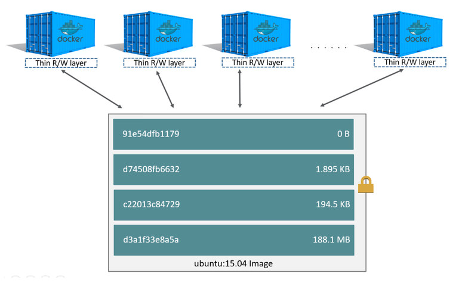
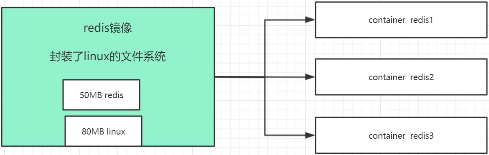

# Docker存储原理

https://docs.docker.com/storage/storagedriver/


问题:

什么是容器?

某个软件完整的运行环境, 包含了一个小型的linux系统.  比如通过 

```bash
docker exec -it <container-id> /bin/bash
```

进入容器后通过执行

```bash
ls
```

命令可以看到容器内部的文件目录结构, 可以看到与linux文件目录一致


问题:

如果通过指令

```bash
docker run -d -P nginx
```

启动 4分nginx容器, 假设一个nginx容器占用磁盘空间20MB, 那么宿主机中此时运行了4个nginx容器, 会占用多少磁盘空间?

80MB?


docker中安装的软件与在宿主机中安装对比有什么优缺点?

优点: docker容器的可移植性 / 便捷性 高于在宿主机中部署 , docker容器还有进程隔离/资源限制

缺点: docker是基于虚拟化的技术,会有约3%左右的性能损失


docker的可移植性是指镜像和容器的可移植性, 在linux系统中制作的镜像,可以在windows版的docker中运行容器, windows版本的docker会自动调用windows系统的API , 但是对于容器的一些设置项, 在windows中是不生效的


镜像和容器

什么是镜像?

镜像 ( image ) : 固定不变的, 一个镜像可以启动很多的容器

容器 ( container ) : 文件系统 ( 比如 log ) 可能经常发生变化, 


docker如何存储镜像?

docker如何存储容器?


## 1 镜像如何存储

https://docs.docker.com/storage/storagedriver/

docker在底层有自己的存储驱动,组织文件内容和关系, docker 的 storage driver , 早期版本有使用 AUFS ( 联合文件系统 ) , 现在已经被废弃 . 现在使用的文件系统是 `OverlayFS` , 驱动是 `overlay2`

https://docs.docker.com/storage/storagedriver/overlayfs-driver/


1、Images and layers

Docker映像由一系列**层( 分层, layers )**组成。 每层 ( layer ) 代表图像的Dockerfile中的一条指令。 除最后一层外的每一层都是只读的。 如以下Dockerfile：

```dockerfile
FROM ubuntu:15.04
COPY . /app
RUN make /app
CMD python /app/app.py
```

该Dockerfile包含四个命令，每个命令创建一个层。

FROM语句从ubuntu：15.04映像创建一个图层开始。

COPY命令从Docker客户端的当前目录添加一些文件。

RUN命令使用make命令构建您的应用程序。

最后，最后一层指定要在容器中运行的命令。

每一层只是与上一层不同的一组。 这些层彼此堆叠。

创建新容器时，可以在基础层之上添加一个新的可写层。 该层通常称为“容器层”。 对运行中的容器所做的所有更改（例如写入新文件，修改现有文件和删除文件）都将写入此薄可写容器层  


2、Container and layers  

容器和镜像之间的主要区别是可写顶层。

在容器中添加新数据或修改现有数据的所有写操作都存储在此可写层中。

删除容器后，可写层也会被删除。 基础图像保持不变。 因为每个容器都有其自己的可写容器层，并且所有更改都存储在该容器层中，所以多个容器可以共享对同一基础映像的访问，但具有自己的数据状态。


下图显示了共享同一Ubuntu 15.04映像的多个容器。  




3、磁盘容量预估  

```bash
docker ps -s
```

size：用于每个容器的可写层的数据量（在磁盘上）。
virtual size：容器使用的用于只读图像数据的数据量加上容器的可写图层大小。

多个容器可以共享部分或全部只读镜像数据。从同一镜像启动的两个容器共享100％的只读数据，而具有不同图像的两个容器（具有相同的层）共享这些公共层。 因此，不能只对虚拟大小进行总计。这高估了总磁盘使用量，可能是一笔不小的数目。


4、镜像如何挑选  

busybox：是一个集成了一百多个最常用Linux命令和工具的软件。linux工具里的瑞士军刀
alpine：Alpine操作系统是一个面向安全的轻型Linux发行版经典最小镜像，基于busybox，功能比Busybox完善。
slim：docker hub中有些镜像有slim标识，都是瘦身了的镜像。也要优先选择

无论是制作镜像还是下载镜像，优先选择alpine类型.


### docker 的 Copy On Write 策略

写时复制是一种共享和复制文件的策略，可最大程度地提高效率。

如果文件或目录位于映像的较低层中，而另一层（包括可写层）需要对其进行读取访问，则它仅使用现有文件。

另一层第一次需要修改文件时（在构建映像或运行容器时），将文件复制到该层并进行修改。 这样可以最小化 I / O 和 每个后续层的尺寸

## The copy-on-write (CoW) strategy

Copy-on-write is a strategy of sharing and copying files for maximum efficiency. If a file or directory exists in a lower layer within the image, and another layer (including the writable layer) needs read access to it, it just uses the existing file. The first time another layer needs to modify the file (when building the image or running the container), the file is copied into that layer and modified. This minimizes I/O and the size of each of the subsequent layers. 


简单的示例:

```bash
vi Dockerfile
```

输入 dockerfile 的内容

```dockerfile
FROM busybox:latest
CMD ping baidu.com
```

构建镜像:

```bash
docker build -t mybusybox:1.0.0 -f Dockerfile .
```


可以通过 

```bash
docker history <image-id> / <image-name>
```

 指令查看镜像的层, 如:

```bash
docker history mybusybox:1.0.0
```

```bash
root@ubuntu-dev:~/tmp# docker history mybusybox:1.0.0
IMAGE          CREATED      CREATED BY                                      SIZE      COMMENT
cc387b544b0c   8 days ago   CMD ["/bin/sh" "-c" "ping baidu.com"]           0B        buildkit.dockerfile.v0
<missing>      8 days ago   /bin/sh -c #(nop)  CMD ["sh"]                   0B
<missing>      8 days ago   /bin/sh -c #(nop) ADD file:7e9002edaafd4e457…   4.26MB
```

```bash
What are the `<missing>` steps?

The `<missing>` lines in the `docker history` output indicate that those steps were either built on another system and part of the `alpine` image that was pulled from Docker Hub, or were built with BuildKit as builder. Before BuildKit, the “classic” builder would produce a new “intermediate” image for each step for caching purposes, and the `IMAGE` column would show the ID of that image. BuildKit uses its own caching mechanism, and no longer requires intermediate images for caching. Refer to [BuildKit](https://docs.docker.com/build/buildkit/) to learn more about other enhancements made in BuildKit.
```

`<missing>` 的层说明是在别的系统中构建的层, 在本机中没有,  一般从dockerhub等其他的镜像仓库下载的镜像会有这样 image-id 为 `<missing>` 的层


下载 redis 的镜像

```bash
docker pull redis
```

查看redis镜像的 history

```bash
docker history redis:latest
```

```bash
root@ubuntu-dev:~/tmp# docker history redis:latest
IMAGE          CREATED       CREATED BY                                      SIZE      COMMENT
7e89539dd8bd   2 weeks ago   /bin/sh -c #(nop)  CMD ["redis-server"]         0B
<missing>      2 weeks ago   /bin/sh -c #(nop)  EXPOSE 6379                  0B
<missing>      2 weeks ago   /bin/sh -c #(nop)  ENTRYPOINT ["docker-entry…   0B
<missing>      2 weeks ago   /bin/sh -c #(nop) COPY file:e873a0e3c13001b5…   661B
<missing>      2 weeks ago   /bin/sh -c #(nop) WORKDIR /data                 0B
<missing>      2 weeks ago   /bin/sh -c #(nop)  VOLUME [/data]               0B
<missing>      2 weeks ago   /bin/sh -c mkdir /data && chown redis:redis …   0B
<missing>      2 weeks ago   /bin/sh -c set -eux;   savedAptMark="$(apt-m…   51.1MB
<missing>      2 weeks ago   /bin/sh -c #(nop)  ENV REDIS_DOWNLOAD_SHA=9d…   0B
<missing>      2 weeks ago   /bin/sh -c #(nop)  ENV REDIS_DOWNLOAD_URL=ht…   0B
<missing>      2 weeks ago   /bin/sh -c #(nop)  ENV REDIS_VERSION=7.0.12     0B
<missing>      3 weeks ago   /bin/sh -c set -eux;  savedAptMark="$(apt-ma…   4.12MB
<missing>      3 weeks ago   /bin/sh -c #(nop)  ENV GOSU_VERSION=1.16        0B
<missing>      3 weeks ago   /bin/sh -c groupadd -r -g 999 redis && usera…   4.3kB
<missing>      3 weeks ago   /bin/sh -c #(nop)  CMD ["bash"]                 0B
<missing>      3 weeks ago   /bin/sh -c #(nop) ADD file:bd80a4461150784e5…   74.8MB
```

从下往上可以看到这个镜像的文件系统是怎么构建的


查看镜像信息

```bash
root@ubuntu-dev:~/tmp# docker images
REPOSITORY                      TAG       IMAGE ID       CREATED       SIZE
redis                           latest    7e89539dd8bd   2 weeks ago   130MB
```


为什么 redis 的镜像有 130MB ?

基础镜像linux 80MB + redis 50MB


镜像为容器提供了一个基础的文件系统




运行一个 nginx 容器

```bash
docker run -d --name mynginx -P nginx
```

正常运行之后

```bash
root@ubuntu-dev:~/tmp# docker ps
CONTAINER ID   IMAGE                                COMMAND                  CREATED         STATUS                          PORTS                                     NAMES
481f376f3bce   nginx                                "/docker-entrypoint.…"   7 seconds ago   Up 6 seconds                    0.0.0.0:32768->80/tcp, :::32768->80/tcp   mynginx
```

此时再尝试直接删除 nginx 镜像

```bash
docker rmi nginx:latest
```

提示:

```bash
root@ubuntu-dev:~/tmp# docker rmi nginx:latest
Error response from daemon: conflict: unable to remove repository reference "nginx:latest" (must force) - container 481f376f3bce is using its referenced image 021283c8eb95
```

从提示中可以看到容器 container 481f376f3bce 引用了镜像 image 021283c8eb95 ,  在 docker ps 中可以看到容器 481f376f3bce 就是 mynginx 容器,

```bash
root@ubuntu-dev:~/tmp# docker images
REPOSITORY                      TAG       IMAGE ID       CREATED       SIZE
nginx                           latest    021283c8eb95   3 weeks ago   187MB
```

镜像id 为 021283c8eb95 的镜像就是 nginx:latest 镜像 . 

不论容器是否正在运行 或者是之前运行过,后来退出了, 都不能删除容器所引用的镜像


镜像在操作系统中是怎么存储的 ?

```bash
docker image inspect nginx:latest
```

```json
[
    {
        "Id": "sha256:021283c8eb95be02b23db0de7f609d603553c6714785e7a673c6594a624ffbda",
        "RepoTags": [
            "nginx:latest"
        ],
        "RepoDigests": [
            "nginx@sha256:08bc36ad52474e528cc1ea3426b5e3f4bad8a130318e3140d6cfe29c8892c7ef"
        ],
        "Parent": "",
        "Comment": "",
        "Created": "2023-07-04T17:24:26.955102691Z",
        "Container": "1202d20005c45c16a7c97a3e50ae2a74113557f6645062e78797c946247d12e3",
        "ContainerConfig": {
            "Hostname": "1202d20005c4",
            "Domainname": "",
            "User": "",
            "AttachStdin": false,
            "AttachStdout": false,
            "AttachStderr": false,
            "ExposedPorts": {
                "80/tcp": {}
            },
            "Tty": false,
            "OpenStdin": false,
            "StdinOnce": false,
            "Env": [
                "PATH=/usr/local/sbin:/usr/local/bin:/usr/sbin:/usr/bin:/sbin:/bin",
                "NGINX_VERSION=1.25.1",
                "NJS_VERSION=0.7.12",
                "PKG_RELEASE=1~bookworm"
            ],
            "Cmd": [
                "/bin/sh",
                "-c",
                "#(nop) ",
                "CMD [\"nginx\" \"-g\" \"daemon off;\"]"
            ],
            "Image": "sha256:bd2050702d728548dc037af4a4da56f38fb4b774ca1e6beaa6079fdfb01733ed",
            "Volumes": null,
            "WorkingDir": "",
            "Entrypoint": [
                "/docker-entrypoint.sh"
            ],
            "OnBuild": null,
            "Labels": {
                "maintainer": "NGINX Docker Maintainers <docker-maint@nginx.com>"
            },
            "StopSignal": "SIGQUIT"
        },
        "DockerVersion": "20.10.23",
        "Author": "",
        "Config": {
            "Hostname": "",
            "Domainname": "",
            "User": "",
            "AttachStdin": false,
            "AttachStdout": false,
            "AttachStderr": false,
            "ExposedPorts": {
                "80/tcp": {}
            },
            "Tty": false,
            "OpenStdin": false,
            "StdinOnce": false,
            "Env": [
                "PATH=/usr/local/sbin:/usr/local/bin:/usr/sbin:/usr/bin:/sbin:/bin",
                "NGINX_VERSION=1.25.1",
                "NJS_VERSION=0.7.12",
                "PKG_RELEASE=1~bookworm"
            ],
            "Cmd": [
                "nginx",
                "-g",
                "daemon off;"
            ],
            "Image": "sha256:bd2050702d728548dc037af4a4da56f38fb4b774ca1e6beaa6079fdfb01733ed",
            "Volumes": null,
            "WorkingDir": "",
            "Entrypoint": [
                "/docker-entrypoint.sh"
            ],
            "OnBuild": null,
            "Labels": {
                "maintainer": "NGINX Docker Maintainers <docker-maint@nginx.com>"
            },
            "StopSignal": "SIGQUIT"
        },
        "Architecture": "amd64",
        "Os": "linux",
        "Size": 186855082,
        "VirtualSize": 186855082,
        "GraphDriver": {
            "Data": {
                "LowerDir": "/var/lib/docker/overlay2/34dc541a496fb94e5e3b35050695e97c0441849f6377e9324b4512f895ec7088/diff:/var/lib/docker/overlay2/c3a5d61d195245ad94feee348f9e18d7c0a28a1a85fdc4a3ed073e1b9106fe10/diff:/var/lib/docker/overlay2/c1332af205df72622e86ba02a7c1a02f728276e8bc32b60406bd5032975a7b04/diff:/var/lib/docker/overlay2/c73fd38b633dd481f4001af84b6db9aad59dbb31084ce0ee7359453e96c57d66/diff:/var/lib/docker/overlay2/a8d2d2a84b94e5bf6cd2a8874a4547d58fd90b5c37377d292319d6c479b64bd4/diff:/var/lib/docker/overlay2/4f407764a2d65515ab77d1f30f57259b883228319ef4887a7a42065f646c8201/diff",
                "MergedDir": "/var/lib/docker/overlay2/9aa4cf058ff3353682467a85167c421d3f2c7acd9f76cb825b80cdc474099ab5/merged",
                "UpperDir": "/var/lib/docker/overlay2/9aa4cf058ff3353682467a85167c421d3f2c7acd9f76cb825b80cdc474099ab5/diff",
                "WorkDir": "/var/lib/docker/overlay2/9aa4cf058ff3353682467a85167c421d3f2c7acd9f76cb825b80cdc474099ab5/work"
            },
            "Name": "overlay2"
        },
        "RootFS": {
            "Type": "layers",
            "Layers": [
                "sha256:24839d45ca455f36659219281e0f2304520b92347eb536ad5cc7b4dbb8163588",
                "sha256:b821d93f6666533e9d135afb55b05327ee35823bb29014d3c4744b01fc35ccc5",
                "sha256:1998c5cd2230129d55a6d8553cd57df27a400614a4d7d510017467150de89739",
                "sha256:f36897eea34df8a4bfea6e0dfaeb693eea7654cd7030bb03767188664a8a7429",
                "sha256:9fdfd12bc85b7a97fef2d42001735cfc5fe24a7371928643192b5494a02497c1",
                "sha256:434c6a715c30517afd50547922c1014d43762ebbc51151b0ecee9b0374a29f10",
                "sha256:3c9d04c9ebd5324784eb9a556a7507c5284aa7353bac7a727768fed180709a69"
            ]
        },
        "Metadata": {
            "LastTagTime": "0001-01-01T00:00:00Z"
        }
    }
]
```

其中镜像的文件存储位置的定义:

```json
"GraphDriver": {
    "Data": {
        "LowerDir": "/var/lib/docker/overlay2/34dc541a496fb94e5e3b35050695e97c0441849f6377e9324b4512f895ec7088/diff:/var/lib/docker/overlay2/c3a5d61d195245ad94feee348f9e18d7c0a28a1a85fdc4a3ed073e1b9106fe10/diff:/var/lib/docker/overlay2/c1332af205df72622e86ba02a7c1a02f728276e8bc32b60406bd5032975a7b04/diff:/var/lib/docker/overlay2/c73fd38b633dd481f4001af84b6db9aad59dbb31084ce0ee7359453e96c57d66/diff:/var/lib/docker/overlay2/a8d2d2a84b94e5bf6cd2a8874a4547d58fd90b5c37377d292319d6c479b64bd4/diff:/var/lib/docker/overlay2/4f407764a2d65515ab77d1f30f57259b883228319ef4887a7a42065f646c8201/diff",
        "MergedDir": "/var/lib/docker/overlay2/9aa4cf058ff3353682467a85167c421d3f2c7acd9f76cb825b80cdc474099ab5/merged",
        "UpperDir": "/var/lib/docker/overlay2/9aa4cf058ff3353682467a85167c421d3f2c7acd9f76cb825b80cdc474099ab5/diff",
        "WorkDir": "/var/lib/docker/overlay2/9aa4cf058ff3353682467a85167c421d3f2c7acd9f76cb825b80cdc474099ab5/work"
    },
    "Name": "overlay2"
}
```

LowerDir : 底层目录

中的目录按照 `:`  分割后如下:

```bash
/var/lib/docker/overlay2/34dc541a496fb94e5e3b35050695e97c0441849f6377e9324b4512f895ec7088/diff
/var/lib/docker/overlay2/c3a5d61d195245ad94feee348f9e18d7c0a28a1a85fdc4a3ed073e1b9106fe10/diff
/var/lib/docker/overlay2/c1332af205df72622e86ba02a7c1a02f728276e8bc32b60406bd5032975a7b04/diff
/var/lib/docker/overlay2/c73fd38b633dd481f4001af84b6db9aad59dbb31084ce0ee7359453e96c57d66/diff
/var/lib/docker/overlay2/a8d2d2a84b94e5bf6cd2a8874a4547d58fd90b5c37377d292319d6c479b64bd4/diff
/var/lib/docker/overlay2/4f407764a2d65515ab77d1f30f57259b883228319ef4887a7a42065f646c8201/diff
```

```bash
root@ubuntu-dev:~# tree /var/lib/docker/overlay2/34dc541a496fb94e5e3b35050695e97c0441849f6377e9324b4512f895ec7088/diff
/var/lib/docker/overlay2/34dc541a496fb94e5e3b35050695e97c0441849f6377e9324b4512f895ec7088/diff
└── docker-entrypoint.d
    └── 20-envsubst-on-templates.sh
```

```bash
root@ubuntu-dev:~# tree /var/lib/docker/overlay2/c3a5d61d195245ad94feee348f9e18d7c0a28a1a85fdc4a3ed073e1b9106fe10/diff
/var/lib/docker/overlay2/c3a5d61d195245ad94feee348f9e18d7c0a28a1a85fdc4a3ed073e1b9106fe10/diff
└── docker-entrypoint.d
    └── 15-local-resolvers.envsh
```

```bash
root@ubuntu-dev:~# tree /var/lib/docker/overlay2/c1332af205df72622e86ba02a7c1a02f728276e8bc32b60406bd5032975a7b04/diff
/var/lib/docker/overlay2/c1332af205df72622e86ba02a7c1a02f728276e8bc32b60406bd5032975a7b04/diff
└── docker-entrypoint.d
    └── 10-listen-on-ipv6-by-default.sh
```

```bash
root@ubuntu-dev:~# tree /var/lib/docker/overlay2/c73fd38b633dd481f4001af84b6db9aad59dbb31084ce0ee7359453e96c57d66/diff
/var/lib/docker/overlay2/c73fd38b633dd481f4001af84b6db9aad59dbb31084ce0ee7359453e96c57d66/diff
└── docker-entrypoint.sh
```

```bash
root@ubuntu-dev:~# tree -L 2 /var/lib/docker/overlay2/a8d2d2a84b94e5bf6cd2a8874a4547d58fd90b5c37377d292319d6c479b64bd4/diff
/var/lib/docker/overlay2/a8d2d2a84b94e5bf6cd2a8874a4547d58fd90b5c37377d292319d6c479b64bd4/diff
├── docker-entrypoint.d
├── etc
│   ├── apt
│   ├── ca-certificates
│   ├── ca-certificates.conf
│   ├── default
│   ├── fonts
│   ├── group
│   ├── group-
│   ├── gshadow
│   ├── gshadow-
│   ├── gss
│   ├── init.d
│   ├── inputrc
│   ├── ld.so.cache
│   ├── logrotate.d
│   ├── nginx
│   ├── passwd
│   ├── passwd-
│   ├── rc0.d
│   ├── rc1.d
│   ├── rc2.d
│   ├── rc3.d
│   ├── rc4.d
│   ├── rc5.d
│   ├── rc6.d
│   ├── shadow
│   ├── shadow-
│   ├── ssl
│   └── systemd
├── tmp
├── usr
│   ├── bin
│   ├── lib
│   ├── local
│   ├── sbin
│   └── share
└── var
    ├── cache
    ├── lib
    └── log
```

这里省略了很多文件和目录, 可以看到是一个 nginx 安装在 linux 所需要的文件


```bash
root@ubuntu-dev:~# tree -L 2 /var/lib/docker/overlay2/4f407764a2d65515ab77d1f30f57259b883228319ef4887a7a42065f646c8201/diff
/var/lib/docker/overlay2/4f407764a2d65515ab77d1f30f57259b883228319ef4887a7a42065f646c8201/diff
├── bin -> usr/bin
├── boot
├── dev
├── etc
│   ├── adduser.conf
│   ├── alternatives
│   ├── apt
│   ├── bash.bashrc
│   ├── bindresvport.blacklist
│   ├── cron.d
│   ├── cron.daily
│   ├── debconf.conf
│   ├── debian_version
│   ├── default
│   ├── deluser.conf
│   ├── dpkg
│   ├── e2scrub.conf
│   ├── environment
│   ├── fstab
│   ├── gai.conf
│   ├── group
│   ├── group-
│   ├── gshadow
│   ├── host.conf
│   ├── hostname
│   ├── init.d
│   ├── issue
│   ├── issue.net
│   ├── kernel
│   ├── ld.so.cache
│   ├── ld.so.conf
│   ├── ld.so.conf.d
│   ├── libaudit.conf
│   ├── localtime -> /usr/share/zoneinfo/Etc/UTC
│   ├── login.defs
│   ├── logrotate.d
│   ├── mke2fs.conf
│   ├── motd
│   ├── nsswitch.conf
│   ├── opt
│   ├── os-release -> ../usr/lib/os-release
│   ├── pam.conf
│   ├── pam.d
│   ├── passwd
│   ├── passwd-
│   ├── profile
│   ├── profile.d
│   ├── rc0.d
│   ├── rc1.d
│   ├── rc2.d
│   ├── rc3.d
│   ├── rc4.d
│   ├── rc5.d
│   ├── rc6.d
│   ├── rcS.d
│   ├── resolv.conf
│   ├── rmt -> /usr/sbin/rmt
│   ├── security
│   ├── selinux
│   ├── shadow
│   ├── shells
│   ├── skel
│   ├── subgid
│   ├── subuid
│   ├── systemd
│   ├── terminfo
│   ├── timezone
│   ├── update-motd.d
│   └── xattr.conf
├── home
├── lib -> usr/lib
├── lib32 -> usr/lib32
├── lib64 -> usr/lib64
├── libx32 -> usr/libx32
├── media
├── mnt
├── opt
├── proc
├── root
├── run
│   └── lock
├── sbin -> usr/sbin
├── srv
├── sys
├── tmp
├── usr
│   ├── bin
│   ├── games
│   ├── include
│   ├── lib
│   ├── lib32
│   ├── lib64
│   ├── libexec
│   ├── libx32
│   ├── local
│   ├── sbin
│   ├── share
│   └── src
└── var
    ├── backups
    ├── cache
    ├── lib
    ├── local
    ├── lock -> /run/lock
    ├── log
    ├── mail
    ├── opt
    ├── run -> /run
    ├── spool
    └── tmp
```

就可以看到这时一个完整的小 linux 系统, 这里省略了大部分的输出


MergedDir : 合并目录

```bash
/var/lib/docker/overlay2/9aa4cf058ff3353682467a85167c421d3f2c7acd9f76cb825b80cdc474099ab5/merged
```

目前这个目录未创建


UpperDir : 上层目录

```bash
/var/lib/docker/overlay2/9aa4cf058ff3353682467a85167c421d3f2c7acd9f76cb825b80cdc474099ab5/diff
```

```bash
root@ubuntu-dev:~# tree /var/lib/docker/overlay2/9aa4cf058ff3353682467a85167c421d3f2c7acd9f76cb825b80cdc474099ab5/diff
/var/lib/docker/overlay2/9aa4cf058ff3353682467a85167c421d3f2c7acd9f76cb825b80cdc474099ab5/diff
└── docker-entrypoint.d
    └── 30-tune-worker-processes.sh
```


WorkDir : 工作目录

```bash
/var/lib/docker/overlay2/9aa4cf058ff3353682467a85167c421d3f2c7acd9f76cb825b80cdc474099ab5/work
```

```bash
root@ubuntu-dev:~# tree /var/lib/docker/overlay2/9aa4cf058ff3353682467a85167c421d3f2c7acd9f76cb825b80cdc474099ab5/work
/var/lib/docker/overlay2/9aa4cf058ff3353682467a85167c421d3f2c7acd9f76cb825b80cdc474099ab5/work
```

目前这个目录为空目录


展示上级目录的文件树

```bash
root@ubuntu-dev:~# tree /var/lib/docker/overlay2/9aa4cf058ff3353682467a85167c421d3f2c7acd9f76cb825b80cdc474099ab5
/var/lib/docker/overlay2/9aa4cf058ff3353682467a85167c421d3f2c7acd9f76cb825b80cdc474099ab5
├── committed
├── diff
│   └── docker-entrypoint.d
│       └── 30-tune-worker-processes.sh
├── link
├── lower
└── work
```


按照从下往上的顺序对 LowerDir 分析:

1 完整的小 linux 系统 (比如 alpine / ubuntu  ...)

2 添加 nginx 的文件和配置

3 添加 nginx的启动命令

dockerfile的每一个,命令都能引起系统的修改, 和git一样, 只记录变化


镜像中的文件系统与容器中的文件系统是什么关系?

当使用这个镜像启动容器, 容器中的文件系统其实是复用了镜像中的文件系统.  下面的操作可以验证这一点:


查看本机存储的镜像文件中的文件系统 (LoweDir的最下层) 的 inode 信息, 在本机执行 :

```bash
ls -i /var/lib/docker/overlay2/4f407764a2d65515ab77d1f30f57259b883228319ef4887a7a42065f646c8201/diff
```

```bash
root@ubuntu-dev:~# ls -ial /var/lib/docker/overlay2/4f407764a2d65515ab77d1f30f57259b883228319ef4887a7a42065f646c8201/diff
total 68
668654 drwxr-xr-x 17 root root 4096 Jul 27 01:58 .
668653 drwx--x---  3 root root 4096 Jul 27 01:58 ..
668841 lrwxrwxrwx  1 root root    7 Jul  3 00:00 bin -> usr/bin
668842 drwxr-xr-x  2 root root 4096 Mar  2 13:55 boot
668843 drwxr-xr-x  2 root root 4096 Jul  3 00:00 dev
668844 drwxr-xr-x 29 root root 4096 Jul  3 00:00 etc
669019 drwxr-xr-x  2 root root 4096 Mar  2 13:55 home
669020 lrwxrwxrwx  1 root root    7 Jul  3 00:00 lib -> usr/lib
669021 lrwxrwxrwx  1 root root    9 Jul  3 00:00 lib32 -> usr/lib32
669022 lrwxrwxrwx  1 root root    9 Jul  3 00:00 lib64 -> usr/lib64
669023 lrwxrwxrwx  1 root root   10 Jul  3 00:00 libx32 -> usr/libx32
669024 drwxr-xr-x  2 root root 4096 Jul  3 00:00 media
669025 drwxr-xr-x  2 root root 4096 Jul  3 00:00 mnt
669026 drwxr-xr-x  2 root root 4096 Jul  3 00:00 opt
669027 drwxr-xr-x  2 root root 4096 Mar  2 13:55 proc
669028 drwx------  2 root root 4096 Jul  3 00:00 root
669031 drwxr-xr-x  3 root root 4096 Jul  3 00:00 run
669033 lrwxrwxrwx  1 root root    8 Jul  3 00:00 sbin -> usr/sbin
669034 drwxr-xr-x  2 root root 4096 Jul  3 00:00 srv
669035 drwxr-xr-x  2 root root 4096 Mar  2 13:55 sys
669036 drwxrwxrwt  2 root root 4096 Jul  3 00:00 tmp
669037 drwxr-xr-x 14 root root 4096 Jul  3 00:00 usr
672564 drwxr-xr-x 11 root root 4096 Jul  3 00:00 var
```

进入镜像查看文件系统的 `inode` 信息

```bash
CONTAINER ID   IMAGE  COMMAND                 CREATED            STATUS  PORTS                                     NAMES
481f376f3bce   nginx  "/docker-entrypoint.…"  About an hour ago  Up      0.0.0.0:32768->80/tcp, :::32768->80/tcp   mynginx
```


```bash
docker exec -it mynginx /bin/bash
```

```bash
root@481f376f3bce:/# ls -ail
total 72
676727 drwxr-xr-x   1 root root 4096 Jul 27 02:20 .
676727 drwxr-xr-x   1 root root 4096 Jul 27 02:20 ..
676716 -rwxr-xr-x   1 root root    0 Jul 27 02:20 .dockerenv
668841 lrwxrwxrwx   1 root root    7 Jul  3 00:00 bin -> usr/bin
668842 drwxr-xr-x   2 root root 4096 Mar  2 13:55 boot
     1 drwxr-xr-x   5 root root  340 Jul 27 02:20 dev
676702 drwxr-xr-x   1 root root 4096 Jul  4 17:24 docker-entrypoint.d
676651 -rwxrwxr-x   1 root root 1616 Jul  4 17:23 docker-entrypoint.sh
676717 drwxr-xr-x   1 root root 4096 Jul 27 02:20 etc
669019 drwxr-xr-x   2 root root 4096 Mar  2 13:55 home
669020 lrwxrwxrwx   1 root root    7 Jul  3 00:00 lib -> usr/lib
669021 lrwxrwxrwx   1 root root    9 Jul  3 00:00 lib32 -> usr/lib32
669022 lrwxrwxrwx   1 root root    9 Jul  3 00:00 lib64 -> usr/lib64
669023 lrwxrwxrwx   1 root root   10 Jul  3 00:00 libx32 -> usr/libx32
669024 drwxr-xr-x   2 root root 4096 Jul  3 00:00 media
669025 drwxr-xr-x   2 root root 4096 Jul  3 00:00 mnt
669026 drwxr-xr-x   2 root root 4096 Jul  3 00:00 opt
     1 dr-xr-xr-x 373 root root    0 Jul 27 02:20 proc
669028 drwx------   2 root root 4096 Jul  3 00:00 root
669031 drwxr-xr-x   1 root root 4096 Jul 27 02:20 run
669033 lrwxrwxrwx   1 root root    8 Jul  3 00:00 sbin -> usr/sbin
669034 drwxr-xr-x   2 root root 4096 Jul  3 00:00 srv
     1 dr-xr-xr-x  13 root root    0 Jul 27 02:20 sys
675394 drwxrwxrwt   1 root root 4096 Jul  4 17:24 tmp
675395 drwxr-xr-x   1 root root 4096 Jul  3 00:00 usr
676311 drwxr-xr-x   1 root root 4096 Jul  3 00:00 var
```

对比后可以发现有很多的 inode 节点是一样的:

```
668841 lrwxrwxrwx   1 root root    7 Jul  3 00:00 bin -> usr/bin
668842 drwxr-xr-x   2 root root 4096 Mar  2 13:55 boot
669019 drwxr-xr-x   2 root root 4096 Mar  2 13:55 home
669020 lrwxrwxrwx   1 root root    7 Jul  3 00:00 lib -> usr/lib
669021 lrwxrwxrwx   1 root root    9 Jul  3 00:00 lib32 -> usr/lib32
669022 lrwxrwxrwx   1 root root    9 Jul  3 00:00 lib64 -> usr/lib64
669023 lrwxrwxrwx   1 root root   10 Jul  3 00:00 libx32 -> usr/libx32
669024 drwxr-xr-x   2 root root 4096 Jul  3 00:00 media
669025 drwxr-xr-x   2 root root 4096 Jul  3 00:00 mnt
669026 drwxr-xr-x   2 root root 4096 Jul  3 00:00 opt
669028 drwx------   2 root root 4096 Jul  3 00:00 root
669031 drwxr-xr-x   1 root root 4096 Jul 27 02:20 run
669033 lrwxrwxrwx   1 root root    8 Jul  3 00:00 sbin -> usr/sbin
669034 drwxr-xr-x   2 root root 4096 Jul  3 00:00 srv
```

inode 节点的 id 在文件系统中是唯一的, 这样也就说明了容器中的大部分文件系统是使用了镜像中的文件系统


那么启动一个容器, 这个容器单独占用的空间, 也就是每开一个容器都要单独占用的空间,  是多大呢?

使用下面的指令即可

```
docker ps -s
```

如 :

```bash
CONTAINER ID   IMAGE  COMMAND                 PORTS                                     NAMES     SIZE
481f376f3bce   nginx  "/docker-entrypoint.…"  0.0.0.0:32768->80/tcp, :::32768->80/tcp   mynginx   1.11kB (virtual 187MB)
```

注意 size 1.11KB ( virtual 187MB )  这里 size 的 1.11kb就是容器目前单独占用的磁盘空间的大小 ,  virtual 就是在容器内能看到的所有文件的大小, 大部分都是在镜像的存储空间中


容器会创建自身需要的层, 如果在容器中修改任意文件或者目录, 那么容器会把镜像的文件系统中对应的文件或者目录复制到容器的文件系统中再进行修改, 容器的文件系统的位置可以通过指令查看

```bash
docker inspect <container-id> / <container-name>
```

如:

```
docker inspect mynginx
```

```json
[
    {
        "Id": "481f376f3bcec57881442f72bdd0b35f30769afdca9ffaf647f077d232a65ed8",
        "Created": "2023-07-27T02:20:03.500792895Z",
        "Path": "/docker-entrypoint.sh",
        "Args": [
            "nginx",
            "-g",
            "daemon off;"
        ],
        "State": {
            "Status": "running",
            "Running": true,
            "Paused": false,
            "Restarting": false,
            "OOMKilled": false,
            "Dead": false,
            "Pid": 49675,
            "ExitCode": 0,
            "Error": "",
            "StartedAt": "2023-07-27T02:20:04.090897381Z",
            "FinishedAt": "0001-01-01T00:00:00Z"
        },
        "Image": "sha256:021283c8eb95be02b23db0de7f609d603553c6714785e7a673c6594a624ffbda",
        "ResolvConfPath": "/var/lib/docker/containers/481f376f3bcec57881442f72bdd0b35f30769afdca9ffaf647f077d232a65ed8/resolv.conf",
        "HostnamePath": "/var/lib/docker/containers/481f376f3bcec57881442f72bdd0b35f30769afdca9ffaf647f077d232a65ed8/hostname",
        "HostsPath": "/var/lib/docker/containers/481f376f3bcec57881442f72bdd0b35f30769afdca9ffaf647f077d232a65ed8/hosts",
        "LogPath": "/var/lib/docker/containers/481f376f3bcec57881442f72bdd0b35f30769afdca9ffaf647f077d232a65ed8/481f376f3bcec57881442f72bdd0b35f30769afdca9ffaf647f077d232a65ed8-json.log",
        "Name": "/mynginx",
        "RestartCount": 0,
        "Driver": "overlay2",
        "Platform": "linux",
        "MountLabel": "",
        "ProcessLabel": "",
        "AppArmorProfile": "docker-default",
        "ExecIDs": null,
        "HostConfig": {
            "Binds": null,
            "ContainerIDFile": "",
            "LogConfig": {
                "Type": "json-file",
                "Config": {}
            },
            "NetworkMode": "default",
            "PortBindings": {},
            "RestartPolicy": {
                "Name": "no",
                "MaximumRetryCount": 0
            },
            "AutoRemove": false,
            "VolumeDriver": "",
            "VolumesFrom": null,
            "ConsoleSize": [
                59,
                202
            ],
            "CapAdd": null,
            "CapDrop": null,
            "CgroupnsMode": "private",
            "Dns": [],
            "DnsOptions": [],
            "DnsSearch": [],
            "ExtraHosts": null,
            "GroupAdd": null,
            "IpcMode": "private",
            "Cgroup": "",
            "Links": null,
            "OomScoreAdj": 0,
            "PidMode": "",
            "Privileged": false,
            "PublishAllPorts": true,
            "ReadonlyRootfs": false,
            "SecurityOpt": null,
            "UTSMode": "",
            "UsernsMode": "",
            "ShmSize": 67108864,
            "Runtime": "runc",
            "Isolation": "",
            "CpuShares": 0,
            "Memory": 0,
            "NanoCpus": 0,
            "CgroupParent": "",
            "BlkioWeight": 0,
            "BlkioWeightDevice": [],
            "BlkioDeviceReadBps": [],
            "BlkioDeviceWriteBps": [],
            "BlkioDeviceReadIOps": [],
            "BlkioDeviceWriteIOps": [],
            "CpuPeriod": 0,
            "CpuQuota": 0,
            "CpuRealtimePeriod": 0,
            "CpuRealtimeRuntime": 0,
            "CpusetCpus": "",
            "CpusetMems": "",
            "Devices": [],
            "DeviceCgroupRules": null,
            "DeviceRequests": null,
            "MemoryReservation": 0,
            "MemorySwap": 0,
            "MemorySwappiness": null,
            "OomKillDisable": null,
            "PidsLimit": null,
            "Ulimits": null,
            "CpuCount": 0,
            "CpuPercent": 0,
            "IOMaximumIOps": 0,
            "IOMaximumBandwidth": 0,
            "MaskedPaths": [
                "/proc/asound",
                "/proc/acpi",
                "/proc/kcore",
                "/proc/keys",
                "/proc/latency_stats",
                "/proc/timer_list",
                "/proc/timer_stats",
                "/proc/sched_debug",
                "/proc/scsi",
                "/sys/firmware"
            ],
            "ReadonlyPaths": [
                "/proc/bus",
                "/proc/fs",
                "/proc/irq",
                "/proc/sys",
                "/proc/sysrq-trigger"
            ]
        },
        "GraphDriver": {
            "Data": {
                "LowerDir": "/var/lib/docker/overlay2/393aea21b6d0fdec4f2839c175f4ef299f2e9c85ddafe56846f7f1aa980e544b-init/diff:/var/lib/docker/overlay2/9aa4cf058ff3353682467a85167c421d3f2c7acd9f76cb825b80cdc474099ab5/diff:/var/lib/docker/overlay2/34dc541a496fb94e5e3b35050695e97c0441849f6377e9324b4512f895ec7088/diff:/var/lib/docker/overlay2/c3a5d61d195245ad94feee348f9e18d7c0a28a1a85fdc4a3ed073e1b9106fe10/diff:/var/lib/docker/overlay2/c1332af205df72622e86ba02a7c1a02f728276e8bc32b60406bd5032975a7b04/diff:/var/lib/docker/overlay2/c73fd38b633dd481f4001af84b6db9aad59dbb31084ce0ee7359453e96c57d66/diff:/var/lib/docker/overlay2/a8d2d2a84b94e5bf6cd2a8874a4547d58fd90b5c37377d292319d6c479b64bd4/diff:/var/lib/docker/overlay2/4f407764a2d65515ab77d1f30f57259b883228319ef4887a7a42065f646c8201/diff",
                "MergedDir": "/var/lib/docker/overlay2/393aea21b6d0fdec4f2839c175f4ef299f2e9c85ddafe56846f7f1aa980e544b/merged",
                "UpperDir": "/var/lib/docker/overlay2/393aea21b6d0fdec4f2839c175f4ef299f2e9c85ddafe56846f7f1aa980e544b/diff",
                "WorkDir": "/var/lib/docker/overlay2/393aea21b6d0fdec4f2839c175f4ef299f2e9c85ddafe56846f7f1aa980e544b/work"
            },
            "Name": "overlay2"
        },
        "Mounts": [],
        "Config": {
            "Hostname": "481f376f3bce",
            "Domainname": "",
            "User": "",
            "AttachStdin": false,
            "AttachStdout": false,
            "AttachStderr": false,
            "ExposedPorts": {
                "80/tcp": {}
            },
            "Tty": false,
            "OpenStdin": false,
            "StdinOnce": false,
            "Env": [
                "PATH=/usr/local/sbin:/usr/local/bin:/usr/sbin:/usr/bin:/sbin:/bin",
                "NGINX_VERSION=1.25.1",
                "NJS_VERSION=0.7.12",
                "PKG_RELEASE=1~bookworm"
            ],
            "Cmd": [
                "nginx",
                "-g",
                "daemon off;"
            ],
            "Image": "nginx",
            "Volumes": null,
            "WorkingDir": "",
            "Entrypoint": [
                "/docker-entrypoint.sh"
            ],
            "OnBuild": null,
            "Labels": {
                "maintainer": "NGINX Docker Maintainers <docker-maint@nginx.com>"
            },
            "StopSignal": "SIGQUIT"
        },
        "NetworkSettings": {
            "Bridge": "",
            "SandboxID": "6274ce4eab3483d9750d979b5c0eda09d2ff486b21e2cdc4902ea1804df627c8",
            "HairpinMode": false,
            "LinkLocalIPv6Address": "",
            "LinkLocalIPv6PrefixLen": 0,
            "Ports": {
                "80/tcp": [
                    {
                        "HostIp": "0.0.0.0",
                        "HostPort": "32768"
                    },
                    {
                        "HostIp": "::",
                        "HostPort": "32768"
                    }
                ]
            },
            "SandboxKey": "/var/run/docker/netns/6274ce4eab34",
            "SecondaryIPAddresses": null,
            "SecondaryIPv6Addresses": null,
            "EndpointID": "45ad7cbe82b3dfdba98612e09da87c155c196c0973f3834eed71f9be61fc3b42",
            "Gateway": "172.17.0.1",
            "GlobalIPv6Address": "",
            "GlobalIPv6PrefixLen": 0,
            "IPAddress": "172.17.0.2",
            "IPPrefixLen": 16,
            "IPv6Gateway": "",
            "MacAddress": "02:42:ac:11:00:02",
            "Networks": {
                "bridge": {
                    "IPAMConfig": null,
                    "Links": null,
                    "Aliases": null,
                    "NetworkID": "d3c9b10387173b5aec121093f70dff54a3ccd1f52945ae4b1e9aa9dc2fdf163c",
                    "EndpointID": "45ad7cbe82b3dfdba98612e09da87c155c196c0973f3834eed71f9be61fc3b42",
                    "Gateway": "172.17.0.1",
                    "IPAddress": "172.17.0.2",
                    "IPPrefixLen": 16,
                    "IPv6Gateway": "",
                    "GlobalIPv6Address": "",
                    "GlobalIPv6PrefixLen": 0,
                    "MacAddress": "02:42:ac:11:00:02",
                    "DriverOpts": null
                }
            }
        }
    }
]
```

注意其中:

```json
"GraphDriver": {
    "Data": {
        "LowerDir": "/var/lib/docker/overlay2/393aea21b6d0fdec4f2839c175f4ef299f2e9c85ddafe56846f7f1aa980e544b-init/diff:/var/lib/docker/overlay2/9aa4cf058ff3353682467a85167c421d3f2c7acd9f76cb825b80cdc474099ab5/diff:/var/lib/docker/overlay2/34dc541a496fb94e5e3b35050695e97c0441849f6377e9324b4512f895ec7088/diff:/var/lib/docker/overlay2/c3a5d61d195245ad94feee348f9e18d7c0a28a1a85fdc4a3ed073e1b9106fe10/diff:/var/lib/docker/overlay2/c1332af205df72622e86ba02a7c1a02f728276e8bc32b60406bd5032975a7b04/diff:/var/lib/docker/overlay2/c73fd38b633dd481f4001af84b6db9aad59dbb31084ce0ee7359453e96c57d66/diff:/var/lib/docker/overlay2/a8d2d2a84b94e5bf6cd2a8874a4547d58fd90b5c37377d292319d6c479b64bd4/diff:/var/lib/docker/overlay2/4f407764a2d65515ab77d1f30f57259b883228319ef4887a7a42065f646c8201/diff",
        "MergedDir": "/var/lib/docker/overlay2/393aea21b6d0fdec4f2839c175f4ef299f2e9c85ddafe56846f7f1aa980e544b/merged",
        "UpperDir": "/var/lib/docker/overlay2/393aea21b6d0fdec4f2839c175f4ef299f2e9c85ddafe56846f7f1aa980e544b/diff",
        "WorkDir": "/var/lib/docker/overlay2/393aea21b6d0fdec4f2839c175f4ef299f2e9c85ddafe56846f7f1aa980e544b/work"
    },
    "Name": "overlay2"
}
```

LowerDir : 

```bash
/var/lib/docker/overlay2/393aea21b6d0fdec4f2839c175f4ef299f2e9c85ddafe56846f7f1aa980e544b-init/diff
/var/lib/docker/overlay2/9aa4cf058ff3353682467a85167c421d3f2c7acd9f76cb825b80cdc474099ab5/diff
/var/lib/docker/overlay2/34dc541a496fb94e5e3b35050695e97c0441849f6377e9324b4512f895ec7088/diff
/var/lib/docker/overlay2/c3a5d61d195245ad94feee348f9e18d7c0a28a1a85fdc4a3ed073e1b9106fe10/diff
/var/lib/docker/overlay2/c1332af205df72622e86ba02a7c1a02f728276e8bc32b60406bd5032975a7b04/diff
/var/lib/docker/overlay2/c73fd38b633dd481f4001af84b6db9aad59dbb31084ce0ee7359453e96c57d66/diff
/var/lib/docker/overlay2/a8d2d2a84b94e5bf6cd2a8874a4547d58fd90b5c37377d292319d6c479b64bd4/diff
/var/lib/docker/overlay2/4f407764a2d65515ab77d1f30f57259b883228319ef4887a7a42065f646c8201/diff
```

注意: 在 LowerDir 中, 最下面的6层与 image 中的 LowerDir 中目录是一样的

```bash
/var/lib/docker/overlay2/34dc541a496fb94e5e3b35050695e97c0441849f6377e9324b4512f895ec7088/diff
/var/lib/docker/overlay2/c3a5d61d195245ad94feee348f9e18d7c0a28a1a85fdc4a3ed073e1b9106fe10/diff
/var/lib/docker/overlay2/c1332af205df72622e86ba02a7c1a02f728276e8bc32b60406bd5032975a7b04/diff
/var/lib/docker/overlay2/c73fd38b633dd481f4001af84b6db9aad59dbb31084ce0ee7359453e96c57d66/diff
/var/lib/docker/overlay2/a8d2d2a84b94e5bf6cd2a8874a4547d58fd90b5c37377d292319d6c479b64bd4/diff
/var/lib/docker/overlay2/4f407764a2d65515ab77d1f30f57259b883228319ef4887a7a42065f646c8201/diff
```


上面的两层的内容如下:

```bash
root@ubuntu-dev:~# tree /var/lib/docker/overlay2/9aa4cf058ff3353682467a85167c421d3f2c7acd9f76cb825b80cdc474099ab5/diff
/var/lib/docker/overlay2/9aa4cf058ff3353682467a85167c421d3f2c7acd9f76cb825b80cdc474099ab5/diff
└── docker-entrypoint.d
    └── 30-tune-worker-processes.sh
```

```bash
root@ubuntu-dev:~# tree /var/lib/docker/overlay2/393aea21b6d0fdec4f2839c175f4ef299f2e9c85ddafe56846f7f1aa980e544b-init/diff
/var/lib/docker/overlay2/393aea21b6d0fdec4f2839c175f4ef299f2e9c85ddafe56846f7f1aa980e544b-init/diff
├── dev
│   ├── console
│   ├── pts
│   └── shm
└── etc
    ├── hostname
    ├── hosts
    ├── mtab -> /proc/mounts
    └── resolv.conf
```


MergedDir : 

```bash
/var/lib/docker/overlay2/393aea21b6d0fdec4f2839c175f4ef299f2e9c85ddafe56846f7f1aa980e544b/merged
```

```bash
root@ubuntu-dev:~# tree -L 2 /var/lib/docker/overlay2/393aea21b6d0fdec4f2839c175f4ef299f2e9c85ddafe56846f7f1aa980e544b/merged
/var/lib/docker/overlay2/393aea21b6d0fdec4f2839c175f4ef299f2e9c85ddafe56846f7f1aa980e544b/merged
├── bin -> usr/bin
├── boot
├── dev
│   ├── console
│   ├── pts
│   └── shm
├── docker-entrypoint.d
│   ├── 10-listen-on-ipv6-by-default.sh
│   ├── 15-local-resolvers.envsh
│   ├── 20-envsubst-on-templates.sh
│   └── 30-tune-worker-processes.sh
├── docker-entrypoint.sh
├── etc
│   ├── adduser.conf
│   ├── alternatives
│   ├── apt
│   ├── bash.bashrc
│   ├── bindresvport.blacklist
│   ├── ca-certificates
│   ├── ca-certificates.conf
│   ├── cron.d
│   ├── cron.daily
│   ├── debconf.conf
│   ├── debian_version
│   ├── default
│   ├── deluser.conf
│   ├── dpkg
│   ├── e2scrub.conf
│   ├── environment
│   ├── fonts
│   ├── fstab
│   ├── gai.conf
│   ├── group
│   ├── group-
│   ├── gshadow
│   ├── gshadow-
│   ├── gss
│   ├── host.conf
│   ├── hostname
│   ├── hosts
│   ├── init.d
│   ├── inputrc
│   ├── issue
│   ├── issue.net
│   ├── kernel
│   ├── ld.so.cache
│   ├── ld.so.conf
│   ├── ld.so.conf.d
│   ├── libaudit.conf
│   ├── localtime -> /usr/share/zoneinfo/Etc/UTC
│   ├── login.defs
│   ├── logrotate.d
│   ├── mke2fs.conf
│   ├── motd
│   ├── mtab -> /proc/mounts
│   ├── nginx
│   ├── nsswitch.conf
│   ├── opt
│   ├── os-release -> ../usr/lib/os-release
│   ├── pam.conf
│   ├── pam.d
│   ├── passwd
│   ├── passwd-
│   ├── profile
│   ├── profile.d
│   ├── rc0.d
│   ├── rc1.d
│   ├── rc2.d
│   ├── rc3.d
│   ├── rc4.d
│   ├── rc5.d
│   ├── rc6.d
│   ├── rcS.d
│   ├── resolv.conf
│   ├── rmt -> /usr/sbin/rmt
│   ├── security
│   ├── selinux
│   ├── shadow
│   ├── shadow-
│   ├── shells
│   ├── skel
│   ├── ssl
│   ├── subgid
│   ├── subuid
│   ├── systemd
│   ├── terminfo
│   ├── timezone
│   ├── update-motd.d
│   └── xattr.conf
├── home
├── lib -> usr/lib
├── lib32 -> usr/lib32
├── lib64 -> usr/lib64
├── libx32 -> usr/libx32
├── media
├── mnt
├── opt
├── proc
├── root
├── run
│   ├── lock
│   └── nginx.pid
├── sbin -> usr/sbin
├── srv
├── sys
├── tmp
├── usr
│   ├── bin
│   ├── games
│   ├── include
│   ├── lib
│   ├── lib32
│   ├── lib64
│   ├── libexec
│   ├── libx32
│   ├── local
│   ├── sbin
│   ├── share
│   └── src
└── var
    ├── backups
    ├── cache
    ├── lib
    ├── local
    ├── lock -> /run/lock
    ├── log
    ├── mail
    ├── opt
    ├── run -> /run
    ├── spool
    └── tmp

80 directories, 51 files
```


UpperDir:

```bash
/var/lib/docker/overlay2/393aea21b6d0fdec4f2839c175f4ef299f2e9c85ddafe56846f7f1aa980e544b/diff
```

```bash
root@ubuntu-dev:~# tree /var/lib/docker/overlay2/393aea21b6d0fdec4f2839c175f4ef299f2e9c85ddafe56846f7f1aa980e544b/diff
/var/lib/docker/overlay2/393aea21b6d0fdec4f2839c175f4ef299f2e9c85ddafe56846f7f1aa980e544b/diff
├── etc
│   └── nginx
│       └── conf.d
│           └── default.conf
├── root
├── run
│   └── nginx.pid
└── var
    └── cache
        └── nginx
            ├── client_temp
            ├── fastcgi_temp
            ├── proxy_temp
            ├── scgi_temp
            └── uwsgi_temp

13 directories, 2 files
```


WorkDir: 

```bash
/var/lib/docker/overlay2/393aea21b6d0fdec4f2839c175f4ef299f2e9c85ddafe56846f7f1aa980e544b/work
```

```bash
root@ubuntu-dev:~# tree /var/lib/docker/overlay2/393aea21b6d0fdec4f2839c175f4ef299f2e9c85ddafe56846f7f1aa980e544b/work
/var/lib/docker/overlay2/393aea21b6d0fdec4f2839c175f4ef299f2e9c85ddafe56846f7f1aa980e544b/work
└── work

1 directory, 0 files
```


官方文档说明:

https://docs.docker.com/storage/storagedriver/overlayfs-driver/


关于 lowerDir upperdir mergeddir 的关系:


WorkDir 是临时目录, 这里是空的

LowedIr 是镜像层, 里面的文件系统只想镜像中的文件系统

upperdir 是容器层, 容器运行时 新增的文件会在这里创建, 修改的文件会将镜像中的文件复制到这里再修改

mergeddir 将 lowerDir 和 upperDir中对LowerDir 的修改进行合并的结果进行映射, 注意, mergedDIr中所有的文件都是引用下面的层的, 也就是上图中虚线框标注的原因


验证: 在容器中删除 /usr/share/nginx/html/index.html 再重新创建一个

```bash
docker exec -it mynginx /bin/bash
```

进入容器后:

```bash
cd /usr/share/nginx/html/
rm index.html
echo '<h1>hello nginx !</h1>' > index.html
```


 此时再次查看容器的 upperDir

```bash
root@ubuntu-dev:~# tree /var/lib/docker/overlay2/393aea21b6d0fdec4f2839c175f4ef299f2e9c85ddafe56846f7f1aa980e544b/diff
/var/lib/docker/overlay2/393aea21b6d0fdec4f2839c175f4ef299f2e9c85ddafe56846f7f1aa980e544b/diff
├── etc
│   └── nginx
│       └── conf.d
│           └── default.conf
├── root
├── run
│   └── nginx.pid
├── usr
│   └── share
│       └── nginx
│           └── html
│               └── index.html
└── var
    └── cache
        └── nginx
            ├── client_temp
            ├── fastcgi_temp
            ├── proxy_temp
            ├── scgi_temp
            └── uwsgi_temp

17 directories, 3 files
```

可以看到修改过后的 index.html ,查看文件内容

```bash
cd /var/lib/docker/overlay2/393aea21b6d0fdec4f2839c175f4ef299f2e9c85ddafe56846f7f1aa980e544b/diff/usr/share/nginx/html
cat index.html
```

```bash
root@ubuntu-dev:/var/lib/docker/overlay2/393aea21b6d0fdec4f2839c175f4ef299f2e9c85ddafe56846f7f1aa980e544b/diff/usr/share/nginx/html# cat index.html
<h1>hello nginx !</h1>
```

可以看到是刚才就该的文件内容


查看 upperDir 中的index.html的 inode 信息

```bash
root@ubuntu-dev:/var/lib/docker/overlay2/393aea21b6d0fdec4f2839c175f4ef299f2e9c85ddafe56846f7f1aa980e544b/diff/usr/share/nginx/html# ls -i
668822 index.html
```

可以看到 inode 的 id 为 668822

此时进入容器

```bash
docker exec -it mynginx /bin/bash
```

进入容器后执行

```bash
cd /usr/share/nginx/html
ls -i
```

```bash
root@481f376f3bce:/usr/share/nginx/html# ls -i
676301 50x.html  668822 index.html
```

可以看到这个 index.html 的 inode id 也是 668822 ,也就是说此时的 index.html 其实就是 upperDir 中的文件. 


那为什么 upperDir 中的 html 目录中只有 index.html 而在容器中的 html 目录有 2个文件 50x.html 和 index.html ?

在宿主机, 进入 mynginx 的 mergedDir

```bash
root@ubuntu-dev:~# cd /var/lib/docker/overlay2/393aea21b6d0fdec4f2839c175f4ef299f2e9c85ddafe56846f7f1aa980e544b/merged
root@ubuntu-dev:/var/lib/docker/overlay2/393aea21b6d0fdec4f2839c175f4ef299f2e9c85ddafe56846f7f1aa980e544b/merged# ls
bin  boot  dev  docker-entrypoint.d  docker-entrypoint.sh  etc  home  lib  lib32  lib64  libx32  media  mnt  opt  proc  root  run  sbin  srv  sys  tmp  usr  var
```

进入 html 目录

```bash
cd ./usr/share/nginx/html/
ls -i
```

```bash
root@ubuntu-dev:/var/lib/docker/overlay2/393aea21b6d0fdec4f2839c175f4ef299f2e9c85ddafe56846f7f1aa980e544b/merged/usr/share/nginx/html# ls -i
676301 50x.html  668822 index.html
```

可以看到, 在容器中看到的文件都展示在这里了


而原始的 index.html 还是在容器的 LowerDir 的倒数第二层, 也就是 nginx 镜像的倒数第二层

```bash
/var/lib/docker/overlay2/a8d2d2a84b94e5bf6cd2a8874a4547d58fd90b5c37377d292319d6c479b64bd4/diff
```

```bash
cd /var/lib/docker/overlay2/a8d2d2a84b94e5bf6cd2a8874a4547d58fd90b5c37377d292319d6c479b64bd4/diff/usr/share/nginx/html
ls -i
```

```bash
root@ubuntu-dev:/var/lib/docker/overlay2/a8d2d2a84b94e5bf6cd2a8874a4547d58fd90b5c37377d292319d6c479b64bd4/diff/usr/share/nginx/html# ls -i
676301 50x.html  676302 index.html
```

可以看到镜像中的文件是不变的

上述的流程就是 docker 的 Copy On Write 策略


注意 容器删除后, 容器的 upperDir mergedDIr workDIr 都会被删除, LowerDir 中的最上层也会删除, LowerDir 中与镜像共享的部分不会被删除, 而在容器中对文件系统进行的 增 删 改 都是在 upperDir , 所以容器删除后,  容器中所有的数据都会丢失 , 不会影响到镜像 . 

想要保存容器中修改后的数据 / 文件 , 可以使用 docker commit 命令, 提交容器中的变化, 生成一个新的镜像 . 这个docker commit 的原理就是 git commit 对文件变化的保存, 但是这中方式只适合在容器内只进行了少量的修改的情况

另一种方式就是卷挂载


注意: 在本机中安装的docker使用的存储驱动是 overlay2 , 如果使用了其他的存储驱动, 上述的目录结构会有所不同


LowerDir: 镜像层, 包含完整的linux系统和要运行的程序

UpperDir: 容器层, 包含容器对镜像的修改 ( copy on write ) 

MeregdDir: 容器挂载层, 包含镜像层和容器层中容器对镜像的修改合并在一起,组成一个完整的 linux 系统 + 工作目录

WorkDIr: 临时生成的 pid 文件之类的


## 容器如何挂载

https://docs.docker.com/storage/


每一个容器里面的内容，支持三种挂载方式：

1）、docker自动在外部创建文件夹 ( 这个文件夹由docker自动管理 也就是图中的 docker area ) 自动挂载容器内部指定的文件夹内容【Dockerfile VOLUME 指令的作用】

2）、先在宿主的文件系统的任意目录创建文件夹，然后再通过指令挂载到容器

3）、可以把数据挂载到内存中。( 几乎不用 )


docker run --mount 挂载到 linux宿主机的指定目录，参数更为复杂,docker集群环境只支持 --mount , 由于后续使用k8s, 这个参数就不使用了

docker run -v  可以自动挂载，到linux主机或者docker自动管理的这一部分区域


Volumes(卷) ：存储在主机文件系统的一部分中，该文件系统由Docker管理（在Linux上是“ / var / lib / docker / volumes /”）。 非Docker进程不应修改文件系统的这一部分。 卷是在Docker中持久存储数据的最佳方法。


Bind mounts(绑定挂载) 可以在任何地方 存储在主机系统上。 它们甚至可能是重要的系统文件或目录。 Docker主机或Docker容器上的非Docker进程可以随时对其进行修改。


tmpfs mounts(临时挂载) 仅存储在主机系统的内存中，并且永远不会写入主机系统的文件系统


### 1、volume(卷)

https://docs.docker.com/storage/volumes/

```bash
docker run -v a:b
```

其中 -v 的参数 a:b a是宿主机中的目录的路径或者是卷的名字, 也可以为空, 仅传 b 参数, 即  -v b 的形式, b是容器内部的路径, 一定要有

注意:

如果 a 以 `/`开头, 那么将作为宿主机中的文件/目录的绝对路径

如果 a 不以 `/` 开头, 那么将会被作为具名卷的名称

如果 a 为空, 也就是 -v b 的形式(注意: 没有 `:` ) ,那么将会在宿主机中自动创建一个匿名卷挂载到容器中


-v还支持设置读写模式, 默认为读写模式

`-v a:b:ro` 只读模式, 容器不能修改这个目录中的文件

`-v a:b:rw` 读写模式, 容器可以修改这个目录中的文件


下面使用nginx镜像作为测试, nginx 容器中的页面静态资源目录为 `/usr/share/nginx/html`, 可以在 dockerhub 上查到,  测试 html 目录挂载几种不同情况：

1 不挂载 

```bash
docker run -d -p 8081:80 --name nginx-01 nginx
```

访问 http://192.168.0.140:8081/ , 效果：访问默认欢迎页


2 挂载绝对路径

```bash
docker run -d -p 8082:80 --name nginx-02 -v /root/html:/usr/share/nginx/html nginx
```

访问 http://192.168.0.140:8082/ , 效果：403 forbidden


3 挂载具名卷

```bash
docker run -d -p 8083:80 --name nginx-03 -v nginx-html:/usr/share/nginx/html nginx
```

访问 http://192.168.0.140:8083/ , 效果：访问默认欢迎页


4 挂载匿名卷

```bash
docker run -d -p 8084:80 --name nginx-04 -v /usr/share/nginx/html nginx
```

注意 : -v 参数什么都不写也不要加冒号，直接写容器内的目录

访问 http://192.168.0.140:8084/ , 效果：访问默认欢迎页


方式 2  挂载绝对路径为什么会无法访问 ? 

原因是将 /root/html 挂载到容器中的目录, 由于 /root/html 不存在, docker会自动创建这个目录, 刚创建的目录是空的, 导致容器内的 html 目录也是空的, 因此无法正常访问, 这种情况叫做`空挂载` , 怎么让这个nginx服务可以访问呢? 可以在宿主机的 /root/html页面中放置一个 index.html 文件即可

```bash
cd /root/html
echo '<h1>hello nginx !</h1>' > index.html
```

此时再访问 http://192.168.0.140:8082/ 可以看到正常页面展示


方式3 为什么可以正常访问呢?

查看容器 nginx-03 

```bash
docker inspect nginx-03
```

```json
[
    {
        "Id": "90dae2eb79c52cdb1ba40147713429e99e9fc8c08e3b923de5232ed3438d7775",
        "Created": "2023-07-27T08:40:02.445196148Z",
        "Path": "/docker-entrypoint.sh",
        "Args": [
            "nginx",
            "-g",
            "daemon off;"
        ],
        "State": {
            "Status": "running",
            "Running": true,
            "Paused": false,
            "Restarting": false,
            "OOMKilled": false,
            "Dead": false,
            "Pid": 350075,
            "ExitCode": 0,
            "Error": "",
            "StartedAt": "2023-07-27T08:40:02.833583076Z",
            "FinishedAt": "0001-01-01T00:00:00Z"
        },
        "Image": "sha256:021283c8eb95be02b23db0de7f609d603553c6714785e7a673c6594a624ffbda",
        "ResolvConfPath": "/var/lib/docker/containers/90dae2eb79c52cdb1ba40147713429e99e9fc8c08e3b923de5232ed3438d7775/resolv.conf",
        "HostnamePath": "/var/lib/docker/containers/90dae2eb79c52cdb1ba40147713429e99e9fc8c08e3b923de5232ed3438d7775/hostname",
        "HostsPath": "/var/lib/docker/containers/90dae2eb79c52cdb1ba40147713429e99e9fc8c08e3b923de5232ed3438d7775/hosts",
        "LogPath": "/var/lib/docker/containers/90dae2eb79c52cdb1ba40147713429e99e9fc8c08e3b923de5232ed3438d7775/90dae2eb79c52cdb1ba40147713429e99e9fc8c08e3b923de5232ed3438d7775-json.log",
        "Name": "/nginx-03",
        "RestartCount": 0,
        "Driver": "overlay2",
        "Platform": "linux",
        "MountLabel": "",
        "ProcessLabel": "",
        "AppArmorProfile": "docker-default",
        "ExecIDs": null,
        "HostConfig": {
            "Binds": [
                "nginx-html:/usr/share/nginx/html"
            ],
            "ContainerIDFile": "",
            "LogConfig": {
                "Type": "json-file",
                "Config": {}
            },
            "NetworkMode": "default",
            "PortBindings": {
                "80/tcp": [
                    {
                        "HostIp": "",
                        "HostPort": "8083"
                    }
                ]
            },
            "RestartPolicy": {
                "Name": "no",
                "MaximumRetryCount": 0
            },
            "AutoRemove": false,
            "VolumeDriver": "",
            "VolumesFrom": null,
            "ConsoleSize": [
                59,
                202
            ],
            "CapAdd": null,
            "CapDrop": null,
            "CgroupnsMode": "private",
            "Dns": [],
            "DnsOptions": [],
            "DnsSearch": [],
            "ExtraHosts": null,
            "GroupAdd": null,
            "IpcMode": "private",
            "Cgroup": "",
            "Links": null,
            "OomScoreAdj": 0,
            "PidMode": "",
            "Privileged": false,
            "PublishAllPorts": false,
            "ReadonlyRootfs": false,
            "SecurityOpt": null,
            "UTSMode": "",
            "UsernsMode": "",
            "ShmSize": 67108864,
            "Runtime": "runc",
            "Isolation": "",
            "CpuShares": 0,
            "Memory": 0,
            "NanoCpus": 0,
            "CgroupParent": "",
            "BlkioWeight": 0,
            "BlkioWeightDevice": [],
            "BlkioDeviceReadBps": [],
            "BlkioDeviceWriteBps": [],
            "BlkioDeviceReadIOps": [],
            "BlkioDeviceWriteIOps": [],
            "CpuPeriod": 0,
            "CpuQuota": 0,
            "CpuRealtimePeriod": 0,
            "CpuRealtimeRuntime": 0,
            "CpusetCpus": "",
            "CpusetMems": "",
            "Devices": [],
            "DeviceCgroupRules": null,
            "DeviceRequests": null,
            "MemoryReservation": 0,
            "MemorySwap": 0,
            "MemorySwappiness": null,
            "OomKillDisable": null,
            "PidsLimit": null,
            "Ulimits": null,
            "CpuCount": 0,
            "CpuPercent": 0,
            "IOMaximumIOps": 0,
            "IOMaximumBandwidth": 0,
            "MaskedPaths": [
                "/proc/asound",
                "/proc/acpi",
                "/proc/kcore",
                "/proc/keys",
                "/proc/latency_stats",
                "/proc/timer_list",
                "/proc/timer_stats",
                "/proc/sched_debug",
                "/proc/scsi",
                "/sys/firmware"
            ],
            "ReadonlyPaths": [
                "/proc/bus",
                "/proc/fs",
                "/proc/irq",
                "/proc/sys",
                "/proc/sysrq-trigger"
            ]
        },
        "GraphDriver": {
            "Data": {
                "LowerDir": "/var/lib/docker/overlay2/f321b7a77924244e4f5be219beb3e17c852be43a2f1d087d42b01f7e4aaae166-init/diff:/var/lib/docker/overlay2/9aa4cf058ff3353682467a85167c421d3f2c7acd9f76cb825b80cdc474099ab5/diff:/var/lib/docker/overlay2/34dc541a496fb94e5e3b35050695e97c0441849f6377e9324b4512f895ec7088/diff:/var/lib/docker/overlay2/c3a5d61d195245ad94feee348f9e18d7c0a28a1a85fdc4a3ed073e1b9106fe10/diff:/var/lib/docker/overlay2/c1332af205df72622e86ba02a7c1a02f728276e8bc32b60406bd5032975a7b04/diff:/var/lib/docker/overlay2/c73fd38b633dd481f4001af84b6db9aad59dbb31084ce0ee7359453e96c57d66/diff:/var/lib/docker/overlay2/a8d2d2a84b94e5bf6cd2a8874a4547d58fd90b5c37377d292319d6c479b64bd4/diff:/var/lib/docker/overlay2/4f407764a2d65515ab77d1f30f57259b883228319ef4887a7a42065f646c8201/diff",
                "MergedDir": "/var/lib/docker/overlay2/f321b7a77924244e4f5be219beb3e17c852be43a2f1d087d42b01f7e4aaae166/merged",
                "UpperDir": "/var/lib/docker/overlay2/f321b7a77924244e4f5be219beb3e17c852be43a2f1d087d42b01f7e4aaae166/diff",
                "WorkDir": "/var/lib/docker/overlay2/f321b7a77924244e4f5be219beb3e17c852be43a2f1d087d42b01f7e4aaae166/work"
            },
            "Name": "overlay2"
        },
        "Mounts": [
            {
                "Type": "volume",
                "Name": "nginx-html",
                "Source": "/var/lib/docker/volumes/nginx-html/_data",
                "Destination": "/usr/share/nginx/html",
                "Driver": "local",
                "Mode": "z",
                "RW": true,
                "Propagation": ""
            }
        ],
        "Config": {
            "Hostname": "90dae2eb79c5",
            "Domainname": "",
            "User": "",
            "AttachStdin": false,
            "AttachStdout": false,
            "AttachStderr": false,
            "ExposedPorts": {
                "80/tcp": {}
            },
            "Tty": false,
            "OpenStdin": false,
            "StdinOnce": false,
            "Env": [
                "PATH=/usr/local/sbin:/usr/local/bin:/usr/sbin:/usr/bin:/sbin:/bin",
                "NGINX_VERSION=1.25.1",
                "NJS_VERSION=0.7.12",
                "PKG_RELEASE=1~bookworm"
            ],
            "Cmd": [
                "nginx",
                "-g",
                "daemon off;"
            ],
            "Image": "nginx",
            "Volumes": null,
            "WorkingDir": "",
            "Entrypoint": [
                "/docker-entrypoint.sh"
            ],
            "OnBuild": null,
            "Labels": {
                "maintainer": "NGINX Docker Maintainers <docker-maint@nginx.com>"
            },
            "StopSignal": "SIGQUIT"
        },
        "NetworkSettings": {
            "Bridge": "",
            "SandboxID": "758dcf567528b3849c3bb3ca9ee7885817ae38ee53941d4dd5412f300d11bdfc",
            "HairpinMode": false,
            "LinkLocalIPv6Address": "",
            "LinkLocalIPv6PrefixLen": 0,
            "Ports": {
                "80/tcp": [
                    {
                        "HostIp": "0.0.0.0",
                        "HostPort": "8083"
                    },
                    {
                        "HostIp": "::",
                        "HostPort": "8083"
                    }
                ]
            },
            "SandboxKey": "/var/run/docker/netns/758dcf567528",
            "SecondaryIPAddresses": null,
            "SecondaryIPv6Addresses": null,
            "EndpointID": "76ef17e9f319f40bed48043701514b2a59f8cbfcdaa7e300ebafd1de6c8948ef",
            "Gateway": "172.17.0.1",
            "GlobalIPv6Address": "",
            "GlobalIPv6PrefixLen": 0,
            "IPAddress": "172.17.0.4",
            "IPPrefixLen": 16,
            "IPv6Gateway": "",
            "MacAddress": "02:42:ac:11:00:04",
            "Networks": {
                "bridge": {
                    "IPAMConfig": null,
                    "Links": null,
                    "Aliases": null,
                    "NetworkID": "d3c9b10387173b5aec121093f70dff54a3ccd1f52945ae4b1e9aa9dc2fdf163c",
                    "EndpointID": "76ef17e9f319f40bed48043701514b2a59f8cbfcdaa7e300ebafd1de6c8948ef",
                    "Gateway": "172.17.0.1",
                    "IPAddress": "172.17.0.4",
                    "IPPrefixLen": 16,
                    "IPv6Gateway": "",
                    "GlobalIPv6Address": "",
                    "GlobalIPv6PrefixLen": 0,
                    "MacAddress": "02:42:ac:11:00:04",
                    "DriverOpts": null
                }
            }
        }
    }
]
```

注意其中的挂载部分:

```json
"Mounts": [
    {
        "Type": "volume",
        "Name": "nginx-html",
        "Source": "/var/lib/docker/volumes/nginx-html/_data",
        "Destination": "/usr/share/nginx/html",
        "Driver": "local",
        "Mode": "z",
        "RW": true,
        "Propagation": ""
    }
]
```

"Type": "volume"  挂载方式是卷挂载 , 

"Name": "nginx-html" 卷的名称是  `nginx-html`

"Source": "/var/lib/docker/volumes/nginx-html/_data" 源目录是宿主机中的目录

"Destination": "/usr/share/nginx/html" 挂载的目的地是容器内部的 `/usr/share/nginx/html`目录

查看宿主机中的卷目录

```bash
root@ubuntu-dev:~/html# ls  /var/lib/docker/volumes/nginx-html/_data
50x.html  index.html
```

这里有一个字段 Propagation, 表示挂载的传播行为, 这个k8s会管理

```bash
docker run -d -p 8083:80 --name nginx-03 -v nginx-html:/usr/share/nginx/html nginx
```

-v 参数的 `nginx-html` 不以 `/` 开头, 这种方式称为 docker自动管理方式, docker会把这个参数作为卷的名称.


什么是卷?

卷是为了保存数据使用的, 是磁盘中的概念 . docker 中有专门操作卷的命令

创建卷

```bash
docker volume create  
```

查看卷的详情

```bash
docker volume inspect
```

列出卷

```bash
docker volume ls
```

删除无用卷

```bash
docker volume prune
```

删除卷

```bash
docker volume rm
```

docker volume只可对docker管理的卷目录进行操作, docker的卷目录就是 `/var/lib/docker/volumes` 下的目录


列出当前的卷

```bash
docker volume ls
```

```bash
root@ubuntu-dev:~/html# docker volume ls
DRIVER    VOLUME NAME
local     1b9c88afae0cbd7506fd42824b3b1919e4b1e464e34f1aefec45d128f5e4352c
local     f0811b5c2deca11bcb42da4ec41af399bd23d0bb20ea2d6c5154ad425d451661
local     nginx-html
```

可以看到有一些名称为 uuid 的卷和名称为设定名字的卷, 如  `nginx-html`

查看卷 `nginx-html` 的详情

```bash
docker volume inspect nginx-html
```

```json
[
    {
        "CreatedAt": "2023-07-27T08:40:02Z",
        "Driver": "local",
        "Labels": null,
        "Mountpoint": "/var/lib/docker/volumes/nginx-html/_data",
        "Name": "nginx-html",
        "Options": null,
        "Scope": "local"
    }
]
```

可以看到这个卷的位置就在 "/var/lib/docker/volumes/nginx-html/_data"

所以命令

```bash
docker run -d -p 8083:80 --name nginx-03 -v nginx-html:/usr/share/nginx/html nginx
```

做了下面的事情

1 创建一个指定名字的卷（具名卷） `nginx-html`

2 把这个卷和容器内部目录绑定

这样容器启动以后，就可以在容器内部的挂载目录中看到卷里面保存的文件, 在容器中对这些文件进行任意操作也就是对卷中文件进行的操作

也可以通过指令创建一个卷

```bash
docker volume create nginx-volume
```

```bash
root@ubuntu-dev:~/html# docker volume create nginx-volume
nginx-volume
root@ubuntu-dev:~/html# docker volume ls
DRIVER    VOLUME NAME
local     c26a52d915424c5163c72352fbe32857fb14a628528346eb7c7d11c325f35027
local     nginx-html
local     nginx-volume
```

使用 -v 参数使用具名卷的方式会自动执行这一步

```bash
docker volume create nginx-html
```


使用指令

```bash
docker run -d -p 8084:80 --name nginx-04 -v /usr/share/nginx/html nginx
```

启动的容器, -v 参数只有一个路径, 注意没有 `:` ,  那么 docker 就会认为这个路径就是容器内部的挂载目录的路径, 此时docker就会进行下面的操作

1 创建一个没有名字的卷, 也就是`匿名卷`

2 把这个卷和容器内部目录绑定

匿名卷的名字是一串uuid, 如: `c26a52d915424c5163c72352fbe32857fb14a628528346eb7c7d11c325f35027` ,可以通过查看容器详情

```bash
docker inspect nginx-04
```

找到这个容器关联的卷

```json
"Mounts": [
    {
        "Type": "volume",
        "Name": "c26a52d915424c5163c72352fbe32857fb14a628528346eb7c7d11c325f35027",
        "Source": "/var/lib/docker/volumes/c26a52d915424c5163c72352fbe32857fb14a628528346eb7c7d11c325f35027/_data",
        "Destination": "/usr/share/nginx/html",
        "Driver": "local",
        "Mode": "",
        "RW": true,
        "Propagation": ""
    }
]
```

字段 "Name": "c26a52d915424c5163c72352fbe32857fb14a628528346eb7c7d11c325f35027"

查看卷详情

```bash
docker volume inspect c26a52d915424c5163c72352fbe32857fb14a628528346eb7c7d11c325f35027
```

```json
[
    {
        "CreatedAt": "2023-07-27T08:41:51Z",
        "Driver": "local",
        "Labels": {
            "com.docker.volume.anonymous": ""
        },
        "Mountpoint": "/var/lib/docker/volumes/c26a52d915424c5163c72352fbe32857fb14a628528346eb7c7d11c325f35027/_data",
        "Name": "c26a52d915424c5163c72352fbe32857fb14a628528346eb7c7d11c325f35027",
        "Options": null,
        "Scope": "local"
    }
]
```


以上用哪个比较好 ?

如果自己开发测试，用 -v 绝对路径的方式

如果是生产环境建议用卷

除非特殊目录, 如 `/bin/docker` 需要挂载主机路径的, 必须要使用绝对路径挂载, 其他情况建议使用卷

如:

```bash
docker run -d -p 8080:80 --name my-nginx -v nginx-conf:/etc/nginx/ nginx-html:/usr/share/nginx/html
```

运行之后在 `/var/lib/docker/volumes` 目录下可以看到  `nginx-conf` 和 `nginx-html` 目录


如果就是希望在指定目录作为nginx的配置和html目录, 如 /root/nginx-config目录 和 /root/nginx-html 目录, 要怎么实现避免空挂载问题呢?

1 创建目录

```bash
mkdir -p /root/nginx-config /root/nginx-html
```

2 创建一个临时容器

```bash
docker run -d -P --name nginx-tmp nginx
```

```bash
root@ubuntu-dev:~# docker run -d -P --name nginx-tmp nginx
9a8d5a056263164063e8c5729eb67297a1da35d3e210a2711d312083755411f1
```

3 将临时容器内的文件复制到指定目录

使用 docker cp 指令

```bash
docker cp nginx-tmp:/etc/nginx/. /root/nginx-config
```

```bash
docker cp nginx-tmp:/usr/share/nginx/html/. /root/nginx-html
```

4 停止和删除临时容器

```bash
docker stop nginx-tmp && docker rm nginx-tmp
```

5 运行指定容器

```bash
docker run --name nginx-test -d -p 8080:80 -v /root/nginx-config:/etc/nginx -v /root/nginx-html:/usr/share/nginx/html --restart=always nginx:latest
```

参数 `--restart=always` docker启动时自动启动这个容器 

此时就可以通过 http://192.168.0.140:8080/ 可以正常访问页面, 展示的是nginx的默认欢迎页

修改页面 :

```bash
cd /root/nginx-html/
echo '<h1>hello nginx!</h1>' > index.html
```

再次刷新就可以看到修改后的文字了


```bash
docker cp index.html mynginx4:/usr/share/nginx/html 
docker cp mynginx4:/etc/nginx/nginx.conf nginx.conf
```
