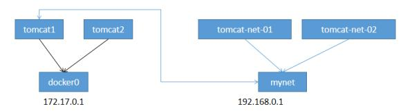

# Docker 网络原理


https://docs.docker.com/network/


列出当前的网络

```bash
docker network ls
```

```bash
root@ubuntu-dev:~/tmp/dockerfiles# docker network ls
NETWORK ID     NAME            DRIVER    SCOPE
c3dae6ef0318   bridge          bridge    local
446b0a3c640f   harbor_harbor   bridge    local
d88632806456   host            host      local
81602546d4b5   none            null      local
```


删除全部容器

```bash
docker stop $(docker ps -aq) && docker rm -f $(docker ps -aq)
```

通过docker-compose启动的容器通过下面的指令停止

```bash
docker-compose down
```

清理docker中所有的不使用的资源

```bash
docker system prune
```

对docker进行了清理后, 如果此时没有任何运行中的容器, 此时查看宿主机的ip信息

```bash
ip addr
```

```bash
root@ubuntu-dev:~/tmp/dockerfiles# ip addr
1: lo: <LOOPBACK,UP,LOWER_UP> mtu 65536 qdisc noqueue state UNKNOWN group default qlen 1000
    link/loopback 00:00:00:00:00:00 brd 00:00:00:00:00:00
    inet 127.0.0.1/8 scope host lo
       valid_lft forever preferred_lft forever
    inet6 ::1/128 scope host
       valid_lft forever preferred_lft forever
2: ens33: <BROADCAST,MULTICAST,UP,LOWER_UP> mtu 1500 qdisc fq_codel state UP group default qlen 1000
    link/ether 00:50:56:2a:95:10 brd ff:ff:ff:ff:ff:ff
    altname enp2s1
    inet 192.168.0.140/24 metric 100 brd 192.168.0.255 scope global ens33
       valid_lft forever preferred_lft forever
    inet6 2408:821a:9918:c1e0:250:56ff:fe2a:9510/64 scope global dynamic mngtmpaddr noprefixroute
       valid_lft 258705sec preferred_lft 172305sec
    inet6 fe80::250:56ff:fe2a:9510/64 scope link
       valid_lft forever preferred_lft forever
3: docker0: <NO-CARRIER,BROADCAST,MULTICAST,UP> mtu 1500 qdisc noqueue state DOWN group default
    link/ether 02:42:1d:73:5e:55 brd ff:ff:ff:ff:ff:ff
    inet 172.17.0.1/16 brd 172.17.255.255 scope global docker0
       valid_lft forever preferred_lft forever
    inet6 fe80::42:1dff:fe73:5e55/64 scope link
       valid_lft forever preferred_lft forever
```

第一个 lo 是 LOOPBACK ,表示回环接口，通常用于本地回环访问, 本机程序之间交互使用的网卡, ip 地址为 127.0.0.1/8

第二个 ens33 是虚拟机访问外部网络的网卡, 这里使用的ubuntu系统, 名称为 ens33, 如果是centos, 则名称一般为 `eth0` ,  ip地址为 192.168.0.140/24 , 这个是在地局域网的ip地址, 不是公网ip, 另外有2个ipv6的地址一个是临时ipv6地址, 另一个是永久分配的ipv6地址

第三个 docker0 是docker网络的网卡, 只有安装了 docker 才会有这个网卡, 访问容器会通过这个网卡进行. 这个是一个桥接网卡, ip地址是 172.17.0.1/16 


查看本机的网络链路规则

```bash
iptables -nL
```

```bash
root@ubuntu-dev:~/tmp/dockerfiles# iptables -nL
Chain INPUT (policy ACCEPT)
target     prot opt source               destination

Chain FORWARD (policy DROP)
target     prot opt source               destination
DOCKER-USER  all  --  0.0.0.0/0            0.0.0.0/0
DOCKER-ISOLATION-STAGE-1  all  --  0.0.0.0/0            0.0.0.0/0
ACCEPT     all  --  0.0.0.0/0            0.0.0.0/0            ctstate RELATED,ESTABLISHED
DOCKER     all  --  0.0.0.0/0            0.0.0.0/0
ACCEPT     all  --  0.0.0.0/0            0.0.0.0/0
ACCEPT     all  --  0.0.0.0/0            0.0.0.0/0

Chain OUTPUT (policy ACCEPT)
target     prot opt source               destination

Chain DOCKER (1 references)
target     prot opt source               destination

Chain DOCKER-ISOLATION-STAGE-1 (1 references)
target     prot opt source               destination
DOCKER-ISOLATION-STAGE-2  all  --  0.0.0.0/0            0.0.0.0/0
RETURN     all  --  0.0.0.0/0            0.0.0.0/0

Chain DOCKER-ISOLATION-STAGE-2 (1 references)
target     prot opt source               destination
DROP       all  --  0.0.0.0/0            0.0.0.0/0
RETURN     all  --  0.0.0.0/0            0.0.0.0/0

Chain DOCKER-USER (1 references)
target     prot opt source               destination
RETURN     all  --  0.0.0.0/0            0.0.0.0/0
```

0.0.0.0表示任意ip来源的请求都可以访问


启动一个容器作为测试

```bash
docker run -it alpine
```

以交互模式启动 alpine 容器后, 进入容器内执行:

```bash
ip a
```

```bash
/ # ip a
1: lo: <LOOPBACK,UP,LOWER_UP> mtu 65536 qdisc noqueue state UNKNOWN qlen 1000
    link/loopback 00:00:00:00:00:00 brd 00:00:00:00:00:00
    inet 127.0.0.1/8 scope host lo
       valid_lft forever preferred_lft forever
53: eth0@if54: <BROADCAST,MULTICAST,UP,LOWER_UP,M-DOWN> mtu 1500 qdisc noqueue state UP
    link/ether 02:42:ac:11:00:02 brd ff:ff:ff:ff:ff:ff
    inet 172.17.0.2/16 brd 172.17.255.255 scope global eth0
       valid_lft forever preferred_lft forever
```

可以看到容器内除了 lo 本机网络外, 还有一个 eth0@if54 , ip 地址是 172.17.0.2/16 

此时在终端工具中新开一个会话连接到虚拟机, 同样也查看网络信息

```bash
ip a
```

```bash
1: lo: <LOOPBACK,UP,LOWER_UP> mtu 65536 qdisc noqueue state UNKNOWN group default qlen 1000
    link/loopback 00:00:00:00:00:00 brd 00:00:00:00:00:00
    inet 127.0.0.1/8 scope host lo
       valid_lft forever preferred_lft forever
    inet6 ::1/128 scope host
       valid_lft forever preferred_lft forever
2: ens33: <BROADCAST,MULTICAST,UP,LOWER_UP> mtu 1500 qdisc fq_codel state UP group default qlen 1000
    link/ether 00:50:56:2a:95:10 brd ff:ff:ff:ff:ff:ff
    altname enp2s1
    inet 192.168.0.140/24 metric 100 brd 192.168.0.255 scope global ens33
       valid_lft forever preferred_lft forever
    inet6 2408:821a:9918:c1e0:250:56ff:fe2a:9510/64 scope global dynamic mngtmpaddr noprefixroute
       valid_lft 259084sec preferred_lft 172684sec
    inet6 fe80::250:56ff:fe2a:9510/64 scope link
       valid_lft forever preferred_lft forever
3: docker0: <BROADCAST,MULTICAST,UP,LOWER_UP> mtu 1500 qdisc noqueue state UP group default
    link/ether 02:42:1d:73:5e:55 brd ff:ff:ff:ff:ff:ff
    inet 172.17.0.1/16 brd 172.17.255.255 scope global docker0
       valid_lft forever preferred_lft forever
    inet6 fe80::42:1dff:fe73:5e55/64 scope link
       valid_lft forever preferred_lft forever
54: veth48d2e17@if53: <BROADCAST,MULTICAST,UP,LOWER_UP> mtu 1500 qdisc noqueue master docker0 state UP group default
    link/ether 8a:a3:e8:4a:d2:9b brd ff:ff:ff:ff:ff:ff link-netnsid 0
    inet6 fe80::88a3:e8ff:fe4a:d29b/64 scope link
       valid_lft forever preferred_lft forever
```

可以看到多了一个名为 veth48d2e17@if53 的网卡, 这个网卡在与上面启动的容器的 eth0@if54 网卡组成一个匹配对, docker官方称为 `veth pair`,  veth是虚拟以太网卡（Virtual Ethernet）的缩写,  所有对 `veth48d2e17@if53` 的网络访问都会转发给容器的 `eth0@if54` 网卡


此时在终端工具中再新建一个会话连接虚拟机, 在虚拟机中再运行一个容器

```bash
docker run --name alpine2 -it alpine
```

进入容器后查看ip信息

```bash
root@ubuntu-dev:~# docker run --name alpine2 -it alpine
/ # ip a
1: lo: <LOOPBACK,UP,LOWER_UP> mtu 65536 qdisc noqueue state UNKNOWN qlen 1000
    link/loopback 00:00:00:00:00:00 brd 00:00:00:00:00:00
    inet 127.0.0.1/8 scope host lo
       valid_lft forever preferred_lft forever
55: eth0@if56: <BROADCAST,MULTICAST,UP,LOWER_UP,M-DOWN> mtu 1500 qdisc noqueue state UP
    link/ether 02:42:ac:11:00:03 brd ff:ff:ff:ff:ff:ff
    inet 172.17.0.3/16 brd 172.17.255.255 scope global eth0
       valid_lft forever preferred_lft forever
```

可以看到容器内的网卡 eth0@if56 , ip为 172.17.0.3/16 , 此时再在虚拟机中查看网络信息

```
root@ubuntu-dev:~# ip a
1: lo: <LOOPBACK,UP,LOWER_UP> mtu 65536 qdisc noqueue state UNKNOWN group default qlen 1000
    link/loopback 00:00:00:00:00:00 brd 00:00:00:00:00:00
    inet 127.0.0.1/8 scope host lo
       valid_lft forever preferred_lft forever
    inet6 ::1/128 scope host
       valid_lft forever preferred_lft forever
2: ens33: <BROADCAST,MULTICAST,UP,LOWER_UP> mtu 1500 qdisc fq_codel state UP group default qlen 1000
    link/ether 00:50:56:2a:95:10 brd ff:ff:ff:ff:ff:ff
    altname enp2s1
    inet 192.168.0.140/24 metric 100 brd 192.168.0.255 scope global ens33
       valid_lft forever preferred_lft forever
    inet6 2408:821a:9918:c1e0:250:56ff:fe2a:9510/64 scope global dynamic mngtmpaddr noprefixroute
       valid_lft 258820sec preferred_lft 172420sec
    inet6 fe80::250:56ff:fe2a:9510/64 scope link
       valid_lft forever preferred_lft forever
3: docker0: <BROADCAST,MULTICAST,UP,LOWER_UP> mtu 1500 qdisc noqueue state UP group default
    link/ether 02:42:1d:73:5e:55 brd ff:ff:ff:ff:ff:ff
    inet 172.17.0.1/16 brd 172.17.255.255 scope global docker0
       valid_lft forever preferred_lft forever
    inet6 fe80::42:1dff:fe73:5e55/64 scope link
       valid_lft forever preferred_lft forever
54: veth48d2e17@if53: <BROADCAST,MULTICAST,UP,LOWER_UP> mtu 1500 qdisc noqueue master docker0 state UP group default
    link/ether 8a:a3:e8:4a:d2:9b brd ff:ff:ff:ff:ff:ff link-netnsid 0
    inet6 fe80::88a3:e8ff:fe4a:d29b/64 scope link
       valid_lft forever preferred_lft forever
56: vethfb54628@if55: <BROADCAST,MULTICAST,UP,LOWER_UP> mtu 1500 qdisc noqueue master docker0 state UP group default
    link/ether f2:a5:19:bb:b0:77 brd ff:ff:ff:ff:ff:ff link-netnsid 1
    inet6 fe80::f0a5:19ff:febb:b077/64 scope link
       valid_lft forever preferred_lft forever
```

可以看到新创建的网卡 vethfb54628@if55 , 这个是与上面 eth0@if56 进行配对的网卡, 由此可见, 每次docker创建一个容器, 都会在宿主机中新创建一个网卡与容器中的网卡进行配对.


此时在第一个容器内ping第二个容器

```bash
/ # ping 172.17.0.3
PING 172.17.0.3 (172.17.0.3): 56 data bytes
64 bytes from 172.17.0.3: seq=0 ttl=64 time=0.313 ms
64 bytes from 172.17.0.3: seq=1 ttl=64 time=0.092 ms
64 bytes from 172.17.0.3: seq=2 ttl=64 time=0.073 ms
64 bytes from 172.17.0.3: seq=3 ttl=64 time=0.084 ms
64 bytes from 172.17.0.3: seq=4 ttl=64 time=0.078 ms
64 bytes from 172.17.0.3: seq=5 ttl=64 time=0.088 ms
^C
--- 172.17.0.3 ping statistics ---
6 packets transmitted, 6 packets received, 0% packet loss
round-trip min/avg/max = 0.073/0.121/0.313 ms
```

反过来ping

```bash
/ # ping 172.17.0.2
PING 172.17.0.2 (172.17.0.2): 56 data bytes
64 bytes from 172.17.0.2: seq=0 ttl=64 time=0.100 ms
64 bytes from 172.17.0.2: seq=1 ttl=64 time=0.077 ms
64 bytes from 172.17.0.2: seq=2 ttl=64 time=0.066 ms
64 bytes from 172.17.0.2: seq=3 ttl=64 time=0.077 ms
64 bytes from 172.17.0.2: seq=4 ttl=64 time=0.075 ms
^C
--- 172.17.0.2 ping statistics ---
5 packets transmitted, 5 packets received, 0% packet loss
round-trip min/avg/max = 0.066/0.079/0.100 ms
```

可以看到2个容器相互之间时可以ping通的, 因为这两个容器都是在同一个局域网内的.


这里网关的ip地址为 172.17.0.1/16 表示前16位是固定的, 后面16为是可以 0~255 变化的,  ip的数量为 256*256 -2 个( 0.0 和 255.255 是特殊ip地址) , 这些容器默认都是连接同一个网关, ip地址都是 docker0 网关分配的, 因此这些容器都是在同一个局域网内,可以互相ping通


由于当前的容器没有监听任何的端口, 所以目前在iptables中没有任何的规则

```bash
iptables -nL
```

```bash
root@ubuntu-dev:~# iptables -nL
Chain INPUT (policy ACCEPT)
target     prot opt source               destination

Chain FORWARD (policy DROP)
target     prot opt source               destination
DOCKER-USER  all  --  0.0.0.0/0            0.0.0.0/0
DOCKER-ISOLATION-STAGE-1  all  --  0.0.0.0/0            0.0.0.0/0
ACCEPT     all  --  0.0.0.0/0            0.0.0.0/0            ctstate RELATED,ESTABLISHED
DOCKER     all  --  0.0.0.0/0            0.0.0.0/0
ACCEPT     all  --  0.0.0.0/0            0.0.0.0/0
ACCEPT     all  --  0.0.0.0/0            0.0.0.0/0

Chain OUTPUT (policy ACCEPT)
target     prot opt source               destination

Chain DOCKER (1 references)
target     prot opt source               destination

Chain DOCKER-ISOLATION-STAGE-1 (1 references)
target     prot opt source               destination
DOCKER-ISOLATION-STAGE-2  all  --  0.0.0.0/0            0.0.0.0/0
RETURN     all  --  0.0.0.0/0            0.0.0.0/0

Chain DOCKER-ISOLATION-STAGE-2 (1 references)
target     prot opt source               destination
DROP       all  --  0.0.0.0/0            0.0.0.0/0
RETURN     all  --  0.0.0.0/0            0.0.0.0/0

Chain DOCKER-USER (1 references)
target     prot opt source               destination
RETURN     all  --  0.0.0.0/0            0.0.0.0/0
```


模拟场景

tomcat web服务器 + redis缓存服务器

```bash
docker pull redis
docker pull tomcat:jre8-alpine
```

假设web服务是使用springboot开发的, 那么就需要配置redis的url, spring.redis.host=xxx , 这块需要填写redis的主机地址, 但是redis的容器的主机地址是需要部署之后由docker0网关分配的, 因此就希望这个redis的主机地址配置成域名,通过dns域名解析成动态的ip地址来进行访问 . 虽然也可以通过redis的主机的公网ip进行访问, 但是这种方式在线上会引起流量的费用和公网ip的租费.

要让 tomcat 可以访问 redis ,可以使用下面的方式

首先按照默认配置启动一个 tomcat

```bash
docker run --name tomcat1 -d -P tomcat:jre8-alpine
```

```bash
root@ubuntu-dev:~# docker run --name tomcat1 -d -P tomcat:jre8-alpine
617884f43868a7aa59b05cad27cf5bb81e4d29a1326273b2ac06afed8f218d50
root@ubuntu-dev:~# docker ps
CONTAINER ID   IMAGE                COMMAND             CREATED         STATUS         PORTS                                         NAMES
617884f43868   tomcat:jre8-alpine   "catalina.sh run"   8 seconds ago   Up 7 seconds   0.0.0.0:32769->8080/tcp, :::32769->8080/tcp   tomcat1
```

可以看到随机分配了 32769 端口绑定容器的8080端口, 进入容器内查看网络信息

```bash
docker exec -it tomcat1 /bin/sh
```

```shell
root@ubuntu-dev:~# docker exec -it tomcat1 /bin/sh
/usr/local/tomcat # ip a
1: lo: <LOOPBACK,UP,LOWER_UP> mtu 65536 qdisc noqueue state UNKNOWN qlen 1000
    link/loopback 00:00:00:00:00:00 brd 00:00:00:00:00:00
    inet 127.0.0.1/8 scope host lo
       valid_lft forever preferred_lft forever
59: eth0@if60: <BROADCAST,MULTICAST,UP,LOWER_UP,M-DOWN> mtu 1500 qdisc noqueue state UP
    link/ether 02:42:ac:11:00:02 brd ff:ff:ff:ff:ff:ff
    inet 172.17.0.2/16 brd 172.17.255.255 scope global eth0
       valid_lft forever preferred_lft forever
```

可以看到容器的ip地址为 172.17.0.2/16 , 回到虚拟机, 查看ip转发规则

```bash
iptables -vnL
```

```bash
root@ubuntu-dev:~# iptables -vnL
Chain INPUT (policy ACCEPT 0 packets, 0 bytes)
 pkts bytes target     prot opt in     out     source               destination

Chain FORWARD (policy DROP 0 packets, 0 bytes)
 pkts bytes target     prot opt in     out     source               destination
 319K   44M DOCKER-USER  all  --  *      *       0.0.0.0/0            0.0.0.0/0
 319K   44M DOCKER-ISOLATION-STAGE-1  all  --  *      *       0.0.0.0/0            0.0.0.0/0
   20  1680 ACCEPT     all  --  *      docker0  0.0.0.0/0            0.0.0.0/0            ctstate RELATED,ESTABLISHED
    2   168 DOCKER     all  --  *      docker0  0.0.0.0/0            0.0.0.0/0
    0     0 ACCEPT     all  --  docker0 !docker0  0.0.0.0/0            0.0.0.0/0
    2   168 ACCEPT     all  --  docker0 docker0  0.0.0.0/0            0.0.0.0/0

Chain OUTPUT (policy ACCEPT 0 packets, 0 bytes)
 pkts bytes target     prot opt in     out     source               destination

Chain DOCKER (1 references)
 pkts bytes target     prot opt in     out     source               destination
    0     0 ACCEPT     tcp  --  !docker0 docker0  0.0.0.0/0            172.17.0.2           tcp dpt:8080

Chain DOCKER-ISOLATION-STAGE-1 (1 references)
 pkts bytes target     prot opt in     out     source               destination
    0     0 DOCKER-ISOLATION-STAGE-2  all  --  docker0 !docker0  0.0.0.0/0            0.0.0.0/0
 319K   44M RETURN     all  --  *      *       0.0.0.0/0            0.0.0.0/0

Chain DOCKER-ISOLATION-STAGE-2 (1 references)
 pkts bytes target     prot opt in     out     source               destination
    0     0 DROP       all  --  *      docker0  0.0.0.0/0            0.0.0.0/0
    0     0 RETURN     all  --  *      *       0.0.0.0/0            0.0.0.0/0

Chain DOCKER-USER (1 references)
 pkts bytes target     prot opt in     out     source               destination
 319K   44M RETURN     all  --  *      *       0.0.0.0/0            0.0.0.0/0
```

可以看到有目的地为 172.17.0.2:8080 的转发规则

部署redis容器

```bash
docker run --name redisserver -d -P  redis
```

```
root@ubuntu-dev:~# docker run --name redisserver -d -P  redis
b7d5e82979e7ee4de6f5ffc689e82f7310efa0f0370a187a5864eb6b6d83dc6e
root@ubuntu-dev:~# docker ps
CONTAINER ID   IMAGE                COMMAND                  CREATED          STATUS          PORTS                                         NAMES
b7d5e82979e7   redis                "docker-entrypoint.s…"   14 seconds ago   Up 13 seconds   0.0.0.0:32770->6379/tcp, :::32770->6379/tcp   redisserver
617884f43868   tomcat:jre8-alpine   "catalina.sh run"        9 minutes ago    Up 9 minutes    0.0.0.0:32769->8080/tcp, :::32769->8080/tcp   tomcat1
```

可以看到 redis 容器绑定的端口为 32770 , 由于 redis 容器内部没有 ip 指令, 需要通过下面的指令查看网络信息

```shell
docker inspect redisserver
```

```json
[
    {
        "Id": "b7d5e82979e7ee4de6f5ffc689e82f7310efa0f0370a187a5864eb6b6d83dc6e",
        "Created": "2023-08-03T14:15:47.948340986Z",
        "Path": "docker-entrypoint.sh",
        "Args": [
            "redis-server"
        ],
        "State": {
            "Status": "running",
            "Running": true,
            "Paused": false,
            "Restarting": false,
            "OOMKilled": false,
            "Dead": false,
            "Pid": 385903,
            "ExitCode": 0,
            "Error": "",
            "StartedAt": "2023-08-03T14:15:48.324826068Z",
            "FinishedAt": "0001-01-01T00:00:00Z"
        },
        "Image": "sha256:e0ce02f88e589621ae0c99073142b587c1bbe3cfbab70b484e7af700d7057e0e",
        "ResolvConfPath": "/var/lib/docker/containers/b7d5e82979e7ee4de6f5ffc689e82f7310efa0f0370a187a5864eb6b6d83dc6e/resolv.conf",
        "HostnamePath": "/var/lib/docker/containers/b7d5e82979e7ee4de6f5ffc689e82f7310efa0f0370a187a5864eb6b6d83dc6e/hostname",
        "HostsPath": "/var/lib/docker/containers/b7d5e82979e7ee4de6f5ffc689e82f7310efa0f0370a187a5864eb6b6d83dc6e/hosts",
        "LogPath": "/var/lib/docker/containers/b7d5e82979e7ee4de6f5ffc689e82f7310efa0f0370a187a5864eb6b6d83dc6e/b7d5e82979e7ee4de6f5ffc689e82f7310efa0f0370a187a5864eb6b6d83dc6e-json.log",
        "Name": "/redisserver",
        "RestartCount": 0,
        "Driver": "overlay2",
        "Platform": "linux",
        "MountLabel": "",
        "ProcessLabel": "",
        "AppArmorProfile": "docker-default",
        "ExecIDs": null,
        "HostConfig": {
            "Binds": null,
            "ContainerIDFile": "",
            "LogConfig": {
                "Type": "json-file",
                "Config": {}
            },
            "NetworkMode": "default",
            "PortBindings": {},
            "RestartPolicy": {
                "Name": "no",
                "MaximumRetryCount": 0
            },
            "AutoRemove": false,
            "VolumeDriver": "",
            "VolumesFrom": null,
            "ConsoleSize": [
                60,
                198
            ],
            "CapAdd": null,
            "CapDrop": null,
            "CgroupnsMode": "private",
            "Dns": [],
            "DnsOptions": [],
            "DnsSearch": [],
            "ExtraHosts": null,
            "GroupAdd": null,
            "IpcMode": "private",
            "Cgroup": "",
            "Links": null,
            "OomScoreAdj": 0,
            "PidMode": "",
            "Privileged": false,
            "PublishAllPorts": true,
            "ReadonlyRootfs": false,
            "SecurityOpt": null,
            "UTSMode": "",
            "UsernsMode": "",
            "ShmSize": 67108864,
            "Runtime": "runc",
            "Isolation": "",
            "CpuShares": 0,
            "Memory": 0,
            "NanoCpus": 0,
            "CgroupParent": "",
            "BlkioWeight": 0,
            "BlkioWeightDevice": [],
            "BlkioDeviceReadBps": [],
            "BlkioDeviceWriteBps": [],
            "BlkioDeviceReadIOps": [],
            "BlkioDeviceWriteIOps": [],
            "CpuPeriod": 0,
            "CpuQuota": 0,
            "CpuRealtimePeriod": 0,
            "CpuRealtimeRuntime": 0,
            "CpusetCpus": "",
            "CpusetMems": "",
            "Devices": [],
            "DeviceCgroupRules": null,
            "DeviceRequests": null,
            "MemoryReservation": 0,
            "MemorySwap": 0,
            "MemorySwappiness": null,
            "OomKillDisable": null,
            "PidsLimit": null,
            "Ulimits": null,
            "CpuCount": 0,
            "CpuPercent": 0,
            "IOMaximumIOps": 0,
            "IOMaximumBandwidth": 0,
            "MaskedPaths": [
                "/proc/asound",
                "/proc/acpi",
                "/proc/kcore",
                "/proc/keys",
                "/proc/latency_stats",
                "/proc/timer_list",
                "/proc/timer_stats",
                "/proc/sched_debug",
                "/proc/scsi",
                "/sys/firmware"
            ],
            "ReadonlyPaths": [
                "/proc/bus",
                "/proc/fs",
                "/proc/irq",
                "/proc/sys",
                "/proc/sysrq-trigger"
            ]
        },
        "GraphDriver": {
            "Data": {
                "LowerDir": "/var/lib/docker/overlay2/d41fbda9315cf10d686fcfb872fc0e7ebac24b50411ceefdef02d59e462f16be-init/diff:/var/lib/docker/overlay2/293e8e3bb8bca96236ed7c341d46d15494c507a10a235e1740fc823e63964136/diff:/var/lib/docker/overlay2/142e20bc089d95f59523c59dec2ed274f28b4b0f6b0a62f47fb2bf06f6d9308d/diff:/var/lib/docker/overlay2/dd1c1597346eb5567fead3a62770e2d7d6c4e47392c2fcd3d754c42ddb193a3d/diff:/var/lib/docker/overlay2/e62085d4009f2505d7219763559a78c06d3850488ef904aed481eb7f34504799/diff:/var/lib/docker/overlay2/42180f990a81f226b20f8b943e4527e9024916691c5f0ba8c898fe79fc39d4fe/diff:/var/lib/docker/overlay2/994eefc5e86e41b5ce0482f3663d3e6f14a69c3a9102d09c78551d3b1e2ef2c9/diff",
                "MergedDir": "/var/lib/docker/overlay2/d41fbda9315cf10d686fcfb872fc0e7ebac24b50411ceefdef02d59e462f16be/merged",
                "UpperDir": "/var/lib/docker/overlay2/d41fbda9315cf10d686fcfb872fc0e7ebac24b50411ceefdef02d59e462f16be/diff",
                "WorkDir": "/var/lib/docker/overlay2/d41fbda9315cf10d686fcfb872fc0e7ebac24b50411ceefdef02d59e462f16be/work"
            },
            "Name": "overlay2"
        },
        "Mounts": [
            {
                "Type": "volume",
                "Name": "25cedea50ac321a824736a9327818c8397c2aa6b9b4b69ba70d111cac7759380",
                "Source": "/var/lib/docker/volumes/25cedea50ac321a824736a9327818c8397c2aa6b9b4b69ba70d111cac7759380/_data",
                "Destination": "/data",
                "Driver": "local",
                "Mode": "",
                "RW": true,
                "Propagation": ""
            }
        ],
        "Config": {
            "Hostname": "b7d5e82979e7",
            "Domainname": "",
            "User": "",
            "AttachStdin": false,
            "AttachStdout": false,
            "AttachStderr": false,
            "ExposedPorts": {
                "6379/tcp": {}
            },
            "Tty": false,
            "OpenStdin": false,
            "StdinOnce": false,
            "Env": [
                "PATH=/usr/local/sbin:/usr/local/bin:/usr/sbin:/usr/bin:/sbin:/bin",
                "GOSU_VERSION=1.16",
                "REDIS_VERSION=7.0.12",
                "REDIS_DOWNLOAD_URL=http://download.redis.io/releases/redis-7.0.12.tar.gz",
                "REDIS_DOWNLOAD_SHA=9dd83d5b278bb2bf0e39bfeb75c3e8170024edbaf11ba13b7037b2945cf48ab7"
            ],
            "Cmd": [
                "redis-server"
            ],
            "Image": "redis",
            "Volumes": {
                "/data": {}
            },
            "WorkingDir": "/data",
            "Entrypoint": [
                "docker-entrypoint.sh"
            ],
            "OnBuild": null,
            "Labels": {}
        },
        "NetworkSettings": {
            "Bridge": "",
            "SandboxID": "a69edd9c9760a0cbe0e643801dcd999b42cc1dfce8eb7dfc1e057a129444849d",
            "HairpinMode": false,
            "LinkLocalIPv6Address": "",
            "LinkLocalIPv6PrefixLen": 0,
            "Ports": {
                "6379/tcp": [
                    {
                        "HostIp": "0.0.0.0",
                        "HostPort": "32770"
                    },
                    {
                        "HostIp": "::",
                        "HostPort": "32770"
                    }
                ]
            },
            "SandboxKey": "/var/run/docker/netns/a69edd9c9760",
            "SecondaryIPAddresses": null,
            "SecondaryIPv6Addresses": null,
            "EndpointID": "9ea1e8eee5feea35e4157fb24a415378f47c7f9985e7bca6ded6acb6461a5885",
            "Gateway": "172.17.0.1",
            "GlobalIPv6Address": "",
            "GlobalIPv6PrefixLen": 0,
            "IPAddress": "172.17.0.3",
            "IPPrefixLen": 16,
            "IPv6Gateway": "",
            "MacAddress": "02:42:ac:11:00:03",
            "Networks": {
                "bridge": {
                    "IPAMConfig": null,
                    "Links": null,
                    "Aliases": null,
                    "NetworkID": "c3dae6ef031826771c538b674863bb756e8e470f621127bf8eff4b4bd7630eda",
                    "EndpointID": "9ea1e8eee5feea35e4157fb24a415378f47c7f9985e7bca6ded6acb6461a5885",
                    "Gateway": "172.17.0.1",
                    "IPAddress": "172.17.0.3",
                    "IPPrefixLen": 16,
                    "IPv6Gateway": "",
                    "GlobalIPv6Address": "",
                    "GlobalIPv6PrefixLen": 0,
                    "MacAddress": "02:42:ac:11:00:03",
                    "DriverOpts": null
                }
            }
        }
    }
]
```

可以看到网络信息:

```json
"Networks": {
    "bridge": {
        "IPAMConfig": null,
        "Links": null,
        "Aliases": null,
        "NetworkID": "c3dae6ef031826771c538b674863bb756e8e470f621127bf8eff4b4bd7630eda",
        "EndpointID": "9ea1e8eee5feea35e4157fb24a415378f47c7f9985e7bca6ded6acb6461a5885",
        "Gateway": "172.17.0.1",
        "IPAddress": "172.17.0.3",
        "IPPrefixLen": 16,
        "IPv6Gateway": "",
        "GlobalIPv6Address": "",
        "GlobalIPv6PrefixLen": 0,
        "MacAddress": "02:42:ac:11:00:03",
        "DriverOpts": null
    }
}
```

可以看到ip地址为 172.17.0.3 

查看网络监听状态

```shell
netstat -nl
```

```shell
root@ubuntu-dev:~# netstat -nl
Active Internet connections (only servers)
Proto Recv-Q Send-Q Local Address           Foreign Address         State
tcp        0      0 127.0.0.1:6011          0.0.0.0:*               LISTEN
tcp        0      0 0.0.0.0:32769           0.0.0.0:*               LISTEN
tcp        0      0 0.0.0.0:32770           0.0.0.0:*               LISTEN
tcp        0      0 0.0.0.0:22              0.0.0.0:*               LISTEN
tcp        0      0 0.0.0.0:3306            0.0.0.0:*               LISTEN
tcp        0      0 127.0.0.53:53           0.0.0.0:*               LISTEN
tcp        0      0 127.0.0.1:33060         0.0.0.0:*               LISTEN
tcp6       0      0 ::1:6011                :::*                    LISTEN
tcp6       0      0 :::7848                 :::*                    LISTEN
tcp6       0      0 :::8848                 :::*                    LISTEN
tcp6       0      0 :::32769                :::*                    LISTEN
tcp6       0      0 :::32770                :::*                    LISTEN
tcp6       0      0 :::22                   :::*                    LISTEN
tcp6       0      0 :::9848                 :::*                    LISTEN
tcp6       0      0 :::9849                 :::*                    LISTEN
udp        0      0 127.0.0.53:53           0.0.0.0:*
udp        0      0 192.168.0.140:68        0.0.0.0:*
udp6       0      0 fe80::250:56ff:fe2a:546 :::*
udp6       0      0 :::59442                :::*
raw6       0      0 :::58                   :::*                    7
Active UNIX domain sockets (only servers)
Proto RefCnt Flags       Type       State         I-Node   Path
unix  2      [ ACC ]     STREAM     LISTENING     917624   /run/containerd/s/2f5b589fc4c3d61aaf2ea7ab0dc65db79fea732b178df412d25cd72253125822
unix  2      [ ACC ]     STREAM     LISTENING     25389    /run/containerd/containerd.sock.ttrpc
unix  2      [ ACC ]     STREAM     LISTENING     25391    /run/containerd/containerd.sock
unix  2      [ ACC ]     STREAM     LISTENING     51336    /run/user/0/systemd/private
unix  2      [ ACC ]     STREAM     LISTENING     34957    /var/run/docker/metrics.sock
unix  2      [ ACC ]     STREAM     LISTENING     51342    /run/user/0/bus
unix  2      [ ACC ]     STREAM     LISTENING     33734    @/org/kernel/linux/storage/multipathd
unix  2      [ ACC ]     STREAM     LISTENING     47427    /run/user/0/gnupg/S.dirmngr
unix  2      [ ACC ]     STREAM     LISTENING     47429    /run/user/0/gnupg/S.gpg-agent.browser
unix  2      [ ACC ]     STREAM     LISTENING     47431    /run/user/0/gnupg/S.gpg-agent.extra
unix  2      [ ACC ]     STREAM     LISTENING     47433    /run/user/0/gnupg/S.gpg-agent.ssh
unix  2      [ ACC ]     STREAM     LISTENING     47435    /run/user/0/gnupg/S.gpg-agent
unix  2      [ ACC ]     STREAM     LISTENING     47437    /run/user/0/pk-debconf-socket
unix  2      [ ACC ]     STREAM     LISTENING     47439    /run/user/0/snapd-session-agent.socket
unix  2      [ ACC ]     STREAM     LISTENING     34823    /var/snap/lxd/common/lxd/unix.socket
unix  2      [ ACC ]     STREAM     LISTENING     34825    /var/snap/lxd/common/lxd-user/unix.socket
unix  2      [ ACC ]     STREAM     LISTENING     33721    /run/systemd/private
unix  2      [ ACC ]     STREAM     LISTENING     33723    /run/systemd/userdb/io.systemd.DynamicUser
unix  2      [ ACC ]     STREAM     LISTENING     33724    /run/systemd/io.system.ManagedOOM
unix  2      [ ACC ]     STREAM     LISTENING     33732    /run/lvm/lvmpolld.socket
unix  2      [ ACC ]     STREAM     LISTENING     18563    /run/systemd/fsck.progress
unix  2      [ ACC ]     STREAM     LISTENING     34259    /var/run/docker/libnetwork/cd2cbe188a70.sock
unix  2      [ ACC ]     STREAM     LISTENING     18574    /run/systemd/journal/stdout
unix  2      [ ACC ]     SEQPACKET  LISTENING     18577    /run/udev/control
unix  2      [ ACC ]     STREAM     LISTENING     36116    /var/run/mysqld/mysqlx.sock
unix  2      [ ACC ]     STREAM     LISTENING     25079    /run/systemd/resolve/io.systemd.Resolve
unix  2      [ ACC ]     STREAM     LISTENING     31469    /run/systemd/journal/io.systemd.journal
unix  2      [ ACC ]     STREAM     LISTENING     36118    /var/run/mysqld/mysqld.sock
unix  2      [ ACC ]     STREAM     LISTENING     31744    /run/dbus/system_bus_socket
unix  2      [ ACC ]     STREAM     LISTENING     34818    /run/docker.sock
unix  2      [ ACC ]     STREAM     LISTENING     908785   /run/containerd/s/63d5fbb6a319b9857cdca537f847ba5e429a47f61498c3f96699c1c9ba707dd2
unix  2      [ ACC ]     STREAM     LISTENING     34827    /run/snapd.socket
unix  2      [ ACC ]     STREAM     LISTENING     34829    /run/snapd-snap.socket
unix  2      [ ACC ]     STREAM     LISTENING     34831    /run/uuidd/request
unix  2      [ ACC ]     STREAM     LISTENING     34822    @ISCSIADM_ABSTRACT_NAMESPACE
unix  2      [ ACC ]     STREAM     LISTENING     18754    /run/irqbalance/irqbalance938.sock
unix  2      [ ACC ]     STREAM     LISTENING     24408    /var/run/vmware/guestServicePipe
```

可以看到 redis 和 tomcat 所绑定的端口的监听

```shell
tcp        0      0 0.0.0.0:32769           0.0.0.0:*               LISTEN
tcp        0      0 0.0.0.0:32770           0.0.0.0:*               LISTEN
```

查看端口转发规则

```shell
iptables -t nat -vnL
```

```shell
root@ubuntu-dev:~# iptables -t nat -vnL
Chain PREROUTING (policy ACCEPT 0 packets, 0 bytes)
 pkts bytes target     prot opt in     out     source               destination
   38  1912 DOCKER     all  --  *      *       0.0.0.0/0            0.0.0.0/0            ADDRTYPE match dst-type LOCAL

Chain INPUT (policy ACCEPT 0 packets, 0 bytes)
 pkts bytes target     prot opt in     out     source               destination

Chain OUTPUT (policy ACCEPT 0 packets, 0 bytes)
 pkts bytes target     prot opt in     out     source               destination
    1    60 DOCKER     all  --  *      *       0.0.0.0/0           !127.0.0.0/8          ADDRTYPE match dst-type LOCAL

Chain POSTROUTING (policy ACCEPT 0 packets, 0 bytes)
 pkts bytes target     prot opt in     out     source               destination
    0     0 MASQUERADE  all  --  *      !docker0  172.17.0.0/16        0.0.0.0/0
    0     0 MASQUERADE  tcp  --  *      *       172.17.0.2           172.17.0.2           tcp dpt:8080
    0     0 MASQUERADE  tcp  --  *      *       172.17.0.3           172.17.0.3           tcp dpt:6379

Chain DOCKER (2 references)
 pkts bytes target     prot opt in     out     source               destination
    0     0 RETURN     all  --  docker0 *       0.0.0.0/0            0.0.0.0/0
    0     0 DNAT       tcp  --  !docker0 *       0.0.0.0/0            0.0.0.0/0            tcp dpt:32769 to:172.17.0.2:8080
    0     0 DNAT       tcp  --  !docker0 *       0.0.0.0/0            0.0.0.0/0            tcp dpt:32770 to:172.17.0.3:6379
```

可以看到其中的流量转发规则有:

```bash
Chain DOCKER (2 references)
 pkts bytes target     prot opt in     out     source               destination
    0     0 RETURN     all  --  docker0 *       0.0.0.0/0            0.0.0.0/0
    0     0 DNAT       tcp  --  !docker0 *       0.0.0.0/0            0.0.0.0/0            tcp dpt:32769 to:172.17.0.2:8080
    0     0 DNAT       tcp  --  !docker0 *       0.0.0.0/0            0.0.0.0/0            tcp dpt:32770 to:172.17.0.3:6379
```

分别将宿主机的 32769 和 32770 转发到 tomcat 和 redis 的容器的ip和容器内监听的端口


如果想要让 tomcat 可以访问 redis, 有2种方式

方式 1 --link

先清除当前的容器

```shell
docker stop $(docker ps -aq) && docker rm $(docker ps -aq)
```

启动redis

```
docker run --name redis01 -d -P redis
```

启动 tomcat, 注意添加了参数 --link redis01 表示连接 redis01 容器

```shell
docker run --name tomcat01 -d -P --link redis01 tomcat:jre8-alpine
```

进入tomcat

```shell
docker exec -it tomcat01 /bin/sh
```

ping redis01

```shell
/usr/local/tomcat # ping redis01
PING redis01 (172.17.0.2): 56 data bytes
64 bytes from 172.17.0.2: seq=0 ttl=64 time=0.647 ms
64 bytes from 172.17.0.2: seq=1 ttl=64 time=0.235 ms
64 bytes from 172.17.0.2: seq=2 ttl=64 time=0.224 ms
^C
--- redis01 ping statistics ---
3 packets transmitted, 3 packets received, 0% packet loss
round-trip min/avg/max = 0.224/0.368/0.647 ms
```

原理:

```shell
/usr/local/tomcat # cat /etc/hosts
127.0.0.1       localhost
::1     localhost ip6-localhost ip6-loopback
fe00::0 ip6-localnet
ff00::0 ip6-mcastprefix
ff02::1 ip6-allnodes
ff02::2 ip6-allrouters
172.17.0.2      redis01 4765860ef874
172.17.0.3      3d4c4581e418
```

可以看到使用了 --link 参数后, 容器启动时会自动通过docker的 dns 查询容器的ip和id/name ,  并写入 /etc/hosts

缺点:

1 单向, 被连接的容器没有写入发起连接的容器的信息

2 无法动更新, 被连接的容器重启后,如果被分配的IP变化了, 发起连接的容器内的hosts信息不会更新, 导致网络连接失败


方式 2 创建自定义网络

先清除当前的容器

```shell
docker stop $(docker ps -aq) && docker rm $(docker ps -aq)
```

创建自定义网络

```shell
docker network create --driver bridge --subnet 192.168.0.0/16 --gateway 192.168.0.1 mynet
```

启动redis, 指定使用自定义网络

```shell
docker run --name redis01 -d -P --network mynet redis
```

启动 tomcat, 指定使用自定义网络

```shell
docker run --name tomcat01 -d -P --network mynet tomcat:jre8-alpine
```

进入tomcat

```shell
docker exec -it tomcat01 /bin/sh
```

ping redis01

```shell
/usr/local/tomcat # ping redis01
PING redis01 (192.168.0.2): 56 data bytes
64 bytes from 192.168.0.2: seq=0 ttl=64 time=0.671 ms
64 bytes from 192.168.0.2: seq=1 ttl=64 time=0.237 ms
64 bytes from 192.168.0.2: seq=2 ttl=64 time=0.201 ms
64 bytes from 192.168.0.2: seq=3 ttl=64 time=0.226 ms
64 bytes from 192.168.0.2: seq=4 ttl=64 time=0.193 ms
^C
--- redis01 ping statistics ---
5 packets transmitted, 5 packets received, 0% packet loss
round-trip min/avg/max = 0.193/0.305/0.671 ms
```

注意 ip 地址是自定义网络中分配的

查看 hosts

```shell
/usr/local/tomcat # cat /etc/hosts
127.0.0.1       localhost
::1     localhost ip6-localhost ip6-loopback
fe00::0 ip6-localnet
ff00::0 ip6-mcastprefix
ff02::1 ip6-allnodes
ff02::2 ip6-allrouters
192.168.0.3     71655bca2a8e
```

redis 容器的信息并没有写入 hosts, tomcat 访问 redis01 容器是通过 dns 解析ip来进行访问的

由于redis容器中没有ping命令, 这时可以再启动一个alpine, 并且使用容器网络模式, 就是让新启动的alpine容器的网络寄生在redis01容器的网络中

```shell
docker run --name alpine01 -it --network container:redis01 alpine
```

```shell
/ # ping tomcat01
PING tomcat01 (192.168.0.3): 56 data bytes
64 bytes from 192.168.0.3: seq=0 ttl=64 time=0.427 ms
64 bytes from 192.168.0.3: seq=1 ttl=64 time=0.203 ms
64 bytes from 192.168.0.3: seq=2 ttl=64 time=0.190 ms
^C
--- tomcat01 ping statistics ---
3 packets transmitted, 3 packets received, 0% packet loss
round-trip min/avg/max = 0.190/0.273/0.427 ms
/ # ip a
1: lo: <LOOPBACK,UP,LOWER_UP> mtu 65536 qdisc noqueue state UNKNOWN qlen 1000
    link/loopback 00:00:00:00:00:00 brd 00:00:00:00:00:00
    inet 127.0.0.1/8 scope host lo
       valid_lft forever preferred_lft forever
68: eth0@if69: <BROADCAST,MULTICAST,UP,LOWER_UP,M-DOWN> mtu 1500 qdisc noqueue state UP
    link/ether 02:42:c0:a8:00:02 brd ff:ff:ff:ff:ff:ff
    inet 192.168.0.2/16 brd 192.168.255.255 scope global eth0
       valid_lft forever preferred_lft forever
```

注意此时在 alpine 容器中的ip地址为 192.168.0.2 , 这个ip地址其实就是上面 redis01 容器的ip地址, alpine01 容器通过容器网络模式共用了目标容器的网络, 通过查看redis01容器的详情也可以证明这一点:

```shell
docker inspect redis01
```

```json
"Networks": {
    "mynet": {
        "IPAMConfig": null,
        "Links": null,
        "Aliases": [
            "b6545bf550bb"
        ],
        "NetworkID": "9e7fcca13494a35b304b69727b30b3f0577872e07218f1711a69e7e614275980",
        "EndpointID": "57e312068cd13fc22da7524de5d4c2c951e0a1794cc4d423f0cb88875b5e8760",
        "Gateway": "192.168.0.1",
        "IPAddress": "192.168.0.2",
        "IPPrefixLen": 16,
        "IPv6Gateway": "",
        "GlobalIPv6Address": "",
        "GlobalIPv6PrefixLen": 0,
        "MacAddress": "02:42:c0:a8:00:02",
        "DriverOpts": null
    }
}
```

注意 "MacAddress": "02:42:c0:a8:00:02", mac地址与在 alpine 中 `ip a` 指令展示的一致


此时在默认网络中再创建一个 tomcat02 容器

```shell
docker run --name tomcat02 -d -P tomcat:jre8-alpine
```

现在想要让 tomcat02 可以访问 redis01 容器, 但是由于这2个容器不在同一个网络中, 目前是无法相互访问的

```shell
docker exec -it tomcat02 /bin/sh
```

```
/usr/local/tomcat # ping redis01
ping: bad address 'redis01'
```

可以通过指令将tomcat02 容器加入到自定义网络中

```shell
docker network connect mynet tomcat02
```

再次测试

```shell
docker exec -it tomcat02 /bin/sh
```

```shell
/usr/local/tomcat # ping redis01
PING redis01 (192.168.0.2): 56 data bytes
64 bytes from 192.168.0.2: seq=0 ttl=64 time=0.524 ms
64 bytes from 192.168.0.2: seq=1 ttl=64 time=0.204 ms
64 bytes from 192.168.0.2: seq=2 ttl=64 time=0.235 ms
^C
--- redis01 ping statistics ---
3 packets transmitted, 3 packets received, 0% packet loss
round-trip min/avg/max = 0.204/0.321/0.524 ms
```

原理:

```shell
/usr/local/tomcat # ip addr
1: lo: <LOOPBACK,UP,LOWER_UP> mtu 65536 qdisc noqueue state UNKNOWN qlen 1000
    link/loopback 00:00:00:00:00:00 brd 00:00:00:00:00:00
    inet 127.0.0.1/8 scope host lo
       valid_lft forever preferred_lft forever
72: eth0@if73: <BROADCAST,MULTICAST,UP,LOWER_UP,M-DOWN> mtu 1500 qdisc noqueue state UP
    link/ether 02:42:ac:11:00:02 brd ff:ff:ff:ff:ff:ff
    inet 172.17.0.2/16 brd 172.17.255.255 scope global eth0
       valid_lft forever preferred_lft forever
74: eth1@if75: <BROADCAST,MULTICAST,UP,LOWER_UP,M-DOWN> mtu 1500 qdisc noqueue state UP
    link/ether 02:42:c0:a8:00:04 brd ff:ff:ff:ff:ff:ff
    inet 192.168.0.4/16 brd 192.168.255.255 scope global eth1
       valid_lft forever preferred_lft forever
```

可以看到 tomcat02 容器加入自定义网络后, 容器又增加了一个新的虚拟网卡, 并且被分配了一个在自定义网络中的 ip


容器是相对独立的环境，相当于一个小型的 Linux 系统，外界无法直接访问，那他是怎么做的呢，这里我们先了解下 Linux veth pair。


## 1. Linux veth pair

veth pair 是成对出现的一种虚拟网络设备接口，一端连着网络协议栈，一端彼此相连。如下图所示：


> veth pair将两个网络veth0和veth1连通。


## 2. 理解Docker0

我们先查看本地ip


这里我们分析可得，有三个网络：

lo      127.0.0.1      # 本机回环地址

eth0    172.31.179.120   # 阿里云的私有IP（如果你是虚拟机就是虚拟机的ip）

docker0 172.17.0.1       # docker网桥

> lo和eth0在我们的虚拟机启动的时候就会创建，但是docker0在我们安装了docker的时候就会创建。docker0用来和虚拟机之间通信。


问题：Docker 是如何处理容器网络访问的？

我们先启动一个 tomcat 容器来说明。

```shell
[root@jiangnan tomcat1]# docker pull tomcat
[root@jiangnan tomcat1]# docker images
REPOSITORY   TAG       IMAGE ID       CREATED        SIZE
tomcat       latest    fb5657adc892   2 months ago   680MB
[root@jiangnan tomcat1]# docker run -d -p 8081:8080 --name tomcat01 tomcat
914a7d82b017f63f81c6eba49af5471441f1946c9d45509b69ab2c50c2713b6f
```

这里启动了tomcat01，我们再来查看网络


> 发现：我们前面查看的时候还是三组网卡，当启动了一个tomcat容器之后，多了一组网卡201: vethad33778@if200，而且还是成对的。同样我们再来启动一个tomcat02会又多出一对网卡。

进入了 tomcat01 容器内可以看到 tomcat01 对应的 ip 地址为：172.17.0.2


在宿主机上也可ping通。


> 说明：tomcat02对应的ip为172.17.0.3，也可以ping通。

结论：我们每启动一个容器，就会多出一对网卡，同时他们被连接到docker0上，而docker0又和虚拟机之间连通。


也可以通过inspect查看。

```shell
[root@jiangnan tomcat1]# docker network ls
NETWORK ID     NAME      DRIVER    SCOPE
4d3e75606593   bridge    bridge    local   
# 这个就是docker0
8e92ee24e5f6   host      host      local
e85ffb1f2cc3   none      null      local
[root@jiangnan tomcat1]# docker inspect 4d3e75606593
"IPAM": {
	"Driver": "default",
	"Options": null,
	"Config": [
		{
			"Subnet": "172.17.0.0/16",
			"Gateway": "172.17.0.1" 
		}
	]        
},
"Containers": {
	"15910ee083965d60c46bf9b3b292570fef9b8925905aa4df90c6d48142bb2eee":{
		"Name": "tomcat01",
		"EndpointID": "9c7a5ab65f1fc91b1d92ad61dec9b2f518f67f69f662522483dca789616f42aa",
		"MacAddress": "02:42:ac:11:00:02",
		"IPv4Address": "172.17.0.2/16",
		"IPv6Address": ""
	},            
	"6c9a6a5d8eca9ad52926008c7b30516d23293ff8ad1f38947957d571431d5297": {
		"Name": "tomcat02",
		"EndpointID": "f83c1e643236cd65f50fba03929ca14d5df8d135b1f6cb8adf203cf96084f7aa",
		"MacAddress": "02:42:ac:11:00:03",
		"IPv4Address": "172.17.0.3/16",
		"IPv6Address": ""
	}        
}
```


我们可以抽象为这样一个网络模型。


> 在这里，我们可以看到Docker0相当于一个路由器的作用，任何一个容器启动默认都是docker0网络。
>
> docker默认会给容器分配一个可用ip，并把它同docke0相连。使用到的就是veth pair技术。


## 3. 容器互联 --link

在网络模型图中可以看出，容器和容器之间不能直接连通。


前面我们启动的两个 tomcat 对应的 hosts 如下：

```shell
docker exec -it tomcat01 cat /etc/hosts
```

```shell
127.0.0.1  localhost::1  localhost ip6-localhost ip6-loopbackfe00::0  ip6-localnetff00::0  ip6-mcastprefixff02::1  ip6-allnodesff02::2  ip6-allrouters
172.17.0.2  3ecb3204e2dc
```

```shell
docker exec -it tomcat02 cat /etc/hosts
```

```shell
127.0.0.1  localhost::1  localhost ip6-localhost ip6-loopbackfe00::0  ip6-localnetff00::0  ip6-mcastprefixff02::1  ip6-allnodesff02::2  ip6-allrouters
172.17.0.3  6c9a6a5d8eca
```

> 发现：他们的 hosts 中只有各自的ip地址。

但是在实际的工作中，容器使用的是虚拟ip，每次启动ip都会变化，思考一个场景，我们编写一个微服务，数据库连接地址原来是使用ip的，如果ip变化就不行了，那我们能不能使用服务名访问呢？

我们在启动一个tomcat03，使用 `--link` 绑定到tomcat02上。然后看它的hosts是什么样的。

```
docker run -d -p 8083:8080 --name tomcat03 --link tomcat02 tomcat
```

```shell
db75c42f7f7f609218deb290d3e923e3c7da6bcf8c0b38cde27962fb2b9e9a54
```

```shell
docker exec -it tomcat03 cat /etc/hosts
```

```shell
127.0.0.1  localhost::1  localhost ip6-localhost ip6-loopbackfe00::0  ip6-localnetff00::0  ip6-mcastprefixff02::1  ip6-allnodesff02::2  ip6-allrouters
172.17.0.3  tomcat02 e4060ea4ee28   # 发现tomcat2直接被写在这里
172.17.0.4  db75c42f7f7f
```

> 发现：使用了 `--link` ，不但有了自己的ip，而且还有了tomcat02的服务名。但是tomcat02中并没有tomcat03的，因为`--link`是单向的。


这样就实现了容器和容器之间的连通。不需要通过ip地址连通，而是通过服务名就可以。但是使用 `--link` 的方法过时了，我们一般使用自定义网络。


## 4.自定义网络

docker0的特点：

它是默认的

域名访问不通

`--link` 域名通了，但是删了又不行


docker为我们提供了三种网络模式

```
[root@jiangnan tomcat1]# docker network ls
NETWORK ID     NAME      DRIVER    SCOPE
4d3e75606593   bridge    bridge    local
8e92ee24e5f6   host      host      local
e85ffb1f2cc3   none      null      local
[root@jiangnan tomcat1]#
```

这其中默认使用的是 bridge，也就是我们的docker0网卡。

| 网络模式      | 配置                     | 说明                                                         |
| ------------- | ------------------------ | ------------------------------------------------------------ |
| bridge模式    | --net=bridge             | 默认值，在Docker网桥docker0上为容器创建新的网络栈            |
| none模式      | --net=none               | 不配置网络，用户可以稍后进入容器，自行配置                   |
| container模式 | -- net=container:name/id | 容器和另外一个容器共享Network namespace。kubernetes中的pod就是多个容器共享一个Network namespace。 |
| host模式      | --net=host               | 容器和宿主机共享Network namespace；                          |
| 用户自定义    | --net=mynet              | 用户自己使用network相关命令定义网络，创建容器的时候可以指定为自己定义的网络 |


在我们启动容器的时候，实际上是如下命令

```shell
docker run -d -P --name tomcat01 --net bridge tomcat
```

> 这个 `--net` 是默认的，所以被省略了。

下面我们自定义一个网络 mynet。自定义创建的默认default "bridge"

```shell
docker network create --driver bridge --subnet 192.168.0.0/16 --gateway 192.168.0.1 mynet
```


```shell
[root@jiangnan tomcat1]# docker network create --driver bridge --subnet 192.168.0.0/16 --gateway 192.168.0.1 mynet
3136d64109c6f285bc69d3ee4be901524292d0e5ddd9e414d49197dfa6c19ba1
[root@jiangnan tomcat1]# docker network ls
NETWORK ID     NAME      DRIVER    SCOPE
4d3e75606593   bridge    bridge    local
8e92ee24e5f6   host      host      local
3136d64109c6   mynet     bridge    local   # 多了一个mynet
e85ffb1f2cc3   none      null      local
```

查看新创建的网络信息

```shell
docker network inspect mynet
```

```json
[
	{
		"Options":{},
		"Internal":false,
		"Containers":{},
		"Driver":"bridge",
		"Ingress":false,
		"Labels":{},
		"EnableIPv6":false,
		"Name":"mynet",
		"Created":"2022-02-27T14:15:44.676693958+08:00",
		"IPAM":{
			"Options":{},
			"Config":[
				{
					"Gateway":"192.168.0.1",
					"Subnet":"192.168.0.0/16"
				}
			],
			"Driver":"default"
		},
		"ConfigOnly":false,
		"Scope":"local",
		"ConfigFrom":{
			"Network":""
		},
		"Id":"3136d64109c6f285bc69d3ee4be901524292d0e5ddd9e414d49197dfa6c19ba1",
		"Attachable":false
	}
]
```

下面我们使用自定义的网络启动 tomcat

```shell
[root@jiangnan tomcat1]# docker run -d  -p 8081:8080 --name tomcat-net-01 --net mynet tomcat
675439c851dc29355c03f82bb163f9e5a326e230447d86d40d53ff08766cfd06
[root@jiangnan tomcat1]# docker run -d  -p 8082:8080 --name tomcat-net-02 --net mynet tomcat
31f12c9332e8b4b6e66619dc988533f2863b80e71dbf490c8313694637814ca1
[root@jiangnan tomcat1]# docker ps
CONTAINER ID   IMAGE     COMMAND             CREATED          STATUS          PORTS                                       NAMES
31f12c9332e8   tomcat    "catalina.sh run"   3 seconds ago    Up 2 seconds    0.0.0.0:8082->8080/tcp, :::8082->8080/tcp   tomcat-net-02
675439c851dc   tomcat    "catalina.sh run"   12 seconds ago   Up 12 seconds   0.0.0.0:8081->8080/tcp, :::8081->8080/tcp   tomcat-net-01
```


再查看网络

```shell
docker inspect mynet
```

```json
[
	{
		"Options":{},
		"Internal":false,
		"Containers":{
			"31f12c9332e8b4b6e66619dc988533f2863b80e71dbf490c8313694637814ca1":{
				"EndpointID":"1c0e9dbffff295f2326bfd1e2847c0f1d9136ff00519101bb11d922e7da4f818",
				"IPv6Address":"",
				"MacAddress":"02:42:c0:a8:00:03",
				"IPv4Address":"192.168.0.3/16",
				"Name":"tomcat-net-02"
			},
			"675439c851dc29355c03f82bb163f9e5a326e230447d86d40d53ff08766cfd06":{
				"EndpointID":"2653da0a25d166f0d7222235e85d8231d9424e19949b6e6b7cfa1a3eddcc462b",
				"IPv6Address":"",
				"MacAddress":"02:42:c0:a8:00:02",
				"IPv4Address":"192.168.0.2/16",
				"Name":"tomcat-net-01"
			}
		},
		"Driver":"bridge",
		"Ingress":false,
		"Labels":{},
		"EnableIPv6":false,
		"Name":"mynet",
		"Created":"2022-02-27T14:15:44.676693958+08:00",
		"IPAM":{
			"Options":{},
			"Config":[
				{
					"Gateway":"192.168.0.1",
					"Subnet":"192.168.0.0/16"
				}
			],
			"Driver":"default"
		},
		"ConfigOnly":false,
		"Scope":"local",
		"ConfigFrom":{
			"Network":""
		},
		"Id":"3136d64109c6f285bc69d3ee4be901524292d0e5ddd9e414d49197dfa6c19ba1",
		"Attachable":false
	}
]
```


我们来测试ping容器名和ip试试，都可以ping通

```shell
[root@jiangnan ~]# docker exec -it tomcat-net-01 ping 192.168.0.3
PING 192.168.0.3 (192.168.0.3) 56(84) bytes of data.
64 bytes from 192.168.0.3: icmp_seq=1 ttl=64 time=0.093 ms
[root@jiangnan ~]# docker exec -it tomcat-net-01 ping tomcat-net-02
PING tomcat-net-02 (192.168.0.3) 56(84) bytes of data.
64 bytes from tomcat-net-02.mynet (192.168.0.3): icmp_seq=1 ttl=64 time=0.063 ms
64 bytes from tomcat-net-02.mynet (192.168.0.3): icmp_seq=2 ttl=64 time=0.066 ms
```

> 发现：不 `--link` 也可以直接通过服务名ping通了。


## 5.网络连通

docker0和自定义网络肯定不通，我们使用自定义网络的好处就是网络隔离。

但是在实际的工作中，比如我们部署了mysql使用了一个网段。部署了tomcat使用了另一个网段，两个网段之间肯定是不能相互连通的，但是tomcat和mysql又需要相互连通，我们就要使用网络连通。原理图如下：





网络连通就是将一个容器和一个网段之间的连通。

比如我前面使用的默认docker0的tomcat01，需要连接到mynet网络。

```shell
docker network connect 网络 容器
```

```shell
[root@jiangnan tomcat1]# docker network connect mynet tomcat01
[root@jiangnan tomcat1]# docker network inspect mynet
```

```json
[
	{
		"Options":{},
		"Internal":false,
		"Containers":{
			"2e709013935463c29caf28771bb49925fee4e02842459b339d7dd1ad5dedf9b7":{
				"EndpointID":"9f3a46bad37ade7935e283715caa5699e9a7e22175b592f4a4792a37c351d969",
				"IPv6Address":"",
				"MacAddress":"02:42:c0:a8:00:02",
				"IPv4Address":"192.168.0.2/16",
				"Name":"tomcat-net-01"
			},
			"d6066db5fdd0b508514107a896ed20b639eaa47dbd97a025ad0c52250766c8a4":{
				"EndpointID":"3a5f6f2a07d900303382b290825c9f52640689c859608c741c7c7d81031e107e",
				"IPv6Address":"",
				"MacAddress":"02:42:c0:a8:00:03",
				"IPv4Address":"192.168.0.3/16",
				"Name":"tomcat-net-02"
			},
			"5c0c544f2507d9f5f456feceddbd853ebccc07cea8c39c8479693731e480bf55":{
				"EndpointID":"d05abb2d31af4067c5a45f299ce7b4401b1fa81638a44b6c09f3de7f8f4221fe",
				"IPv6Address":"",
				"MacAddress":"02:42:c0:a8:00:04",
				"IPv4Address":"192.168.0.4/16",
				"Name":"tomcat01"
			}
		},
		"Driver":"bridge",
		"Ingress":false,
		"Labels":{},
		"EnableIPv6":false,
		"Name":"mynet",
		"Created":"2022-02-27T14:15:44.676693958+08:00",
		"IPAM":{
			"Options":{},
			"Config":[
				{
					"Gateway":"192.168.0.1",
					"Subnet":"192.168.0.0/16"
				}
			],
			"Driver":"default"
		},
		"ConfigOnly":false,
		"Scope":"local",
		"ConfigFrom":{
			"Network":""
		},
		"Id":"3136d64109c6f285bc69d3ee4be901524292d0e5ddd9e414d49197dfa6c19ba1",
		"Attachable":false
	}
]
```


> 通过这种方式直接将tomcat01加到了mynet网络中。


## 6.总结

veth pair是成对出现的一种虚拟网络设备接口，一端连着网络协议栈，一端彼此相连。

docker中默认使用docker0网络。

docker0相当于一个路由器的作用，任何一个容器启动默认都是docker0网络。

docker0是容器和虚拟机之间通信的桥梁。

推荐使用自定义网络，更好实现使用服务名的连通方式，避免ip改变的尴尬。

网络之间不能直接连通，网络连通是将一个容器和一个网络之间的连通，实现跨网络操作。


# Network drivers overview


Docker’s networking subsystem is pluggable, using drivers. Several drivers exist by default, and provide core networking functionality:

- `bridge`: The default network driver. If you don’t specify a driver, this is the type of network you are creating. Bridge networks are commonly used when your application runs in a container that needs to communicate with other containers on the same host. See [Bridge network driver](https://docs.docker.com/network/drivers/bridge/).
- `host`: Remove network isolation between the container and the Docker host, and use the host’s networking directly. See [Host network driver](https://docs.docker.com/network/drivers/host/).
- `overlay`: Overlay networks connect multiple Docker daemons together and enable Swarm services and containers to communicate across nodes. This strategy removes the need to do OS-level routing. See [Overlay network driver](https://docs.docker.com/network/drivers/overlay/).
- `ipvlan`: IPvlan networks give users total control over both IPv4 and IPv6 addressing. The VLAN driver builds on top of that in giving operators complete control of layer 2 VLAN tagging and even IPvlan L3 routing for users interested in underlay network integration. See [IPvlan network driver](https://docs.docker.com/network/drivers/ipvlan/).
- `macvlan`: Macvlan networks allow you to assign a MAC address to a container, making it appear as a physical device on your network. The Docker daemon routes traffic to containers by their MAC addresses. Using the `macvlan` driver is sometimes the best choice when dealing with legacy applications that expect to be directly connected to the physical network, rather than routed through the Docker host’s network stack. See [Macvlan network driver](https://docs.docker.com/network/drivers/macvlan/).
- `none`: Completely isolate a container from the host and other containers. `none` is not available for Swarm services. See [None network driver](https://docs.docker.com/network/drivers/none/).
- [Network plugins](https://docs.docker.com/engine/extend/plugins_services/): You can install and use third-party network plugins with Docker.

### Network driver summary

- The default bridge network is good for running containers that don’t require special networking capabilities.
- User-defined bridge networks enable containers on the same Docker host to communicate with each other. A user-defined network typically defines an isolated network for multiple containers belonging to a common project or component.
- Host network shares the host’s network with the container. When you use this driver, the container’s network isn’t isolated from the host.
- Overlay networks are best when you need containers running on different Docker hosts to communicate, or when multiple applications work together using Swarm services.
- Macvlan networks are best when you are migrating from a VM setup or need your containers to look like physical hosts on your network, each with a unique MAC address.
- IPvlan is similar to Macvlan, but doesn’t assign unique MAC addresses to containers. Consider using IPvlan when there’s a restriction on the number of MAC addresses that can be assigned to a network interface or port.
- Third-party network plugins allow you to integrate Docker with specialized network stacks.


## 1、端口映射

```bash
docker create -p 3306:3306 -e MYSQL_ROOT_PASSWORD=123456 --name hello-mysql mysql:5.7
```


## 2、容器互联

`--link name:alias` ，name连接容器的名称，alias连接的别名

场景：我们无需暴露mysql的情况下，让web应用使用mysql；

```bash
docker run -d -e MYSQL_ROOT_PASSWORD=123456 --name mysql01 mysql:5.7
docker run -d --link mysql01:mysql --name tomcat tomcat:7
docker exec -it tomcat bash
cat /etc/hosts
ping mysql
```


## 3、自定义网络

### 3.1、默认网络原理

Docker使用Linux桥接，在宿主机虚拟一个Docker容器网桥(docker0)，Docker启动一个容器时会根据Docker网桥的网段分配给容器一个IP地址，称为Container-IP，同时Docker网桥是每个容器的默认网关。因为在同一宿主机内的容器都接入同一个网桥，这样容器之间就能够通过容器的Container-IP直接通信。


Linux虚拟网络技术。

Docker容器网络就很好的利用了Linux虚拟网络技术，在本地主机和容器内分别创建一个虚拟接口，并让他们彼此联通（这样一对接口叫veth pair）；Docker中的网络接口默认都是虚拟的接口。虚拟接口的优势就是转发效率极高（因为Linux是在内核中进行数据的复制来实现虚拟接口之间的数据转发，无需通过外部的网络设备交换），对于本地系统和容器系统来说，虚拟接口跟一个正常的以太网卡相比并没有区别，只是他的速度快很多。


原理： 

1、每一个安装了Docker的linux主机都有一个docker0的虚拟网卡。桥接网卡

2、每启动一个容器linux主机多了一个虚拟网卡。

3、容器运行时默认指定了网络 `--net bridge` 

```
docker run -d -P --name tomcat --net bridge tomcat:8
```


### 3.3、自建网络测试  

```
#1、docker0网络的特点。，
默认、域名访问不通、--link 域名通了，但是删了又不行
#2、可以让容器创建的时候使用自定义网络，用自定义
1、自定义创建的默认default "bridge"
2、自定义创建一个网络网络
docker network create --driver bridge --subnet 192.168.0.0/16 --gateway
192.168.0.1 mynet
所有东西实时维护好，直接域名ping通
docker network connect [OPTIONS] NETWORK CONTAINER
#3、跨网络连接别人就用。把tomcat加入到mynet网络
docker network connect mynet tomcat
效果：
1、自定义网络，默认都可以用主机名访问通
2、跨网络连接别人就用 docker network connect mynet tomcat
#4、命令
1、容器启动，指定容器ip。 docker run --ip 192.168.0.3 --net 自定义网络
2、创建子网。docker network create --subnet 指定子网范围 --driver bridge 所有东西实时
维护好，直接域名ping通
3、docker compose 中的网络默认就是自定义网络方式。
docker run -d -P --network 自定义网络名(提前创建)
```


# docker容器网络配置


## 1 docker容器网络

Docker在安装后自动提供3种网络，可以使用docker network ls命令查看

```shell
docker network ls
```

```shell
NETWORK ID     NAME      DRIVER    SCOPE
cd5819974799   bridge    bridge    local
06981d199d13   host      host      local
adea037fe3f2   none      null      local
```

查看 bridge 网络的详细配置

```bash
docker network inspect bridge
```

```json
[
    {
        "Name": "bridge",
        "Id": "cd5819974799e369a9eacebdefe1e07505af64cc77d7beac4bc228d088a3ea4b",
        "Created": "2022-08-09T10:51:57.86409499+03:00",
        "Scope": "local",
        "Driver": "bridge",
        "EnableIPv6": false,
        "IPAM": {
            "Driver": "default",
            "Options": null,
            "Config": [
                {
                    "Subnet": "172.17.0.0/16",
                    "Gateway": "172.17.0.1"
                }
            ]
        },
        "Internal": false,
        "Attachable": false,
        "Ingress": false,
        "ConfigFrom": {
            "Network": ""
        },
        "ConfigOnly": false,
        "Containers": {},
        "Options": {
            "com.docker.network.bridge.default_bridge": "true",
            "com.docker.network.bridge.enable_icc": "true",
            "com.docker.network.bridge.enable_ip_masquerade": "true",
            "com.docker.network.bridge.host_binding_ipv4": "0.0.0.0",
            "com.docker.network.bridge.name": "docker0",
            "com.docker.network.driver.mtu": "1500"
        },
        "Labels": {}
    }
]
```

Docker使用Linux桥接，在宿主机虚拟一个Docker容器网桥(docker0)，Docker启动一个容器时会根据Docker网桥的网段分配给容器一个IP地址，称为Container-IP，同时Docker网桥是每个容器的默认网关。因为在同一宿主机内的容器都接入同一个网桥，这样容器之间就能够通过容器的Container-IP直接通信。


## 2 docker的4种网络模式


### 2.1 bridge模式

当Docker进程启动时，会在主机上创建一个名为docker0的虚拟网桥，此主机上启动的Docker容器会连接到这个虚拟网桥上。虚拟网桥的工作方式和物理交换机类似，这样主机上的所有容器就通过交换机连在了一个二层网络中。

从docker0子网中分配一个IP给容器使用，并设置docker0的IP地址为容器的默认网关。在主机上创建一对虚拟网卡veth pair设备，Docker将veth pair设备的一端放在新创建的容器中，并命名为eth0（容器的网卡），另一端放在主机中，以vethxxx这样类似的名字命名，并将这个网络设备加入到docker0网桥中。可以通过brctl show命令查看。

bridge模式是docker的默认网络模式，不写 `--network` 参数，就是bridge模式。使用docker run -p时，docker实际是在iptables做了DNAT规则，实现端口转发功能。可以使用指令查看

```shell
iptables -t nat -vnL
```


Docker网桥是宿主机虚拟出来的，并不是真实存在的网络设备，外部网络是无法寻址到的，这也意味着外部网络无法通过直接Container-IP访问到容器。如果容器希望外部访问能够访问到，可以通过映射容器端口到宿主主机（端口映射），即docker run创建容器时候通过 -p 或 -P 参数来启用，访问容器的时候就通过[宿主机IP]:[容器端口]访问容器。

#### 2.1.1 bridge模式配置

```shell
docker run -it --name b1 --rm busybox
```

```shel
/ # ifconfig
eth0      Link encap:Ethernet  HWaddr 02:42:AC:11:00:06  
          inet addr:172.17.0.6  Bcast:172.17.255.255  Mask:255.255.0.0
          UP BROADCAST RUNNING MULTICAST  MTU:1500  Metric:1
          RX packets:6 errors:0 dropped:0 overruns:0 frame:0
          TX packets:0 errors:0 dropped:0 overruns:0 carrier:0
          collisions:0 txqueuelen:0 
          RX bytes:516 (516.0 B)  TX bytes:0 (0.0 B)

lo        Link encap:Local Loopback  
          inet addr:127.0.0.1  Mask:255.0.0.0
          UP LOOPBACK RUNNING  MTU:65536  Metric:1
          RX packets:0 errors:0 dropped:0 overruns:0 frame:0
          TX packets:0 errors:0 dropped:0 overruns:0 carrier:0
          collisions:0 txqueuelen:1000 
          RX bytes:0 (0.0 B)  TX bytes:0 (0.0 B)

/ # exit
```

```shell
docker run -it --name b2 --rm busybox
```

```shell
/ # ifonfig
sh: ifonfig: not found
/ # ifconfig
eth0      Link encap:Ethernet  HWaddr 02:42:AC:11:00:06  
          inet addr:172.17.0.6  Bcast:172.17.255.255  Mask:255.255.0.0
          UP BROADCAST RUNNING MULTICAST  MTU:1500  Metric:1
          RX packets:8 errors:0 dropped:0 overruns:0 frame:0
          TX packets:0 errors:0 dropped:0 overruns:0 carrier:0
          collisions:0 txqueuelen:0 
          RX bytes:656 (656.0 B)  TX bytes:0 (0.0 B)

lo        Link encap:Local Loopback  
          inet addr:127.0.0.1  Mask:255.0.0.0
          UP LOOPBACK RUNNING  MTU:65536  Metric:1
          RX packets:0 errors:0 dropped:0 overruns:0 frame:0
          TX packets:0 errors:0 dropped:0 overruns:0 carrier:0
          collisions:0 txqueuelen:1000 
          RX bytes:0 (0.0 B)  TX bytes:0 (0.0 B)

/ # ping 172.17.0.6
PING 172.17.0.6 (172.17.0.6): 56 data bytes
64 bytes from 172.17.0.6: seq=0 ttl=64 time=0.051 ms
64 bytes from 172.17.0.6: seq=1 ttl=64 time=0.048 ms
^C
--- 172.17.0.6 ping statistics ---
2 packets transmitted, 2 packets received, 0% packet loss
round-trip min/avg/max = 0.048/0.049/0.051 ms
/ # ping 127.0.0.1
PING 127.0.0.1 (127.0.0.1): 56 data bytes
64 bytes from 127.0.0.1: seq=0 ttl=64 time=0.026 ms
64 bytes from 127.0.0.1: seq=1 ttl=64 time=0.046 ms
^C
--- 127.0.0.1 ping statistics ---
2 packets transmitted, 2 packets received, 0% packet loss
round-trip min/avg/max = 0.026/0.036/0.046 ms
```

在创建容器时添加–network bridge与不加–network选项效果是一致的


### 2.2 container模式

这个模式指定新创建的容器和已经存在的一个容器共享一个 Network Namespace，而不是和宿主机共享。新创建的容器不会创建自己的网卡，配置自己的 IP，而是和一个指定的容器共享 IP、端口范围等。同样，两个容器除了网络方面，其他的如文件系统、进程列表等还是隔离的。两个容器的进程可以通过 lo 网卡设备通信。


#### 2.2.1 container模式配置

启动第一个容器

```shell
docker run -it --name b1 --rm busybox
```

```shell
/ # ifconfig
eth0      Link encap:Ethernet  HWaddr 02:42:AC:11:00:06  
          inet addr:172.17.0.6  Bcast:172.17.255.255  Mask:255.255.0.0
          UP BROADCAST RUNNING MULTICAST  MTU:1500  Metric:1
          RX packets:7 errors:0 dropped:0 overruns:0 frame:0
          TX packets:0 errors:0 dropped:0 overruns:0 carrier:0
          collisions:0 txqueuelen:0 
          RX bytes:586 (586.0 B)  TX bytes:0 (0.0 B)

lo        Link encap:Local Loopback  
          inet addr:127.0.0.1  Mask:255.0.0.0
          UP LOOPBACK RUNNING  MTU:65536  Metric:1
          RX packets:0 errors:0 dropped:0 overruns:0 frame:0
          TX packets:0 errors:0 dropped:0 overruns:0 carrier:0
          collisions:0 txqueuelen:1000 
          RX bytes:0 (0.0 B)  TX bytes:0 (0.0 B)
```

启动第二个容器

```shell
docker run -it --name b2 --rm busybox
```

```shell
/ # ifconfig
eth0      Link encap:Ethernet  HWaddr 02:42:AC:11:00:05  
          inet addr:172.17.0.5  Bcast:172.17.255.255  Mask:255.255.0.0
          UP BROADCAST RUNNING MULTICAST  MTU:1500  Metric:1
          RX packets:7 errors:0 dropped:0 overruns:0 frame:0
          TX packets:0 errors:0 dropped:0 overruns:0 carrier:0
          collisions:0 txqueuelen:0 
          RX bytes:586 (586.0 B)  TX bytes:0 (0.0 B)

lo        Link encap:Local Loopback  
          inet addr:127.0.0.1  Mask:255.0.0.0
          UP LOOPBACK RUNNING  MTU:65536  Metric:1
          RX packets:0 errors:0 dropped:0 overruns:0 frame:0
          TX packets:0 errors:0 dropped:0 overruns:0 carrier:0
          collisions:0 txqueuelen:1000 
          RX bytes:0 (0.0 B)  TX bytes:0 (0.0 B)
```

发现第二个容器与第一个容器IP地址不一样，这说明没有实现网络共享


改变第二个容器的启动方式

```shell
docker run -it --name b2 --rm --network container:b1 busybox
```

```shell
/ # ifconfig
eth0      Link encap:Ethernet  HWaddr 02:42:AC:11:00:06  
          inet addr:172.17.0.6  Bcast:172.17.255.255  Mask:255.255.0.0
          UP BROADCAST RUNNING MULTICAST  MTU:1500  Metric:1
          RX packets:12 errors:0 dropped:0 overruns:0 frame:0
          TX packets:0 errors:0 dropped:0 overruns:0 carrier:0
          collisions:0 txqueuelen:0 
          RX bytes:936 (936.0 B)  TX bytes:0 (0.0 B)

lo        Link encap:Local Loopback  
          inet addr:127.0.0.1  Mask:255.0.0.0
          UP LOOPBACK RUNNING  MTU:65536  Metric:1
          RX packets:0 errors:0 dropped:0 overruns:0 frame:0
          TX packets:0 errors:0 dropped:0 overruns:0 carrier:0
          collisions:0 txqueuelen:1000 
          RX bytes:0 (0.0 B)  TX bytes:0 (0.0 B)
```

此时我们在b1上创建一个目录

```shell
/ # mkdir /aaa
/ # ls
aaa   bin   dev   etc   home  proc  root  sys   tmp   usr   var
```

这个时候我们到b2上检查会发现并没有aaa这个目录，因为仅仅是共享网络但不会共享文件系统

在b2容器上部署一个站点

```shell
/ # cd /tmp
/tmp # ls
/tmp # echo 'hiahaihaihaiahi' > index.html
/tmp # ls
index.html
/tmp # cd
~ # cd /
/ # httpd -h /tmp
/ # netstat -antl
Active Internet connections (servers and established)
Proto Recv-Q Send-Q Local Address           Foreign Address         State       
tcp        0      0 :::80                   :::*                    LISTEN   
```


在b1容器上用本地地址去访问此站点

```shell
/ # wget -O - 172.17.0.6
Connecting to 172.17.0.6 (172.17.0.6:80)
writing to stdout
hiahaihaihaiahi
-  100% |*****************************************|    16  0:00:00 ETA  written to stdout
```


### 2.3 host模式

如果启动容器的时候使用host模式，那么这个容器将不会获得一个独立的Network Namespace，而是和宿主机共用一个Network Namespace。容器将不会虚拟出自己的网卡，配置自己的IP等，而是使用宿主机的IP和端口。但是，容器的其他方面，如文件系统、进程列表等还是和宿主机隔离的。

使用host模式的容器可以直接使用宿主机的IP地址与外界通信，容器内部的服务端口也可以使用宿主机的端口，不需要进行NAT，host最大的优势就是网络性能比较好，但是docker host上已经使用的端口就不能再用了，网络的隔离性不好。


#### 2.3.1 host 模式配置

启动容器时直接指明模式为host

```shell
docker run -it --name v1 --rm --network host busybox
```

```shell
/ # ifconfig
docker0   Link encap:Ethernet  HWaddr 02:42:E8:68:46:02  
          inet addr:172.17.0.1  Bcast:172.17.255.255  Mask:255.255.0.0
          inet6 addr: fe80::42:e8ff:fe68:4602/64 Scope:Link
          UP BROADCAST RUNNING MULTICAST  MTU:1500  Metric:1
          RX packets:0 errors:0 dropped:0 overruns:0 frame:0
          TX packets:5 errors:0 dropped:0 overruns:0 carrier:0
          collisions:0 txqueuelen:0 
          RX bytes:0 (0.0 B)  TX bytes:446 (446.0 B)

eth0      Link encap:Ethernet  HWaddr 00:0C:29:68:24:B7  
          inet addr:192.168.253.140  Bcast:192.168.253.255  Mask:255.255.255.0
          inet6 addr: fe80::20c:29ff:fe68:24b7/64 Scope:Link
          UP BROADCAST RUNNING MULTICAST  MTU:1500  Metric:1
          RX packets:128 errors:0 dropped:0 overruns:0 frame:0
          TX packets:112 errors:0 dropped:0 overruns:0 carrier:0
          collisions:0 txqueuelen:1000 
          RX bytes:10640 (10.3 KiB)  TX bytes:7850 (7.6 KiB)

eth1      Link encap:Ethernet  HWaddr 00:0C:29:68:24:C1  
          inet addr:192.168.253.141  Bcast:192.168.253.255  Mask:255.255.255.0
          inet6 addr: fe80::1dd6:8cd3:4ffc:c661/64 Scope:Link
          UP BROADCAST RUNNING MULTICAST  MTU:1500  Metric:1
          RX packets:408934 errors:0 dropped:0 overruns:0 frame:0
          TX packets:120358 errors:0 dropped:0 overruns:0 carrier:0
          collisions:0 txqueuelen:1000 
          RX bytes:526845899 (502.4 MiB)  TX bytes:7960778 (7.5 MiB)

lo        Link encap:Local Loopback  
          inet addr:127.0.0.1  Mask:255.0.0.0
          inet6 addr: ::1/128 Scope:Host
          UP LOOPBACK RUNNING  MTU:65536  Metric:1
          RX packets:54 errors:0 dropped:0 overruns:0 frame:0
          TX packets:54 errors:0 dropped:0 overruns:0 carrier:0
          collisions:0 txqueuelen:1000 
          RX bytes:77532 (75.7 KiB)  TX bytes:77532 (75.7 KiB)

veth2d2255a Link encap:Ethernet  HWaddr 46:E2:B3:14:59:84  
          inet6 addr: fe80::44e2:b3ff:fe14:5984/64 Scope:Link
          UP BROADCAST RUNNING MULTICAST  MTU:1500  Metric:1
          RX packets:0 errors:0 dropped:0 overruns:0 frame:0
          TX packets:16 errors:0 dropped:0 overruns:0 carrier:0
          collisions:0 txqueuelen:0 
          RX bytes:0 (0.0 B)  TX bytes:1216 (1.1 KiB)

veth3ee9772 Link encap:Ethernet  HWaddr 46:7D:11:FA:FE:56  
          inet6 addr: fe80::447d:11ff:fefa:fe56/64 Scope:Link
          UP BROADCAST RUNNING MULTICAST  MTU:1500  Metric:1
          RX packets:0 errors:0 dropped:0 overruns:0 frame:0
          TX packets:16 errors:0 dropped:0 overruns:0 carrier:0
          collisions:0 txqueuelen:0 
          RX bytes:0 (0.0 B)  TX bytes:1216 (1.1 KiB)

vetheb5d071 Link encap:Ethernet  HWaddr 86:D3:35:02:29:7F  
          inet6 addr: fe80::84d3:35ff:fe02:297f/64 Scope:Link
          UP BROADCAST RUNNING MULTICAST  MTU:1500  Metric:1
          RX packets:0 errors:0 dropped:0 overruns:0 frame:0
          TX packets:22 errors:0 dropped:0 overruns:0 carrier:0
          collisions:0 txqueuelen:0 
          RX bytes:0 (0.0 B)  TX bytes:1732 (1.6 KiB)
```

在容器中启动一个http站点，就可以直接用宿主机的IP直接在浏览器中访问这个容器中的站点了。


### 2.4 none模式

使用none模式，Docker容器拥有自己的Network Namespace，但是，并不为Docker容器进行任何网络配置。也就是说，这个Docker容器没有网卡、IP、路由等信息。需要我们自己为Docker容器添加网卡、配置IP等。

这种网络模式下容器只有lo回环网络，没有其他网卡。none模式可以在容器创建时通过–network none来指定。这种类型的网络没有办法联网，封闭的网络能很好的保证容器的安全性。

应用场景：

启动一个容器处理数据，比如转换数据格式
一些后台的计算和处理任务


#### 2.4.1 none模式配置

```shell
docker run -it --name b1 --network none --rm busybox
```

```shell
/ # ip a
1: lo: <LOOPBACK,UP,LOWER_UP> mtu 65536 qdisc noqueue qlen 1000
    link/loopback 00:00:00:00:00:00 brd 00:00:00:00:00:00
    inet 127.0.0.1/8 scope host lo
       valid_lft forever preferred_lft forever
```


## 3 docker容器网络配置

### 3.1 Linux内核实现名称空间的创建

#### 3.1.1 ip netns命令

ip netns命令来自于iproute安装包，一般系统会默认安装，如果没有的话，请自行安装。

注意：ip netns命令修改网络配置时需要 sudo 权限。

可以通过ip netns命令完成对Network Namespace 的相关操作，可以通过ip netns help查看命令帮助信息：

```shell
ip netns help
```

```shell
Usage:	ip netns list
	ip netns add NAME
	ip netns attach NAME PID
	ip netns set NAME NETNSID
	ip [-all] netns delete [NAME]
	ip netns identify [PID]
	ip netns pids NAME
	ip [-all] netns exec [NAME] cmd ...
	ip netns monitor
	ip netns list-id [target-nsid POSITIVE-INT] [nsid POSITIVE-INT]
NETNSID := auto | POSITIVE-INT
```


### 3.2 创建Network Namespace

列出当前的网络命名空间

```shell
ip netns list
```

常见网络命名空间

```shell
ip netns add es0
```

再次列出网络命名空间

```shell
ip netns list
```

输出:

```shell
es0
```

新创建的 Network Namespace 会出现在/var/run/netns/目录下。如果相同名字的 namespace 已经存在，命令会报Cannot create namespace file “/var/run/netns/ns0”: File exists的错误。

```shell
ls /var/run/netns/
```

输出:

```shell
es0
```

添加网络命名空间

```shell
ip netns add es0
```

输出

```shell
Cannot create namespace file "/var/run/netns/es0": File exists
```


### 3.3 操作Network Namespace

ip命令提供了ip netns exec子命令可以在对应的 Network Namespace 中执行命令。

查看新创建 Network Namespace 的网卡信息, 此时网卡处于关闭状态, ( state DOWN )

```shell
ip netns exec es0  ip  addr
```

输出:

```shell
1: lo: <LOOPBACK> mtu 65536 qdisc noop state DOWN group default qlen 1000
    link/loopback 00:00:00:00:00:00 brd 00:00:00:00:00:00
```

通过下面的命令启用lo回环网卡：

```
ip netns exec es0 ip link set lo up
```

查看信息

```
ip netns exec es0 ip a
```

输出:

```
1: lo: <LOOPBACK,UP,LOWER_UP> mtu 65536 qdisc noqueue state UNKNOWN group default qlen 1000
    link/loopback 00:00:00:00:00:00 brd 00:00:00:00:00:00
    inet 127.0.0.1/8 scope host lo
       valid_lft forever preferred_lft forever
    inet6 ::1/128 scope host 
       valid_lft forever preferred_lft forever
```

测试

```
ip netns exec es0 ping 127.0.0.1
```

```shell
PING 127.0.0.1 (127.0.0.1) 56(84) bytes of data.
64 bytes from 127.0.0.1: icmp_seq=1 ttl=64 time=0.017 ms
64 bytes from 127.0.0.1: icmp_seq=2 ttl=64 time=0.057 ms
64 bytes from 127.0.0.1: icmp_seq=3 ttl=64 time=0.025 ms
^C
--- 127.0.0.1 ping statistics ---
3 packets transmitted, 3 received, 0% packet loss, time 2060ms
rtt min/avg/max/mdev = 0.017/0.033/0.057/0.017 ms
```


### 3.4 转移设备

我们可以在不同的 Network Namespace 之间转移设备（如veth）。由于一个设备只能属于一个 Network Namespace ，所以转移后在这个 Network Namespace 内就看不到这个设备了。

其中，veth设备属于可转移设备，而很多其它设备（如lo、vxlan、ppp、bridge等）是不可以转移的。


### 3.5 veth pair

veth pair是成对出现的一种虚拟网络设备接口，一端连着网络协议栈，一端彼此相连，在容器的网络方案中基本都能看到veth pair的身影，它的跨网络命名空间联通性很好的匹配了容器网络需求


```shell
ip a
```

```shell
1: lo: <LOOPBACK,UP,LOWER_UP> mtu 65536 qdisc noqueue state UNKNOWN group default qlen 1000
    link/loopback 00:00:00:00:00:00 brd 00:00:00:00:00:00
    inet 127.0.0.1/8 scope host lo
       valid_lft forever preferred_lft forever
    inet6 ::1/128 scope host 
       valid_lft forever preferred_lft forever
2: eth0: <BROADCAST,MULTICAST,UP,LOWER_UP> mtu 1500 qdisc fq_codel state UP group default qlen 1000
    link/ether 00:0c:29:68:24:b7 brd ff:ff:ff:ff:ff:ff
    inet 192.168.253.140/24 brd 192.168.253.255 scope global noprefixroute eth0
       valid_lft forever preferred_lft forever
    inet6 fe80::20c:29ff:fe68:24b7/64 scope link 
       valid_lft forever preferred_lft forever
·······
·······    
10: veth3ee9772@if9: <BROADCAST,MULTICAST,UP,LOWER_UP> mtu 1500 qdisc noqueue master docker0 state UP group default 
    link/ether 46:7d:11:fa:fe:56 brd ff:ff:ff:ff:ff:ff link-netnsid 2
    inet6 fe80::447d:11ff:fefa:fe56/64 scope link 
       valid_lft forever preferred_lft forever
12: vethb58ccca@if11: <BROADCAST,MULTICAST,UP,LOWER_UP> mtu 1500 qdisc noqueue master docker0 state UP group default 
    link/ether ca:23:ca:61:1b:f7 brd ff:ff:ff:ff:ff:ff link-netnsid 3
    inet6 fe80::c823:caff:fe61:1bf7/64 scope link 
       valid_lft forever preferred_lft forever
```


```
ip link add type veth
```

```
ip a
```

```shell
1: lo: <LOOPBACK,UP,LOWER_UP> mtu 65536 qdisc noqueue state UNKNOWN group default qlen 1000
    link/loopback 00:00:00:00:00:00 brd 00:00:00:00:00:00
    inet 127.0.0.1/8 scope host lo
       valid_lft forever preferred_lft forever
    inet6 ::1/128 scope host 
       valid_lft forever preferred_lft forever
2: eth0: <BROADCAST,MULTICAST,UP,LOWER_UP> mtu 1500 qdisc fq_codel state UP group default qlen 1000
    link/ether 00:0c:29:68:24:b7 brd ff:ff:ff:ff:ff:ff
    inet 192.168.253.140/24 brd 192.168.253.255 scope global noprefixroute eth0
       valid_lft forever preferred_lft forever
    inet6 fe80::20c:29ff:fe68:24b7/64 scope link 
       valid_lft forever preferred_lft forever
······
······
10: veth3ee9772@if9: <BROADCAST,MULTICAST,UP,LOWER_UP> mtu 1500 qdisc noqueue master docker0 state UP group default 
    link/ether 46:7d:11:fa:fe:56 brd ff:ff:ff:ff:ff:ff link-netnsid 2
    inet6 fe80::447d:11ff:fefa:fe56/64 scope link 
       valid_lft forever preferred_lft forever
12: vethb58ccca@if11: <BROADCAST,MULTICAST,UP,LOWER_UP> mtu 1500 qdisc noqueue master docker0 state UP group default 
    link/ether ca:23:ca:61:1b:f7 brd ff:ff:ff:ff:ff:ff link-netnsid 3
    inet6 fe80::c823:caff:fe61:1bf7/64 scope link 
       valid_lft forever preferred_lft forever
13: veth0@veth1: <BROADCAST,MULTICAST,M-DOWN> mtu 1500 qdisc noop state DOWN group default qlen 1000
    link/ether ee:c8:45:53:cb:9c brd ff:ff:ff:ff:ff:ff
14: veth1@veth0: <BROADCAST,MULTICAST,M-DOWN> mtu 1500 qdisc noop state DOWN group default qlen 1000
    link/ether fa:e2:6a:9f:8d:7d brd ff:ff:ff:ff:ff:ff
```

这里新增加了一对veth pair 将veth0和veth1两个虚拟网卡连接了起来 现在veth pair还处于未开启的状态


### 3.6 实现Network Namespace间通信

再创建一个名为es1的ns0的 Network Namespace

```
ip netns add es1
```

```
ip netns list
```

```shell
es1
es0
```

将veth0和veth1 分别加入到es0和es1
并分别给它们配置IP地址然后启用

```shell
ip link set veth0 netns es0
ip link set veth1 netns es1
```

配置ip并启用

```shell
ip netns exec es0 ip link set veth0 up
ip netns exec es1 ip link set veth1 up
ip netns exec es0 ip addr add 192.168.253.1/24 dev veth0
ip netns exec es1 ip addr add 192.168.253.3/24 dev veth1
```


查看这一对veth pair的状态

```shell
ip netns exec es0 ip a
```

```shell
1: lo: <LOOPBACK,UP,LOWER_UP> mtu 65536 qdisc noqueue state UNKNOWN group default qlen 1000
    link/loopback 00:00:00:00:00:00 brd 00:00:00:00:00:00
    inet 127.0.0.1/8 scope host lo
       valid_lft forever preferred_lft forever
    inet6 ::1/128 scope host 
       valid_lft forever preferred_lft forever
13: veth0@if14: <BROADCAST,MULTICAST,UP,LOWER_UP> mtu 1500 qdisc noqueue state UP group default qlen 1000
    link/ether ee:c8:45:53:cb:9c brd ff:ff:ff:ff:ff:ff link-netns es1
    inet 192.168.253.1/24 scope global veth0
       valid_lft forever preferred_lft forever
    inet6 fe80::ecc8:45ff:fe53:cb9c/64 scope link 
       valid_lft forever preferred_lft forever
```

```shell
ip netns exec es1 ip a
```

```shell
1: lo: <LOOPBACK> mtu 65536 qdisc noop state DOWN group default qlen 1000
    link/loopback 00:00:00:00:00:00 brd 00:00:00:00:00:00
14: veth1@if13: <BROADCAST,MULTICAST,UP,LOWER_UP> mtu 1500 qdisc noqueue state UP group default qlen 1000
    link/ether fa:e2:6a:9f:8d:7d brd ff:ff:ff:ff:ff:ff link-netns es0
    inet 192.168.253.3/24 scope global veth1
       valid_lft forever preferred_lft forever
    inet6 fe80::f8e2:6aff:fe9f:8d7d/64 scope link 
       valid_lft forever preferred_lft forever
```

验证一下连通性

```shell
ip netns exec es0 ping 192.168.253.3
```

```shell
PING 192.168.253.3 (192.168.253.3) 56(84) bytes of data.
64 bytes from 192.168.253.3: icmp_seq=1 ttl=64 time=0.038 ms
64 bytes from 192.168.253.3: icmp_seq=2 ttl=64 time=0.047 ms
^C
--- 192.168.253.3 ping statistics ---
2 packets transmitted, 2 received, 0% packet loss, time 1004ms
rtt min/avg/max/mdev = 0.038/0.042/0.047/0.007 ms

[root@localhost ~]# ip netns exec es1 ping 192.168.253.1
PING 192.168.253.1 (192.168.253.1) 56(84) bytes of data.
64 bytes from 192.168.253.1: icmp_seq=1 ttl=64 time=0.031 ms
64 bytes from 192.168.253.1: icmp_seq=2 ttl=64 time=0.031 ms
^C
--- 192.168.253.1 ping statistics ---
2 packets transmitted, 2 received, 0% packet loss, time 1051ms
rtt min/avg/max/mdev = 0.031/0.031/0.031/0.000 ms
```


### 3.7 veth设备重命名

```shell
ip netns exec es0 ip link set veth0 down
ip netns exec es0 ip link set dev veth0 name eth0
ip netns exec es1 ip link set veth1 down
ip netns exec es1 ip link set dev veth1 name eth1
```

```shell
ip netns exec es0 ip a
```

```shell
1: lo: <LOOPBACK,UP,LOWER_UP> mtu 65536 qdisc noqueue state UNKNOWN group default qlen 1000
    link/loopback 00:00:00:00:00:00 brd 00:00:00:00:00:00
    inet 127.0.0.1/8 scope host lo
       valid_lft forever preferred_lft forever
    inet6 ::1/128 scope host 
       valid_lft forever preferred_lft forever
13: eth0@if14: <BROADCAST,MULTICAST> mtu 1500 qdisc noqueue state DOWN group default qlen 1000
    link/ether ee:c8:45:53:cb:9c brd ff:ff:ff:ff:ff:ff link-netns es1
    inet 192.168.253.1/24 scope global eth0
       valid_lft forever preferred_lft forever
```

```shell
ip netns exec es1 ip a
```

```shell
1: lo: <LOOPBACK> mtu 65536 qdisc noop state DOWN group default qlen 1000
    link/loopback 00:00:00:00:00:00 brd 00:00:00:00:00:00
14: eth1@if13: <BROADCAST,MULTICAST> mtu 1500 qdisc noqueue state DOWN group default qlen 1000
    link/ether fa:e2:6a:9f:8d:7d brd ff:ff:ff:ff:ff:ff link-netns es0
    inet 192.168.253.3/24 scope global eth1
       valid_lft forever preferred_lft forever
```


## 4 容器的常用操作

### 4.1 查看容器的主机名

```shell
docker run -it --name v1 --network bridge --rm busybox
```

```shell
/ # hostname
5b9b91fcfe81
```


### 4.2 在容器启动时注入主机名

```shell
docker run -it --name v1 --network bridge --hostname renweiwei --rm busybox
```

```
/ # hostname
renweiwei
/ # cat /etc/hosts
127.0.0.1	localhost
::1	localhost ip6-localhost ip6-loopback
fe00::0	ip6-localnet
ff00::0	ip6-mcastprefix
ff02::1	ip6-allnodes
ff02::2	ip6-allrouters
172.17.0.5	renweiwei
```

注入主机名时会自动创建主机名到IP的映射关系

```
/ # cat /etc/hosts
127.0.0.1	localhost
::1	localhost ip6-localhost ip6-loopback
fe00::0	ip6-localnet
ff00::0	ip6-mcastprefix
ff02::1	ip6-allnodes
ff02::2	ip6-allrouters
172.17.0.5	renweiwei
/ # cat /etc/resolv.conf
# Generated by NetworkManager
search localdomain
nameserver 192.168.253.2
nameserver 193.168.253.2   // DNS也会自动配置为宿主机的DNS
```


手动指定容器要使用的 DNS

```shell
/ #  cat /etc/resolv.conf 
search localdomain
nameserver 114.114.114.114
/ # nslookup -type=a www.baidu.com
Server:		114.114.114.114
Address:	114.114.114.114:53

Non-authoritative answer:
Name:	www.baidu.com
Address: 36.152.44.96
Name:	www.baidu.com
Address: 36.152.44.95
```


### 4.3 手动往/etc/hosts文件中注入主机名到IP地址的映射

```shell
docker run -it --name v1 --network bridge --hostname renweiwei --add-host www.123.com:2.2.2.2 --rm busybox
```

```shell
/ # cat /etc/hosts
127.0.0.1	localhost
::1	localhost ip6-localhost ip6-loopback
fe00::0	ip6-localnet
ff00::0	ip6-mcastprefix
ff02::1	ip6-allnodes
ff02::2	ip6-allrouters
2.2.2.2	www.123.com
172.17.0.5	renweiwei
```


### 4.4 开放容器端口

动态端口指的是随机端口，具体的映射结果可使用docker port命令查看。

```shell
docker run -dit --name renweiwei -p 192.168.253.139::80 busybox
```

```shell
c1eab2e3b0b1d8cb7ace80813bb64ff04f9506215fe7439a6da67b0988f6cd82
```

```shell
docker ps
```

```shell
CONTAINER ID   IMAGE     COMMAND   CREATED          STATUS          PORTS                               NAMES
c1eab2e3b0b1   busybox   "sh"      18 seconds ago   Up 17 seconds   192.168.253.139:49153->80/tcp       renweiwei
```

以上命令执行后会一直占用着前端，我们新开一个终端连接来看一下容器的80端口被映射到了宿主机的什么端口上

```shell
docker port renweiwei
```

```shell
80/tcp -> 192.168.253.139:49153
```

由此可见，容器的80端口被暴露到了宿主机的49153端口上，此时我们在宿主机上访问一下这个端口看是否能访问到容器内的站点

```shell
curl http://192.168.253.139:49153
```

```shell
<html><body><h1>It works!</h1></body></html>
```

ptables防火墙规则将随容器的创建自动生成，随容器的删除自动删除规则。

```
iptables -t nat -nvL
```

```shell
Chain PREROUTING (policy ACCEPT 90 packets, 71367 bytes)
 pkts bytes target     prot opt in     out     source               destination         
    5 64487 DOCKER     all  --  *      *       0.0.0.0/0            0.0.0.0/0            ADDRTYPE match dst-type LOCAL

Chain INPUT (policy ACCEPT 4 packets, 208 bytes)
 pkts bytes target     prot opt in     out     source               destination         

Chain POSTROUTING (policy ACCEPT 74 packets, 5440 bytes)
 pkts bytes target     prot opt in     out     source               destination         
    0     0 MASQUERADE  all  --  *      !docker0  172.17.0.0/16        0.0.0.0/0           

Chain OUTPUT (policy ACCEPT 74 packets, 5440 bytes)
 pkts bytes target     prot opt in     out     source               destination         
    0     0 DOCKER     all  --  *      *       0.0.0.0/0           !127.0.0.0/8          ADDRTYPE match dst-type LOCAL

Chain DOCKER (2 references)
 pkts bytes target     prot opt in     out     source               destination         
    0     0 RETURN     all  --  docker0 *       0.0.0.0/0            0.0.0.0/0 
```


### 4.5 自定义 docker0 桥的网络属性信息

自定义docker0桥的网络属性信息需要修改/etc/docker/daemon.json配置文件

```
cat /etc/docker/daemon.json
```

```json
{
    "registry-mirrors": ["https://docker.mirrors.ustc.edu.cn/"],
     "bip": "192.168.88.8/24"

}
```

```shell
systemctl restart docker
```


```shell
//--restart always
docker run -dit --name web --restart always httpd
```


### 4.6 docker 远程连接

```shell
vim /lib/systemd/system/docker.service 
```

```shell
ExecStart=/usr/bin/dockerd -H fd:// --containerd=/run/containerd/containerd.sock -H tcp://0.0.0.0:2375 -H unix:///var/run/docker.sock
```

```shell
systemctl daemon-reload
systemctl restart docker
```

在客户端上向 dockerd 直接传递 “-H|–host” 选项指定要控制哪台主机上的 docker 容器

```shell
docker -H 192.168.253.139:2375 images
```

```shell
REPOSITORY   TAG       IMAGE ID       CREATED      SIZE
httpd        latest    f2a976f932ec   7 days ago   145MB
```

创建新网络

```shell
docker network create rww -d bridge
```

```shell
362fd13b8be9b48d11ca945ce9cec94f2ffe7c3629302ed19dcd5d67bd8754f3
```

```shell
docker network ls
```

```shell
NETWORK ID     NAME      DRIVER    SCOPE
d15b8b5b71c4   bridge    bridge    local
ba12e57da138   host      host      local
cbaa03b3f433   none      null      local
362fd13b8be9   rww       bridge    local
```


创建一个额外的自定义桥，区别于docker0

```shell
docker network create star --subnet "192.168.99.0/24" --gateway "192.168.99.1" -d bridge
```

```shell
93300ede825f70af10b3b5784370a546bdb1e5f1a98ba65f7b81c19c93bb9558
```

```shell
docker network ls
```

```shell
NETWORK ID     NAME      DRIVER    SCOPE
d15b8b5b71c4   bridge    bridge    local
ba12e57da138   host      host      local
cbaa03b3f433   none      null      local
362fd13b8be9   rww       bridge    local
93300ede825f   star      bridge    local
```

使用新创建的自定义桥来创建容器：

```shell
docker network create star --subnet "192.168.99.0/24" --gateway "192.168.99.1" -d bridge
```

```shell
93300ede825f70af10b3b5784370a546bdb1e5f1a98ba65f7b81c19c93bb9558
```

```shell
docker network ls
```

```shell
NETWORK ID     NAME      DRIVER    SCOPE
d15b8b5b71c4   bridge    bridge    local
ba12e57da138   host      host      local
cbaa03b3f433   none      null      local
362fd13b8be9   rww       bridge    local
93300ede825f   star      bridge    local
```

```
ip a
```

```shell
1: lo: <LOOPBACK,UP,LOWER_UP> mtu 65536 qdisc noqueue state UNKNOWN group default qlen 1000
    link/loopback 00:00:00:00:00:00 brd 00:00:00:00:00:00
    inet 127.0.0.1/8 scope host lo
       valid_lft forever preferred_lft forever
    inet6 ::1/128 scope host 
       valid_lft forever preferred_lft forever
2: ens33: <BROADCAST,MULTICAST,UP,LOWER_UP> mtu 1500 qdisc fq_codel state UP group default qlen 1000
    link/ether 00:0c:29:68:24:b7 brd ff:ff:ff:ff:ff:ff
    inet 192.168.253.139/24 brd 192.168.253.255 scope global dynamic noprefixroute ens33
       valid_lft 1756sec preferred_lft 1756sec
    inet6 fe80::61fb:85dd:bc5b:a789/64 scope link noprefixroute 
       valid_lft forever preferred_lft forever
11: veth345db2b@if10: <BROADCAST,MULTICAST,UP,LOWER_UP> mtu 1500 qdisc noqueue master docker0 state UP group default 
    link/ether 86:9e:2d:3f:d4:d0 brd ff:ff:ff:ff:ff:ff link-netnsid 0
    inet6 fe80::849e:2dff:fe3f:d4d0/64 scope link 
       valid_lft forever preferred_lft forever
12: br-362fd13b8be9: <NO-CARRIER,BROADCAST,MULTICAST,UP> mtu 1500 qdisc noqueue state DOWN group default 
    link/ether 02:42:16:55:42:c7 brd ff:ff:ff:ff:ff:ff
    inet 172.17.0.1/16 brd 172.17.255.255 scope global br-362fd13b8be9
       valid_lft forever preferred_lft forever
13: br-93300ede825f: <NO-CARRIER,BROADCAST,MULTICAST,UP> mtu 1500 qdisc noqueue state DOWN group default 
    link/ether 02:42:34:57:3b:6c brd ff:ff:ff:ff:ff:ff
    inet 192.168.99.1/24 brd 192.168.99.255 scope global br-93300ede825f
       valid_lft forever preferred_lft forever
```
