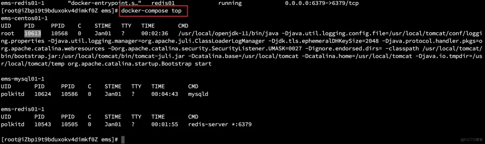

# docker-compose

https://docs.docker.com/compose/

场景： 一个复杂的应用，不是启动一个容器就能完成的

app = nginx + web + mysql +redis

以后只要启动app，创建app。都得run 4个，保证网络畅通+挂载ok 

使用 docker-compose, 可以写一个yaml文, 指定所有需要启动的内容, 通过指令 `docker-compose up/down` 启动/停止整个应用


## 1 安装 

### 1.1 安装 compose plugin

https://docs.docker.com/compose/install/

如果已经安装了 docker engine 和 docker cli , 可以安装 Compose plugin

#### 1.1.1 通过repository安装

ubuntu

```shell
sudo apt-get update
sudo apt-get install ca-certificates curl gnupg
sudo install -m 0755 -d /etc/apt/keyrings
curl -fsSL https://download.docker.com/linux/ubuntu/gpg | sudo gpg --dearmor -o /etc/apt/keyrings/docker.gpg
sudo chmod a+r /etc/apt/keyrings/docker.gpg
echo \
  "deb [arch="$(dpkg --print-architecture)" signed-by=/etc/apt/keyrings/docker.gpg] https://download.docker.com/linux/ubuntu \
  "$(. /etc/os-release && echo "$VERSION_CODENAME")" stable" | \
sudo tee /etc/apt/sources.list.d/docker.list > /dev/null

sudo apt-get update
sudo apt-get install docker-compose-plugin
```

查看 compose 插件版本

```shell
docker compose version
```

```shell
root@ubuntu-dev:~# docker compose version
Docker Compose version v2.20.2
```


#### 1.1.2 手动安装compose插件

```shell
DOCKER_CONFIG=${DOCKER_CONFIG:-$HOME/.docker}
mkdir -p $DOCKER_CONFIG/cli-plugins
curl -SL https://github.com/docker/compose/releases/download/v2.20.2/docker-compose-linux-x86_64 -o $DOCKER_CONFIG/cli-plugins/docker-compose

chmod +x $DOCKER_CONFIG/cli-plugins/docker-compose
```

查看 compose 插件版本

```shell
docker compose version
```

```shell
root@ubuntu-dev:~# docker compose version
Docker Compose version v2.20.2
```


### 1.2 安装 docker-compose

也可以安装单独的 docker-compose 工具

ubuntu

```shell
curl -SL "https://github.com/docker/compose/releases/download/v2.20.2/docker-compose-$(uname -s)-$(uname -m)" -o /usr/local/bin/docker-compose

sudo chmod +x /usr/local/bin/docker-compose
```

如果下载到了其他的目录, 可以使用软连接

```shell
sudo ln -s /usr/local/bin/docker-compose /usr/bin/docker-compose
```

查看docker-compose版本信息

```shell
root@ubuntu-dev:~# docker-compose version
Docker Compose version v2.20.2
```


## 2 compose示例

https://docs.docker.com/compose/gettingstarted/

### 2.1 创建目录

```shell
mkdir compose-test
cd compose-test
```


### 2.2 创建测试文件

```shell
vi app.py
```

```python
import time

import redis
from flask import Flask

app = Flask(__name__)
cache = redis.Redis(host='redis', port=6379)

def get_hit_count():
    retries = 5
    while True:
        try:
            return cache.incr('hits')
        except redis.exceptions.ConnectionError as exc:
            if retries == 0:
                raise exc
            retries -= 1
            time.sleep(0.5)

@app.route('/')
def hello():
    count = get_hit_count()
    return 'Hello World! I have been seen {} times.\n'.format(count)
```

### 2.3 创建依赖配置文件

```shell
vi requirements.txt
```

```shell
flask
redis
```


### 2.4 创建 Dockerfile

https://docs.docker.com/engine/reference/builder/

```shell
vi Dockerfile
```

```dockerfile
# syntax=docker/dockerfile:1
FROM python:3.7-alpine
WORKDIR /code
ENV FLASK_APP=app.py
ENV FLASK_RUN_HOST=0.0.0.0
RUN apk add --no-cache gcc musl-dev linux-headers
COPY requirements.txt requirements.txt
RUN pip install -r requirements.txt
EXPOSE 5000
COPY . .
CMD ["flask", "run"]
```


### 2.5 创建 docker-compose 配置文件

https://docs.docker.com/compose/compose-file/

```shell
vi docker-compose.yml
```

```yaml
services:
  web:
    build: .
    ports:
      - "8000:5000"
  redis:
    image: "redis:alpine"
```


### 2.6 启动服务

为了方便观察日志,这里使用前台启动, 如果需要后台启动, 可以增加 `-d` 参数

```shell
docker-compose up
```

```shell
root@ubuntu-dev:~/tmp/compose-test# docker-compose up
[+] Building 1.8s (13/13) FINISHED
 => [web internal] load build definition from Dockerfile                                                                  0.0s
 => => transferring dockerfile: 320B                                                                                      0.0s
 => [web internal] load .dockerignore                                                                                     0.0s
 => => transferring context: 2B                                                                                           0.0s
 => [web] resolve image config for docker.io/docker/dockerfile:1                                                          0.9s
 => CACHED [web] docker-image://docker.io/docker/dockerfile:1@sha256:ac85f380a63b13dfcefa89046420e1781752bab202122f8f500  0.0s
 => [web internal] load metadata for docker.io/library/python:3.7-alpine                                                  0.8s
 => [web 1/6] FROM docker.io/library/python:3.7-alpine@sha256:94c0a807604a8da09cf6597f11080ad8cdb62f9b4dc1e8cb8134e487f3  0.0s
 => [web internal] load build context                                                                                     0.0s
 => => transferring context: 130B                                                                                         0.0s
 => CACHED [web 2/6] WORKDIR /code                                                                                        0.0s
 => CACHED [web 3/6] RUN apk add --no-cache gcc musl-dev linux-headers                                                    0.0s
 => CACHED [web 4/6] COPY requirements.txt requirements.txt                                                               0.0s
 => CACHED [web 5/6] RUN pip install -r requirements.txt                                                                  0.0s
 => CACHED [web 6/6] COPY . .                                                                                             0.0s
 => [web] exporting to image                                                                                              0.0s
 => => exporting layers                                                                                                   0.0s
 => => writing image sha256:14cfdf98c1e4c68d483d482e9ab3f90fe0ac72b3b194264fb6358262d4782ba9                              0.0s
 => => naming to docker.io/library/compose-test-web                                                                       0.0s
[+] Running 2/0
 ✔ Container compose-test-redis-1  Created                                                                                0.0s
 ✔ Container compose-test-web-1    Created                                                                                0.0s
Attaching to compose-test-redis-1, compose-test-web-1
compose-test-redis-1  | 1:C 04 Aug 2023 13:30:49.739 # oO0OoO0OoO0Oo Redis is starting oO0OoO0OoO0Oo
compose-test-redis-1  | 1:C 04 Aug 2023 13:30:49.739 # Redis version=7.0.12, bits=64, commit=00000000, modified=0, pid=1, just started
compose-test-redis-1  | 1:C 04 Aug 2023 13:30:49.739 # Warning: no config file specified, using the default config. In order to specify a config file use redis-server /path/to/redis.conf
compose-test-redis-1  | 1:M 04 Aug 2023 13:30:49.740 * monotonic clock: POSIX clock_gettime
compose-test-redis-1  | 1:M 04 Aug 2023 13:30:49.740 * Running mode=standalone, port=6379.
compose-test-redis-1  | 1:M 04 Aug 2023 13:30:49.740 # Server initialized
compose-test-redis-1  | 1:M 04 Aug 2023 13:30:49.740 # WARNING Memory overcommit must be enabled! Without it, a background save or replication may fail under low memory condition. Being disabled, it can can also cause failures without low memory condition, see https://github.com/jemalloc/jemalloc/issues/1328. To fix this issue add 'vm.overcommit_memory = 1' to /etc/sysctl.conf and then reboot or run the command 'sysctl vm.overcommit_memory=1' for this to take effect.
compose-test-redis-1  | 1:M 04 Aug 2023 13:30:49.741 * Ready to accept connections
compose-test-web-1    |  * Serving Flask app 'app.py'
compose-test-web-1    |  * Debug mode: off
compose-test-web-1    | WARNING: This is a development server. Do not use it in a production deployment. Use a production WSGI server instead.
compose-test-web-1    |  * Running on all addresses (0.0.0.0)
compose-test-web-1    |  * Running on http://127.0.0.1:5000
compose-test-web-1    |  * Running on http://172.18.0.3:5000
compose-test-web-1    | Press CTRL+C to quit
```

使用 docker-compose 启动 docker-compose.yml 中定义的各个服务, 启动时会自动创建一个自定义服务, 并且将各个服务加入这个服务, 服务之前可以通过服务名作为域名直接访问, 所以在这段 python 代码中可以直接通过 redis 作为主机名对redis服务进行访问


### 2.7 测试

通过浏览器访问 http://192.168.0.140:8000/  

此时应用输出日志:

```shell
compose-test-web-1    | 192.168.0.108 - - [04/Aug/2023 13:24:27] "GET / HTTP/1.1" 200 -
compose-test-web-1    | 192.168.0.108 - - [04/Aug/2023 13:24:27] "GET / HTTP/1.1" 200 -
```


### 2.8 停止

前台启动直接 Ctrl+C 即可, 后台启动的可以通过下面的指令停止:

```shell
docker-compose down
```

这个指令会将服务的容器都删除

其他的指令

```shell
root@ubuntu-dev:~/tmp/compose-test# docker-compose --help

Usage:  docker compose [OPTIONS] COMMAND

Define and run multi-container applications with Docker.

Options:
      --ansi string                Control when to print ANSI control characters ("never"|"always"|"auto") (default "auto")
      --compatibility              Run compose in backward compatibility mode
      --dry-run                    Execute command in dry run mode
      --env-file stringArray       Specify an alternate environment file.
  -f, --file stringArray           Compose configuration files
      --parallel int               Control max parallelism, -1 for unlimited (default -1)
      --profile stringArray        Specify a profile to enable
      --progress string            Set type of progress output (auto, tty, plain, quiet) (default "auto")
      --project-directory string   Specify an alternate working directory
                                   (default: the path of the, first specified, Compose file)
  -p, --project-name string        Project name

Commands:
  build       Build or rebuild services
  config      Parse, resolve and render compose file in canonical format
  cp          Copy files/folders between a service container and the local filesystem
  create      Creates containers for a service.
  down        Stop and remove containers, networks
  events      Receive real time events from containers.
  exec        Execute a command in a running container.
  images      List images used by the created containers
  kill        Force stop service containers.
  logs        View output from containers
  ls          List running compose projects
  pause       Pause services
  port        Print the public port for a port binding.
  ps          List containers
  pull        Pull service images
  push        Push service images
  restart     Restart service containers
  rm          Removes stopped service containers
  run         Run a one-off command on a service.
  start       Start services
  stop        Stop services
  top         Display the running processes
  unpause     Unpause services
  up          Create and start containers
  version     Show the Docker Compose version information
  wait        Block until the first service container stops
```

常用的指令 : up /down  create / rm  start / stop  pause / restart


## 3 示例

https://docs.docker.com/get-started/08_using_compose/

```yaml
services:
  app:
    image: node:18-alpine
    command: sh -c "yarn install && yarn run dev"
    ports:
      - 127.0.0.1:3000:3000
    working_dir: /app
    volumes:
      - ./:/app
    environment:
      MYSQL_HOST: mysql
      MYSQL_USER: root
      MYSQL_PASSWORD: secret
      MYSQL_DB: todos

  mysql:
    image: mysql:8.0
    volumes:
      - todo-mysql-data:/var/lib/mysql
    environment:
      MYSQL_ROOT_PASSWORD: secret
      MYSQL_DATABASE: todos

volumes:
  todo-mysql-data:
```


# docker swarm

在当前安装有docker的节点执行, 当前节点会自动成为这个集群中的主节点

```shell
docker swarm init
```

```shell
root@ubuntu-dev:~/tmp/compose-test# docker swarm init
Swarm initialized: current node (89f33vnscsga6mmfvxn1rxa47) is now a manager.

To add a worker to this swarm, run the following command:

    docker swarm join --token SWMTKN-1-1zycl31h8m25fsyg41anfmtia9nr40w4myfow95l642lfjryk3-evski5p9u9mllsw7dyda45dqc 192.168.0.140:2377

To add a manager to this swarm, run 'docker swarm join-token manager' and follow the instructions.
```

添加工作节点:

其他安装了docker的和本机（master）能互通的机器只需要按照控制台打印的命令加入集群即可

```shell
docker swarm join --token SWMTKN-1-1zycl31h8m25fsyg41anfmtia9nr40w4myfow95l642lfjryk3-evski5p9u9mllsw7dyda45dqc 192.168.0.140:2377
```

添加主节点

在当前主节点执行:

```shell
docker swarm join-token manager
```

```shell
root@ubuntu-dev:~/tmp/compose-test# docker swarm join-token manager
To add a manager to this swarm, run the following command:

    docker swarm join --token SWMTKN-1-1zycl31h8m25fsyg41anfmtia9nr40w4myfow95l642lfjryk3-ehupi8tvxw4ekedo7uwk0r3gk 192.168.0.140:2377
```

根据提示, 在其他的安装了docker的可以与当前主节点联通的节点上运行

```shell
docker swarm join --token SWMTKN-1-1zycl31h8m25fsyg41anfmtia9nr40w4myfow95l642lfjryk3-ehupi8tvxw4ekedo7uwk0r3gk 192.168.0.140:2377
```

即可加入集群,成为主节点,形成高可用集群, 有了高可用集群, 就可以很方便的实现容器副本集的调度.

在 docker-compose.yaml 中的服务的定义中添加

```yaml
    deploy:
      replicas: 6
```

如 : 

```
services:
  app:
    image: node:18-alpine
    command: sh -c "yarn install && yarn run dev"
    ports:
      - 127.0.0.1:3000:3000
    working_dir: /app
    volumes:
      - ./:/app
    environment:
      MYSQL_HOST: mysql
      MYSQL_USER: root
      MYSQL_PASSWORD: secret
      MYSQL_DB: todos
    deploy:
      replicas: 6

  mysql:
    image: mysql:8.0
    volumes:
      - todo-mysql-data:/var/lib/mysql
    environment:
      MYSQL_ROOT_PASSWORD: secret
      MYSQL_DATABASE: todos

volumes:
  todo-mysql-data:
```

在集群模式下会由 master 几点进行调度, 在各个工作节点上部署容器实例


列出集群中的节点

```shell
docker node ls
```


k8s怎么解决： helm把整个应用的部署打成应用包，helm install mysql（主从）


在青云开的三个机器默认不通，想办法让他们处于同一子网。（创建vpc）

参照 https://workshop.pek3a.qingstor.com/CloudOperation_100P001C201908_%E8%99%9A%E6%8B%9F%E4%B8%BB%E6%9C%BA%E7%9A%84%E5%88%9B%E5%BB%BA%E5%92%8C%E4%BD%BF%E7%94%A8_v2.mp4

也就是 https://www.qingcloud.com/products/instances/ 下面的视频


compose文件名 docker-compose.yml / docker-compose.yaml / compose.yml / compose.yaml

```yaml
version: "3.9" #指定版本号;查看文档https://docs.docker.com/compose/compose-file/
services: #所有需要启动的服务
	web: #第一个服务的名字
		build: #docker build -t xxx -f Dockerfile .
		dockerfile: Dockerfile
		context: .
		image: 'hello:py'
		ports: #指定启动容器暴露的端口
		- "5000:5000"
	redis: #第二个服务的名字
		image: "redis:alpine"
	# mysqlserver: #第三个服务
```

```shell
#怎么执行的
Creating network "composetest_default" with the default driver
Building web
Sending build context to Docker daemon 5.632kB
Step 1/10 : FROM python:3.7-alpine
。。。。。。
Step 10/10 : CMD ["flask", "run"]
---> Running in 01e36491132c
Removing intermediate container 01e36491132c
---> 47d09826ac6f
Successfully built 47d09826ac6f
Successfully tagged hello:py
======web镜像名 hello:py===
WARNING: Image for service web was built because it did not already exist. To
rebuild this image you must use `docker-compose build` or `docker-compose up --
build`.
Pulling redis (redis:alpine)...
.......
Status: Downloaded newer image for redis:alpine
##下载成功
Creating composetest_redis_1 ... done
Creating composetest_web_1 ... done
Attaching to composetest_web_1, composetest_redis_1
redis_1 | 1:C 15 Apr 2021 13:55:27.693 # oO0OoO0OoO0Oo Redis is starting
oO0OoO0OoO0Oo
redis_1 | 1:C 15 Apr 2021 13:55:27.693 # Redis version=6.2.1, bits=64,
commit=00000000, modified=0, pid=1, just started
redis_1 | 1:C 15 Apr 2021 13:55:27.693 # Warning: no config file specified,
using the default config. In order to specify a config file use redis-server
/path/to/redis.conf
redis_1 | 1:M 15 Apr 2021 13:55:27.694 * monotonic clock: POSIX clock_gettime
redis_1 | 1:M 15 Apr 2021 13:55:27.695 * Running mode=standalone, port=6379.
redis_1 | 1:M 15 Apr 2021 13:55:27.695 # WARNING: The TCP backlog setting of
511 cannot be enforced because /proc/sys/net/core/somaxconn is set to the lower
value of 128.
redis_1 | 1:M 15 Apr 2021 13:55:27.695 # Server initialized
redis_1 | 1:M 15 Apr 2021 13:55:27.695 # WARNING overcommit_memory is set to 0!
Background save may fail under low memory condition. To fix this issue add
'vm.overcommit_memory = 1' to /etc/sysctl.conf and then reboot or run the
command 'sysctl vm.overcommit_memory=1' for this to take effect.
redis_1 | 1:M 15 Apr 2021 13:55:27.695 * Ready to accept connections
web_1 | * Serving Flask app "app.py"
web_1 | * Environment: production
web_1 | WARNING: This is a development server. Do not use it in a
production deployment.
web_1 | Use a production WSGI server instead.
web_1 | * Debug mode: off
web_1 | * Running on http://0.0.0.0:5000/ (Press CTRL+C to quit)
#因为compose创建了自定义网络，大家都能通
```


一句话启动这个 

```shell
docker-compose up -d
```

```yaml
version: "3.9" #指定版本号;查看文档https://docs.docker.com/compose/compose-file/
services: #所有需要启动的服务
	web: #第一个服务的名字
		build: #docker build -t xxx -f Dockerfile .
			dockerfile: Dockerfile
			context: .
		image: 'hello:py'
		ports: #指定启动容器暴露的端口
		- "5000:5000"
	redis: #第二个服务的名字
		image: "redis:alpine"
	mysql:
		image: "mysql"
		其他volumes,networks等
compose+docker swarm == 集群部署
```

```yaml
version: "3.7"
services:
app:
image: node:12-alpine
command: sh -c "yarn install && yarn run dev"
ports:
- 3000:3000
working_dir: /app
volumes:
- ./:/app
environment:
MYSQL_HOST: mysql
MYSQL_USER: root
MYSQL_PASSWORD: secret
MYSQL_DB: todos
networks:
- hello
- world
deploy: #安装docker swarm
replicas: 6 #指定副本：处于不同的服务器（负载均衡+高可用）
mysql: #可以代表一个容器，ping 服务名 mysql 可以访问
image: mysql:5.7 #负载均衡下，数据一致怎么做？？？主从同步，读写分离
volumes:
- todo-mysql-data:/var/lib/mysql
environment:
MYSQL_ROOT_PASSWORD: secret
MYSQL_DATABASE: todos
networks: #这个服务加入那个自定义网络
- hello
deploy: #安装docker swarm
replicas: 6 #指定副本：处于不同的服务器（负载均衡+高可用）
redis:
image: redis
networks:
- world
volumes:
todo-mysql-data:
networks:
hello:
world:
```


# docker-compose无法启动 docker-compose启动命令

**1、命令对象与格式**

对于`Compose`来说，大部分命令的对象既可以是项目本身，还可以指定为项目中的某个容器（服务），如果没有指定容器，命令对象将是项目

执行`docker-compose [command] --help`或者 `docker-compose help [command]`可以查看具体某个使用的命令

`docker-compose`命令的基本格式是

```plain
docker-compose -f docker-compose.yml 命令 【选项】【服务id】1.
```

### UP

格式为`docker-compose up [options] [service]`

该命令十分强大，他将尝试自动完成包括构建镜像，创建服务，启动服务，并关联服务相关容器的一系列操作

链接的服务都将被自动启动

可以说，大部分都可以直击人通过该命令来启动一个项目

默认情况，`docker-compose up`启动的容器都在前台，控制台将会打印所有容器的输出信息，方便调试

用过`Ctrl-c`停止时，所有容器将会停止

如果使用`docker-compose up -d`，将会在后台启动并运行所有容器，一般推荐生产环境使用

如果服务已经存在，`docker-compose up`将会尝试停止容器，然后重新创建，以保证新启动的服务匹配`docker-compose.yml`文件的最新内容

```plain
docker-compose up    对整个项目操作启动
docker-compose up -d 后台启动
docker-compose up 服务id 对当前docker-compose中对于的服务id操作1.2.3.
```

### Down

`docker-compose down`将关闭所有容器，停止up的所有容器，并移除网络

```plain
docker-compose down 关闭所有容器
docker-compose down 服务id 关闭某一个服务1.2.
```

### Exec

进入某个服务的内部

```plain
docker-compose exec 服务id bash1.
```

### ps

```plain
docker-compose ps 列出当前项目所有运行的服务1.
```


### restart

重启项目

```plain
docker-compose restart1.
```

重启项目20秒之后就自动启动服务

```plain
docker-compose restart -t 201.
```

### stop

停止某个服务

```plain
docker-compose stop 【服务id】1.
```

### rm

删除停止状态的整个项目或者某个服务

```plain
docker-compose rm 【服务id】1.
```

强制删除

```plain
docker-compose rm -f 【服务id】1.
```

顺便删除里面的数据卷（不推荐）

```plain
docker-compose rm  -v（删除容器挂载的数据卷） 【服务id】1.
```

### top

查看整个项目所有服务的进程或者某个指定服务的进程

```plain
docker-compose top 【服务id】1.
```



### unpause

恢复处于暂停状态中的服务

```plain
docker-compose unpause 【服务id】1.
```

### pause

暂停所有服务或者某一个服务

```plain
docker-compose pause 【服务id】1.
```

### logs

查看容器的日志

```plain
docker-compose  logs 【服务id】1.
```

查看实时日志

```plain
docker-compose  logs  -f【服务id】
```
