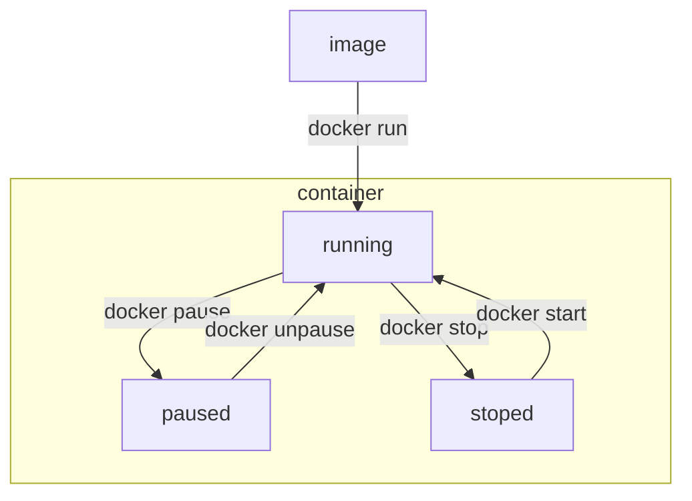

## Docker 入门

### 1. Docker简介

#### 1.1 项部署问题目

大型项目组件较多，运行环境复杂，部署时会碰到一些问题。

-  依赖关系复杂，容易出现兼容性问题
- 开发、测试、生产环境存在差异


#### 1.2 Docker如何解决大型项目依赖关系复杂，不同组件依赖的兼容性问题？

- Docker允许将应用、Deps（依赖）、Libs（函数库）、配置一起**打包**，形成可移植的镜像。
- Docker应用运行在**容器**中，使用沙箱机制，相互**隔离**，避免相互干扰。

操作系统内核（如Linux）与硬件交互，提供操作硬件的指令，系统应用（函数库）封装内核指令为函数，便于程序调用。用户程序基于系统函数库实现功能。

不同的操作台系统centos、ubuntu等的函数库不同，但是都是基于Linux内核，只是系统应用不一样，提供的函数库有差异。


#### 1.3 Docker如何解决不同系统环境的问题？

- Docker将用户程序与所需的系统（如ubuntu）函数库一起打包成镜像，其中包含了完整的运行环境

- Docker运行到不同的操作系统时，直接基于打包的库函数，借助于操作系统的Linux内核来运行，因此，Docker打包的程序可以运行在任何基于Linux内核的操作系统上。


#### 1.4 Docker的功能

Docker是一个快速交付、运行应用的技术

- 可以将程序及其依赖，运行环境一起打包成一个镜像，可以迁移到任意基于Linux内核的操作系统。
- 运行时利用沙箱机制形成的隔离机制，各个应用互相之间不会干扰。

- 启动、移除应用时只需要一个简单的命令即可完成，方便快捷。


#### 1.5 Docker与虚拟机的区别

-  Docker时一个系统进程，虚拟机是在操作系统中的操作系统

- Docker体积小，启动速度快，性能好；虚拟机体积大、启动速度慢、性能一般。

| 特性     | Docker   | 虚拟机   |
| -------- | -------- | -------- |
| 性能     | 接近原生 | 性能较差 |
| 硬盘占用 | 一般为MB | 一般为GB |
| 启动     | 秒级     | 分钟级   |

#### 1.6 Docker架构

##### 镜像和容器

-  **镜像**(Image)： Docker将应用程序及其所需要的依赖、函数库、环境、配置等文件打包在一起，成为镜像。

​	比如mysql镜像，就包含mysql运行的各种依赖，最终在硬盘上就是一个一个的文件，如/mysql/data,/mysql/logs,/mysql/bin, /mysql/lib, /mysql/share以及函数库。

-  **容器(**Contrainer): 镜像中的应用程序运行后形成的进程就是**容器**，只是Docker会给容器做隔离，对外不可见。

容器（运行中的进程）会有独立的cpu资源，内存资源和独立的文件系统，在容器中运行的进程会认为自己是该计算机内的唯一的进程。从而起到隔离的效果。从同一个镜像运行多个容器，相互之间也都是隔离的。


​	  容器运行的过程中会对数据进行读写操作，镜像是**只读**的（read only），基于镜像可以创建的容器， 但是容器不能往镜像中写入任何数据，只能读取数据。当容器需要写入数据时，将镜像中的文件/目录复制一份到独立的文件系统中，再进行读写。这样基于无论镜像创建多少个容器，如何运行，都不会对镜像产生影响。


#### 1.7 镜像的共享

DockerHub https://hub.docker.com/

Docker镜像的托管平台DockerRegistry

#### 1.8 Docker架构：

Docker是一个CS架构的程序，由两部分组成：

- 服务端（server）： Docker守护进程，负责处理Docker指令，管理镜像、容器等
- 客户端（client）：通过命令或者RestAPI向Docker服务端发送指令，可以在本地或者远程想服务端发送指令。


### 2. Docker的安装

#### 2.1 通过命令安装

参考官方说明  https://docs.docker.com/engine/install/ubuntu/

```bash
sudo apt-get remove docker docker-engine docker.io containerd runc
sudo apt-get update
sudo apt-get install \
    ca-certificates \
    curl \
    gnupg \
    lsb-release
sudo mkdir -p /etc/apt/keyrings
curl -fsSL https://download.docker.com/linux/ubuntu/gpg | sudo gpg --dearmor -o /etc/apt/keyrings/docker.gpg
echo \
  "deb [arch=$(dpkg --print-architecture) signed-by=/etc/apt/keyrings/docker.gpg] https://download.docker.com/linux/ubuntu \
  $(lsb_release -cs) stable" | sudo tee /etc/apt/sources.list.d/docker.list > /dev/null
 
sudo apt-get update
sudo chmod a+r /etc/apt/keyrings/docker.gpg
sudo apt-get update
sudo apt-get install docker-ce docker-ce-cli containerd.io docker-compose-plugin
sudo docker run hello-world
```


另外也可以在windows中安装docker，注意windows版本docker可以选择 WSL 2 backend和Hyper-V backend。要使用了Hyper-V backend，安装过程中选项 **Use WSL 2 instead of Hyper-V**  要取消勾选。

参考

https://docs.docker.com/desktop/install/windows-install/

https://blog.csdn.net/xzys430/article/details/108723202


#### 2.2 设置镜像加速

```
sudo mkdir -p /etc/docker
sudo tee /etc/docker/daemon.json <<-'EOF'
{
  "registry-mirrors": ["https://jkzyghm3.mirror.aliyuncs.com"]
}
EOF
sudo systemctl daemon-reload
sudo systemctl restart docker
```

https://cr.console.aliyun.com/cn-hangzhou/instances/mirrors

或者手动在/etc/docker目录下创建文件daemon.json

```json
{
  "registry-mirrors": ["https://jkzyghm3.mirror.aliyuncs.com"]
}
```

再通过 daemon-reload重新加载 daemon.json文件， restart docker 重启docker即可。

在windows版本中，打开docker desktop，在 settings - docker engine选项中修改配置，添加镜像服务地址，如下:

```json
{
  "registry-mirrors": ["https://jkzyghm3.mirror.aliyuncs.com"],
  //...
}
```


### 3. Docker的基本操作

docker --help 查看帮助文档

docker images --help 查看某个指令的帮助文档，如这条指令可以查看images指令的帮助文档。


#### 3.1 操作镜像

镜像名称[repository]:[tag]， 如mysql:5.7， Repository为mysql，tag(版本)为5.7。不指定tag时默认为最新版本的镜像。

常用指令如下：

| 常用指令      | 说明                              |
| ------------- | --------------------------------- |
| docker pull   | 从镜像服务器拉取镜像              |
| docker push   | 把镜像推送到镜像服务器            |
| docker save   | 保存镜像为一个压缩包文件          |
| docker load   | 从压缩包文件中加载镜像            |
| docker images | 查看镜像                          |
| docker rmi    | 删除镜像 **r**e**m**ove **i**mage |
| docker build  | 构建镜像                          |

实例：

1. 下载nginx镜像并展示

在[DockerHub](https://hub.docker.com/)中搜索 nginx， 在nginx镜像页面 https://hub.docker.com/_/nginx 中找到最新版本，或者使用latest版本，直接使用命令 

```bash
docker pull nginx
```

 拉取镜像。再通过命令

```bash
docker images
```

查看当前所有的镜像。

```bash
docker images
REPOSITORY   TAG       IMAGE ID       CREATED         SIZE
nginx        latest    605c77e624dd   12 months ago   141MB
```

2. 保存nginx镜像到文件，再加载为镜像

2.1 使用docker xx --help 查看 docker save / docker load 的使用方法

```bash
docker save --help

Usage:  docker save [OPTIONS] IMAGE [IMAGE...]

Save one or more images to a tar archive (streamed to STDOUT by default)

Options:
  -o, --output string   Write to a file, instead of STDOUT
  
  
docker load --help

Usage:  docker load [OPTIONS]

Load an image from a tar archive or STDIN

Options:
  -i, --input string   Read from tar archive file, instead of STDIN
  -q, --quiet          Suppress the load output
```

从文档中可以看到 Usage:  docker save [OPTIONS] IMAGE [IMAGE...]， docker save的使用方式 docker save +选项+镜像名称（如nginx:latest）

选项有 -o 或者 --output 参数为字符串表示的文件名，执行命令

```bash
docker save -o nginx.tar nginx:latest
```

可以看到本地生成了文件

```
ll
total 71244
-rwxrwx---    1 197609   197121   145905152 Jan 14 22:39 nginx.tar
```

使用docker rmi 删除本地的镜像，后面可以是镜像名 repository:tag 或者 镜像的id， id可以通过 docker images 查看

```bash
docker images
REPOSITORY   TAG       IMAGE ID       CREATED         SIZE
nginx        latest    605c77e624dd   12 months ago   141MB
```


```bash
docker rmi nginx:latest
```

或者

```bash
docker rmi 605c77e624dd
```

执行：

```bash
docker rmi 605c77e624dd
Untagged: nginx:latest
Untagged: nginx@sha256:0d17b565c37bcbd895e9d92315a05c1c3c9a29f762b011a10c54a66cd53c9b
31
Deleted: sha256:605c77e624ddb75e6110f997c58876baa13f8754486b461117934b24a9dc3a85
Deleted: sha256:b625d8e29573fa369e799ca7c5df8b7a902126d2b7cbeb390af59e4b9e1210c5
Deleted: sha256:7850d382fb05e393e211067c5ca0aada2111fcbe550a90fed04d1c634bd31a14
Deleted: sha256:02b80ac2055edd757a996c3d554e6a8906fd3521e14d1227440afd5163a5f1c4
Deleted: sha256:b92aa5824592ecb46e6d169f8e694a99150ccef01a2aabea7b9c02356cdabe7c
Deleted: sha256:780238f18c540007376dd5e904f583896a69fe620876cabc06977a3af4ba4fb5
Deleted: sha256:2edcec3590a4ec7f40cf0743c15d78fb39d8326bc029073b41ef9727da6c851f

docker images
REPOSITORY   TAG       IMAGE ID   CREATED   SIZE

```

查看docker load命令的帮助文档查看docker load是使用方法：

```bash
docker load --help

Usage:  docker load [OPTIONS]

Load an image from a tar archive or STDIN

Options:
  -i, --input string   Read from tar archive file, instead of STDIN
  -q, --quiet          Suppress the load output

```

可以看到后面直接用  -i 文件路径 即可，执行：

```bash
 docker load -i nginx.tar
2edcec3590a4: Loading layer  83.86MB/83.86MB
e379e8aedd4d: Loading layer     62MB/62MB
b8d6e692a25e: Loading layer  3.072kB/3.072kB
f1db227348d0: Loading layer  4.096kB/4.096kB
32ce5f6a5106: Loading layer  3.584kB/3.584kB
d874fd2bc83b: Loading layer  7.168kB/7.168kB
Loaded image: nginx:latest

docker images
REPOSITORY   TAG       IMAGE ID       CREATED         SIZE
nginx        latest    605c77e624dd   12 months ago   141MB

```

可以看到镜像已经加载成功了。


#### 3.2 操作容器

基本操作及容器的状态



注意：容器的暂停和停止是不一样的，区别在于操作系统的处理方式，

​	容器进入暂停状态，操作系统会将容器内的进程挂起，容器关联的内存暂存起来，cpu不再执行此进程，执行容器恢复操作后，内存空间恢复，程序继续执行，容器进入运行状态。

​	容器进入停止状态，操作系统直接杀死进程，容器所占用内存回收，保留的只有容器的文件系统。执行start命令后会启动一个全新的进程。


docker ps 命令查看所有的容器及其状态， 

docker logs 查看容器的日志， 

docker exec 进入容器内执行命令

docker rm 删除容器，会将容器的文件系统一并删除。


示例：创建并运行一个nginx容器

1. 进入[DockerHub](https://hub.docker.com/)查看nginx容器运行命令, https://hub.docker.com/_/nginx

2. 在页面中找到How to use this image，其中有说明

   Exposing external port

   ```bash
   $ docker run --name some-nginx -d -p 8080:80 some-content-nginx
   ```

   Then you can hit http://localhost:8080 or http://host-ip:8080 in your browser.

这里有提示命令 docker run --name some-nginx -d -p 8080:80 some-content-nginx，其中 

docker run ：创建并运行容器

--name some-nginx : 给容器起一个名称，如 some-nginx，或者myNginx等。每个容器必须有一个唯一的名称，不能重复，方便后续查找管理容器。

-p 8080:80 ： 将宿主端口与容器端口进行映射，冒号左边是宿主机端口，右侧是容器内端口。宿主机端口可以自由设置，没有被占用即可，容器端口一般由程序决定。比如 -p 8080:80，容器内nginx监听80端口，外部程序访问这需要请求 http://192.168.0.100:8080

-d : 后台运行容器

some-content-nginx : 最后的参数是镜像的名称。基于哪个镜像创建的容器，就需要传入该镜像的名称作为参数，比如 nginx，省略tag默认为latest


运行命令：

```bash
 docker run --name myNginx -p 8080:80 -d nginx:latest
5569ad8f3cbc3a17b002edda5c5aa8d4d81d12be8f2e5ef51e0bc94c7a435aa3
```

nginx:latest 可以省略为nginx，使用最新版本。运行后返回容器的id： 5569...5aa3, id和容器名都是全局唯一的。

查看容器状态：

```
 docker ps
CONTAINER ID   IMAGE          COMMAND                  CREATED          STATUS          PORTS                  NAMES
5569ad8f3cbc   nginx:latest   "/docker-entrypoint.…"   12 minutes ago   Up 12 minutes   0.0.0.0:8080->80/tcp   myNginx
```

| 参数         | 值                     | 说明                                       |
| ------------ | ---------------------- | ------------------------------------------ |
| CONTAINER ID | 5569ad8f3cbc           | 容器的id                                   |
| IMAGE        | nginx:latest           | 创建容器的镜像                             |
| COMMAND      | "/docker-entrypoint.…" | 内部参数                                   |
| CREATED      | 12 minutes ago         | 容器创建时间                               |
| STATUS       | Up 12 minutes          | 容器的状态， up为运行                      |
| PORTS        | 0.0.0.0:8080->80/tcp   | 端口映射，宿主机的8080映射到容器内的80端口 |
| NAMES        | myNginx                | 容器名称                                   |


查看日志 docker logs ，参数为指定的容器名称

```bash
docker logs myNginx
```

运行结果：

```bash
/docker-entrypoint.sh: /docker-entrypoint.d/ is not empty, will attempt to perform configuration
/docker-entrypoint.sh: Looking for shell scripts in /docker-entrypoint.d/
/docker-entrypoint.sh: Launching /docker-entrypoint.d/10-listen-on-ipv6-by-default.sh
10-listen-on-ipv6-by-default.sh: info: Getting the checksum of /etc/nginx/conf.d/default.conf
10-listen-on-ipv6-by-default.sh: info: Enabled listen on IPv6 in /etc/nginx/conf.d/default.conf
/docker-entrypoint.sh: Launching /docker-entrypoint.d/20-envsubst-on-templates.sh
/docker-entrypoint.sh: Launching /docker-entrypoint.d/30-tune-worker-processes.sh
/docker-entrypoint.sh: Configuration complete; ready for start up
2023/01/14 16:32:19 [notice] 1#1: using the "epoll" event method
2023/01/14 16:32:19 [notice] 1#1: nginx/1.21.5
2023/01/14 16:32:19 [notice] 1#1: built by gcc 10.2.1 20210110 (Debian 10.2.1-6)
2023/01/14 16:32:19 [notice] 1#1: OS: Linux 5.15.49-linuxkit
2023/01/14 16:32:19 [notice] 1#1: getrlimit(RLIMIT_NOFILE): 1048576:1048576
2023/01/14 16:32:19 [notice] 1#1: start worker processes
2023/01/14 16:32:19 [notice] 1#1: start worker process 31
2023/01/14 16:32:19 [notice] 1#1: start worker process 32
2023/01/14 16:32:19 [notice] 1#1: start worker process 33
2023/01/14 16:32:19 [notice] 1#1: start worker process 34
2023/01/14 16:32:19 [notice] 1#1: start worker process 35
2023/01/14 16:32:19 [notice] 1#1: start worker process 36
2023/01/14 16:32:19 [notice] 1#1: start worker process 37
2023/01/14 16:32:19 [notice] 1#1: start worker process 38
2023/01/14 16:32:19 [notice] 1#1: start worker process 39
2023/01/14 16:32:19 [notice] 1#1: start worker process 40
2023/01/14 16:32:19 [notice] 1#1: start worker process 41
2023/01/14 16:32:19 [notice] 1#1: start worker process 42
172.17.0.1 - - [14/Jan/2023:16:47:22 +0000] "GET / HTTP/1.1" 200 615 "-" "Mozilla/5.0 (Windows NT 10.0; Win64; x64) AppleWebKit/537.36 (KHTML, like Gecko) Chrome/109.0.0.0 Safari/537.36" "-"
2023/01/14 16:47:23 [error] 31#31: *1 open() "/usr/share/nginx/html/favicon.ico" failed (2: No such file or directory), client: 172.17.0.1, server: localhost, request: "GET /favicon.ico HTTP/1.1", host: "localhost:8080", referrer: "http://localhost:8080/"
172.17.0.1 - - [14/Jan/2023:16:47:23 +0000] "GET /favicon.ico HTTP/1.1" 404 555 "http://localhost:8080/" "Mozilla/5.0 (Windows NT 10.0; Win64; x64) AppleWebKit/537.36 (KHTML, like Gecko) Chrome/109.0.0.0 Safari/537.36" "-"
```

从日志中可以看到有一次浏览器的访问 http://localhost:8080/

如果想要持续查看日志，查看帮助文档：

```bash
 docker logs --help

Usage:  docker logs [OPTIONS] CONTAINER

Fetch the logs of a container

Options:
      --details        Show extra details provided to logs
  -f, --follow         Follow log output
      --since string   Show logs since timestamp (e.g.
                       2013-01-02T13:23:37Z) or relative (e.g. 42m for 42
                       minutes)
  -n, --tail string    Number of lines to show from the end of the logs
                       (default "all")
  -t, --timestamps     Show timestamps
      --until string   Show logs before a timestamp (e.g.
                       2013-01-02T13:23:37Z) or relative (e.g. 42m for 42
                       minutes)
```

文档中说明通过 -f 参数可以实现

```bash
docker logs -f myNginx
```

然后再浏览器中刷新几次页面，可看到控制台在持续输出：

```bash
172.17.0.1 - - [14/Jan/2023:16:57:08 +0000] "GET / HTTP/1.1" 304 0 "-" "Mozilla/5.0 (Windows NT 10.0; Win64; x64) AppleWebKit/537.36 (KHTML, like Gecko) Chrome/109.0.0.0 Safari/537.36" "-"
172.17.0.1 - - [14/Jan/2023:16:57:08 +0000] "GET / HTTP/1.1" 304 0 "-" "Mozilla/5.0 (Windows NT 10.0; Win64; x64) AppleWebKit/537.36 (KHTML, like Gecko) Chrome/109.0.0.0 Safari/537.36" "-"
172.17.0.1 - - [14/Jan/2023:16:57:09 +0000] "GET / HTTP/1.1" 304 0 "-" "Mozilla/5.0 (Windows NT 10.0; Win64; x64) AppleWebKit/537.36 (KHTML, like Gecko) Chrome/109.0.0.0 Safari/537.36" "-"
```


进入容器内部执行命令：

```bash
docker exec -it myNginx bash
root@5569ad8f3cbc:/#
```

| 命令参数    | 说明                                                       |
| ----------- | ---------------------------------------------------------- |
| docker exec | 进入容器内部执行一个命令                                   |
| -it         | 给当前进入的容器一个标准输入输出的终端，允许与容器进行交互 |
| myNginx     | 要进入的容器的名称                                         |
| bash        | 进入容器后执行的命令，bash是一个linux终端交互命令          |

容器内部是简化版的linux文件系统，nginx配置文件的位置需要在DockerHub页面中查看

```
Alternatively, a simple Dockerfile can be used to generate a new image that includes the necessary content (which is a much cleaner solution than the bind mount above):

FROM nginx
COPY static-html-directory /usr/share/nginx/html
```

可以看到nginx首页在/usr/share/nginx/html目录中。

```bash
root@5569ad8f3cbc:/usr/share/nginx/html# ls
50x.html  index.html
```

可以通过more tail指令查看文件

```bash
root@5569ad8f3cbc:/usr/share/nginx/html# more index.html
<!DOCTYPE html>
<html>
<head>
<title>Welcome to nginx!</title>
<style>
html { color-scheme: light dark; }
body { width: 35em; margin: 0 auto;
font-family: Tahoma, Verdana, Arial, sans-serif; }
</style>
</head>
<body>
<h1>Welcome to nginx!</h1>
<p>If you see this page, the nginx web server is successfully installed and
working. Further configuration is required.</p>

<p>For online documentation and support please refer to
<a href="http://nginx.org/">nginx.org</a>.<br/>
Commercial support is available at
<a href="http://nginx.com/">nginx.com</a>.</p>

<p><em>Thank you for using nginx.</em></p>
</body>
</html>
root@5569ad8f3cbc:/usr/share/nginx/html#
```

要修改index.html文件，不能使用vi命令，因为nginx镜像中没有打包改命令

1. 可以使用一下命令进行修改：

```bash
sed -i 's#Welcome to nginx!#Welcome to nginx in Docker!#g' index.html
```

刷新页面可以看到已经修改好了。

2. 也可以将文件复制到本地，修改后再传回容器中：

```bash
docker cp myNginx:/usr/share/nginx/html/index.html ./index.html
docker cp ./index.html myNginx:/usr/share/nginx/html/index.html
```

3. 使用-v挂载文件夹

启动的时候使用-v将容器内部的文件夹挂载（映射）到本地的某个路径下，以后以后可以直接在本地修改，不需要进入容器内部。-v参数的冒号前是本地路径（需要绝对路径），冒号后是容器中的路径

先停止容器 

```
docker stop myNginx
```

查看当前的容器

```
docker ps
```

运行结果:

```bash
CONTAINER ID   IMAGE     COMMAND   CREATED   STATUS    PORTS     NAMES
```

没有显示已经停止的容器，查看文档

```bash
docker ps --help

Usage:  docker ps [OPTIONS]

List containers

Options:
  -a, --all             Show all containers (default shows just running)
  -f, --filter filter   Filter output based on conditions provided
      --format string   Pretty-print containers using a Go template
  -n, --last int        Show n last created containers (includes all
                        states) (default -1)
  -l, --latest          Show the latest created container (includes all
                        states)
      --no-trunc        Don't truncate output
  -q, --quiet           Only display container IDs
  -s, --size            Display total file sizes
```

可以看到default shows just running 默认情况下只展示运行中的容器，所以需要加 -a 展示所有容器

```bash
docker ps -a
```

运行结果：

```bash
CONTAINER ID   IMAGE          COMMAND                  CREATED             STATUS                     PORTS     NAMES
5569ad8f3cbc   nginx:latest   "/docker-entrypoint.…"   About an hour ago   Exited (0) 4 minutes ago             myNginx
```

状态为Exited

此时运行

```bash
 docker start myNginx
```

可以再次启动容器，再查看状态

```bash
docker ps -a
```

运行结果：

```bash
CONTAINER ID   IMAGE          COMMAND                  CREATED             STATUS          PORTS                  NAMES
5569ad8f3cbc   nginx:latest   "/docker-entrypoint.…"   About an hour ago   Up 12 seconds   0.0.0.0:8080->80/tcp   myNginx
```

停止myNginx

```
docker stop myNginx
```

删除容器：

```bash
docker rm myNginx
```

如果删除运行中容器需要加 -f 参数

查看状态：

```bash
docker ps -a
```

运行结果

```bash
CONTAINER ID   IMAGE     COMMAND   CREATED   STATUS    PORTS     NAMES
```

已经没有任何容器了，再创建容器，并且挂载目录

```bash
docker run --name myNginx -p 8080:80 -v D:/tmp/docker/nginx/html:/usr/share/nginx/html -d nginx:latest
```

打开目录 D:/tmp/docker/nginx/html，此时目录为空，从nginx目录中复制50x.html和index.html到此目录下，修改文件并刷新浏览器(http://localhost:8080/)即可。


示例：

创建redis容器，并设置持久化

```bash
docker run --name myRedis -p 6379:6379 -d redis redis-server --appendonly yes
```

创建完成后可以通过指令

```bash
docker ps -a
```

查看运行中的容器:

```
CONTAINER ID   IMAGE          COMMAND                  CREATED         STATUS          PORTS                    NAMES
68012af1f738   redis          "docker-entrypoint.s…"   6 minutes ago   Up 6 minutes    0.0.0.0:6379->6379/tcp   myRedis
893f27c04358   nginx:latest   "/docker-entrypoint.…"   8 hours ago     Up 24 minutes   0.0.0.0:8080->80/tcp     myNginx
```

并且可以通过redis客户端连接redis服务，或者通过指令进入容器内部运行redis指令

```
docker exec -it myRedis redis-cli 
```


#### 3.3 数据卷

容器与数据的耦合问题：

1. 不便于修改，需要进入容器内部修改，很不方便。
2. 数据不可复用，容器内部修改对外不可见，新创建的容器容器时无法复用之前容器的修改。
3. 升级维护困难，数据在容器内，升级容器内的程序必然要删除旧容器，替换成新容器，旧容器的数据也一起被删除了。


数据卷 volume 是一个虚拟目录，指向宿主机的真实目录。通过docker指令创建数据卷时，docker会在宿主机特定的目录下（/var/lib/docker/volumes）创建一个目录


##### 3.3.1 操作数据卷

```bash
docker volume --help

Usage:  docker volume COMMAND

Manage volumes

Commands:
  create      Create a volume
  inspect     Display detailed information on one or more volumes
  ls          List volumes
  prune       Remove all unused local volumes
  rm          Remove one or more volumes
```

​	docker volume [COMMAND]

| 指令    | 说明                       |
| ------- | -------------------------- |
| create  | 创建一个volume             |
| inspect | 显示一个或多个volume信息   |
| ls      | 列出所有的volume           |
| prune   | 删除未使用的volume         |
| rm      | 删除指定的一个或多个volume |

示例：

1. 创建数据卷，取名为html，可以自定义

```bash
docker volume create html
html
```

2. 展示当前数据卷，已经存在之前docker自动创建的数据卷

```bash
docker volume ls
DRIVER    VOLUME NAME
local     299bee84b975befe1d594a8a0558188ac76c277d162f815139489cc27cbdebbe
local     9893d8dc9f24ffdc30c5028f24b4f49c2180554c3f97fdd57cd39401174199e4
local     html
```

3. 查看数据卷详情，参数为要查看的数据卷的名称

```bash
docker volume inspect html
[
    {
        "CreatedAt": "2023-01-19T03:28:07Z",
        "Driver": "local",
        "Labels": {},
        "Mountpoint": "/var/lib/docker/volumes/html/_data",
        "Name": "html",
        "Options": {},
        "Scope": "local"
    }
]
```

4. 删除未使用的数据卷，需要确认一次

```bash
docker volume prune
WARNING! This will remove all local volumes not used by at least one container.
Are you sure you want to continue? [y/N] y
Deleted Volumes:
9893d8dc9f24ffdc30c5028f24b4f49c2180554c3f97fdd57cd39401174199e4
html
Total reclaimed space: 0B                                                                                                       
```

5. 再次查看数据卷，可以看到只剩下一个在使用中的数据卷

```bash
docker volume ls
DRIVER    VOLUME NAME
local     299bee84b975befe1d594a8a0558188ac76c277d162f815139489cc27cbdebbe
```

6. 在此创建名称为html的数据卷，并通过rm指令删除

```bash
docker volume create html
html

docker volume ls
DRIVER    VOLUME NAME
local     299bee84b975befe1d594a8a0558188ac76c277d162f815139489cc27cbdebbe
local     html

docker volume rm html
html
                                                       
docker volume ls
DRIVER    VOLUME NAME
local     299bee84b975befe1d594a8a0558188ac76c277d162f815139489cc27cbdebbe
```


##### 3.3.2 挂载数据卷

创建容器时，通过 -v 参数挂载一个数据卷到某个容器

示例：

1. 首先查看当前数据卷，可以看到已经创建一个名为html的数据卷

```bash
docker volume ls
DRIVER    VOLUME NAME
local     299bee84b975befe1d594a8a0558188ac76c277d162f815139489cc27cbdebbe
local     html
```

2. 创建容器，并挂载数据卷

```bash
docker run --name myNginx -v html:/root/html -p 8080:80 -d nginx
```

```bash
# 创建并运行容器
docker run \

# 容器名为 myNginx
--name myNginx \

# 挂载名为html的数据卷到容器内部的 /root/html 目录
-v html:/root/html \

# 端口映射，宿主机8080端口映射到容器80端口
-p 8080:80 \

# 后台运行
-d \

# 创建容器的镜像名为nginx
nginx
```

创建容器时如果数据卷不存在，docker会自动创建数据卷，示例：

1. 停止并删除容器，清理数据卷：

```bash
docker stop myNginx
docker rm myNginx
docker volume prune
```

2. 查看当前数据卷

```bash
docker volume ls
DRIVER    VOLUME NAME
```

可以看到已经没有任何数据卷

3. 在此创建并运行容器

```bash
docker run --name myNginx -v html:/root/html -p 8080:80 -d nginx
```

4. 此时再查看数据卷

```bash
docker volume ls                 DRIVER    VOLUME NAME
local     html
```

可以看到自动创建了名为html的数据卷


