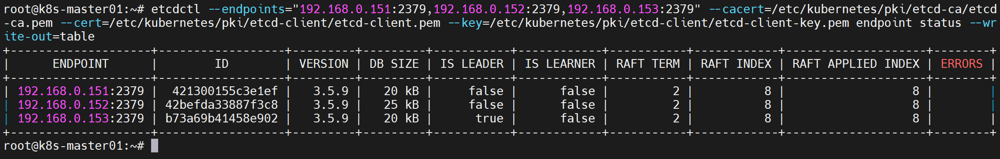

## 1 资源规划

节点规划

这里使用虚拟机，网络模式使用桥接模式

| 名称    | 节点角色 | 公网ip        | 内网ip        | 账号        | cpu  | 内存(G) | 磁盘(G) |
| ------- | -------- | ------------- | ------------- | ----------- | ---- | ------- | ------- |
| etcd-01 | etcd     | 192.168.0.151 | 192.168.0.151 | root/123456 | 2    | 4       | 32      |
| etcd-02 | etcd     | 192.168.0.152 | 192.168.0.152 | root/123456 | 2    | 4       | 32      |
| etcd-03 | etcd     | 192.168.0.153 | 192.168.0.153 | root/123456 | 2    | 4       | 32      |


## 2 前提条件

1 安装系统 

ubuntu server22.04 

2 分配静态 ip

3 配置ssh远程访问

## SSH远程免密登录


集群的各个服务器之间，可以相互信任，设置免密登录

1 生成密钥对

在所有节点执行

```shell
ssh-keygen -t rsa
```

按照默认设置, 输入三次enter即可生成密钥对


2 授权

```bash
ssh-copy-id 192.168.0.151
ssh-copy-id 192.168.0.152
ssh-copy-id 192.168.0.153
ssh-copy-id 192.168.0.161
ssh-copy-id 192.168.0.162
ssh-copy-id 192.168.0.163
```


4 保证所有节点互通

5 设置 hostname

6 将所有节点的hostname 写入 /etc/hosts

7 安装机可以ssh访问所有节点

安装机可以是集群内的节点, 如 k8s-master-01, 也可以是集群外同一网段的其他节点


3 编写脚本

```shell
vi etcd_install.sh
```

脚本内容

```shell
#!/bin/bash

###################################################
#                     参数设置                     #
###################################################

# 资源规划

etcd_nodes=(
    "etcd-01|192.168.0.151"
    "etcd-02|192.168.0.152"
    "etcd-03|192.168.0.153"
)

# 安装包版本

# 文件存放路径

# 工具及安装包的版本
cfssl_version="1.6.4"
etcd_version="3.5.9"

dns_server_list="8.8.8.8 114.114.114.114"
timezone="Asia/Shanghai"
ntp_server="edu.ntp.org.cn"

local_base_dir="tmp"
remote_base_dir="/root/etcd_install"

###################################################
#                     参数设置结束                  #
###################################################


# 准备变量

# 安装的工具列表
tools=(
    "psmisc"
    "vim"
    "net-tools"
    "nfs-kernel-server"
    "telnet"
    "lvm2"
    "git"
    "tar"
    "curl"
    "selinux-utils"
    "wget"
    "ipvsadm"
    "ipset"
    "sysstat"
    "conntrack"
    "gnupg2"
    "software-properties-common"
    "apt-transport-https"
    "ca-certificates"
	"ntpdate"
)

etcd_hostnames=()
etcd_ips=()
for node in "${etcd_nodes[@]}"; do
    IFS='|' read -r hostname ip <<< "$node"
    etcd_hostnames+=("$hostname")
    etcd_ips+=("$ip")
done

echo "etcd_hostnames"
for name in "${etcd_hostnames[@]}"; do
    echo "$name"
done

echo "etcd_ips:"
for ip in "${etcd_ips[@]}"; do
    echo "$ip"
done

etcd_hostnames_string=${etcd_hostnames[@]}
echo "etcd_hostnames_string:${etcd_hostnames_string}"

etcd_hostnames_string_comma=$(IFS=,; echo "${etcd_hostnames[*]}")
echo "etcd_hostnames_string_comma:${etcd_hostnames_string_comma}"

etcd_ips_string=${etcd_ips[@]}
echo "etcd_ips_string:${etcd_ips_string}"

etcd_ips_string_comma=$(IFS=,; echo "${etcd_ips[*]}")
echo "etcd_ips_string_comma:${etcd_ips_string_comma}"

etcd_urls_string_comma=""
for ip in "${etcd_ips[@]}"; do
    if [ -n "$etcd_urls_string_comma" ]; then
        etcd_urls_string_comma+=","
    fi
    etcd_urls_string_comma+="https://$ip:2379"
done
echo "etcd_urls_string_comma:$etcd_urls_string_comma"


# 下载工具列表
tools_string="${tools[*]}"

packages=(
    "cfssl_${cfssl_version}_linux_amd64|https://github.com/cloudflare/cfssl/releases/download/v${cfssl_version}/cfssl_${cfssl_version}_linux_amd64"
    
    "cfssljson_${cfssl_version}_linux_amd64|\
    https://github.com/cloudflare/cfssl/releases/download/v${cfssl_version}/cfssljson_${cfssl_version}_linux_amd64"
    
    "etcd-v${etcd_version}-linux-amd64.tar.gz|\
    https://github.com/etcd-io/etcd/releases/download/v${etcd_version}/etcd-v${etcd_version}-linux-amd64.tar.gz"
)

echo ###############################
echo #           prepare           #
echo ###############################

rm -rf etcd etcd-service etcd-pki etcd-pki-config etcd-config

# 设置 hostname
echo "set hostname"
for node in "${k8s_nodes[@]}"; do
    IFS='|' read -r hostname ip <<< "$node"
    echo "set hostname as $hostname in $ip"
    ssh "root@$ip" "hostnamectl set-hostname $hostname"
done

# 将ip host 信息添加到 /etc/hosts 文件
# 生成要添加到 /etc/hosts 的内容
echo "set hosts"
for node_info in "${k8s_nodes[@]}"; do
    IFS='|' read -r hostname ip <<< "$node_info"
    hosts_content="$ip $hostname"
	
	for remote_ip in "${k8s_node_ips[@]}"; do
		ssh "root@$remote_ip" "grep -q \"${hosts_content}\" /etc/hosts || echo -e \"$hosts_content\" >> /etc/hosts"
	done
	
	grep -q "${hosts_content}" /etc/hosts || echo -e "${hosts_content}" >> /etc/hosts
done

# 更新系统
echo "update and upgrade"
for node in "${etcd_hostnames[@]}"; do
    echo "update and upgrade in $node"
    ssh "root@$node" "apt update && apt upgrade -y"
done


# 安装工具
echo "install tools"
for node in "${etcd_hostnames[@]}"; do
    echo "install tools in ${node}, tools:${tools_string}"
    ssh "root@$node" "apt install -y ${tools_string}"
done


# 修改DNS
echo "set dns"
dns_config="[Resolve]\nDNS=${dns_server_list}"
for node in "${etcd_hostnames[@]}"; do
    echo "set dns in $node"
    ssh "root@$node" "grep -q '$dns_config' /etc/systemd/resolved.conf || echo -e '$dns_config' | sudo tee /etc/systemd/resolved.conf > /dev/null"
done


# 设置时区
echo "set timezone"
for node in "${etcd_hostnames[@]}"; do
    echo "set timezone to ${timezone} in $node"
    ssh "root@$node" "timedatectl set-timezone ${timezone}"
    # ntp 同步时钟
    ssh "root@$node" "ntpdate ${ntp_server}"
done


# 下载安装包
echo "download packages"
for package in "${packages[@]}"; do
    IFS='|' read -r filename remote_url <<< "$package"
    
    # 检查本地是否存在文件
    if [ ! -f "${local_base_dir}/$filename" ]; then
        echo "file $filename not exists, downloading..."
        wget "$remote_url" -O "${local_base_dir}/$filename"
        if [ $? -eq 0 ]; then
            echo "download finished"
        else
            echo "download failed"
        fi
    else
        echo "$filename exists, skip downloading。"
    fi
done


echo ###############################
echo #            start            #
echo ###############################

# 安装 cfssl cfssljson
echo "install cfssl cfssljson to local node"
cp ${local_base_dir}/cfssl_${cfssl_version}_linux_amd64 /usr/local/bin/cfssl
cp ${local_base_dir}/cfssljson_${cfssl_version}_linux_amd64 /usr/local/bin/cfssljson
chmod +x /usr/local/bin/cfssl /usr/local/bin/cfssljson

# 安装 etcd
mkdir -p etcd
tar -zxvf etcd-v${etcd_version}-linux-amd64.tar.gz -C etcd
for node in "${etcd_hostnames[@]}"; do
    echo "copying etcd etcdctl to $node"
    # 将可执行文件发送到所有的etcd节点 /usr/local/bin/ 目录下
    scp etcd/etcd-v${etcd_version}-linux-amd64/etcd root@$node:/usr/local/bin/
    scp etcd/etcd-v${etcd_version}-linux-amd64/etcdctl root@$node:/usr/local/bin/
done

# 删除旧的证书文件
for node in "${etcd_hostnames[@]}"; do
    ssh root@$node "mkdir -p /etc/etcd/ssl && rm -rf /etc/etcd/ssl/*"
done

# 存放证书配置
mkdir -p ${local_base_dir}/etcd-pki-config
# 存放生成的证书
mkdir -p ${local_base_dir}/etcd-pki

# 生成 etcd ca 证书
cat > etcd-pki-config/ca-config.json << EOF 
{
  "signing": {
    "default": {
      "expiry": "876000h"
    },
    "profiles": {
      "kubernetes": {
        "usages": [
            "signing",
            "key encipherment",
            "server auth",
            "client auth"
        ],
        "expiry": "876000h"
      }
    }
  }
}
EOF

cat > etcd-pki-config/etcd-ca-csr.json  << EOF 
{
  "CN": "etcd",
  "key": {
    "algo": "rsa",
    "size": 2048
  },
  "names": [
    {
      "C": "CN",
      "ST": "Beijing",
      "L": "Beijing",
      "O": "etcd",
      "OU": "Etcd Security"
    }
  ],
  "ca": {
    "expiry": "876000h"
  }
}
EOF


cfssl gencert -initca etcd-pki-config/etcd-ca-csr.json | cfssljson -bare etcd-pki/etcd-ca


cat > etcd-pki-config/etcd-csr.json << EOF 
{
  "CN": "etcd",
  "key": {
    "algo": "rsa",
    "size": 2048
  },
  "names": [
    {
      "C": "CN",
      "ST": "Beijing",
      "L": "Beijing",
      "O": "etcd",
      "OU": "Etcd Security"
    }
  ]
}
EOF

cfssl gencert \
-ca=etcd-pki/etcd-ca.pem \
-ca-key=etcd-pki/etcd-ca-key.pem \
-config=etcd-pki-config/ca-config.json \
-hostname=127.0.0.1,${etcd_hostnames_string_comma},${etcd_ips_string_comma} \
-profile=kubernetes \
etcd-pki-config/etcd-csr.json | cfssljson -bare etcd-pki/etcd

# 将 etcd 的证书发送到 etcd 节点
for node in "${etcd_hostnames[@]}"; do
    ssh "root@$node" "mkdir -p /etc/etcd/ssl"
    for file in etcd-ca-key.pem etcd-ca.pem etcd-key.pem etcd.pem; do
        scp etcd-pki/${file} root@$node:/etc/etcd/ssl/${file};
    done;
done

# 将 etcd 的证书复制到 k8s-master 节点
for node in "${k8s_master_hostnames[@]}"; do
    ssh root@$node "mkdir -p /etc/kubernetes/pki/etcd"

	for file in etcd-ca.pem etcd.pem etcd-key.pem; do
        scp etcd-pki/$file root@$node:/etc/kubernetes/pki/etcd/$file
    done
    
done


# 创建保存 etcd 配置文件的目录
mkdir etcd-config

initial_cluster=""
for node in "${etcd_nodes[@]}"; do
    IFS='|' read -ra node_info <<< "$node"
    node_name="${node_info[0]}"
    node_ip="${node_info[1]}"
    
    if [ -n "$initial_cluster" ]; then
        initial_cluster+=","
    fi
    initial_cluster+="$node_name=https://$node_ip:2380"
done

# Loop through each etcd node
for node in "${etcd_nodes[@]}"; do
    IFS='|' read -ra node_info <<< "$node"
    node_name="${node_info[0]}"
    node_ip="${node_info[1]}"
    
    # Generate configuration content
    config_content="name: '$node_name'\n"
    config_content+="data-dir: /var/lib/etcd\n"
    config_content+="wal-dir: /var/lib/etcd/wal\n"
    config_content+="snapshot-count: 5000\n"
    config_content+="heartbeat-interval: 100\n"
    config_content+="election-timeout: 1000\n"
    config_content+="quota-backend-bytes: 0\n"
    config_content+="listen-peer-urls: 'https://$node_ip:2380'\n"
    config_content+="listen-client-urls: 'https://$node_ip:2379,http://127.0.0.1:2379'\n"
    config_content+="max-snapshots: 3\n"
    config_content+="max-wals: 5\n"
    config_content+="cors:\n"
    config_content+="initial-advertise-peer-urls: 'https://$node_ip:2380'\n"
    config_content+="advertise-client-urls: 'https://$node_ip:2379'\n"
    config_content+="discovery:\n"
    config_content+="discovery-fallback: 'proxy'\n"
    config_content+="discovery-proxy:\n"
    config_content+="discovery-srv:\n"
    config_content+="initial-cluster: '$initial_cluster'\n"
    config_content+="initial-cluster-token: 'etcd-k8s-cluster'\n"
    config_content+="initial-cluster-state: 'new'\n"
    config_content+="strict-reconfig-check: false\n"
    config_content+="enable-v2: true\n"
    config_content+="enable-pprof: true\n"
    config_content+="proxy: 'off'\n"
    config_content+="proxy-failure-wait: 5000\n"
    config_content+="proxy-refresh-interval: 30000\n"
    config_content+="proxy-dial-timeout: 1000\n"
    config_content+="proxy-write-timeout: 5000\n"
    config_content+="proxy-read-timeout: 0\n"
    config_content+="client-transport-security:\n"
    config_content+="  cert-file: '/etc/etcd/ssl/etcd.pem'\n"
    config_content+="  key-file: '/etc/etcd/ssl/etcd-key.pem'\n"
    config_content+="  client-cert-auth: true\n"
    config_content+="  trusted-ca-file: '/etc/etcd/ssl/etcd-ca.pem'\n"
    config_content+="  auto-tls: true\n"
    config_content+="peer-transport-security:\n"
    config_content+="  cert-file: '/etc/etcd/ssl/etcd.pem'\n"
    config_content+="  key-file: '/etc/etcd/ssl/etcd-key.pem'\n"
    config_content+="  peer-client-cert-auth: true\n"
    config_content+="  trusted-ca-file: '/etc/etcd/ssl/etcd-ca.pem'\n"
    config_content+="  auto-tls: true\n"
    config_content+="debug: false\n"
    config_content+="log-package-levels:\n"
    config_content+="log-outputs: [default]\n"
    config_content+="force-new-cluster: false\n"
    
    echo -e "$config_content" > etcd-config/"${node_name}-config.yaml"
    
    echo "Configuration file '$config_file' created for $node_name"
done


# 将配置文件发送到对应的etcd节点, 并保存为 /etc/etcd/etcd.config.yml
for node in "${etcd_hostnames[@]}"; do
    config_file="etcd-config/${node}-config.yaml"
    echo "copying ${config_file} to $node"
    ssh "root@$node" "mkdir -p /etc/etcd"
    scp ${config_file} root@$node:/etc/etcd/etcd.config.yml
done


mkdir etcd-service

cat > etcd-service/etcd.service << EOF

[Unit]
Description=Etcd Service
Documentation=https://coreos.com/etcd/docs/latest/
After=network.target

[Service]
Type=notify
ExecStart=/usr/local/bin/etcd --config-file=/etc/etcd/etcd.config.yml
Restart=on-failure
RestartSec=10
LimitNOFILE=65536

[Install]
WantedBy=multi-user.target
Alias=etcd3.service

EOF


# 将配置文件发送到对应的etcd节点, 并保存为 /etc/etcd/etcd.config.yml
for node in "${etcd_hostnames[@]}"; do
    scp etcd-service/etcd.service root@$node:/usr/lib/systemd/system/etcd.service
    ssh "root@$node" "systemctl daemon-reload"
    ssh "root@$node" "systemctl enable --now etcd.service"
	ssh "root@$node" "systemctl restart etcd.service"
done


```

```shell
chmod +x vi etcd_install.sh && ./vi etcd_install.sh
```


在所有 etcd 节点上执行:

```shell
etcdctl --endpoints="192.168.0.151:2379,192.168.0.152:2379,192.168.0.153:2379" --cacert=/etc/etcd/pki/etcd-ca.pem --cert=/etc/etcd/pki/etcd-client.pem --key=/etc/etcd/pki/etcd-client-key.pem endpoint status --write-out=table
```

可以看到 etcd 状态输出:

```
+--------------------+------------------+---------+---------+-----------+------------+-----------+------------+--------------------+--------+
|      ENDPOINT      |        ID        | VERSION | DB SIZE | IS LEADER | IS LEARNER | RAFT TERM | RAFT INDEX | RAFT APPLIED INDEX | ERRORS |
+--------------------+------------------+---------+---------+-----------+------------+-----------+------------+--------------------+--------+
| 192.168.0.151:2379 |  421300155c3e1ef |   3.5.9 |   20 kB |     false |      false |         2 |          8 |                  8 |        |
| 192.168.0.152:2379 | 42befda33887f3c8 |   3.5.9 |   25 kB |     false |      false |         2 |          8 |                  8 |        |
| 192.168.0.153:2379 | b73a69b41458e902 |   3.5.9 |   20 kB |      true |      false |         2 |          8 |                  8 |        |
+--------------------+------------------+---------+---------+-----------+------------+-----------+------------+--------------------+--------+
```



导出环境变量，方便测试，参照 https://github.com/etcd-io/etcd/tree/main/etcdctl


```shell
export ETCDCTL_API=3
HOST_1=192.168.0.151
HOST_2=192.168.0.152
HOST_3=192.168.0.153
ENDPOINTS=$HOST_1:2379,$HOST_2:2379,$HOST_3:2379

export ETCDCTL_DIAL_TIMEOUT=3s
export ETCDCTL_CACERT=/etc/etcd/ssl/etcd-ca.pem
export ETCDCTL_CERT=/etc/etcd/ssl/etcd.pem
export ETCDCTL_KEY=/etc/etcd/ssl/etcd-key.pem
export ETCDCTL_ENDPOINTS=$HOST_1:2379,$HOST_2:2379,$HOST_3:2379
```

自动用环境变量定义的证书位置

```shell
etcdctl member list --write-out=table
```

```shell
root@k8s-master01:~# etcdctl member list --write-out=table
+------------------+---------+--------------+----------------------------+----------------------------+------------+
|        ID        | STATUS  |     NAME     |         PEER ADDRS         |        CLIENT ADDRS        | IS LEARNER |
+------------------+---------+--------------+----------------------------+----------------------------+------------+
|  421300155c3e1ef | started | etcd-node-01 | https://192.168.0.151:2380 | https://192.168.0.151:2379 |      false |
| 42befda33887f3c8 | started | etcd-node-02 | https://192.168.0.152:2380 | https://192.168.0.152:2379 |      false |
| b73a69b41458e902 | started | etcd-node-03 | https://192.168.0.153:2380 | https://192.168.0.153:2379 |      false |
+------------------+---------+--------------+----------------------------+----------------------------+------------+
```

如果没有使用环境变量就需要如下方式调用, 注意如果设置了环境变量, 下面的命令会报错, 原因是 etcdctl 命令参数和环境变量中都读出参数的值导致冲突

```shell
etcdctl --endpoints=$ENDPOINTS --cacert=/etc/kubernetes/pki/etcd/ca.pem --cert=/etc/kubernetes/pki/etcd/etcd.pem --key=/etc/kubernetes/pki/etcd/etcdkey.pem member list --write-out=table
```

更多etcdctl命令，https://etcd.io/docs/v3.5/demo/#access-etcd


