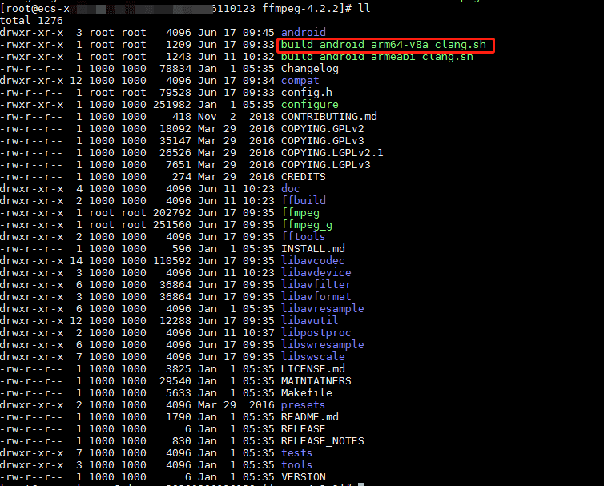
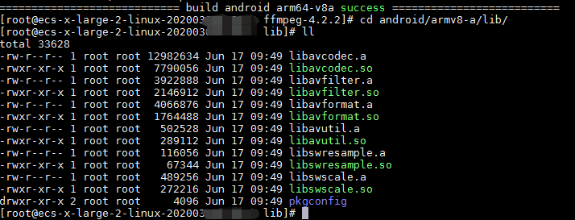
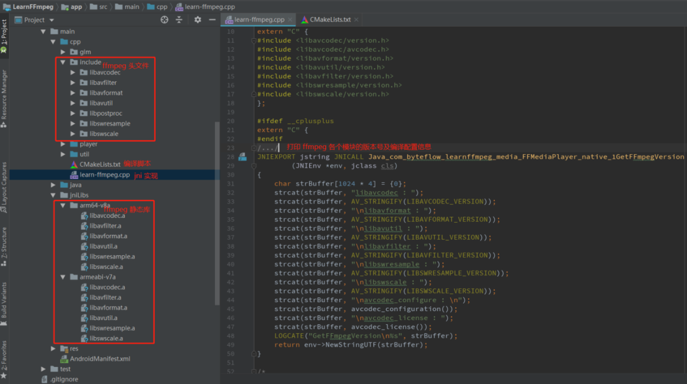
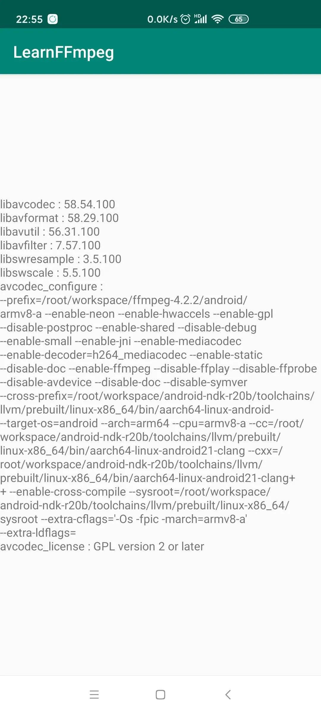

# FFmpeg 开发(01)：FFmpeg 编译和集成


*1*

**为什么要学习 FFmpeg 开发**


FFmpeg 是一款知名的开源音视频处理软件，它提供了丰富而友好的接口支持开发者进行二次开发。


**FFmpeg 读作 “ef ef em peg” ，其中的 “FF” 指的是 “Fast Forward”，“mpeg” 则是 “Moving Picture Experts Group” （动态图像专家组）。**


FFmpeg 项目功能复杂而庞大，基本上支持所有常见的音视频处理操作，如封装格式转换、音视频转码、音视频播放和剪辑、视频添加水印滤镜等。


**尽管 FFmpeg 功能强大，但是由于其采用的是带有传染性的 LGPL/GPL 开源协议，所以一些大厂基本上都是自己独立开发类似的音视频处理库，甚至在接口和组织模块上模仿 FFmpeg 。**


**因此，学习 FFmpeg 不仅能够帮助你掌握音视频开发的相关知识脉络，还能让你快速适应不同的音视频处理框架。**


*2*

 **FFmpeg 编译**


FFmpeg 有六个常用的功能模块：


- **libavformat：多媒体文件或协议的封装和解封装库；**
- **libavcodec：音视频编解码库；**
- **libavfilter：音视频、字幕滤镜库；**
- **libswscale：图像格式转换库；**
- **libswresample：音频重采样库；**
- **libavutil：工具库。**


**本文主要是帮助初学者快速上手 FFmpeg 的编译和集成，对 FFmpeg 项目的编译配置细节就不做过多阐述，这不是本篇内容所能容纳的。**


这里主要选择编译 ffmpeg v4.2.2 版本，因为这个版本网上的解决方案比较多，而且大部分可行。


编译环境:

- CentOS Linux release 7.6.1810 (Core)
- android-ndk-r20b-linux-x86_64
- ffmpeg-4.2.2


编译前准备：


```
#1. 下载 ffmpeg-4.2.2
wget https://ffmpeg.org/releases/ffmpeg-4.2.2.tar.bz2
#2. 解压 FFmpeg 
tar -jxvf ffmpeg-4.2.2.tar.bz2
#3. 运行 configure 脚本配置项目
./configure --disable-x86asm
```


解压目录下创建编译脚本

在 FFmpeg 4.2.2 解压目录下创建编译脚本 build_android_arm64-v8a_clang.sh：


```
#!/bin/bash

export NDK=/root/workspace/android-ndk-r20b #这里配置先你的 NDK 路径
TOOLCHAIN=$NDK/toolchains/llvm/prebuilt/linux-x86_64


function build_android
{

./configure \
--prefix=$PREFIX \
--enable-neon  \
--enable-hwaccels  \
--enable-gpl   \
--disable-postproc \
--disable-debug \
--enable-small \
--enable-jni \
--enable-mediacodec \
--enable-decoder=h264_mediacodec \
--enable-static \
--enable-shared \
--disable-doc \
--enable-ffmpeg \
--disable-ffplay \
--disable-ffprobe \
--disable-avdevice \
--disable-doc \
--disable-symver \
--cross-prefix=$CROSS_PREFIX \
--target-os=android \
--arch=$ARCH \
--cpu=$CPU \
--cc=$CC \
--cxx=$CXX \
--enable-cross-compile \
--sysroot=$SYSROOT \
--extra-cflags="-Os -fpic $OPTIMIZE_CFLAGS" \
--extra-ldflags="$ADDI_LDFLAGS"

make clean
make -j16
make install

echo "============================ build android arm64-v8a success =========================="

}

#arm64-v8a
ARCH=arm64
CPU=armv8-a
API=21
CC=$TOOLCHAIN/bin/aarch64-linux-android$API-clang
CXX=$TOOLCHAIN/bin/aarch64-linux-android$API-clang++
SYSROOT=$NDK/toolchains/llvm/prebuilt/linux-x86_64/sysroot
CROSS_PREFIX=$TOOLCHAIN/bin/aarch64-linux-android-
PREFIX=$(pwd)/android/$CPU
OPTIMIZE_CFLAGS="-march=$CPU"

build_android
```


编译 FFmpeg Android 平台的 64 位动态库和静态库：


```
# 修改 build_android_arm64-v8a_clang.sh 可执行权限
chmod +x build_android_arm64-v8a_clang.sh
# 运行编译脚本
./build_android_arm64-v8a_clang.sh
```


编译成功

编译成功后会在 android 目录下生成对应六个模块的静态库和动态库。


另外，若要编译成 32 位的库，则需修改对应的编译脚本：


```
#armv7-a
ARCH=arm
CPU=armv7-a
API=21
CC=$TOOLCHAIN/bin/armv7a-linux-androideabi$API-clang
CXX=$TOOLCHAIN/bin/armv7a-linux-androideabi$API-clang++
SYSROOT=$NDK/toolchains/llvm/prebuilt/linux-x86_64/sysroot
CROSS_PREFIX=$TOOLCHAIN/bin/arm-linux-androideabi-
PREFIX=$(pwd)/android/$CPU
OPTIMIZE_CFLAGS="-mfloat-abi=softfp -mfpu=vfp -marm -march=$CPU "
```


*3*

 **FFmpeg 集成**


基于上节编译好的 FFmpeg 静态库，我们在 Android Studio 上进行简单的集成测试。


将 FFmpeg 各个模块的静态库和头文件放置到指定目录下

我们可以按照上图所示，将 FFmpeg 各个模块的静态库和头文件放置到指定目录下，实现一个获取各个模块版本信息的 jni 。


```
#include <cstdio>
#include <cstring>
#include "util/LogUtil.h"
#include "jni.h"

//由于 FFmpeg 库是 C 语言实现的，告诉编译器按照 C 的规则进行编译
extern "C" {
#include <libavcodec/version.h>
#include <libavcodec/avcodec.h>
#include <libavformat/version.h>
#include <libavutil/version.h>
#include <libavfilter/version.h>
#include <libswresample/version.h>
#include <libswscale/version.h>
};

#ifdef __cplusplus
extern "C" {
#endif
/*
 * Class:     com_byteflow_learnffmpeg_media_FFMediaPlayer
 * Method:    native_GetFFmpegVersion
 * Signature: ()Ljava/lang/String;
 */
JNIEXPORT jstring JNICALL Java_com_byteflow_learnffmpeg_media_FFMediaPlayer_native_1GetFFmpegVersion
        (JNIEnv *env, jclass cls)
{
    char strBuffer[1024 * 4] = {0};
    strcat(strBuffer, "libavcodec : ");
    strcat(strBuffer, AV_STRINGIFY(LIBAVCODEC_VERSION));
    strcat(strBuffer, "\nlibavformat : ");
    strcat(strBuffer, AV_STRINGIFY(LIBAVFORMAT_VERSION));
    strcat(strBuffer, "\nlibavutil : ");
    strcat(strBuffer, AV_STRINGIFY(LIBAVUTIL_VERSION));
    strcat(strBuffer, "\nlibavfilter : ");
    strcat(strBuffer, AV_STRINGIFY(LIBAVFILTER_VERSION));
    strcat(strBuffer, "\nlibswresample : ");
    strcat(strBuffer, AV_STRINGIFY(LIBSWRESAMPLE_VERSION));
    strcat(strBuffer, "\nlibswscale : ");
    strcat(strBuffer, AV_STRINGIFY(LIBSWSCALE_VERSION));
    strcat(strBuffer, "\navcodec_configure : \n");
    strcat(strBuffer, avcodec_configuration());
    strcat(strBuffer, "\navcodec_license : ");
    strcat(strBuffer, avcodec_license());
    LOGCATE("GetFFmpegVersion\n%s", strBuffer);
    return env->NewStringUTF(strBuffer);
}

#ifdef __cplusplus
}
#endif
```


Java 层的调用逻辑：


```
package com.byteflow.learnffmpeg.media;

public class FFMediaPlayer {
    static {
        System.loadLibrary("learn-ffmpeg");
    }

    public static String GetFFmpegVersion() {
        return native_GetFFmpegVersion();
    }

    private static native String native_GetFFmpegVersion();
}
//===================  main activity  ===========================
public class MainActivity extends AppCompatActivity {

    @Override
    protected void onCreate(Bundle savedInstanceState) {
        super.onCreate(savedInstanceState);
        setContentView(R.layout.activity_main);
        ((TextView)findViewById(R.id.text_view)).setText(FFMediaPlayer.GetFFmpegVersion());
    }
}
```


CMakeLists.txt 构建脚本：


```
# Sets the minimum version of CMake required to build the native library.
cmake_minimum_required(VERSION 3.4.1)

set(CMAKE_CXX_FLAGS "${CMAKE_CXX_FLAGS} -std=gnu++11")

set(jnilibs ${CMAKE_SOURCE_DIR}/../jniLibs)
set(libname learn-ffmpeg)

include_directories(
        include
        ${CMAKE_SOURCE_DIR}/util
)

link_directories(
        ${jnilibs}/${ANDROID_ABI})

file(GLOB src-files
        ${CMAKE_SOURCE_DIR}/*.cpp)

add_library( # Sets the name of the library.
             ${libname}

             # Sets the library as a shared library.
             SHARED

             # Provides a relative path to your source file(s).
             ${src-files}
        )

set(third-party-libs
        avformat
        avcodec
        avfilter
        swresample
        swscale
        avutil
        )

set(native-libs
        android
        EGL
        GLESv3
        OpenSLES
        log
        m
        z
        )

target_link_libraries( # Specifies the target library.
                       ${libname}

                       # Links the target library to the log library
                       # included in the NDK.
                       ${log-lib}
                       ${third-party-libs}
                       ${native-libs}
                       )
```


编译完成后，运行 App 获取 FFmpeg 各个模块版本和编译配置信息。


运行 App 获取 FFmpeg 各个模块版本和编译配置信息

#  

#  

# **参考文章**

# https://blog.csdn.net/leixiaohua1020

# https://juejin.im/post/5e1eace16fb9a02fec66474e