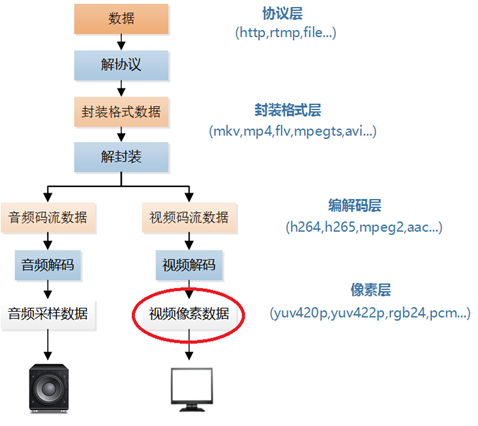
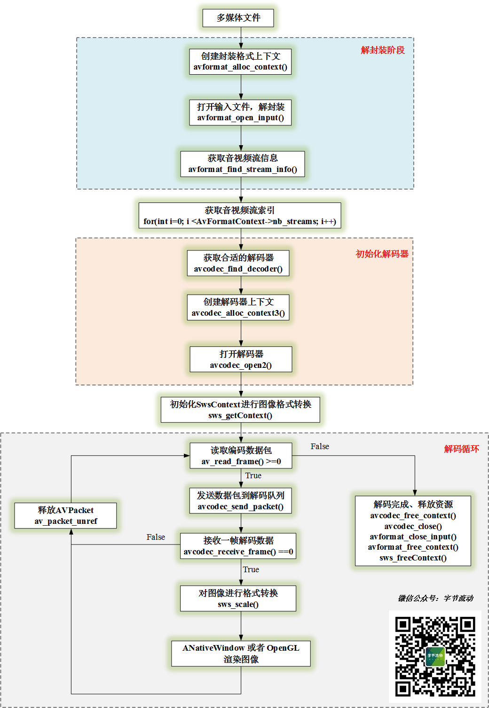

# FFmpeg 开发(02)：利用 FFmpeg 和 ANativeWindow 实现视频解码播放

上一篇文章[FFmpeg 开发(01)：FFmpeg 编译和集成](http://mp.weixin.qq.com/s?__biz=MzIwNTIwMzAzNg==&mid=2654162543&idx=1&sn=894a6bfb0f8f652ef53860075af1754b&chksm=8cf39d5cbb84144a9d62fa80cbeed1843aadfe97bf8a30ab02474f98ec86be649d65e301674b&scene=21#wechat_redirect) 实现了 FFmpeg 的编译和集成。


本文将利用 FFmpeg 对一个 Mp4 文件的视频流进行解码，然后使用 libswscale 将解码后的 YUV 帧转换为 RGBA 帧，最后使用 ANativeWindow 进行渲染。


#  

# 

*1*

**FFmpeg 视频解码**


参考雷霄骅博士的音视频处理流程图，我们大概了解了本节的处理流程：**（Mp4文件）解协议->解封装->视频解码->缩放或格式转换->渲染。**




雷霄骅博士的音视频处理流程图


关于 FFmpeg 需要了解的几个结构体：

- **AVFormatContext：解封装功能的结构体，包含文件名、音视频流、时长、比特率等信息；**
- **AVCodecContext：编解码器上下文，编码和解码时必须用到的结构体，包含编解码器类型、视频宽高、音频通道数和采样率等信息；**
- **AVCodec：存储编解码器信息的结构体；**
- **AVStream：存储音频或视频流信息的结构体；**
- **AVPacket：存储音频或视频编码数据；**
- **AVFrame：存储音频或视频解码数据（原始数据）。**


FFmpeg 视频解码和渲染流程：**
**


FFmpeg 视频解码播放流程


FFmpeg 视频解码代码实现流程：


```
//1.创建封装格式上下文
m_AVFormatContext = avformat_alloc_context();

//2.打开输入文件，解封装
if(avformat_open_input(&m_AVFormatContext, m_Url, NULL, NULL) != 0)
{
    LOGCATE("DecoderBase::InitFFDecoder avformat_open_input fail.");
    break;
}

//3.获取音视频流信息
if(avformat_find_stream_info(m_AVFormatContext, NULL) < 0) {
    LOGCATE("DecoderBase::InitFFDecoder avformat_find_stream_info fail.");
    break;
}

//4.获取音视频流索引
for(int i=0; i < m_AVFormatContext->nb_streams; i++) {
    if(m_AVFormatContext->streams[i]->codecpar->codec_type == m_MediaType) {
        m_StreamIndex = i;
        break;
    }
}

if(m_StreamIndex == -1) {
    LOGCATE("DecoderBase::InitFFDecoder Fail to find stream index.");
    break;
}
//5.获取解码器参数
AVCodecParameters *codecParameters = m_AVFormatContext->streams[m_StreamIndex]->codecpar;

//6.根据 codec_id 获取解码器
m_AVCodec = avcodec_find_decoder(codecParameters->codec_id);
if(m_AVCodec == nullptr) {
    LOGCATE("DecoderBase::InitFFDecoder avcodec_find_decoder fail.");
    break;
}

//7.创建解码器上下文
m_AVCodecContext = avcodec_alloc_context3(m_AVCodec);
if(avcodec_parameters_to_context(m_AVCodecContext, codecParameters) != 0) {
    LOGCATE("DecoderBase::InitFFDecoder avcodec_parameters_to_context fail.");
    break;
}

//8.打开解码器
result = avcodec_open2(m_AVCodecContext, m_AVCodec, NULL);
if(result < 0) {
    LOGCATE("DecoderBase::InitFFDecoder avcodec_open2 fail. result=%d", result);
    break;
}

//9.创建存储编码数据和解码数据的结构体
m_Packet = av_packet_alloc(); //创建 AVPacket 存放编码数据
m_Frame = av_frame_alloc(); //创建 AVFrame 存放解码后的数据

//10.解码循环
while (av_read_frame(m_AVFormatContext, m_Packet) >= 0) { //读取帧
    if (m_Packet->stream_index == m_StreamIndex) {
        if (avcodec_send_packet(m_AVCodecContext, m_Packet) != 0) { //视频解码
            return -1;
        }
        while (avcodec_receive_frame(m_AVCodecContext, m_Frame) == 0) {
            //获取到 m_Frame 解码数据，在这里进行格式转换，然后进行渲染，下一节介绍 ANativeWindow 渲染过程
        }
    }
    av_packet_unref(m_Packet); //释放 m_Packet 引用，防止内存泄漏
}

//11.释放资源，解码完成
if(m_Frame != nullptr) {
    av_frame_free(&m_Frame);
    m_Frame = nullptr;
}

if(m_Packet != nullptr) {
    av_packet_free(&m_Packet);
    m_Packet = nullptr;
}

if(m_AVCodecContext != nullptr) {
    avcodec_close(m_AVCodecContext);
    avcodec_free_context(&m_AVCodecContext);
    m_AVCodecContext = nullptr;
    m_AVCodec = nullptr;
}

if(m_AVFormatContext != nullptr) {
    avformat_close_input(&m_AVFormatContext);
    avformat_free_context(m_AVFormatContext);
    m_AVFormatContext = nullptr;
}
```

#  


*2*

**ANativeWindow 渲染**


**每一种操作系统都定义了自己的窗口系统，而 ANativeWindow 就是 Android 的本地窗口，在 Android Java 层，Surface 又继承于 ANativeWindow 。**

**
**

**实际上 Surface 是 ANativeWindow 的具体实现，所以一个 ANativeWindow 表示的就是一块屏幕缓冲区。**

**
**

**我们要渲染一帧图像，只需要将图像数据刷进 ANativeWindow 所表示的屏幕缓冲区即可。**


```
enum {
    // NOTE: these values must match the values from graphics/common/x.x/types.hal

    /** Red: 8 bits, Green: 8 bits, Blue: 8 bits, Alpha: 8 bits. **/
    WINDOW_FORMAT_RGBA_8888          = AHARDWAREBUFFER_FORMAT_R8G8B8A8_UNORM,
    /** Red: 8 bits, Green: 8 bits, Blue: 8 bits, Unused: 8 bits. **/
    WINDOW_FORMAT_RGBX_8888          = AHARDWAREBUFFER_FORMAT_R8G8B8X8_UNORM,
    /** Red: 5 bits, Green: 6 bits, Blue: 5 bits. **/
    WINDOW_FORMAT_RGB_565            = AHARDWAREBUFFER_FORMAT_R5G6B5_UNORM,
};
```


需要注意的是 ANativeWindow 仅支持 RGB 类型的图像数据，所以我们还需要利用 libswscale 库将解码后的 YUV 数据转成 RGB 。


利用 libswscale 库将对图像进行格式转换，有如下几个步骤：


```
//1. 分配存储 RGB 图像的 buffer
m_VideoWidth = m_AVCodecContext->width;
m_VideoHeight = m_AVCodecContext->height;

m_RGBAFrame = av_frame_alloc();
//计算 Buffer 的大小 
int bufferSize = av_image_get_buffer_size(AV_PIX_FMT_RGBA, m_VideoWidth, m_VideoHeight, 1);
//为 m_RGBAFrame 分配空间
m_FrameBuffer = (uint8_t *) av_malloc(bufferSize * sizeof(uint8_t));
av_image_fill_arrays(m_RGBAFrame->data, m_RGBAFrame->linesize, m_FrameBuffer, AV_PIX_FMT_RGBA,
                     m_VideoWidth, m_VideoHeight, 1);
//2. 获取转换的上下文
m_SwsContext = sws_getContext(m_VideoWidth, m_VideoHeight, m_AVCodecContext->pix_fmt,
                           m_RenderWidth, m_RenderHeight, AV_PIX_FMT_RGBA,
                           SWS_FAST_BILINEAR, NULL, NULL, NULL);

//3. 格式转换
sws_scale(m_SwsContext, frame->data, frame->linesize, 0, m_VideoHeight, m_RGBAFrame->data, m_RGBAFrame->linesize);

//4. 释放资源
if(m_RGBAFrame != nullptr) {
    av_frame_free(&m_RGBAFrame);
    m_RGBAFrame = nullptr;
}

if(m_FrameBuffer != nullptr) {
    free(m_FrameBuffer);
    m_FrameBuffer = nullptr;
}

if(m_SwsContext != nullptr) {
    sws_freeContext(m_SwsContext);
    m_SwsContext = nullptr;
}
```


我们拿到了 RGBA 格式的图像，可以利用 ANativeWindow 进行渲染了。


```
//1. 利用 Java 层 SurfaceView 传下来的 Surface 对象，获取 ANativeWindow
m_NativeWindow = ANativeWindow_fromSurface(env, surface);

//2. 设置渲染区域和输入格式
ANativeWindow_setBuffersGeometry(m_NativeWindow, m_VideoWidth,
                                     m_VideoHeight, WINDOW_FORMAT_RGBA_8888);

//3. 渲染
ANativeWindow_Buffer m_NativeWindowBuffer;
//锁定当前 Window ，获取屏幕缓冲区 Buffer 的指针
ANativeWindow_lock(m_NativeWindow, &m_NativeWindowBuffer, nullptr);
uint8_t *dstBuffer = static_cast<uint8_t *>(m_NativeWindowBuffer.bits);

int srcLineSize = m_RGBAFrame->linesize[0];//输入图的步长（一行像素有多少字节）
int dstLineSize = m_NativeWindowBuffer.stride * 4;//RGBA 缓冲区步长

for (int i = 0; i < m_VideoHeight; ++i) {
    //一行一行地拷贝图像数据
    memcpy(dstBuffer + i * dstLineSize, m_FrameBuffer + i * srcLineSize, srcLineSize);
}
//解锁当前 Window ，渲染缓冲区数据
ANativeWindow_unlockAndPost(m_NativeWindow);

//4. 释放 ANativeWindow 
if(m_NativeWindow)
    ANativeWindow_release(m_NativeWindow);
```


以上就是 FFmpeg + ANativeWindow 实现视频解码播放的整个过程。


视频解码播放


# **参考**

雷霄骅 CSDN 博客 https://blog.csdn.net/leixiaohua1020