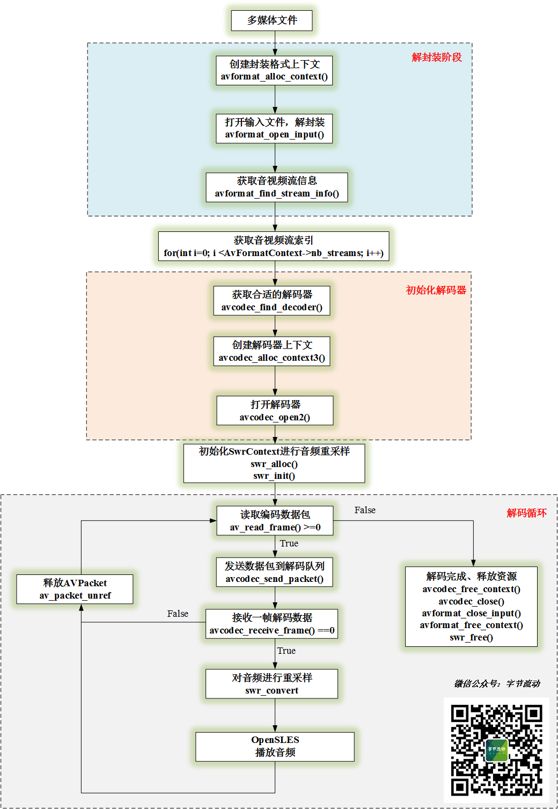
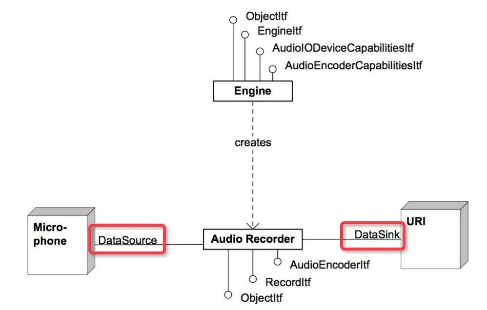
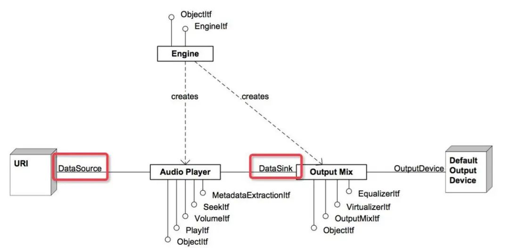

# FFmpeg 开发(03)：FFmpeg + OpenSL ES 实现音频解码播放

FFmpeg 开发系列连载：


- [FFmpeg 开发(01)：FFmpeg 编译和集成](http://mp.weixin.qq.com/s?__biz=MzIwNTIwMzAzNg==&mid=2654162543&idx=1&sn=894a6bfb0f8f652ef53860075af1754b&chksm=8cf39d5cbb84144a9d62fa80cbeed1843aadfe97bf8a30ab02474f98ec86be649d65e301674b&scene=21#wechat_redirect)
- [FFmpeg 开发(02)：FFmpeg + ANativeWindow 实现视频解码播放](http://mp.weixin.qq.com/s?__biz=MzIwNTIwMzAzNg==&mid=2654162564&idx=1&sn=6785c7f9b6bdccbd400f792e9389b15c&chksm=8cf39db7bb8414a14a4acdea47e866f4b19ebdf80ed5aa7663a678c9571d505ecda294b65a05&scene=21#wechat_redirect)


本文将利用 FFmpeg 对一个 Mp4 文件的音频流进行解码，然后使用 libswresample 将解码后的 PCM 音频数据转换为目标格式的数据，最后利用 OpenSLES 进行播放。


*1*

**FFmpeg 音频解码**


旧文中，我们已经对视频解码流程进行了详细的介绍，一个多媒体文件（Mp4）一般包含一个音频流和一个视频流，而FFmpeg 对音频流和视频流的解码流程一致。因此，本节将不再对音频解码流程进行赘述。


类似于视频流的处理，音频流的处理流程为：**（Mp4文件）解协议->解封装->音频解码->重采样->播放。**


音频解码播放流程图

这里面有反复提到重采样，类似于视频图像的转码，因为显示器最终显示的是 RGB 数据，这个一点比较好理解，那么为什么要对解码的音频数据进行重采样呢？


**一般采集音频时会有多种采样率可以选择，当该采样率与音频设备驱动的固定采样率不符时，就会导致变声或者音频出现快放慢放效果。**


**此时就需要用到重采样来确保音频采样率和设备驱动采样率一致，使音频正确播放。**


利用 libswresample 库将对音频进行重采样，有如下几个步骤：


```
//1. 生成 resample 上下文，设置输入和输出的通道数、采样率以及采样格式，初始化上下文
m_SwrContext = swr_alloc();

av_opt_set_int(m_SwrContext, "in_channel_layout", codeCtx->channel_layout, 0);
av_opt_set_int(m_SwrContext, "out_channel_layout", AUDIO_DST_CHANNEL_LAYOUT, 0);
av_opt_set_int(m_SwrContext, "in_sample_rate", codeCtx->sample_rate, 0);
av_opt_set_int(m_SwrContext, "out_sample_rate", AUDIO_DST_SAMPLE_RATE, 0);
av_opt_set_sample_fmt(m_SwrContext, "in_sample_fmt", codeCtx->sample_fmt, 0);
av_opt_set_sample_fmt(m_SwrContext, "out_sample_fmt", DST_SAMPLT_FORMAT,  0);

swr_init(m_SwrContext);

//2. 申请输出 Buffer
m_nbSamples = (int)av_rescale_rnd(NB_SAMPLES, AUDIO_DST_SAMPLE_RATE, codeCtx->sample_rate, AV_ROUND_UP);
m_BufferSize = av_samples_get_buffer_size(NULL, AUDIO_DST_CHANNEL_COUNTS,m_nbSamples, DST_SAMPLT_FORMAT, 1);
m_AudioOutBuffer = (uint8_t *) malloc(m_BufferSize);

//3. 重采样，frame 为解码帧
int result = swr_convert(m_SwrContext, &m_AudioOutBuffer, m_BufferSize / 2, (const uint8_t **) frame->data, frame->nb_samples);
if (result > 0 ) {
    //play
}

//4. 释放资源
if(m_AudioOutBuffer) {
    free(m_AudioOutBuffer);
    m_AudioOutBuffer = nullptr;
}

if(m_SwrContext) {
    swr_free(&m_SwrContext);
    m_SwrContext = nullptr;
}


```

*2*

**OpenSLES 播放音频**


**OpenSL ES 全称为：Open Sound Library for Embedded Systems，是一个针对嵌入式系统的开放硬件音频加速库，支持音频的采集和播放，它提供了一套高性能、低延迟的音频功能实现方法。**


并且实现了软硬件音频性能的跨平台部署，大大降低了上层处理音频应用的开发难度。


OpenSL ES 是基于 c 语言实现的，但其提供的接口是采用面向对象的方式实现，OpenSL ES 的大多数 API 是通过对象来调用的。


**Object 和 Interface OpenSL ES 中的两大基本概念，可以类比为 Java 中的对象和接口。在 OpenSL ES 中， 每个 Object 可以存在一系列的 Interface ，并且为每个对象都提供了一系列的基本操作，如 Realize，GetState，Destroy 等。**

**
**

**重要的一点，只有通过 GetInterface 方法拿到 Object 的 Interface ，才能使用 Object 提供的功能。**

## Audio 引擎对象和接口

Audio 引擎对象和接口，即 Engine Object 和 SLEngineItf Interface 。Engine Object 的主要功能是管理 Audio Engine 的生命周期，提供引擎对象的管理接口。引擎对象的使用方法如下：


```
SLresult result;
// 创建引擎对象
result = slCreateEngine(&engineObject, 0, NULL, 0, NULL, NULL);
assert(SL_RESULT_SUCCESS == result);
(void)result;

// 实例化
result = (*engineObject)->Realize(engineObject, SL_BOOLEAN_FALSE);
assert(SL_RESULT_SUCCESS == result);
(void)result;

// 获取引擎对象接口
result = (*engineObject)->GetInterface(engineObject, SL_IID_ENGINE, &engineEngine);
assert(SL_RESULT_SUCCESS == result);
(void)result;

// 释放引擎对象的资源
result = (*engineObject)->Destroy(engineObject, SL_BOOLEAN_FALSE);
assert(SL_RESULT_SUCCESS == result);
(void)result;
```

##  

## SLRecordItf 和 SLPlayItf


SLRecordItf 和 SLPlayItf 分别抽象多媒体功能 recorder 和 player ，通过 SLEngineItf 的 CreateAudioPlayer 和 CreateAudioRecorder 方法分别创建 player 和 recorder 对象实例。


```
// 创建 audio recorder 对象
result = (*engineEngine)->CreateAudioRecorder(engineEngine, &recorderObject , &recSource, &dataSink,
                                                  NUM_RECORDER_EXPLICIT_INTERFACES, iids, required);

// 创建 audio player 对象
SLresult result = (*engineEngine)->CreateAudioPlayer(
        engineEngine,
        &audioPlayerObject,
        &dataSource,
        &dataSink,
        1,
        interfaceIDs,
        requiredInterfaces
);
```

##  

## SLDataSource 和 SLDataSink


OpenSL ES 中的 SLDataSource 和 SLDataSink 结构体，主要用于构建 audio player 和 recorder 对象，其中 SLDataSource 表示音频数据来源的信息，SLDataSink 表示音频数据输出信息。


```
// 数据源简单缓冲队列定位器
SLDataLocator_AndroidSimpleBufferQueue dataSou
        SL_DATALOCATOR_ANDROIDSIMPLEBUFFERQUEU
        1
};
// PCM 数据源格式
SLDataFormat_PCM dataSourceFormat = {
        SL_DATAFORMAT_PCM, // 格式类型
        wav_get_channels(wav), // 通道数
        wav_get_rate(wav) * 1000, //采样率
        wav_get_bits(wav), // 位宽
        wav_get_bits(wav),
        SL_SPEAKER_FRONT_CENTER, // 通道屏蔽
        SL_BYTEORDER_LITTLEENDIAN // 字节顺序（大小端序）
};


// 数据源
SLDataSource dataSource = {
        &dataSourceLocator,
        &dataSourceFormat
};
// 针对数据接收器的输出混合定位器(混音器)
SLDataLocator_OutputMix dataSinkLocator = {
        SL_DATALOCATOR_OUTPUTMIX, // 定位器类型
        outputMixObject // 输出混合
};
// 输出
SLDataSink dataSink = {
        &dataSinkLocator, // 定位器
        0,
};
```

#  

# OpenSL ES Recorder 和 Player 功能构建




Audio Recorder



Audio Player


Audio Player 的 Data Source 也可以是本地存储或缓存的音频数据，以上图片来自于 Jhuster 的博客。


由于本文只介绍音频的解码播放，下面的代码仅展示 OpenSLES Audio Player 播放音频的过程。


```
//OpenSLES 渲染器初始化
void OpenSLRender::Init() {
    LOGCATE("OpenSLRender::Init");

    int result = -1;
    do {
        //创建并初始化引擎对象
        result = CreateEngine();
        if(result != SL_RESULT_SUCCESS)
        {
            LOGCATE("OpenSLRender::Init CreateEngine fail. result=%d", result);
            break;
        }

        //创建并初始化混音器
        result = CreateOutputMixer();
        if(result != SL_RESULT_SUCCESS)
        {
            LOGCATE("OpenSLRender::Init CreateOutputMixer fail. result=%d", result);
            break;
        }

        //创建并初始化播放器
        result = CreateAudioPlayer();
        if(result != SL_RESULT_SUCCESS)
        {
            LOGCATE("OpenSLRender::Init CreateAudioPlayer fail. result=%d", result);
            break;
        }

        //设置播放状态
        (*m_AudioPlayerPlay)->SetPlayState(m_AudioPlayerPlay, SL_PLAYSTATE_PLAYING);

        //激活回调接口
        AudioPlayerCallback(m_BufferQueue, this);

    } while (false);

    if(result != SL_RESULT_SUCCESS) {
        LOGCATE("OpenSLRender::Init fail. result=%d", result);
        UnInit();
    }

}

int OpenSLRender::CreateEngine() {
    SLresult result = SL_RESULT_SUCCESS;
    do {
        result = slCreateEngine(&m_EngineObj, 0, nullptr, 0, nullptr, nullptr);
        if(result != SL_RESULT_SUCCESS)
        {
            LOGCATE("OpenSLRender::CreateEngine slCreateEngine fail. result=%d", result);
            break;
        }

        result = (*m_EngineObj)->Realize(m_EngineObj, SL_BOOLEAN_FALSE);
        if(result != SL_RESULT_SUCCESS)
        {
            LOGCATE("OpenSLRender::CreateEngine Realize fail. result=%d", result);
            break;
        }

        result = (*m_EngineObj)->GetInterface(m_EngineObj, SL_IID_ENGINE, &m_EngineEngine);
        if(result != SL_RESULT_SUCCESS)
        {
            LOGCATE("OpenSLRender::CreateEngine GetInterface fail. result=%d", result);
            break;
        }

    } while (false);
    return result;
}

int OpenSLRender::CreateOutputMixer() {
    SLresult result = SL_RESULT_SUCCESS;
    do {
        const SLInterfaceID mids[1] = {SL_IID_ENVIRONMENTALREVERB};
        const SLboolean mreq[1] = {SL_BOOLEAN_FALSE};

        result = (*m_EngineEngine)->CreateOutputMix(m_EngineEngine, &m_OutputMixObj, 1, mids, mreq);
        if(result != SL_RESULT_SUCCESS)
        {
            LOGCATE("OpenSLRender::CreateOutputMixer CreateOutputMix fail. result=%d", result);
            break;
        }

        result = (*m_OutputMixObj)->Realize(m_OutputMixObj, SL_BOOLEAN_FALSE);
        if(result != SL_RESULT_SUCCESS)
        {
            LOGCATE("OpenSLRender::CreateOutputMixer CreateOutputMix fail. result=%d", result);
            break;
        }

    } while (false);

    return result;
}

int OpenSLRender::CreateAudioPlayer() {
    SLDataLocator_AndroidSimpleBufferQueue android_queue = {SL_DATALOCATOR_ANDROIDSIMPLEBUFFERQUEUE, 2};
    SLDataFormat_PCM pcm = {
            SL_DATAFORMAT_PCM,//format type
            (SLuint32)2,//channel count
            SL_SAMPLINGRATE_44_1,//44100hz
            SL_PCMSAMPLEFORMAT_FIXED_16,// bits per sample
            SL_PCMSAMPLEFORMAT_FIXED_16,// container size
            SL_SPEAKER_FRONT_LEFT | SL_SPEAKER_FRONT_RIGHT,// channel mask
            SL_BYTEORDER_LITTLEENDIAN // endianness
    };
    SLDataSource slDataSource = {&android_queue, &pcm};

    SLDataLocator_OutputMix outputMix = {SL_DATALOCATOR_OUTPUTMIX, m_OutputMixObj};
    SLDataSink slDataSink = {&outputMix, nullptr};

    const SLInterfaceID ids[3] = {SL_IID_BUFFERQUEUE, SL_IID_EFFECTSEND, SL_IID_VOLUME};
    const SLboolean req[3] = {SL_BOOLEAN_TRUE, SL_BOOLEAN_TRUE, SL_BOOLEAN_TRUE};

    SLresult result;

    do {

        result = (*m_EngineEngine)->CreateAudioPlayer(m_EngineEngine, &m_AudioPlayerObj, &slDataSource, &slDataSink, 3, ids, req);
        if(result != SL_RESULT_SUCCESS)
        {
            LOGCATE("OpenSLRender::CreateAudioPlayer CreateAudioPlayer fail. result=%d", result);
            break;
        }

        result = (*m_AudioPlayerObj)->Realize(m_AudioPlayerObj, SL_BOOLEAN_FALSE);
        if(result != SL_RESULT_SUCCESS)
        {
            LOGCATE("OpenSLRender::CreateAudioPlayer Realize fail. result=%d", result);
            break;
        }

        result = (*m_AudioPlayerObj)->GetInterface(m_AudioPlayerObj, SL_IID_PLAY, &m_AudioPlayerPlay);
        if(result != SL_RESULT_SUCCESS)
        {
            LOGCATE("OpenSLRender::CreateAudioPlayer GetInterface fail. result=%d", result);
            break;
        }

        result = (*m_AudioPlayerObj)->GetInterface(m_AudioPlayerObj, SL_IID_BUFFERQUEUE, &m_BufferQueue);
        if(result != SL_RESULT_SUCCESS)
        {
            LOGCATE("OpenSLRender::CreateAudioPlayer GetInterface fail. result=%d", result);
            break;
        }

        result = (*m_BufferQueue)->RegisterCallback(m_BufferQueue, AudioPlayerCallback, this);
        if(result != SL_RESULT_SUCCESS)
        {
            LOGCATE("OpenSLRender::CreateAudioPlayer RegisterCallback fail. result=%d", result);
            break;
        }

        result = (*m_AudioPlayerObj)->GetInterface(m_AudioPlayerObj, SL_IID_VOLUME, &m_AudioPlayerVolume);
        if(result != SL_RESULT_SUCCESS)
        {
            LOGCATE("OpenSLRender::CreateAudioPlayer GetInterface fail. result=%d", result);
            break;
        }

    } while (false);

    return result;
}

//播放器的 callback
void OpenSLRender::AudioPlayerCallback(SLAndroidSimpleBufferQueueItf bufferQueue, void *context) {
    OpenSLRender *openSlRender = static_cast<OpenSLRender *>(context);
    openSlRender->HandleAudioFrameQueue();
}

void OpenSLRender::HandleAudioFrameQueue() {
    LOGCATE("OpenSLRender::HandleAudioFrameQueue QueueSize=%d", m_AudioFrameQueue.size());
    if (m_AudioPlayerPlay == nullptr) return;

    //播放存放在音频帧队列中的数据
    AudioFrame *audioFrame = m_AudioFrameQueue.front();
    if (nullptr != audioFrame && m_AudioPlayerPlay) {
        SLresult result = (*m_BufferQueue)->Enqueue(m_BufferQueue, audioFrame->data, (SLuint32) audioFrame->dataSize);
        if (result == SL_RESULT_SUCCESS) {
            m_AudioFrameQueue.pop();
            delete audioFrame;
        }

    }
}
```

下一篇文章将会在本篇的基础上，利用 OpenGL ES 增加音频的可视化功能。