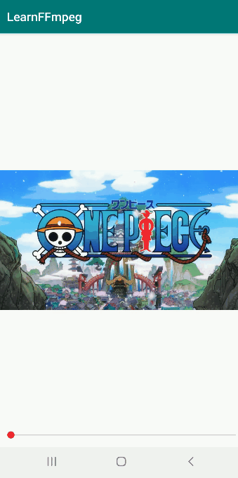

# FFmpeg + OpenGLES 实现视频解码播放和视频滤镜

FFmpeg 开发系列连载：


- [FFmpeg 开发(01)：FFmpeg 编译和集成](http://mp.weixin.qq.com/s?__biz=MzIwNTIwMzAzNg==&mid=2654162543&idx=1&sn=894a6bfb0f8f652ef53860075af1754b&chksm=8cf39d5cbb84144a9d62fa80cbeed1843aadfe97bf8a30ab02474f98ec86be649d65e301674b&scene=21#wechat_redirect)
- [FFmpeg 开发(02)：FFmpeg + ANativeWindow 实现视频解码播放](http://mp.weixin.qq.com/s?__biz=MzIwNTIwMzAzNg==&mid=2654162564&idx=1&sn=6785c7f9b6bdccbd400f792e9389b15c&chksm=8cf39db7bb8414a14a4acdea47e866f4b19ebdf80ed5aa7663a678c9571d505ecda294b65a05&scene=21#wechat_redirect)
- [FFmpeg 开发(03)：FFmpeg + OpenSLES 实现音频解码播放](http://mp.weixin.qq.com/s?__biz=MzIwNTIwMzAzNg==&mid=2654162604&idx=1&sn=c4e6d5a53fddcc327861cb1956285c9c&chksm=8cf39d9fbb8414898778a461b8249b698486dff85d52f0f4a86deebb711597ac685fdc99c8c3&scene=21#wechat_redirect)
- [FFmpeg 开发(04)：FFmpeg + OpenGLES 实现音频可视化播放
  ](http://mp.weixin.qq.com/s?__biz=MzIwNTIwMzAzNg==&mid=2654162642&idx=1&sn=d25b3204928fdea29bee287024a763a1&chksm=8cf39de1bb8414f70f98b79c201dbd53f1679bceac37109e07a1072ff32c220c07eebe93111b&scene=21#wechat_redirect)


前面 Android FFmpeg 开发系列文章中，我们已经利用 FFmpeg 的解码功能和 ANativeWindow 的渲染功能，实现了的视频的解码播放。


但是，当你想为播放器做一些视频滤镜时，如加水印、旋转缩放等效果，使用 OpenGL ES 实现起来就极为方便。


视频解码播放和视频滤镜

# 

*1*

OpenGL ES 渲染解码帧


经过上面几节的介绍，我们对音视频的解码过程已经比较熟悉了。本文要用 OpenGL 实现视频的渲染，这里再回顾下视频的解码流程：


视频的解码流程

从流程图中可以看出，解码一帧图像后，首先将对图像进行格式转换，转换成 RGBA 格式，使用 OpenGL 或 ANativeWindow 可以直接进行渲染。


当然，**使用 OpenGL 进行渲染时，为了提升性能，可以将格式转换放到 GPU 上来做（即 shader 实现 YUV 到 RGB 的转换），也可以使用 OES 纹理直接接收 YUV 图像数据**，这里就不进行展开讲了。


了解视频解码到渲染的流程之后，我们就可以构建 OpenGL 渲染环境。


从之前介绍 EGL 的文章中，我们知道在使用 OpenGL API 之前，必须要先利用 EGL 创建好 OpenGL 的渲染上下文环境。至于 EGL 怎么使用，可以参考文章 [你还不知道 OpenGLES 与 EGL 的关系](http://mp.weixin.qq.com/s?__biz=MzIwNTIwMzAzNg==&mid=2654162834&idx=2&sn=6272e659b0ad5037743bcd748f576ca1&chksm=8cf39ca1bb8415b70cad95a3da3aa77fa684ad1c0d58e7d770156ba1defda9c955b429066977&scene=21#wechat_redirect)。


**由于本文是面向初学者快速上手 FFmpeg 开发，我们直接利用 Android GLSurfaceView 类创建 OpenGL 渲染环境，GLSurfaceView 类已经封装了 EGL 创建渲染上下文的操作，并启动了一个独立的渲染线程，完全符合我们渲染视频解码帧的需求。**


实际上，GLSurfaceView 类在生产开发中可以满足绝大多数的屏幕渲染场景，一般要实现多线程渲染的时候才需要我们单独操作 EGL 的接口。


**那么，你肯定会有疑问：GLSurfaceView 是 Java 的类，难道要将 Native 层解码后的视频图像传到 Java 层再进行渲染吗？大可不必，我们只需要将 Java 层的调用栈通过 JNI 延伸到 Native 层即可。**


GLSurfaceView 类 Renderer 接口对应渲染的三个关键函数，我们通过 JNI 延伸到 Native 层：


```
    @Override
    public void onSurfaceCreated(GL10 gl10, EGLConfig eglConfig) {
        FFMediaPlayer.native_OnSurfaceCreated();
    }

    @Override
    public void onSurfaceChanged(GL10 gl10, int w, int h) {
        FFMediaPlayer.native_OnSurfaceChanged(w, h);
    }

    @Override
    public void onDrawFrame(GL10 gl10) {
        FFMediaPlayer.native_OnDrawFrame();
    }

    //for video openGL render
    public static native void native_OnSurfaceCreated();
    public static native void native_OnSurfaceChanged(int width, int height);
    public static native void native_OnDrawFrame();
```


然后，我们在 Native 层创建一个 OpenGLRender 类来用来管理 OpenGL 的渲染。


```
//接口
class VideoRender {
public:
    virtual ~VideoRender(){}
    virtual void Init(int videoWidth, int videoHeight, int *dstSize) = 0;
    virtual void RenderVideoFrame(NativeImage *pImage) = 0;
    virtual void UnInit() = 0;
};

//OpenGLRender 类定义
class OpenGLRender: public VideoRender{
public:
    virtual void Init(int videoWidth, int videoHeight, int *dstSize);
    virtual void RenderVideoFrame(NativeImage *pImage);
    virtual void UnInit();

    //对应 Java 层 GLSurfaceView.Renderer 的三个接口
    void OnSurfaceCreated();
    void OnSurfaceChanged(int w, int h);
    void OnDrawFrame();

    //静态实例管理
    static OpenGLRender *GetInstance();
    static void ReleaseInstance();

    //设置变换矩阵，控制图像的旋转缩放
    void UpdateMVPMatrix(int angleX, int angleY, float scaleX, float scaleY);

private:
    OpenGLRender();
    virtual ~OpenGLRender();

    static std::mutex m_Mutex;
    static OpenGLRender* s_Instance;
    GLuint m_ProgramObj = GL_NONE;
    GLuint m_TextureId;
    GLuint m_VaoId;
    GLuint m_VboIds[3];
    NativeImage m_RenderImage;
    glm::mat4 m_MVPMatrix;//变换矩阵
};
```


OpenGLRender 类的完整实现。


```
#include "OpenGLRender.h"
#include <GLUtils.h>
#include <gtc/matrix_transform.hpp>

OpenGLRender* OpenGLRender::s_Instance = nullptr;
std::mutex OpenGLRender::m_Mutex;

static char vShaderStr[] =
        "#version 300 es\n"
        "layout(location = 0) in vec4 a_position;\n"
        "layout(location = 1) in vec2 a_texCoord;\n"
        "uniform mat4 u_MVPMatrix;\n"
        "out vec2 v_texCoord;\n"
        "void main()\n"
        "{\n"
        "    gl_Position = u_MVPMatrix * a_position;\n"
        "    v_texCoord = a_texCoord;\n"
        "}";

static char fShaderStr[] =
        "#version 300 es\n"
        "precision highp float;\n"
        "in vec2 v_texCoord;\n"
        "layout(location = 0) out vec4 outColor;\n"
        "uniform sampler2D s_TextureMap;//采样器\n"
        "void main()\n"
        "{\n"
        "    outColor = texture(s_TextureMap, v_texCoord);\n"
        "}";

GLfloat verticesCoords[] = {
        -1.0f,  1.0f, 0.0f,  // Position 0
        -1.0f, -1.0f, 0.0f,  // Position 1
        1.0f,  -1.0f, 0.0f,  // Position 2
        1.0f,   1.0f, 0.0f,  // Position 3
};

GLfloat textureCoords[] = {
        0.0f,  0.0f,        // TexCoord 0
        0.0f,  1.0f,        // TexCoord 1
        1.0f,  1.0f,        // TexCoord 2
        1.0f,  0.0f         // TexCoord 3
};

GLushort indices[] = { 0, 1, 2, 0, 2, 3 };

OpenGLRender::OpenGLRender() {

}

OpenGLRender::~OpenGLRender() {
    // 释放缓存图像
    NativeImageUtil::FreeNativeImage(&m_RenderImage);

}

//初始化视频图像的宽和高
void OpenGLRender::Init(int videoWidth, int videoHeight, int *dstSize) {
    LOGCATE("OpenGLRender::InitRender video[w, h]=[%d, %d]", videoWidth, videoHeight);
    std::unique_lock<std::mutex> lock(m_Mutex);
    m_RenderImage.format = IMAGE_FORMAT_RGBA;
    m_RenderImage.width = videoWidth;
    m_RenderImage.height = videoHeight;
    dstSize[0] = videoWidth;
    dstSize[1] = videoHeight;
    m_FrameIndex = 0;

}

// 接收解码后的视频帧
void OpenGLRender::RenderVideoFrame(NativeImage *pImage) {
    LOGCATE("OpenGLRender::RenderVideoFrame pImage=%p", pImage);
    if(pImage == nullptr || pImage->ppPlane[0] == nullptr)
        return;
    //加互斥锁，解码线程和渲染线程是 2 个不同的线程，避免数据访问冲突
    std::unique_lock<std::mutex> lock(m_Mutex);
    if(m_RenderImage.ppPlane[0] == nullptr)
    {
        NativeImageUtil::AllocNativeImage(&m_RenderImage);
    }

    NativeImageUtil::CopyNativeImage(pImage, &m_RenderImage);
}

void OpenGLRender::UnInit() {

}

// 设置变换矩阵，控制图像的旋转缩放
void OpenGLRender::UpdateMVPMatrix(int angleX, int angleY, float scaleX, float scaleY)
{
    angleX = angleX % 360;
    angleY = angleY % 360;

    //转化为弧度角
    float radiansX = static_cast<float>(MATH_PI / 180.0f * angleX);
    float radiansY = static_cast<float>(MATH_PI / 180.0f * angleY);
    // Projection matrix
    glm::mat4 Projection = glm::ortho(-1.0f, 1.0f, -1.0f, 1.0f, 0.1f, 100.0f);
    //glm::mat4 Projection = glm::frustum(-ratio, ratio, -1.0f, 1.0f, 4.0f, 100.0f);
    //glm::mat4 Projection = glm::perspective(45.0f,ratio, 0.1f,100.f);

    // View matrix
    glm::mat4 View = glm::lookAt(
            glm::vec3(0, 0, 4), // Camera is at (0,0,1), in World Space
            glm::vec3(0, 0, 0), // and looks at the origin
            glm::vec3(0, 1, 0)  // Head is up (set to 0,-1,0 to look upside-down)
    );

    // Model matrix
    glm::mat4 Model = glm::mat4(1.0f);
    Model = glm::scale(Model, glm::vec3(scaleX, scaleY, 1.0f));
    Model = glm::rotate(Model, radiansX, glm::vec3(1.0f, 0.0f, 0.0f));
    Model = glm::rotate(Model, radiansY, glm::vec3(0.0f, 1.0f, 0.0f));
    Model = glm::translate(Model, glm::vec3(0.0f, 0.0f, 0.0f));

    m_MVPMatrix = Projection * View * Model;

}

void OpenGLRender::OnSurfaceCreated() {
    LOGCATE("OpenGLRender::OnSurfaceCreated");

    m_ProgramObj = GLUtils::CreateProgram(vShaderStr, fShaderStr);
    if (!m_ProgramObj)
    {
        LOGCATE("OpenGLRender::OnSurfaceCreated create program fail");
        return;
    }

    glGenTextures(1, &m_TextureId);
    glBindTexture(GL_TEXTURE_2D, m_TextureId);
    glTexParameterf(GL_TEXTURE_2D, GL_TEXTURE_WRAP_S, GL_CLAMP_TO_EDGE);
    glTexParameterf(GL_TEXTURE_2D, GL_TEXTURE_WRAP_T, GL_CLAMP_TO_EDGE);
    glTexParameteri(GL_TEXTURE_2D, GL_TEXTURE_MIN_FILTER, GL_LINEAR);
    glTexParameteri(GL_TEXTURE_2D, GL_TEXTURE_MAG_FILTER, GL_LINEAR);
    glBindTexture(GL_TEXTURE_2D, GL_NONE);

    // Generate VBO Ids and load the VBOs with data
    glGenBuffers(3, m_VboIds);
    glBindBuffer(GL_ARRAY_BUFFER, m_VboIds[0]);
    glBufferData(GL_ARRAY_BUFFER, sizeof(verticesCoords), verticesCoords, GL_STATIC_DRAW);

    glBindBuffer(GL_ARRAY_BUFFER, m_VboIds[1]);
    glBufferData(GL_ARRAY_BUFFER, sizeof(textureCoords), textureCoords, GL_STATIC_DRAW);

    glBindBuffer(GL_ELEMENT_ARRAY_BUFFER, m_VboIds[2]);
    glBufferData(GL_ELEMENT_ARRAY_BUFFER, sizeof(indices), indices, GL_STATIC_DRAW);

    // Generate VAO Id
    glGenVertexArrays(1, &m_VaoId);
    glBindVertexArray(m_VaoId);

    glBindBuffer(GL_ARRAY_BUFFER, m_VboIds[0]);
    glEnableVertexAttribArray(0);
    glVertexAttribPointer(0, 3, GL_FLOAT, GL_FALSE, 3 * sizeof(GLfloat), (const void *)0);
    glBindBuffer(GL_ARRAY_BUFFER, GL_NONE);

    glBindBuffer(GL_ARRAY_BUFFER, m_VboIds[1]);
    glEnableVertexAttribArray(1);
    glVertexAttribPointer(1, 2, GL_FLOAT, GL_FALSE, 2 * sizeof(GLfloat), (const void *)0);
    glBindBuffer(GL_ARRAY_BUFFER, GL_NONE);

    glBindBuffer(GL_ELEMENT_ARRAY_BUFFER, m_VboIds[2]);

    glBindVertexArray(GL_NONE);

    UpdateMVPMatrix(0, 0, 1.0f, 1.0f);
}

void OpenGLRender::OnSurfaceChanged(int w, int h) {
    LOGCATE("OpenGLRender::OnSurfaceChanged [w, h]=[%d, %d]", w, h);
    m_ScreenSize.x = w;
    m_ScreenSize.y = h;
    glViewport(0, 0, w, h);
    glClearColor(1.0f, 1.0f, 1.0f, 1.0f);
}

void OpenGLRender::OnDrawFrame() {
    glClear(GL_COLOR_BUFFER_BIT);
    if(m_ProgramObj == GL_NONE || m_TextureId == GL_NONE || m_RenderImage.ppPlane[0] == nullptr) return;
    LOGCATE("OpenGLRender::OnDrawFrame [w, h]=[%d, %d]", m_RenderImage.width, m_RenderImage.height);
    m_FrameIndex++;

    //upload RGBA image data
    glActiveTexture(GL_TEXTURE0);
    glBindTexture(GL_TEXTURE_2D, m_TextureId);

    //加互斥锁，解码线程和渲染线程是 2 个不同的线程，避免数据访问冲突
    std::unique_lock<std::mutex> lock(m_Mutex);
    glTexImage2D(GL_TEXTURE_2D, 0, GL_RGBA, m_RenderImage.width, m_RenderImage.height, 0, GL_RGBA, GL_UNSIGNED_BYTE, m_RenderImage.ppPlane[0]);
    lock.unlock();

    glBindTexture(GL_TEXTURE_2D, GL_NONE);

    // Use the program object
    glUseProgram (m_ProgramObj);

    glBindVertexArray(m_VaoId);

    GLUtils::setMat4(m_ProgramObj, "u_MVPMatrix", m_MVPMatrix);

    // Bind the RGBA map
    glActiveTexture(GL_TEXTURE0);
    glBindTexture(GL_TEXTURE_2D, m_TextureId);
    GLUtils::setFloat(m_ProgramObj, "s_TextureMap", 0);

    glDrawElements(GL_TRIANGLES, 6, GL_UNSIGNED_SHORT, (const void *)0);

}

// 单例模式，全局只有一个 OpenGLRender
OpenGLRender *OpenGLRender::GetInstance() {
    if(s_Instance == nullptr)
    {
        std::lock_guard<std::mutex> lock(m_Mutex);
        if(s_Instance == nullptr)
        {
            s_Instance = new OpenGLRender();
        }

    }
    return s_Instance;
}

// 释放静态实例
void OpenGLRender::ReleaseInstance() {
    if(s_Instance != nullptr)
    {
        std::lock_guard<std::mutex> lock(m_Mutex);
        if(s_Instance != nullptr)
        {
            delete s_Instance;
            s_Instance = nullptr;
        }

    }
}
```


OpenGLRender 在 JNI 层的调用。


```
JNIEXPORT void JNICALL
Java_com_byteflow_learnffmpeg_media_FFMediaPlayer_native_1OnSurfaceCreated(JNIEnv *env,
                                                                           jclass clazz) {
    OpenGLRender::GetInstance()->OnSurfaceCreated();
}

JNIEXPORT void JNICALL
Java_com_byteflow_learnffmpeg_media_FFMediaPlayer_native_1OnSurfaceChanged(JNIEnv *env,
                                                                           jclass clazz, jint width,
                                                                           jint height) {
    OpenGLRender::GetInstance()->OnSurfaceChanged(width, height);
}

JNIEXPORT void JNICALL
Java_com_byteflow_learnffmpeg_media_FFMediaPlayer_native_1OnDrawFrame(JNIEnv *env, jclass clazz) {
    OpenGLRender::GetInstance()->OnDrawFrame();
}
```


简单渲染效果：


渲染效果

# 

*2*

添加视频滤镜


这里又回到了 OpenGL ES 开发领域，对这一块感兴趣的同学可以参考这篇[Android OpenGL ES 从入门到精通系统性学习教程](http://mp.weixin.qq.com/s?__biz=MzIwNTIwMzAzNg==&mid=2654162516&idx=1&sn=6b19a9dbd38d15cc3dd47a446e5bd933&chksm=8cf39d67bb841471eed05c8d4452b6493c396cfc9746a3ee23781dfef178a161fd82e6b007c4&scene=21#wechat_redirect)。


利用 OpenGL 实现好视频的渲染之后，可以很方便地利用 shader 添加你想要的视频滤镜，这里我们直接可以参考[相机滤镜的实现](http://mp.weixin.qq.com/s?__biz=MzIwNTIwMzAzNg==&mid=2654161710&idx=1&sn=8b2daf00f391d4403fcbbc725f21e418&chksm=8cf3981dbb84110bdfb263946ae15022a6df7967c4c7b69a9ae74ac235435af953ad11404bf7&scene=21#wechat_redirect)。


## **黑白滤镜**

我们将输出视频帧的一半渲染成经典黑白风格的图像，实现的 shader 如下：


```
//黑白滤镜
#version 300 es
precision highp float;
in vec2 v_texCoord;
layout(location = 0) out vec4 outColor;
uniform sampler2D s_TextureMap;//采样器
void main()
{
    outColor = texture(s_TextureMap, v_texCoord);
    if(v_texCoord.x > 0.5) //将输出视频帧的一半渲染成经典黑白风格的图像
        outColor = vec4(vec3(outColor.r*0.299 + outColor.g*0.587 + outColor.b*0.114), outColor.a);
}
```


黑白滤镜的呈现效果:


黑白滤镜

## **动态网格**

动态网格滤镜是将视频图像分成规则的网格，动态修改网格的边框宽度，实现的 shader 如下：


```
//dynimic mesh 动态网格
#version 300 es
precision highp float;
in vec2 v_texCoord;
layout(location = 0) out vec4 outColor;
uniform sampler2D s_TextureMap;//采样器
uniform float u_Offset;
uniform vec2 u_TexSize;
void main()
{
    vec2 imgTexCoord = v_texCoord * u_TexSize;
    float sideLength = u_TexSize.y / 6.0;
    float maxOffset = 0.15 * sideLength;
    float x = mod(imgTexCoord.x, floor(sideLength));
    float y = mod(imgTexCoord.y, floor(sideLength));

    float offset = u_Offset * maxOffset;

    if(offset <= x
    && x <= sideLength - offset
    && offset <= y
    && y <= sideLength - offset)
    {
        outColor = texture(s_TextureMap, v_texCoord);
    }
    else
    {
        outColor = vec4(1.0, 1.0, 1.0, 1.0);
    }
}
```


动态网格滤镜的渲染过程：


```
glActiveTexture(GL_TEXTURE0);
glBindTexture(GL_TEXTURE_2D, m_TextureId);

std::unique_lock<std::mutex> lock(m_Mutex);
glTexImage2D(GL_TEXTURE_2D, 0, GL_RGBA, m_RenderImage.width, m_RenderImage.height, 0, GL_RGBA, GL_UNSIGNED_BYTE, m_RenderImage.ppPlane[0]);
lock.unlock();

glBindTexture(GL_TEXTURE_2D, GL_NONE);

//指定着色器程序
glUseProgram (m_ProgramObj);

//绑定 VAO
glBindVertexArray(m_VaoId);

//传入变换矩阵
GLUtils::setMat4(m_ProgramObj, "u_MVPMatrix", m_MVPMatrix);

//绑定纹理
glActiveTexture(GL_TEXTURE0);
glBindTexture(GL_TEXTURE_2D, m_TextureId);
GLUtils::setFloat(m_ProgramObj, "s_TextureMap", 0);

//设置偏移量
float offset = (sin(m_FrameIndex * MATH_PI / 25) + 1.0f) / 2.0f;
GLUtils::setFloat(m_ProgramObj, "u_Offset", offset);

//设置图像尺寸
GLUtils::setVec2(m_ProgramObj, "u_TexSize", vec2(m_RenderImage.width, m_RenderImage.height));

glDrawElements(GL_TRIANGLES, 6, GL_UNSIGNED_SHORT, (const void *)0);
```


动态网格滤镜的呈现效果:


动态网格滤镜

##  

## **缩放和旋转**

我们在 GLSurfaceView 监听用户的滑动和缩放手势，控制 OpenGLRender 的变换矩阵，从而实现视频图像的旋转和缩放。


视频图像的旋转和缩放