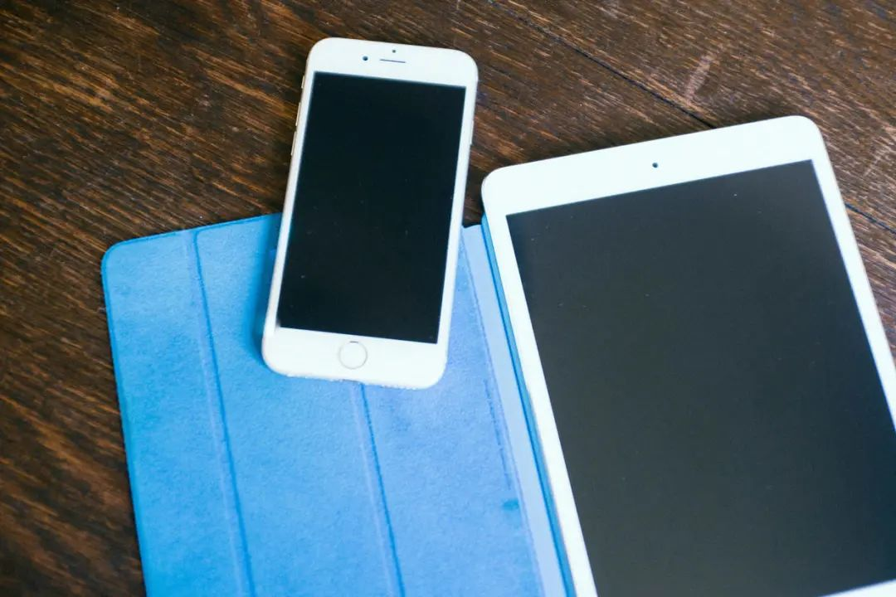
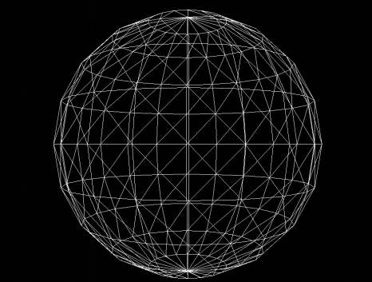
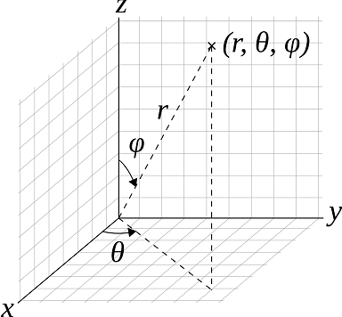
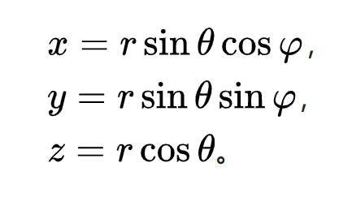
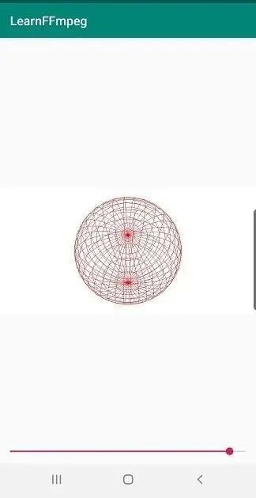
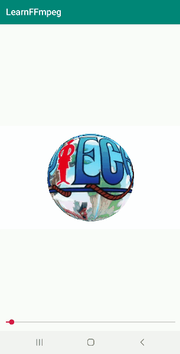

# FFmpeg + OpenGL ES 实现 3D 全景播放器



FFmpeg + OpenGLES 实现 3D 全景播放器

FFmpeg 开发系列连载：


- [FFmpeg 开发(01)：FFmpeg 编译和集成](http://mp.weixin.qq.com/s?__biz=MzIwNTIwMzAzNg==&mid=2654162543&idx=1&sn=894a6bfb0f8f652ef53860075af1754b&chksm=8cf39d5cbb84144a9d62fa80cbeed1843aadfe97bf8a30ab02474f98ec86be649d65e301674b&scene=21#wechat_redirect)
- [FFmpeg 开发(02)：FFmpeg + ANativeWindow 实现视频解码播放](http://mp.weixin.qq.com/s?__biz=MzIwNTIwMzAzNg==&mid=2654162564&idx=1&sn=6785c7f9b6bdccbd400f792e9389b15c&chksm=8cf39db7bb8414a14a4acdea47e866f4b19ebdf80ed5aa7663a678c9571d505ecda294b65a05&scene=21#wechat_redirect)
- [FFmpeg 开发(03)：FFmpeg + OpenSLES 实现音频解码播放](http://mp.weixin.qq.com/s?__biz=MzIwNTIwMzAzNg==&mid=2654162604&idx=1&sn=c4e6d5a53fddcc327861cb1956285c9c&chksm=8cf39d9fbb8414898778a461b8249b698486dff85d52f0f4a86deebb711597ac685fdc99c8c3&scene=21#wechat_redirect)
- [FFmpeg 开发(04)：FFmpeg + OpenGLES 实现音频可视化播放](http://mp.weixin.qq.com/s?__biz=MzIwNTIwMzAzNg==&mid=2654162642&idx=1&sn=d25b3204928fdea29bee287024a763a1&chksm=8cf39de1bb8414f70f98b79c201dbd53f1679bceac37109e07a1072ff32c220c07eebe93111b&scene=21#wechat_redirect)
- [FFmpeg 开发(05)：](http://mp.weixin.qq.com/s?__biz=MzIwNTIwMzAzNg==&mid=2654162642&idx=1&sn=d25b3204928fdea29bee287024a763a1&chksm=8cf39de1bb8414f70f98b79c201dbd53f1679bceac37109e07a1072ff32c220c07eebe93111b&scene=21#wechat_redirect)[FFmpeg + OpenGLES 实现视频解码播放和视频滤镜](http://mp.weixin.qq.com/s?__biz=MzIwNTIwMzAzNg==&mid=2654162883&idx=1&sn=40e6a50ad4ca715dbceaa3782ae2fdc1&chksm=8cf39cf0bb8415e6411b87ed6a0edad423ce2b869399b788815785ea3f0584599a0973c1cf81&scene=21#wechat_redirect)
- [FFmpeg 开发(06)：](http://mp.weixin.qq.com/s?__biz=MzIwNTIwMzAzNg==&mid=2654162642&idx=1&sn=d25b3204928fdea29bee287024a763a1&chksm=8cf39de1bb8414f70f98b79c201dbd53f1679bceac37109e07a1072ff32c220c07eebe93111b&scene=21#wechat_redirect)[FFmpeg 播放器实现音视频同步的三种方式](http://mp.weixin.qq.com/s?__biz=MzIwNTIwMzAzNg==&mid=2654163000&idx=1&sn=80b75d043ae5a71e4fe59fe982129afe&chksm=8cf3830bbb840a1d6b8093781c6d5fdbf957c5ca7246cac11d04a9607271a1b45170613b1bba&scene=21#wechat_redirect)


前文中，我们已经利用 FFmpeg + OpenGLES + OpenSLES 实现了一个多媒体播放器，本文将基于此播放器实现一个酷炫的 3D 全景播放器。


*1*

全景播放器原理


全景视频是由多台摄像机在一个位置同时向四面八方拍摄，最后经过后期拼接处理生成的。


，时长00:29

普通播放器播放全景视频画面会扭曲变形


用普通的多媒体播放器播放全景视频，画面会呈现出严重的拉伸和扭曲变形。


**全景播放器将视频画面渲染到球面上，相当于从球心去观察内部球面，观察到的画面 360 度无死角，这也就是市面上大多数“ VR 盒子”的实现原理**。


全景播放器将视频画面渲染到球面上

# 

*2*

构建球面网格


**全景播放器原理与普通播放器的本质区别在渲染图像部分，普通播放器只需将视频画面渲染到一个矩形平面上，而全景播放器需要将视频画面渲染到球面。**


为实现全景播放器，我们**只需要利用 OpenGL 构建一个球体，然后将 FFmpeg 解码的视频画面渲染到这个球体表面即可**。


球体网格


OpenGL ES 中所有 3D 物体均是由三角形构成的，构建一个球体只需要利用球坐标系中的经度角、维度角以及半径计算出球面点的三维坐标，最后这些坐标点构成一个个小矩形，每个矩形就可以分成 2 个三角形。


球坐标系

球坐标系

在球坐标系中，利用经度角、维度角和半径计算出球面点坐标公式如下：


计算出球面点坐标公式


根据上述公式计算球面顶点坐标的代码实现, 其中 ANGLE_SPAN 为步长，RADIUS 为半径，RADIAN 用于弧度转换 。


```
//构建顶点坐标
for (float vAngle = 90; vAngle > -90; vAngle = vAngle - ANGLE_SPAN) {//垂直方向每隔 ANGLE_SPAN 度计算一次
    for (float hAngle = 360; hAngle > 0; hAngle = hAngle - ANGLE_SPAN) {//水平方向每隔 ANGLE_SPAN 度计算一次
        double xozLength = RADIUS * cos(RADIAN(vAngle));
        float x1 = (float) (xozLength * cos(RADIAN(hAngle)));
        float z1 = (float) (xozLength * sin(RADIAN(hAngle)));
        float y1 = (float) (RADIUS * sin(RADIAN(vAngle)));
        xozLength = RADIUS * cos(RADIAN(vAngle - ANGLE_SPAN));
        float x2 = (float) (xozLength * cos(RADIAN(hAngle)));
        float z2 = (float) (xozLength * sin(RADIAN(hAngle)));
        float y2 = (float) (RADIUS * sin(RADIAN(vAngle - ANGLE_SPAN)));
        xozLength = RADIUS * cos(RADIAN(vAngle - ANGLE_SPAN));
        float x3 = (float) (xozLength * cos(RADIAN(hAngle - ANGLE_SPAN)));
        float z3 = (float) (xozLength * sin(RADIAN(hAngle - ANGLE_SPAN)));
        float y3 = (float) (RADIUS * sin(RADIAN(vAngle - ANGLE_SPAN)));
        xozLength = RADIUS * cos(RADIAN(vAngle));
        float x4 = (float) (xozLength * cos(RADIAN(hAngle - ANGLE_SPAN)));
        float z4 = (float) (xozLength * sin(RADIAN(hAngle - ANGLE_SPAN)));
        float y4 = (float) (RADIUS * sin(RADIAN(vAngle)));

        //球面小矩形的四个点
        vec3 v1(x1, y1, z1);
        vec3 v2(x2, y2, z2);
        vec3 v3(x3, y3, z3);
        vec3 v4(x4, y4, z4);

        //构建第一个三角形
        m_VertexCoords.push_back(v1);
        m_VertexCoords.push_back(v2);
        m_VertexCoords.push_back(v4);
        //构建第二个三角形
        m_VertexCoords.push_back(v4);
        m_VertexCoords.push_back(v2);
        m_VertexCoords.push_back(v3);
    }
}
```


计算对应球面坐标的纹理坐标，实际上就是计算固定行和列的网格点。


```
//构建纹理坐标，球面展开后的矩形
int width = 360 / ANGLE_SPAN;//列数
int height = 180 / ANGLE_SPAN;//行数
float dw = 1.0f / width;
float dh = 1.0f / height;
for (int i = 0; i < height; i++) {
    for (int j = 0; j < width; j++) {
        //每一个小矩形，由两个三角形构成，共六个点
        float s = j * dw;
        float t = i * dh;
        vec2 v1(s, t);
        vec2 v2(s, t + dh);
        vec2 v3(s + dw, t + dh);
        vec2 v4(s + dw, t);

        //构建第一个三角形
        m_TextureCoords.push_back(v1);
        m_TextureCoords.push_back(v2);
        m_TextureCoords.push_back(v4);
        //构建第二个三角形
        m_TextureCoords.push_back(v4);
        m_TextureCoords.push_back(v2);
        m_TextureCoords.push_back(v3);
    }
}
```


用 OpenGL 划线渲染球状网格，测试构建的球体是否准确。


球状网格


*3*

渲染全景视频


计算好顶点坐标和纹理坐标后，剩下的就是简单的纹理映射（纹理贴图），不了解纹理映射的同学可以查看这篇文章纹理映射，篇幅有限，这里不展开讲述。


顶点坐标和纹理坐标初始化 VAO 。


```
// Generate VBO Ids and load the VBOs with data
glGenBuffers(2, m_VboIds);
glBindBuffer(GL_ARRAY_BUFFER, m_VboIds[0]);
glBufferData(GL_ARRAY_BUFFER, sizeof(vec3) * m_VertexCoords.size(), &m_VertexCoords[0], GL_STATIC_DRAW);

glBindBuffer(GL_ARRAY_BUFFER, m_VboIds[1]);
glBufferData(GL_ARRAY_BUFFER, sizeof(vec2) * m_TextureCoords.size(), &m_TextureCoords[0], GL_STATIC_DRAW);

// Generate VAO Id
glGenVertexArrays(1, &m_VaoId);
glBindVertexArray(m_VaoId);

glBindBuffer(GL_ARRAY_BUFFER, m_VboIds[0]);
glEnableVertexAttribArray(0);
glVertexAttribPointer(0, 3, GL_FLOAT, GL_FALSE, sizeof(vec3), (const void *)0);
glBindBuffer(GL_ARRAY_BUFFER, GL_NONE);

glBindBuffer(GL_ARRAY_BUFFER, m_VboIds[1]);
glEnableVertexAttribArray(1);
glVertexAttribPointer(1, 2, GL_FLOAT, GL_FALSE, sizeof(vec2), (const void *)0);
glBindBuffer(GL_ARRAY_BUFFER, GL_NONE);

glBindVertexArray(GL_NONE);
```


绘制视频画面。


```
// Use the program object
glUseProgram (m_ProgramObj);

glBindVertexArray(m_VaoId);

GLUtils::setMat4(m_ProgramObj, "u_MVPMatrix", m_MVPMatrix);

//绑定纹理
glActiveTexture(GL_TEXTURE0);
glBindTexture(GL_TEXTURE_2D, m_TextureId);
GLUtils::setFloat(m_ProgramObj, "s_TextureMap", 0);

glDrawArrays(GL_TRIANGLES, 0, m_VertexCoords.size());
```


先绘制普通视频，看看是啥样儿。


绘制普通视频


最后绘制全景视频。


绘制全景视频


-- END --