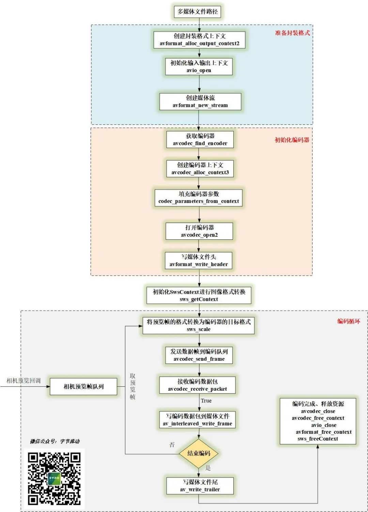
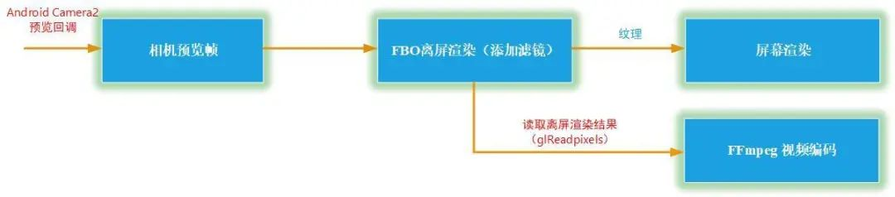

# FFmpeg 视频录制 - 视频添加滤镜和编码

音视频开发中，视频编码是另一个重要的部分，[基于 FFmpeg 软件解码前面系列文章](http://mp.weixin.qq.com/s?__biz=MzIwNTIwMzAzNg==&mid=2654162883&idx=1&sn=40e6a50ad4ca715dbceaa3782ae2fdc1&chksm=8cf39cf0bb8415e6411b87ed6a0edad423ce2b869399b788815785ea3f0584599a0973c1cf81&scene=21#wechat_redirect)已经介绍过了。


接下来主要介绍软件编码这一块，包括视频编码、音频编码、为视频添加滤镜等，后续文章安排介绍 Android MediaCodec 硬件编解码。


前文我们对 [x264、fdk-aac 及 FFmpeg 进行了整合编译](http://mp.weixin.qq.com/s?__biz=MzIwNTIwMzAzNg==&mid=2654164725&idx=1&sn=f643b096b3e87b1d1cd6068f2a25825a&chksm=8cf385c6bb840cd0d151b3140079e310c888442d96fe7857decfc708aaf96c37c374f2cefd62&scene=21#wechat_redirect)，**本文将利用编译好的 FFmpeg 库对 Android Camera2 采集的预览帧先进行渲染，然后利用 OpenGL 添加滤镜，最后读取渲染结果进行编码**，生成 mp4 文件。


FFmpeg 视频录制

# **FFmpeg 视频编码流程**


本文基于 Android Camera 2.0 API 采集的数据源进行编码，编码流程绘制是基于 FFmpeg 4.2.2 版本。


FFmpeg 视频编码流程图

相对于视频解码，编码流程**多了一些写文件头尾的操作，需要停止编码时，通过刷入空帧来告诉编码器停止编码。**


# **预览帧添加滤镜、编码**


预览帧添加滤镜、编码流程


写 OpenGL ES 系列文章的时候，很多同学说为啥在 Native 层来写 demo ？


其实就是**为了配合 FFmpeg 在视频解码和编码时添加滤镜**，那么之前在 native 层写的所有关于滤镜的 demo ,现在可以直接拿过来用了，比如[相机基础滤镜](http://mp.weixin.qq.com/s?__biz=MzIwNTIwMzAzNg==&mid=2654161679&idx=1&sn=52f22efb617c16fcbdd45c9c9544693a&chksm=8cf3983cbb84112ad1086457880679eb69bfb6a0688be17404f93bab554072c99be445f683e8&scene=21#wechat_redirect)，[相机抖音滤镜](http://mp.weixin.qq.com/s?__biz=MzIwNTIwMzAzNg==&mid=2654161710&idx=1&sn=8b2daf00f391d4403fcbbc725f21e418&chksm=8cf3981dbb84110bdfb263946ae15022a6df7967c4c7b69a9ae74ac235435af953ad11404bf7&scene=21#wechat_redirect)这些。


**OpenGLCamera2** 


```
https://github.com/githubhaohao/OpenGLCamera2
```


这个项目有 30 多种滤镜供你参考。


我们首先通过 Android Camera2 预览回调获取预览帧（YUV）：


```
private ImageReader.OnImageAvailableListener mOnPreviewImageAvailableListener = new ImageReader.OnImageAvailableListener() {
    @Override
    public void onImageAvailable(ImageReader reader) {
        Image image = reader.acquireLatestImage();
        if (image != null) {
            if (mCamera2FrameCallback != null) {
                mCamera2FrameCallback.onPreviewFrame(CameraUtil.YUV_420_888_data(image), image.getWidth(), image.getHeight());
            }
            image.close();
        }
    }
};
```


之后利用 GLSurfaceView 来自动创建 OpenGL 环境，[创建帧缓冲区对象（FBO）](http://mp.weixin.qq.com/s?__biz=MzIwNTIwMzAzNg==&mid=2654164511&idx=1&sn=17fa1bba43703662803ea763b741cbfa&chksm=8cf3852cbb840c3a2855fe7d0d8f68693e8346b9c41eb9e51534400768dc28257751faaa0b95&scene=21#wechat_redirect)，FBO 的主要好处就是保持图像的分辨率不变。


然后在 FBO 离屏渲染时添加滤镜，读取渲染结果作为 FFmpeg 视频编码的输入，最后绑定到 FBO 的纹理再去做屏幕渲染显示出来。


```
//离屏渲染，添加滤镜
glBindFramebuffer(GL_FRAMEBUFFER, m_DstFboId);
glViewport(0, 0, m_RenderImage.height, m_RenderImage.width); //相机的宽和高反了,
glClear(GL_COLOR_BUFFER_BIT);
glUseProgram (m_ProgramObj);
glBindVertexArray(m_VaoId);

UpdateMVPMatrix(0, 0, 1.0, 1.0);
GLUtils::setMat4(m_ProgramObj, "u_MVPMatrix", m_MVPMatrix);

glActiveTexture(GL_TEXTURE0);
glBindTexture(GL_TEXTURE_2D, m_SrcFboTextureId);
GLUtils::setInt(m_ProgramObj, "s_texture0", 0);
GLUtils::setInt(m_ProgramObj, "u_nImgType", IMAGE_FORMAT_RGBA);
glDrawElements(GL_TRIANGLES, 6, GL_UNSIGNED_SHORT, (const void *)0);

GetRenderFrameFromFBO();
glBindFramebuffer(GL_FRAMEBUFFER, 0);

...

//GetRenderFrameFromFBO 读取渲染结果，然后通过回调传入 FFmpeg 编码队列 
void GLCameraRender::GetRenderFrameFromFBO() {
    LOGCATE("GLCameraRender::GetRenderFrameFromFBO m_RenderFrameCallback=%p", m_RenderFrameCallback);
    if(m_RenderFrameCallback != nullptr) {
        uint8_t *pBuffer = new uint8_t[m_RenderImage.width * m_RenderImage.height * 4];
        NativeImage nativeImage = m_RenderImage;
        nativeImage.format = IMAGE_FORMAT_RGBA;
        nativeImage.width = m_RenderImage.height;
        nativeImage.height = m_RenderImage.width;
        nativeImage.pLineSize[0] = nativeImage.width * 4;
        nativeImage.ppPlane[0] = pBuffer;
        glReadPixels(0, 0, nativeImage.width, nativeImage.height, GL_RGBA, GL_UNSIGNED_BYTE, pBuffer);
        m_RenderFrameCallback(m_CallbackContext, &nativeImage);
        delete []pBuffer;
    }
}
```

#  

读取渲染结果的时候除了 glReadPixels , 之前提到高性能的读取方式还有 PBO 、HardwareBuffer ，可以参考文章[Android OpenGL 渲染图像读取哪家强？](http://mp.weixin.qq.com/s?__biz=MzIwNTIwMzAzNg==&mid=2654163537&idx=1&sn=138b831324bfb09cdcdb4b08b8fa9db1&chksm=8cf38162bb84087429aee66be6b6441020eed1dbaa016122ac3f4a3e6816010012e5c3481ed5&scene=21#wechat_redirect)这里不进行展开。


# **FFmpeg 视频编码实现**


jni StartRecord 传入视频的宽、高、码率、帧率等参数，OnPreviewFrame 接口传入预览帧。


```
extern "C"
JNIEXPORT jint JNICALL
Java_com_byteflow_learnffmpeg_media_MediaRecorderContext_native_1StartRecord(JNIEnv *env,
                                                                             jobject thiz,
                                                                             jint recorder_type,
                                                                             jstring out_url,
                                                                             jint frame_width,
                                                                             jint frame_height,
                                                                             jlong video_bit_rate,
                                                                             jint fps) {
    //MediaRecorderContext 实际上只是对 SingleVideoRecorder 简单封装了一下 
    const char* url = env->GetStringUTFChars(out_url, nullptr);
    MediaRecorderContext *pContext = MediaRecorderContext::GetContext(env, thiz);
    env->ReleaseStringUTFChars(out_url, url);
    if(pContext) return pContext->StartRecord(recorder_type, url, frame_width, frame_height, video_bit_rate, fps);
    return 0;
}

extern "C"
JNIEXPORT jint JNICALL
Java_com_byteflow_learnffmpeg_media_MediaRecorderContext_native_1StopRecord(JNIEnv *env,
                                                                            jobject thiz) {
    MediaRecorderContext *pContext = MediaRecorderContext::GetContext(env, thiz);
    if(pContext) return pContext->StopRecord();
    return 0;
}

extern "C"
JNIEXPORT void JNICALL
Java_com_byteflow_learnffmpeg_media_MediaRecorderContext_native_1OnPreviewFrame(JNIEnv *env,
                                                                                 jobject thiz,
                                                                                 jint format,
                                                                                 jbyteArray data,
                                                                                 jint width,
                                                                                 jint height) {
    int len = env->GetArrayLength (data);
    unsigned char* buf = new unsigned char[len];
    env->GetByteArrayRegion(data, 0, len, reinterpret_cast<jbyte*>(buf));
    MediaRecorderContext *pContext = MediaRecorderContext::GetContext(env, thiz);
    if(pContext) pContext->OnPreviewFrame(format, buf, width, height);
    delete[] buf;
}
```


视频编码器主要就是开启一个线程，然后不断地从预览帧队列中读取预览帧进行编码，视频编码器实现：


```
class SingleVideoRecorder {
public:
    SingleVideoRecorder(const char* outUrl, int frameWidth, int frameHeight, long bitRate, int fps);
    ~SingleVideoRecorder();

    int StartRecord();
    int OnFrame2Encode(NativeImage *inputFrame);
    int StopRecord();

private:
    static void StartH264EncoderThread(SingleVideoRecorder *context);
    int EncodeFrame(AVFrame *pFrame);
private:
    ThreadSafeQueue<NativeImage *> m_frameQueue;
    char m_outUrl[1024] = {0};
    int m_frameWidth;
    int m_frameHeight;
    int m_frameIndex = 0;
    long m_bitRate;
    int m_frameRate;
    AVPacket m_avPacket;
    AVFrame  *m_pFrame = nullptr;
    uint8_t *m_pFrameBuffer = nullptr;
    AVCodec  *m_pCodec = nullptr;
    AVStream *m_pStream = nullptr;
    AVCodecContext *m_pCodecCtx = nullptr;
    AVFormatContext *m_pFormatCtx = nullptr;
    thread *m_encodeThread = nullptr;
    SwsContext *m_SwsContext = nullptr;
    volatile int m_exit = 0;
};
```


视频编码循环：


```
void SingleVideoRecorder::StartH264EncoderThread(SingleVideoRecorder *recorder) {
    LOGCATE("SingleVideoRecorder::StartH264EncoderThread start");
    //停止编码且队列为空时退出编码循环
    while (!recorder->m_exit || !recorder->m_frameQueue.Empty())
    {
        if(recorder->m_frameQueue.Empty()) {
            //队列为空，休眠等待
            usleep(10 * 1000);
            continue;
        }
        //从队列中取一帧预览帧
        NativeImage *pImage = recorder->m_frameQueue.Pop();
        AVFrame *pFrame = recorder->m_pFrame;
        AVPixelFormat srcPixFmt = AV_PIX_FMT_YUV420P;
        switch (pImage->format) {
            case IMAGE_FORMAT_RGBA:
                srcPixFmt = AV_PIX_FMT_RGBA;
                break;
            case IMAGE_FORMAT_NV21:
                srcPixFmt = AV_PIX_FMT_NV21;
                break;
            case IMAGE_FORMAT_NV12:
                srcPixFmt = AV_PIX_FMT_NV12;
                break;
            case IMAGE_FORMAT_I420:
                srcPixFmt = AV_PIX_FMT_YUV420P;
                break;
            default:
                LOGCATE("SingleVideoRecorder::StartH264EncoderThread unsupport format pImage->format=%d", pImage->format);
                break;
        }
        if(srcPixFmt != AV_PIX_FMT_YUV420P) {
            if(recorder->m_SwsContext == nullptr) {
                recorder->m_SwsContext = sws_getContext(pImage->width, pImage->height, srcPixFmt,
                                                        recorder->m_frameWidth, recorder->m_frameHeight, AV_PIX_FMT_YUV420P,
                                                        SWS_FAST_BILINEAR, nullptr, nullptr, nullptr);
            }
            //格式不同时，需要转换为编码器的目标格式 AV_PIX_FMT_YUV420P，转换之后的图像在 pFrame 
            if(recorder->m_SwsContext != nullptr) {
                int slice = sws_scale(recorder->m_SwsContext, pImage->ppPlane, pImage->pLineSize, 0,
                          recorder->m_frameHeight, pFrame->data, pFrame->linesize);
                LOGCATE("SingleVideoRecorder::StartH264EncoderThread sws_scale slice=%d", slice);
            }
        }
        //设置 pts
        pFrame->pts = recorder->m_frameIndex++;
        //编码一帧
        recorder->EncodeFrame(pFrame);
        //释放预览帧内存
        NativeImageUtil::FreeNativeImage(pImage);
        delete pImage;
    }

    LOGCATE("SingleVideoRecorder::StartH264EncoderThread end");
}
```


编码一帧的函数：


```
int SingleVideoRecorder::EncodeFrame(AVFrame *pFrame) {
    int result = 0;
    result = avcodec_send_frame(m_pCodecCtx, pFrame);
    if(result < 0)
    {
        LOGCATE("SingleVideoRecorder::EncodeFrame avcodec_send_frame fail. ret=%d", result);
        return result;
    }
    while(!result) {
        result = avcodec_receive_packet(m_pCodecCtx, &m_avPacket);
        if (result == AVERROR(EAGAIN) || result == AVERROR_EOF) {
            return 0;
        } else if (result < 0) {
            LOGCATE("SingleVideoRecorder::EncodeFrame avcodec_receive_packet fail. ret=%d", result);
            return result;
        }
        LOGCATE("SingleVideoRecorder::EncodeFrame frame pts=%ld, size=%d", m_avPacket.pts, m_avPacket.size);
        m_avPacket.stream_index = m_pStream->index;
        av_packet_rescale_ts(&m_avPacket, m_pCodecCtx->time_base, m_pStream->time_base);
        m_avPacket.pos = -1;
        av_interleaved_write_frame(m_pFormatCtx, &m_avPacket);
        av_packet_unref(&m_avPacket);
    }
    return 0;
}
```

#  

# 实现代码路径


```
https://github.com/githubhaohao/LearnFFmpeg
```