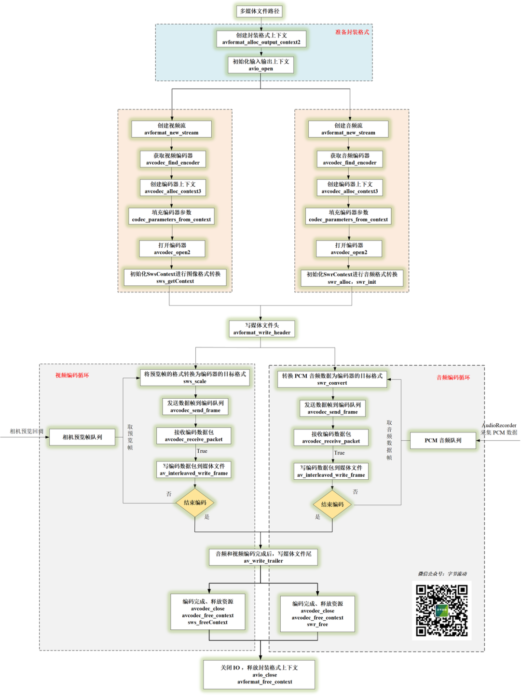
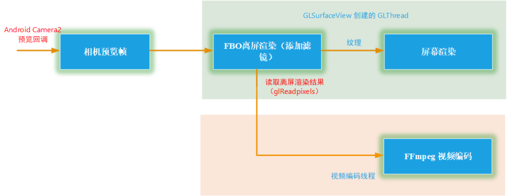

# Android FFmpeg 实现带滤镜的微信小视频录制功能

Android FFmpeg 音视频开发连载：


- [FFmpeg 编译和集成](http://mp.weixin.qq.com/s?__biz=MzIwNTIwMzAzNg==&mid=2654162543&idx=1&sn=894a6bfb0f8f652ef53860075af1754b&chksm=8cf39d5cbb84144a9d62fa80cbeed1843aadfe97bf8a30ab02474f98ec86be649d65e301674b&scene=21#wechat_redirect)
- [FFmpeg + ANativeWindow 实现视频解码播放](http://mp.weixin.qq.com/s?__biz=MzIwNTIwMzAzNg==&mid=2654162564&idx=1&sn=6785c7f9b6bdccbd400f792e9389b15c&chksm=8cf39db7bb8414a14a4acdea47e866f4b19ebdf80ed5aa7663a678c9571d505ecda294b65a05&scene=21#wechat_redirect)
- [FFmpeg + OpenSLES 实现音频解码播放](http://mp.weixin.qq.com/s?__biz=MzIwNTIwMzAzNg==&mid=2654162604&idx=1&sn=c4e6d5a53fddcc327861cb1956285c9c&chksm=8cf39d9fbb8414898778a461b8249b698486dff85d52f0f4a86deebb711597ac685fdc99c8c3&scene=21#wechat_redirect)
- [FFmpeg + OpenGLES 实现音频可视化播放](http://mp.weixin.qq.com/s?__biz=MzIwNTIwMzAzNg==&mid=2654162642&idx=1&sn=d25b3204928fdea29bee287024a763a1&chksm=8cf39de1bb8414f70f98b79c201dbd53f1679bceac37109e07a1072ff32c220c07eebe93111b&scene=21#wechat_redirect)
- [FFmpeg + OpenGLES 实现视频解码播放和视频滤镜](http://mp.weixin.qq.com/s?__biz=MzIwNTIwMzAzNg==&mid=2654162883&idx=1&sn=40e6a50ad4ca715dbceaa3782ae2fdc1&chksm=8cf39cf0bb8415e6411b87ed6a0edad423ce2b869399b788815785ea3f0584599a0973c1cf81&scene=21#wechat_redirect)
- [FFmpeg 播放器实现简单音视频同步的三种方式](http://mp.weixin.qq.com/s?__biz=MzIwNTIwMzAzNg==&mid=2654163000&idx=1&sn=80b75d043ae5a71e4fe59fe982129afe&chksm=8cf3830bbb840a1d6b8093781c6d5fdbf957c5ca7246cac11d04a9607271a1b45170613b1bba&scene=21#wechat_redirect)
- [FFmpeg + OpenGL ES 实现 3D 全景播放器](http://mp.weixin.qq.com/s?__biz=MzIwNTIwMzAzNg==&mid=2654163056&idx=1&sn=94d3d8ae3c004207b4c019a236b9129d&chksm=8cf38343bb840a5504d0cdc05cece6dbe4ab5fa89da71e59334f418634efd218129a6c7ac3a6&scene=21#wechat_redirect)
- [FFmpeg 播放器视频渲染优化](http://mp.weixin.qq.com/s?__biz=MzIwNTIwMzAzNg==&mid=2654163238&idx=1&sn=3f778082ee5a278bdd05743c33247127&chksm=8cf38215bb840b03fb6de375e22521fa3db762acdc09a37f9240648845e1057ff4c65d4a5661&scene=21#wechat_redirect)
- [FFmpeg、x264以及fdk-aac 编译整合](http://mp.weixin.qq.com/s?__biz=MzIwNTIwMzAzNg==&mid=2654164725&idx=1&sn=f643b096b3e87b1d1cd6068f2a25825a&chksm=8cf385c6bb840cd0d151b3140079e310c888442d96fe7857decfc708aaf96c37c374f2cefd62&scene=21#wechat_redirect)
- [FFmpeg 视频录制 - 视频添加滤镜和编码](http://mp.weixin.qq.com/s?__biz=MzIwNTIwMzAzNg==&mid=2654164776&idx=1&sn=5e9f1307349b2ec16452c9b33cc289cb&chksm=8cf3841bbb840d0dc08a8c447c83f21fff1fe205a9096ef705795d7341862ac8308206339753&scene=21#wechat_redirect)
- [FFmpeg + Android AudioRecorder 音频录制编码](http://mp.weixin.qq.com/s?__biz=MzIwNTIwMzAzNg==&mid=2654164836&idx=1&sn=24d5c252a9568145734c86b10d98f9d1&chksm=8cf38457bb840d4162d025c58a11bc91b6c16efcf9e02cdc8ec1f5849139f7ed4dfcf32bf09f&scene=21#wechat_redirect)


> 上一集，有读者吐槽这个系列更新太慢了，其实实现代码一直都有，只能每天花一点时间整理一些，慢慢整理出来。


前文利用 FFmpeg 分别实现了对[ Android Camera2 采集的预览帧进行编码生成 mp4 文件](http://mp.weixin.qq.com/s?__biz=MzIwNTIwMzAzNg==&mid=2654164776&idx=1&sn=5e9f1307349b2ec16452c9b33cc289cb&chksm=8cf3841bbb840d0dc08a8c447c83f21fff1fe205a9096ef705795d7341862ac8308206339753&scene=21#wechat_redirect)，以及对 [Android AudioRecorder 采集 PCM 音频进行编码生成 aac 文件](http://mp.weixin.qq.com/s?__biz=MzIwNTIwMzAzNg==&mid=2654164836&idx=1&sn=24d5c252a9568145734c86b10d98f9d1&chksm=8cf38457bb840d4162d025c58a11bc91b6c16efcf9e02cdc8ec1f5849139f7ed4dfcf32bf09f&scene=21#wechat_redirect)。


本文将实现对采集的预览帧（添加滤镜）和 PCM 音频同时编码复用生成一个 mp4 文件，即实现一个仿微信小视频录制功能。


字节流动的视频

，赞26

# 音视频录制编码流程

音视频编码流程图


**本文采用的是软件编码（CPU）实现，所以针对高分辨率的预览帧时，就需要考虑 CPU 能不能吃得消**，在骁龙 8250 上使用软件编码分辨率超过 1080P 的图像就会导致 CPU 比较吃力，这个时候帧率就跟不上了。

# 音视频录制代码实现

Java 层视频帧来自 Android Camera2 API 回调接口。


```
private ImageReader.OnImageAvailableListener mOnPreviewImageAvailableListener = new ImageReader.OnImageAvailableListener() {
    @Override
    public void onImageAvailable(ImageReader reader) {
        Image image = reader.acquireLatestImage();
        if (image != null) {
            if (mCamera2FrameCallback != null) {
                mCamera2FrameCallback.onPreviewFrame(CameraUtil.YUV_420_888_data(image), image.getWidth(), image.getHeight());
            }
            image.close();
        }
    }
};
```


Java 层音频使用的是 Android AudioRecorder API 录制的，将 AudioRecoder 封装到线程里，通过接口回调的方式将 PCM 数据传出来，默认采样率为 44.1kHz，双通道立体声，采样格式为 PCM 16 bit 。


JNI 实现主要是，在开始录制时传入输出文件路径、视频码率、帧率、视频宽高等参数，然后不断将音频帧和视频帧传入 Native 层的编码队列中，供编码器编码。


```
//开始录制，输出文件路径、视频码率、帧率、视频宽高等参数
extern "C"
JNIEXPORT jint JNICALL
Java_com_byteflow_learnffmpeg_media_MediaRecorderContext_native_1StartRecord(JNIEnv *env,
                                                                             jobject thiz,
                                                                             jint recorder_type,
                                                                             jstring out_url,
                                                                             jint frame_width,
                                                                             jint frame_height,
                                                                             jlong video_bit_rate,
                                                                             jint fps) {
    const char* url = env->GetStringUTFChars(out_url, nullptr);
    MediaRecorderContext *pContext = MediaRecorderContext::GetContext(env, thiz);
    env->ReleaseStringUTFChars(out_url, url);
    if(pContext) return pContext->StartRecord(recorder_type, url, frame_width, frame_height, video_bit_rate, fps);
    return 0;
}

//传入音频帧到编码队列
extern "C"
JNIEXPORT void JNICALL
Java_com_byteflow_learnffmpeg_media_MediaRecorderContext_native_1OnAudioData(JNIEnv *env,
                                                                             jobject thiz,
                                                                             jbyteArray data,
                                                                             jint size) {
    int len = env->GetArrayLength (data);
    unsigned char* buf = new unsigned char[len];
    env->GetByteArrayRegion(data, 0, len, reinterpret_cast<jbyte*>(buf));
    MediaRecorderContext *pContext = MediaRecorderContext::GetContext(env, thiz);
    if(pContext) pContext->OnAudioData(buf, len);
    delete[] buf;
}

//传入视频帧到编码队列
extern "C"
JNIEXPORT void JNICALL
Java_com_byteflow_learnffmpeg_media_MediaRecorderContext_native_1OnPreviewFrame(JNIEnv *env,
                                                                                 jobject thiz,
                                                                                 jint format,
                                                                                 jbyteArray data,
                                                                                 jint width,
                                                                                 jint height) {
    int len = env->GetArrayLength (data);
    unsigned char* buf = new unsigned char[len];
    env->GetByteArrayRegion(data, 0, len, reinterpret_cast<jbyte*>(buf));
    MediaRecorderContext *pContext = MediaRecorderContext::GetContext(env, thiz);
    if(pContext) pContext->OnPreviewFrame(format, buf, width, height);
    delete[] buf;
}

//停止录制
extern "C"
JNIEXPORT jint JNICALL
Java_com_byteflow_learnffmpeg_media_MediaRecorderContext_native_1StopRecord(JNIEnv *env,
                                                                            jobject thiz) {
    MediaRecorderContext *pContext = MediaRecorderContext::GetContext(env, thiz);
    if(pContext) return pContext->StopRecord();
    return 0;
}
```


将音视频编码的实现流程封装到一个类中，代码基本上就是照着上面的流程图实现的。


```
//音视频录制的封装类
class MediaRecorder {
public:
    MediaRecorder(const char *url, RecorderParam *param);
    ~MediaRecorder();
    //开始录制
    int StartRecord();
    //添加音频数据到音频队列
    int OnFrame2Encode(AudioFrame *inputFrame);
    //添加视频数据到视频队列
    int OnFrame2Encode(VideoFrame *inputFrame);
    //停止录制
    int StopRecord();

private:
    //启动音频编码线程
    static void StartAudioEncodeThread(MediaRecorder *recorder);
    //启动视频编码线程
    static void StartVideoEncodeThread(MediaRecorder *recorder);

    static void StartMediaEncodeThread(MediaRecorder *recorder);
    //分配音频缓冲帧
    AVFrame *AllocAudioFrame(AVSampleFormat sample_fmt, uint64_t channel_layout, int sample_rate, int nb_samples);
    //分配视频缓冲帧
    AVFrame *AllocVideoFrame(AVPixelFormat pix_fmt, int width, int height);
    //写编码包到媒体文件
    int WritePacket(AVFormatContext *fmt_ctx, AVRational *time_base, AVStream *st, AVPacket *pkt);
    //添加媒体流程
    void AddStream(AVOutputStream *ost, AVFormatContext *oc, AVCodec **codec, AVCodecID codec_id);
    //打印 packet 信息
    void PrintfPacket(AVFormatContext *fmt_ctx, AVPacket *pkt);
    //打开音频编码器
    int OpenAudio(AVFormatContext *oc, AVCodec *codec, AVOutputStream *ost);
    //打开视频编码器
    int OpenVideo(AVFormatContext *oc, AVCodec *codec, AVOutputStream *ost);
    //编码一帧音频
    int EncodeAudioFrame(AVOutputStream *ost);
    //编码一帧视频
    int EncodeVideoFrame(AVOutputStream *ost);
    //释放编码器上下文
    void CloseStream(AVOutputStream *ost);

private:
    RecorderParam    m_RecorderParam = {0};
    AVOutputStream   m_VideoStream;
    AVOutputStream   m_AudioStream;
    char             m_OutUrl[1024] = {0};
    AVOutputFormat  *m_OutputFormat = nullptr;
    AVFormatContext *m_FormatCtx = nullptr;
    AVCodec         *m_AudioCodec = nullptr;
    AVCodec         *m_VideoCodec = nullptr;
    //视频帧队列
    ThreadSafeQueue<VideoFrame *>
                     m_VideoFrameQueue;
    //音频帧队列
    ThreadSafeQueue<AudioFrame *>
                     m_AudioFrameQueue;
    int              m_EnableVideo = 0;
    int              m_EnableAudio = 0;
    volatile bool    m_Exit = false;
    //音频编码线程
    thread          *m_pAudioThread = nullptr;
    //视频编码线程
    thread          *m_pVideoThread = nullptr;

};
```

**
**

其中编码一帧视频和编码一帧音频的实现基本上一致，都是先将格式转换为目标格式，然后 avcodec_send_frame\avcodec_receive_packet ，最后编码一个空帧作为结束标志。

**
**

```
int MediaRecorder::EncodeVideoFrame(AVOutputStream *ost) {
    LOGCATE("MediaRecorder::EncodeVideoFrame");
    int result = 0;
    int ret;
    AVCodecContext *c;
    AVFrame *frame;
    AVPacket pkt = { 0 };

    c = ost->m_pCodecCtx;

    av_init_packet(&pkt);

    while (m_VideoFrameQueue.Empty() && !m_Exit) {
        usleep(10* 1000);
    }

    frame = ost->m_pTmpFrame;
    AVPixelFormat srcPixFmt = AV_PIX_FMT_YUV420P;
    VideoFrame *videoFrame = m_VideoFrameQueue.Pop();
    if(videoFrame) {
        frame->data[0] = videoFrame->ppPlane[0];
        frame->data[1] = videoFrame->ppPlane[1];
        frame->data[2] = videoFrame->ppPlane[2];
        frame->linesize[0] = videoFrame->pLineSize[0];
        frame->linesize[1] = videoFrame->pLineSize[1];
        frame->linesize[2] = videoFrame->pLineSize[2];
        frame->width = videoFrame->width;
        frame->height = videoFrame->height;
        switch (videoFrame->format) {
            case IMAGE_FORMAT_RGBA:
                srcPixFmt = AV_PIX_FMT_RGBA;
                break;
            case IMAGE_FORMAT_NV21:
                srcPixFmt = AV_PIX_FMT_NV21;
                break;
            case IMAGE_FORMAT_NV12:
                srcPixFmt = AV_PIX_FMT_NV12;
                break;
            case IMAGE_FORMAT_I420:
                srcPixFmt = AV_PIX_FMT_YUV420P;
                break;
            default:
                LOGCATE("MediaRecorder::EncodeVideoFrame unSupport format pImage->format=%d", videoFrame->format);
                break;
        }
    }

    if((m_VideoFrameQueue.Empty() && m_Exit) || ost->m_EncodeEnd) frame = nullptr;

    if(frame != nullptr) {
    /* when we pass a frame to the encoder, it may keep a reference to it
    * internally; make sure we do not overwrite it here */
        if (av_frame_make_writable(ost->m_pFrame) < 0) {
            result = 1;
            goto EXIT;
        }

        if (srcPixFmt != AV_PIX_FMT_YUV420P) {
            /* as we only generate a YUV420P picture, we must convert it
             * to the codec pixel format if needed */
            if (!ost->m_pSwsCtx) {
                ost->m_pSwsCtx = sws_getContext(c->width, c->height,
                                                srcPixFmt,
                                              c->width, c->height,
                                              c->pix_fmt,
                                              SWS_FAST_BILINEAR, nullptr, nullptr, nullptr);
                if (!ost->m_pSwsCtx) {
                    LOGCATE("MediaRecorder::EncodeVideoFrame Could not initialize the conversion context\n");
                    result = 1;
                    goto EXIT;
                }
            }
            sws_scale(ost->m_pSwsCtx, (const uint8_t * const *) frame->data,
                      frame->linesize, 0, c->height, ost->m_pFrame->data,
                      ost->m_pFrame->linesize);
        }
        ost->m_pFrame->pts = ost->m_NextPts++;
        frame = ost->m_pFrame;
    }

    /* encode the image */
    ret = avcodec_send_frame(c, frame);
    if(ret == AVERROR_EOF) {
        result = 1;
        goto EXIT;
    } else if(ret < 0) {
        LOGCATE("MediaRecorder::EncodeVideoFrame video avcodec_send_frame fail. ret=%s", av_err2str(ret));
        result = 0;
        goto EXIT;
    }

    while(!ret) {
        ret = avcodec_receive_packet(c, &pkt);
        if (ret == AVERROR(EAGAIN) || ret == AVERROR_EOF) {
            result = 0;
            goto EXIT;
        } else if (ret < 0) {
            LOGCATE("MediaRecorder::EncodeVideoFrame video avcodec_receive_packet fail. ret=%s", av_err2str(ret));
            result = 0;
            goto EXIT;
        }
        LOGCATE("MediaRecorder::EncodeVideoFrame video pkt pts=%ld, size=%d", pkt.pts, pkt.size);
        int result = WritePacket(m_FormatCtx, &c->time_base, ost->m_pStream, &pkt);
        if (result < 0) {
            LOGCATE("MediaRecorder::EncodeVideoFrame video Error while writing audio frame: %s",
                    av_err2str(ret));
            result = 0;
            goto EXIT;
        }
    }

EXIT:
    NativeImageUtil::FreeNativeImage(videoFrame);
    if(videoFrame) delete videoFrame;
    return result;
}
```


**最后注意编码过程中，音视频时间戳对齐，防止出现视频声音播放结束画面还没结束的情况。**


```
void MediaRecorder::StartVideoEncodeThread(MediaRecorder *recorder) {
    AVOutputStream *vOs = &recorder->m_VideoStream;
    AVOutputStream *aOs = &recorder->m_AudioStream;
    while (!vOs->m_EncodeEnd) {
        double videoTimestamp = vOs->m_NextPts * av_q2d(vOs->m_pCodecCtx->time_base);
        double audioTimestamp = aOs->m_NextPts * av_q2d(aOs->m_pCodecCtx->time_base);
        LOGCATE("MediaRecorder::StartVideoEncodeThread [videoTimestamp, audioTimestamp]=[%lf, %lf]", videoTimestamp, audioTimestamp);
        if (av_compare_ts(vOs->m_NextPts, vOs->m_pCodecCtx->time_base,
                                           aOs->m_NextPts, aOs->m_pCodecCtx->time_base) <= 0 || aOs->m_EncodeEnd) {
            LOGCATE("MediaRecorder::StartVideoEncodeThread start queueSize=%d", recorder->m_VideoFrameQueue.Size());
            //视频和音频时间戳对齐，人对于声音比较敏感，防止出现视频声音播放结束画面还没结束的情况
            if(audioTimestamp <= videoTimestamp && aOs->m_EncodeEnd) vOs->m_EncodeEnd = aOs->m_EncodeEnd;
            vOs->m_EncodeEnd = recorder->EncodeVideoFrame(vOs);
        } else {
            LOGCATE("MediaRecorder::StartVideoEncodeThread start usleep");
            //视频时间戳大于音频时间戳时，视频编码进行休眠等待对齐
            usleep(5 * 1000);
        }
    }

}
```


至此，一个小视频录制功能实现了，限于篇幅，代码没有全部贴出来，完整实现代码可以参考项目：


```
https://github.com/githubhaohao/LearnFFmpeg
```

# 带滤镜的小视频录制

基于上节的代码我们已经实现了类似于微信的小视频录制功能，但是简单的视频录制显然不是本文的目的，关于讲 FFmpeg 视频录制的文章实在是太多了，所以本文就做一些差异化。


我们基于上一节的功能做一个带滤镜的小视频录制功能。


带滤镜的小视频录制


参考上图，**我们在 GL 线程里首先创建 FBO ，先将预览帧渲染到 FBO 绑定的纹理上添加滤镜，之后使用 glreadpixels 读取添加完滤镜之后的视频帧放入编码线程编码，最后绑定到 FBO 的纹理再做屏幕渲染，**这一点我们已经[在添加滤镜的 FFmpeg 视频播放器](http://mp.weixin.qq.com/s?__biz=MzIwNTIwMzAzNg==&mid=2654162883&idx=1&sn=40e6a50ad4ca715dbceaa3782ae2fdc1&chksm=8cf39cf0bb8415e6411b87ed6a0edad423ce2b869399b788815785ea3f0584599a0973c1cf81&scene=21#wechat_redirect)一文中做了详细介绍。


这里我们定义一个类 GLCameraRender 负责完成离屏渲染（添加滤镜）和屏幕渲染展示预览帧，这部分代码可以参考 [FFmpeg 视频播放器的渲染优化](http://mp.weixin.qq.com/s?__biz=MzIwNTIwMzAzNg==&mid=2654163238&idx=1&sn=3f778082ee5a278bdd05743c33247127&chksm=8cf38215bb840b03fb6de375e22521fa3db762acdc09a37f9240648845e1057ff4c65d4a5661&scene=21#wechat_redirect)一文。


```
class GLCameraRender: public VideoRender, public BaseGLRender{
public:
    //初始化预览帧的宽高
    virtual void Init(int videoWidth, int videoHeight, int *dstSize);
    //渲染一帧视频
    virtual void RenderVideoFrame(NativeImage *pImage);
    virtual void UnInit();

    //GLSurfaceView 的三个回调
    virtual void OnSurfaceCreated();
    virtual void OnSurfaceChanged(int w, int h);
    virtual void OnDrawFrame();

    static GLCameraRender *GetInstance();
    static void ReleaseInstance();

    //更新变换矩阵，Camera预览帧需要进行旋转
    virtual void UpdateMVPMatrix(int angleX, int angleY, float scaleX, float scaleY);
    virtual void UpdateMVPMatrix(TransformMatrix * pTransformMatrix);

    //添加好滤镜之后，视频帧的回调，然后将带有滤镜的视频帧放入编码队列
    void SetRenderCallback(void *ctx, OnRenderFrameCallback callback) {
        m_CallbackContext = ctx;
        m_RenderFrameCallback = callback;
    }

    //加载滤镜素材图像
    void SetLUTImage(int index, NativeImage *pLUTImg);

    //加载 Java 层着色器脚本
    void SetFragShaderStr(int index, char *pShaderStr, int strSize);

private:
    GLCameraRender();
    virtual ~GLCameraRender();
    //创建 FBO
    bool CreateFrameBufferObj();

    void GetRenderFrameFromFBO();
    //创建或更新滤镜素材纹理
    void UpdateExtTexture();

    static std::mutex m_Mutex;
    static GLCameraRender* s_Instance;
    GLuint m_ProgramObj = GL_NONE;
    GLuint m_FboProgramObj = GL_NONE;
    GLuint m_TextureIds[TEXTURE_NUM];
    GLuint m_VaoId = GL_NONE;
    GLuint m_VboIds[3];
    GLuint m_DstFboTextureId = GL_NONE;
    GLuint m_DstFboId = GL_NONE;
    NativeImage m_RenderImage;
    glm::mat4 m_MVPMatrix;
    TransformMatrix m_transformMatrix;

    int m_FrameIndex;
    vec2 m_ScreenSize;

    OnRenderFrameCallback m_RenderFrameCallback = nullptr;
    void *m_CallbackContext = nullptr;

    //支持滑动选择滤镜功能
    volatile bool m_IsShaderChanged = false;
    volatile bool m_ExtImageChanged = false;
    char * m_pFragShaderBuffer = nullptr;
    NativeImage m_ExtImage;
    GLuint m_ExtTextureId = GL_NONE;
    int m_ShaderIndex = 0;
    mutex m_ShaderMutex;

};
```


JNI 层我们需要传入不同滤镜的 shader 脚本和一些 LUT 滤镜的 LUT 图，这样我们在 Java 层可以实现通过左右滑动屏幕来切换不同的滤镜。


```
extern "C"
JNIEXPORT void JNICALL
Java_com_byteflow_learnffmpeg_media_MediaRecorderContext_native_1SetFilterData(JNIEnv *env,
                                                                               jobject thiz,
                                                                               jint index,
                                                                               jint format,
                                                                               jint width,
                                                                               jint height,
                                                                               jbyteArray bytes) {
    int len = env->GetArrayLength (bytes);
    uint8_t* buf = new uint8_t[len];
    env->GetByteArrayRegion(bytes, 0, len, reinterpret_cast<jbyte*>(buf));
    MediaRecorderContext *pContext = MediaRecorderContext::GetContext(env, thiz);
    if(pContext) pContext->SetLUTImage(index, format, width, height, buf);
    delete[] buf;
    env->DeleteLocalRef(bytes);
}

extern "C"
JNIEXPORT void JNICALL
Java_com_byteflow_learnffmpeg_media_MediaRecorderContext_native_1SetFragShader(JNIEnv *env,
                                                                               jobject thiz,
                                                                               jint index,
                                                                               jstring str) {
    int length = env->GetStringUTFLength(str);
    const char* cStr = env->GetStringUTFChars(str, JNI_FALSE);
    char *buf = static_cast<char *>(malloc(length + 1));
    memcpy(buf, cStr, length + 1);
    MediaRecorderContext *pContext = MediaRecorderContext::GetContext(env, thiz);
    if(pContext) pContext->SetFragShader(index, buf, length + 1);
    free(buf);
    env->ReleaseStringUTFChars(str, cStr);
}
```


同样，完整的实现代码可以参考项目：


```
https://github.com/githubhaohao/LearnFFmpeg
```


另外，如果你想要更多的滤镜，可以参考项目 OpenGLCamera2 ，该项目实现 30 种相机滤镜和特效。


```
https://github.com/githubhaohao/OpenGLCamera2
```