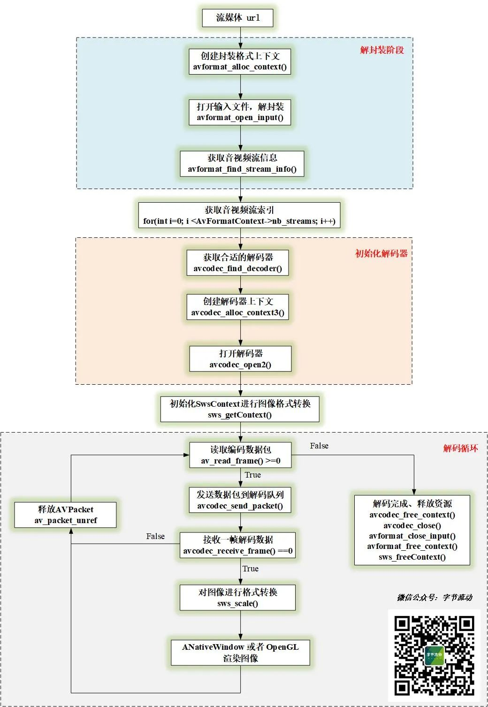

# Android FFmpeg 流媒体边播放边录制功能

前面 FFmpeg 系列的文章中，已经实现了[音视频的播放、录制已经添加滤镜](http://mp.weixin.qq.com/s?__biz=MzIwNTIwMzAzNg==&mid=2654164951&idx=1&sn=32f687de8fa113fe794194d565db686f&chksm=8cf384e4bb840df218e25eddd552c80b4e133e6d7577e7682a6ecf913be248c223c9d9928779&scene=21#wechat_redirect)等功能，本文将用 FFmpeg 实现流媒体的边播放边录制功能。

字节流动的视频

，赞10

# 流媒体

流媒体（英语：Streaming media）**是指将一连串的多媒体资料压缩后，经过互联网分段发送资料，在互联网上即时传输影音以供观赏的一种技术与过程**，此技术使得资料数据包得以像流水一样发送，如果不使用此技术，就必须在使用前下载整个媒体文件。


**流媒体在播放前并不下载整个文件，只将开始部分内容存入内存，流式媒体的数据流随时传送随时播放，只是在开始时有一些延迟。**


流媒体实现的关键技术就是流式传输，流式传输分为：实时流和顺序流。


**实时流传输**指保证媒体信号带宽与网络连接匹配，**使媒体可被实时观看到，实时流式传输根据网络情况调整输出音视频的质量从而实现媒体的持续的实时传送，用户可快进或后退**以观看前面或后面的内容。


**顺序流传输**是顺序下载，在下载文件的同时用户可观看在线媒体，在给定时刻，用户只能观看已下载的那部分，而**不能跳到还未下载的前头部分，在传输期间不根据用户连接的速度对下载顺序做调整**。

# FFmpeg 播放流媒体

FFmpeg 中对影音数据的处理，可以划分为**协议层、容器层、编码层与原始数据层**四个层次：


协议层：**提供网络协议收发功能，可以接收或推送含封装格式的媒体流。**协议层由 libavformat 库及第三方库(如 librtmp)提供支持。


容器层：**处理各种封装格式 (MP4，FLV 等)**。容器层由 libavformat 库提供支持。


编码层：**处理音视频编码及解码。**编码层由各种丰富的编解码器(libavcodec 库及第三方编解码库(如 libx264))提供支持。


原始数据层：**处理未编码的原始音视频帧。**


**FFmpeg 中 libavformat 库提供了丰富的协议处理及封装格式处理功能，在打开输入/输出时，FFmpeg 会根据 输入 URL / 输出 URL 探测输入/输出格式，选择合适的协议和封装格式**。


例如，如果输出 URL 是 "rtmp://122.125.10.22/live"，那么 FFmpeg 打开输出时，会确定使用 rtmp 协议，封装格式为 flv。


FFmpeg 中打开输入/输出的内部处理细节用户不必关注，不同之处主要在于输入/输出 URL 形式不同，若 URL 携带 "rtmp://"、"rpt://"、"udp://"等前缀，则表示涉及流处理；否则，处理的是本地文件。


**由于 FFmpeg 对不同的传输协议进行了封装，使用 FFmpeg 播放流媒体和播放本地文件，流程上没有区别**（针对 FFmpeg 4.2.2 以上版本）。





# FFmpeg 边播放边录制

FFmpeg 边播放边录制有两种实现方式：


- 在解复用时获取到编码数据包，然后重新复用打包;
- **在解码后获取到原始数据，然后对原始数据处理（如添加滤镜），最后对处理后的数据进行编码打包。**


本文采用对解码后的原始数据进行重新编码的方式，实现边播放边录制。


视频录制，这里我们可以直接使用在[前文 FFmpeg 视频录制](http://mp.weixin.qq.com/s?__biz=MzIwNTIwMzAzNg==&mid=2654164776&idx=1&sn=5e9f1307349b2ec16452c9b33cc289cb&chksm=8cf3841bbb840d0dc08a8c447c83f21fff1fe205a9096ef705795d7341862ac8308206339753&scene=21#wechat_redirect)中定义的类，启动录制之后，只需要不断往里面塞视频帧即可。


```
class SingleVideoRecorder {
public:
    SingleVideoRecorder(const char* outUrl, int frameWidth, int frameHeight, long bitRate, int fps);
    ~SingleVideoRecorder();

    //开始录制
    int StartRecord();
    //接收视频数据
    int OnFrame2Encode(VideoFrame *inputFrame);
    //停止录制
    int StopRecord();

private:
    ...
};
```

然后在解码类中进行录制。

```
/**
 *
 * Created by 公众号：字节流动 on 2021/3/16.
 * https://github.com/githubhaohao/LearnFFmpeg
 * 最新文章首发于公众号：字节流动，有疑问或者技术交流可以添加微信 Byte-Flow ,领取视频教程, 拉你进技术交流群
 *
 * */

#include "VideoDecoder.h"

void VideoDecoder::OnDecoderReady() {
    LOGCATE("VideoDecoder::OnDecoderReady");
    m_VideoWidth = GetCodecContext()->width;
    m_VideoHeight = GetCodecContext()->height;

    if(m_VideoRender != nullptr) {
        int dstSize[2] = {0};
        m_VideoRender->Init(m_VideoWidth, m_VideoHeight, dstSize);
        m_RenderWidth = dstSize[0];
        m_RenderHeight = dstSize[1];

        //初始化
        int fps = 25;
        long videoBitRate = m_RenderWidth * m_RenderHeight * fps * 0.2;
        m_pVideoRecorder = new SingleVideoRecorder("/sdcard/learnffmpeg_output.mp4", m_RenderWidth, m_RenderHeight, videoBitRate, fps);
        //开始录制
        m_pVideoRecorder->StartRecord();

    } else {
        LOGCATE("VideoDecoder::OnDecoderReady m_VideoRender == null");
    }
}

void VideoDecoder::OnDecoderDone() {
    LOGCATE("VideoDecoder::OnDecoderDone");

    if(m_VideoRender)
        m_VideoRender->UnInit();

    //视频播放结束，停止录制
    if(m_pVideoRecorder != nullptr) {
        m_pVideoRecorder->StopRecord();
        delete m_pVideoRecorder;
        m_pVideoRecorder = nullptr;
    }

}

void VideoDecoder::OnFrameAvailable(AVFrame *frame) {
    LOGCATE("VideoDecoder::OnFrameAvailable frame=%p", frame);
    if(m_VideoRender != nullptr && frame != nullptr) {
        NativeImage image;
        sws_scale(m_SwsContext, frame->data, frame->linesize, 0,
                  m_VideoHeight, m_RGBAFrame->data, m_RGBAFrame->linesize);
        image.format = IMAGE_FORMAT_RGBA;
        image.width = m_RenderWidth;
        image.height = m_RenderHeight;
        image.ppPlane[0] = m_RGBAFrame->data[0];
        image.pLineSize[0] = image.width * 4;

        m_VideoRender->RenderVideoFrame(&image);

        //不断塞视频帧
        if(m_pVideoRecorder != nullptr) {
            m_pVideoRecorder->OnFrame2Encode(&image);
        }
    }

}
```


完整的实现代码可以参考项目：


```
https://github.com/githubhaohao/LearnFFmpeg
```

# 参考文章

https://zh.wikipedia.org/wiki/%E6%B5%81%E5%AA%92%E4%BD%93
https://zhuanlan.zhihu.com/p/29567587
https://www.cnblogs.com/leisure_chn/p/10623968.html


-- END --