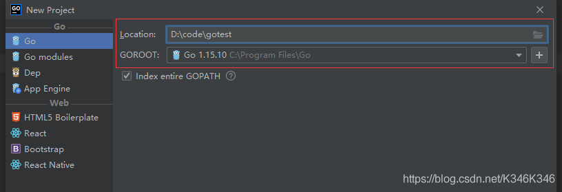
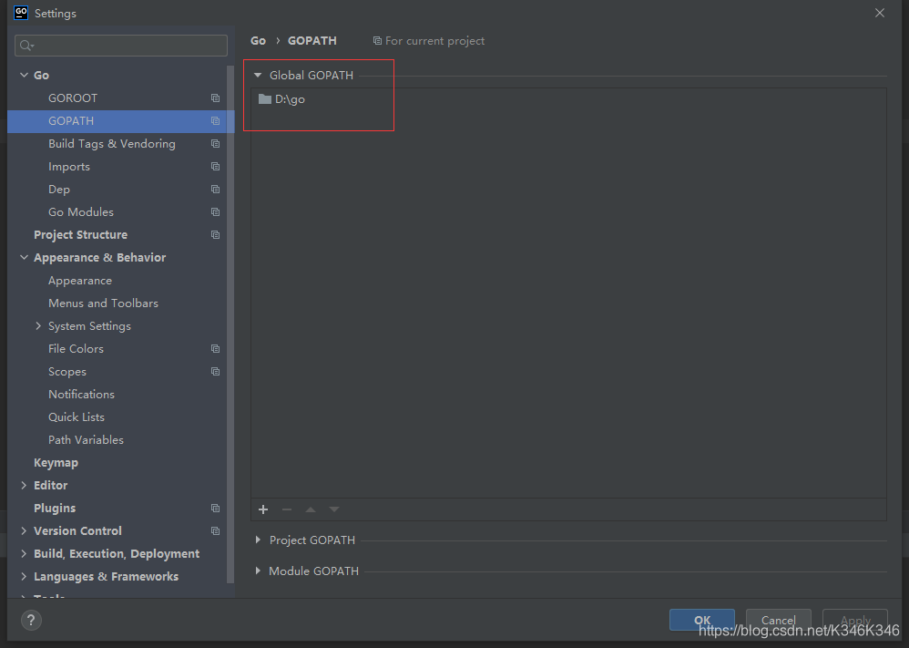
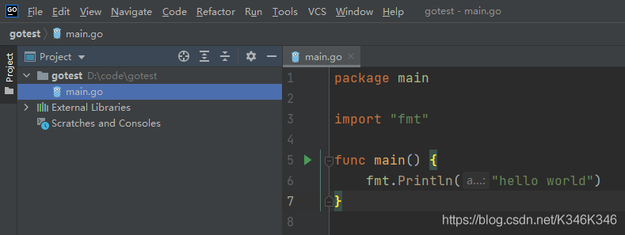
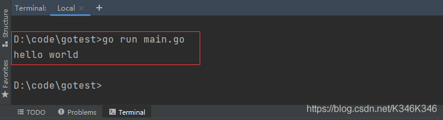
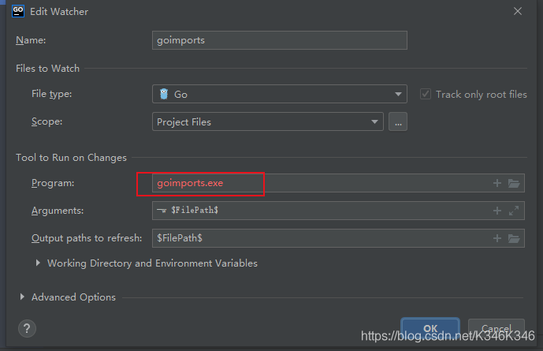
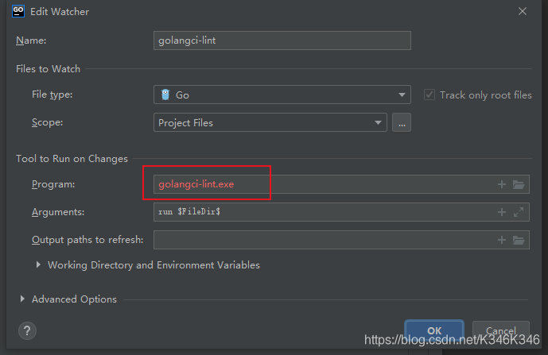
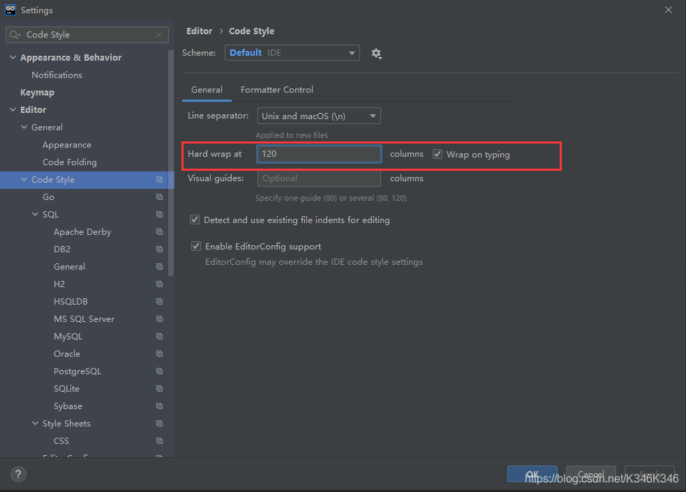

# GoLand 快速入门教程


## 1 简介

GoLand 是一款由捷克软件开发公司 JetBrains 专为 Go 开发的跨平台商业 IDE。Goland 具有 Strong Code Insight、Navigation & Search、Run & Debug、Integration with VCSs、More than just a Go IDE 以及较强的 Extensibility，能够帮助 Gopher 轻松愉悦方便快捷地 read 和 write Go code。

JetBrains 公司出品的 IDE，在业界有着良好的口碑，比如 CLion for C/C++、IntellijI IDEA for Java、PyCharm for Python、PhpStorm for PHP、WebStorm for JavaScript 等。Goland 一经推出，受到了广大 Gopher 的喜爱，建议大家将其作为 Go 的首选 IDE。

唯一令人遗憾的是 GoLand 是收费产品，如果没有条件或者烦于破解，开源免费的 VS Code 也是一个不错的选择。

下面以 Windows 下的 GoLand(2020.3.3) 为例，为大家演示如何快速上手 GoLand。


## 2 快速上手

### step 1 创建项目

```
File > New > Project
```



其中 gotest 为项目名称，同时设置 GOROOT。这里需要提前把 Go 安装好。


### step 2 配置环境变量 GOPATH

```
File > Settings > Go > GOPATH
```



GOPATH 下有三个目录，bin 存放安装的程序，pkg 存放依赖的包，src 存放下载的源码。

可以给工程单独配置一个 GOPATH，也可以使用全局的 GOPATH，也就是所有工程共用一个 GOPATH。这里使用全局的 GOPATH。

注意： 自己的工程一般放在 GOPATH 之外的任意位置。


### step 3 编写 main.go

```
File > New > Go File
```




### step 4 编译运行

控制台运行：

```bash
go run main.go
hello world
```



通过上面四步，就完成了 Go 工程的创建和运行，是不是挺容易上手的呢。


## 3.代码静态检测

使用 GoLand 编写 Go 代码时，可以配合 gofmt + goimports + golangci-lint 在保存时完成对代码的格式化和质量检测。

### 3.1 开启 go fmt

在每次保存代码文件时自动格式化代码。

```
File > Settings > Tools >  File Watchers > + > go fmt
```


### 3.2 开启 goimports

在每次保存代码时自动添加缺失的和删除未引用的包。

```
File > Settings > Tools >  File Watchers > + > goimports
```

如果插件详情界面显示红色，如下图所示，表示 goimports 插件未安装。



需要我们手动安装，安装方法一般有三个：
（1）点击 Tools > Go Tools > Goimports File，如果没有安装 goimports，则会提示未安装，按照指引，点击安装链接即可。


（2）打开 Terminal 工具窗口（View > Tool Windows > Terminal），然后执行 go get golang.org/x/tools/cmd/goimports 命令，goimports.exe 将被安装到 GOPATH/bin 目录下。


（3）通过源码安装。将仓库 https://github.com/golang/tools.git clone 到 $GOPATH/src/golang.org/x/tools，然后进入 cmd 目录下执行：go install golang.org/x/tools/cmd/goimports，会在 $GOPATH/bin 目录下生成 goimports.exe 文件。


goimports 检测代码有 2 种方式，如果下面不加 -w 仅打印修正 import 包后的结果，如果加了 -w 会修正 import 包然后将修正后的代码覆盖原始内容。

```bash
# 可以指定单个文件或目录

goimports - w file
goimports - w directory
```


### 3.3 开启 golangci-lint

开启 golangci-lint 可以对代码进行静态检查，比如报告函数行数超标、文件行数超标等来帮助规范代码。

开启配置：

```bash
File > Settings > Tools >  File Watchers > + > golangci-lint
```

如果本地未安装 golangci-lint，会显示红色，如下图所示：



安装方法主要有两个：
（1）执行命令：

```
go get -u github.com/golangci/golangci-lint/cmd/golangci-lint
```


（2）手动下载可执行文件。下载地址是 golangci-lint 在 Github 发布页面 releases。

配置文件：
golangci-lint 会从第一个分析路径的目录到根目录的所有目录中搜索配置文件。如果没有找到配置文件，将尝试在 home 目录中搜索。要查看正在使用哪个配置文件，以及从何处获取配置文件，请使用 -v 选项运行 golangci-lint。

golangci-lint 的配置文件可以是下面中的任意一个：

```
.golangci.yml
.golangci.yaml
.golangci.toml
.golangci.json
```

golangci-lint 有对应的配置文件来告诉其如何检测代码，配置文件放到工程的根目录。比如配置文件 `.golangci.yaml`：

```yaml
linters-settings:
  funlen:
    lines: 80
    statements: 80
  goconst:
    min-len: 2
    min-occurrences: 2
  gocyclo:
    min-complexity: 20
  golint:
    min-confidence: 0
  govet:
    check-shadowing: true
  lll:
    line-length: 120
  errcheck:
    check-type-assertions: true
linters:
  disable-all: true
  enable:
    - bodyclose
    - deadcode
    - funlen
    - goconst
    - gocyclo
    - gofmt
    - ineffassign
    - staticcheck
    - structcheck
    - typecheck
    - goimports
    - golint
    - gosimple
    - govet
    - lll
    - rowserrcheck
    - unused
    - varcheck
run:
  skip-dirs:
    - tars-protocol
  skip-files:
    - _test.go
  service:
    golangci-lint-version: 1.23.x
```


关于 golangci-lint 的使用详见其官方文档。


## 4.常见设置

变更主题

```
File > Settings > Appearance & Behavior > Appearance > Theme
```

建议选择背景为黑色的经典样式 Darcula，比较护眼。

变更字体类型、大小与行距

```
File > Settings > Editor > Font
```

变更文件编码方式

```
File > Settings > Editor > File Encodings
```

修改 Tab 表示空格数
Tab 默认为 4 个空格。

```
File > Settings > Editor > Code Style > Go
```

修改文件名称

```
右键文件 > Refactor > Rename
```


修改换行符

```
File > setting > Editor > Code Style > Line seperator
```


开启 HTTP 代理
如果无法下载依赖的墙外的 Go 包或者工具，那么需要配置 HTTP 代理。

```
File > Settings > Appearance & Behavior > HTTP Proxy
```

如果需要命令行也生效，那么需要配置环境变量。例如 Windows 下的环境变量配置如下：

```bash
:: 临时有效
set http_proxy=127.0.0.1:12345

:: 永久有效
setx http_proxy 127.0.0.1:12345
```


### 设置缩进线位置与自动换行

缩进线是观察者无障碍视线的直线，是编辑窗口中的那条竖线，用于提示开发人员当前行已超过标准，不利于阅读。

GoLand 默认一行不应超过 120 个字符，可进行配置。

```
File > Settings > Editor > Code Style > Hard wrap at
```

如果勾选 `Wrap on typing` 在编辑时超长将自动换行。




### 关闭 import 折叠

GoLand 默认会将 import 语句折叠起来，每次浏览 import 语句时都需要手动点开，如果想关闭的话，进行如下配置：

```
Editor > General > Code Folding > 去掉勾选 Imports
```


## 5.常用快捷键

文件相关

```
Ctrl + E					打开最近浏览过的文件
Ctrl + Shift + E			打开最近修改的文件
Ctrl + Shift + N			查找文件
```

查找

```
Ctrl + R					替换文本
Ctrl + F					查找文本
Ctrl + Shift + F			全局查找
```

导航

```
Ctrl + G					快速定位到某行
Ctrl + B					跳转至方法或结构体的定义或引用处
Ctrl + 左键单击				等同于 Ctrl + B
Ctrl + Alt + Left/Right		回退或前进到上次光标所在位置
Page Up						向上滚动一页
Shift + PageUp				向上滚动一页并选中
PageDown					向下滚动一页
Shift + PageDown			向下滚动一页并选中
Ctrl + PageUp				跳转至当前显示框的首行
Ctrl + Shift + PageUp		跳转至当前显示框的首行并选中
Ctrl + Page Down			跳转至当前显示框的末行
Ctrl + Shift + PageDown		跳转至当前显示框的末行并选中
Home						跳转至行首
Shift + Home				跳转至行首并选中
End							跳转至行尾
Shift + End					跳转至行尾并选中
Ctrl + Home					跳转至文件首行
Ctrl + Shift + Home			跳转至文件首行并选中
Ctrl + End					跳转至文件尾行
Ctrl + Shift + End			跳转至文件尾行并选中
```

注意：暂未发现 Windows GoLand 半屏滚动快捷键，有知道的同学麻烦留言告知。

选择

```
Alt + Shift + 左键长按		移动鼠标矩形选择内容
```


编辑

```
Ctrl + C 或 Ctrl + Insert	拷贝光标所在行或选中的内容
Ctrl + D					复制光标所在行或选中的内容
Ctrl + X					剪切光标所在行或选中的内容
Ctrl + Y					删除光标所在行
Ctrl + Z					撤销
Ctrl + Shift + Z			反向撤销
Ctrl + W 					选中光标所在的代码块，多次触发，代码块会逐级变大
Ctrl + /					单行注释或取消
Ctrl + Shift + /			多行注释或取消
Ctrl + +					折叠代码块、结构体或函数
Ctrl + -					展开代码块、结构体或函数
Ctrl + Alt + Enter			当前行的上方插入空行
Shift + Enter				当前行的下方插入空行
Ctrl + Backspace			按单词进行删除
Alt + Shift + Up/Down		可以将光标所在行的代码上下移动
Ctrl + Shift + U			将选中内容进行大小写转化
```

在 Goland 的帮助菜单里就有一份官方的默认快捷键列表：Help > Keymap Reference。

你可以通过 File > Settings > Keymap 设置 Goland 快捷键。注意你不能更改预定义的快捷键，当你修改任何快捷时，Goland 将为当前选定的快捷键创建一个副本，你可以对其进行配置。


## 参考文献

JetBrains 官网

https://www.jetbrains.com/


JetBrains Goland 官网

https://www.jetbrains.com/go/


Keyboard shortcuts - Help | GoLand - JetBrains

https://www.jetbrains.com/help/go/mastering-keyboard-shortcuts.html


GO语言从入门到放弃二：Goland安装与配置

https://zhuanlan.zhihu.com/p/82745568


掘金.IntelliJ IDEA 快捷键说明大全（中英对照、带图示详解）

https://juejin.im/post/5a90810b6fb9a063606eefe0


CSDN.IDEA中自动换行和标准线的设置

https://blog.csdn.net/kidoo1012/article/details/56842162


知乎.代码中的缩进线

https://zhuanlan.zhihu.com/p/150677580


Go tools - Help | GoLand - JetBrains

https://www.jetbrains.com/help/go/integration-with-go-tools.html


Go语言中文网.GoImports安装使用（修正 go import包的规范）

https://studygolang.com/articles/30933

