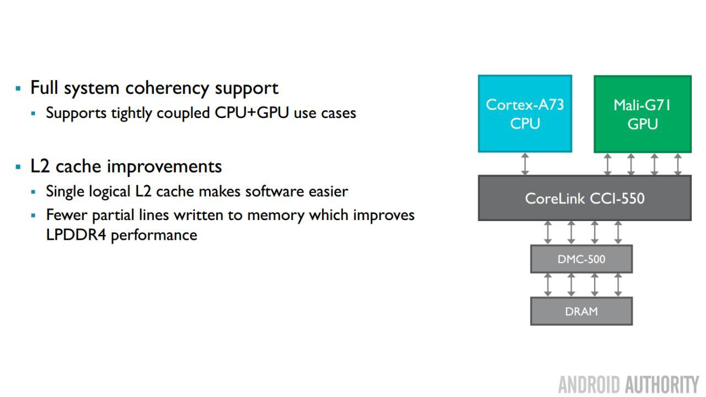

# GPU存储体系-Integrated GPU

这部分主要以Integrated GPU为例子，介绍一下它们的存储系统。目前我能找到的公开资料包括Intel Iris系列的Integrated GPU，以及ARM的Mali GPU。

正如上一篇文章所介绍的，在Integrated GPU中，GPU一般和CPU共享相同的物理存储。GPU自己的local memory实际上是从CPU的main memory中分配出来一块物理连续的空间来模拟的，即所谓的[Unified Memory Architecture](https://zhida.zhihu.com/search?content_id=6602683&content_type=Article&match_order=1&q=Unified+Memory+Architecture&zhida_source=entity)模型。注意即使在Unified Memory Architecture，Address也并非是Unified的，GPU和CPU用的地址也不一定位于一个地址空间内。

以下是Intel Gen9的SOC结构示意图：

Intel i7 6700K SOC结构示意图，来源Intel公开资料，版权归Intel所有

从这幅图可以看出，Intel的GPU和CPU core之间通过一个叫[SoC Ring Interconnect](https://zhida.zhihu.com/search?content_id=6602683&content_type=Article&match_order=1&q=SoC+Ring+Interconnect&zhida_source=entity)的总线进行互联，并且连接到System Agent上。System Agent负责存储访问等。所以很明显的一个事实就是，GPU实质上是和CPU共享相同的存储访问接口的。GPU和CPU共享存储为硬件设计带来了很多便利，然而付出的代价却十分昂贵。接下来我们会用一个非常粗糙的例子来看看，到底是什么导致了“核显性能不强”这个常识的。

假如我们外接两个2400MHz的[DDR4](https://zhida.zhihu.com/search?content_id=6602683&content_type=Article&match_order=1&q=DDR4&zhida_source=entity) DRAM组成双通道，每个DDR4带宽是64b，那么这个存储系统所能提供的最大数据带宽就是2400MHz * 64b * 2 ，峰值带宽大概是38.4GB/s。这么多的带宽需要在CPU和GPU之间进行共享的。Intel的文档描述其GPU的计算能力是384 FLOP/clock@32b, 如果这个GPU工作于400MHz，那么喂饱这个GPU的数据带宽就是384*4*400MHz，大概是614.4GB/s，刚好是我们上边那个DDR4存储系统能提供最大带宽的16倍。从这个简单的计算可以看出，制约Integrated GPU性能的从来不是其本身的计算能力，而是memory bandwidth。当然，这个计算是非常粗糙的，核显性能不强，带宽提供不够是一方面，此外还有包括散热（和CPU处于一个Die中），功耗，以及片内总线所能提供的数据带宽的限制。经网友提示，这里特意要说明一点，这里的计算只是未考虑缓存系统的情况下，一个非常粗略简单的峰值带宽估计，旨在用简单明了的计算方法来澄清gpu运算峰值带宽与存储系统之间的巨大鸿沟。在实际应用中，除了极端情况，譬如做压力测试，很少会有gpu带宽占满的情况。缓存系统的引入也有效地填补了这一鸿沟。本系列文章在后续会增加关于gpu缓存系统的介绍，以期有所助益。网友的提示详情可以参考评论区，欢迎大家相互交流。

上边这个计算，其实隐含着一个非常重要的假设，就是CPU和GPU之间只能通过外部的DRAM共享数据。在这个假设的前提下，GPU需要使用数据，就只能辛辛苦苦从外部DRAM中搬到SOC上了。然而对于Integrated GPU而言，其本身和CPU处于一个die上，天然就可以做到数据在chip上的共享，没有必要非要用那么慢的外部DRAM的。这就涉及到GPU存储体系中另外一个概念，Snoop。

我们首先回顾一下从GPU角度的存储。对于GPU而言，它能用的存储包括自己的local memory（实际上就是远在DRAM地方分出来的一部分），以及一部分通过[GART](https://zhida.zhihu.com/search?content_id=6602683&content_type=Article&match_order=1&q=GART&zhida_source=entity)可以访问的system memory（直接访问CPU的物理地址空间）。对于local memory而言，其可以完全映射到CPU的地址空间，因此，CPU要通过local memory往GPU share数据是非常简单的事情。然而local memory是global的，CPU上各自运行的process想要使用local memory来快速传递数据基本上是不可能的，毕竟这种global的resource应该由内核来管理。CPU上各自的process想要往GPU上upload数据，还得依靠GART才行。

GART的原理非常简单，就是将GPU自己的地址空间的一个地址映射到CPU的地址空间。假设GPU的local有128MB，那么可以建立一个简单的映射表，当GPU访问128M-256M的时候，将之映射到CPU地址空间内，一般是不连续的4kB或者64kB的page。这样，CPU上的进程将数据填写到自己分配的地址空间内，然后内核通过GART，将GPU的一段地址空间映射到之前CPU上进程写的地址空间，这样，GPU就可以用另一套地址空间来访问相同的数据了。

通过GART来进行数据之间的交互，数据的终点仍然在DRAM里，这样无法充分发挥Integrated GPU与CPU处于一个DIE的事实的。我们在review一下如果一个进程想要向GPU upload数据的过程：CPU上的进程写数据到物理页面，并**通知CPU将对应物理页面的缓存清空**，然后CPU上的内核态分配GPU地址空间，填写GART，并且build DMA buffer来启动GPU。所以，如果GPU可以直接访问CPU的缓存体系的话，数据就不用去DRAM中绕一圈，直接在chip上就可以共享了。这种做法，就是[Snoop机制](https://zhida.zhihu.com/search?content_id=6602683&content_type=Article&match_order=1&q=Snoop机制&zhida_source=entity)。

以Intel的这个为例，当CPU写数据的时候，将数据flush到LLC，因为从结构设计上，LLC在CPU和GPU之间是共享的，因此，GPU访问数据就可以直接hit到CPU之前写入的数据了，这个还不是Snoop机制。如果数据此时还没有更新到LLC，非Snoop的访问就无能为力了，此时，Snoop机制允许GPU的数据访问去检查CPU内部那些非共享的cache，来获取最新的数据。

因此，在Integrated GPU访问system memory的时候，可以选择指定Snoop属性，以决定是否去CPU的cache中查找相关的数据。SNOOP虽然保证了数据的一致性（单向一致性），却并非free，其最大的代价就是增加了设计的复杂性。对于Integrated GPU而言，需要协调总线，CPU核的设计，拥有这些能力的公司也为数不多。除了Intel以外，ARM也算是个中翘楚了。其他Integrated GPU的技术细节不甚了解，因此在此不敢妄议。

ARM体系通过[CCI总线](https://zhida.zhihu.com/search?content_id=6602683&content_type=Article&match_order=1&q=CCI总线&zhida_source=entity)保证core之间的数据一致性，对于Mali GPU，则提供一个ACP（**Accelerator Coherency Port）**接口，实现了GPU观测CPU的Snoop path. 从G71开始，新的Bifrost架构的GPU全部实现了[ACE总线](https://zhida.zhihu.com/search?content_id=6602683&content_type=Article&match_order=1&q=ACE总线&zhida_source=entity)，这也就意味着ARM已经实现了CPU-GPU之间双向的数据一致性。

ARM最新架构Bifrost已经可以实现双向一致性，图来自网络，版权归原作者所有

汇总一下，对于Integrated GPU而言，其local memory和CPU共享相同的存储实体，是为UMA结构。CPU有能力直接访问GPU全部的local memory。GPU通过GART能够访问到CPU地址空间的数据，并且可以通过Snoop属性，来做到单向一致性（GPU观测CPU数据）。Snoop并非毫无代价，其实现颇具复杂度。