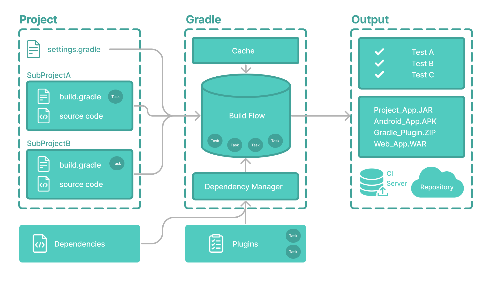

# Gradle核心概念

核心概念部分介绍了 Gradle 基础知识，以便您可以快速了解如何调用任务、打开功能、应用插件、向项目添加依赖项等等。

核心概念涵盖：

[第 1 部分](https://docs.gradle.org/8.5/userguide/gradle_basics.html#gradle). Gradle 概述
[第 2 部分.](https://docs.gradle.org/8.5/userguide/gradle_wrapper_basics.html#gradle_wrapper) Gradle 的包装器
[第 3 部分.](https://docs.gradle.org/8.5/userguide/command_line_interface_basics.html#command_line_interface) Gradle 的命令行界面
[第 4 部分.](https://docs.gradle.org/8.5/userguide/settings_file_basics.html#settings_file_basics)设置文件
[第 5 部分](https://docs.gradle.org/8.5/userguide/build_file_basics.html#build_file_basics). 构建文件
[第 6 部分.](https://docs.gradle.org/8.5/userguide/dependency_management_basics.html#dependency_management_basics)依赖项管理
[第 7 部分](https://docs.gradle.org/8.5/userguide/task_basics.html#task_basics).任务
[第 8](https://docs.gradle.org/8.5/userguide/plugin_basics.html#plugin_basics)部分.插件
[第 9 部分](https://docs.gradle.org/8.5/userguide/build_scans.html#build_scans). 构建扫描
[第 10 部分.](https://docs.gradle.org/8.5/userguide/gradle_optimizations.html#gradle_optimizations) Gradle 优化


## 1 Gradle基础知识


Gradle根据构建脚本中的信息自动构建、测试和部署软件。



## Gradle 核心概念


### 项目

Gradle项目是一个可以构建的软件，例如应用程序或库。

单个项目构建包括一个称为根项目的单个项目。

多项目构建包括一个根项目和任意数量的子项目。


### 构建脚本

构建脚本向 Gradle 详细介绍了构建项目所需采取的步骤。

每个项目可以包含一个或多个构建脚本。


### 依赖管理

依赖管理是一种用于声明和解析项目所需的外部资源的自动化技术。

每个项目通常都包含许多外部依赖项，Gradle 将在构建过程中解决这些依赖项。


### 任务

任务是基本的工作单元，例如编译代码或运行测试。

每个项目都包含在构建脚本或插件中定义的一个或多个任务。


### 插件

插件用于扩展 Gradle 的功能，并可选择向项目贡献任务。


## Gradle 项目结构

许多开发人员会通过现有项目首次与 Gradle 交互。

项目根目录中存在gradlew和文件是使用 Gradle 的明确标志。gradle.bat

Gradle 项目将类似于以下内容：

```
project
├── gradle                              // Gradle 目录用于存储包装文件等
│   ├── libs.versions.toml              //用于依赖管理的 Gradle 版本目录
│   └── wrapper
│       ├── gradle-wrapper.jar
│       └── gradle-wrapper.properties
├── gradlew                             //Gradle 包装脚本
├── gradlew.bat                         
├── settings.gradle(.kts)               //Gradle 设置文件用于定义根项目名称和子项目
├── subproject-a
│   ├── build.gradle(.kts)              //两个子项目的 Gradle 构建脚本 -subproject-a以及subproject-b
│   └── src                             //项目的源代码和/或附加文件
└── subproject-b
    ├── build.gradle(.kts)              
    └── src                             
```


## 调用Gradle

### 集成开发环境

Gradle内置于许多 IDE 中，包括 Android Studio、IntelliJ IDEA、Visual Studio Code、Eclipse 和 NetBeans。

当您在 IDE 中构建、清理或运行应用程序时，可以自动调用 Gradle。

建议您查阅所选 IDE 的手册，以了解有关如何使用和配置 Gradle 的更多信息。


### 命令行

安装后，可以在命令行中调用 Gradle 。例如：

```
$ gradle build
```

大多数项目不使用已安装的 Gradle 版本。
Gradle 包装器
Wrapper 是一个调用 Gradle 声明版本的脚本，是执行 Gradle 构建的推荐方法。它可以在项目根目录中作为gradlew或gradle.bat文件找到：

```
$ gradlew build     // Linux or OSX
$ gradle.bat build  // Windows
```


