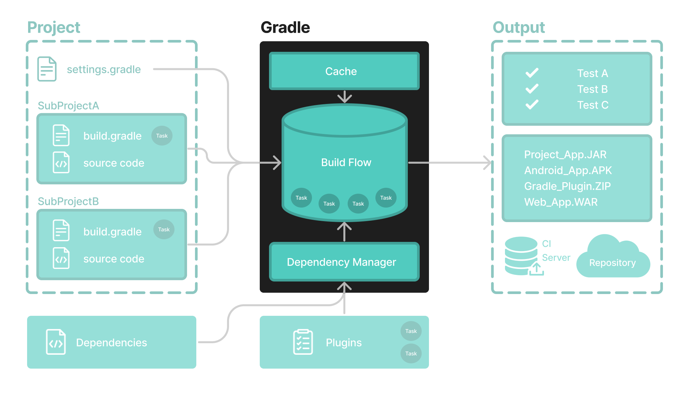
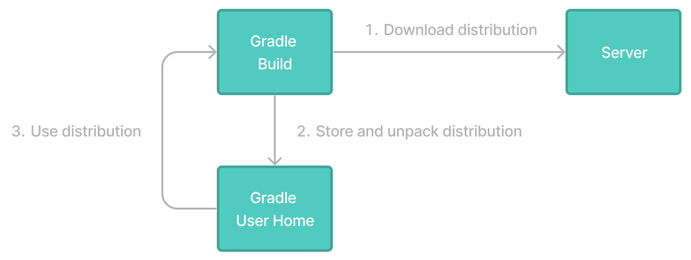

# Gradle 包装器基础知识

**执行任何 Gradle 构建的推荐方法**是使用 Gradle Wrapper。



Wrapper脚本调用声明的 Gradle 版本，并在必要时提前下载它*。*



包装器可作为`gradlew`或`gradle.bat`文件使用。

Wrapper 具有以下优点：

- 在给定 Gradle 版本上标准化项目。
- 为不同用户提供相同的 Gradle 版本。
- 为不同的执行环境（IDE、CI 服务器……）配置 Gradle 版本。


## 使用 Gradle 包装器

始终建议使用 Wrapper 执行构建，以确保构建的可靠、受控和标准化执行。

根据操作系统的不同，您可以运行`gradlew`或`gradlew.bat`来代替该`gradle`命令。

典型的 Gradle 调用：

```
$ gradle build
```

要在 Linux 或 OSX 计算机上运行 Wrapper：

```
$ ./gradlew build
```

要在 Windows PowerShell 上运行包装器：

```
$ .\gradlew.bat build
```

该命令在 Wrapper 所在的同一目录中运行。如果要在不同目录中运行该命令，则必须提供 Wrapper 的相对路径：

```
$ ../gradlew build
```

以下控制台输出演示了在 Windows 计算机上的命令提示符 (cmd) 中，对于基于 Java 的项目如何使用 Wrapper：

```
$ gradlew.bat build

Downloading https://services.gradle.org/distributions/gradle-5.0-all.zip
.....................................................................................
Unzipping C:\Documents and Settings\Claudia\.gradle\wrapper\dists\gradle-5.0-all\ac27o8rbd0ic8ih41or9l32mv\gradle-5.0-all.zip to C:\Documents and Settings\Claudia\.gradle\wrapper\dists\gradle-5.0-al\ac27o8rbd0ic8ih41or9l32mv
Set executable permissions for: C:\Documents and Settings\Claudia\.gradle\wrapper\dists\gradle-5.0-all\ac27o8rbd0ic8ih41or9l32mv\gradle-5.0\bin\gradle

BUILD SUCCESSFUL in 12s
1 actionable task: 1 executed
```

请参阅[Gradle Wrapper 参考](https://docs.gradle.org/8.5/userguide/gradle_wrapper.html#gradle_wrapper)以了解更多信息。