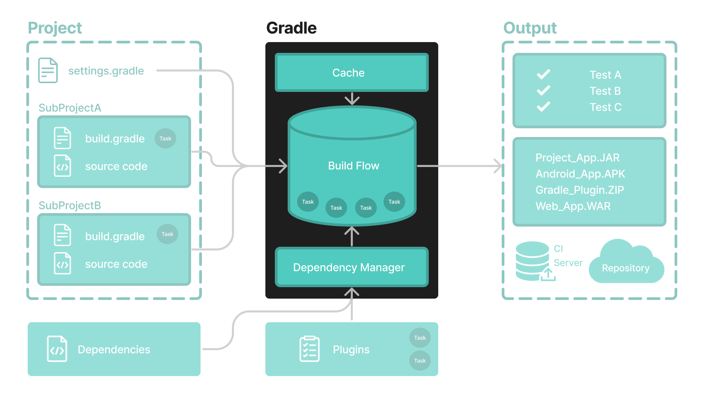

# Gradle命令行基础知识

命令行界面是在 IDE 之外**与 Gradle 交互的主要方法。**



强烈鼓励使用[Gradle Wrapper 。](https://docs.gradle.org/8.5/userguide/gradle_wrapper.html#gradle_wrapper)

在以下示例中替换为`./gradlew`（在 macOS / Linux 中）或`gradlew.bat`（在 Windows 中） 。`gradle`

在命令行执行Gradle符合以下结构：

```
gradle [taskName...] [--option-name...]
```

任务名称*之前*和*之后*允许使用选项。

```
gradle [--option-name...] [taskName...]
```

如果指定了多个任务，则应该用空格分隔它们。

```
gradle [taskName1 taskName2...] [--option-name...]
```

选项接收值时, 在选项与参数值之间可以加 `=`, 也可以不加 `=`, 推荐使用`=`, 加`=`的使用方式如下:

```
gradle [...] --console=plain
```

启用行为的选项具有长格式选项，其逆值用 指定`--no-`。以下是相反的情况。

```
gradle [...] --build-cache
gradle [...] --no-build-cache
```

许多长期权都有相应的短期权。以下是等效的：

```
gradle --help
gradle -h
```

## [命令行使用](https://docs.gradle.org/8.5/userguide/command_line_interface_basics.html#command_line_usage)

以下部分描述了 Gradle 命令行界面的使用。一些插件还添加自己的命令行选项。

### [执行任务](https://docs.gradle.org/8.5/userguide/command_line_interface_basics.html#sec:command_line_executing_tasks)

`taskName`要执行在根项目上调用的任务，请键入：

```
$ gradle :taskName
```

这将运行单个`taskName`及其所有[依赖项](https://docs.gradle.org/8.5/userguide/tutorial_using_tasks.html#sec:task_dependencies)。

### [指定任务选项](https://docs.gradle.org/8.5/userguide/command_line_interface_basics.html#sec:disambiguate_task_options_from_built_in_options)

要将选项传递给任务，请`--`在任务名称后添加选项名称前缀：

```
$ gradle taskName --exampleOption=exampleValue
```

请参阅[Gradle 命令行界面参考](https://docs.gradle.org/8.5/userguide/command_line_interface.html#command_line_interface)以了解更多信息。