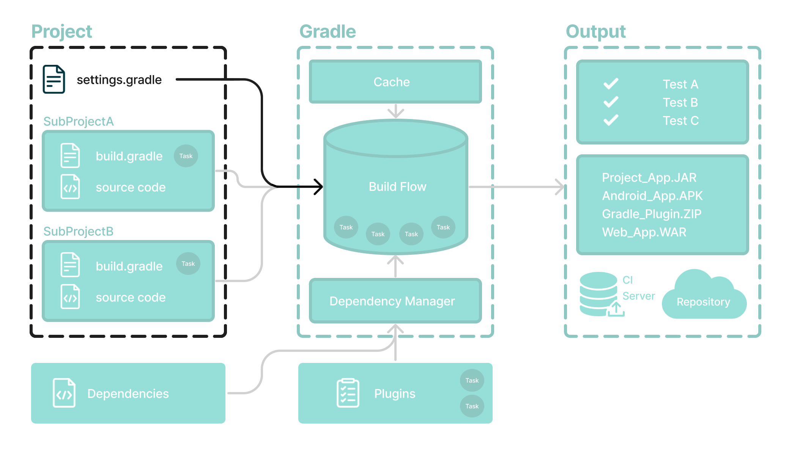

# 设置文件基础知识

设置文件是每个 Gradle 项目的**入口点**。



*设置文件*的主要目的是将子项目添加到您的构建中。

Gradle 支持单项目和多项目构建。

- 对于单项目构建，设置文件是可选的。
- 对于多项目构建，设置文件是必需的并声明所有子项目。


## 设置脚本

设置文件是一个脚本。它可以是`settings.gradle`用 Groovy 编写的文件，也可以`settings.gradle.kts`是用 Kotlin 编写的文件。

Groovy [DSL](https://docs.gradle.org/8.5/dsl/index.html)和[Kotlin DSL](https://docs.gradle.org/8.5/kotlin-dsl/index.html)是 Gradle 脚本唯一接受的语言。

设置文件通常位于项目的根目录中。

让我们看一个例子并将其分解：

settings.gradle.kts

```
rootProject.name = "root-project"   //定义项目名称。

include("sub-project-a")            //添加子项目。
include("sub-project-b")
include("sub-project-c")
```


### 1.定义项目名称

设置文件定义您的项目名称：

```
rootProject.name = "root-project"
```

每个构建只有一个根项目。


### 2.添加子项目

设置文件通过包含子项目（如果有）来定义项目的结构：

```
include("app")
include("business-logic")
include("data-model")
```

请参阅[写入设置文件](https://docs.gradle.org/8.5/userguide/writing_settings_files.html#writing_settings_files)页面以了解更多信息。