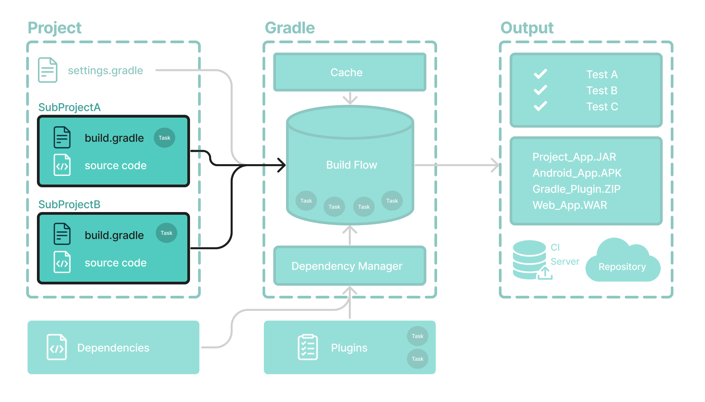

# 构建文件基础知识

一般来说，构建脚本详细介绍了**构建配置、任务和插件**。



每个 Gradle 构建至少包含一个*构建脚本*。

在构建文件中，可以添加两种类型的依赖项：

1. Gradle 和构建脚本所依赖的库和/或插件。
2. 项目源（即源代码）所依赖的库。


## 构建脚本

构建脚本可以是`build.gradle`用 Groovy 编写的文件，也可以`build.gradle.kts`是用 Kotlin 编写的文件。

Groovy [DSL](https://docs.gradle.org/8.5/dsl/index.html)和[Kotlin DSL](https://docs.gradle.org/8.5/kotlin-dsl/index.html)是 Gradle 脚本唯一接受的语言。

让我们看一个例子并将其分解：

构建.gradle.kts

```
plugins {
    id("application")               //添加插件。
}

application {
    mainClass = "com.example.Main"  //使用约定属性。
}
```


### 1.添加插件

插件扩展了 Gradle 的功能，并且可以向项目贡献任务。

将插件添加到构建中称为*应用*插件，并使附加功能可用。

```
plugins {
    id("application")
}
```

该`application`插件有助于创建可执行的 JVM 应用程序。

应用[应用程序插件](https://docs.gradle.org/8.5/userguide/application_plugin.html#application_plugin)也隐式应用[Java 插件](https://docs.gradle.org/8.5/userguide/java_plugin.html#java_plugin)。该`java`插件将 Java 编译以及测试和捆绑功能添加到项目中。


### 2. 使用约定属性

插件将任务添加到项目中。它还向项目添加属性和方法。

插件`application`定义了打包和分发应用程序的任务，例如任务`run`。

Application 插件提供了一种声明 Java 应用程序主类的方法，这是执行代码所必需的。

```
application {
    mainClass = "com.example.Main"
}
```

在此示例中，主类（即程序执行开始的点）是`com.example.Main`。

请参阅[写入设置文件](https://docs.gradle.org/8.5/userguide/writing_build_scripts.html#writing_build_scripts)页面以了解更多信息。