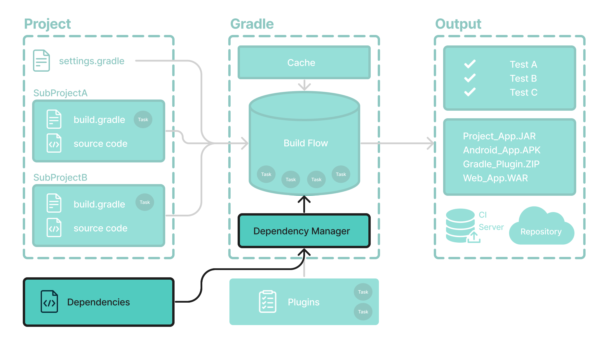

# 依赖管理基础知识

Gradle 内置了对**依赖管理的**支持。



依赖管理是一种用于声明和解析项目所需的外部资源的自动化技术。

Gradle 构建脚本定义了构建可能需要外部依赖项的项目的过程。依赖项是指支持构建项目的 JAR、插件、库或源代码。


## 版本目录

版本目录提供了一种将依赖项声明集中在文件中的方法`libs.versions.toml`。

该目录使子项目之间共享依赖关系和版本配置变得简单。它还允许团队在大型项目中强制执行库和插件的版本。

版本目录通常包含四个部分：

1. [versions] 声明插件和库将引用的版本号。
2. [libraries] 定义构建文件中使用的库。
3. [bundles] 定义一组依赖项。
4. [plugins] 定义插件。

```
[versions]
androidGradlePlugin = "7.4.1"
mockito = "2.16.0"

[libraries]
google-material = { group = "com.google.android.material", name = "material", version = "1.1.0-alpha05" }
mockito-core = { module = "org.mockito:mockito-core", version.ref = "mockito" }

[plugins]
android-application = { id = "com.android.application", version.ref = "androidGradlePlugin" }
```

该文件位于该`gradle`目录中，以便 Gradle 和 IDE 自动使用它。应将版本目录签入源代码管理：`gradle/libs.versions.toml`。


## 声明你的依赖关系

要向项目添加依赖项，请在`build.gradle(.kts)`文件的依赖项块中指定依赖项。

以下`build.gradle.kts`文件使用上面的版本目录向项目添加一个插件和两个依赖项：

```
plugins {
   alias(libs.plugins.android.application)  //将 Android Gradle 插件应用于此项目，该项目添加了一些特定于构建 Android 应用程序的功能。
}

dependencies {
    // Dependency on a remote binary to compile and run the code
    implementation(libs.google.material)    //将材质依赖项添加到项目中。Material Design 提供了用于
    										//在 Android 应用程序中创建用户界面的组件。该库将用于编译和运行本项目中的 Kotlin 源代码。

    // Dependency on a remote binary to compile and run the test code
    testImplementation(libs.mockito.core)   //将 Mockito 依赖项添加到项目中。Mockito 是一个用于测试 Java 代码的模拟框架。
    										//该库将用于编译和运行该项目中的*测试*源代码。
}
```


Gradle 中的依赖项按配置进行分组。

- 该`material`库被添加到`implementation`配置中，用于编译和运行*生产*代码。
- 该`mockito-core`库被添加到`testImplementation`配置中，用于编译和运行*测试*代码。


## 查看项目依赖关系

您可以使用以下命令在终端中查看依赖关系树`./gradlew :app:dependencies`：

```
$ ./gradlew :app:dependencies

> Task :app:dependencies

------------------------------------------------------------
Project ':app'
------------------------------------------------------------

implementation - Implementation only dependencies for source set 'main'. (n)
\--- com.google.android.material:material:1.1.0-alpha05 (n)

testImplementation - Implementation only dependencies for source set 'test'. (n)
\--- org.mockito:mockito-core:2.16.0 (n)

...
```

请参阅[依赖管理章节](https://docs.gradle.org/8.5/userguide/dependency_management_terminology.html#dependency_management_terminology)以了解更多信息。