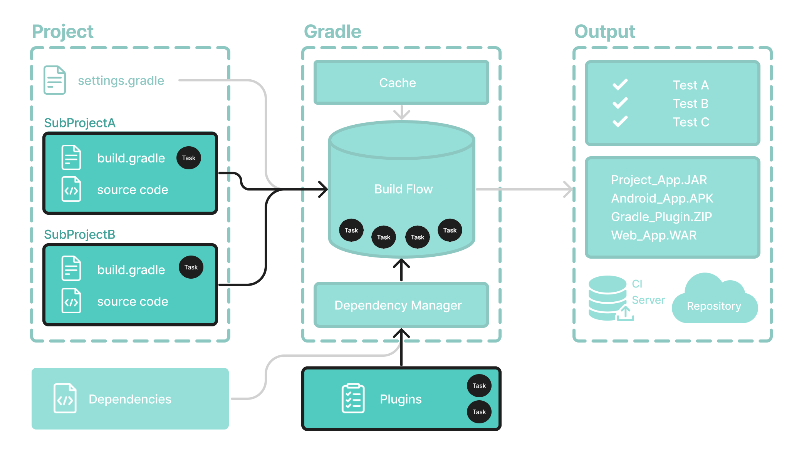

# 任务基础知识

任务代表构建执行的某些**独立工作单元，例如编译类、创建 JAR、生成 Javadoc 或将存档发布到存储库。**



`build`您可以使用以下命令或通过调用项目目录中的`gradle` Gradle Wrapper（`./gradlew`或）来运行 Gradle任务：`gradle.bat`

```
$ ./gradlew build
```


## 可用任务

项目中的所有可用任务都来自 Gradle 插件和构建脚本。

您可以通过在终端中运行以下命令来列出项目中的所有可用任务：

```
$ ./gradlew tasks
```


```
Application tasks
-----------------
run - Runs this project as a JVM application

Build tasks
-----------
assemble - Assembles the outputs of this project.
build - Assembles and tests this project.

...

Documentation tasks
-------------------
javadoc - Generates Javadoc API documentation for the main source code.

...

Other tasks
-----------
compileJava - Compiles main Java source.

...
```


## 运行任务

该`run`任务的执行方式为`./gradlew run`：

```
$ ./gradlew run

> Task :app:compileJava
> Task :app:processResources NO-SOURCE
> Task :app:classes

> Task :app:run
Hello World!

BUILD SUCCESSFUL in 904ms
2 actionable tasks: 2 executed
```

在此示例 Java 项目中，任务的输出`run`是`Hello World`打印在控制台上的语句。


## 任务依赖性

很多时候，一个任务需要先运行另一个任务。

例如，要让 Gradle 执行任务`build`，必须首先编译 Java 代码。因此，`build`任务*取决于*任务`compileJava`。

这意味着该任务将在以下任务*之前*`compileJava`运行：`build`

```
$ ./gradlew build

> Task :app:compileJava
> Task :app:processResources NO-SOURCE
> Task :app:classes
> Task :app:jar
> Task :app:startScripts
> Task :app:distTar
> Task :app:distZip
> Task :app:assemble
> Task :app:compileTestJava
> Task :app:processTestResources NO-SOURCE
> Task :app:testClasses
> Task :app:test
> Task :app:check
> Task :app:build

BUILD SUCCESSFUL in 764ms
7 actionable tasks: 7 executed
```

构建脚本可以选择定义任务依赖关系。然后 Gradle 自动确定任务执行顺序。

请参阅[任务开发章节](https://docs.gradle.org/8.5/userguide/more_about_tasks.html#more_about_tasks)以了解更多信息。