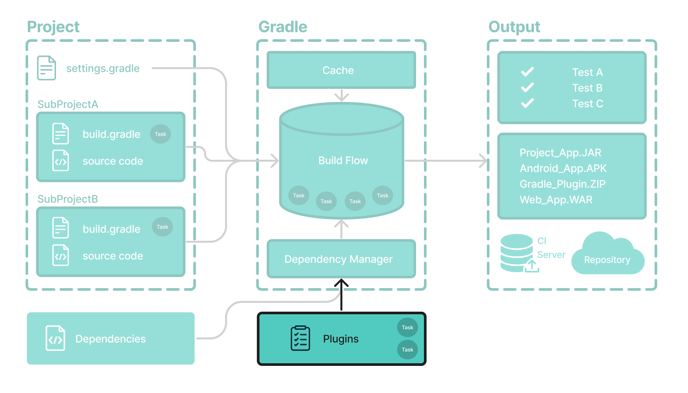

# 插件基础知识

插件用于**扩展构建功能和自定义 Gradle**。



大多数功能（例如编译 Java 代码的能力）都是通过*插件*添加的。

使用插件也是组织构建逻辑的主要机制。

插件可以提供有用的任务，例如运行代码、创建文档、设置源文件、发布档案等。

**将插件应用**到项目允许插件扩展项目和 Gradle 的功能。

例如：

- Spring Boot Gradle 插件`org.springframework.boot`提供 Spring Boot 支持。
- Google Services Gradle 插件`com.google.gms:google-services`可以在您的 Android 应用程序中启用 Google API 和 Firebase 服务。
- Gradle Shadow Plugin`com.github.johnrengelman.shadow`是一个生成 fat/uber JAR 并支持包重定位的插件。

## [插件分发](https://docs.gradle.org/8.5/userguide/plugin_basics.html#plugin_distribution)

插件以三种方式分发：

1. **核心插件**- Gradle 开发并维护一组[核心插件](https://docs.gradle.org/8.5/userguide/plugin_reference.html#plugin_reference)。
2. **社区插件**- Gradle 社区通过[Gradle 插件门户](https://plugins.gradle.org/)共享插件。
3. **本地插件- Gradle 使用户能够使用**[API](https://docs.gradle.org/8.5/javadoc/org/gradle/api/Plugin.html)创建自定义插件。

**您可以使用插件 id**、全局唯一标识符或名称在构建脚本中应用插件：

```
plugins {
    id «plugin id» version «plugin version» [apply «false»]
}
```


## 核心插件

核心 Gradle 插件的独特之处在于它们提供短名称，例如`java`核心[JavaPlugin](https://docs.gradle.org/8.5/javadoc/org/gradle/api/plugins/JavaPlugin.html)。

要将`java`插件应用到项目：

```
plugins {
    id("java")
}
```

Java[插件](https://docs.gradle.org/8.5/userguide/java_plugin.html#java_plugin)将 Java 编译以及测试和捆绑功能添加到项目中。

用户还可以利用更多[Gradle 核心插件。](https://docs.gradle.org/8.5/userguide/plugin_reference.html#plugin_reference)


## 社区插件

Gradle 拥有一个充满活力的插件开发人员社区，他们为各种功能贡献插件，例如[Spring Boot Gradle 插件](https://plugins.gradle.org/plugin/org.springframework.boot)。

要将`org.springframework.boot`插件应用到项目：

```
plugins {
    id("org.springframework.boot") version "3.1.5"
}
```

Spring Boot 插件在 Gradle 中提供 Spring Boot 支持。它打包可执行的 JAR 或 WAR 档案并运行[Spring Boot](https://spring.io/) Java 应用程序。

[Gradle 插件门户](http://plugins.gradle.org/)提供了一个用于搜索和探索社区插件的界面。


## 插件任务

[Jib](https://plugins.gradle.org/plugin/com.google.cloud.tools.jib)是一个 Gradle 插件，用于构建 Java 应用程序的 Docker 和 OCI 镜像。

Google Jib Gradle插件的应用如下：

```
plugins {
  id("com.google.cloud.tools.jib") version "3.4.0"
}
```

由于插件在应用时会将任务添加到您的项目中，因此您可以通过运行以下命令来查看 Jib 插件添加的任务`./gradlew tasks`：

```
$ ./gradlew tasks

> Task :tasks

------------------------------------------------------------
Tasks runnable from root project 'plugins'
------------------------------------------------------------

Jib tasks
---------
jib - Builds a container image to a registry.
jibBuildTar - Builds a container image to a tarball.
jibDockerBuild - Builds a container image to a Docker daemon.
```

正如我们所看到的， Jib 插件中的`jib`、`jibBuildTar`和`jibDockerBuild`任务已添加到项目中并且可以执行。

请参阅[插件开发章节](https://docs.gradle.org/8.5/userguide/custom_plugins.html#custom_plugins)以了解更多信息。