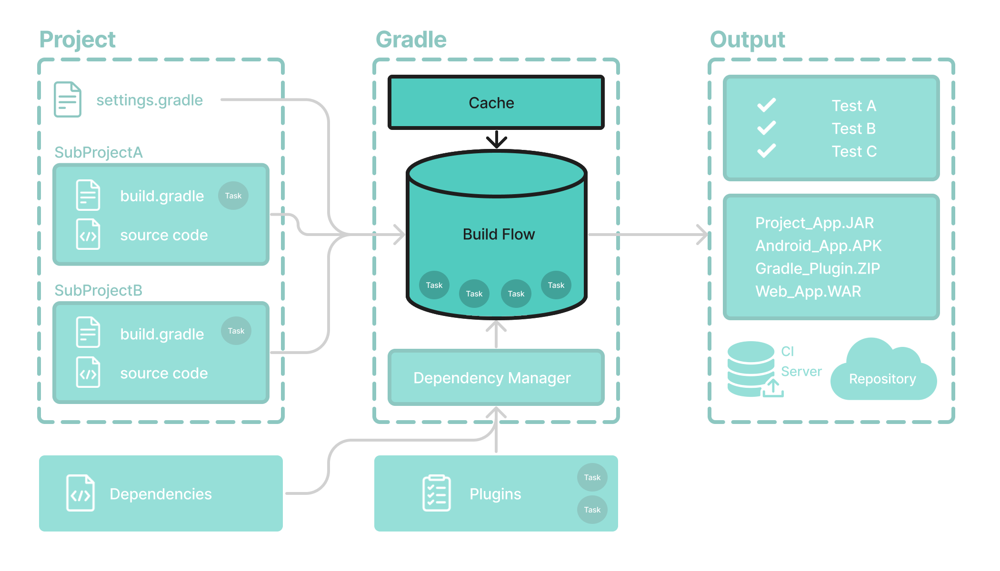

# Gradle 增量构建和构建缓存

Gradle 使用两个主要功能来减少构建时间：**增量构建**和**构建缓存**。



## 增量构建

增量**构建**是一种避免运行自上次构建以来输入未更改的任务的构建。如果这些任务只会重新产生相同的输出，则无需重新执行这些任务。

为了使增量构建发挥作用，任务必须定义其输入和输出。Gradle 将确定输入或输出在构建时是否已更改。如果它们发生了变化，Gradle 将执行任务。否则，它将跳过执行。

增量构建始终处于启用状态，查看它们实际效果的最佳方法是打开*详细模式*。在详细模式下，每个任务状态在构建期间都会被标记：

```
$ ./gradlew compileJava --console=verbose

> Task :buildSrc:generateExternalPluginSpecBuilders UP-TO-DATE
> Task :buildSrc:extractPrecompiledScriptPluginPlugins UP-TO-DATE
> Task :buildSrc:compilePluginsBlocks UP-TO-DATE
> Task :buildSrc:generatePrecompiledScriptPluginAccessors UP-TO-DATE
> Task :buildSrc:generateScriptPluginAdapters UP-TO-DATE
> Task :buildSrc:compileKotlin UP-TO-DATE
> Task :buildSrc:compileJava NO-SOURCE
> Task :buildSrc:compileGroovy NO-SOURCE
> Task :buildSrc:pluginDescriptors UP-TO-DATE
> Task :buildSrc:processResources UP-TO-DATE
> Task :buildSrc:classes UP-TO-DATE
> Task :buildSrc:jar UP-TO-DATE
> Task :list:compileJava UP-TO-DATE
> Task :utilities:compileJava UP-TO-DATE
> Task :app:compileJava UP-TO-DATE

BUILD SUCCESSFUL in 374ms
12 actionable tasks: 12 up-to-date
```

当您运行先前已执行且未更改的任务时，`UP-TO-DATE`任务旁边会打印 then 。

要永久启用详细模式，请添加`org.gradle.console=verbose`到您的`gradle.properties`文件中。


## 构建缓存

增量构建是一种很好的优化，有助于避免已经完成的工作。如果开发人员不断更改单个文件，则可能不需要重建项目中的所有其他文件。

但是，当同一个开发人员切换到上周创建的新分支时会发生什么？即使开发人员正在构建以前构建过的东西，文件也会被重建。

这就是**构建缓存**有用的地方。

构建缓存存储以前的构建结果并在需要时恢复它们。它可以防止执行耗时且昂贵的流程的冗余工作和成本。

当构建缓存已用于重新填充本地目录时，任务将标记为`FROM-CACHE`：

```
$ ./gradlew compileJava --build-cache

> Task :buildSrc:generateExternalPluginSpecBuilders UP-TO-DATE
> Task :buildSrc:extractPrecompiledScriptPluginPlugins UP-TO-DATE
> Task :buildSrc:compilePluginsBlocks UP-TO-DATE
> Task :buildSrc:generatePrecompiledScriptPluginAccessors UP-TO-DATE
> Task :buildSrc:generateScriptPluginAdapters UP-TO-DATE
> Task :buildSrc:compileKotlin UP-TO-DATE
> Task :buildSrc:compileJava NO-SOURCE
> Task :buildSrc:compileGroovy NO-SOURCE
> Task :buildSrc:pluginDescriptors UP-TO-DATE
> Task :buildSrc:processResources UP-TO-DATE
> Task :buildSrc:classes UP-TO-DATE
> Task :buildSrc:jar UP-TO-DATE
> Task :list:compileJava FROM-CACHE
> Task :utilities:compileJava FROM-CACHE
> Task :app:compileJava FROM-CACHE

BUILD SUCCESSFUL in 364ms
12 actionable tasks: 3 from cache, 9 up-to-date
```

重新填充本地目录后，下一次执行会将任务标记为`UP-TO-DATE`而不是`FROM-CACHE`。

构建缓存允许您跨团队共享和重用未更改的构建和测试输出。这加快了本地和 CI 构建的速度，因为不会浪费周期来重新构建不受新代码更改影响的二进制文件。

请参阅[“构建缓存”一章](https://docs.gradle.org/8.5/userguide/build_cache.html#build_cache)以了解更多信息。