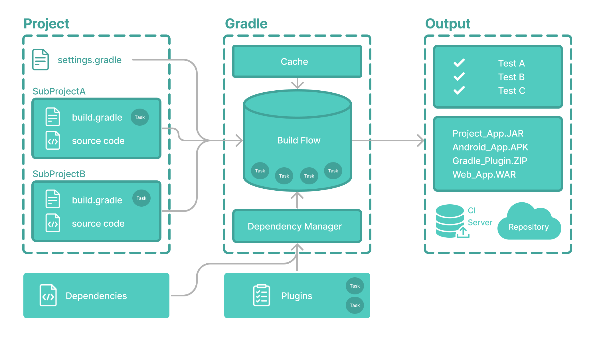
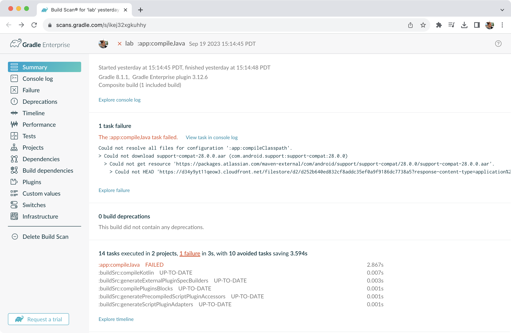
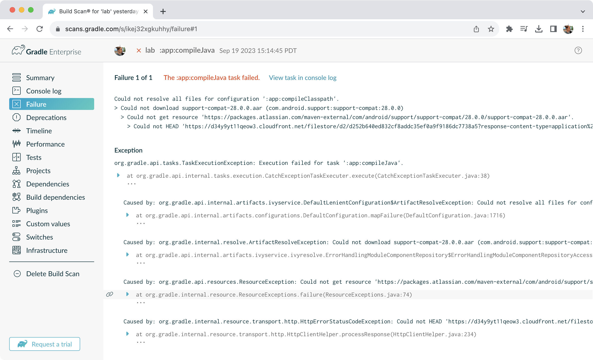

# 构建扫描

构建扫描是运行构建时**捕获的元数据的表示。**




## 构建扫描

Gradle 捕获您的构建元数据并将其发送到[构建扫描服务](https://scans.gradle.com/)。然后，该服务将元数据转换为您可以分析并与其他人共享的信息。



在排除故障、协作或优化构建性能时，扫描收集的信息可能是宝贵的资源。

例如，通过构建扫描，每次您想在 Stack Overflow、Slack 或 Gradle 论坛上提问时，不再需要复制和粘贴错误消息或包含有关环境的所有详细信息。相反，请将链接复制到最新的构建扫描。




## 启用构建扫描

要在 gradle 命令上启用构建扫描，请添加`--scan`到命令行选项：

```
 ./gradlew build --scans
```

系统可能会提示您同意使用构建扫描的条款。

请访问[构建扫描页面](https://scans.gradle.com/)以了解更多信息。