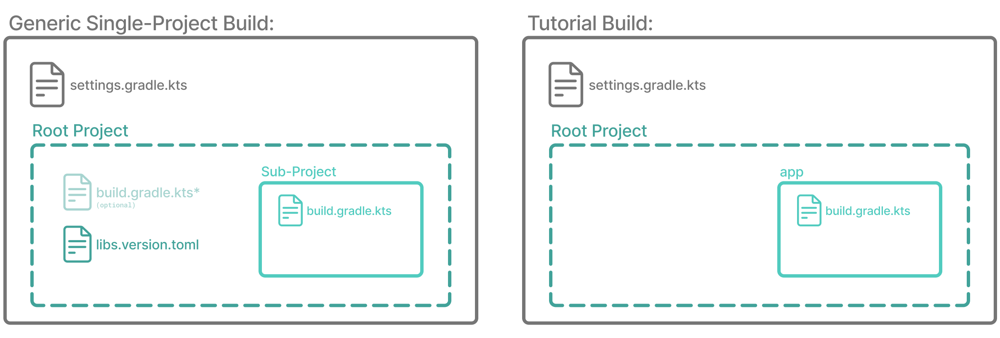
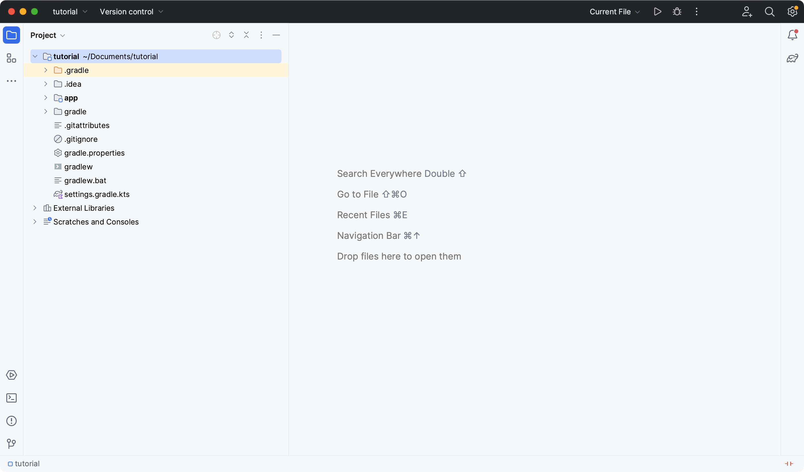
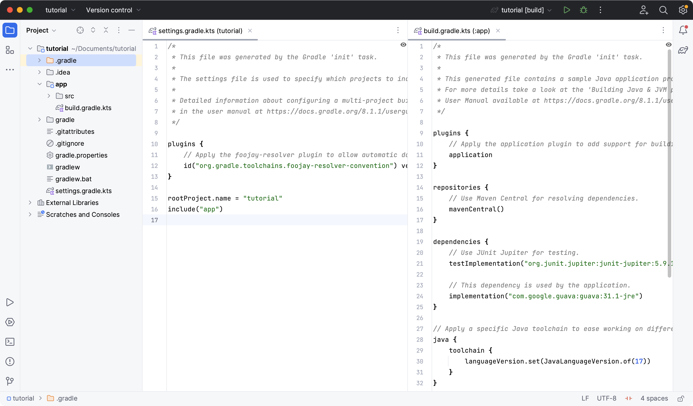

# 第 1 部分：初始化项目

通过使用 Gradle init 创建 Java 应用程序来了解 Gradle 的基础知识。

**在本节中，您将：**

- 初始化一个新的Gradle项目
- 构建项目
- 回顾 Gradle 的项目结构
- 在 IntelliJ IDEA 中打开项目
- 探索 Gradle 文件和构建脚本
- 了解 Gradle 包装器


## 步骤 0. 开始之前

1. 确保您已[安装 Gradle](https://docs.gradle.org/8.5/userguide/installation.html#installation)。
2. 安装[IntelliJ IDEA](https://www.jetbrains.com/idea/download/)。社区版是 IntelliJ IDEA 的免费版本。


## 步骤 1. 初始化项目

要测试 Gradle 安装，请从命令行运行 Gradle：

```
$ gradle

Welcome to Gradle 8.2.

Directory '/' does not contain a Gradle build.

To create a new build in this directory, run gradle init
```

如果没有安装Gradle，请参考[安装部分](https://docs.gradle.org/8.5/userguide/installation.html#installation)。

`tutorial`创建一个名为并进入其中的新目录`cd`：

```
$ mkdir tutorial
```

```
$ cd tutorial
```

运行`gradle init`并根据提示继续，如下所示：

```
$ gradle init

Select type of project to generate:
  1: basic
  2: application
  3: library
  4: Gradle plugin
Enter selection (default: basic) [1..4] 2

Select implementation language:
  1: C++
  2: Groovy
  3: Java
  4: Kotlin
  5: Scala
  6: Swift
Enter selection (default: Java) [1..6] 3

Generate multiple subprojects for application? (default: no) [yes, no] no
Select build script DSL:
  1: Kotlin
  2: Groovy
Enter selection (default: Kotlin) [1..2] 1

Select test framework:
  1: JUnit 4
  2: TestNG
  3: Spock
  4: JUnit Jupiter
Enter selection (default: JUnit Jupiter) [1..4] 4

Project name (default: tutorial): tutorial
Source package (default: tutorial): com.gradle.tutorial
Enter target version of Java (min. 7) (default: 17): 17
Generate build using new APIs and behavior (some features may change in the next minor release)? (default: no) [yes, no] no
```

在本教程中，Kotlin DSL 用于构建一个简单的 Java 项目（因为它是从 Gradle 8.2 开始的默认 DSL）。所有示例均基于 macOS。

完成后，目录应如下所示：

```
├── .gradle             		//Gradle 生成的项目特定的缓存目录。
│   └── ⋮
├── gradle              		//包含Gradle Wrapper的 JAR 文件和配置。
│   └── wrapper
├── gradlew             		//用于使用Gradle Wrapper执行构建的 macOS 和 Linux 脚本。
├── gradlew.bat         		//用于使用Gradle Wrapper执行构建的 Windows 脚本。
├── settings.gradle.kts 		//定义子项目列表的项目设置文件。
├── app                 		//Java 应用程序的源代码和构建配置。
│   ├── build.gradle.kts
│   └── src
└── ⋮                   		//可能存在一些其他 Git 文件，例如.gitignore.
```


## 第 2 步：了解 Gradle 包装器

Gradle Wrapper 是启动 Gradle 构建的首选方式。Wrapper 下载（如果需要），然后调用构建中声明的特定版本的 Gradle。

在新创建的项目中，首先查看 Gradle Wrapper 使用的文件。它由适用于 macOS 和 Linux 的 shell 脚本组成以及 Windows 的批处理脚本。

这些脚本允许您运行 Gradle 构建，而无需在系统上安装 Gradle。它还有助于确保不同开发人员以及本地机器和 CI 机器之间的构建使用相同版本的 Gradle。

从现在开始，你将不再直接调用Gradle；相反，您将使用 Gradle*包装器*。


## 步骤 3. 调用 Gradle 包装器

通过输入以下命令来使用包装器：

```
$ ./gradlew build
```

在 Windows 中，命令是：

```
$ .\gradlew.bat build
```

第一次运行包装器时，它会下载并缓存 Gradle 二进制文件（如果您的计算机上尚未安装）。

Gradle Wrapper 旨在致力于源代码控制，以便任何人都可以构建项目，而无需首先安装和配置特定版本的 Gradle。

在本例中，我们通过包装器调用 Gradle 来构建我们的项目，因此我们可以看到该`app`目录现在包含一个新`build`文件夹：

```
$ cd app
```

```
$ ls -al
```

```
drwxr-xr-x  10 gradle-user  staff  320 May 24 18:07 build
-rw-r--r--   1 gradle-user  staff  862 May 24 17:45 build.gradle.kts
drwxr-xr-x   4 gradle-user  staff  128 May 24 17:45 src
```

`build`除非另有指定，否则构建过程生成的所有文件都会进入该目录。


## 步骤 4.了解 Gradle 的项目结构

让我们看一下标准的 Gradle 项目结构，并将其与我们的教程项目进行比较：



构建**包含**：

1. 顶级`settings.gradle.kts`文件。
2. 一个**根项目**。
3. 一个或多个**子项目**，每个子项目都有自己的`build.gradle.kts`文件。

某些构建可能`build.gradle.kts`在根项目中包含文件，但不建议这样做。

该`libs.version.toml`文件是用于依赖关系管理的版本目录，您将在本教程的后续部分中了解它。

在本教程中：

1. **根项目**称为**tutorial**`rootProject.name = "tutorial"`并在文件中定义`settings.gradle`。
2. **子项目**称为**app**`include("app")` ，并在文件中定义`settings.gradle`。

根项目可以位于顶级目录中，也可以有自己的目录。

构建：

- 表示您可以一起构建、测试和/或发布的一组相关软件。
- 可以选择包含其他构建（即附加软件，如库、插件、构建时工具等）。

项目：

- 代表架构的单个部分 - 库、应用程序、Gradle 插件等。
- 可以选择包含其他项目。


## 步骤 5. 在 IDE 中查看 Gradle 文件

双击目录`settings.gradle.kts`中的文件，在 IntelliJ IDEA 中打开项目`tutorial`：



在IDE中打开`settings.gradle.kts`和文件：`build.gradle.kts`




## 步骤 6. 了解设置文件

一个项目由一个或多个子项目（有时称为模块）组成。

Gradle 读取该`settings.gradle.kts`文件以找出哪些子项目构成项目构建。

查看项目中的文件：

```
plugins {
    // Apply the foojay-resolver plugin to allow automatic download of JDKs
    id("org.gradle.toolchains.foojay-resolver-convention") version "0.7.0"
}

rootProject.name = "tutorial"
include("app")
```

根`tutorial`项目包括`app`子项目。调用的存在`include`会将`app`目录变成子项目。


## 步骤 7. 了解构建脚本

每个子项目都包含自己的`build.gradle.kts`文件。

该`build.gradle.kts`文件是构建过程的核心组件，定义了构建项目所需的任务。

该`build.gradle.kts`文件由 Gradle 读取并执行。

仔细看看`app`子项目中的构建文件（`app`目录下）：

```
plugins {
    // Apply the application plugin to add support for building a CLI application in Java.
    application
}

repositories {
    // Use Maven Central for resolving dependencies.
    mavenCentral()
}

dependencies {
    // Use JUnit Jupiter for testing.
    testImplementation("org.junit.jupiter:junit-jupiter:5.9.1")

    // This dependency is used by the application.
    implementation("com.google.guava:guava:32.1.2-jre")
}

// Apply a specific Java toolchain to ease working on different environments.
java {
    toolchain {
        languageVersion.set(JavaLanguageVersion.of(17))
    }
}

application {
    // Define the main class for the application.
    mainClass.set("com.gradle.tutorial.App")
}

tasks.named<Test>("test") {
    // Use JUnit Platform for unit tests.
    useJUnitPlatform()
}
```

这个构建脚本让 Gradle 知道子项目`app`正在使用哪些依赖项和插件以及在哪里可以找到它们。我们将在以下部分中更详细地讨论这一点。