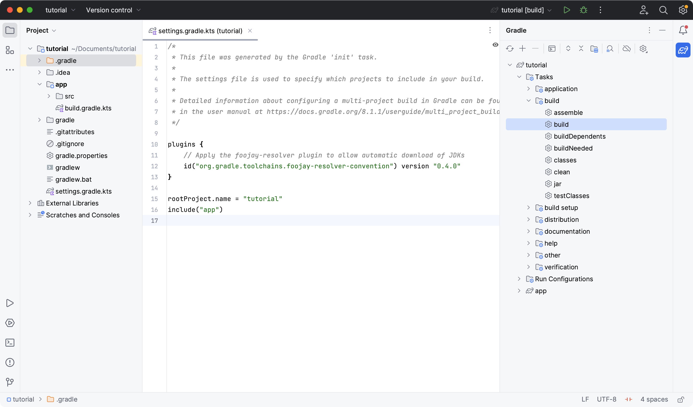
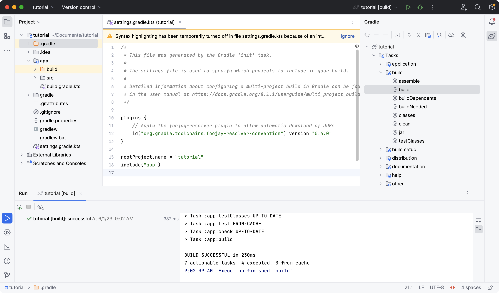

# 第 2 部分：运行 Gradle 任务

通过运行一个任务并查看其输出来了解 Gradle 任务的基础知识。

**在本节中，您将：**

- 查看可用任务
- 运行任务并检查结果
- 了解任务
- 探索任务依赖关系


## 步骤 0. 开始之前

1. [您在第 1 部分](https://docs.gradle.org/8.5/userguide/part1_gradle_init.html#part1_begin)中初始化了 Java 应用程序。


## 步骤 1. 查看可用任务

任务是一个基本工作单元，可以由 Gradle 作为构建的一部分来完成*。*

在该`tutorial`目录中，输入以下命令列出项目中所有可用的任务：

```
$ ./gradlew tasks
```

该列表包括`application`插件及其应用的插件贡献的任务：

```
Application tasks
-----------------
run - Runs this project as a JVM application

Build tasks
-----------
assemble - Assembles the outputs of this project.
build - Assembles and tests this project.

...

Documentation tasks
-------------------
javadoc - Generates Javadoc API documentation for the main source code.

...

Other tasks
-----------
compileJava - Compiles main Java source.

...
```

任务可能负责编译、复制和移动文件、创建 JAR 文件、生成 Javadoc、将工件发布到存储库或许多其他离散的工作单元。

`app`您还可以通过运行列出仅在子项目中可用的任务。

```
./gradlew :app:tasks
```

您可以使用以下选项在任务列表中获取更多信息`--all`：。

```
./gradlew tasks --all
```

在本教程的[第 1 部分](https://docs.gradle.org/8.5/userguide/part1_gradle_init.html#part1_begin)`build`中，我们使用命令运行任务。

```
./gradlew build
```


## 第 2 步：了解任务

我们列出了项目初始化时可用的任务，但是如果我们想创建自己的任务怎么办？

Gradle 提供了许多*内置*任务，开发人员可以使用它们来增强构建脚本。

此示例任务使用内置任务将`*.war`文件从`source`目录复制到目录。`target``Copy`

```
tasks.register<Copy>("copyTask") {
    from("source")
    into("target")
    include("*.war")
}
```

如果将该任务添加到子项目目录`build.gradle.kts`中的文件中`app`，则将使用命令 执行该任务`./gradlew :app:copyTask`。

流行的内置任务包括：

- **复制**-`Copy`对于复制文件很有用。
- **删除**-`Delete`对于删除文件和目录很有用。
- **Exec** -`Exec`对于执行任意操作系统命令很有用。
- **Zip** -`Zip`对于捆绑文件很有用。

[DSL 文档](https://docs.gradle.org/8.5/kotlin-dsl/gradle/org.gradle.api.tasks/-delete/index.html)中还包含更多内容。

示例:

```kotlin
tasks.register<Copy>("copyTask") {
    from("source")
    into("target")
    include("*.*")
}

tasks.register<Delete>("makePretty") {
    delete("target", "build")
    isFollowSymlinks = true
}

tasks.register<Exec>("execWin") {
    // commandLine("cmd", "/c", "gradle", ":app:copyTask") // 通过cmd调用 gradle或者其他命令
    // commandLine("cmd", "/c", "dir")					   // 通过cmd执行windows指令
    commandLine("pwsh", "/c", "ls")						   // 通过powershell执行指令
}
```


## 步骤 3. 了解任务之间的依赖关系

很多时候，一个任务需要先运行另一个任务。如果任务 B 使用任务 A 的输出，则任务 A 必须在任务 B 开始之前完成。

- 任务可以显式声明其依赖关系。
- 一个任务可能隐式地依赖于其他任务。

以下是显式任务依赖性的示例：

```
tasks.register("hello") {
    doLast {
        println('Hello!')
    }
}

tasks.register("greet") {
    doLast {
        println('How are you?')
    }
    dependsOn("hello")
}
```

在这种情况下，`hello`在 之前打印`greet`。输出是`Hello! How are you?`.

任务执行顺序由 Gradle 自动确定，同时考虑显式和隐式任务依赖性。如果任务之间不存在依赖关系，Gradle 允许用户请求特定的执行顺序。


## 步骤 4. 在 IDE 中查看任务

IntelliJ 中也提供了项目任务。该项目应该在教程的[第 1 部分之后打开。](https://docs.gradle.org/8.5/userguide/part1_gradle_init.html#part1_begin)

在窗口的右侧，打开窗格`Gradle`：




## 步骤 5. 在 IDE 中运行任务

您可以通过双击窗格中的任务来通过 IntelliJ 运行 Gradle 任务。

双击 **tutorial > app > build > build**



构建完成后，确保在 IntelliJ 控制台中成功：

```
BUILD SUCCESSFUL in 966ms
7 actionable tasks: 7 executed
3:18:24 AM: Execution finished 'build'.
```


## 步骤 6. 在终端中运行任务

在终端中运行以下命令：

```
$ ./gradlew build
```

```
> Task :app:compileJava
> Task :app:processResources
> Task :app:classes
> Task :app:jar
> Task :app:startScripts
> Task :app:distTar
> Task :app:distZip
> Task :app:assemble
> Task :app:compileTestJava
> Task :app:processTestResources
> Task :app:testClasses
> Task :app:test
> Task :app:check
> Task :app:build
```

该`build`任务使用源代码及其依赖项来构建应用程序。从输出中可以看出，该`build`任务编译、汇编、测试和检查代码。

任务按执行顺序打印。任务`jar`是`build`任务的依赖项。

该`jar`任务创建应用程序的可执行 JAR 文件。让我们单独运行它：

```
$ ./gradlew jar
```

```
> Task :app:compileJava
> Task :app:processResources
> Task :app:classes
> Task :app:jar
```

正如预期的那样，该`compileJava`任务是该任务的依赖项`jar`并且首先执行。任务完成后，`app.jar`将在您的文件夹中创建一个文件`tutorial/app/build/libs/`。

调用`run`任务并检查输出：

```
$ ./gradlew run
```

```
> Task :app:compileJava
> Task :app:processResources
> Task :app:classes

> Task :app:run
Hello World!

BUILD SUCCESSFUL in 325ms
```

该`run`任务执行 中的代码`tutorial/app/src/main/java/com.gradle.tutorial/App.java`。Java 代码`App.java`只是将“Hello World”打印到屏幕上：

```
public class App {
    public String getGreeting() {
        return "Hello World!";
    }
    public static void main(String[] args) {
        System.out.println(new App().getGreeting());
    }
}
```