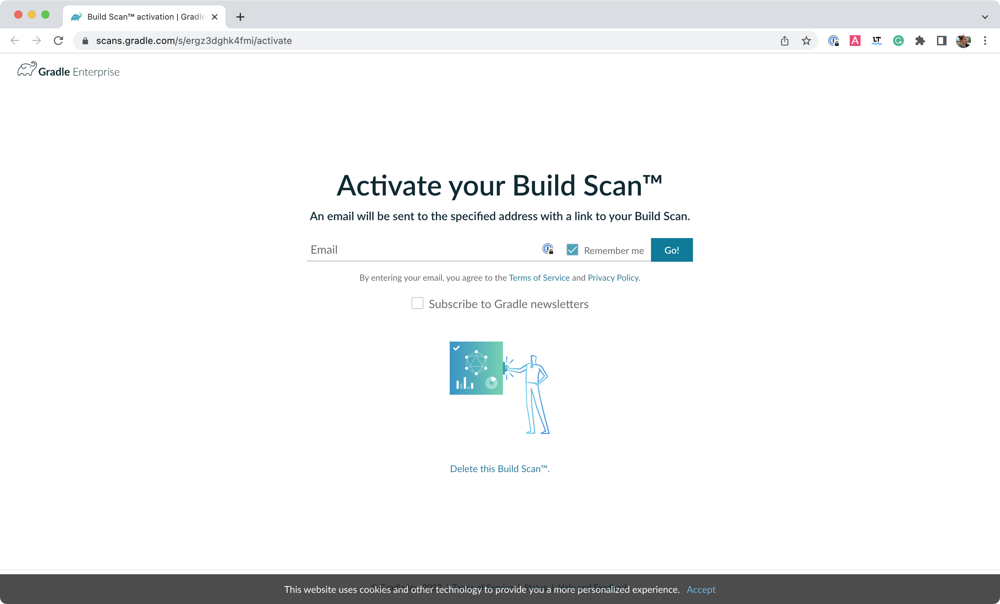
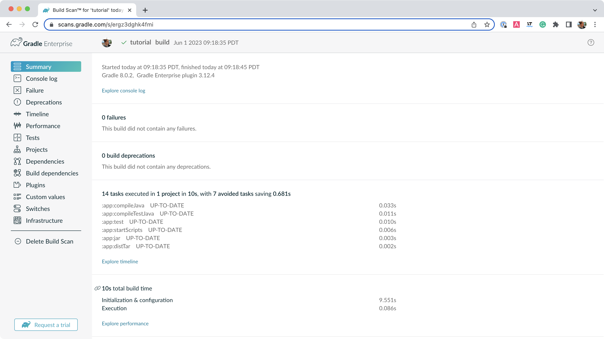
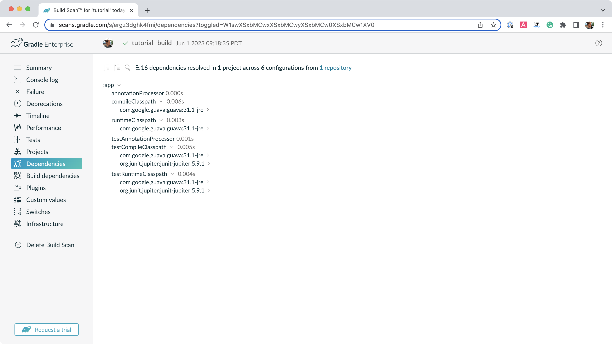
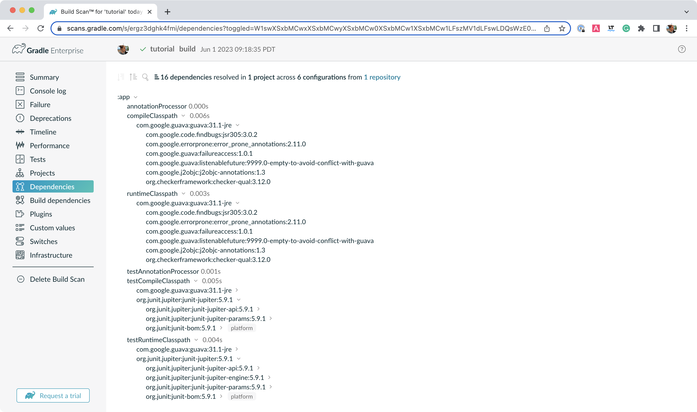
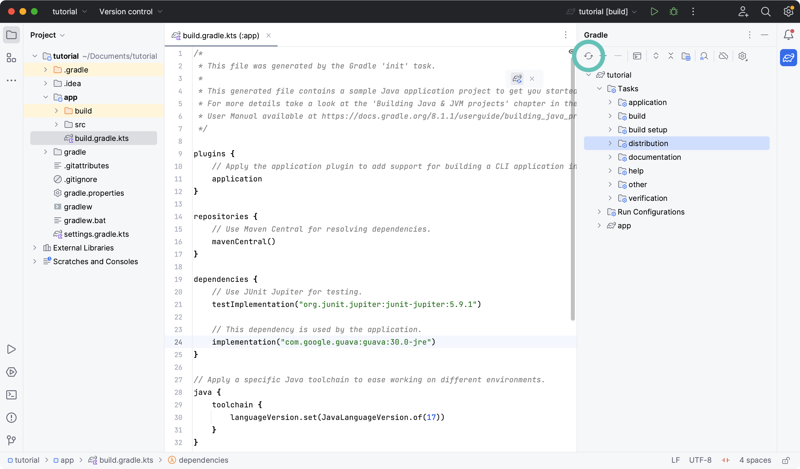
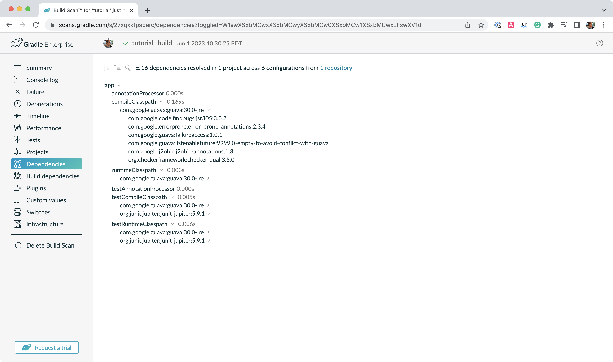

# 第 3 部分：依赖管理

了解项目依赖项和 Gradle 依赖项管理的基础知识。

**在本节中，您将：**

- 了解项目依赖关系
- 检查项目依赖关系
- 使用构建扫描来分析依赖关系
- 更新项目依赖项
- 了解传递依赖
- 添加版本目录


## 步骤 0. 开始之前

1. [您在第 1 部分](https://docs.gradle.org/8.5/userguide/part1_gradle_init.html#part1_begin)中初始化了 Java 应用程序。
2. [您在第 2 部分](https://docs.gradle.org/8.5/userguide/part2_gradle_tasks.html#part2_begin)中运行了多项任务。


## 步骤 1.了解项目依赖性

Gradle 为依赖管理和自动化提供了出色的支持。

让我们再看看我们的构建脚本（文件`gradle.build.kts`），特别是以下部分：

```
repositories {
    // Use Maven Central for resolving dependencies.
    mavenCentral()
}

dependencies {
    // Use JUnit Jupiter for testing.
    testImplementation("org.junit.jupiter:junit-jupiter:5.9.1")

    // This dependency is used by the application.
    implementation("com.google.guava:guava:32.1.2-jre")
}
```

Gradle 依赖管理中的一些关键概念包括：

**存储库**- 依赖项的来源 →`mavenCentral()`

[Maven Central是由 Maven 社区提供并由](https://mvnrepository.com/repos/central)[Sonatype](https://central.sonatype.org/)支持的 jar 文件、插件和库的集合。它是 Java 事实上的公共工件存储，并被许多构建系统使用。

**依赖关系**- 通过配置类型声明的依赖关系 →[`junit`](https://mvnrepository.com/artifact/org.junit.jupiter/junit-jupiter-api)和[`guava`](https://mvnrepository.com/artifact/com.google.guava/guava)

Gradle 需要特定信息来查找依赖项。让我们看看`com.google.guava:guava:32.1.2-jre`和`org.junit.jupiter:junit-jupiter-api:5.9.1`；它们细分如下：

|      | 描述           | **com.google.guava:guava:32.1.2-jre** | org.junit.jupiter:junit-jupiter-api:5.9.1 |
| :--- | :------------- | :------------------------------------ | :---------------------------------------- |
| 团体 | 组织的标识符   | `com.google.guava`                    | `org.junit.jupiter`                       |
| 姓名 | 依赖标识符     | `guava`                               | `junit-jupiter-api`                       |
| 版本 | 要导入的版本号 | `32.1.2-jre`                          | `5.9.1`                                   |


## 步骤 2. 理解传递依赖

**传递依赖**是依赖的依赖。

为了使我们的`guava`依赖项正常工作，它需要一个名为 的库`failureaccess`。因此`failureaccess`是项目的传递依赖。


## 步骤 3. 查看项目依赖关系

您可以使用以下命令在终端中查看依赖关系树`./gradlew :app:dependencies`：

```
$ ./gradlew :app:dependencies

> Task :app:dependencies

------------------------------------------------------------
Project ':app'
------------------------------------------------------------

...

compileClasspath - Compile classpath for source set 'main'.
\--- com.google.guava:guava:32.1.2-jre
     +--- com.google.guava:failureaccess:1.0.1
     +--- com.google.guava:listenablefuture:9999.0-empty-to-avoid-conflict-with-guava
     +--- com.google.code.findbugs:jsr305:3.0.2
     +--- org.checkerframework:checker-qual:3.12.0
     +--- com.google.errorprone:error_prone_annotations:2.11.0
     \--- com.google.j2objc:j2objc-annotations:1.3

...
```

输出清楚地描述了`com.google.guava:guava:32.1.2-jre`对 的依赖`com.google.guava:failureaccess:1.0.1`。


## 步骤 4. 在 Build Scan® 中查看依赖关系

[要使用Build Scan](https://scans.gradle.com/)查看依赖关系，请使用可选标志运行构建任务`--scan`。

在该`tutorial`目录中，输入以下命令并按照提示接受条款：

```
$ ./gradlew build --scan

BUILD SUCCESSFUL in 423ms
7 actionable tasks: 7 up-to-date

Publishing a build scan to scans.gradle.com requires accepting the Gradle Terms of Service defined at https://gradle.com/terms-of-service. Do you accept these terms? [yes, no] yes

Gradle Terms of Service accepted.

Publishing build scan...
https://gradle.com/s/link
```

[构建扫描](https://scans.gradle.com/)是构建的可共享且集中的记录，可作为 Gradle 的免费服务提供。

单击提示中提供的链接：`https://gradle.com/s/link`。

您必须接受服务条款才能使用构建扫描。

您需要使用您的电子邮件激活构建扫描：



您将在收件箱中收到扫描的最终链接，如下所示：



打开菜单中的**“依赖关系”**`compileClasspath`选项卡并展开、`runtimeClasspath`、`testCompileClasspath`和`testRuntimeClasspath`：



正如预期的那样，我们可以看到声明的依赖项`junit`和`guava`，并被Gradle 用于编译、运行和测试应用程序。

在窗口中展开`com.google.guava:guava:32.1.2-jre`并`org.junit.jupiter:junit-jupiter:5.9.1`：



`junit`和下有几个传递依赖关系`guava`。例如，`com.google.code.findbugs:jsr305:3.0.2`传递依赖就来自于`com.google.guava:guava:32.1.2-jre`依赖。


## 步骤 5. 更新项目依赖项

添加和更改依赖项是在构建文件中完成的。

让我们更改`guava`版本并看看这如何影响依赖关系树。

`guava`将文件的依赖关系更改`gradle.build.kts`为：

```
implementation("com.google.guava:guava:30.0-jre")
```

如果您使用 IntelliJ 更改文件，请不要忘记单击`sync`Gradle 按钮：



运行`./gradlew build --scan`并查看构建扫描结果：



在终端中运行`./gradlew :app:dependencies`来检查依赖树中的变化：

```
compileClasspath - Compile classpath for source set 'main'.
\--- com.google.guava:guava:30.0-jre
     +--- com.google.guava:failureaccess:1.0.1
     +--- com.google.guava:listenablefuture:9999.0-empty-to-avoid-conflict-with-guava
     +--- com.google.code.findbugs:jsr305:3.0.2
     +--- org.checkerframework:checker-qual:3.5.0
     +--- com.google.errorprone:error_prone_annotations:2.3.4
     \--- com.google.j2objc:j2objc-annotations:1.3

...
```

很明显，`guava`依赖项已更新到版本`30.0`，传递依赖项也已更改。


## 步骤 6. 添加版本目录

版本目录用于在中央位置声明项目的所有直接依赖项。

它是在子项目构建文件中创建`gradle/libs.versions.toml`并引用的。

`libs.versions.toml`首先，在目录中创建文件`gradle`。

然后，将以下行添加到这个新文件中：

```
[versions]
junitVer = "5.9.1"
guavaVer = "32.1.2-jre"

[libraries]
junit = { module = "org.junit.jupiter:junit-jupiter", version.ref = "junitVer" }
guava = { module = "com.google.guava:guava", version.ref = "guavaVer" }
```

在您的`app/build.gradle.kts`文件中，相应地更新依赖项块：

```
dependencies {
    testImplementation(libs.junit)
    implementation(libs.guava)
}
```

运行`./gradlew build`以确保更改生效。

最后，确保`run`在终端或 IDE 中使用该任务一切正常：

```
./gradlew run

> Task :app:compileJava UP-TO-DATE
> Task :app:processResources NO-SOURCE
> Task :app:classes UP-TO-DATE

> Task :app:run
Hello World!
```

与直接在构建脚本中声明依赖项相比，版本目录具有许多优点：

- Gradle 从目录生成类型安全的访问器，以便您可以在 IDE 中使用自动完成功能轻松添加依赖项。
- 它是声明依赖项版本的中心位置，以便任何更改都适用于每个子项目。