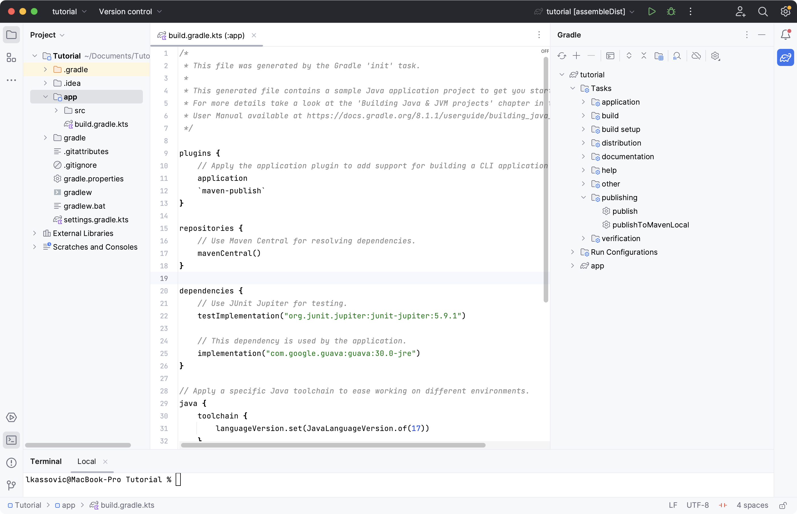
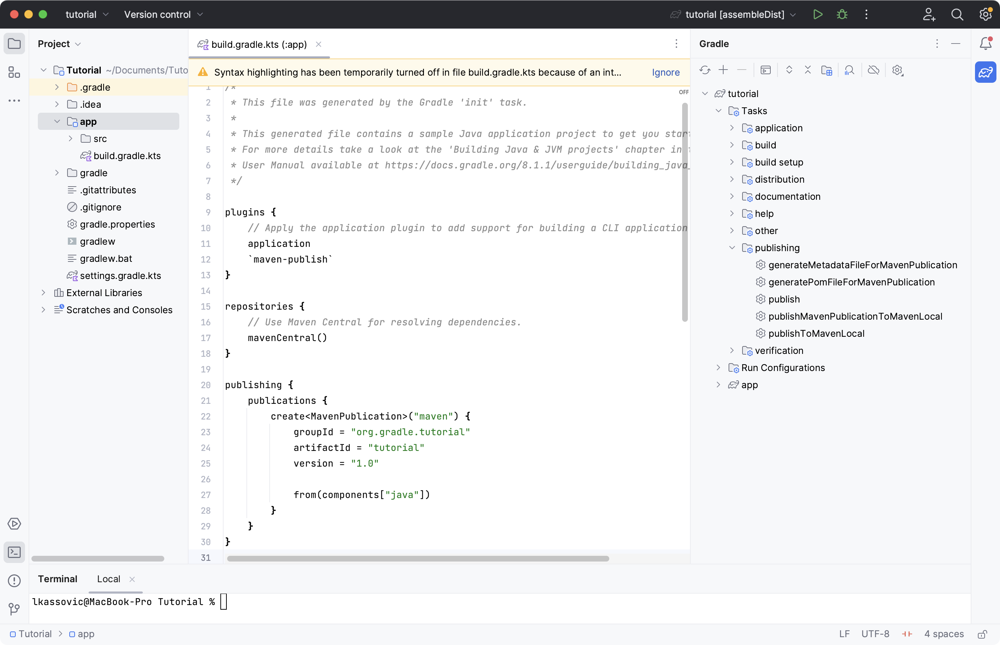
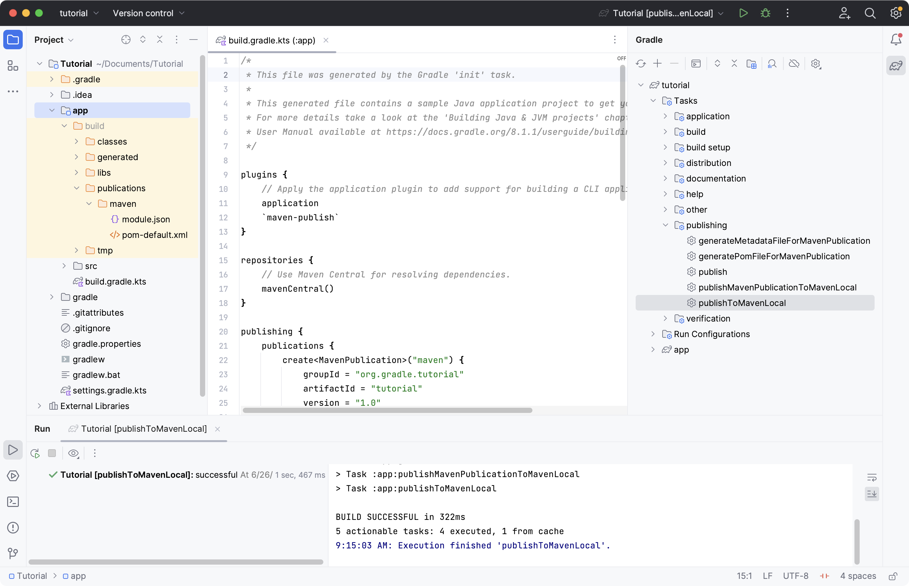

# 第 4 部分：应用 Gradle 插件

了解插件如何扩展 Gradle 的功能并使用流行的插件。

**在本节中，您将：**

- 应用插件
- 配置插件
- 使用插件
- 探索其他插件

## 步骤 0. 开始之前

1. [您在第 1 部分](https://docs.gradle.org/8.5/userguide/part1_gradle_init.html#part1_begin)中初始化了 Java 应用程序。
2. [您在第 2 部分](https://docs.gradle.org/8.5/userguide/part2_gradle_tasks.html#part2_begin)中运行了多项任务。
3. [您在第 3 部分](https://docs.gradle.org/8.5/userguide/part3_gradle_dep_man.html#part3_begin)中了解了依赖管理。


## 步骤 1. 了解插件

插件是在项目中组织构建逻辑和重用构建逻辑的主要方法。

插件还用于将自定义任务作为打包代码进行分发。

将插件应用到项目会执行可以创建任务、配置属性以及以其他方式扩展项目功能的代码。通常，插件使用 Gradle API 来提供附加功能并扩展 Gradle 的核心功能。

插件可以：

- 将任务添加到项目中（例如编译、测试）。
- 扩展基本的 Gradle 模型（例如添加可配置的新 DSL 元素）。
- 根据约定配置项目（例如添加新任务或配置合理的默认值）。
- 应用特定配置（例如添加组织存储库或强制执行标准）。
- 通过扩展向现有类型添加新的属性和方法。


## 步骤 2. 应用插件

我们的项目目前应用一个插件，即与 Gradle 捆绑在一起的[应用程序插件：](https://docs.gradle.org/8.5/userguide/application_plugin.html#application_plugin)

```
plugins {
    // Apply the application plugin to add support for building a CLI application in Java.
    application
}
```

让我们在我们的项目中应用一个由 Gradle 维护和分发的插件，称为[Maven Publish Plugin](https://docs.gradle.org/8.5/userguide/publishing_maven.html#publishing_maven)。Maven 发布插件提供了将构建工件发布到[Apache Maven](https://maven.apache.org/) 存储库的功能。它还可以发布到 Maven local，这是位于您计算机上的存储库。

Maven 本地存储库的默认位置可能有所不同，但通常是：

- **Mac** : /Users/\[用户名]/.m2
- **Linux**：/home/\[用户名]/.m2
- **Windows**：C:\Users\[用户名]\.m2

发往 Maven 存储库的出版物通常包括：

- 一件或多件工件
- Gradle 模块元数据
- Maven POM 文件

`maven-publish`通过添加到插件块来应用插件`build.gradle.kts`：

```
plugins {
    // Apply the application plugin to add support for building a CLI application in Java.
    application
    `maven-publish`
}
```

如果您使用 IntelliJ IDEA，请不要忘记同步 Gradle。

让我们通过查看可用的新任务来确保插件已被应用。

`./gradlew :app:tasks`在命令行中运行：

```
$ ./gradlew :app:tasks

> Task :app:tasks

------------------------------------------------------------
Tasks runnable from project ':app'
------------------------------------------------------------

...

Publishing tasks
----------------
publish - Publishes all publications produced by this project.
publishToMavenLocal - Publishes all Maven publications produced by this project to the local Maven cache.
```

现在可以使用一组新的发布任务，称为`publish`、 和`publishToMavenLocal`。

同样，来自 Maven Publish 插件的新任务现在可以在IntelliJ 中的 Gradle 右侧窗格中使用。




## 步骤 3. 配置插件

将发布信息添加到您的`build.gradle.kts`文件中：

```
publishing {
    publications {
        create<MavenPublication>("maven") {
            groupId = "com.gradle.tutorial"
            artifactId = "tutorial"
            version = "1.0"

            from(components["java"])
        }
    }
}
```

再次在命令行中运行`./gradlew :app:tasks`，既然我们已经为插件提供了有关我们应用程序的附加信息，您将看到附加任务：

```
$ ./gradlew :app:tasks

> Task :app:tasks

------------------------------------------------------------
Tasks runnable from project ':app'
------------------------------------------------------------

...

Publishing tasks
----------------
generateMetadataFileForMavenPublication - Generates the Gradle metadata file for publication 'maven'.
generatePomFileForMavenPublication - Generates the Maven POM file for publication 'maven'.
publish - Publishes all publications produced by this project.
publishMavenPublicationToMavenLocal - Publishes Maven publication 'maven' to the local Maven repository.
publishToMavenLocal - Publishes all Maven publications produced by this project to the local Maven cache.
```




## 步骤 4. 使用插件

要使用该插件，请`publishToMavenLocal`通过运行 来运行任务。

```shell
./gradlew :app:publishToMavenLocal
```

```
$ ./gradlew :app:publishToMavenLocal

> Task :app:compileJava FROM-CACHE
> Task :app:processResources NO-SOURCE
> Task :app:classes UP-TO-DATE
> Task :app:jar
> Task :app:generateMetadataFileForMavenPublication
> Task :app:generatePomFileForMavenPublication
> Task :app:publishMavenPublicationToMavenLocal
> Task :app:publishToMavenLocal
BUILD SUCCESSFUL in 331ms
```

该`publishToMavenLocal`任务构建 POM 文件和要发布的工件。然后它将它们*安装*到本地 Maven 存储库中。

可以查看`build`目录下的POM和GMM文件：



您还可以查看 Maven Local 目录中的文件：`/Users/\[username]/m2/repository/com/gradle/tutorial/tutorial/1.0`.

```
<?xml version="1.0" encoding="UTF-8"?>
<project xsi:schemaLocation="http://maven.apache.org/POM/4.0.0 https://maven.apache.org/xsd/maven-4.0.0.xsd" xmlns="http://maven.apache.org/POM/4.0.0"
    xmlns:xsi="http://www.w3.org/2001/XMLSchema-instance">
  <modelVersion>4.0.0</modelVersion>
  <groupId>com.gradle.tutorial</groupId>
  <artifactId>tutorial</artifactId>
  <version>1.0</version>
  <packaging>pom</packaging>
</project>
```

```
./gradlew -Dmaven.repo.local=D:\develop\maven\repository publishToMavenLocal
```


## 第 5 步：探索插件

插件用于扩展构建功能和自定义 Gradle。

使用插件是**组织构建逻辑的主要机制**。

插件作者可以将他们的插件保密或将其分发给公众。因此，插件以三种方式分发：

1. **核心插件**- Gradle 开发并维护一组[核心插件](https://docs.gradle.org/8.5/userguide/plugin_reference.html#plugin_reference)。
2. **社区插件**- Gradle 社区通过[Gradle 插件门户](https://plugins.gradle.org/)共享插件。
3. **自定义插件- Gradle 使用户能够使用**[API](https://docs.gradle.org/8.5/dsl/org.gradle.api.tasks.javadoc.Javadoc.html)创建自定义插件。

[**约定插件**](https://docs.gradle.org/8.5/samples/sample_convention_plugins.html)是用于在子项目（模块）之间共享构建逻辑的插件。用户可以将通用逻辑包装在约定插件中。例如，用作约定插件的代码覆盖率插件可以调查整个*项目*的代码覆盖率，而*不仅仅是*特定的子项目。

Gradle 强烈建议使用 Convention 插件。

