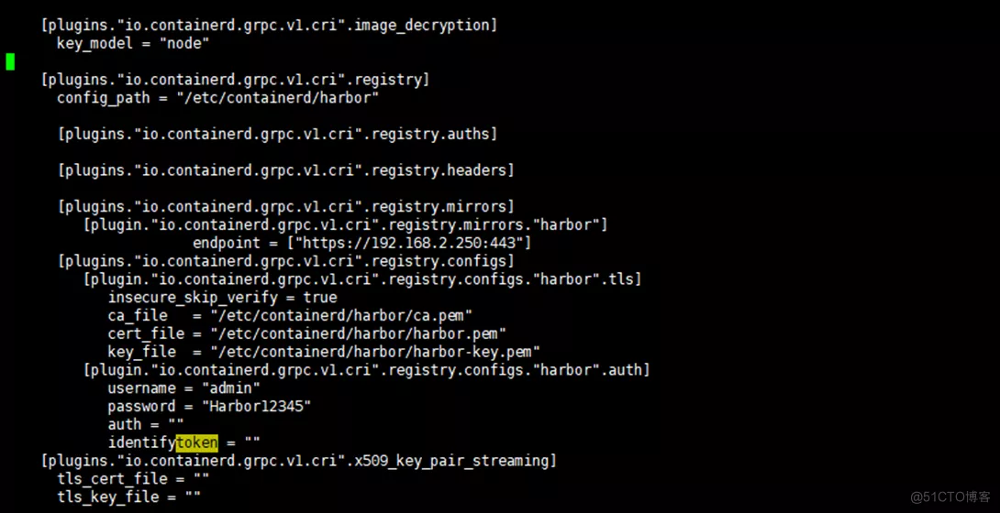
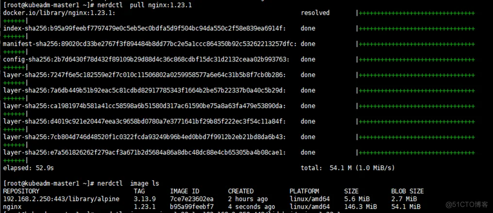

# 「开源摘星计划」Harbor 和Containerd的最佳实栈

 推荐 原创

[键客李大白](https://blog.51cto.com/lidabai)2022-08-30 10:53:59博主文章分类：[Harbor进阶实战（企业实战）](https://blog.51cto.com/lidabai/category1)©著作权

***文章标签\*[云原生](https://blog.51cto.com/topic/faa3699795e2ef4.html)[kubernetes](https://blog.51cto.com/topic/kubernetes.html)[Harbor](https://blog.51cto.com/topic/harbor.html)[Containerd](https://blog.51cto.com/topic/containerd.html)[运维](https://blog.51cto.com/topic/operations-2.html)*****文章分类\*[kubernetes](https://blog.51cto.com/nav/k8s)[云计算](https://blog.51cto.com/nav/cloud)****[私藏项目实操分享](https://blog.51cto.com/subject/2/new)*****阅读数\**\*3895\****

> 本文已参与「开源摘星计划」，欢迎正在阅读的你加入。
> 活动链接：​ ​https://github.com/weopenprojects/WeOpen-Star
> [文章来源]：《Harbor进阶实战》公众号


## 前言

  Kubernetes 计划在即将发布的 1.24 版本里弃用并移除 dockershim。使用 Docker 引擎作为其 Kubernetes 集群的容器运行时的工作流或系统需要在升级到 1.24 版本之前进行迁移。1.23 版本将会保留 dockershim，对该版本的支持则会再延长一年。
  本文基于Containerd为容器运行时的kubernetes集群，分析Containerd与Harbor私有镜像仓库的结合使用，关于Cintainerd为运行时搭建kubernetes集群，你可以阅读这篇文章:[ 《kubeadm部署单master集群（contained运行时）》](https://blog.51cto.com/lidabai/5619376)

## 二进制安装Containerd

#### 2.1 下载二进制包

- ontainerd有3种安装包：
- containerd-xxx,这种包用于单机测试没问题，不包含runC，但需要Runc运行容器，需要提前安装。
- cri-container-xxx,不包含cni，但是运行容器也需要`cni-plugin`
- cri-containerd-cni-xxxx，包含runc和k8s里的所需要的相关文件。k8s集群里需要用到此包。虽然包含runC，但是依赖系统中的seccomp（安全计算模式，是一种限制容器调用系统资源的模式。）

```shell
$ wget https://github.com/containerd/containerd/releases/download/v1.6.5/cri-containerd-1.6.5-linux-amd64.tar.gz
$ tar zxvf cri-containerd-1.6.5-linux-amd64.tar.gz
$ ls  -l
drwxr-xr-x  4 root root        51 4月  26 07:52 etc
drwxr-xr-x  4 root root        35 4月  26 07:51 opt
drwxr-xr-x  3 root root        19 4月  26 07:50 usr
1.2.3.4.5.6.
```

etc目录：主要为containerd服务管理配置文件及cni虚拟网卡配置文件;
opt目录：主要为gce环境中使用containerd配置文件及cni插件；
usr目录：主要为containerd运行时的二进制文件，包含runc；

#### 2.2 拷贝二进制可执行文件到`$PATH`中

```shell
$ ls usr/local/bin/
containerd  containerd-shim  containerd-shim-runc-v1  containerd-shim-runc-v2  containerd-stress  crictl  critest  ctd-decoder  ctr
$ cp usr/local/bin/*  /usr/local/bin/
1.2.3.
```

------

#### 2.3 创建并修改配置文件

Containerd 的默认配置文件为 `/etc/containerd/config.toml`。

##### 1）生成初始配置文件

```shell
$ mkdir -p /etc/containerd/
$ containerd config default > /etc/containerd/config.toml
1.2.
```

##### 2）替换镜像源

  由于国内环境原因我们需要将 sandbox_image 镜像源设置为阿里云`google_containers`镜像源。

```shell
$ sed -i "s#k8s.gcr.io/pause#registry.cn-hangzhou.aliyuncs.com/google_containers/pause#g"  /etc/containerd/config.toml
1.
```

也可以这样修改：

```shell
$ vim /etc/containerd/config.toml
  [plugins."io.containerd.grpc.v1.cri"]
  sandbox_image = "registry.cn-hangzhou.aliyuncs.com/google_containers/pause:3.6"
1.2.3.
```

##### 3）配置镜像加速（可选）

```shell
$ vim /etc/containerd/config.toml
  [plugins."io.containerd.grpc.v1.cri".registry.mirrors]
    [plugins."io.containerd.grpc.v1.cri".registry.mirrors."docker.io"]
      endpoint = ["https://xlx9erfu.mirror.aliyuncs.com"]
1.2.3.4.
```

endpoint填写镜像地址列表（多个以逗号分隔）。

##### 4）配置驱动器

  使用虽然`containerd`和`Kubernetes`默认使用旧版驱动程序来管理`cgroups`，但建议在基于 systemd 的主机上使用该驱动程序，以符合 cgroup 的“单编写器”规则。

```shell
$ sed -i 's#SystemdCgroup = false#SystemdCgroup = true#g' /etc/containerd/config.toml
1.
```

或者：

```shell
$ vim /etc/containerd/config.toml
[plugins."io.containerd.grpc.v1.cri".containerd.runtimes.runc.options]
  SystemdCgroup = true
1.2.3.
```

------

#### 2.4 创建服务启动文件

  将下载的二进制包的`etc/systemd/system/containerd.servic`服务启动文件拷贝到`/usr/lib/systemd/system/`目录下。

```shell
$ grep -Ev '^#|^$'  /usr/lib/systemd/system/containerd.service 
[Unit]
Description=containerd container runtime
Documentation=https://containerd.io
After=network.target local-fs.target
[Service]
ExecStartPre=-/sbin/modprobe overlay
ExecStart=/usr/local/bin/containerd
Type=notify
Delegate=yes
KillMode=process
Restart=always
RestartSec=5
LimitNPROC=infinity
LimitCORE=infinity
LimitNOFILE=infinity
TasksMax=infinity
OOMScoreAdjust=-999
[Install]
WantedBy=multi-user.target
$ cp etc/systemd/system/containerd.service /usr/lib/systemd/system/containerd.service
1.2.3.4.5.6.7.8.9.10.11.12.13.14.15.16.17.18.19.20.21.
```

------

#### 2.5 启动 containerd 服务

```shell
$ sudo systemctl daemon-reload
$ sudo systemctl enable --now containerd.service   #立即启动并设置为开机自启
$ sudo systemctl status containerd.service
$ containerd  --version    #查看版本
containerd github.com/containerd/containerd v1.6.3 f830866066ed06e71bad64871bccfd34daf6309c
1.2.3.4.5.
```

------

#### 2.6 安装runc

  Runc是真正运行容器的工具。
  由于二进制包中提供的runC默认需要系统中安装seccomp支持，需要单独安装，且不同版本runC对seccomp版本要求不一致，所以建议单独下载runC 二进制包进行安装，里面包含了seccomp模块（安全计算模式）支持，libseccomp需要2.4以上版本。

```shell
$ cp usr/local/sbin/runc  /usr/bin/
$ wget http://rpmfind.net/linux/centos/8-stream/BaseOS/x86_64/os/Packages/libseccomp-2.5.1-1.el8.x86_64.rpm
$ rpm -ivh libseccomp-2.5.1-1.el8.x86_64.rpm
$ rpm -qa |  grep libseccomp
libseccomp-2.5.1-1.el8.x86_64
$ runc  -version
runc version 1.1.2
commit: v1.1.2-0-ga916309f
spec: 1.0.2-dev
go: go1.17.11
libseccomp: 2.5.1
1.2.3.4.5.6.7.8.9.10.11.
```

------

#### 2.7 安装客户端管理工具（nerdctl）

  Containerd常用的客户端管理工具有：`ctr、crictl、nerdctl`
  Nerdctl工具跟docker的使用跟docker类似，本处使用的是该客户端工具。

```shell
$ wget https://github.com/containerd/nerdctl/releases/download/v0.21.0/nerdctl-0.21.0-linux-amd64.tar.gz
$ tar zxvf nerdctl-0.21.0-linux-amd64.tar.gz
$ mv nerdctl  /usr/local/bin/
1.2.3.
```

> nerdctl分2个版本:
> **nerdctl-0.21.0-linux-amd64.tar.gz**：仅 nerdctl;
> **nerdctl-full-0.21.0-linux-amd64.tar.gz**：包含containerd、runc、CNI等依赖。

------

## Containerd配置Harbor参数

  在containerd服务的配置文件中配置Harbor相关的参数，使Containerd可以登录Harbor并推送/拉取镜像到Harbor以及镜像拉取凭证的配置。

#### 3.1 修改containerd配置

```shell
$ cat /etc/containerd/config.toml
version = 2
…
    [plugins."io.containerd.grpc.v1.cri".registry]
      config_path = "/etc/containerd/harbor"

      [plugins."io.containerd.grpc.v1.cri".registry.auths]

      [plugins."io.containerd.grpc.v1.cri".registry.headers]

      [plugins."io.containerd.grpc.v1.cri".registry.mirrors]
         [plugin."io.containerd.grpc.v1.cri".registry.mirrors."harbor"]
            endpoint = ["https://192.168.2.250:443"]  #Harbor服务地址
      [plugins."io.containerd.grpc.v1.cri".registry.configs]
         [plugin."io.containerd.grpc.v1.cri".registry.configs."harbor".tls]  #harbor 证书认证配置
            insecure_skip_verify = true  #是否跳过证书认证（设置为false要指定ca_file、cert_file、key_file的值）
            ca_file   = "/etc/containerd/harbor/ca.pem"   #CA 证书（cfssl工具的则为ca.pem）
            cert_file = "/etc/containerd/harbor/harbor.pem"  #harbor证书（harbor.pem）
            key_file  = "/etc/containerd/harbor/harbor-key.pem"  #harbor私钥（harbor-key.pem）
         [plugin."io.containerd.grpc.v1.cri".registry.configs."harbor".auth]  #配置凭据
            username = "admin"    #Harbor用户名
            password = "Harbor12345"  #Harbor密码
            auth = ""   #可选
            identifytoken = ""    #可选
    [plugins."io.containerd.grpc.v1.cri".x509_key_pair_streaming] 
      tls_cert_file = ""
      tls_key_file = ""
…
1.2.3.4.5.6.7.8.9.10.11.12.13.14.15.16.17.18.19.20.21.22.23.24.25.26.27.28.
```



------

#### 3.2 重启containerd服务

  重新加载systemd 的 daemon守护进程并重启containerd.service服务,然后k8s集群节点便可正常从Harbor拉取镜像了。

```shell
$ systemctl daemon-reload && systemctl restart containerd.service
1.
```

#### 3.3 命令行登录Harbor

  在命令行通过nerdctl工具登录Harbor。

```shell
$ nerdctl  login 192.168.2.250:443 -u admin -p Harbor12345  --insecure-registry
1.
```


  nerdctl就和docker类似，nerdctl login会在当前用户家目录下生成`~/.docker/config.json`，可以根据该文件制作镜像拉取凭证。


如果登录报错：

```shell
$ nerdctl  login 192.168.2.250:443 -u admin -p Harbor12345
ERRO[0005] failed to call tryLoginWithRegHost            error="failed to call rh.Client.Do: Get \"https://192.168.2.250:443/v2/\": x509: certificate signed by unknown authority" i=0
FATA[0005] failed to call rh.Client.Do: Get "https://192.168.2.250:443/v2/": x509: certificate signed by unknown authority
1.2.3.
```

  可以看到报错`“certificate signed by unknown authority（由未知机构签署的证书）”`的错误，添加参数
`--insecure-registry`即可解决。


#### 3.4 推送镜像到Harbor

  从dockerhub下载镜像，然后tag打上新的标签，再将镜像推送到Harbor。

```shell
$ nerdctl  pull nginx:1.23.1
$ nerdctl  image tag  nginx:1.23.1  192.168.2.250:443/lidabai/nginx:1.23.1
$ nerdctl  image push  192.168.2.250:443/lidabai/nginx:1.23.1 --insecure-registry
1.2.3.
```




> `注意`: 推送镜像也需要添加–insecure-registry参数，否则会报以下错误：
> 

#### 3.5 拉取Harbor私有镜像

  将本地的镜像删除，然后从Harbor拉取刚才推送上去的镜像。

```shell
$ nerdctl -n k8s.io image rm 192.168.2.250:443/lidabai/nginx:1.23.1
$ nerdctl -n k8s.io images
$ nerdctl -n k8s.io pull 192.168.2.250:443/lidabai/nginx:1.23.1 --insecure-registry
1.2.3.
```


> **注意**：拉取镜像也需要添加–insecure-registry参数，否则会报以下错误：
> 

------

#### 3.6 登出Harbor

退出登录后，会清除`~/.docker/config.json`中的登录凭证。

```shell
$ nerdctl  logout 192.168.2.250:443
Removing login credentials for 192.168.2.250:443
1.2.
```