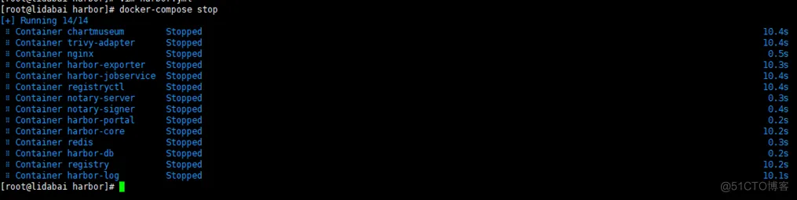
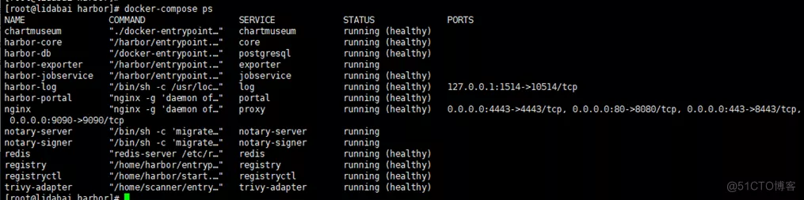
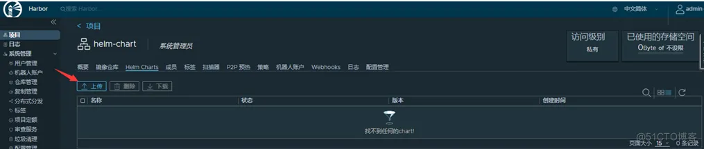
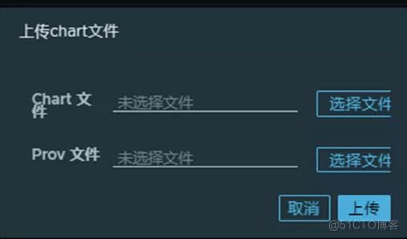
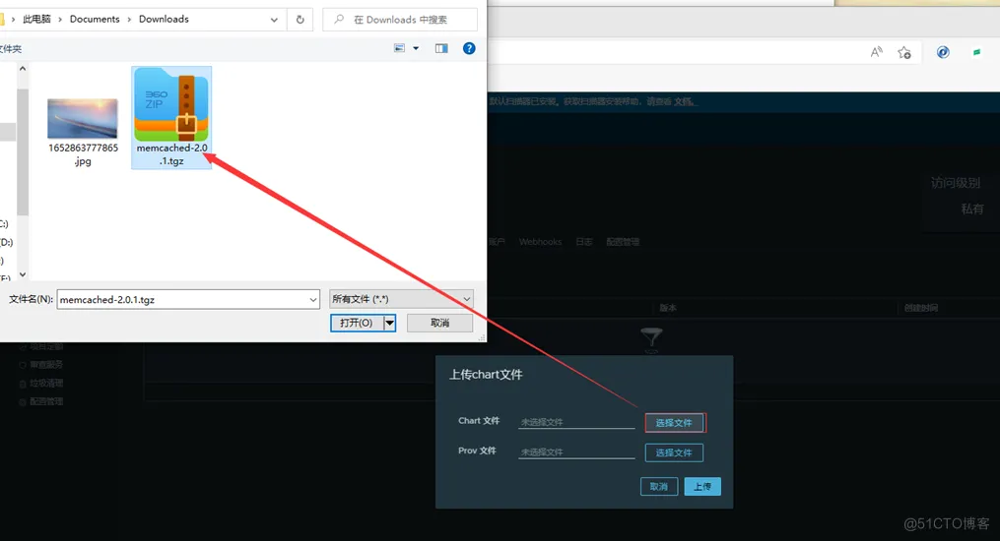
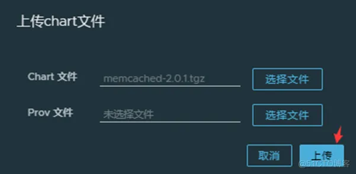
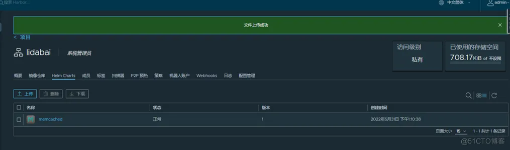
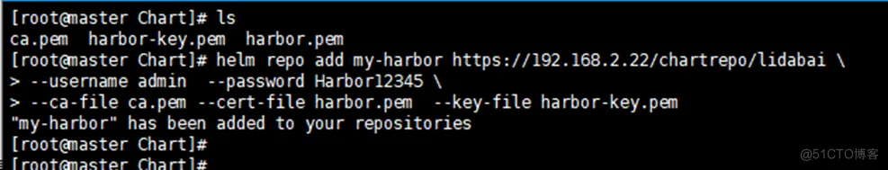

# 【开源摘星计划】Harbor进阶：使用Harbor存储chart

 推荐 原创

[键客李大白](https://blog.51cto.com/lidabai)2022-06-01 09:40:50博主文章分类：[Harbor进阶实战（企业实战）](https://blog.51cto.com/lidabai/category1)©著作权

***文章标签\*[云原生](https://blog.51cto.com/topic/faa3699795e2ef4.html)[容器](https://blog.51cto.com/topic/rongqi.html)[镜像](https://blog.51cto.com/topic/jingxiang.html)[运维](https://blog.51cto.com/topic/operations-2.html)*****文章分类\*[运维](https://blog.51cto.com/nav/ops)****[yyds干货盘点](https://blog.51cto.com/subject/1/new)*****阅读数\**\*4757\****


本文已参与「开源摘星计划」，欢迎正在阅读的你加入。

活动链接：[ https://github.com/weopenprojects/WeOpen-Star](https://github.com/weopenprojects/WeOpen-Star)


> 【摘要】 在Harbor私有镜像仓库中启用ChartMusum插件，实现在Harbor中存储Chart。操作步骤详细，可评论区留言获取PDF文档。

------

Harbor在v1.6版本开始支持`Helm Chart`仓库功能，这样就可以利用 harbor 同时管理镜像和 helm charts 了，无需另外部署一套Helm Chart系统。在harbor中，chart仓库由`chartmuseum`以插件的方式提供，可以自己选择安装或者不安装。


> **ChartMuseum：**提供了API管理非OCI规范的Helm Chart。在安装了ChartMuseum组件后，当用户使用“helm”命令向Harbor推送或拉取Chart时，Harbor的Core组件会首先收到请求，在校验后将请求转发给ChartMuseum进行Chart文件的读写。随着兼容OCI规范的Helm Chart在社区上被更广泛地接受，Helm Chart能以Artifact的形式在Harbor中存储和管理，不再依赖ChartMuseum，因此Harbor可能会在后续版本中移除对ChartMuseum的支持。
>
> 由于Helm 3支持OCI仓库服务的功能还处于实验阶段，所以大多数用户还在使用ChartMuseum仓库服务。Harbor 2.0在设计时保留了基于ChartMuseum的仓库服务，这样不仅支持老版本的Harbor平滑升级到Harbor 2.0，还给用户留了缓冲时间，将Chart从ChartMuseum转移到OCI仓库服务。
>
> Harbor的ChartMuseum服务提供了图形管理界面来管理Chart，进入一个Harbor项目，单击“Helm Charts”页面，可以查看Chart列表及每个Chart的名称、状态、版本数量、创建时间。可以单击“下载”按钮拉取Chart到本地，也可以单击“删除”按钮删除选中的Chart，


## 一、安装ChartMuseum插件

在harbor服务器中进行操作。如果你在安装harbor时已经安装chartmuseum插件可以忽略该操作步骤！


### 1.1 修改Harbor配置文件

在harbor.yml配置文件中配置chartmuseum的相关参数。

> 使用ChartMuseum组件时，客户端获取到的Chart的index.yaml中包含的URL是否为绝对路径。在不配置该项时，ChartMuseum组件会返回相对路径，默认为disabled。


```

```


enabled表示使用绝对路径！


### 1.2 停止Harbor服务


```

```


输出结果：


```

```





### 1.3 注入配置


```

```


### 1.4 安装chartmuseum

在执行install.sh安装脚本时，通过--with-chartmuseum参数安装chart插件。


```

```


输出结果：


```

```


安装完后会自动启动Harbor！


### 1.5 查看组件服务状态


```

```


输出结果：


```

```





### 1.6 验证

登录Harbor UI管理界面：

【项目】>【library】> 【Helm Charts】


## 二、上传Chart到Harbor

将制作好的chart包上传到harbor的项目中



​         



然后点击【上传】






## 三、查看chart概要

在Harbor UI点击chart名称即可查看该chart的概要信息。包括chart介绍、安装、卸载、配置等。


## 四、添加Harbor作为Chart仓库

添加的命令格式：


```

```


参数说明：

--ca-file：为harbor颁发证书的颁发者证书；

--key-file： Harbor的私钥；

--cert-file：指定harbor的证书；

--username：用户名，该用户应该具体chart所在项目的权限；

--password：指定用户名密码；

[ https://192.168.2.22/chartrepo/lidabai为chart连接地址，chartrepo固定格式，lidabai为chart所在项目的名称。](https://192.168.2.22/chartrepo/lidabai为chart连接地址，chartrepo固定格式，lidabai为chart所在项目的名称。)


### 4.1 拷贝harbor相关证书

将harbor相关的证书拷贝到Helm所在服务器（一般是kubernetes集群中的master节点）。


```

```


### 4.2 添加harbor的chart到本地


```

```


输出结果：


```

```


表示添加成功！




### 4.3 查看验证


```

```


## 五、安装Chart

安装命令：


```

```


### 5.1 搜索chart

从我们添加的harbor chart中搜索有哪些chart包。


```

```


### 5.2 安装chart


```

```


这里演示的memcached有问题，可自行用其它没问题的chart进行测试！

比较常用安装chart的方法是将chart pull下来，解压修改后再进行安装。


```

```


- ***\*5\**赞**
-  

- ***\*4\**收藏**
-  

- **评论**
-  

- **分享**
-  

- **举报**

上一篇：[【K8S】Helm包管理工具的简单介绍和安装方法](https://blog.51cto.com/lidabai/5347105)

下一篇：[kubernetes Pod的详细总结](https://blog.51cto.com/lidabai/5353368)