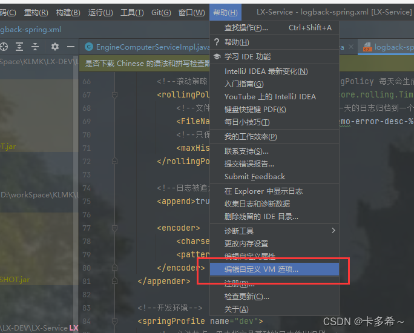
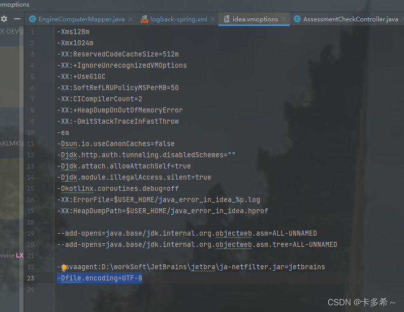
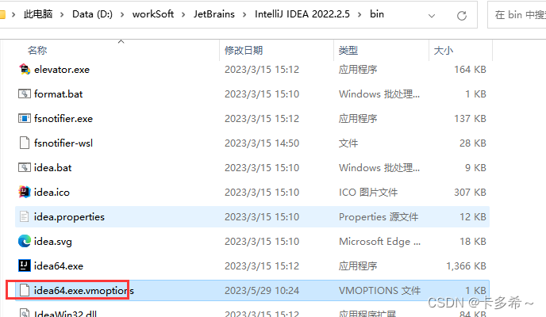
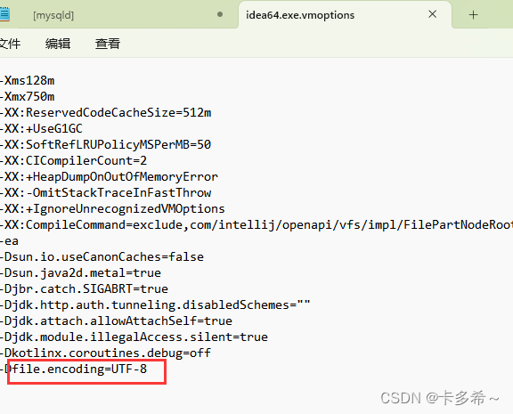
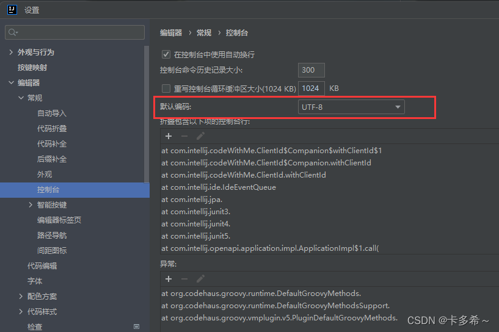
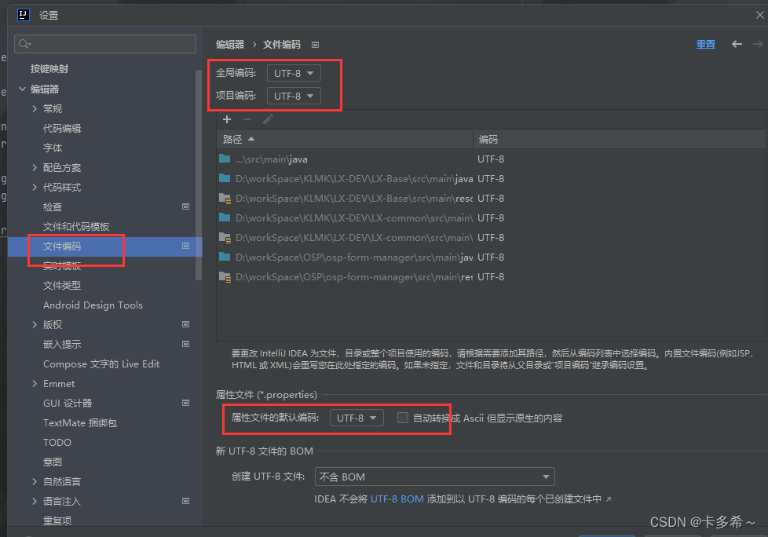
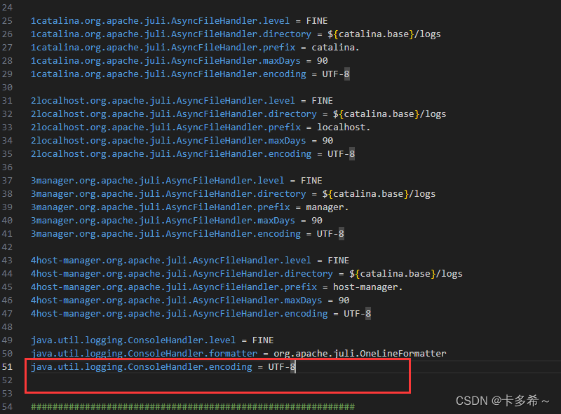
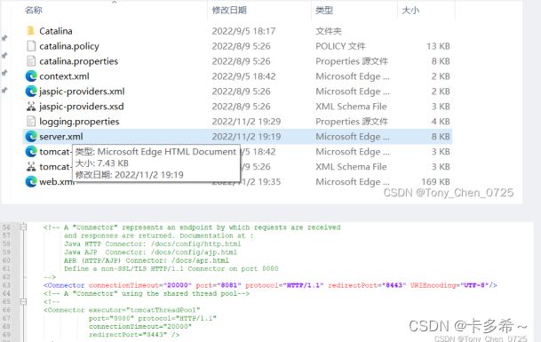
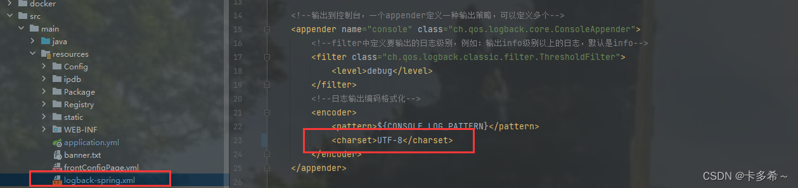

# 解决IDEA控制台中文乱码，亲测有效，分析全面


## 首先判断IDEA控制台乱码来源

自我总结，IDEA控制台输出日志乱码一般会有三种来源：
1、IDEA本身编码错误。
2、Tomcat日志输出编码错误。
3、项目本身原因。
终极原因是：将IDEA编码和Tomcat编码不一致，统一设置为UTF-8即可。


### 一、IDEA本身编码错误

解决方法：

1、打开IDEA，找到帮助–》编辑自定义VM选项–》添加：

```
-Dfile.encoding=UTF-8
```






2、找到idea的安装路径–》bin目录下的idea64.exe.vmoptions，同样添加






3、IDEA设置中进行修改编码方式

控制台



文件编码




二、Tomcat编码错误
其实只进行第一步操作就可以，如果还是不行或者遇到其他问题，在进行第2,3步骤试一下。
1、找到Tomcat安装路径，conf文件夹下的logging.properties文件，修改java.util.logging.ConsoleHandler.encoding = UTF-8




2、Tomcat安装目录下的bin目录中，对catalina.bat进行如下配置：
修改相应的tomcat文件，找到你的tomcat安转目录下的bin目录，然后编辑该文件，大概在216行左右，修改如下代码，记住要保存！！！记住要保存！！！记住要保存！！！

```
set "JAVA_OPTS=%JAVA_OPTS% -Djava.protocol.handler.pkgs=org.apache.catalina.webresources"
# 增加 -Dfile.encoding=UTF8的配置
set "JAVA_OPTS=%JAVA_OPTS% -Djava.protocol.handler.pkgs=org.apache.catalina.webresources -Dfile.encoding=UTF8"
-----2
set "JAVA_OPTS=%JAVA_OPTS% %JSSE_OPTS%" -Dfile.encoding=UTF-8 -Dsun.jnu.encoding=UTF-8
```


3、另一种方案（这是解决tomcat运行网页时，中文乱码的解决方案），也是你的tomcat安转目录，找到conf下的sever.xml，点击编辑，大概在63行左右，照着截图，添加代码，还是记得保存。

```
<Connector connectionTimeout="20000" port="8081" protocol="HTTP/1.1" redirectPort="8443" URIEncoding="UTF-8"/>
```




三、项目本身
如果出现其他项目并没有出现乱码，但是其中一个出现乱码，你就要分析下是不是这个原因。
项目resources文件夹下存在logback-spring.xml，编码方式修改成UTF-8。



项目本身，导致出现乱码，是本人亲身经历的。


四、附加：logback-spring.xml文件

    <?xml version="1.0" encoding="UTF-8"?>
    <configuration scan="true" scanPeriod="60 seconds" debug="false">
        <!--property用于配置变量，可通过${LOG_PATH} 取对应的值-->
        <!--定义日志文件的存储地址-->
        <property name="LOG_PATH" value="./log"/>
        <property name="PATTERN"
                  value="%d{yyyy-MM-dd HH:mm:ss.SSS}|%thread|%-5level|%class|%method|%line|%msg%n"/>
        <property name="CONSOLE_LOG_PATTERN"
                  value="%d{yyyy-MM-dd HH:mm:ss.SSS}|%thread|%-5level|%class|%method|%line|%msg%n|%X{userid}"/>
        <contextName>logback</contextName>
    
        <!--输出到控制台，一个appender定义一种输出策略，可以定义多个-->
        <appender name="console" class="ch.qos.logback.core.ConsoleAppender">
            <!--filter中定义要输出的日志级别，例如：输出info级别以上的日志，默认是info-->
            <filter class="ch.qos.logback.classic.filter.ThresholdFilter">
                <level>debug</level>
            </filter>
            <!--日志输出编码格式化-->
            <encoder>
                <pattern>${CONSOLE_LOG_PATTERN}</pattern>
                <charset>UTF-8</charset>
            </encoder>
        </appender>
    
        <!-- 输出到文件info，日期滚动记录 -->
        <appender name="logInfoFile" class="ch.qos.logback.core.rolling.RollingFileAppender">
            <filter class="ch.qos.logback.classic.filter.LevelFilter">
                <!--日志过滤级别: INFO级别的会被处理，非INFO级别的会被过滤掉-->
                <level>info</level>
                <!--符合条件的日志，立即处理，不再经过剩余的过滤器-->
                <onMatch>ACCEPT</onMatch>
                <!--不符合条件的日志，被抛弃不再经过其他过滤器-->
                <onMismatch>DENY</onMismatch>
            </filter>
            <!--滚动策略，按照时间滚动 TimeBasedRollingPolicy 每天会生成一个日志文件-->
            <rollingPolicy class="ch.qos.logback.core.rolling.TimeBasedRollingPolicy">
                <!--文件路径,定义了日志的切分方式——把每一天的日志归档到一个文件中,以防止日志填满整个磁盘空间-->
                <fileNamePattern>${LOG_PATH}/ospdemo-info-desc-%d{yyyy-MM-dd}.log</fileNamePattern>
                <!--只保留最近15天的日志-->
                <maxHistory>15</maxHistory>
                <!--用来指定日志文件的上限大小，那么到了这个值，就会删除旧的日志-->
                <!--<totalSizeCap>1GB</totalSizeCap>-->
            </rollingPolicy>
            <!--如果是 true，日志被追加到文件结尾，如果是 false，清空现存文件，默认是true-->
            <append>true</append>
    
            <!--日志输出编码格式化-->
            <encoder>
                <charset>UTF-8</charset>
                <pattern>${PATTERN}</pattern>
            </encoder>
        </appender>
    
        <!--输出到文件error，日期滚动记录 -->
        <appender name="logErrorFile" class="ch.qos.logback.core.rolling.RollingFileAppender">
            <filter class="ch.qos.logback.classic.filter.LevelFilter">
                <!--日志过滤级别: error级别的会被处理，非error级别的会被过滤掉-->
                <level>error</level>
                <!--符合条件的日志，立即处理，不再经过剩余的过滤器-->
                <onMatch>ACCEPT</onMatch>
                <!--不符合条件的日志，被抛弃不再经过其他过滤器-->
                <onMismatch>DENY</onMismatch>
            </filter>
            <!--滚动策略，按照时间滚动 TimeBasedRollingPolicy 每天会生成一个日志文件-->
            <rollingPolicy class="ch.qos.logback.core.rolling.TimeBasedRollingPolicy">
                <!--文件路径,定义了日志的切分方式——把每一天的日志归档到一个文件中,以防止日志填满整个磁盘空间-->
                <FileNamePattern>${LOG_PATH}/ospdemo-error-desc-%d{yyyy-MM-dd}.log</FileNamePattern>
                <!--只保留最近15天的日志-->
                <maxHistory>15</maxHistory>
            </rollingPolicy>
    
            <!--日志被追加到文件结尾-->
            <append>true</append>
    
            <encoder>
                <charset>UTF-8</charset>
                <pattern>${PATTERN}</pattern>
            </encoder>
        </appender>
    
        <!--开发环境-->
        <springProfile name="dev">
            <!--必选节点，用来指定最基础的日志输出级别-->
            <root level="INFO">
                <appender-ref ref="console"/>
            </root>
        </springProfile>
        <!--生产环境-->
        <springProfile name="pro">
            <!--必选节点，用来指定最基础的日志输出级别-->
            <root level="ERROR">
                <appender-ref ref="console"/>
            </root>
        </springProfile>
    </configuration>


五、还有其他原因导致乱码的，及时联系作者进行补充！！！


https://blog.csdn.net/m0_49762804/article/details/131141860