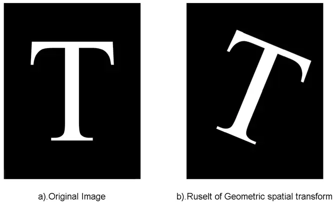

# 如何用 Canvas 实现 PS 的液化功能


最近在做业务需求时，需要实现对图片的液化功能，类似于美图秀秀的瘦脸功能。这已经不仅是图片缩放、拖动、剪裁这类对图片整体的操作了，而是需要对图片的像素进行一系列的计算和修改，那么该怎么实现这个功能呢？


## **基础知识**

在进入正题之前，我们先来了解一些数字图像处理和 Canvas 的基础知识。

### **图像处理里的像素是什么**

现实世界中，人眼直接看到的图像或者在相机中拍摄到的影像，这类图片的最大特点是图像相关的物理量变化是连续的。而对计算机而言，处理连续的东西是很困难的，所以都会将连续的东西转化为离散的东西，然后在才能计算机中处理。对于图像来说也是一样，需要把图像进行离散化和数字化。

下图片大概解释了数字图像是什么：


组成数字图像的基本单位是“像素”，所以数字图像是像素的集合。像素的值代表图像在该位置的亮度（或灰度），称为图像的灰度值。彩色图像是指每个像素信息由 R红色 G绿色 B蓝色 这三原色通道构成图像，其中 RGB 又是由不同灰度等级来描述的。所以数字图像处理的本质就是对一张数字图片里的每个像素值进行计算和处理。

需要注意的是，数字图像像素的坐标和值都是都是整数的。

### **Canvas 如何处理像素**

但说起数字图像处理，大部分人都会想到 C++ 有很多库和算法，或者 Matlab 的操作很方便。但自从有了canvas，JavaScript 也可以对图像进行像素级的操作，甚至还可以直接处理图像的二进制原始数据。

### **ImageData**

[ImageData](https://link.zhihu.com/?target=https%3A//developer.mozilla.org/zh-CN/docs/Web/API/ImageData)对象中存储着canvas对象真实的像素数据，包含3个只读属性：

- **width**：ImageData 实际宽度，单位是px；
- **height**：ImageData 实际高度，单位是px；
- **data**：Uint8ClampedArray 类型的一维数组，包含以 RGBA 顺序的数据，数据使用 0 至 255（包含）的整数表示，可以被使用作为查看初始像素数据；

data 包含 height × width × 4 长度的字节数据，索引值从 0 到 (height× width × 4)-1

图像中每个像素用 4 个 1bytes 值来代表 (按照红，绿，蓝和透明值的顺序，即 **RGBA** 格式) 。每个颜色值部份用 0 至 255 来代表，被分配到一个数组内的连续索引上。**左上角像素的红色部份在数组的索引 0 位置**。像素**从左到右、从上到下**被处理，遍历整个数组。

例如，要读取图片中位于第 50 行，第 200 列的像素的蓝色部份，可以这么写：

blueComponent = imageData.data[((50 * (imageData.width * 4)) + (200 * 4)) + 2];

### **ImageData 的 API**

- 创建 ImageData 可以用 [CanvasRenderingContext2D](https://link.zhihu.com/?target=https%3A//developer.mozilla.org/zh-CN/docs/Web/API/CanvasRenderingContext2D)对象的创建方法 [createImageData()](https://link.zhihu.com/?target=https%3A//developer.mozilla.org/zh-CN/docs/Web/API/CanvasRenderingContext2D/createImageData)
- 获取 Canvas 的指定区域内的像素信息，则可以用 [getImageData()](https://link.zhihu.com/?target=https%3A//developer.mozilla.org/zh-CN/docs/Web/API/CanvasRenderingContext2D/getImageData)
- 将数据从已有的 ImageData 对象绘制到 Canvas 的一部分，可以用 [putImageData()](https://link.zhihu.com/?target=https%3A//developer.mozilla.org/zh-CN/docs/Web/API/CanvasRenderingContext2D/putImageData)

更多详细的 API 使用方式，可以参考 [MDN 的教程](https://link.zhihu.com/?target=https%3A//developer.mozilla.org/zh-CN/docs/Web/API/Canvas_API/Tutorial/Pixel_manipulation_with_canvas)。

## **图像扭曲 Image Warping**

### **图像扭曲是什么**

图像扭曲是指**改变原图像素点的位置**，核心是对图像进行几何变换，即**将源图像每个像素点的位置通过某种函数映射到目标图像中的相应位置**，从而实现图像的扭曲变形。

基本图像扭曲变换有多种，包括平移、旋转、比例缩放、仿射变换、透视变换、柱状变换等，如下图所示：


图像扭曲可以被应用在很多领域，比如：


此外在各类图像软件中也被广泛使用，至少都会提供一种图像扭曲工具，或者基于图像扭曲的效果。例如在 PS 中的图像扭曲应用如下图，美图秀秀常用的瘦脸工具，也是图像扭曲典型的应用案例。


### **映射和插值**

简单而言，扭曲是移动像素点的位置，并不改变像素值。映射就是数学计算，映射函数描述了目标图像中的每个像素点在源图像中的位置。


例如我们实现一个简单的缩放或者旋转，那么目标图像中每个像素点的坐标和源图像的坐标关系：


但是前面我们曾提到过，数字图像中像素点的位置和值都是整数，那么仅改变像素点的位置，比如旋转一张图，如果仅仅改变原图的像素点位置，有很多点会落在目标图像的非整数坐标位置上，例如 (1,1) -> (0, √2)，如果强行四舍五入到整数坐标，就有可能会出现空隙和孔洞。因此在计算完**映射**后，需要进行**插值**来避免这个问题的出现。

### **向前映射**

在定义好映射关系后，我们会从输入图像的 (0,0) 开始，将源图像的每个像素点依次遍历，计算其变换后的坐标。但计算出来的坐标很多都不会是整数，如下图：


假设源图像的 A1-A5 这5个点，经过变换得到了右边的 A1' - A5' 的5个点。但这 5 个点坐标并不是整数。假设遍历到 A2 这个点，将 A2' 坐标四舍五入，坐标为 B2，将 A2' 的像素值赋值给 B2。根据上述的向前映射思想，将图像旋转，能得到如下效果：


可以看出，所得到的结果非常“斑驳”。其原因是，我们将源图像素坐标进行变换计算后，所得到的坐标四舍五入之后，有的点没有被赋值，而有点被赋值了多次。这就产生了“空穴”，所以让变换后的图像非常斑驳。

### **向后映射**

而向后映射，则是对目标图像点进行遍历，根据目标图像中的像素坐标，反推来自于源图像的哪个坐标，然后进行像素值赋值。当然这个坐标也不一定是整数。


假设我们遍历到 B1，通过计算得到 B1'。也就是说要确定 B1 的像素值，就需要 B1' 处的像素值。最方便的办法，就是选择最邻近的点，比如上图中的 A1。这样通过反向映射得到的结果，看起来比前向映射好了不少。



### **插值**

在上面映射过程中，在计算目标图像像素值的过程中，我们都采用了比较简单的方式，即选择最近点的像素值作为结果（最邻近插值）。当然我们也可以用更复杂的插值去计算，比如根据最接近 B2 的 4 个点来确定结果，也叫双线性插值。

在前向映射中，B2 的值由 A1' A2' A4’ A5' 来决定，但是这 4 个点的像素值并不好计算，实际是未知的，因此这种反推的逻辑会导致实现非常困难。

但在后向映射中，虽然 B1' 的坐标也可能是非整数，但是我们可以使用周围的已知像素点 A1 A2 A3 A4 4个点的值来估计 B1' 的值，从而确定 B1 的值。

换句话说，正向映射可能会导致源图像中的点无处安放；而反向映射可能导致目标图像中的点源自不存在的像素，但可以根据该像素周围的点来“猜测”它应该是什么值。因此反向映射更易于实现。


我们再继续细化上述后向映射的双线性插值计算过程，首先在 A1 与 A2 之间使用线性插值，确定处 R1 的值，同样根据 A3 和 A4 确定出 R2 的值。最后再在 R1 与 R2 之间再次线性插值，就得到了 B1' 的值。

另外插值方法也还有很多，在这里也不做详细讨论。

## **图像的局部扭曲**

上面描述的过程对图像的扭曲变换都是全局的，本质上它们都是由一组函数描述的，图像中每个像素变化都会被函数所影响。

但是在创意图形设计软件中，经常需要对图像进行局部的变换，而不是整个图像。图像的不同部位可能会被不同方式移动，缩放、旋转、弯曲或者扭曲。

一种传统做法是通过遮罩将要变形的对象与环境隔离，对遮罩图像进行全局的变形，再将变形图像粘贴到原始图像中来满足局部扭曲。复杂一点的做法则是将图像分割成几个部分，每个部分单独扭曲，然后使用 alpha 混合。

### **网格扭曲 - Mesh Warping**

**网格扭曲** 是分割式局部扭曲的一种简化，先对图片构建网格控制点模型，将图片切分为若干个区域（进行三角剖分）。用户通过移动有限的网格控制点，使图像的其余部分根据相邻控制点的移动进行自动调整（进行插值），保证控制点的位置只影响该点附近一个小区域的图像。网格扭曲最早是 Douglas Smythe 在电影 Willow 中（光魔公司）成功应用的，Wolberg 的书在这方面做了深入研究和精辟论述。


### **局部扭曲 - Interactive Warping**

在**《Interactive Image Warping》**这篇论文中，作者又提出了一种新的交互式局部扭曲算法。通过连续应用多个简单的局部扭曲（称为原始变换）来构建复杂的扭曲。局部扭曲可以是平移、缩放和旋转。

- 局部平移

在局部平移的扭曲中，设置一个点C 和 r_max 作为圆形变化区域的圆心和半径，通过鼠标拖拽 C 点使图片扭曲。在扭曲过程中，在圆形区域内越靠近扭曲中心 C 的点形变越明显，反之则越弱。在这种交互模式下，用户可以明确控制圆形的半径和扭曲的强度。

- 局部缩放

通过鼠标点击某点 O 实现该点 r 半径范围内原型区域内的扭曲，通过控制系数，可以实现该圆形内像素点膨胀或者缩小的效果。

- 局部旋转

通过鼠标点击某点 O 实现该点 r 半径范围内原型区域内的扭曲，实现该圆形内像素点的旋转扭曲。

### **对比**

网格扭曲在实现和原理上更容易理解，但是因为将图片通过控制点分割成了几何形状，可能又会造成一些问题。比如这种几何形状不一定是用户想要扭曲的对象的几何形状。而且网格划分的大小也至关重要，如果太大则不可能实现精确定位，如果太小，及即使是简单的扭曲也必须移动大量控制点才能实现。如果用户想要精准控制某个区域的局部变形，用局部扭曲是更合适的。


但 Mesh Warping 和 Interactive Warping 都是应用在工业中被广泛应用的两种常见的扭曲模式，值得一提的是，Mesh Warping 在 1990 年就被提出， 并且被应用到电影特效中。Interactive Warping 是在 1993 年的一篇博士论文中被提出，这种局部扭曲的交互模式也基本奠定了 PS 等各种修图软件的液化等操作基础。经典永远是经典，不会过时。


## **局部扭曲的实现**

### **Mesh Warping**

在网上我找到了两个用 JS 实现的网格扭曲工具，还挺好用：


https://mockover.com/image-warping/


https://snorpey.github.io/distort-grid/

其中 distort-grid 是开源的，我研究了它的代码之后，大致梳理了它的实现逻辑。

### **三角剖分和矩形形变**

先抛开所有的交互逻辑，在 canvas 画布中最简单的一个矩形，如果矩形四角坐标发生了变化，画布内的像素应该如何形变呢？首先这里用到了一个数学常识，假设平面A要形变到平面B，只需AB平面对应三个点的关系就能够决定 AB 之间的映射关系，也就是三点可以定义仿射变换。


假设矩形的四点原始坐标为 o1-o4，新的坐标为 p1-p4，先将矩形进行三角剖分，划分为两个三角形 ∆o1o2o3 和 ∆o2o3o4，变换后的三角形为 ∆p1p2p3 和 ∆p2p3p4。以第一个三角形为例，通过数学计算，得到 ∆o1o2o3 到 ∆p1p2p3 的变换矩阵系数为 xm 和 ym（因为 js 中没有二维向量的概念，所以 xy 方向要分别计算。可参考该 [demo](https://link.zhihu.com/?target=http%3A//s3.amazonaws.com/canvas-warp/2009-11-01/index.html)）。


在 canvas 中有一个 API setTransform(a,b,c,d,e,f)用来设置变换矩阵，参数在矩阵中的对应关系为


假设对 canvas 应用该变换后，那么怎么控制只在相应的区域内改变渲染呢？

canvas 有个 clip 函数，可以只在剪裁区域中更新渲染。因此我们可以通过该函数将绘制区域限制在三角形内。绘制后只有该三角区域内的像素应用上述的形变。同理我们再对另一个三角形进行相同的操作，就可以对另一半三角形达到同样的效果。

```js
/**
* p1 p2
* p3 p4
*/
const oRectWidth = Math.max(o1.x, o2.x, o3.x) - Math.min(o1.x, o2.x, o3.x);
const oRectHeight = Math.max(o1.y, o2.y, o3.y) - Math.min(o1.y, o2.y, o3.y);

// 处理 p1p2p3 三角形
const xm = getLinearSolution(0,0,p1.x,oRectWidth,0,p2.x,0,oRectWidth,p3.x);
const ym = getLinearSolution(0,0,p1.y,oRectHeight,0,p2.y,0,oRectHeight,p3.y);

ctx.restore();
ctx.save();
// 应用变换
ctx.setTransform(xm[0], ym[0], xm[1], ym[1], xm[2], ym[2]);
// 剪裁对应的三角区域
ctx.beginPath();
ctx.moveTo(0, 0);
ctx.lineTo(oRectWidth, 0);
ctx.lineTo(0, oRectHeight);
ctx.lineTo(0, 0);
ctx.closePath();
ctx.clip();
// 绘制（只在剪裁区域内生效）
ctx.drawImage(
  img,
  o1.x, o1.y, oRectWidth, oRectHeight,
  0,0, oRectWidth, oRectHeight
);
ctx.restore();
ctx.save();

// 处理 p2p3p4 三角形
const xn = getLinearSolution(
  oRectWidth,oRectHeight,p4.x,
  oRectWidth,0,p2.x,
  0,oRectHeight,p3.x);
const yn = getLinearSolution(
  oRectWidth,oRectHeight,p4.y,
  oRectWidth,0,p2.y,
  0,oRectHeight,p3.y
);

ctx.setTransform(xn[0], yn[0], xn[1], yn[1], xn[2], yn[2]);

ctx.beginPath();
ctx.moveTo(oRectWidth, oRectHeight);
ctx.lineTo(oRectWidth, 0);
ctx.lineTo(0, oRectHeight);
ctx.lineTo(oRectWidth, oRectHeight);
ctx.closePath();
ctx.clip();

ctx.drawImage(
  img,
  o1.x,
  o1.y,
  oRectWidth,
  oRectHeight,
  0,
  0,
  oRectWidth,
  oRectHeight
);
ctx.restore();
ctx.save();

// Solves a system of linear equations.

// t1 = (a * r1) + (b + s1) + c
// t2 = (a * r2) + (b + s2) + c
// t3 = (a * r3) + (b + s3) + c

// r1 - t3 are the known values.
// a, b, c are the unknowns to be solved.
// returns the a, b, c coefficients.

function getLinearSolution(
	rotation1,scale1,transform1,
	rotation2,scale2,transform2,
	rotation3,scale3,transform3
) {
	const a =
		((transform2 - transform3) * (scale1 - scale2) -
			(transform1 - transform2) * (scale2 - scale3)) /
		((rotation2 - rotation3) * (scale1 - scale2) -
			(rotation1 - rotation2) * (scale2 - scale3));
	const b =
		((transform2 - transform3) * (rotation1 - rotation2) -
			(transform1 - transform2) * (rotation2 - rotation3)) /
		((scale2 - scale3) * (rotation1 - rotation2) -
			(scale1 - scale2) * (rotation2 - rotation3));
	const c = transform1 - rotation1 * a - scale1 * b;

	return [a, b, c];
}
```


### **整体实现逻辑**

在搞清楚单个矩形的形变逻辑之后，就不难对所有网格进行相同的处理了。distort-grid 的大致流程如下：

- 根据输入的网格大小，将 Canvas 划分为若干网格，并存储网格控制点的坐标信息。
- 假设移动了控制点 p0，其相邻的控制点为 p1-p8，分别涉及到四个矩形区域 p1-p2-p0-p4、p2-p3-p5-p0、p4-p0-p7-p6、p0-p5-p8-p7，根据变化前后的坐标，分别在四个矩形内进行形变。
- 完成形变后，绘制更新 Canvas，并更新控制点坐标。


我根据 distort-grid 大致复刻了它的实现，可以参考下面的 [demo](https://link.zhihu.com/?target=https%3A//codesandbox.io/s/mesh-grid-demo-g3t8ns)。（但是demo中对边界没有很好处理，比较毛糙）


### **Interactive Warping**

那么对于局部扭曲 Interactive Warping，我们想要的是**局部平移**类的扭曲，代码该如何实现呢？

在网上能搜到一些代码片段：

- [https://segmentfault.com/a/1190000002393555](https://link.zhihu.com/?target=https%3A//segmentfault.com/a/1190000002393555)
- [https://www.ucloud.cn/yun/125087.html](https://link.zhihu.com/?target=https%3A//www.ucloud.cn/yun/125087.html)

我实现的[demo ](https://link.zhihu.com/?target=https%3A//codesandbox.io/s/liquify-demo-47mqjc)如下


### **公式拆解**

在参考实现的过程中，发现或多或少都有些问题，所以我还是决定从论文公式出发，来分析如何实现。

下图中，阴影圆环代表一个半径为 r_max 的圆形选区。其中，C 点是鼠标点下时的点，也就是圆形选区的圆心。鼠标从C拖到M，致使图像中的点U变换到点X。所以，关键问题是找到上面这个变换的逆变换——给出点X时，可以求出它变换前的坐标U（精确的浮点坐标），然后用变化前图像在U点附近的像素进行插值，求出U的像素值。如此对圆形选区内的每一个像素进行求值，便可得出变换后的图像。


假设用户点击屏幕点的坐标是圆心 center(x0, y0)，鼠标拖动到新点 move(x,y)，圆心作用半径为 r，液化强度为 strength。

在这里还是要强调一点，js 中没有二维向量，因此向量计算只有通过 xy 方向的分别计算。这个公式中，x为源图像中任意一点，u为目标图形中的对应点，x-c是指 x 到原点的坐标，m-c 是圆心到移动点的坐标。而 m-c 前有一大托公式可以认为是系数。


这个系数看似复杂，实际也很好理解：

1. 圆内所有像素均沿着变形向量的方向发生偏移
2. 距离圆心越近，变形程度越大
3. 距离圆周越近，变形程度越小，当像素点位于圆周时，该像素不变形
4. 圆外像素不发生偏移

那么在 js 代码中，大致实现逻辑如下：

```js
const center = {x: x0, y: y0}; // 圆心
const move = {x: x1, y: y1}; // 移动点
const r = 10; // 半径
const K0 = 100 / strenth; // 作用强度

const ddR = r * r; // r 平方
const mc = { x: move.x - center.x, y: move.y - center.y }; // 圆心到移动点
const ddmcX = mc.x * mc.x; // mc_x方向平方
const ddmcY = mc.y * mc.y; // mc_y方向平方

const x = { i, j }; // 圆中任意点
const xc = { x: i - center.x, y: j - center.y };

const ddX = xc.x * xc.x; // xc_x方向坐标平方
const ddY = xc.y * xc.y; // xc_y方向坐标平方
const dd = ddX + ddY; // xc的坐标平方之和

// 对应 rmax2 - (x-c)2
const deltaX = ddR - ddX; 
const deltaY = ddR - ddY;
// 对应系数（这里相较于原公式加入了 K0 作为强度系数）
const ratioX = deltaX / (deltaX + K0 * ddmcX);
const ratioY = deltaY / (deltaY + K0 * ddmcY); 

const dr = Math.sqrt(dd / ddR); // 到圆心的坐标比例
// u为x对应的变形后的位置
const ux = i - ratioX * ratioX * mc.x * (1 - dr);
const uy = i - ratioX * ratioX * mc.x * (1 - dr);
```

在得到 u 的坐标之后，我们利用向后映射来确定该点的像素值，这里需要用到插值计算，双线性插值和线性的插值均在 [demo](https://link.zhihu.com/?target=https%3A//codesandbox.io/s/liquify-demo-47mqjc)中有实现，这里不再赘述。


### **更新局部 ImageData**

在实现过程中，我们的输入是用户点击屏幕上的点，坐标都是有小数，但是 ImageData中的索引都是整数，那么这里就需要将点坐标转换为整数，很简单 Math.floor 即可。假设某个点的坐标为 (x,y)，那么它在 ImageData 中的起始 bit位是 y * width * 4 + x * 4，往后 4 个分别为该点 rgba 的值。

在计算的过程中，我们不会对整个 canvas 的 ImageData 进行遍历，肯定是从圆的外接矩形开始，减少遍历像素点。因此这里需要区分某个像素点的绝对bit位和相对bit位。

假设起始点的坐标为 (startX, startY)，圆直径为 intD，那么遍历的伪代码如下：

```js
// 起始点
const startX = Math.floor(center.x) - intR;
const startY = Math.floor(center.y) - intR;
const intD = 2 * intR;
// 复制的图像数据
const bufferImageData = context.createImageData(intD, intD);
// 从圆外接矩形开始遍历，减少遍历像素点
for (let j = startY, yLen = startY + intD; j < yLen; j += 1) {
  for (let i = startX, xLen = startX + intD; i < xLen; i += 1) {
      const absoluteBit = j * imageWidth * 4 + i * 4; // 当前像素点的绝对bit位
      const bufferBit = (j - startY) * intD * 4 + (i - startX) * 4; // 当前像素点在圆外接矩形中的 bit 位
      // 如果在圆内
      if (dd < ddR) {
          //xxxxx 前述的数学计算，得到 ux uy坐标后
          const result = bilinearInterpolation(
            ux, uy, imageWidth, imageHeight, data
          );
          for (let c = 0; c < 4; c += 1) {
            bufferData[bufferBit + c] = result[c];
          }
      } else { // 在圆外，直接复制原始像素值
        for (let c = 0; c < 4; c += 1) {
          bufferData[bufferBit + c] = data[absoluteBit + c];
        }
      }
  }
}
```

### **性能优化**

是不是好像歇了一口气？但是到这里结束了吗？并没有。

在实现效果之后，却发现整体操作特别卡顿。特别是在操作半径越大的情况下，卡顿越明显。那么问题出在哪儿了呢？通过 Chrome 的性能分析工具一步步来看：


通过每步的时长分析，居然是一个小小的 Math.floor 的操作引发的血案？在网上确实搜到了更推荐用位运算~~ 来替代Math.floor做向下取整的操作，要深究则要到底层 V8 引擎的内部实现逻辑，可以参考[这篇文章](https://zhuanlan.zhihu.com/p/28105425)学习一下。

在使用位操作符替代之后，整体性能得到了大幅度提升：


分别测试了半径为 50 100 200 400 情况的差别：

| 半径 | Math.floor | 位运算 |
| ---- | ---------- | ------ |
| 50   | 50ms       | 10ms   |
| 100  | 100ms      | 30ms   |
| 200  | 400ms      | 120ms  |
| 400  | 1400ms     | 400ms  |

此外，因为涉及到频繁读取 ImageData 这种超大位数的数据，所以也有不少小细节也是能够起到性能优化的作用（虽然体感上不是太明显）

- 位操作符 ~~ 替代 Math.floor
- 缓存中间结果
- ImageData大数组 只创建需要修改的部分
- bit 计算通过+4 而不是直接计算

具体的实现都可以参考 demo 实现。

## **总结**

在实现液化的过程中，各种研究和实现的整个过程还是花费了很多精力，有以下几个体感：

- 经典的理论永不会过时
- 学好数学，真的很重要
- 数学公式可能是极简的美，但是工程实现要考虑更多的实际问题（比如取整、边界处理）

## **参考**

[warping-thesis.pdf](https://link.zhihu.com/?target=https%3A//yuque.antfin.com/attachments/lark/0/2023/pdf/291778/1690374758576-ee7b5718-7ecc-4f00-8715-838f6d4dcb4c.pdf)

[warp.pdf](https://link.zhihu.com/?target=https%3A//yuque.antfin.com/attachments/lark/0/2023/pdf/291778/1690374773357-45d6a606-eb23-437a-b27f-3234734f93dd.pdf)

[https://www.cnblogs.com/riasky/p/3465133.html](https://link.zhihu.com/?target=https%3A//www.cnblogs.com/riasky/p/3465133.html)

https://zhuanlan.zhihu.com/p/332199137

[https://my.oschina.net/u/4357815/blog/3432257](https://link.zhihu.com/?target=https%3A//my.oschina.net/u/4357815/blog/3432257)

[https://www.ucloud.cn/yun/125087.html](https://link.zhihu.com/?target=https%3A//www.ucloud.cn/yun/125087.html)

[https://segmentfault.com/a/1190000002393555](https://link.zhihu.com/?target=https%3A//segmentfault.com/a/1190000002393555)


> 作者：ES2049 / Timeless
> 文章可随意转载，但请保留此 [原文链接]([https://www.yuque.com/es2049/blog](https://link.zhihu.com/?target=https%3A//www.yuque.com/es2049/blog))。
> 非常欢迎有激情的你加入 [ES2049 Studio]([https://es2049.studio/](https://link.zhihu.com/?target=https%3A//es2049.studio/))，简历请发送至 [caijun.hcj@alibaba-inc.com](mailto:caijun.hcj@alibaba-inc.com) 。

发布于 2024-01-12 11:17・IP 属地浙江