# 实现PS滤镜系列（1）：液化

开个新坑，准备系列的研究一下PS滤镜的原理和实现。每一篇的代码会在文章发布之后一段时间公开在我的Github上并将链接更新在文章里或评论区。

**液化**（Liquify）是比较基础的PS滤镜之一，效果类似下图（此处借用了另一款软件GIMP的官方图，所以说只是类似）：

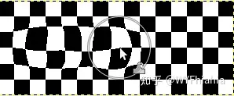

液化属于图像变换（transformation）的一种，术语叫“图像扭曲”（image warping）。

## 1. 图像扭曲

图像扭曲是数字图像处理比较基础的部分之一，其核心是对图像进行几何变换，即将源图像每个像素点的位置通过某种函数映射到目标图像中的相应位置，简而言之就是改变原图像素点的位置，从而实现图像的扭曲变形。但是仅仅改变像素点位置是不够的，这样很可能导致转换后的图像里有孔洞，也就是图像中的某些位置没有被任何像素点覆盖。比如旋转一张图，如果仅仅改变原图的像素点位置，有很多点会落在目标图像的非整数坐标位置上，例如 (1,1) -> (0,2) 。这种情况下如果所有点强行四舍五入到整数坐标，那么就有可能出现空隙和孔洞。

为了更好地实现图像扭曲变换，最常用的办法是使用 **反向映射+内插值** 。

**（1）反向映射：**

从源图像出发，计算其中每个点在目标图像中的坐标，称为正向（前向）映射 （forward mapping）；反过来，从目标图像出发，计算目标图像中每个点对应于源图像中的坐标，则称为反向映射（inverse mapping）。

以旋转图像为例，如果使用正向映射，在 源图像坐标 (1,1) -> 目标图像坐标 (0,2) 的情况下，我们无法判断源图像(1,1)这个点要放在目标图像的哪个位置，因为不能把(0,2)强行取整数；而使用反向映射时，对于每一个目标图像中的点，虽然对应的源图像坐标可能依然非整数，但是可以使用该坐标周围的已知像素点来估测这个点的值，也就是内插值（interpolation）。比如目标图像中的点 (0,1) 对应于源图像中 (2/2,2/2) ，虽然也是非整数点，但是由于源图像中(2/2,2/2)附近的整数点是已知的（而正向映射中目标点周围是未知的），因此可以用其周围的整数点来估计它的像素值，也就是目标图像(0,1)点的像素值。**换句话说，正向映射可能会导致源图像中的点无处安放；而反向映射可能导致目标图像中的点源自不存在的像素，但可以根据该像素周围的点来“猜测”它应该是什么值。**因此反向映射更易于实现。

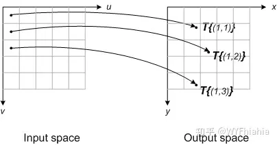

正向映射，源图像整数点 to 目标图像非整数点

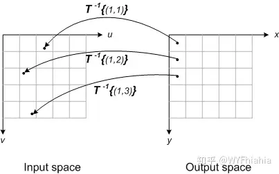

反向映射，目标图像整数点 to 源图像非整数点

**（2）内插值法：**

内插值法（interpolation）和外插值法（extrapolation）合称插值法，是使用已有数据估测缺失数据的方法。内插值法用于估测已知数据范围内的点，而外插值法用于已知数据范围外。比如给出(1,1)，(2,2)，(4,4)，要估测x=3的值使用内插值法；要估测x=5的值则使用外插值法。因此，对于上述图像变换，通常要用到内插值法来估计源图像中非整数点的像素值。内插值法有很多种，常用的有最近邻插值、线性插值、双线性插值等。这里不做详细讨论。

## 2. 液化滤镜的实现

按照Adobe官方描述，“液化”滤镜可用于推、拉、旋转、反射、折叠和膨胀图像的任意区域。总的来说，不同的液化效果区别就是坐标映射所用的函数不同。我们这里讨论一下旋转（旋涡）、膨胀和收缩（褶皱）效果的实现。

**（1）旋转：**

（a）*计算旋转角度* ：旋转（或者说旋涡）效果可以通过让每个点围绕中心旋转一定角度来实现，并且角度和点到中心的距离相关，离中心越远的点旋转角越小。比如题图中的效果就是用了

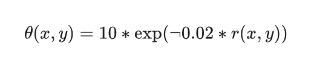

来确定各点旋转角度（“ ¬0.02 ”应该是“-0.02”，但是不知为何公式编辑器总是把负号显示成空白，所以挑了个最相似的符号），其中 �(�,�) 是点 (�,�) 到滤镜中心的距离。

（b）*计算反向映射* ：在确定了各点旋转角度之后，接下来就是求出各目标点反向映射后的源图像点坐标。以题图为例，如果源图像中的点逆时针旋转 � 得到目标图像，那么反向映射就是将目标图像的点顺时针旋转�：（奇葩的公式编辑器又不显示负号）

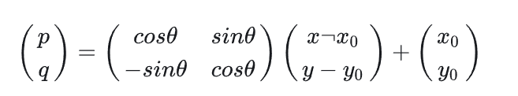

其中 (x0,y0) 是滤镜中心， (x,y) 是目标图像的点， (p,q) 是 (x,y) 反向映射到源图像中的位置坐标。

（c）*插值* : 根据源图像中点 (p,q) 周围的像素来计算 (p,q) 点的像素值，也就是目标图像中点 (x,y) 的像素值。Matlab中可以直接用***interp2*** 函数进行插值计算。

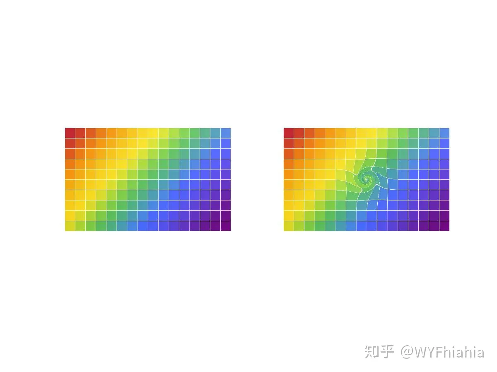

旋转前后对比图

**（2）膨胀和收缩：**

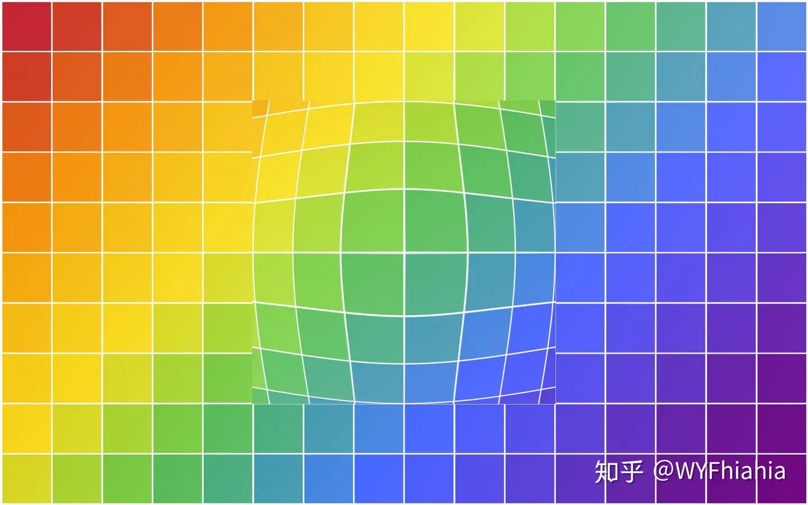

中心区域膨胀

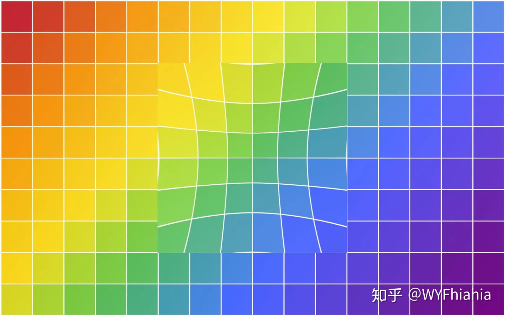

中心区域收缩

膨胀的实现比旋转要简单，只需要让源图像中的点向远离中心的方向移动，且移动距离和初始距离相关。收缩则是向中心移动，移动距离同样和初始距离相关。

（1）*计算移动距离* : 移动距离应该随点到中心的初始距离单调递减，也就是越靠近中心则形变越明显。但是这里不推荐指数函数，因为下降过快，会导致仅中心点附近的极小部分区域发生变化、而大部分区域不变的情况。上述两图中我们选取线性函数计算移动距离，

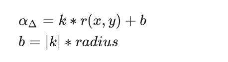

不过为了防止形变过大导致图的撕裂，我们不直接计算移动距离本身，而是先这样计算“移动距离系数” αΔ ，其中，k < 0，|k|代表k的绝对值，radius 是滤镜半径（目前暂时只实现了正方形滤镜，因此**滤镜半径**对应于**正方形边长的一半**），这样可以大致保证滤镜中心处αΔ最大且边缘处 αΔ=0 。接下来得出移动距离：（公式中应该是 x−x0 , y−y0 , 理由同上）

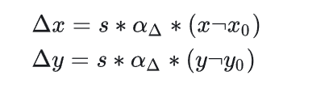

s是一个额外的抑止系数（0 < s < 1），同样是为了防止形变过大。

这样计算移动距离，可以保证离中心 (x0,y0) 越远，移动距离越小，且在滤镜边缘处（即 r(x,y)=radius ）移动距离为0，从而保证边缘处无形变、防止边缘发生明显断层。不过因为滤镜形状是正方形，因此边缘上存在 r(x,y)>radius 的点，所以还是有移动，示例图可以看到滤镜的边缘断层。

示例的膨胀和收缩效果图中，k = -0.5，s = 0.002。

（2）*计算反向映射*：实现膨胀效果，需要让源图像点远离中心，因此反向映射就是让目标图像上的点靠近中心：

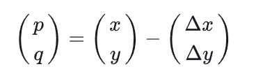

收缩效果正好相反，其反向映射是使目标图像点远离中心：

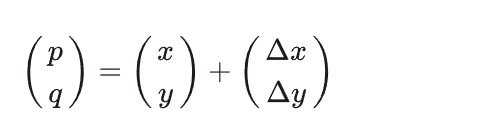

(3) *插值*：插值的过程和旋转完全一样，不再赘述。

------

**发现更有趣的新坑之前，这个系列打算持续做下去，后续会涉及比较综合的滤镜效果比如风格化滤镜（油画、浮雕等等效果），欢迎私信或评论提出想要了解的滤镜。**