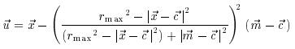
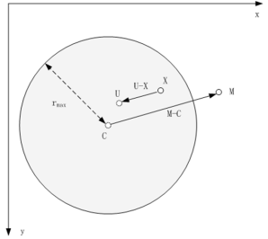
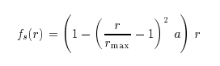
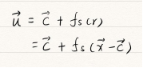
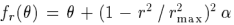

# 人脸形变算法——液化变形

在PS中，我们可以利用液化工具对人像进行形变处理，例如瘦脸、瘦腿、放大眼睛等一系列的常规操作。今天我们来了解一下这些操作的算法原理，调研该算法我参考了一篇博士毕业论文《Interactive Image Warping》。该论文重点在4.4节介绍了局部平移、局部缩放、局部旋转的实现算法，在局部变化中，作者设置一个点C和rmax作为圆形变化区域的圆心和半径，通过鼠标拖拽C点致使图片变形，在形变过程中遵守在圆形区域内越靠近变形中心C点的点形变越明显，反之亦然。下面我们再详细看一下变形后的像素是怎么计算的。

Local translation warps局部平移
mapping function:

解释：下图中，阴影圆环代表一个半径为 rmax 的圆形选区。其中，C点是鼠标点下时的点，也就是圆形选区的圆心。鼠标从C拖到M，致使图像中的点U变换到点X。所以，关键问题是找到上面这个变换的逆变换——给出点X时，可以求出它变换前的坐标U（精确的浮点坐标），然后用变化前图像在U点附近的像素进行插值，求出U的像素值。如此对圆形选区内的每一个像素进行求值，便可得出变换后的图像。

Local scaling warps局部缩放
mapping function:

解释： rmax为圆形选区的半径，r为控制点移动位移，即目的矢量，as是(-1,1)之间的缩放参数，a<0表示缩小，a>0表示放大，给出点X时，可以求出它变换前的坐标U（精确的浮点坐标），然后用变化前图像在U点附近的像素进行插值，求出U的像素值。如此对圆形选区内的每一个像素进行求值，便可得出变换后的图像。

Local rotation warps局部旋转
mapping function:

