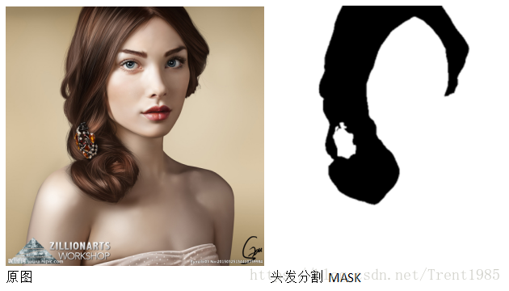
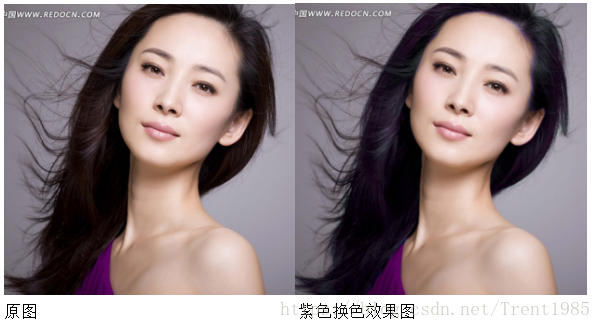
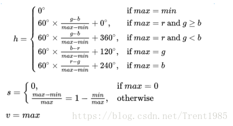
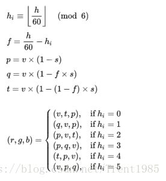
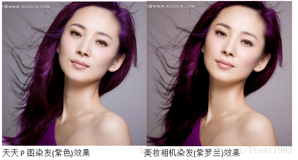
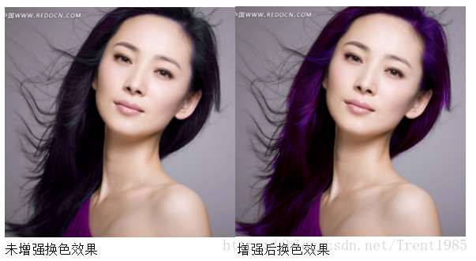
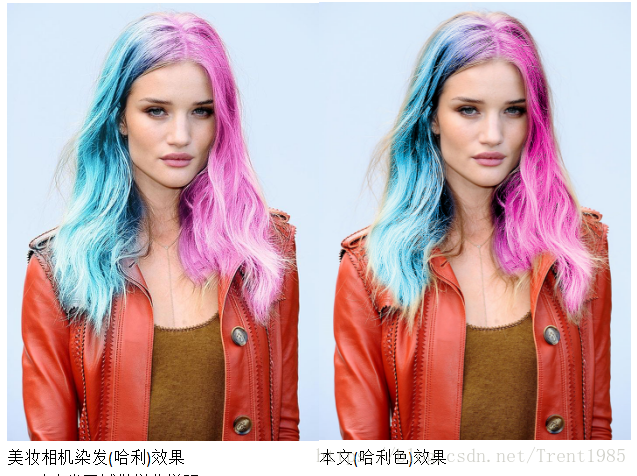
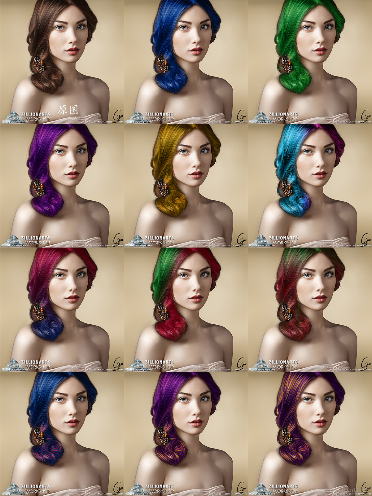

# 染发特效


给照片或者视频中的人物头发换颜色，这个技术已经在手机app诸如天天P图，美图秀秀等应用中使用，并获得了不少用户的青睐。

如何给照片或者视频中的人物头发换发色？

换发色算法流程如下图所示：


## 1，AI头发分割模块

基于深度学习的目标分割算法已经比较成熟，比较常用的有FCN，SegNet，UNet，PspNet，DenseNet等等。

这里我们使用Unet网络来进行头发分割，具体可以参考如下链接：点击打开链接 https://blog.csdn.net/Trent1985/article/details/80661230

Unet头发分割代码如下：

```
def get_unet_256(input_shape=(256, 256, 3),
                 num_classes=1):
    inputs = Input(shape=input_shape)
    # 256
 
    down0 = Conv2D(32, (3, 3), padding='same')(inputs)
    down0 = BatchNormalization()(down0)
    down0 = Activation('relu')(down0)
    down0 = Conv2D(32, (3, 3), padding='same')(down0)
    down0 = BatchNormalization()(down0)
    down0 = Activation('relu')(down0)
    down0_pool = MaxPooling2D((2, 2), strides=(2, 2))(down0)
    # 128
 
    down1 = Conv2D(64, (3, 3), padding='same')(down0_pool)
    down1 = BatchNormalization()(down1)
    down1 = Activation('relu')(down1)
    down1 = Conv2D(64, (3, 3), padding='same')(down1)
    down1 = BatchNormalization()(down1)
    down1 = Activation('relu')(down1)
    down1_pool = MaxPooling2D((2, 2), strides=(2, 2))(down1)
    # 64
 
    down2 = Conv2D(128, (3, 3), padding='same')(down1_pool)
    down2 = BatchNormalization()(down2)
    down2 = Activation('relu')(down2)
    down2 = Conv2D(128, (3, 3), padding='same')(down2)
    down2 = BatchNormalization()(down2)
    down2 = Activation('relu')(down2)
    down2_pool = MaxPooling2D((2, 2), strides=(2, 2))(down2)
    # 32
 
    down3 = Conv2D(256, (3, 3), padding='same')(down2_pool)
    down3 = BatchNormalization()(down3)
    down3 = Activation('relu')(down3)
    down3 = Conv2D(256, (3, 3), padding='same')(down3)
    down3 = BatchNormalization()(down3)
    down3 = Activation('relu')(down3)
    down3_pool = MaxPooling2D((2, 2), strides=(2, 2))(down3)
    # 16
 
    down4 = Conv2D(512, (3, 3), padding='same')(down3_pool)
    down4 = BatchNormalization()(down4)
    down4 = Activation('relu')(down4)
    down4 = Conv2D(512, (3, 3), padding='same')(down4)
    down4 = BatchNormalization()(down4)
    down4 = Activation('relu')(down4)
    down4_pool = MaxPooling2D((2, 2), strides=(2, 2))(down4)
    # 8
 
    center = Conv2D(1024, (3, 3), padding='same')(down4_pool)
    center = BatchNormalization()(center)
    center = Activation('relu')(center)
    center = Conv2D(1024, (3, 3), padding='same')(center)
    center = BatchNormalization()(center)
    center = Activation('relu')(center)
    # center
 
    up4 = UpSampling2D((2, 2))(center)
    up4 = concatenate([down4, up4], axis=3)
    up4 = Conv2D(512, (3, 3), padding='same')(up4)
    up4 = BatchNormalization()(up4)
    up4 = Activation('relu')(up4)
    up4 = Conv2D(512, (3, 3), padding='same')(up4)
    up4 = BatchNormalization()(up4)
    up4 = Activation('relu')(up4)
    up4 = Conv2D(512, (3, 3), padding='same')(up4)
    up4 = BatchNormalization()(up4)
    up4 = Activation('relu')(up4)
    # 16
 
    up3 = UpSampling2D((2, 2))(up4)
    up3 = concatenate([down3, up3], axis=3)
    up3 = Conv2D(256, (3, 3), padding='same')(up3)
    up3 = BatchNormalization()(up3)
    up3 = Activation('relu')(up3)
    up3 = Conv2D(256, (3, 3), padding='same')(up3)
    up3 = BatchNormalization()(up3)
    up3 = Activation('relu')(up3)
    up3 = Conv2D(256, (3, 3), padding='same')(up3)
    up3 = BatchNormalization()(up3)
    up3 = Activation('relu')(up3)
    # 32
 
    up2 = UpSampling2D((2, 2))(up3)
    up2 = concatenate([down2, up2], axis=3)
    up2 = Conv2D(128, (3, 3), padding='same')(up2)
    up2 = BatchNormalization()(up2)
    up2 = Activation('relu')(up2)
    up2 = Conv2D(128, (3, 3), padding='same')(up2)
    up2 = BatchNormalization()(up2)
    up2 = Activation('relu')(up2)
    up2 = Conv2D(128, (3, 3), padding='same')(up2)
    up2 = BatchNormalization()(up2)
    up2 = Activation('relu')(up2)
    # 64
 
    up1 = UpSampling2D((2, 2))(up2)
    up1 = concatenate([down1, up1], axis=3)
    up1 = Conv2D(64, (3, 3), padding='same')(up1)
    up1 = BatchNormalization()(up1)
    up1 = Activation('relu')(up1)
    up1 = Conv2D(64, (3, 3), padding='same')(up1)
    up1 = BatchNormalization()(up1)
    up1 = Activation('relu')(up1)
    up1 = Conv2D(64, (3, 3), padding='same')(up1)
    up1 = BatchNormalization()(up1)
    up1 = Activation('relu')(up1)
    # 128
 
    up0 = UpSampling2D((2, 2))(up1)
    up0 = concatenate([down0, up0], axis=3)
    up0 = Conv2D(32, (3, 3), padding='same')(up0)
    up0 = BatchNormalization()(up0)
    up0 = Activation('relu')(up0)
    up0 = Conv2D(32, (3, 3), padding='same')(up0)
    up0 = BatchNormalization()(up0)
    up0 = Activation('relu')(up0)
    up0 = Conv2D(32, (3, 3), padding='same')(up0)
    up0 = BatchNormalization()(up0)
    up0 = Activation('relu')(up0)
    # 256
 
    classify = Conv2D(num_classes, (1, 1), activation='sigmoid')(up0)
 
    model = Model(inputs=inputs, outputs=classify)
 
    #model.compile(optimizer=RMSprop(lr=0.0001), loss=bce_dice_loss, metrics=[dice_coeff])
 
return model
```

分割效果举例如下：



使用的训练和测试数据集合大家自己准备即可。


## 2，头发换色模块

这个模块看起来比较简单，实际上却并非如此。

这个模块要细分为①头发颜色增强与修正模块；②颜色空间染色模块；③头发细节增强；

①头发颜色增强与修正模块

为什么要颜色增强与修正？

先看下面一组图，我们直接使用HSV颜色空间对纯黑色的头发进行染色，目标色是紫色，结果如下：



大家可以看到，针对上面这张原图，头发比较黑，在HSV颜色空间进行头发换色之后，效果图中很不明显，只有轻微的颜色变化；

为什么会出现这种情况？原因如下：

我们以RGB和HSV颜色空间为例，首先来看下HSV和RGB之间的转换公式：

设 (r, g, b)分别是一个颜色的红、绿和蓝坐标，它们的值是在0到1之间的实数。设max等价于r, g和b中的最大者。设min等于这些值中的最小者。要找到在HSL空间中的 (h, s, l)值，这里的h ∈ [0, 360）度是角度的色相角，而s, l ∈ [0,1]是饱和度和亮度，计算为：



我们假设头发为纯黑色，R=G=B=0，那么按照HSV计算公式可以得到H = S = V = 0；

假设我们要把头发颜色替换为红色(r=255,g=0,b=0)；

那么，我们先将红色转换为对应的hsv，然后保留原始黑色头发的V，红色头发的hs，重新组合新的hsV，在转换为RGB颜色空间，即为头发换色之后的效果(hs是颜色属性，v是明度属性，保留原始黑色头发的明度，替换颜色属性以达到换色目的)；

HSV转换为RGB的公式如下：



对于黑色，我们计算的结果是H=S=V=0，由于V=0，因此，p=q=t=0,不管目标颜色的hs值是多少，rgb始终都是0，也就是黑色；

这样，虽然我们使用了红色，来替换黑色头发，但是，结果却依旧是黑色，结论也就是hsv/hsl颜色空间，无法对黑色换色。

下面，我们给出天天P图和美妆相机对应紫色的换发色效果：



与之前HSV颜色空间的结果对比，我们明显可以看到，天天P图和美妆相机的效果要更浓，更好看，而且对近乎黑色的头发进行了完美的换色；

由于上述原因，我们这里需要对图像中的头发区域进行一定的增强处理：提亮，轻微改变色调；

这一步通常可以在PS上进行提亮调色，然后使用LUT来处理；

经过提亮之后的上色效果如下图所示：



可以看到，基本与美妆相机和天天P图类似了。

②HSV/HSL/YCbCr颜色空间换色

这一步比较简单，保留明度分量不变，将其他颜色、色调分量替换为目标发色就可以了。

这里以HSV颜色空间为例：

假如我们要将头发染发为一半青色，一般粉红色，那么我们构建如下图所示的颜色MAP：


对于头发区域的每一个像素点P，我们将P的RGB转换为HSV颜色空间，得到H/S/V；

根据P在原图头发区域的位置比例关系，我们在颜色MAP中找到对应位置的像素点D，将D的RGB转换为HSV颜色空间，得到目标颜色的h/s/v；

根据目标颜色重组hsV，然后转为RGB即可；

这一模块代码如下：

    // h = [0,360], s = [0,1], v = [0,1]
    void RGBToHSV(int R, int G, int B, float* h, float* s, float * v)
    {
    	float min, max;
    	float r = R / 255.0f;
    	float g = G / 255.0f;
    	float b = B / 255.0f;
        min = MIN2(r,MIN2(g,b));
        max = MAX2(r,MAX2(g,b));
        if (max == min)
            *h = 0;
        if (max == r && g >= b)
            *h = 60.0f * (g - b) / (max - min);
        if (max == r && g < b)
            *h = 60.0f * (g - b) / (max - min) + 360.0f;
       
        if (max == g)
            *h = 60.0f * (b - r) / (max - min) + 120.0f;
        if (max == b)
            *h = 60.0f * (r - g) / (max - min) + 240.0f;
        
        if (max == 0)
            *s = 0;
        else
            *s = (max - min) / max;
        *v = max;
    };
    void HSVToRGB(float h, float s, float v, int* R, int *G, int *B)
    {
    	float q = 0, p = 0, t = 0, r = 0, g = 0, b = 0;
        int hN = 0;
        if (h < 0)
            h = 360 + h;
        hN = (int)(h / 60);
        p = v * (1.0f - s);
        q = v * (1.0f - (h / 60.0f - hN) * s);
        t = v * (1.0f - (1.0f - (h / 60.0f - hN)) * s);
        switch (hN)
        {
        case 0:
            r = v;
            g = t;
            b = p;
            break;
        case 1:
            r = q;
            g = v;
            b = p;
            break;
        case 2:
            r = p;
            g = v;
            b = t;
            break;
        case 3:
            r = p;
            g = q;
            b = v;
            break;
        case 4:
            r = t;
            g = p;
            b = v;
            break;
        case 5:
            r = v;
            g = p;
            b = q;
            break;
        default:
            break;
        }
        *R = (int)CLIP3((r * 255.0f),0,255);
        *G = (int)CLIP3((g * 255.0f),0,255);
        *B = (int)CLIP3((b * 255.0f),0,255);
    };
效果图如下所示：


本文算法对比美妆相机效果如下：



③头发区域增强

这一步主要是为了突出头发丝的细节，可以使用锐化算法，如Laplace锐化，USM锐化等等。

上述过程基本是模拟美妆相机染发算法的过程，给大家参考一下，最后给出本文算法的一些效果举例：



本文效果除了实现正常的单色染发，混合色染发之外，还实现了挑染，如最下方一组效果图所示。

对于挑染的算法原理：

计算头发纹理，根据头发纹理选取需要挑染的头发束，然后对这些头发束与其他头发分开染色即可，具体逻辑这里不再累赘，大家自行研究，这里给出解决思路供大家参考。

最后，本文算法理论上实时处理是没有问题的，头发分割已经可以实时处理，所以后面基本没有什么耗时操作，使用opengl实现实时染发是没有问题的。


