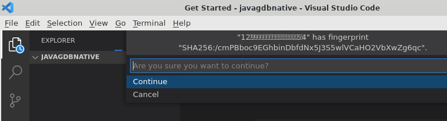
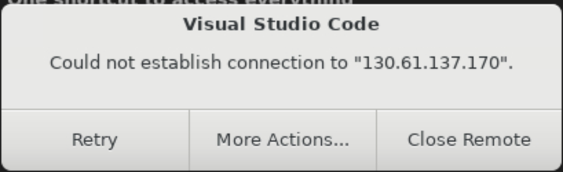
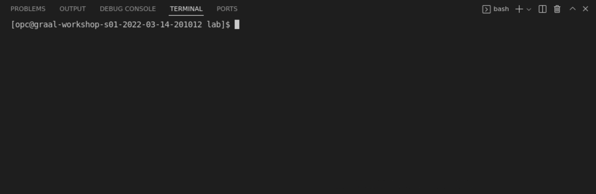
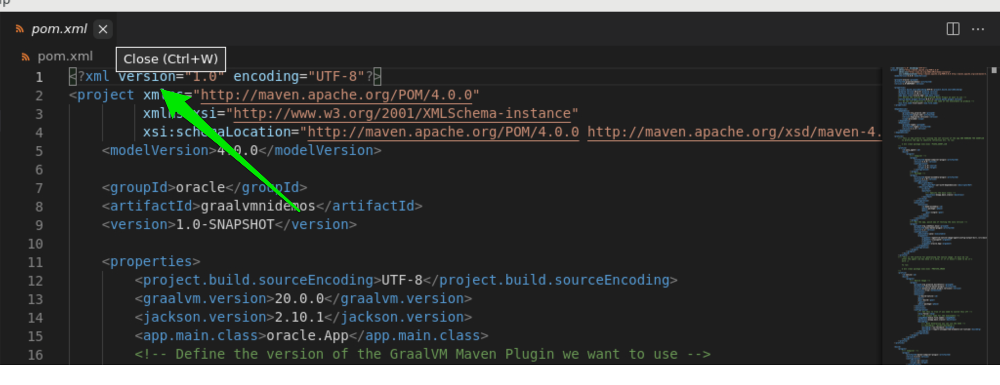
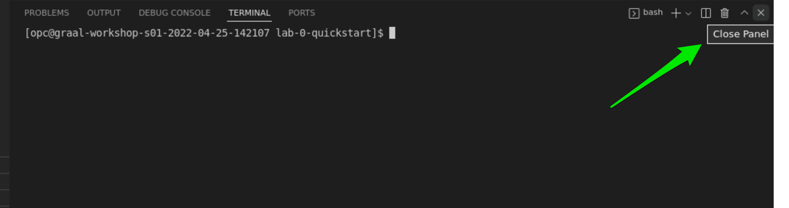
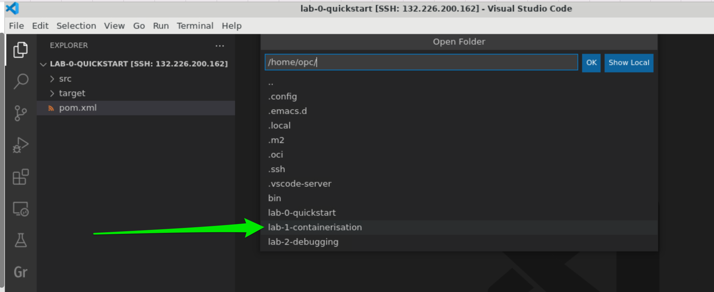
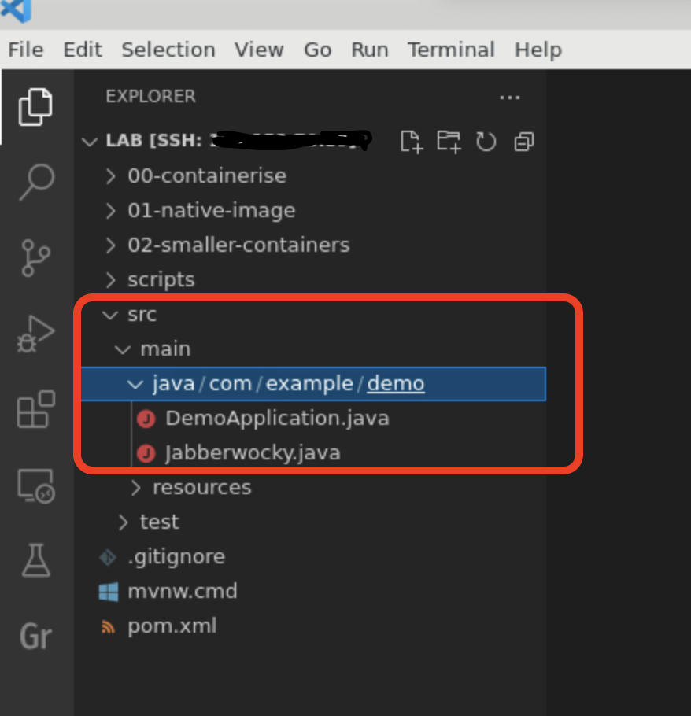
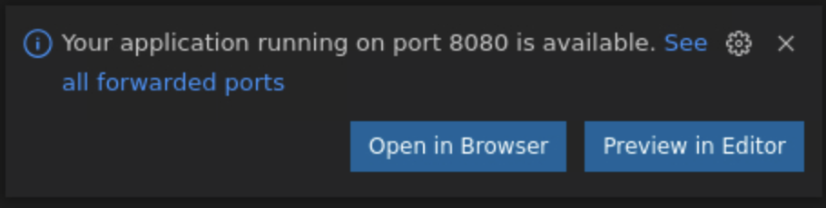
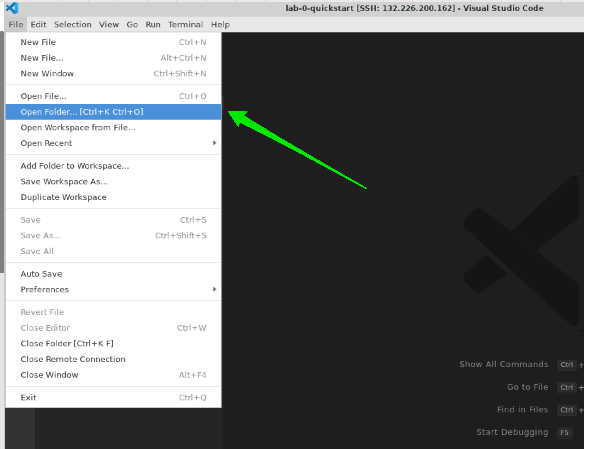
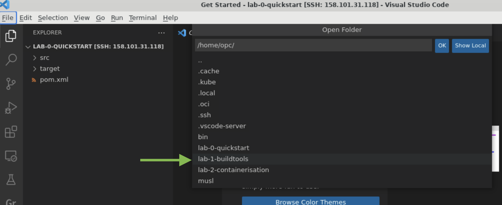

# GraalVM Native Image Bootcamp

## Introduction

This lab is for developers looking to understand more about [GraalVM Native Image ](https://docs.oracle.com/en/graalvm/enterprise/21/docs/reference-manual/native-image/) applications, how to containerise native applications and how to debug those applications.

GraalVM Native Image technology compiles Java code ahead-of-time into a native executable file. Only the code that is required at run time by the application is included in the executable file.

An executable file produced by Native Image has several important advantages, in that it:

- Uses a fraction of the resources required by the JVM, so is cheaper to run
- Starts in milliseconds
- Delivers peak performance immediately, with no warmup
- Can be packaged into a lightweight container image for faster and more efficient deployment
- Presents a reduced attack surface (more on this in future labs)

Many of the leading microservice frameworks support ahead-of-time compilation with GraalVM Native Image, including Micronaut, Spring, Helidon, and Quarkus.

In addition, there are Maven and Gradle plugins for Native Image so you can easily build, test, and run Java applications as executable files.

> **Note:** Oracle Cloud Infrastructure (OCI) provides GraalVM Enterprise at no additional cost.

Estimated lab time: 180 minutes

### Lab Objectives

This lab contains 3 smaller labs in which you will:

### Lab 0 - GraalVM Native Image Quickstart:

- Build and run a Java application, using GraalVM
- Turn a Java application into an executable file, using GraalVM Native Image
- Build an executable file that works with the dynamic features of Java
- Use the Maven GraalVM plugin to build executable files with GraalVM Native Image

### Lab 1 - GraalVM Native Image, Spring and Containerisation:

- Add a basic Spring Boot application to a Docker Image and run it
- Build a native executable from this application, using GraalVM Native Image
- Add the native executable to a Docker Image
- Shrink your application docker image size with GraalVM Native Image & Distroless containers
- See how to use the GraalVM Native Build tools, [Maven Plugin ](https://graalvm.github.io/native-build-tools/latest/index.html)

### Lab 2 - GraalVM Native Image Build Tools, for Maven:

- Use the Maven GraalVM plugin to build a native executable using GraalVM Native Image, [Maven Plugin ](https://graalvm.github.io/native-build-tools/latest/index.html)
- Learn how to run unit tests on your native executable
- Learn how to use your unit tests to create the reflection configuration for your native executable

But first, we wil need to learn how to access the lab environment:

- Connect to a remote host in Oracle Cloud - you will develop your application on an Oracle Cloud compute host

**NOTE:** If you see the laptop icon in the lab, this means you need to do something such as enter a command. Keep an eye out for it.

```shell
# This is where you will need to do something
```

## **STEP 1**: Connect to a Virtual Host and Check the Development Environment

Your development environment is provided by a remote host: an OCI Compute Instance with Oracle Linux 8, 4 cores, and 32GB of memory. The Luna Labs desktop environment will display before the remote host is ready, which can take up to two minutes.

VS Code will launch automatically and will be connected to your remote development environment.

1. A VS Code window will open and automatically connect to the VM instance that has been provisioned for you. Click **Continue** to accept the machine fingerprint.

   

   > If you don't hit `Continue` VS Code will show you a dialogue, shown below. Hit `Retry` and VS Code will ask you to accept the machine fingerprint. Hit **Continue**, as in the above step.
   >
   > 

   > ### Issues With Connecting to the Remote Development Environment
   >
   > If you encounter any issues with connecting to the remote development environment in VS Code, that are not covered above, we suggest that you try the following:
   >
   > - Close VS Code
   > - Click on the Luna Lab icon on your desktop
   > - Copy the **Configure Script** from the **Resources** tab and paste it into the Luna Desktop Terminal again
   > - Repeat the above instructions to connect to the Remote Devleopment environment

You are done! Congratulations, you are now successfully connected to a remote host in Oracle Cloud!

The above script will open VS Code, connected to your remote compute instance with the source code for the lab opened.

Next you will need to open a terminal within VS Code. This terminal will allow you to interact with the remote host. A terminal can be opened in VS Code through the menu: **Terminal** > **New Terminal**.



We will use this terminal in the rest of the lab.


We will use this terminal in the rest of the lab.

### Note on the Development Environment

We will use [GraalVM Enterprise 22 ](https://docs.oracle.com/en/graalvm/enterprise/22/index.html), as the Java enviroment for this lab. GraalVM is a high performance JDK distribution from Oracle built on the trusted and secure Oracle Java SE.

Your dev environment comes preconfigured with GraalVM and the Native Image tooling required for this lab.

You can easily check that by running these commands in the terminal:

```bash
java -version
```

```bash
native-image --version
```


# Get Started with GraalVM Native Image

## Lab Objectives

In this part of the lab you will perform the following tasks:

- Build and run a Java application, using GraalVM
- Turn a Java application into an executable file, using GraalVM Native Image
- Build an executable file that works with the dynamic features of Java
- Use the Maven GraalVM plugin to build executable files with GraalVM Native Image

Estimated lab time: 45 minutes

## **STEP 1**: Build and Run a Demo Application

We will use a demo application to showcase GraalVM Native Image: a command line Java application that counts the number of files in the current directory and its subdirectories. As a nice extra, the application also calculates the total size of the files.

The source code for the application is available in your remote host and has been opened in VS Code.

Make sure you open a terminal, within VS Code, to allow you to build the application: `Terminal > New Terminal`. If you get lost ther code for this part fo the lab is located in the directory, `/home/opc/lab-0-quickstart`.

### Note on the Demo Application

The application consists of two Java files that can be found in the `src` directory:

- `App.java` : a wrapper for the `ListDir` class.
- `ListDir.java` : this does all the work. It counts the files and summarizes the output.

The application can be built by hand, or by using Maven profiles. The Maven build configuration is provided by the `pom.xml` file. Maven Profiles are a great way to have different build configurations within a single `pom.xml` file. You can find out more about Maven Profiles [here ](https://maven.apache.org/guides/introduction/introduction-to-profiles.html).

You can browse through the files within the open VS Code.

Several profiles will be used in this lab, each of which has a particular purpose:

1. `native` : This profile builds an executable file using GraalVM Native Image.
2. `java_agent` : This profile builds the Java application with a tracing agent that tracks all usages of the dynamic code in your application and captures this information into configuration files. More on this later.

You use a particular Maven profile by passing it as a parameter to the `mvn` command. The name of the profile is appended to the `-P` flag. You can run the following commands from within the Terminal within VS Code.

The example below shows how you could call a `native` profile, when building with Maven:

```bash
mvn clean package -Pnative
```

Now that you have a basic understanding of what the application does run it to see how it works.

1. Build the project and run it, from within the Terminal we opened in VS Code:

   ```bash
   mvn clean package exec:exec
   ```
   
   The command above does the following:

   1. Cleans the project to remove any generated or compiled artifacts.
   2. Creates a runnable JAR file containing the application. This JAR file will be later used by Native Image.
   3. Runs the application by running the `exec` plugin.
   
   You should see the following included in the generated output (the number of files reported by the application may vary):

   ```shell
   Counting directory: .
   Total: 15 files, total size = 511.9 KiB
   [INFO] ------------------------------------------------------------------------
   [INFO] BUILD SUCCESS
   [INFO] ------------------------------------------------------------------------
   ```

## **STEP 2**: Turn a Java Application into an Executable File

Next, you are going to build an executable version of the application using GraalVM Native Image. As a quick reminder, GraalVM Native Image is an ahead-of-time compilation technology that converts your Java application into a self-contained executable file that does not require a JDK to run, is fast to start and efficient.

GraalVM Native Image is pre-installed on the remote host.

1. To begin, check that you have a compiled JAR file in your `target` dir:

   ```shell
   ls -l ./target
   drwxrwxr-x 1 krf krf    4096 Mar  4 11:12 archive-tmp
   drwxrwxr-x 1 krf krf    4096 Mar  4 11:12 classes
   drwxrwxr-x 1 krf krf    4096 Mar  4 11:12 generated-sources
   -rw-rw-r-- 1 krf krf  496273 Mar  4 11:38 graalvmnidemos-1.0-SNAPSHOT-jar-with-dependencies.jar
   -rw-rw-r-- 1 krf krf    7894 Mar  4 11:38 graalvmnidemos-1.0-SNAPSHOT.jar
   drwxrwxr-x 1 krf krf    4096 Mar  4 11:12 maven-archiver
   drwxrwxr-x 1 krf krf    4096 Mar  4 11:12 maven-status
   ```

   The file you will need is `graalvmnidemos-1.0-SNAPSHOT-jar-with-dependencies.jar`.

2. Generate an executable file from the command line. You do not need to use the Maven plugin to use GraalVM Native Image, but it can help. Run the following from the root directory of the project, `demo`:

   ```bash
 native-image -jar ./target/graalvmnidemos-1.0-SNAPSHOT-jar-with-dependencies.jar --no-fallback -H:Class=oracle.App -H:Name=file-count
   ```
   
   This will generate an executable file called `file-count` within the current directory.

3. Run this executable file as follows:

   ```bash
    ./file-count
   ```
   
4. Now time the application. First by running it as an executable file and then by using the regular `java` command:

   ```bash
    time ./file-count
   ```
   
   ```bash
    time java -cp ./target/graalvmnidemos-1.0-SNAPSHOT-jar-with-dependencies.jar oracle.App
   ```

   The executable file, generated by the `native-image` command, runs significantly faster than the corresponding Java application.

Let's dig a bit deeper into how you created the executable file.

What do the parameters you passed to the `native-image` command in step 2 specify?

- `-jar` : Specify the location of the JAR file containing the Java application. (You can also specify the classpath with `-cp`.)
- `--no-fallback`: Do not generate a fallback image. (A fallback image requires a JVM to run it, and you do not need this.)
- `-H:Class`: Specify the class that provides the entry point method (the `main` method).
- `-H:Name`: Specify the name of the output executable file.

The full documentation can be found [here ](https://docs.oracle.com/en/graalvm/enterprise/21/docs/reference-manual/native-image/BuildConfiguration/).

You can also run the `native-image` tool using the GraalVM Native Image Maven plugin. The project `pom.xml` (Maven configuration) file contains the following snippet that demonstrates how to build an executable file using the plugin:

```xml
<!-- Native Image -->
<plugin>
    <groupId>org.graalvm.buildtools</groupId>
    <artifactId>native-maven-plugin</artifactId>
    <version>${native.maven.plugin.version}</version>
    <extensions>true</extensions>
    <executions>
    <execution>
        <id>build-native</id>
        <goals>
        <goal>build</goal>
        </goals>
        <phase>package</phase>
    </execution>
    </executions>
    <configuration>
        <skip>false</skip>
        <imageName>${exe.file.name}</imageName>
        <mainClass>${app.main.class}</mainClass>
        <buildArgs>
            <buildArg>--no-fallback</buildArg>
            <buildArg>--report-unsupported-elements-at-runtime</buildArg>
        </buildArgs>
    </configuration>
</plugin>
```

The Native Image Maven plugin performs the heavy lifting of building the executable file. You can disable it using the `<skip>true</skip>` tag. Note also that you can pass parameters to `native-image` through the `<buildArgs/>` tags.

The full documentation on the GraalVM Native Image plugin can be found [here ](https://graalvm.github.io/native-build-tools/latest/maven-plugin.html).

To build the executable file using the Maven profile, run:

```bash
mvn clean package -Pnative
```

The Maven build places the executable file, `file-count`, into the `target` directory.

You can run the executable file as follows:

```bash
./target/file-count
```


## **STEP 3**: Using Reflection - Adding a Dependency to Log4J

In this step, you will build an executable file that that works with the dynamic features of Java.

Say you want to add a library, or some code, to your application that relies upon reflection. A good candidate for testing reflection is the Log4J logging framework. It is already added as a dependency in the project `pom.xml` file:

```xml
<dependency>
    <groupId>log4j</groupId>
    <artifactId>log4j</artifactId>
    <version>1.2.17</version>
</dependency>
```

To change the application so that it uses `log4j`, edit the `ListDir.java` file and uncomment a few lines.

1. Open the `ListDir.java` file, using VS Code

2. Uncomment the line that declares the `log4j` import and the other following commented out lines:

   

   ```java
   //import org.apache.log4j.Logger;
   ```

   

   

   ```java
   //final static Logger logger = Logger.getLogger(ListDir.class);
   ```

   

   

   ```java
   /*
   // Add some logging
   if(logger.isDebugEnabled()){
       logger.debug("Processing : " + dirName);
   }
   */
   ```

   

   

   ```java
   /*
   // Add some logging
   if(logger.isDebugEnabled()){
       logger.debug("Processing : " + f.getAbsolutePath());
   }
   */
   ```

   

3. Save the file

   Now that you have added logging to your application, you can view the result of your changes by rebuilding and running.

   ```bash
   mvn clean package exec:exec
   ```

   You should see the same kind of output as you saw earlier, but with the addition of more logging.

4. Next, build an executable file using the Maven profile:

   ```bash
   mvn clean package -Pnative
   ```

5. Run the executable file you built, that now contains logging:

   ```bash
   ./target/file-count
   ```

   This generates an error:

   ```java
   Exception in thread "main" java.lang.NoClassDefFoundError
           at org.apache.log4j.Category.class$(Category.java:118)
           at org.apache.log4j.Category.<clinit>(Category.java:118)
           at java.lang.Class.ensureInitialized(DynamicHub.java:552)
           at oracle.ListDir.<clinit>(ListDir.java:75)
           at oracle.App.main(App.java:63)
   Caused by: java.lang.ClassNotFoundException: org.apache.log4j.Category
           at java.lang.Class.forName(DynamicHub.java:1433)
           at java.lang.Class.forName(DynamicHub.java:1408)
           ... 5 more
   ```

   What just happened here?

### Working with the Dynamic Features of Java

This exception is caused by the addition of the Log4J library because it relies on reflection.
The `native-image` tool performs an aggressive static analysis to see which classes are used within the application. For any classes not used, the tool will assume that they are not needed. This is called the "closed world" assumption - everything that needs to be loaded must be known when building an executable file. If it is not findable by static analysis, then it will not be included in the executable file.

Reflection is a core feature of Java, so how can you use reflection **and** take advantage of the speed-ups offered by GraalVM Native Image? You need a way to let the `native-image` tool know about any uses of reflection.

Luckily, the `native-image` tool is able to read in configuration files that specify all classes that are referenced through reflection.

You can do this manually, or the Java tracing agent that comes with the GraalVM Java runtime can do this for you. The agent generates JSON files that record all instances of reflection, JNI, proxies, and resources access that it can locate while your application is running.

**Note** : It is important to exercise all the code paths in your application when running the tracing agent in order to ensure that all cases of reflection are identified.

The complete documentation for the tracing agent can be found [here ](https://www.graalvm.org/reference-manual/native-image/Agent/).

## **STEP 4**: Using the Tracing Agent

Now use the tracing agent to generate the reflection configuration while you run your application.

1. Run the application with the tracing agent:

   ```bash
java -agentlib:native-image-agent=config-output-dir=./src/main/resources/META-INF/native-image -cp ./target/graalvmnidemos-1.0-SNAPSHOT-jar-with-dependencies.jar oracle.App
   ```
   
   Have a look at the configuration files that the tracing agent created:

   ```shell
ls -l src/main/resources/META-INF/native-image/
   ```
   
   You should see the following included in the generated output:

   ```shell
total 56
   -rw-r--r--  1 kfoster  staff     4B Dec  2 19:13 jni-config.json
   -rw-r--r--  1 kfoster  staff    86B Nov  9 20:46 native-image.properties
   -rw-r--r--  1 kfoster  staff    65B Dec  2 19:13 predefined-classes-config.json
   -rw-r--r--  1 kfoster  staff     4B Dec  2 19:13 proxy-config.json
   -rw-r--r--  1 kfoster  staff   521B Dec  2 19:13 reflect-config.json
   -rw-r--r--  1 kfoster  staff   101B Dec  2 19:13 resource-config.json
   -rw-r--r--  1 kfoster  staff     4B Dec  2 19:13 serialization-config.json
   ```
   
   **Note**: The project contains a Maven profile that can do this for you. Run the following command to use the tracing agent:

   ```bash
mvn clean package exec:exec -Pjava_agent
   ```

2. Now re-build the executable file again. This time the configuration files produced by the tracing agent will be applied:

   ```bash
   mvn package -Pnative
   ```
   
3. Finally, execute the generated file:

   ```bash
   time ./target/file-count
   ```
   
   The executable file works and produces log messages to the output, as expected.

This works because the files generated by the tracing agent have recorded the classes that are referenced by reflection. The `native-image` tool now knows that they are used within the application and therefore does not exclude them from the generated executable file.


### Note on the position of the `-agentlib` param

Note that the agent parameters **must** come before any `-jar` or `-classpath` parameters. You should also specify a directory into which to write the files. The recommended location is under `src/main/resources/META-INF/native-image`. Files placed in this location are picked up automatically by the `native-image` tool.

### Note on Configuring the Generation of the Executable File

You can also pass parameters to the `native-image` tool using a Java properties file (by default `src/main/resources/META-INF/native-image/native-image.properties`). There is an example file in the `demo` directory to give you an idea of what you can do with it.

## Conclusions

In this part of the lab, you have seen the following GraalVM Native Image features:

1. How to generate a fast executable file from a Java command line application
2. How to use Maven to build an executable file
3. How to use the tracing agent to automate the process of tracking and recording reflection

Write efficient, more secure, and instantly-scalable cloud native Java applications with GraalVM Native Image!

Let's move onto the next part of the lab : Containerising native applications.


# GraalVM Native Image, Spring and Containerisation

## Lab Objectives

In this part of the lab you will:

- Add a basic Spring Boot application to a Docker Image and run it
- Build a native executable from this application, using GraalVM Native Image
- Add the native executable to a Docker Image
- Shrink your application docker image size with GraalVM Native Image & Distroless containers
- See how to use the GraalVM Native Build tools, [Maven Plugin ](https://graalvm.github.io/native-build-tools/latest/index.html)zs

## **STEP 1**: Open the Lab in VS Code

Before we start this lab and learn all about containerising our native applications, we need to do some clean up.

- Close all your open tabs in VS Code - you can do this by clicking on the `x` on the top of the tab



- Close the Open Terminal in VS Code - this can be done by clicking on the `x` on the toolbar for the terminal, as shown in the screenshot below



With the clean-up done we need to open our new lab folder in VS Code:

- In VS Code, open the folder for this part of the lab, `/home/opc/lab-1-containerisation`




## **STEP 2**: Meet Our Sample Java Application

In this lab, you are going to build a simple application with a very minimal REST-based API. You are then going to containerise this application using Docker. First, take a quick look at your simple application.

We have provided the source code and build scripts for this application and the folder containing the source code will be open in VS Code.

The application is built on top of the [Spring Boot ](https://spring.io/projects/spring-boot) framework and makes use of the [Spring Native Project ](https://docs.spring.io/spring-native/docs/current/reference/htmlsingle/) (a Spring incubator to generate native executables using GraalVM Native Image).

The application has two classes, which can be found in `src/main/java`:



- `com.example.demo.DemoApplication` : The main Spring Boot class that also defines the HTTP endpoint, `/jibber`
- `com.example.demo.Jabberwocky` : A utility class that implements the logic of the application

So, what does the application do? If you call the endpoint REST `/jibber`, defined within the application, it will return some nonsense verse generated in the style of the [Jabberwocky poem ](https://en.wikipedia.org/wiki/Jabberwocky), by Lewis Carroll. The program achieves this by using a [Markov Chain ](https://en.wikipedia.org/wiki/Markov_chain) to model the original poem (this is essentially a statistical model). This model generates a new text.

In the example application we provide the application with the text of the poem, then generate a model of the text, which the application then uses to generate a new text that is similar to the original text. We are using the [RiTa ](https://rednoise.org/rita/) library to do the heavy lifting for us — it supports building and using Markov Chains.

Below are two snippets from the utility class `com.example.demo.Jabberwocky` that builds the model. The `text` variable contains the text of the original poem. This snippet shows how we create the model and then populate it with `text`. This is called from the class constructor and we define the class to be a [Singleton ](https://docs.spring.io/spring-framework/docs/3.0.0.M3/reference/html/ch04s04.html#beans-factory-scopes-singleton) (so only one instance of the class ever gets created).

```java
this.r = new RiMarkov(3);
this.r.addText(text);
```

Here you can see the method to generate new lines of verse from the model, based on the original text.

```java
public String generate() {
    String[] lines = this.r.generate(10);
    StringBuffer b = new StringBuffer();
    for (int i=0; i< lines.length; i++) {
        b.append(lines[i]);
        b.append("<br/>\n");
    }
    return b.toString();
}
```

Take a little while to view the code and to get acquainted with it.

To build the application, you are going to use Maven. The `pom.xml` file was generated using [Spring Initializr ](https://start.spring.io/) and supports using the Spring Native tools. This is a dependency that you have add to your Spring Boot projects if you plan to target GraalVM Native Image. If you are using Maven, adding support for Spring Native will insert the following plugin to your default build configuration.

```xml
<plugin>
    <groupId>org.springframework.experimental</groupId>
    <artifactId>spring-aot-maven-plugin</artifactId>
    <version>${spring-native.version}</version>
    <executions>
        <execution>
            <id>test-generate</id>
            <goals>
                <goal>test-generate</goal>
            </goals>
        </execution>
        <execution>
            <id>generate</id>
            <goals>
                <goal>generate</goal>
            </goals>
        </execution>
    </executions>
</plugin>
```

Now build your application. From the root directory of the repository, run the following commands in your shell:

```shell
mvn clean package
```

This will generate an "executable" JAR file, one that contains all of the application's dependencies and also a correctly configured `MANIFEST` file. You can run this JAR file and then "ping" the application's endpoint to see what you get in return — put the command into the background using `&` so that you get the prompt back.

```shell
java -jar ./target/jibber-0.0.1-SNAPSHOT-exec.jar &
```

Call the end point using the `curl` command from the command line.

When you post the command into your terminal, VS Code may prompt you to open the URL in a browser, just close the dialogue, as shown below.



Run the following to test the HTTP endpoint:

```shell
curl http://localhost:8080/jibber
```

Did you get the some nonsense verse back? So now that you have built a working application, terminate it and move on to containerising it. Bring the application to the foreground so you can terminate it.

```shell
fg
```

Enter `<ctrl-c>` to now terminate the application.

```shell
<ctrl-c>
```


## **STEP 3**: Containerising Your Java Application with Docker

Containerising your Java application as a Docker container is, thankfully, relatively straightforward. You can build a new Docker image based on one that contains a JDK distribution. So, for this lab you will use a container that already contains a JDK, `container-registry.oracle.com/java/openjdk:17-oraclelinux8` — this is an Oracle Linux 8 image with OpenJDK.

The following is a breakdown of the Dockerfile, which describes how to build the Docker image. See the comments to explain the contents.

```dockerfile
FROM container-registry.oracle.com/java/openjdk:17-oraclelinux8 # Base Image

ARG JAR_FILE                   # Pass in the JAR file as an argument to the image build

EXPOSE 8080                    # This image will need to expose TCP port 8080, as this is the port on which your app will listen

COPY ${JAR_FILE} app.jar       # Copy the JAR file from the `target` directory into the root of the image 
ENTRYPOINT ["java"]            # Run Java when starting the container
CMD ["-jar","app.jar"]         # Pass in the parameters to the Java command that make it load and run your executable JAR file
```

The Dockerfile to containerise your Java application can be found in the directory, `00-containerise`.

To build a Docker image containing your application, run the following commands from your terminal:

```shell
docker build -f ./00-containerise/Dockerfile \
             --build-arg JAR_FILE=./target/jibber-0.0.1-SNAPSHOT-exec.jar \
             -t localhost/jibber:java.01 .
```

Query Docker to look at your newly built image:

```shell
docker images | head -n2
```

You should see a new image listed. Run this image as follows:

```shell
docker run --rm -d --name "jibber-java" -p 8080:8080 localhost/jibber:java.01
```

Then call the endpoint as you did before using the `curl` command:

```shell
curl http://localhost:8080/jibber
```

Did you see the nonsense verse? Now check how long it took your application to startup. You can extract this from the logs, as Spring Boot applications write the time to startup to the logs:

```shell
docker logs jibber-java
```

For example, the application started up in 3.896s. Here is the extract from the logs:

```shell
2022-03-09 19:48:09.511  INFO 1 --- [           main] com.example.demo.DemoApplication         : Started DemoApplication in 3.896 seconds (JVM running for 4.583)
```

OK, terminate your container and move on:

```shell
docker kill jibber-java
```

You can also query Docker to get the size of the image. We have provided a script that does this for you. Run the following in your terminal:

```shell
docker images localhost/jibber:java.01
```

This prints out details of the image, the size of the image in MBs is the last column. Which is 606 MB.


## **STEP 4**: Building a Native Executable

Recap what you have so far:

1. You have built a Spring Boot application with a HTTP endpoint, `/jibber`
2. You have successfully containerised it

Now you will look at how you can create a native executable from your application using GraalVM Native Image. This native executable is going to have a number of interesting characteristics, namely:

1. It is going to start really fast
2. It will use fewer resources than its corresponding Java application

You can use the Native Image tooling installed with GraalVM to build a native executable of an application from the command line. But, as you are using Maven already, you are going to apply the [GraalVM Native Build Tools for Maven ](https://graalvm.github.io/native-build-tools/latest/maven-plugin.html), which will conveniently allow you to carry on using Maven to build.

One way of adding support for building a native executable is to use a Maven [profile ](https://maven.apache.org/guides/introduction/introduction-to-profiles.html), which will allow you to decide whether you want to just build the JAR file, or a native executable.

In the Maven `pom.xml` file provided, we have added a profile that builds a native executable. Take a closer look:

First, you need to declare the profile and give it a name.

```xml
<profiles>
    <profile>
        <id>native</id>
        <!-- Rest of profile hidden, to highlight relevant parts -->
    </profile>
</profiles>
```

Next, within the profile, we include the GraalVM Native Image build tools plugin and attach it to the `package` phase in Maven. This means it will run as a part of the `package` phase. Notice that you can pass configuration arguments to the underlying Native Image build tool using the `<buildArgs>` section. In individual `buildArg` tags, you can pass parameters exactly the same way as you do to the `native-image` tool. So you can use all of the parameters that work with the `native-image` tool:

```xml
<build>
    <plugins>
        <plugin>
            <groupId>org.graalvm.buildtools</groupId>
            <artifactId>native-maven-plugin</artifactId>
            <version>${native-buildtools.version}</version>
            <extensions>true</extensions>
            <executions>
                <execution>
                    <id>build-native</id>
                    <phase>package</phase>
                    <goals>
                        <goal>build</goal>
                    </goals>
                </execution>
            </executions>
            <configuration>
                <imageName>jibber</imageName>
                <buildArgs>
                    <buildArg>-H:+ReportExceptionStackTraces</buildArg>
                </buildArgs>
            </configuration>
        </plugin>
        <!-- Rest of profile hidden, to high-light relevant parts -->
    </plugins>
</build>
```

Now run the Maven build using the profile, as below (note that the profile name is specified with the `-P` flag):

```shell
mvn package -Pnative
```

This will generate a native executable for the platform in the `target` directory, called `jibber`. Take a look at the size of the file:

```shell
ls -lh target/jibber
```

Run this native executable and test it. Execute the following command in your terminal to run the native executable and put it into the background, using `&`:

```shell
./target/jibber &
```

Call the endpoint using the `curl` command:

```shell
curl http://localhost:8080/jibber
```

Now you have a native executable of the application that starts really fast!

Terminate the application before you move on. Bring the application into the foreground:

```shell
fg
```

Terminate it with `<ctrl-c>`:

```shell
<ctrl-c>
```

## **STEP 5**: Containerising your Native Executable

Now, since you have a native executable version of your application, and you have seen it working, containerise it.

We have provided a simple Dockerfile for packaging this native executable: it is in the directory `native-image/containerisation/lab/01-native-image/Dockerfile`. The contents are shown below, along with comments to explain each line.

```shell
FROM container-registry.oracle.com/os/oraclelinux:8-slim

ARG APP_FILE                 # Pass in the native executable
EXPOSE 8080                  # This image will need to expose TCP port 8080, as this is port your app will listen on

COPY ${APP_FILE} app  # Copy the native executable into the root directory and call it "app"
ENTRYPOINT ["/app"]          # Just run the native executable :)
```

To build, run the following from your terminal:

```shell
docker build -f ./01-native-image/Dockerfile \
             --build-arg APP_FILE=./target/jibber \
             -t localhost/jibber:native.01 .
```

Take a look at the newly built image:

```shell
docker images | head -n2
```

Now you can run this and test it as follows from the terminal:

```shell
docker run --rm -d --name "jibber-native" -p 8080:8080 localhost/jibber:native.01
```

Call the endpoint from the terminal using `curl`:

```shell
curl http://localhost:8080/jibber
```

Again, you should have seen more nonsense verse in the style of the poem Jabberwocky. You can take a look at how long the application took to startup by looking at the logs produced by the application as you did earlier. From your terminal, run the following and look for the startup time:

```shell
docker logs jibber-native
```

We saw the following which shows that the app started up in 0.074s. That is a big improvement compared to the original of 3.896s!

```shell
2022-03-09 19:44:12.642  INFO 1 --- [           main] com.example.demo.DemoApplication         : Started DemoApplication in 0.074 seconds (JVM running for 0.081)
```

Terminate your container and move onto the next step:

```shell
docker kill jibber-native
```

But before you go to the next step, take a look at the size of the container produced:

```shell
docker images localhost/jibber:native.01
```

The container image size we saw was `198` MB. Quite a lot smaller than our original Java container.


## **STEP 6**: Building a Mostly Static Executable & Packaging it in a Distroless Image

Recap, again, what you have done so far:

1. You have built a Spring Boot application with a HTTP endpoint, `/jibber`
2. You have successfully containerised it
3. You have built a native executable of your application using the Native Image build Tools for Maven
4. You have containerised your native executable

It would be great if we could shrink your container size even further, because smaller containers are quicker to download and start. With GraalVM Native Image you have the ability to statically link system libraries into the native executable that you generate. If you build a statically linked native executable, you can package the native executable directly into an empty Docker image, also known as a `scratch` container.

You can build a native executable that links everything except the standard C library, GLIBC. We call this a mostly static executable. This is an alternative option to staticly linking everything.

You shouldn't produce a full static executable using `GLIBC`, as `GLIBC` was designed to work as a shared library, but GraalVM Native Image can produce fully static linked executables using the `musl` C library, Details [here ](https://docs.oracle.com/en/graalvm/enterprise/20/docs/reference-manual/native-image/StaticImages/).

With such a native executable you can use a small container, such as Google's Distroless which contains the `glibc` library, some standard files, and SSL security certificates. The standard Distroless container is around 20MB in size.

You will build a mostly static executable and then package it into a Distroless container.

We have added another Maven profile to build this mostly static native executable. This profile is named `distroless`. The only difference between this profile and the one you used before, `native`, is that we pass a parameter, `-H:+StaticExecutableWithDynamicLibC`. As you might guess, this tells `native-image` to build a mostly-statically linked native executable.

You can build your mostly static native executable as follows:

```shell
mvn package -Pdistroless
```

It is easy enough. The generated native executable is in the target directory `jibber-distroless`.

Now package it into a Distroless container. The Dockerfile to do this can be found in the directory `native-image/containerisation/lab/02-smaller-containers/Dockerfile`. Take a look at the contents of the Dockerfile, which has comments to explain each line:

```text
FROM gcr.io/distroless/base # Our base image, which is Distroless

ARG APP_FILE                # Everything else is the same :)
EXPOSE 8080

COPY ${APP_FILE} app
ENTRYPOINT ["/app"]
```

To build, run the following from your terminal:

```shell
docker build -f ./02-smaller-containers/Dockerfile \
             --build-arg APP_FILE=./target/jibber-distroless \
             -t localhost/jibber:distroless.01 .
```

Take a look at the newly built Distroless image:

```shell
docker images | head -n2
```

Now you can run and test it as follows:

```shell
docker run --rm -d --name "jibber-distroless" -p 8080:8080 localhost/jibber:distroless.01
```

```shell
curl http://localhost:8080/jibber
```

Great! It worked. But how small, or large, is your container? Use the script to check the image size:

```shell
docker images localhost/jibber:distroless.01
```

The size is around 107MB! So we have shrunk the container by 91MB. A long way down from our starting size, for the Java container, of around 600MB.

Terminate your container and move onto the next step:

```shell
docker kill jibber-distroless
```


## **STEP 7**: Using G1 GC

GraalVM Native Image Enterprise Edition supports a number of Garbage Collection (GC) implementations.

- Serial GC is the default GC in both GraalVM Community and Enterprise Edition. It is optimized for low memory footprint and small Java heap sizes.
- G1 GC (only available with GraalVM Enterprise Edition) is a multi-threaded GC that is optimized to reduce stop-the-world pauses and therefore improve latency, while achieving high throughput. To enable G1, specify the option `--gc=G1` at image build time. Currently, G1 can only be used in native images that are built on Linux for AMD64.
- Epsilon GC (available with GraalVM 21.2 or later) is a no-op garbage collector that does not do any garbage collection and therefore never frees any allocated memory. The primary use case for this GC are very short running applications that only allocate a small amount of memory. To enable the Epsilon GC, specify the option `--gc=epsilon` at image build time.

We are going to try out the G1 GC for our little application. We have already provided the configuration to enable this in our maven `pom.xml` file. Let's take a look.

In the profile with ID, `<id>distroless-g1</id>`, within the `pom.xml` file we can find the following native image configuration:

```xml
<configuration>
    <imageName>jibber-distroless-g1</imageName>
    <buildArgs>
        <!-- Use G1 GC for our native image -->
        <buildArg>--gc=G1</buildArg>
        <!-- Mostly static -->
        <buildArg>-H:+StaticExecutableWithDynamicLibC</buildArg>
        <buildArg>-H:+ReportExceptionStackTraces</buildArg>
    </buildArgs>
</configuration>
```

We have given the generated binary a new name, `jibber-distroless-g1`, which will make it easier to find. We have also passed in the flag for switching on the G1 GC, `--gc=G1`.

> Note : Choosing G1 GC support is **NOT** a runtime option. This is something that you need to decide on at build time. The G1 GC support gets "baked-in" to the output binary executable.

> If you weren't using the Maven Native Build Tools to build you native image with Maven you can pass the flag to the `native-image` command line tool, as follows:
>
> ```shell
> native-image --gc=g1 ...
> ```

Let's build our native application. From the terminal, in VS Code:

```shell
mvn package -Pdistroless-g1
```

This will generate our binary executable in the target directory. Let's try and run it. From the shell:

```shell
./target/jibber-distroless-g1 &
```

This puts the application into the background and return the shell to us, so that we can test application. Form the shell, call the application as follows:

```shell
curl http://localhost:8080/jibber
```

Our application works! It is outside the scope of this lab to look at how we can measure the difference in the performance of using this GC compared to another. Which GC you choose will depend on your application and it's workload, but we have seen the various options that are available to us and how we can make use of them.

## Conclusion

We hope you have enjoyed this part lab and learnt a few things along the way. We've looked at how you can containerise a Java application. Then we've seen how to convert that Java application into a native executable, which starts significantly faster than the Java application. We then containerised the native executable and have seen that the size of the Docker image, with the native executable in it, is much smaller than the Java Docker image.

Finally, we looked at how we can build mostly statically linked native executables with Native Image. These can be packaged in smaller containers, such as Distroless and these let us shrink the size of the Docker image even further.

To learn more about developing with GraalVM Native Image:

- Watch a short [GraalVM Native Image Hello World ](https://youtu.be/UWxiO78Pev8) video.
- Learn the basics of ahead-of-time compilation in the [GraalVM Native Image Quick Start ](https://luna.oracle.com/lab/47dafec8-4095-4fba-8313-dad43a64dee4) online lab.
- Watch a presentation by the Native Image architect Christian Wimmer: [Java Ahead-of-Time Compilation with Oracle GraalVM ](https://youtu.be/KPV2OdQTrI8)
- Read the [GraalVM Native Image reference documentation ](https://docs.oracle.com/en/graalvm/enterprise/22/docs/reference-manual/native-image/)

# GraalVM Native Image Build Tools, for Maven

## Lab Objectives

In this part of the lab you will:

- Learn about the *GraalVM Native Image Build Tools for Maven*, [Maven Plugin ](https://graalvm.github.io/native-build-tools/latest/index.html)
- Learn how to run unit tests on your native executable
- Learn how to use your unit tests to create the reflection configuration for your native executable

## **STEP 1**: Open the Lab in VS Code

Before we start this lab we need to do some clean up.

- Close all your open tabs in VS Code - you can do this by clicking on the `x` on the top of the tab


- Close the Open Terminal in VS Code - this can be done by clicking on the `x` on the toolbar for the terminal, as shown in the screenshot below


With the clean-up done we need to open our new lab folder in VS Code:

- In VS Code, open the folder for this part of the lab, `/home/opc/lab-2-buildtools`

 




## **STEP 2**: Build, Test and Run the Demo Application

In this lab you will create a small, but hopefully interesting, demo application. The application makes use of reflection, so it is a good example to showcase a number of features of the *GraalVM Native Image Build Tools for Maven*. This application is also used in the 

[workshop on Reflection](https://luna.oracle.com/api/v1/labs/d642bb4a-0340-4dab-a4cf-c5ef35795884/gitlab/tutorial/reflection/README.md)

```
https://luna.oracle.com/api/v1/labs/d642bb4a-0340-4dab-a4cf-c5ef35795884/gitlab/tutorial/reflection/README.md
```

, so if you have already completed that workshop, please feel free to skip over the description that follows of how the code works.


> ### The Closed World Assumption & Using Reflection with Native Image

> When you use the `native-image` tool (that comes with GraalVM) to create a native executable from an application, it relies on knowing , at build time, about everything that can be referenced within the application code. This is what is known as the "closed world" assumption. That is, everything that needs to be included in the output native binary must be known when it is built. Anything that is not found by static analysis, or not explicitly specified in the configuration supplied to the `native-image` tool, will not be included in the executable file.
>
> You can learn more about the configuration files that are used [here ](https://www.graalvm.org/22.1/reference-manual/native-image/Reflection/#manual-configuration)

Before you continue, review the build/run workflow for applications that are built using GraalVM Native Image:

1. Compile your Java source code into Java bytecode classes, `javac` / `mvn package`
2. Use the `native-image` tool to compile those Java bytecode classes into a native executable
3. Run the native executable

Let's take a quick recap of what happens during step two before we look at how we can use the GraalVM Native Build Tools for Maven to integrate this step into our Maven workflow.

Firstly, the `native-image` tool analyses your Java application to determine which classes are reachable. But, for classes that the `native-image` build tool can't determine are required, but may be required at runtime (as in our example below), then we need to add configuration to detail this - [How to Add Manual Configuration Files for Reflection ](https://www.graalvm.org/22.1/reference-manual/native-image/Reflection/#manual-configuration).

Our demo application will need this and we will see how the GraalVM Native Image Build Tools can help generate this for us.

## **STEP 3**: An Example Using Reflection

Imagine you have the following class, *ReflectionExample.java* (a copy of this can be found in the directory, *native-image/reflection/lab*):

```java
package com.example.demo;

import java.lang.reflect.Method;

class StringReverser {
    static String reverse(String input) {
        return new StringBuilder(input).reverse().toString();
    }
}

class StringCapitalizer {
    static String capitalize(String input) {
        return input.toUpperCase();
    }
}

public class DemoApplication {
    public static void main(String[] args) throws ReflectiveOperationException, IllegalArgumentException {
        DemoApplication demo = new DemoApplication();
        System.out.println(demo.doSomething(args));
    }

    public DemoApplication() {
    }

    public String doSomething(String[] args) throws ReflectiveOperationException, IllegalArgumentException {
        if (args == null || args.length != 3) {
            //
            throw new IllegalArgumentException("Usage : Class Method InputString");
        }
        String className = args[0];
        String methodName = args[1];
        String input = args[2];

        Class<?> clazz = Class.forName(className);
        Method method = clazz.getDeclaredMethod(methodName, String.class);
        String result = (String)method.invoke(null, input);
        return result;
    }
}
```

The above code will reflectively load one of the classes, `StringReverser`, `StringCapitalizer`, and use their methods to convert a String argument.

We have also provided unit tests that cover the various test cases and these can be found in *src/test/java/DemoApplicationTests.java*. To help you understand how the application works, take a look at the unit tests defined in this file. These unit tests will be important later when you generate the extra configuration needed to build a working native binary.

In your terminal, run the following command. This will test the demo application by running the bundled unit tests:

```bash
mvn test
```

You should see something similar to the following, which is telling us that five unit tests ran successfully:

```bash
[INFO] -------------------------------------------------------
[INFO]  T E S T S
[INFO] -------------------------------------------------------
[INFO] Running com.example.demo.DemoApplicationTests
[INFO] Tests run: 5, Failures: 0, Errors: 0, Skipped: 0, Time elapsed: 0.053 s - in com.example.demo.DemoApplicationTests
[INFO] 
[INFO] Results:
[INFO] 
[INFO] Tests run: 5, Failures: 0, Errors: 0, Skipped: 0
[INFO] 
[INFO] ------------------------------------------------------------------------
[INFO] BUILD SUCCESS
[INFO] ------------------------------------------------------------------------
```

We can build a jar of the application easily:

```bash
mvn package
```

This creates a JAR file in the *target* directory. Take a look:

```bash
ls -l target
```

You should see the following:

```bash
-rw-rw-r--. 1 opc opc 7417 Sep 14 16:47 demo-0.0.1-SNAPSHOT-jar-with-dependencies.jar
-rw-rw-r--. 1 opc opc 7379 Sep 14 16:47 demo-0.0.1-SNAPSHOT.jar
```

We can run the "fat" JAR file, which also provides a `META-INF/MANIFEST.MF` to define the main class:

```bash
java -jar ./target/demo-0.0.1-SNAPSHOT-jar-with-dependencies.jar com.example.demo.StringReverser reverse Java
```

It should produce the following output:

```null
avaJ
```

Great. That worked as expected. The key things to notice with this example application is that it relies on reflection:

```java
Class<?> clazz = Class.forName(className);
Method method = clazz.getDeclaredMethod(methodName, String.class);
String result = (String)method.invoke(null, input);
```

Now that you understand the application, look at how the *Native Image Build Tools for Maven* enable building native binaries from Maven.


## **STEP 4** Introducing the *GraalVM Native Image Build Tools for Maven*

We will use a Maven profile (for more information, see [Maven profiles ](https://maven.apache.org/guides/introduction/introduction-to-profiles.html)) to separate the building of the native binary from the standard building and packaging of your Java application.

Open the file named [pom.xml](https://luna.oracle.com/api/v1/labs/d642bb4a-0340-4dab-a4cf-c5ef35795884/gitlab/tutorial/tutorial-2-buildtools/lab/pom.xml)  and take a look around. Find the profile with the ID `native`. The profile is included below:

```xml
<profiles>
    <profile>
        <id>native</id>
        <build>
            <plugins>
                ...
                <plugin>
                    <groupId>org.graalvm.buildtools</groupId>
                    <artifactId>native-maven-plugin</artifactId>
                    <version>${native.maven.plugin.version}</version>
                    <!-- Enables Junit Test Support -->
                    <extensions>true</extensions>
                    <executions>
                        <!-- Binds to the package phase - causes the native binary to be created
                            when we run, mvn -Pnative package -->
                        <execution>
                            <id>build-native</id>
                            <goals>
                                <goal>build</goal>
                            </goals>
                            <phase>package</phase>
                        </execution>
                        <!-- Binds to the test phase - causes the JUnit tests to be run as native code
                            when we run, mvn -Pnative test -->
                        <execution>
                            <id>test-native</id>
                            <goals>
                                <goal>test</goal>
                            </goals>
                            <phase>test</phase>
                        </execution>
                    </executions>
                    <!-- This section is used to configure how the native image build happens -->
                    <configuration>
                        <!-- Tracing Agent Configuration -->
                        <agent>
                            <!-- shared options -->
                            <options>
                                <option>experimental-class-loader-support</option>
                            </options>
                            <!-- test options -->
                            <options name="test">
                                <!-- Uses an access filter when running the Tracing Agent -->
                                <option>access-filter-file=${basedir}/src/test/resources/access-filter.json</option>
                            </options>
                        </agent>
                    </configuration>
                </plugin>
            </plugins>
        </build>
    </profile>
</profiles>
```

The important things to note here are:

1. It lives within a profile with ID, `native`, which means that the *GraalVM Native Image Build Tools* plugin won't be run unless you activate the profile.
2. You must enable the extensions to the plugin with `<extensions>true</extensions>` to enable the tracing agent and JUnit support.
3. You can configure how the native image build happens in the `configuration` section.
4. You can configure how the Tracing Agent will operate in the `agent` section.
5. You must define an *access-filter* within the configuration for the Tracing Agent.

### Note : Using the *GraalVM Native Image Build Tools* to Generate Tracing Configuration

Because the application uses reflection we need to be aware that we have to tell the `native-image` tool about this, so that it knows to include the classes accessed by reflection in the output binary. Recall that GraalVM Native Image uses a "closed world" assumption, as discussed earlier. If you make use of reflection, which happens at runtime, you need to supply configuration files to the `native-image` build tool that detail this. Typicaly these are generated using the [Tracing Agent ](https://www.graalvm.org/22.1/reference-manual/native-image/Agent/).

> To find out more about the Closed World assumption, which GraalVM Native Image uses to ensure only the code that is actually used is included in the output binary, please take a look at the 
>
> [GraalVM Native Image Quick-start Workshop](https://luna.oracle.com/api/v1/labs/d642bb4a-0340-4dab-a4cf-c5ef35795884/gitlab/tutorial/graalvm-native-image-quick-start/README.md)
>
> ```
> https://luna.oracle.com/api/v1/labs/d642bb4a-0340-4dab-a4cf-c5ef35795884/gitlab/tutorial/graalvm-native-image-quick-start/README.md
> ```
>
> .

As the demo application makes use of reflection you can make use of the tracing agent to generate this configuration.

1. Running the unit tests and having the *GraalVM Native Image Build Tools* inject the tracing agent into the JVM. We will look at how to do this in the next section.
2. Running your application and having the *GraalVM Native Image Build Tools* inject the Tracing Agent into the JVM. For more information on how to do this, see [the documentation ](https://graalvm.github.io/native-build-tools/latest/maven-plugin.html#agent-support-running-application).

> Note : It is important that when you use the Tracing Agent to generate this configuration that you exercise all of the paths in your code. This is one reason it is important to have a good unit test suite.

### Copying Generated Tracing Agent Configuration to Your Source Tree

In the *pom.xml* file, you probably noticed that another plugin was included into the native profile section. It is worth discussing what this is and why we are using it. When we run the Tracing Agent on our unit tests, which we will do in the next section, the configuration files that are generated in a location within the *target* directory, *target/native/agent-output/test*. If we want the `native-image` tool to pick these up when we build a native binary we need to relocate them to the location that it expects them to be in, that is: *src/main/resources/META-INF/native-image*.

By using the `maven-resources-plugin` we can automate this task, so that the configuration files automatically get copied into the source tree when they are available. The following configuration is required to achieve this:

```xml
<!--
    Copy over any tracing agent config generated when we run the tracing agent against the tests
-->
<plugin>
    <artifactId>maven-resources-plugin</artifactId>
    <version>3.0.2</version>
    <executions>
        <execution>
            <id>copy-agent-config</id>
            <phase>generate-sources</phase>
            <goals>
                <goal>copy-resources</goal>
            </goals>
            <configuration>
                <!-- The tracing agent config needs to be placed here to be picked up
                        by the native-image tool -->
                <outputDirectory>src/main/resources/META-INF/native-image</outputDirectory>
                <resources>
                    <resource>
                        <!-- The location that the native build tools will write the tracing agent
                                config out to -->
                        <directory>${basedir}/target/native/agent-output/test</directory>
                    </resource>
                </resources>
            </configuration>
        </execution>
    </executions>
</plugin>
```

An alternative solution would be to let the `native-image` tool know that it should look into the directory named */target/native/agent-output/test* for any tracing configuration. This can be achieved using the `-H:ConfigurationFileDirectories` option. At the end of this workshop we will take a look at how we can pass extra parameters, such as this, to `native-image` using the *GraalVM Native Image Build Tools for Maven* plugin.


## **STEP 5** Using the *GraalVM Native Image Build Tools for Maven* to Run the Tracing Agent

So we have gone over the details of what is happening, let's take a look at actually using the tooling to generate the Tracing Agent configuration.

From a terminal, run the following command which will run your unit tests while at the same time enabling the Tracing Agent and generating the Tracing Agent configuration for your application:

```bash
mvn -Pnative -DskipNativeTests=true -DskipNativeBuild=true -Dagent=true test
```

This will run your unit tests, but activating the profile that contains the *GraalVM Native Image Build Tools for Maven* plugin, this is what the `-Pnative` does. You will also notice some other parameters that we are passing. Let's look at each of these in turn:

- `-DskipNativeTests=true` : The *GraalVM Native Image Build Tools for Maven* can build a native executable from your unit tests and then run that, in order to check that your unit tests work for the natively compiled code. We don't want to do this just yet.
- `-DskipNativeBuild=true` : This stops the plugin from building a native binary of our application. Again, we don't want to do that just yet.
- `-Dagent=true` : This will cause the Tracing Agent to be "injected" into the application as it runs the unit tests.

We can view the newly created Tracing Agent configuration.

```bash
ls -l target/native/agent-output/test
```

You should see something similar to:

```bash
total 24
drwxrwxr-x. 2 opc opc    6 Sep 15 14:07 agent-extracted-predefined-classes
-rw-rw-r--. 1 opc opc  538 Sep 15 21:03 jni-config.json
-rw-rw-r--. 1 opc opc   64 Sep 15 21:03 predefined-classes-config.json
-rw-rw-r--. 1 opc opc    3 Sep 15 21:03 proxy-config.json
-rw-rw-r--. 1 opc opc 1147 Sep 15 21:03 reflect-config.json
-rw-rw-r--. 1 opc opc  375 Sep 15 21:03 resource-config.json
-rw-rw-r--. 1 opc opc   51 Sep 15 21:03 serialization-config.json
```

Now, take a moment to look at the contents of the *reflect-config.json* file:

```json
[
{
  "name":"com.example.demo.DemoApplicationTests",
  "allDeclaredFields":true,
  "allDeclaredClasses":true,
  "queryAllDeclaredMethods":true,
  "queryAllPublicMethods":true,
  "queryAllDeclaredConstructors":true,
  "methods":[
    {"name":"<init>","parameterTypes":[] }, 
    {"name":"testCapitalise","parameterTypes":[] }, 
    {"name":"testNoParams","parameterTypes":[] }, 
    {"name":"testNonExistantClass","parameterTypes":[] }, 
    {"name":"testNonExistantMethod","parameterTypes":[] }, 
    {"name":"testReverse","parameterTypes":[] }
  ]
},
{
  "name":"com.example.demo.StringCapitalizer",
  "methods":[{"name":"capitalize","parameterTypes":["java.lang.String"] }]
},
{
  "name":"com.example.demo.StringReverser",
  "methods":[{"name":"reverse","parameterTypes":["java.lang.String"] }]
},
/* Some parts excluded for brevity */
]
```

> ### Notes on Using an Access Filter
>
> When we use the Tracing Agent to generate the configuration files from running the unit tests, we need to create an access filter to ensure that certain classes are excluded from the tracing. Make sure to take a look at the file we are using, *src/test/resources/access-filter.json*. You can learn more about the access filters [here ](https://www.graalvm.org/22.0/reference-manual/native-image/Agent/#caller-based-filters).

We can see that the classes that we want to load via reflection are included, which is excellent.


## **STEP 6** Running the Unit Tests as Native Code

The *GraalVM Native Image Build Tools for Maven* also have the ability to compile our unit tests into a native binary. This is useful as this will give us the confidence that our code will run as expected as a native binary.

We enable this behavior through the `<extensions>true</extensions>` element of the *GraalVM Native Image Build Tools for Maven* plugin configuration. Previously we over-rode this behavior by passing in the `-DskipNativeTests=true` option that turns building a native binary of the tests off.

We can now try building natively compiled versions of our unit tests and run it.

From the terminal run the following command (remember that we have removed the option, `-DskipNativeTests=true`):

```bash
mvn -Pnative -DskipNativeBuild=true -Dagent=true test
```

This will do the following:

1. Compile your code, if needed.
2. Inject the Tracing Agent and then run your Unit Tests on the JVM (**not** native).
3. Compile a native binary that will run the unit tests, to which it will pass in the newly created Tracing Configuration.
4. Run the native binary version of your tests.

You should see the following output:

```bash
Test run finished after 3 ms
[         2 containers found      ]
[         0 containers skipped    ]
[         2 containers started    ]
[         0 containers aborted    ]
[         2 containers successful ]
[         0 containers failed     ]
[         5 tests found           ]
[         0 tests skipped         ]
[         5 tests started         ]
[         0 tests aborted         ]
[         5 tests successful      ]
[         0 tests failed          ]

[INFO] ------------------------------------------------------------------------
[INFO] BUILD SUCCESS
[INFO] ------------------------------------------------------------------------
```

And, if we look within the *target* directory we can see the native binary that was created that runs the tests, *native-tests*. We can even run this - this is a native binary of our unit tests:

```bash
./target/native-tests
```


## **STEP 7** Building the Native Binary

So far we have seen that by passing in the `-Dagent=true` option we can inject the Tracing Agent into our unit tests. We have seen that we can generate a native binary of the unit tests, which we can run independently outside of Maven. Now it is time to build a native binary of our application itself! This time we will run the same command as before, but we will remove the option that was switching off the build of the native binary of the application, `-DskipNativeBuild=true`.

Run the following from a terminal (note that this time we have also removed the `-DskipNativeBuild=true` option):

```bash
mvn -Pnative -Dagent=true package
```

This builds our native binary--which can be found in the *target* directory. The default name for the generated native binary will be the name of the `artifactID` defined in the Maven *pom.xml* file. Let's run the binary:

```bash
./target/demo com.example.demo.StringReverser reverse hello
olleh
```

Great, it worked! It's important to remember though that we needed to put in place the copying of the generated Tracing Agent configuration files, without which the native binary would have built, but wouldn't have been able to run. Copying the configuration generated from running the unit tests may not always be the correct solution, but it is a good starting point.


## **STEP 8** Passing Parameters to The Native Image Tool

We can wrap this workshop up with a few examples of how you can pass parameters through to the `native-image` tool whilst using the *GraalVM Native Image Build Tools for Maven* plugin.

Let's take a look at our Maven *pom.xml* file again. Below is a snippet from that is commented out within the configuration for the plugin:

```xml
<!--
<imageName>DeMo</imageName>
<buildArgs>
    <buildArg>-Ob</buildArg>
    <buildArg>-H:+ReportExceptionStackTraces</buildArg>
</buildArgs>
-->
```

This contains a number of elements that allow us to pass extra configuration to the `native-image` build tool during the build of the native binary. Let's take a look at each of them in turn.

Firstly we can specify what we want the output native binary file to be called, as shown in this snippet:

```xml
<imageName>DeMo</imageName>
```

This will create a native binary file named, `DeMo`. We can use this element to override the default naming of the file.

If you want to pass additional arguments to the native image builder, use in the configuration of the plugin. Any of the parameters that can be passed to the `native-image` tool can be passed in using this mechanism:

```xml
<buildArgs>
    <buildArg>-Ob</buildArg>
</buildArgs>
```

In the above fragment we pass in one additional argument, `-Ob`. This is the option to enable quick build mode for GraalVM Native Image, but we can pass in any of the recognised options in this manner. For a full list of the available options available with GraalVM Native Image, try running the following command:

```bash
native-image --expert-options-all
```

Let's uncomment the section we just looked at in the *pom.xml* file and then rebuild the application. First edit the file and remove the comments, then from the terminal, run the following command:

```bash
mvn -Pnative -Dagent=true clean package
```

This should build, just as before. Take a look inside the *target* directory:

```bash
ls -l target
```

We can see that the native binary file has been created with our new name:

```bash
-rwxrwxr-x. 1 opc opc 11278976 Sep 16 16:19 DeMo
```


## Conclusion

In this lab, you have tried out several GraalVM Native Image features:

1. How to generate a fast native executable from a Java command line application
2. How to use Maven to build a native executable
3. How to use the tracing agent to automate the process of tracking and registering reflection calls

Write efficient, more secure, and instantly scalable cloud native Java applications with GraalVM Native Image!

NOTE: There is a gradle equivalent of *GraalVM Native Image Build Tools for Maven*!

### Learn More

- [GraalVM Native Build Tools Reference Documentation ](https://graalvm.github.io/native-build-tools/latest/index.html)