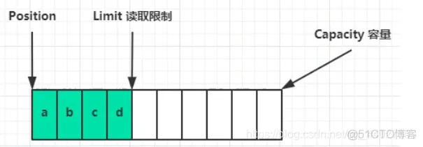

# **Android 获取ByteBuffer长度 读取bytebuffer里的内容**

## ByteBuffer

ByteBuffer在Nio中用的比较多，所以需要对它也要有一定的了解

ByteBuffer的使用步骤：

向buffer中写入数据，例如调用channel.read(buffer);
调用buffer.flip()切换至读模式
从buffer中读取数据，例如调用buffer.get();
调用buffer.clear()或者compact()切换至写状态
重复1~4步骤


那么为什么使用要按照这个步骤去使用ByteBuffer并且要切换读写模式嘞？

内部结构
首先ByteBuffer有以下几个属性：

Capacity -----> Buffer的容量
position -----> 读写指针
limit -----> 读写限制
首先刚开始时，创建Buffer时是这个样子的。capacity肯定是指向最后的位置，limit刚开始表示写入限制，也是最后的位置，position是开头。


写模式下，position表示写入的位置，limit等于容量，下图表示写入四个字节后的状态


假如就只有这几个字节，写入完后，再进行filp()将buffer切换为读模式后，limit就变为的读取限制




读取完四个字节后


数据读取完后再调用clear()方法切换回写模式，这里只是动了指针，数据其实还是在里面，后面再写会覆盖以前的内容


另一种切换为写状态。compact()方法，是把未读取完的部分向前移动，然后切换至写模式


常用方法
创建相关：

| ByteBuffer.allocate(int number);       | 创建一个容量为number的一个字节缓冲对象，这里的容量就固定了   |
| -------------------------------------- | ------------------------------------------------------------ |
| ByteBuffer.allocateDirect(int number); | 也是分配容量，区别是上面的方法创建的ByteBuffer是堆内存，而这里使用的是计算机的字节内存，堆内存读写效率低，而且会收到垃圾回收机制的影响。而使用直接内存的ByteBuffer读写效率高，分配速度较慢，使用完如果不合理释放会造成内存泄漏。 |


切换相关：

| buffer.filp();    | 切换为读模式                               |
| ----------------- | ------------------------------------------ |
| buffer.clear();   | 切换为写模式                               |
| buffer.compact(); | 把未读取完的部分向前移动，然后切换至写模式 |


读取相关

| buffer.get();                    | 从buffer中读取数据，使用无参的方法会使用指针往后面移动，也可以往方法中传一个 int类型的数据 表示指针的索引，这种就直接读取这个位置的值，但是不会移动指针 |
| -------------------------------- | ------------------------------------------------------------ |
| buffer.get(Byte[] byte);         | 一次性读取多个数据，读取的数据个数为字节数组的容量，会移动position指针。 |
| buffer.rewind();                 | 将数据指针position变为0，也就是可以实现读取完后还能重新读取一遍数据。 |
| buffer.make(); + buffer.reset(); | 通常这两个方法结合起来使用，是对rewind()方法的一个增强，rewind()方法只能是让 position变为0重新读取，如果想反复读取中间的一些数据就可以使用这两个方法 |
| channel.write(Buffer buffer);    | 从buffer中读取数据,然后通过channel写出                       |


写入相关

| buffer.put();                | 往buffer中写数据 |
| ---------------------------- | ---------------- |
| channel.read(Buffer buffer); | 往buffer中写数据 |


字符串与ByteBuffer互转

```
package com.hs.netty;

import java.nio.ByteBuffer;
import java.nio.charset.StandardCharsets;

public class ByteBufferToStringTest {
    public static void main(String[] args) {
        // 字符串转换为ByteBuffer
        // 1. 传统方式，直接将字符串先转换为字节数组然后再添加
        // 添加进去这几个字符后还是写的状态，手动改为读模式后才能读取数据
        ByteBuffer buffer = ByteBuffer.allocate(16);
        buffer.put("hello".getBytes());
        buffer.flip();
        System.out.println("第一种方式读取的字符：" + buffer.get());
        // 2. Charset方式，它本身就是一种字符集类，可以处理字符串和ByteBuffer之间的转换
        // 将字符串添加进ByteBuffer后会自动切换为读模式
        ByteBuffer buffer1 = StandardCharsets.UTF_8.encode("Hello...");
        System.out.println("第二种方式读取的字符：" + buffer1.get());
        // 3. wrap 它是nio提供的一个工具类，用来字节数组与ByteBuffer之间转换
        // 也会再添加完成后自动切换为读模式
        ByteBuffer buffer2 = ByteBuffer.wrap("hello..".getBytes());

        // 反之，ByteBuffer转字符串。可以使用Charset转换，当把数据读取完后 ByteBuffer还是读的状态
        String str1 = StandardCharsets.UTF_8.decode(buffer).toString();
    }
}
```


## 小案例

解决黏包半包问题

```
package com.hs.netty;

import java.nio.ByteBuffer;
import java.nio.charset.StandardCharsets;

/**
 * ByteBuffer的测试，接收数据的黏包与丢包
 * 题目如下：
 * 假设网络上有多条数据发送给服务器，数据之间使用/n分割，但由于某些原因这些数据在接收时，被进行了重新组合。
 * 原消息如下：
 * Hello,World/n
 * I'm hushang/n
 * How are you?/n
 * 变成了下面两个ByteBuffer
 * Hello,World/nI'm hushang/nHo
 * w are you?/n
 * 现将错乱的数据恢复成按/n分割的数据
 *
 * @author hs
 * @date 2021/07/08
 */
public class ByteBufferContestTest {

    private static ByteBuffer messageBuffer;

    public static void main(String[] args) {

        //初始化存放每条正确消息的buffer
        messageBuffer = ByteBuffer.allocate(20);

        //创建出题目要求的情况
        ByteBuffer buffer = ByteBuffer.allocate(32);
        buffer.put("Hello,World\nI'm hushang\nHo".getBytes());
        split2(buffer);
        buffer.put("w are you?\n".getBytes());
        split2(buffer);
    }
    
    /**
     * 思路：
     * 首先获取老buffer的长度，然后遍历，通过get(i)获取每个位置的字节，再进行判断，如果为换行的话就创建一个新buffer
     * 然后利用当前i + 1 - 起始位置(position) 求出新buffer的应该存储数据的长度。然后再用获取一个字符 添加一个字符。
     * 最后还有使用compact()方法将未读取的两个字符放到buffer前面去，然后切换为写模式。
     * @param buffer
     */
    private static void split2(ByteBuffer buffer){
        buffer.flip();
        for (int i = 0; i < buffer.limit(); i++) {
            // 新buffer的长度
            int length = i + 1 - buffer.position();
            if (buffer.get(i) == '\n'){
                ByteBuffer target = ByteBuffer.allocate(length);
                for (int j = 0 ; j < length ; j++){
                    target.put(buffer.get());
                }
                // 输出新buffer
                target.flip();
                System.out.println(StandardCharsets.UTF_8.decode(target).toString());
            }
        }
        buffer.compact();
    }
}
```


Android 获取ByteBuffer长度 读取bytebuffer里的内容
https://blog.51cto.com/u_16213560/6979335