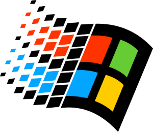

# JavaScript 简介

> JavaScript (JS) is a lightweight, interpreted, or just-in-time compiled programming language with first-class functions. While it is most well-known as the scripting language for Web pages, many non-browser environments also use it, such as Node.js, Apache CouchDB and Adobe Acrobat. JavaScript is a prototype-based, multi-paradigm, single-threaded, dynamic language, supporting object-oriented, imperative, and declarative (e.g. functional programming) styles.

## 1 历史

### 1.1 起源

JS诞生于1995年，当时网景公司（Netscape）开发的Navigator浏览器拥有着世界第一的市场占有率。网景公司一时风光无两。

当时的浏览器只能只能运行包含了HTML和CSS的静态网页，网页就相当于是报纸或杂志的电子版，没有任何的动态交互行为。网景公司预见到静态页面并不能够满足市场的需求，于是决定开发一款可以直接运行在浏览器端的编程语言以增加网页的动态交互功能。因此在1995年，Netscape决定在自家浏览器中添加一种脚本语言。

起初网景公司选择了两种方案，第一、和Sun公司和做直接在浏览器中嵌入Java。第二、聘请了一个程序员布兰登·艾克，让他在浏览器中嵌入Scheme语言，由于种种原因两种方案都没有实现。网景公司改变了方向，转而尝试开发一种新的编程语言，他们希望这种编程语言的语法类似于Java。开发新语言的任务落在了上文提到的布兰登·艾克身上。

艾克在很短的时间就完成了语言的设计，并于1995年9月首次发布测试版并且命名为LiveScript，12月发布正式版时又被重命名为JavaScript。为什么命名为JavaScript呢？因为Java当时比较火，这里可以理解为网景公司蹭了一下Java的热度。

### 1.2 战争

同年微软公司推出了新版本的IE，并引发了第一次浏览器大战。微软更是不讲武德的直接对JavaScript解释器进行了逆向工程并创建了IE版的JavaScript解释器，并且命名为JScript。JScript的功能和JavaScript一致，但实现方式上却不尽相同。这导致了同样的一个网页在不同的浏览器中有了不同的显示效果，于是浏览器的兼容问题出现了，网页工程师们的痛苦生活开始了。

为了促进JavaScript的标准化，网景公司向欧洲计算机制造商协会（ECMA International）提交了JavaScript，希望能由其制定发布JavaScript的语言规范。于是1997年6月，ECMAScript语言规范正式发布。1998年6月ECMAScript2发布，1999年12月ECMAScript3发布。与此同时，微软已经完全取得了第一次浏览器大战的胜利。IE浏览器的市占率达到了95%，JScript成为了JavaScript的事实标准，微软不再和ECMA合作，因此ECMAScript4被迫中止。

### 1.3 转折

这一情况持续到了2008年，谷歌推出了Chrome浏览器，其V8引擎的执行速度远远超过了其他的竞争对手。Chrome的出现使得微软的反抗者们看到了希望，他们在2008年开了一个小会，为了推动语言的发展，又将网页标准的制订工作推上了日程，于是2009年12月ECMAScript5标准发布，于此同时Nodes.js的发布使得JS在浏览器以外的地方大放异彩。自此开始，JavaScript进入了新的纪元。

自2015年起，ES标准开始固定在每年的6月份更新，并以年份命名。ES2015（ES6）、ES2016（ES7）一直到今天的ES2022（ES13）。

## 2 特点

JavaScript是一门非常有特点的编程语言。很多语言的特点在它身上都有所提现，这里我们只罗列了它众多特点中的一小部分。

### 2.1 解释型

JavaScript是一门解释型编程语言，解释型编程语言指代码不需要手动编译，而是通过解释器边编译边执行。所以要运行JS，我们必须现在计算机中安装JS的解释器。像是我们使用的浏览器都已经自动集成了JS的解释器（我们也称它是JS引擎）。Node.JS也是JS引擎，它使得JS可以直接在计算机中运行。无论是浏览器还是Node.js都需要遵循ECMAScript（ES）标准。

### 2.2 函数式编程

在JavaScript中函数是一等公民，它可以像其他类型的值一样赋值给任意变量，也可以作为参数传递给其他函数。所以在JS中函数是非常非常重要，通过函数式编程可以编写出功能强大又灵活的代码。

### 2.3 单线程

JavaScript是一个单线程的编程语言。简言之，JS同一时间只能做一件事，一件事完成才会继续做另一件事。单线程降低了JS代码的复杂度，也在某些场景下使得JS性能变差，所以JS又为我们提供了异步的编程方式，以提高代码的运行速度。

### 2.4 面向对象

几乎所有的现代的编程语言都是面向对象的编程语言，JS也不例外。所谓的面向对象，指将一组相关的功能（数据）统一封装到一个对象中，使用功能时无需考虑其实现的细节，直接找到对应的对象即可完成功能的调用。

## 3 扩展ES

ECMAScript只是为我们定义最基本的语法，像是数据类型（原始值、对象）、运算符、流程控制语句等内容。为了使JS可以适用于不同的场景，在不同的JS解释器中还为我们提供了不同的扩展以增强其功能。像是浏览器中的DOM、BOM使得我们可以通过JS操作网页和浏览器。NodeJS中的fs模块可以使我们直接操作计算机系统中的各种文件。所以我们学习JS时，除了要学习ES标准以外，还要学习它的各种扩展，才能在不同的环境中发挥出JS的最大威力。

JS的重要思想是不报错，由于他是一门弱类型语言，所以很经常发生数据类型转换来保证代码不报错。

