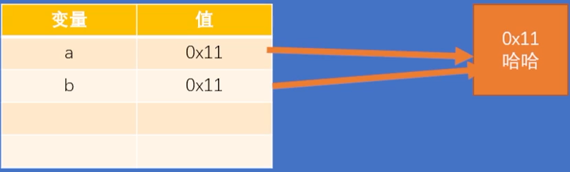
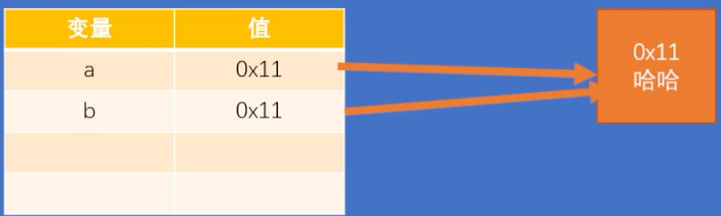
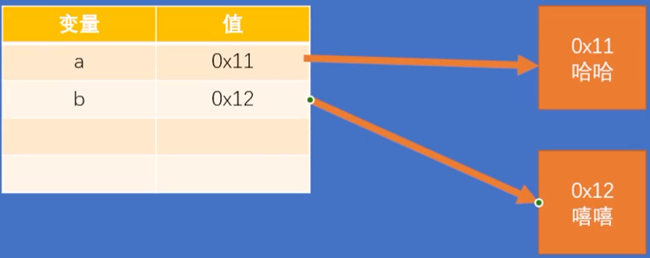

# javascript 字面量和变量

## 1 字面量

字面量其实就是一个值，它所代表的含义就是它字面的意思, 比如：1 2 3 4 100 "hello" true null ..... 

在 js 中所有的字面量都可以直接使用，但是直接使用字面量并不方便


## 2 变量

变量可以用 “存储” 字面量, 并且变量中存储的字面量可以随意的修改, 

通过变量可以对自变量进行描述，并且变量比较方便修改


### 声明变量

可以使用 let

```javascript
let x // 声明一个变量, 但是没有赋值
console.log(x) // undefine
```

也可以使用 var

```javascript
var e
var f, g, h
```

区别: 

var 是旧版本的变量声明方式, 没有块作用域

let 是新版本的变量声明方式, 有块作用域

推荐使用 let


### 赋值

```javascript
let x // 声明一个变量, 但是没有赋值
x=80 // 给变量赋值
console.log(x) // 80
```

```javascript
let a
let b, c, d

a = 10
a = "hello"
a = true

console.log(a)
```

Javascript是**动态类型**的语言, **变量是没有类型的**, 一个变量可以依次存入 数值, 布尔值, 字符串 等都是可以的


### 声明和赋值同时进行

```javascript
let x = 80 // 声明一个变量并且同时赋值
console.log(x) // 80
```


### 修改变量的值

```javascript
let x // 声明一个变量, 但是没有赋值
x=80 // 给变量赋值
x='haha' // 修改变量的值
console.log(x) // haha
```


### 变量法对值的含义进行描述

```javascript
let age		// age 表示年龄
age = 80
age = 81
console.log(age)
```


### 变量的存储结构

变量中并不存储任何值，而是存储值的内存地址！

```javascript
let a = '哈哈'
let b = '哈哈'
```



执行流程:

1 判断内存中是否有 "哈哈", 发现没有, 则创建一个 "哈哈" 字符串对象, 地址为 0x11

2 a 指向 0x11 内存地址, 也就是变量 a 的值为 "哈哈"

3 在判断内存中是否有 "哈哈" , 发现有, 则将地址 0x11 给 b , 则 b 指向内存地址也为 0x11, 即变量 b 的值也为 "哈哈"


## 3 常量

在JS中，使用const声明常量，常量只能赋值一次，重复赋值会报错

在JS中除了常规的常量外，有一些对象类型的数据我们也会声明为常量

```javascript
const PI = 3.1415926
// PI = 10 报错, 不能修改常量的值
```


## 4 标识符

在JS中，所有可以由我们自主命名的内容，都可以认为是一个标识符, 像 变量名 函数名 类名...
使用标识符需要遵循如下的命名规范：

1 标识符只能含有字母、数字、下划线、$，

2 不能以数字开头和保留字

https://developer.mozilla.org/en-US/docs/Web/JavaScript/Reference/Lexical_grammar#keywords

3 不建议使用内置的函数或类名作为变量名, 如 alert


### 命名规范

通常会使用驼峰命名法

#### 小驼峰 :

首字母小写，每个单词开头大写

maxlength --> maxLength

borderleftwidth --> borderLeftWidth


#### 大驼峰

首字母大写，每个单词开头大写

maxlength --> MaxLength

类名会使用大驼峰命名法


#### 全部大写

常量的字母会全部大写

MAX_LENGTH


## 5 原始值

JS中原始值一共有七种

1 Number
2 BigInt
3 String
4 Boolean
5 Null
6 Undefined
7 Symbol


七种原始值是构成各种数据的基石
原始值在JS中是不可变类型，一旦创建就不能修改

```javascript
let a = '哈哈'
let b = '哈哈'
```



```javascript
b = '嘻嘻'
```



改变的是指向的对象


### 1 数值（Number）

在JS中所有的整数和浮点数都是Number类型, JS中的数值并不是无限大的，当数值超过一定范围后会显示近似值

```javascript
let a = 10 	// 可以正确表示
a = 10.5	// 可以正确表示
a = 3.14	// 可以正确表示
a = 9999999999999991111111111111111111				// 不能正确表示, 只能显示为近似值
a = 0.0000000000000000000000000000000000001			// 不能正确表示, 只能显示为近似值
```

精度比较高的运算时要十分注意

```javascript
a = 0.1 + 0.2 // 结果不是0.3 , 而是近似值
```

#### 进制

二进制 0b
八进制 0o
十六进制 0x

```javascript
a = 0b1010
a = 0o10
a = 0xff
```


#### Infinity 

是一个特殊的数值表示无穷

```javascript
a = 99999 ** 99999 // 太大了, 显示为 Infinity
a = Infinity	// 无穷大
```


#### NaN

NaN 也是一个特殊的数值，表示非法的数值

```javascript
a = 1 - "a" // NaN (Not a Number)
a = NaN
```


### 2 大整数（BigInt）

大整数用来表示一些比较大的整数
大整数使用n结尾，它可以表示的数字范围是无限大 ( 但还是受内存限制 )

```javascript
a = 99999999999999999999999999999999999999999999999999n
```


### 3 字符串（String）

在JS中使用单引号或双引号来表示字符串
转义字符 `\`

| 字面值 | 转义后的字符串 |
| ------ | -------------- |
| `\"`   | `"`            |
| `\'`   | `'`            |
| `\\`   | ` \`           |
| `\t`   | 制表符         |
| `\n`   | 换行           |

```javascript
let a = "Hello"
a = "你好"
a = '这是一个"字\\\\符串'
a = "呵呵\t哈哈哈"
a = "呵呵\n哈哈哈"
a = "今天天气真不错！"
```


模板字符串

使用反单引号 ` 来表示模板字符串

模板字符串中可以嵌入变量

```javascript
let name = "猪八戒"
let str = `你好，${name}`
let b = 10
console.log(`b = ${b}`)
```


### 4 布尔值（Boolean）

布尔值主要用来进行逻辑判断

布尔值只有两个true 和 false

使用typeof检查一个布尔值时会返回 "boolean"


### 5 空值 （Null）

空值用来表示空对象

空值只有一个: null

**使用typeof无法检查空值**,  使用typeof检查一个空值时会返回"object" , 这时早期 js 留下的 bug


### 6 未定义（Undefined）

当声明一个变量而没有赋值时，它的值就是Undefined

Undefined类型的值只有一个就是 undefined

使用typeof检查一个Undefined类型的值时，会返回 "undefined"


### 7 符号（Symbol）

用来创建一个唯一的标识

使用typeof检查符号时会返回 "symbol"

```javascript
c = Symbol() // 调用Symbol()创建了一个符号
```


## 6 类型检查

typeof 运算符

typeof用来检查不同的值的类型, 它会根据不同的值返回不同的结果, 

注意: 

typeof 检查的是**变量的值**的类型, 变量是没有类型的

运算符的返回值是一个**字符串**

```javascript
let a = 10
console.log(typeof a) // "number"

let b = 10n
console.log(typeof b) // "bigint"

b = NaN
console.log(typeof b) // "number"

b = Infinity
console.log(typeof b) // "number"

let c = "5"
console.log(typeof c) // string

c = 'hhh'
console.log(typeof c) // string

c = `aaa`
console.log(typeof c) // string

c = true
console.log(typeof c) // boolean

c = null
console.log(typeof c) // object

c = undefined
console.log(typeof c) // undefined

c = Symbol()
console.log(typeof c)	// symbol
```


## 7 类型转换

类型转换指将一种数据类型转换为其他类型

将其他类型转换为（字符串、数值和布尔值）


### 1 转换为字符串

#### 1 toString

1 调用 `toString()` **方法**将其他类型转换为字符串, 注意 toString() 方法是根据调用方的值**创建**一个字符串 ( 返回一个字符串 ) , 调用方不变

怎么调用xxx的yyy方法

```javascript
xxx.yyy()
```

由于 `null` 和 `undefined` 中没有 `toString()` , 所以对这两个东西调用 `toString()` 时会报错

```javascript
let a = 10
a = a.toString()
console.log(typeof a, a)	// string 10

a = true
a = a.toString()
console.log(typeof a, a)	// string true

a = 11n
a = a.toString()
console.log(typeof a, a)	// string 11

a = null
a = a.toString()			// Uncaught TypeError: Cannot read properties of null (reading 'toString')
console.log(typeof a, a)	

a = undefined
a = a.toString()			// Uncaught TypeError: Cannot read properties of undefined (reading 'toString')
console.log(typeof a, a)
```


#### 2 String()

调用 `String()` 函数将其他类型转换( 根据参数值**创建** )为字符串
调用 `xxx` **函数**

```javascript
xxx()
```

原理：
对于拥有 `toString()` 方法的值调用 `String()` 函数时，实际上就是在调用 `toString()` 方法
对于 `null`，则直接转换为 "null"
对于 `undefined`，直接转换为 "undefined"

```javascript
let a = 10
a = String(a)
console.log(typeof a, a)	// string 10

a = true
a = String(a)
console.log(typeof a, a)	// string true

a = 11n
a = String(a)
console.log(typeof a, a)	// string 11

a = null
a = String(a)
console.log(typeof a, a)	// string null

a = undefined
a = String(a)
console.log(typeof a, a)	// string undefined
```

通常会使用 `String()` 函数将其他类型转换为 String

toString() 和 String() 都是强制类型转换/显示类型转换, 更加常用的是自动类型转换/隐式类型转换


### 2 转换为数值

将其他的数据类型转换为数值

#### 1 Number()

使用Number()函数来将其他类型转换为数值

字符串

如果字符串是一个合法的数字，则会自动转换为对应的数字

如果字符串不是合法数字，则转换为NaN

如果字符串是空串或纯空格的字符串，则转换为0


布尔值：

true转换为1，false转换为0


null 转换为 0

undefined 转换为 NaN

```javascript
let a = '123'
a = Number(a)
console.log(typeof a, a)		// number 123

a = '3.1415926'
a = Number(a)
console.log(typeof a, a)		// number 3.1415926

a = 'abc'
a = Number(a)
console.log(typeof a, a)		// number NaN

a = '11px'
a = Number(a)
console.log(typeof a, a)		// number NaN

a = ''
a = Number(a)
console.log(typeof a, a)		// number 0

a = '    '
a = Number(a)
console.log(typeof a, a)		// number 0

a = true
a = Number(a)
console.log(typeof a, a)		// number 1

a = false
a = Number(a)
console.log(typeof a, a)		// number 0

a = null
a = Number(a)
console.log(typeof a, a)		// number 0

a = undefined
a = Number(a)
console.log(typeof a, a)		// number NaN
```


#### 2 parseInt() 

专门用来将字符串转换为数值的两个方法     

`parseInt()` —— 将一个字符串转换为一个整数

解析时，会自左向右读取一个字符串，直到读取到字符串中所有的有效的整数

也可以使用 `parseInt()` 来对一个数字进行取整

```javascript
let b = '123px'
b = parseInt(b)
console.log(typeof b, b)		// number 123

b = 'a123'
b = parseInt(b)
console.log(typeof b, b)		// number NaN

b = '123.45'
b = parseInt(b)
console.log(typeof b, b)		// number 123
```


#### 3 parseFloat()

`parseFloat()` —— 将一个字符串转换为浮点数 

解析时，会自左向右读取一个字符串，直到读取到字符串中所有的有效的小数

```javascript
let b = '123px'
b = parseFloat(b)
console.log(typeof b, b)		// number 123

b = 'a123'
b = parseFloat(b)
console.log(typeof b, b)		// number NaN

b = '123.45'
b = parseFloat(b)
console.log(typeof b, b)		// number 123.45
```


### 3 转转为布尔值

使用 `Boolean()` 函数来将其他类型转换为布尔值

转换的情况：

数字：

`0` 和 `NaN` 转换为 `false`, 其余是 `true`


字符串：

空串( `""` `''` ``) 转换为 `false` , 其余是 `true`


`null` 和 `undefined` 都转换为 `false`

对象：对象会转换为 `true`


所有表示空性的没有的错误的值都会转换为 `false` ：

0、NaN、空串( `''` `""` )、null、undefined


```javascript
let a = 1
a = Boolean(a)
console.log(typeof a, a)	// boolean true

a = -1
a = Boolean(a)
console.log(typeof a, a)	// boolean true

a = 0
a = Boolean(a)
console.log(typeof a, a)	// boolean false

a = NaN
a = Boolean(a)
console.log(typeof a, a)	// boolean false

a = Infinity
a = Boolean(a)
console.log(typeof a, a)	// boolean true

a = 'abc'
a = Boolean(a)
console.log(typeof a, a)	// boolean true

a = 'true'
a = Boolean(a)
console.log(typeof a, a)	// boolean true

a = 'false'
a = Boolean(a)
console.log(typeof a, a)	// boolean true

a = ''
a = Boolean(a)
console.log(typeof a, a)	// boolean false

a = " "
a = Boolean(a)
console.log(typeof a, a)	// boolean true

a = null
a = Boolean(a)
console.log(typeof a, a)	// boolean false

a = undefined
a = Boolean(a)
console.log(typeof a, a)	// boolean false
```

