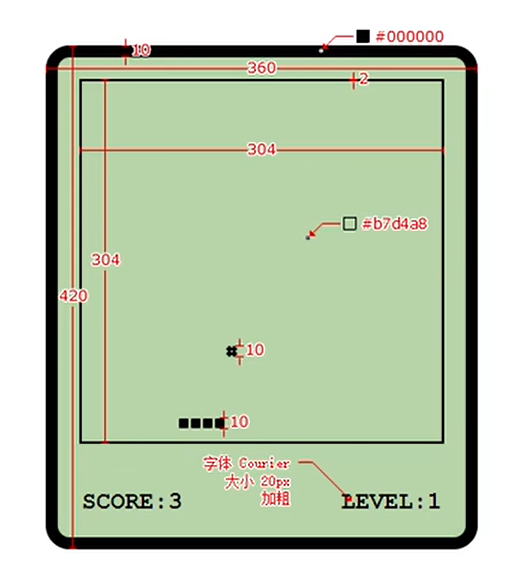

# javascript BOM


## 01 BOM对象

BOM 浏览器对象模型

BOM为我们提供了一组对象，通过这组对象可以完成对浏览器的各种操作的 BOM对象：

Window —— 代表浏览器窗口（全局对象）
Navigator —— 浏览器的对象（可以用来识别浏览器）
Location —— 浏览器的地址栏信息
History —— 浏览器的历史记录（控制浏览器前进后退）
Screen —— 屏幕的信息

BOM对象都是作为 window 对象的属性保存的，所以可以直接在JS中访问这些对象

```javascript
console.log(history)
```


## 02 navigator

Navigator —— 浏览器的对象（可以用来识别浏览器）
userAgent 返回一个用来描述浏览器信息的字符串

### 示例: 获取浏览器信息

```javascript
console.log(navigator.userAgent)

let sBrowser
const sUsrAg = navigator.userAgent

// The order matters here, and this may report false positives for unlisted browsers.

if (sUsrAg.indexOf("Firefox") > -1) {
    sBrowser = "Mozilla Firefox"
    // "Mozilla/5.0 (X11; Ubuntu; Linux x86_64; rv:61.0) Gecko/20100101 Firefox/61.0"
} else if (sUsrAg.indexOf("SamsungBrowser") > -1) {
    sBrowser = "Samsung Internet"
    // "Mozilla/5.0 (Linux; Android 9; SAMSUNG SM-G955F Build/PPR1.180610.011) AppleWebKit/537.36 (KHTML, like Gecko) SamsungBrowser/9.4 Chrome/67.0.3396.87 Mobile Safari/537.36
} else if (
    sUsrAg.indexOf("Opera") > -1 ||
    sUsrAg.indexOf("OPR") > -1
) {
    sBrowser = "Opera"
    // "Mozilla/5.0 (Macintosh; Intel Mac OS X 10_14_0) AppleWebKit/537.36 (KHTML, like Gecko) Chrome/70.0.3538.102 Safari/537.36 OPR/57.0.3098.106"
} else if (sUsrAg.indexOf("Trident") > -1) {
    sBrowser = "Microsoft Internet Explorer"
    // "Mozilla/5.0 (Windows NT 10.0; WOW64; Trident/7.0; .NET4.0C; .NET4.0E; Zoom 3.6.0; wbx 1.0.0; rv:11.0) like Gecko"
} else if (sUsrAg.indexOf("Edge") > -1) {
    sBrowser = "Microsoft Edge (Legacy)"
    // "Mozilla/5.0 (Windows NT 10.0; Win64; x64) AppleWebKit/537.36 (KHTML, like Gecko) Chrome/58.0.3029.110 Safari/537.36 Edge/16.16299"
} else if (sUsrAg.indexOf("Edg") > -1) {
    sBrowser = "Microsoft Edge (Chromium)"
    // Mozilla/5.0 (Windows NT 10.0; Win64; x64) AppleWebKit/537.36 (KHTML, like Gecko) Chrome/91.0.4472.124 Safari/537.36 Edg/91.0.864.64
} else if (sUsrAg.indexOf("Chrome") > -1) {
    sBrowser = "Google Chrome or Chromium"
    // "Mozilla/5.0 (X11; Linux x86_64) AppleWebKit/537.36 (KHTML, like Gecko) Ubuntu Chromium/66.0.3359.181 Chrome/66.0.3359.181 Safari/537.36"
} else if (sUsrAg.indexOf("Safari") > -1) {
    sBrowser = "Apple Safari"
    // "Mozilla/5.0 (iPhone; CPU iPhone OS 11_4 like Mac OS X) AppleWebKit/605.1.15 (KHTML, like Gecko) Version/11.0 Mobile/15E148 Safari/604.1 980x1306"
} else {
    sBrowser = "unknown"
}

alert(`You are using: ${sBrowser}`)
```


## 03 location

location 表示的是浏览器地址栏的信息
可以直接将location的值修改为一个新的地址，这样会使得网页发生跳转


跳转到一个新的地址

```javascript
location.assign() 
```

```javascript
location.assign("https://www.lilichao.com")
```


跳转到一个新的地址（无法通过回退按钮回退）

```javascript
location.replace() 
```

```javascript
location.replace("https://www.lilichao.com")
```


刷新页面，可以传递一个true来强制清缓存刷新

```javascript
location.reload() 
```

```javascript
location.reload(true)
```


获取当前地址

```javascript
location.href 
```

```javascript
console.log(location.href)
```

```javascript
location = "https://www.lilichao.com"
```


## 04 history

回退按钮

```javascript
history.back()
```


前进按钮

```javascript
history.forward()
```


可以向前跳转也可以向后跳转

```javascript
history.go()
```

```javascript
history.go(-1) // 相当于回退
```


访问历史的数量

```javascript
history.length
```


## 05 定时器

定时器的本质，就是在指定时间后将函数添加到消息队列中

```javascript
console.time()
setTimeout(function(){
    console.timeEnd()
    console.log("定时器执行了~")
}, 3000)

// 使程序卡6s
const begin = Date.now()
while (Date.now() - begin < 6000) {}
```


setInterval() 每间隔一段时间就将函数添加到消息队列中
但是如果函数执行的速度比较慢，它是无法确保每次执行的间隔都是一样的

```javascript
console.time("间隔")
setInterval(function(){
    console.timeEnd("间隔")
    console.log("定时器执行了~~")
    alert("定时器执行~")
    console.time("间隔")
}, 3000)
```


希望可以确保函数每次执行都有相同间隔

```javascript
console.time("间隔")
setTimeout(function fn() {
    console.timeEnd("间隔")
    alert("哈哈")
    console.time("间隔")
    // 在setTimeout的回调函数的最后，在调用一个setTimeout
    setTimeout(fn, 3000)
}, 3000)
```


```javascript
setTimeout(() => {
    console.log(111)
}, 0)

console.log(222)
```

先输出 222 再输出 111

setTimeout 会将任务放入消息队列, 当脚本中的所有代码执行完成后才会执行队列中的任务


### 示例: 轮播图

```html
<!DOCTYPE html>
<html lang="zh">
    <head>
        <meta charset="UTF-8" />
        <meta http-equiv="X-UA-Compatible" content="IE=edge" />
        <meta name="viewport" content="width=device-width, initial-scale=1.0" />
        <title>Document</title>
        <style>
            * {
                margin: 0;
                padding: 0;
            }

            img {
                vertical-align: top;
            }

            ul {
                list-style: none;
            }

            .outer {
                width: 640px;
                height: 390px;
                margin: 100px auto;
                position: relative;
            }

            .img-list {
                height: 390px;
            }

            .img-list li {
                position: absolute;
                opacity: 0;
                transition: opacity 1s;
            }

            li.current {
                z-index: 1;
                opacity: 1;
            }

            /* 
                设置两个箭头的样式
            */
            .prev-next a {
                font-size: 60px;
                color: #fff;
                font-weight: bold;
                text-decoration: none;
                position: absolute;
                height: 60px;
                top: 0;
                bottom: 0;
                margin: auto;
                z-index: 2;
                opacity: 0.5;
            }

            .prev-next a:hover {
                opacity: 1;
            }

            #next {
                right: 0;
            }

            /* 
                设置导航点的样式
            */
            .dot {
                position: absolute;
                display: flex;
                justify-content: center;
                z-index: 3;
                left: 0;
                right: 0;
                bottom: 5px;
                margin: auto;
            }
            .dot a {
                width: 20px;
                height: 20px;
                margin: 5px;
                border-radius: 50%;
                background-color: #fff;
                opacity: 0.5;
            }

            .dot a:hover,
            .dot .active {
                opacity: 1;
            }
        </style>
    </head>
    <body>
        <div class="outer">
            <ul class="img-list">
                <li class="current">
                    <a href="#">
                        
                    </a>
                </li>
                <li>
                    <a href="#">
                        
                    </a>
                </li>
                <li>
                    <a href="#">
                        
                    </a>
                </li>
                <li>
                    <a href="#">
                        
                    </a>
                </li>
                <li>
                    <a href="#">
                        
                    </a>
                </li>
            </ul>

            <!-- 
                添加切换按钮
             -->

            <div class="prev-next">
                <a id="prev" href="javascript:;"><</a>
                <a id="next" href="javascript:;">></a>
            </div>

            <!-- 
                导航点
             -->
            <div class="dot">
                <a class="active" href="javascript:;"></a>
                <a href="javascript:;"></a>
                <a href="javascript:;"></a>
                <a href="javascript:;"></a>
                <a href="javascript:;"></a>
            </div>
        </div>

        <script>
            /* 
                获取5个小点
            
            */
            const dots = Array.from(document.querySelectorAll(".dot a"))
            const imgArr = Array.from(document.querySelectorAll(".img-list li"))

            document.addEventListener("click", (event) => {
                const index = dots.indexOf(event.target)

                if (index !== -1) {
                    changeImg(index)
                }
            })

            /* 
                自动切换图片
            */

            const toggleChange = (function () {
                let timer = null

                return () => {
                    // 判断timer是否是null
                    if (timer === null) {
                        timer = setTimeout(function auto() {
                            changeImg("next")
                            timer = setTimeout(auto, 3000)
                        }, 3000)
                    } else {
                        clearTimeout(timer)
                        timer = null
                    }
                }
            })()

            toggleChange()

            // 获取outer
            const outer = document.getElementsByClassName("outer")[0]
            outer.onmouseenter = () => {
                toggleChange()
            }

            outer.onmouseleave = () => {
                toggleChange()
            }

            /* 
                点击按钮切换图片
            */

            const prev = document.getElementById("prev")
            const next = document.getElementById("next")

            prev.onclick = () => {
                changeImg("prev")
            }

            next.onclick = () => {
                changeImg("next")
            }

            /* 
                changeImg 用来切换图片
                    参数：
                        dir 切换图片的方向
                            next
                            prev
            
            */
            function changeImg(dir) {
                // 获取当前显示的图片
                const current = document.querySelector(".img-list .current")

                // 获取下一个图片
                let next
                if (dir === "next") {
                    next = current.nextElementSibling || imgArr[0]
                } else if (dir === "prev") {
                    next = current.previousElementSibling || imgArr.at(-1)
                } else if (typeof dir === "number") {
                    next = imgArr[dir]
                }

                // 获取要显示的图片的索引
                const index = imgArr.indexOf(next)

                // 切换显示状态
                current.classList.remove("current")
                next.classList.add("current")

                // 切换active
                const currentActive = document.querySelector(".active")
                currentActive.classList.remove("active")

                // 获取到当前要显示的小点
                dots[index].classList.add("active")
            }
        </script>
    </body>
</html>
```


### 示例: 贪食蛇



```html
<!DOCTYPE html>
<html lang="zh">
    <head>
        <meta charset="UTF-8" />
        <meta http-equiv="X-UA-Compatible" content="IE=edge" />
        <meta name="viewport" content="width=device-width, initial-scale=1.0" />
        <title>Document</title>
        <style>
            * {
                margin: 0;
                padding: 0;
                box-sizing: border-box;
            }

            #main {
                height: 420px;
                width: 360px;
                border: 10px #000 solid;
                background-color: #b7d4a8;
                border-radius: 20px;
                margin: 50px auto;
            }

            #stage {
                width: 304px;
                height: 304px;
                border: 2px solid #000;
                margin: 20px auto;
                position: relative;
            }

            #snake > div {
                width: 10px;
                height: 10px;
                background-color: #000;
                position: absolute;
                border: 1px solid #b7d4a8;
            }

            #food {
                width: 10px;
                height: 10px;
                position: absolute;
                top: 100px;
                left: 120px;
                display: flex;
                flex-flow: wrap;
            }

            #food > div {
                width: 5px;
                height: 5px;
                background-color: #000;
                transform: rotate(45deg);
            }

            #info {
                width: 304px;
                margin: 0px auto;
                display: flex;
                justify-content: space-between;
                font: bold 20px courier;
            }
        </style>
    </head>
    <body>
        <div id="main">
            <div id="stage">
                <div id="snake">
                    <div></div>
                </div>

                <div id="food">
                    <div></div>
                    <div></div>
                    <div></div>
                    <div></div>
                </div>
            </div>

            <div id="info">
                <div>SCORE:<span id="score">0</span></div>
                <div>LEVEL:<span id="level">1</span></div>
            </div>
        </div>

        <script>
            /*
                1. 禁止掉头
                2. 游戏终止
                3. 记分
            */

            // 获取蛇的容器
            const snake = document.getElementById("snake")
            // 获取蛇的各个部分
            const snakes = snake.getElementsByTagName("div")

            // 获取食物
            const food = document.getElementById("food")

            // 获取分数和level的span
            const scoreSpan = document.getElementById("score")
            const levelSpan = document.getElementById("level")

            // 创建变量存储分数和等级
            let score = 0
            let level = 0


            /*
                食物的坐标应该在0-290之间
            */
            function changeFood() {
                // 生成0-29之间的随机数
                const x = Math.floor(Math.random() * 30) * 10
                const y = Math.floor(Math.random() * 30) * 10

                // 设置食物的坐标
                food.style.left = x + "px"
                food.style.top = y + "px"
            }


            // 定义一个变量用来存储蛇的移动的方向

            let dir

            // 创建一个变量来记录按键的状态
            let keyActive = true

            /*
                绑定按键事件keydown keyup
                    - 键盘事件只能绑定给可以获取焦点的元素或者是document
            */

            const keyArr = ["ArrowUp", "ArrowDown", "ArrowLeft", "ArrowRight"]

            // 创建一个对象
            const reObj = {
                ArrowUp: "ArrowDown",
                ArrowDown: "ArrowUp",
                ArrowLeft: "ArrowRight",
                ArrowRight: "ArrowLeft",
            }

            /*
                游戏禁止掉头：
                    构成的要件：
                        1. 身体超过2
                        2. 不能是相反的方向
                    处理：
                        保持原来的方向不变（不修改dir的值）

            */
            document.addEventListener("keydown", (event) => {
                if (keyActive && keyArr.includes(event.key)) {
                    if (snakes.length < 2 || reObj[dir] !== event.key) {
                        // 设置方向
                        dir = event.key
                        keyActive = false
                    }
                }
            })

            /*
                要使得身体可以和头一起移动，只需要在蛇移动时，变化蛇尾巴的位置

            */

            setTimeout(function move() {
                // 获取蛇头
                const head = snakes[0]

                // 获取蛇头的坐标
                let x = head.offsetLeft
                let y = head.offsetTop

                switch (dir) {
                    case "ArrowUp":
                        // 向上移动蛇
                        y -= 10
                        break
                    case "ArrowDown":
                        // 向下移动蛇
                        y += 10
                        break
                    case "ArrowLeft":
                        // 向左移动蛇
                        x -= 10
                        break
                    case "ArrowRight":
                        // 向右移动蛇
                        x += 10
                        break
                }

                // 检查蛇是否吃到食物
                if (
                    head.offsetTop === food.offsetTop &&
                    head.offsetLeft === food.offsetLeft
                ) {
                    //1.改变食物的位置
                    changeFood()
                    //2.增加蛇的身体
                    snake.insertAdjacentHTML("beforeend", "<div/>")
                    score++
                    scoreSpan.textContent = score

                    // 检查等级
                    if(score % 10 === 0 && level < 14){
                        level++
                        levelSpan.textContent = level+1
                    }
                }

                /*
                    判断游戏是否结束：
                        1.撞墙
                        2.撞自己
                */

                //判断是否撞墙
                if (x < 0 || x > 290 || y < 0 || y > 290) {
                    alert("撞墙了！游戏结束！")
                    // 游戏结束
                    return
                }

                // 判断是否撞到自己
                for (let i = 0; i < snakes.length - 1; i++) {
                    if (
                        snakes[i].offsetLeft === x &&
                        snakes[i].offsetTop === y
                    ) {
                        alert("撞到自己了，游戏结束！")
                        return
                    }
                }

                // 获取尾巴
                const tail = snakes[snakes.length - 1]
                // 移动蛇的位置
                tail.style.left = x + "px"
                tail.style.top = y + "px"
                // 将尾巴移动到蛇头的位置
                snake.insertAdjacentElement("afterbegin", tail)
                keyActive = true

                setTimeout(move, 300 - level * 20)
            }, 300)
        </script>
    </body>
</html>
```

