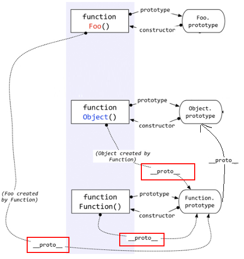

# JS高级

## 基础总结深入

### 数据类型

1. 分类(2大类)

- 基本(值)类型
  - Number: 任意数值
  - String: 任意文本
  - Boolean: true/false
  - undefined: undefined
  - null: null
  - BigInt:大整数
  - Symbol:独一无二的值
- 对象(引用)类型
  - Object: 任意对象
  - Array: 特别的对象类型(下标/内部数据有序)
  - Function: 特别的对象类型(可执行)
  - 这三个都是构造函数
  - Array和Function是Object的实例

1. 判断

- typeof:
  - 可以区别: 基本数据类型+Function
  - 不能区别: 对象(数组和null返回object)
- instanceof
  - 专门用来判断对象的具体类型
  - a instanceof b-->a是不是b的实例
- ===
  - 可以判断: undefined和null

```javascript
// typeof: 返回的是数据类型的字符串表达形式，全为小写
//1. 基本类型
var a
console.log(a, typeof a, a===undefined) // undefined 'undefined' true
console.log(a===typeof a) // false

a = 3
console.log(typeof a === 'number')//true
a = 'atguigu'
console.log(typeof a === 'string')//true
a = true
console.log(typeof a === 'boolean')//true

a = null
console.log(a===null) // true
console.log(typeof a) // 'object'

console.log('--------------------------------')

//2. 对象类型
var b1 = {
  b2: [2, 'abc', console.log],
  b3: function () {
    console.log('b3()')
  }
}
console.log(b1 instanceof Object, typeof b1) // true 'object'
console.log(b1.b2 instanceof Array, typeof b1.b2) // true 'object'
console.log(b1.b3 instanceof Function, typeof b1.b3) // true 'function'

console.log(typeof b1.b2[2]) // 'function'
console.log(b1.b2[2]('abc')) // 'abc' undefined

console.log("---------------------")
//与java中用法一样
class c1{

}
class c2 extends c1{

}
const c=new c2();
console.log(c instanceof c1);//true
```


1. 注意：

   1. undefined与null的区别?
      - undefined代表没有赋值
      - null代表赋值了, 只是值为null
   2. 什么时候给变量赋值为null呢?
      - var a = null //a将指向一个对象, 但对象此时还没有确定
      - a = null //让a指向的对象成为垃圾对象
      - 为什么typeof null=object但null本身为基本数据类型
        - 因为可以让程序员预定义变量，提高代码可读性
   3. 严格区别变量类型与数据类型?

   - js的变量本身是没有类型的, 变量的类型实际上是变量内存中数据的类型
   - 变量类型:
     - 基本类型: 保存基本类型数据的变量
     - 引用类型: 保存对象地址值的变量
   - 数据对象
     - 基本类型
     - 对象类型

### 数据&内存&变量

#### 定义

1. 什么是数据?

- 存储于内存中代表特定信息的'东东', 本质就是0101二进制
- 具有可读和可传递的基本特性
- 万物(一切)皆数据, 函数也是数据
- 程序中所有操作的目标: 数据
  - 算术运算
  - 逻辑运算
  - 赋值
  - 调用函数传参 ...

1. 什么是内存?

- 内存条通电后产生的存储空间(临时的)
- 产生和死亡: 内存条(集成电路板)==>通电==>产生一定容量的存储空间==>存储各种数据==>断电==>内存全部消失
- 内存的空间是临时的, 而硬盘的空间是持久的
- 一块内存包含2个数据
  - 内部存储的数据(一般数据/地址数据)
  - 内存地址值数据
- 内存分类
  - 栈: 全局变量, 局部变量 (空间较小)
  - 堆: 对象 (空间较大)
- 内存：RAM+ROM

1. 什么是变量?

- 值可以变化的量, 由变量名与变量值组成
- 一个变量对应一块小内存, 变量名用来查找到内存, 变量值就是内存中保存的内容

1. 内存,数据, 变量三者之间的关系

- 内存是一个容器, 用来存储程序运行需要操作的数据
- 变量是内存的标识, 我们通过变量找到对应的内存, 进而操作(读/写)内存中的数据

#### 变量存储

问题: var a = xxx, a内存中到底保存的是什么?

- xxx是一个基本数据 a保存值
- xxx是一个对象 a保存地址
- xxx是一个变量 a保存变量的内容

#### 函数传参

问题: 在js调用函数时传递变量参数时, 是值传递还是引用传递

- 只有值传递, 没有引用传递, 传递的都是变量的值, 只是这个值可能是基本数据, 也可能是地址(引用)数据
- 如果后一种看成是引用传递, 那就值传递和引用传递都可以有

#### 内存管理

问题: JS引擎如何管理内存?

1. 内存生命周期
   - 分配需要的内存
   - 使用分配到的内存
   - 不需要时将其释放/归还
2. 释放内存
   - 为执行函数分配的栈空间内存: 函数执行完自动释放
   - 存储对象的堆空间内存: 当内存没有引用指向时, 对象成为垃圾对象, 垃圾回收器后面就会回收释放此内存

### 对象

问题: 什么时候必须使用['属性名']的方式?

- 属性名不是合法的标识名
- 属性名不确定

```javascript
/*情形一: 属性名不是合法的标识名*/
/*需求: 添加一个属性: content-type: text/json */
//  p.content-type = 'text/json' //不正确
p['content-type'] = 'text/json'

/*情形二: 属性名不确定*/
var prop = 'xxx'
var value = 123
// p.prop = value  //不正确
p[prop] = value
console.log(p['content-type'], p[prop])
```


### 函数

- 什么是函数?

  - 用来实现特定功能的, n条语句的封装体
  - 只有函数类型的数据是可以执行的, 其它的都不可以

- 为什么要用函数?

  - 提高复用性
  - 便于阅读交流

- 函数也是对象

  - instanceof Object===true
  - 函数有属性: prototype
  - 函数有方法: call()/apply()
  - 可以添加新的属性/方法

- 函数的3种不同角色

  - 一般函数 : 直接调用
  - 构造函数 : 通过new调用
  - 对象 : 通过.调用内部的属性/方法

- 函数中的this

  - 显式指定谁: obj.xxx()
  - 通过call/apply指定谁调用: xxx.call(obj)
  - 不指定谁调用: xxx() : window
  - 回调函数: 看背后是通过谁来调用的: window/其它

- 匿名函数自调用:

  ```text
  (function(w, obj){
    //实现代码
  })(window, obj)
  ```

  

  - 专业术语为: IIFE (Immediately Invoked Function Expression) 立即调用函数表达式

- 回调函数的理解

  - 什么函数才是回调函数?
    - 你定义的
    - 你没有调用
    - 但它最终执行了(在一定条件下或某个时刻)
  - 常用的回调函数
    - dom事件回调函数
    - 定时器回调函数
    - ajax请求回调函数
    - 生命周期回调函数

### this

```javascript
function Person(color) {
  console.log(this)
  this.color = color;
  this.getColor = function () {
    console.log(this)
    return this.color;
  };
  this.setColor = function (color) {
    console.log(this)
    this.color = color;
  };
}

Person("red"); //this是谁?
//window
var p = new Person("yello"); //this是谁?
//p
p.getColor(); //this是谁?
//p
var obj = {};
p.setColor.call(obj, "black"); //this是谁?
//obj
var test = p.setColor;
test(); //this是谁?
//window
function fun1() {
  function fun2() {
    console.log(this);
  }

  fun2(); //this是谁?
  //window
}
fun1();
```


## 函数高级

### 原型与原型链

#### 函数的原型

- 每个函数都有一个prototype属性, 它默认指向一个Object空实例对象(即称为: 原型对象)

- 原型对象中有一个属性constructor, 它指向函数对象

  ![img](data:image/png;base64,iVBORw0KGgoAAAANSUhEUgAAAkgAAABbCAIAAAAHoe3kAAAK50lEQVR4nO3dT47TvhvH8e++d+AOvcJcoZucgBVcoBJLLsC6F4C5wogFEsvZMUsWIDFISEgD0uiHBFJ/Vq0+evrYTpNpYzvu+7UYdfLXTeJ8nDR//tsCANCQ/0oXAACAcyLYAABNIdgAAE0h2AAATSHYAABNIdgAAE0h2AAATSHYAABNIdgAAE0h2AAATSHYAABNIdgAAE0h2AAATSHYAABNIdgAAE0h2AAATSHYClgAl2q1Wm0U16Xrug0wwPB9LMFWgKvMpYuABl1fX3dAi3yraHhdINgKINgAYBSCrXYEGwCMQrDVjmADgFEIttoRbAAwCsFWO4INAEYh2GpHsAHAKARb7Qg2ABiFYKsdwQYAoxBstSPYAGAUgq12BBsAjEKw1Y5gA4BRCLbaEWwAMArBVp3N/inm8oxzebKn+1u6dABQO4KtRqm3eJQuFwDMAMFWI324Jka9YQgALhbBVikO1wDgaQi2eulUe/36deniAMA8EGz1Wq/XEmx3d3eliwMA80CwVc3/2MavawAw3NmCrcME9OX+zXA53d/XM/9mcHJtOknOb4oZ6d9aMm+lc3GeYNvsb70C5qiGewQzN2KWy2XqrhKgfv2hvjhjsI2oxEBNNrsDxLJloAYBA2UKtrETAqpCsAEzQrABxxFswIwQbMBxBBswIwQbcBzBBswIwQYcR7ABM8JVkY3b7O/3Wq/X3NfyZDmDzdUUt7LCAlCDpjDwtrBsBcg891YRbJX69+/f//Z0d/fv379/+8d9fHy8vb11H9xf2UW+ePHC/b2+vl6tVrd7Mor8az5c7+iJ3ypn+J4zkTnYPLemZOFTg6bgFun9/b3bkmUn6LqEW7hbC7pSGGaaYyuIG8zVTalrbqVLdzPfo3NxlX25XKYKkOq+3jG9orsI3Ss6TGrc/Ai2Nr18+XK7bwz6LvKUZL/KzYp3n30E+j34Yn8/shzwybjyubukp3kVCTbR7R6wQg06O1mnOtj8otZLWzZ1XTuE1CzzGIrhtUM/wVzXL2+jHrJjegldTj2iTNbFjB5eepky61mY8rvITC2BcFmNXQJnR7BdCvP4f7Ondv/qgwOzE/dbia8bPRNp2OnftIu9Qm+sc30dGOFOUK9us5c0K0JOioRbyMBtRtdNM/FwvYebovvXV96erdSc3DYZFs0A863NyQPTLPaFDCdVaqMl2C5F+F4b086Sz+EG4SuM27LDpuKFrNbTg00OvI6KRtrlLOoiosHm17jf7HsG9jUruosbeMjiDoZShzjRsAynKWVIbaU97dpUsOlhTMM3/KZ+yIGlzYBguxTRF7b5lRIevZnB/ABuCnK+Qpu02JU4S7ANXFYm0vxY1KBJpQ5ZtrGKY7YEHWxhM2XI3FerVWrgcwWb+aV8e3jOMxVssvmZ/UPq2FSWgDTjSp3RIdguRSrYwlUT7bKNNV0vR5FgM3sTatB0eg5ZwitUzaqUAZ68gnreEhyNkPAIUnJrYLAdbcvqwcKBhx+xlUKwtebXr1+mi29DydVWptcieG69bntuDxt00hCTyV7Ias0fbGEBLmRRZyZXVaQO2qLn8PXhjtQsPR1fO4ZsM75uRk+TSE3UVxhuDn/i8nORAfQhvv5SehbhtrTYXQsqM9W9wnPgm/3Zcr1b0OcV9BRKndEh2Frz8+dP02UTXFWlRfehW1UzzVgytXpaZxnkDDa9n9IFaK8G/fjx49u3bw8PD+7v4+NjkTLoX47DvrLH17rDVwaaXl3sOsYeqbkf/pYduWhLmCDRBUhN0Mxrs7soOlrgMOpkFgt1baTuK7FXcC9BsF206Oov1ciqWc5gSxWAGpRfdJlfVAWJpmD9jVqCrTrfv3//9OmTa8NOOpeFutdEd+/UVemTFmBeCLYauIVwdXX17t27u7u7P3/+TDcjffFOeBow/AW0PXo/YI4I5evXvEH2V7extYlgQ5sINmBGsh6xXV+8z58/9y/B9+/fR0d03b9+/for4eHh4cuXL6lxj5LH+URJ2W5ubmT47e7HCd9XnqCj+zbG/wJxyhQINiCb/urm9lHnDLYOXffq1auPHz/+/v07XEouOcZOTU4LYFKnn3o6S7Dp82A9RU0xfY8OD9GzVaT6ohS/yjgVOW8s2AyKn4rcsqJr1XMXWp30RZUnbpP9AaMnPm2UBQi22WPBZlA82KhB1ZpdsF0Cgm32WLAZEGxIIdgqRLDNHgs2A4INKQRbhQi22WPBZkCwIYVgqxDBNnss2AwINqQQbBXKF2wn7hcGesJcroMXOsxLG/u7UY/Xy+/Cg63OlVIJgq1CrQXbEyr/3LfLBoKtC+6vKl0ii2Crtv4WN/cdSJMKB9ti/xDo8FHQfh/nDqfk5u7wrgjXZblc6o49+8fULQ7RUbrDe3Ll9lj5rIttjvlkUqffujTEHPcFRng/bG2HCDUHm64g3eFz1sONUB7W7j+YL+U7htVNVkq3f82sHt786z936h0FuruZlxl9cfie8dQo0sXNIlWAbNoINrMk565wsL3ekQrgPujXhrl/r66uwkc0rddr6fjhwwf9JsBocd3AOv/cv/5l0FKG6CgurmQsMwX32ZVTyvD27Vv/2f3VZdvuznOGLyo8r7kHW5d4+MWqJm6Nn1ikKYLNVB+9xT5//tw/3sxvya4A0vzyW6+rOP6zTgX3r2zJb968kRm5bdj1Cp+y5v/1S8bXIxnA/ZWa5YfRU/Plubm5ccNIL/+go+jj3PTc/ddZ7XYUd3d3ugBFHurWQLC5pffs2TOpeg18o/LB1j9k9L3spsTd4Zswo3MPO8qQ/a+v9eOayYbfxQ9gds3dOR7FdNTcg02OhnuOtovLdi6upwDhiu4pUrhzl9F1fQmPzKI/c/Z//dQWqGuWHqZni03V31SNOzrBDOYeA9GWZW0VcKzywdaTUttE8oWjyOdUxQi/ZP8Rmx7Mnw7tKaRMrci1D3MPtm3sVGTpElkXEmxbdbpPz654sPUPSbCdInXKZMQDrOpztPyTB5vpbuYX3Wh6RklVjPCQqxscbGHJTUeZQpHdX4UxMJY5aMu/DI+qM9h6Vr05Aa632C4RbKb9pxud5w22sZPiiG1SXTrYot11ZizUm7L9+faBZPSChi+iJx6x6e+pq5wO3nBqwvRaqB/Spa+eixnLn6PX0wwLabrIkH4svRPR8+04FTlGzb9d1xlsm/11TFu1hfteuslo2qe+VvtDOl3D9dS2u99d9Lz0jEwcprZA/4PfRl14JeXRFVMv2NTUFodnlsKqHS1AHk0GW4WNy1EWZ70A7em/sQ28CCrsO6rX2O6+V3hWR1eqngnm2U03E2w1qzPYpJc0s4523xwyjTnd0Wz2umloWp+6nadHcU1G3f4zARYdxUzTvL06nJHMIjW1DOYebNtYtpUu0akKB5trFVbbTvcFWxy+G97zS62SYjewFdav5mBDWQ0E23Z3eN3GsZpXONhSZ/+K081Dc5tatOVYEPu7DAg2pLQRbI0pHGw4Efu7PIpvwKzoahFsFSLYZo/9XQbFN2CCrU5uvRBsFcoXbIvEjQWp2fu+Uz+2Y+7a+KW3fsVPmBNsdSLY6pQp2PxTrICJnPKwq4HKvgWip2mIqW0O7y8S290OdLlcRkcpfpR/yTIFG4ATbSbTqau9peOo+22B2hBsAIBp3d/fh7dO3U7mjCUn2AAATSHYAABNIdgAAE0h2AAATSHYAABNIdgAAE0h2AAATSHYAABN+T/Lrh31T8fpXAAAAABJRU5ErkJggg==)

- 给原型对象添加属性(一般都是方法)

  - 作用: 构造函数的所有实例对象自动拥有原型中的属性(方法)

#### 显示原型与隐式原型

1. 每个函数function都有一个prototype，即显式原型

2. 每个实例对象都有一个**proto**，可称为隐式原型

3. 对象的隐式原型的值为其对应构造函数的显式原型的值

4. 内存结构(图)

   

5. 总结:

- 函数的prototype属性: 在定义函数时自动添加的, 默认值是一个空Object对象
- 对象的**proto**属性: 创建对象时自动添加的, 默认值为构造函数的prototype属性值
- 程序员能直接操作显式原型, 但不能直接操作隐式原型(ES6之前)

#### 原型链

1. 原型链(图解)

   

- 访问一个对象的属性时，
  - 先在自身属性中查找，找到返回
  - 如果没有, 再沿着**proto**这条链向上查找, 找到返回
  - 如果最终没找到, 返回undefined
- 别名: 隐式原型链
- 作用: 查找对象的属性(方法)

1. 构造函数/原型/对象的关系(图解)

   

   ```javascript
   var o1=new Object()
   var o2={}
   ```

   

2. 构造函数/原型/对象的关系2(图解)

   

   ```javascript
   function Foo(){ }
   var Foo=new Function()
   Function=new Function()
   //Object是Function的实例，Object.__proto__===Function.prototype
   //Function是Function的实例，Function.__proto__===Function.prototype
   //Function的原型是Object的实例,
   //Function.prototype.__proto__===Object.prototype
   ```

   

   ```javascript
   //1.函数的显示原型指向的对象默认是空object实例对象（但object函数的原型不符合)
   console.log(Foo.prototype instanceof Object);//true
   console.log(Object.prototype instanceof Object);//false
   console.log(Function.prototype instanceof Object);//true
   //2.所有函数都是Function的实例,包括它本身
   console.log(Function.__proto__=== Function.prototype);//true
   //3.object的原型对象是原型链的尽头
   console.log(Object.prototype.__proto__)//null
   ```

   

#### 属性

1. 读取对象的属性值时: 会自动到原型链中查找
2. 设置对象的属性值时: 不会查找原型链, 如果当前对象中没有此属性, 直接添加此属性并设置其值
3. 方法一般定义在原型中, 属性一般通过构造函数定义在对象本身上

#### instanceof

1. instanceof是如何判断的?

- 表达式: A instanceof B
- 如果B函数的显式原型对象在A对象的原型链上, 返回true, 否则返回false

1. Function是通过new自己产生的实例

```javascript
console.log(Object instanceof Function)//true
console.log(Object instanceof Object)//true
console.log(Function instanceof Object)//true
console.log(Function instanceof Function)//true
function Foo() {}
console.log(Object instanceof  Foo);//false
```


#### 测试题

```javascript
/*
测试题1
*/
var A = function() {

}
A.prototype.n = 1

var b = new A()

A.prototype = {
  n: 2,
  m: 3
}

var c = new A()
console.log(b.n, b.m, c.n, c.m)//1 undefined 2 3


/*
  测试题2
*/
var F = function(){};
Object.prototype.a = function(){
  console.log('a()')
};
Function.prototype.b = function(){
  console.log('b()')
};
var f = new F();
f.a()
//f.b()//报错
F.a()
F.b()
```


### 执行上下文与执行上下文栈

#### 变量提升与函数提升

1. 变量声明提升

- 通过var定义(声明)的变量, 在定义语句之前就可以访问到
- 值: undefined

1. 函数声明提升

- 通过function声明的函数, 在之前就可以直接调用
- 值: 函数定义(对象)

1. 问题: 变量提升和函数提升是如何产生的?

```javascript
/*
  面试题: 输出什么?
  */
var a = 4
function fn () {
  console.log(a)
  var a = 5//被提升
}
fn()//undefined


/*变量提升*/
console.log(a1) //可以访问, 但值是undefined
/*函数提升*/
a2() // 可以直接调用

var a1 = 3
function a2() {
  console.log('a2()')
}
```


#### 执行上下文

1. 代码分类(位置)

- 全局代码
- 函数代码

1. 全局执行上下文

   - 在执行全局代码前将window确定为全局执行上下文
   - 对全局数据进行预处理
     - var定义的全局变量==>undefined, 添加为window的属性
     - function声明的全局函数==>赋值(fun), 添加为window的方法
     - this==>赋值(window)
   - 开始执行全局代码

   ```javascript
   console.log(a1)//undefined
   console.log(a2)//undefined
   console.log(a3)//函数体
   // console.log(a4)//报错
   console.log(this)//window
   
   var a1 = 3
   var a2 = function () {
     console.log('a2()')
   }
   function a3() {
     console.log('a3()')
   }
   a4 = 4
   ```

   

2. 函数执行上下文

- 在调用函数, 准备执行函数体之前, 创建对应的函数执行上下文对象

- 对局部数据进行预处理

  - 形参变量==>赋值(实参)==>添加为执行上下文的属性
  - arguments==>赋值(实参列表), 添加为执行上下文的属性
  - var定义的局部变量==>undefined, 添加为执行上下文的属性
  - function声明的函数 ==>赋值(fun), 添加为执行上下文的方法
  - this==>赋值(调用函数的对象)

- 开始执行函数体代码

  ```javascript
  function fn(x, y) {
  console.log(x, y)//(undefined,undefined)
  console.log(b1)//undefined
  console.log(b2)//函数体
  console.log(arguments)//类数组
  console.log(this)//window
  
  // console.log(b3)//报错
  
  var b1 = 5
  function b2 () {
  
  }
  b3 = 6
  }
  fn()
  ```

  

#### 执行上下文栈

1. 在全局代码执行前, JS引擎就会创建一个栈来存储管理所有的执行上下文对象
2. 在全局执行上下文(window)确定后, 将其添加到栈中(压栈)
3. 在函数执行上下文创建后, 将其添加到栈中(压栈)
4. 在当前函数执行完后,将栈顶的对象移除(出栈)
5. 当所有的代码执行完后, 栈中只剩下window

##### 理解

```javascript
var a = 10;
var bar = function (x) {
   var b = 5;
   foo(x + b);
}
var foo = function (y) {
   var c = 5;
   console.log(a + c + y);
}
bar(10);
bar(10);  //30
```


- 在刚刚的引例中(两个bar(10))，产生了5个函数上下文执行对象（调用时产生），四次调用，一次window。
- 产生的上下文：调用函数的次数加上全局执行上下文

#### 测试题

```javascript
/*
测试题1: 说明：函数提升优先级高于变量提升，且不会被同名变量声明时覆盖，但是会被同名变量赋值后覆盖。
*/
function a() {}
var a;
console.log(typeof a)//function
```


```javascript
/*
测试题2: 变量预处理, in操作符
  */
if (!(b in window)) {//b in window===true
  var b = 1;//var变量没有块作用域,被提升
}
//console.log(window)
console.log(b)//undefined
```


```javascript
/*
测试题3: 被同名变量覆盖报错
  */
var c = 1
function c(c) {
  console.log(c)
  var c = 3
}
//c(2) 报错
```


### 作用域

#### 定义

1. 理解

- 就是一块"地盘", 一个代码段所在的区域
- 它是静态的(相对于上下文对象), 在编写代码时就确定了

1. 分类

- 全局作用域
- 函数作用域
- 没有块作用域(ES6有了)

1. 作用

- 隔离变量，不同作用域下同名变量不会有冲突

#### 与执行上下文

作用域先于执行上下文

1. 区别1

- 全局作用域之外，每个函数都会创建自己的作用域，作用域在函数定义时就已经确定了。而不是在函数调用时
- 全局执行上下文环境是在全局作用域确定之后, js代码马上执行之前创建
- 函数执行上下文环境是在调用函数时, 函数体代码执行之前创建

1. 区别2

- 作用域是静态的, 只要函数定义好了就一直存在, 且不会再变化
- 上下文环境是动态的, 调用函数时创建, 函数调用结束时上下文环境就会被释放

1. 联系

- 上下文环境(对象)是从属于所在的作用域
- 全局上下文环境==>全局作用域
- 函数上下文环境==>对应的函数作用域

![img](data:image/png;base64,iVBORw0KGgoAAAANSUhEUgAAAdoAAAH1CAIAAADefKgbAAAlX0lEQVR4nO3dO5LkupXG8dzP7KDHG28MmdqAjAoZ488Gxpq4Ro83G5Ax1ihk1A56EYregyJkyaSyOjOZIAEcPHgAHoD/X1Tcm8kHCGSRX6OQfNwWAIABt7MrAAD4QhwDgAnEMQCYQBwDgAn7OL4BAKrox/HBEgEAFYhjADCBOAYAE4hjADChPo7/5X/+X7syM4h9gCoj/QAmVhPH9yB+/LSp0qiEb1fXiSQygBh6x8r8D3A3hUQGEGQlju+bffzsXvtzc5aPbyX39MDqkwqJYwB1rMTxr02XvV6WTQonK+42rV0mEscA6gwQx+5EP46rNtTwWzXiGEAdQ3G8vOLVr4I7LuEvX1L+M4iTzWSwAkBnA8SxPFhRUjiDFQDsshXHS6RrvL5QiePOgxW7TbsTiWYAq0PnHbc4+1geNfbPpsg8p+JVznuwQj0K5ZGN2ETdOgAYFwFxJj7tyQS/coBlZ+8yG8Txafio53P/nf7469/5GeXH2jFIHANqiOOxfqzFHXEMqFGP43b53qjkDp+A4iasxR1xDKjpH8fywGhdyZmjrscTOafk9W1pA4lj4NJ04/hR2pFUPRL0FUvmVCkZu0JpsdfEMYA9xTjOjJ7T47iiKx0sMCeOf+T9E0UcW/fYJ86uBSanGBP5aZUZgo3iuK7OOUvuGlLRxqvEcbvLQNrp8NG7e0lwVusK4FwqcZyfYkWpKoSdnGvrrNJ8PxjHBxt4lTjeRfAoidz6o9+V775dX1v79UPX8c6a0BN0FxBStTRkc2qVuVZyyWDd3NYJZRa1jji27qw4FmIak1HvyiULLO2xHozj/DKLFnMzV4jj6ibMHMc7Y8Xx+u9qcmFfxeaWVBxb2yFwxFlxHOs2do5jP17lAoP1jG2O3nHaKFm8eKO3TX8Twoas7QFQpBXH+dETjL+mcXx8ebmfm98W4nhjoCxeOsYi3eHLOrF3nBlhFVlW1KjM3vHuHxi5nrG/AIjjt7GyeCmMxeDvvmIrpdvF0DrHsRu7wZzqHMfJhI3FqLBwcEmtz9nawVh/oluDyrTVIRaDZRLH13FWHFcsoBvHsejM3ErpYjn/3mQWePYus3HdMyvUfxNC+etra79+6DqeDjkyk3rXV80vuSgrk5mbE8o5C+yWket8rThu+kCQRnZ7Xuvyb146BzdqbYfAEQfTgZ/OP9aOvqtcJG0WH/hMMjuhsOPsXWaDOD4ZH/hMZv1t0q4+iGNAzayHD+3qgzgG1Mx6+NCuPrTj+B9/Xv72h/fP/S1wGdYOby20qw/iGFBj7fDWQrv6II4BNdYOby0DtStW1eB5FNbaRRwDaqwd3lqGaJdw7to6cTfXWru0nwZCHOPCrB3eWgZqV7IL7L611i7ti6SJY1yYf+QbvNagwkBNII6JY+BL7FC3dtiXGqj+l4tjF4MVwCo2cGntsC81UP0vGsfhmwcRx7iw4GCFP304A9X/onH8QO8YWDFYcbpLx/HC2DHwEjzUGazo6XInuvFVHhAkDFZYO/KLDFH521Zwrj+xV+2yEMeAGmuHtxba1QeXgQBqrB3eWmhXH1wkDai5YTRn7zIbxDGgxtrhrYV29UEcA2qsHd5aaFcfxDGgxtrhrYV29UEcA2qsHd5aaFcfxDGgJnb4GPzWqMjQlRdYaxdxDKgRDh9rR36RUSovnDIRm9iralmIY0ANcXyiXSXdt+trYRkLuIUQoIY4PlEsanNi2ohDccxVeYDLP/LNXnFQZMTKE8fEMS5NONStHflFhqt85i/CWrsO3X5+YbACcBDHFsif/IRxvKYwcQysiOPTJU+fmC2O3QgmjoEVcXyuYD3nj2P/5zmPOMaFxQ51vsrrgBPd6B0Db7EzK5bBE3mImt88/lx/lY4VTCOOATXWDm8ttKuPQ2dWBB4IQhzjwqwd3lpoVx9cJA2o8f9ehnFn7zIbxDGgxtrhrYV29UEcA2qsHd5aaFcfI8Txz+/fbrdv338GZn1+CH+GbFe5L/rx+SwuXJhc2u25eriAX9M+oyXjGoKHjz9ROMpuJs/EMlINddbaZT+OvzLy4/P+31DSrRnr2Wfm58fz7X1GZJVtabsCnHnROP7pbAZXRByPxVq7jMfxV8f4HaN+9Gb3jteYDK/xmFkWx7867WI3Glfjh6ksVsI6y39xCmuxpcVauwzHsT9G4YTzU27v+LXcO0kjfW3JVwnOIvua0C2GkLDJxZZ4CseyuxtrsaXFWruMxnF8uPhXHq4RHI9jr7T7cmsHOx7HJYMV7+7x/e1zfrAPj6vQjWO3E00ct2CtXTr3rHjP04jjdbQ47NdXZu/hhVR/9rXQx+d71Hg/zvCcXB7HzwRe4zj+NSGuIBbHvthiSySFieMWrLXr6B3d9pqc6BbvA0u943d/9dv379vl6gcr3LU3cfzaDGl8ZbGczZzih6/NOHb/RYm9rlu4s9MrsDN2HMe+VPu19HOtz4/7fz9z4ng7tXCwYu2DazQYgzrSO16I4+5Or8COwmDFZp5WHMdPW7hth479b+ZeYxJuBOfGsbOQHMcfH++5a/f43Runh3xNsTjOWWwZJ46nYa1dCr3j9rcQivWO/W7qtnf8jkU/jjfLv0pxczQWx4913e2+O+jPOKaLfFWN4vj0jqS12NJirV0KZ1acFseRS0NCK2X0jvfTwnH8LsjZ+vMEvNd3enSOL8s9fOJ/3W0EVzfSKV4ZqYY6a+0yGceJr9SePdJgSEfOC07Hsdep9calhWv53Fxm/PjC1HvHOWt1YC22tFhr1xCDFcAYKpI3OJE47sNau4hjQE1s8CFn4SVjrEOxqkWsxZYWa+2qHKxofmYFMCBrh7cW2tWH0YukgRElv/OANWfvMhvEMQCYQBwDgAnEMQCYQBwDgAnEMQCYQBwDgAnEMQCYUB/HgWtAFuIYACrVX5W3e/FEHANAlSGeBgIA86uPY+5ZAQCK6h/O5L59zyOOAaAKN9gEABOIYwAwgTgGABOOnui2EMcAoOHoZSCcWQEAKrhIGgBMII4BwATiGABMaBXHXZ8+CAAGHApP/TjWLgcALoI4BgATiGPr5E/y4Oes8hcWABUW4/i+aueI6LPFiuzLWf7YR00WA1bU39HN/QmUW3ucr+v1DIoOcbx+IPmfTIsltVYEoE77nhWRcv4U562YVe9qZ+VPRfARx8ClHB2siD0ZxI/j4GLE8VnLH1kLQAuH4lh4SlNFHD9GDNYfd+JuGf+FX2t/erB8oYScCuR8WsEzE9fXsTMWg1N2a8nL5yCOATsMxfFrRb+o8Fs/KJOvg+UL04MD2cJ2BbF4jS0Q/EUIA9BNB0MAdNA1jn+/tRyO45zpyfK1titLBmhmbzd2ega9Y2B09XEsPU+6V+84Z3qyfK3tyohjADLiWG27stI4Dk5ZInHMmRXABAaL49stKxZzxo5zUjU2dpxcMVSUQhzHxo6JY2AC/eI4ed7xLXLmgzsrtpi/VrAcd1bOdoWFk1txP4rYmRWxt+66u3KC60qbFxHHgB1qf/Y2KgfyJ3nwc46NRAPo75w4jo1dAMBlEccAYAJxDAAmEMcAYAJxDGi6YTRn7zJvxDGg6b7n//jr3/kZ5Yc4Jo4xLeJ4rJ8Z4lh+FEiyHOK4WuyDjf3ZZe3PsenNEceNWqFerF9g6SZMHR01cVzxNJAd4riCMNS1TtzNjU1HOx3iuG4TRWsJC2cOyB6vRk7J69uiOhDHG8RxNf+DzYxgU7vdxEpTr6I31yHHWyyZXD4ndoXSYq+JY3NxHLzrRXBuzvLxrTzlL+nKawhxbFpFkB3MPiGq/Fn5fUaVOI71cEuTNyeO17el/yKevcu8XWjsOHZXNvlube7dglLl34KvdRHHxrXrVwbTJ5i5P+JZ3zmOhcUyEza25C7Nc4J+5jjevSgqx1QcuxP9OK7aUG5Xt65weQpxfK52cVydXxWJnJ9rsdxvHcd1n+GEcTziYMXDOvjgTw/OKv1NrUGc/BiD/5JnbkKeQhyfqyLs3Ik/4n3eznGcH2eZayWXTH4sQpnBA4o4zirHVBzLgxUlhTNYgUO9412IZMaonTiWV8wMbn8xN3OFOK5rgqnj4lpxvES6xusLlTjO7+pWCJacjODdPxWmdsHJHIzjiqQbJY79eJULDEZtbHPX7R0vY36V9yCPGvtnU2SeU/Eq55l0LSJvt6vFNp0z3dQuOJmLx/Hx5eXmCHFcVzFTx0KrA9VsHGMhjltqF8exiCkqJz+kWsRxZu9417cVll+XvHTvOF0ucWyVqf1vPhbi+Ee823hiHCcTNhajwsLBJUv/hTh7l3kjjgFNmUMBfidOfhsLNaEz6E9sHbJye3MmHqmM/y9QZt3O3mXeiGNAU1HXrO6nbhPJP/mTKiqTzNycUM5ZwP+HJzPuiWPiGNPqEMf8KP4Qx8QxppXZ04QdZ+8yb8QxoMnU4a2IdnVAHAOaTB3eimhXB0cvA4mWSxw3IPyFFfuzy9qfY9Ob9dOmXR0cvUh6uKvyxrX7SN236+vYMqb2ubnN+lHTrg4ud8+KcWVGbXI6mpr1c6ZdHRDHyjK/rj34DW+wa7x7K8exqb1wJrN+sAO1K1bV2Chf+xrlUhisII5XQkoqbiIzZ8nfU8z6OQ/RLqFnM8RxofBVHnH80PP3erx3jEZm/ZwHaleyC9yh21RHoetOHD+UjjYcGaxYMmKXOD7F7lBff7MVv2JTBqo8ceyVSxw3Lp84tinz1zGcgep/uTge8dGlHTT9NefsUrNmwUCCWTDB5z9QEy4Xx0v8S7yccmaN4yX7zIqDhecf88lvNqCLOD7dFeM4Ue5V43gUpvbCmRDHpyOOvXKJY9tM7YUzmXW8aKD6y38OWv5OhTgGNPlnVqwvTB35pYao/G0rONef2Kt2acQxoMnU4a2IdnWgHcf/+PPytz/cf77Kub+4vw0hjjErU4e3ItrVAXEMaLphNGfvMm/EMaDJ1OGtiHZ1QBwDmkwd3opoVwfpOI5d6xG+DIQ4xrWZOrwV0a4OpDgWnsAUvUiaOMa1mTq8FdGuDmp6x9Lt54ljXJupw1sR7eqAOAY0mTq8FRlsV6xKsfMlgtNNtYs4BjSZOrwVmWqXcI7aOnE3NzndAuIY0GTq8FZksF3Jrm5OBJtqF3EMaPKPfGvXGtQx2ATiODCFOAZWsUPd1GFfwWD9ieP9RE50A1z5XyKNxWD9rxXH63nHwbOPuQwE8AUHK/zpwzFY/2vFcQ3iGNfGYEU3xHEKcYxrCx7qDFa0cMUT3coQx7g2YbDC1JFfylTlb1vBubG1/ImtalmOOAY0mTq8FdGuDohjQJOpw1sR7eqAOAY03TCas3eZN+IY0GTq8FZEuzogjgFNpg5vRbSrg8qr8qLTiWNcm6nDWxHt6iDrqrzdMsJTQohjXJypw1sR7eqA3jGgydThrYh2dUAcA5pMHd6KrLVLODUidr5EbOFWVSxHHAOaTB3eiky1a1cZ9+36OraMsO7piGNAk6nDW5GpdpVGbU58W0AcA5pifzubOuwrmK2/kK3EMXGMSxvlyC9lsPL+P3LE8RZxjGsze6gfZLYtV+kdx54GIj0lhDjGtZk91A+y3JYLjR2XIY5xbWYP9YNMteW6X+WVIY5xbaMc+aVMVf66J7qVIY5xbZxZ0cfNEZwVW8Wf2KqK5YhjQJOpw1sR7eqAOAY0mTq8FdGuDohjQNMNozl7l3mbO44/P24fn18vfn7/9u37z8giksfq4QJ+TfuMloxLMnV4K6JdHQwZx/cc3GRlzOfHMynvK8SWXRP7uZybrc68aBz/dDYD2Dq8FdGuDiqvyjvzMpCvMM7KvzUmwz3gx8yyOH79QxDvRuPigoe3P1FIgd0sI3lhpBrqTLUr66q83TK7KZu3HeL4K1xzwu8Vpu8kDYV4xmCFs8i2BLrF8BDHYzHVrpre8YlxvOmdfkXl14SPz3XyOx5/Tbov8VhgiQ4fFw5WvCtwf/ucv24CCISpLFbCOst/cQpTsaXIVLvqbyEUXqB37/gRj86gxGZ84ldQP5fdjzM8J5fH8TOB1ziOf02ICzrYO46lcCy7uzEVW4pMtetoHJ8wduzF8bZLvKbl949Nn7V+sMJdexPHr82QxljpxrHbiSaOWzDVrkNxHJh1RhxverfP0d77fz9z4ng7tXCwYu2D1zcGs4nFceYwhZDCxHELptpVH8en3e84I45fy2XFsbOQHMcfH++5a/f43Runh4zlQO84OWRsKo7df1Fir+sW7uz0CrjqT3QLl2c6jjd9k1dn183RWBw7I9TPYt5nvT3jmC4yfjnSO16I4+5Or4BrsDMrvij2jvfTwnH8LujzPU78HLR+fadH5xgP1b3j3XTjcTwNU+3KOu9YfhpI7zjOlY5jr1PrXewhXMvn5jLjx3hpFMendyRNxZYiU+0a8iJpwCz3CAqOUcijFtY6xSsj1VBnql3EMaBJvXecs1YHpmJLkal2EceAporkDU4kjvsw1S7iGNAUG3zIWXjJGOtQrGoRU7GlyFS7iGNAk6nDWxHt6oA4BjRlfn0HO87eZd6IYwAwgTgGABPqL5I+7WkgADCjrKvydsucfJE0AMxowHtWAMCMDt3vODCXOAaAKofud3zO7ecBYEb0jgHAhKNxvF+AOAaAKnyVBwAmEMcAYELN00AWLgMBAG1cJA0AJkwYx33uAgUAO0ezy8+yQ+XZiON2hQNAI8QxAJigHcd55RDHALBDHAOACcQxwuSP8eCHrPK9BzCZK8bxfX7nKGi3xUa5llPmke2SxYBP+xZC8XK6SXXr9i86aPoPgPpHnV9g9aaJY8BX8zSQ3QLhcrfH25/iDlQ+LDOOG+mfM8QxMIdDveOiOA4uRhxrbFFzk6Wl1W2dOAZ8h24/L8w1GMePEYP1x524W8Z/4RfpTw+WL5SQU4Gc1Hq0N3hdkD/RnRJbxS9/t4q8fA7iGPDVP0lamOuXYyGOX3MTU4SkTr4Oli9MDw5kC9uNlLwP3N2LxftM3FVy4jW2cGz5ZIVLVwGu4OgNNovi+Pdbi/k4zpmeLF9ru/EtZnVv5WWSs2KncNA7BrRUxrH/I5czaO84Z3qyfK3txrcYjVp3kEFYJWcWcQy0duirPGEucay+3fgWw1ErD1bkF7hOVBmpOLgiMDHiODpuK8RizthxTqrGxo6TK24XSMRx6fdvQuyqfI93ZEVgYlIcy8MRwqwlFMenn3d8i5z54M6KLeavFSzHnZWzXWHh5Fbc9rr8Wf6L4MK7FWOFCF/r5SOOAZ/an5+Nyhlr0zOpGNAoKpxfE7BzThxzCyEA2CGOAcAE4hgATCCOAcAE4hgATCCOAcAE4hgATKi5Ki95w4pgOS7i2KyKe1YUTQcQk3VV3m4Z+bJpvxwfcWyQcKle8iLpzOkABJW943S5xPGYhBtW7N6WTgcgUxisCJd7sTgO3vUiODdn+fhWEvea8JfMuUPFbkV5CnEMNKLQO2bs+LXdstfL9v5ByVrvbutTV8kk4hg4S00c5yxAHAcX8OO4akMNvyUjjoGzEMe6m37/dzc9OKu0pmsQJ9vIYEUjwQ8W8zln7/L3tt0UBitKNv3+726i/9p/myqcwYrz3Zvz469/52fuH+JYzbnHf7BrvL5QieOm/3oHS66O4N0/IRNEM3F8hR+LcSycQcGZFfGthye6J1GsL/LPqXiV80y0FtEm/7EW22LRdOJ49J/Hr3Wswv1ikxuyGMeHyr1qHEMwwa/mlDhuF4KlJcvLR4ZhA1Tqk1n+OiW/MsSxmgmO+SnN8Xvxj95kxJjN4uoEbFfz0rjPWdGdFXvtr3LO3uXvbTrlEseYUawz1Sgxhe6bnD7CWrF/UfrHcbizGpIsNjOOdxsVKnbO3uXvbTrlEseY0elxLKfJOl1IscyA6xDHyWYeXNj9rP7jP/8rM+6JY03EMdrpGcdFkeRPdN8Ks4qakJNlfpnJwhvFcfVvhzhWQxyjnWQvLBYWwUC8+9d/+3d5RYNxnB9qsQrULRz8nIVPfleav7qwyjl7l7+36ZRLHGNGckzIyRILwVukCylEWHDWbqKw6aJtqcRxcl35g5KXFD5DP45zmkMcq7lCHD92o7NrcUVCHOdkpR8H995xRfbNF8d+tiaLDeas0LRbxEhxHLvQQ7gGJFiOizg+rmkz/cJj/wCUTh9dRRw/3v73//7fxeNYaxW58sk4ztmcxTgWrrtbJ3JV3lnaNdNP0vXtwekTKI3jZFIIcSznhWIc5+dm0zi+OYoWk1d5zBXOrBgjjh94GohN3eJYK5rnUB3HwYNfN479zZXOOjGOc+I1lqHJ5XMKGTuOuWdFf7t/1fOXTC7vrrhsP8ObahyP/ttJxkTs+F8HK27bdM6JhpuX9cKKQoFC9VonbHKxYK0yt1WxpP9i4Dh2J3JHtz465NotFKmx7ZZOn0N+GCn+FIWgYsl+9MfUVTuZuZmhnL/MLfIP29hxLC8QLMdFHFdoHXOxCCaOXafEMT+df4hjNZMd/6uimAt2YZLlB1chjl3xDiKmcs7e5e9tuynEsRG3jjF3o3ccMVlzVrO2q85IcbybSBz3sYvIbnG8HIjg+X4X87XoYdZ21bEYx8LTQBbOrDiD+5dUo0SO/b0W21zFdK2qnmL0+sfM2q46FuP4ULnEMUJG/+2MXv+YWdtVhzhWw45l2ei/ndHrHzNru+oQx2rYsdDOrHvX0O0SBu6EMyXkWcpVzEMcAwVm3bsGbZd8aprwRYv8HQxxrGbQHQtDmHXvGrpdsUh1J7pvhVnrlGaVlRDHQIFgJ+vut99+E7pp9g1a7QfiOFWuvTge91CBHcJhP/QONm7NF+I4Xa69OJZnATmEMcqh967RK3+VOBYuABGuBCGOMSXi2KBLxLFwPZ7w1i/HRxxjUMSxQZeI4wf52R9jXSQ99D4HC4KH/R//+MeFsePzxD75dXowcGOzlkHjeLhHlw69z8GC4FF9j+Ob46y6HTFutXdiCwjrBmc1qW7KteI4OReQzbr/zNquOsSxGnrHaGfWXWjWdtUZL47lMWXiGFPy/zrGlM7Zu/y9bTeFOAZWs+5Cs7arDnGshjhGO7PuQrO2q47FOE4+DUQqlzjGjGbdhWZtVx2LcXyoXHtxfOKQEKYx6y40a7vqEMdq2LHQzqx716ztqkMcq2HHQjuz7l322yX8dSucDlE962Bt65wWxyuVzeVvGjhi1r3Lcrvk88/W6f4CdbOWeeL4H39e/vaH+89XOfcX97ch9I4xqFn3LvvtiuWmO9F9WzdrnaJb+UzEMVAglgijf1Fsv/LEcTniGFOL/c27RPJiFPZrThyXI44xtdjeNXoH2X7NieMvwcs9opeHEMeYWiwR/vKXvxDHTV09jmueBkIcY2oMVpzl6nH8QBwDq1gcv8YqRt337Nc89vHufgXHZy3EsSL7OxbGFeugrYMVg+5+lqt988QWENYtnaVS81KMHQMFZt27Zm1XnfHiODyXOMbUZt27Zm1XnZHimMEKXJb/hzOmdM7e5e9tuynEMbCade+atV11iGM17FhoZ9a9a9Z21bEYx8LTQPgqD9c06941a7vqWIzjGsQxpjbr3jVru+oQx2rYsdCOsHed+y3QQYNWuxHiWA07FtqR9y7iuLXgJyz8Q1g9S6W2pYhjoABxfKJggK5TtGYtxLGiIXYsDIo4PpEfx8LbulnrlBb1TyKOgQLCX8rCH7/22a928BMmjkXEMaYW+5s3+HYgxqsdG1sgjkXEMaZGHPeXn6Tzx7F8R7f9DOIYUyOO+7tFLJeK45yngXBVHi6FOD4XvWPuWQE8CXHs9tqGM0q1g9EZ7ClXz1qIY0Wj7FgYUfDQfRj6gSD263zbCs4S1iqdpVXtIkfjeD+aQRxjarPuXbO2q85Icbxsh5WJY1zHrHvXrO2qM1gcRxcgjjG1G67hnL3L39t2U4hjYDXr3jVru+oMFsc8uhTXNOveNWu76liMY+FpIIv/Jd4DcYypxfYu/y9c+W/e+6zf/e53mQt3wFHjshjHNYhjTI04vgLiWA07Ftrx966674UecbzO9V90xlHjIo7VsGOhHZXecSyFhfhujaPGRRyrYcdCOy3iOKc33RpHjYs4VsOOhXbkhM0cphAWJo4tII7VsGOhnYO945tza4slPmrRpOqiYFX9Xvzu9ZHlLSOO1Yz1i8dY5DgOdnhjC8svOiOOXcSxmrF+8RhLMmGFKf4sy3F8ZUbjmMtAAFfTOD6xI8lR47IYx8J9jblIGtcUzNwc/lrBF2fhqHGNFMfcfh6X1ah3nLliOxw1LotxvEMcA8G9KxagyenEsU3W41h4XClxjOsoTc9k4OYMbnTAUeMyHcdS/hLHuJJZ965Z21XHbhzz6FJgFevMYjLn7F3+3ua+le89H3hLHANAFU50AwATEnEsPBCEy0AAQBEXSQOACcQxAJhAHAOACcSxrs+P28fn14uf3799+/4zsojksXq4gF/TPqMlAxgZcez6SspXHFYW8EzKe3DGCloT+7mcm63OvGgc/3Q2A2AexLHraByvMRnuAT9mlsXx/X+JbjSAORDHroNx/ArTd5KGOrEZgxXOItsS6BYD8yKOXY84fofhphcbGNxdF/6a9muR+4vH9CU6fFw4WPHe8v3tc/66CQDzOPQ0kEB548fxO2+/3r0GH76/MvPdgX7k5JqKr3Xfo8b7cYbn5PI4fibwGsfxrwkBjKvy9vPhS/KWGeLY6XWGOqFf0x5Z+H61PNPy+8dm8frBCnftTRy/NkMaA/OpvGeF//ZpujjeDRg447mbsP78uL/8zInj7dTCwYpd/x3ARGqeBhJ8+zRVHL/eupO3veNtLubG8TbxhTj++Pi27X//fG2U8QpgOjVPA4lN+TJ+HK8DAa+v5jZx7CyRE8c3r1O9y9FYHD/WdbvH77PennFMFxmYS83TQISJE8Txx/c1RdfAewfrr7kHesf7aeE4fhf0+bH55+E1fPyTM96A6dQ8DUSaPnYcH5SOY69T613sIVzLt+m2M34MzKbmaSDSrEvHMQDU48wKADCh5mkgwiNCiGMAqMNF0gBgAnEMACYQxwBgAnEMACYQxwBgAnEMACYQxwBgAnEMACZUPg2Ey0AAQFfl00CC078QxwBQhTgGABPqnwYSnk4cA0CV+qeBhKcTxwBQpf5pIOHpxDEAVOFpIABgQuXTQKJPCSGOAaAKZ1YAgAkKTwMhjgHgOC6SBgAT5oxjAOjvaHb5WXaoPANxDAAjIo4BwATtOM4rhzgGgB3iGABMII6P0vrEWpQGYCBXiWOV7z2DxQ5RJgD7tJ8GEiln55TesXrMBQuMbSX270FwOokMXJD2RdKhcnxTxrFw7uE60V9Fng7gOohj5dKSXd3MCCaRgas5+jSQ4QYrgn1Yf6I7JbaKsBVhysE4JqaBWdU/DUQYOBbKeTgrjneBu3uxhDKxdDyB3jGAOoeeBiLMshnHwtsl9K2a0AriGICu+qeByAuMFcfuuISwSs4s4hhAnZqngczxVV7mYEV+gbGJFXFMFgMXdN0zK/xYLBqsiM2VJ9b1lAFcQSKOY0/9GPQyEJc/y38RXHi3Yk75SyjrY9Mr/g0AMIFW14MZjONGdPMxWRpxDMyKOB4McQzMijgGABOIYwAwgTgGABOIYwAwgTg+qvOZFQBmdZU4lk8fPlLsEGUCsC99kbR8ucdYl4G0LlDlMpBgyQCmV3ORtDuFOM55y0XSAJKIY7XSSqM2P80BXEHBn8nBdB4ujoV7VgRvQCGskrM5f8mDcUxMA7PKjePMu7sly3mY+GkgOWXmFEjsAleTFcfCqMVYcSy8XQpvrpY/izgGkCMdx7Eh49i9N2PluKzFsTsuIaySM+v4mHJy0wCmlD7RTV5/gt5xzsBCToGx5SvimCwGLujQmRWxicuYcVz6fV1+9/bg13oAriARx8KIhHyFiM04dvmz/BfBhXcrxsqPbSJYq1iZ8hYBzKTgRLeycu3FcSO6+ZgsjTgGZkUcD4Y4BmZFHAOACcQxAJhAHAOACcQxAJhgKI7lU8oAYG6G4lhx6wAwnPRF0v61HskbVvjl7BDHALBTc5F08kYWC3EMAIWIYwAwoWDs2I3j5CNNiWMAKJIbx8It53VvIUQiA7immqeB5MyldwwARWqeBpKzAHEMAEVqngbSbrCCOAZwWQpnVhDHAHBc5dNAOLMCAHQZukiae1YAuDJDcQwAV0YcA4AJp8XxSmVzADC6c+IYALBDHAOACcQxAJhAHAOACTVPA3FnRcsljgGgRM1F0kvGreiJYwAocs7TQAAAO5VPA1mccYxwucQxAJSofBqI8HAQuRwAQFDN00CO32ATALBT8zQQ4hgA1DV8GggAXErDOM450S0WxwCAIpVPA1lSZ1YAAIq0ukgaAFCEOAYAE4hjADCBOAYAE4hjADCBOAYAE+aJ47qaj9teAJOxGMcV17ccqbaFJgNAzdNA5MtDjlboVYH8lAwuGVs9mPUkMoDTKdx+vlEcV68iXD8ey3riGMDpKu9ZIU88VCGlYYpkF5hEBmBKzdNAhCmHqhK6N9L6OtbnbR3HxDSAPmqeBiJPPFqhUIy6E6tjlN4xAMtqngaSnH6oQs16tcQxAMtqngYiTz9aIeIYwCXVPA0kOetQhQpjNDiltByyGMDp6s+sGC6O3Yl0jQFYc+hpIMpViZ9ZEXsbrHawnN3c2LrBWtU1BwCKzHN9Wl3Nk2uN+4EAGMs8cdwIHwiAPohjADCBOAYAE4hjADCBOAYAE4hjADCBOAYAE8JXSQAASinHMQDgFMQxAJhAHAOACcQxAJjwT631NpQaj9BbAAAAAElFTkSuQmCC)

#### 作用域链

- 理解

  - 多个上下级关系的作用域形成的链, 它的方向是从下向上的(从内到外)
  - 查找变量时就是沿着作用域链来查找的

- 查找一个变量的查找规则：

  ```text
  1. 在当前作用域下的执行上下文中查找对应的属性, 如果有直接返回, 否则进入2
  2. 在上一级作用域的执行上下文中查找对应的属性, 如果有直接返回, 否则进入3
  3. 再次执行2的相同操作, 直到全局作用域, 如果还找不到就抛出找不到的异常
  ```

  

#### 测试题

```javascript
/*
  问题: 结果输出多少?
*/
var x = 10;
function fn() {
  console.log(x);
}
function show(f) {
  var x = 20;
  f();//10
}
show(fn);
```


```javascript
/*
  说说它们的输出情况
*/
var fn = function () {
  console.log(fn)
}
fn()//函数体

var obj = {
  fn2: function () {
    console.log(fn2)//this.fn2则不报错
  }
}
obj.fn2()//报错
```


### 闭包

#### 理解闭包

1. 如何产生闭包?

- 当一个嵌套的内部(子)函数引用了嵌套的外部(父)函数的变量(函数)时, 就产生了闭包

1. 闭包到底是什么?

- 使用chrome调试查看
- 理解一: 闭包是嵌套的内部函数(绝大部分人)
- 理解二: 包含被引用变量(函数)的对象(极少数人)
- 注意: 闭包存在于嵌套的内部函数中

1. 产生闭包的条件?

- 函数嵌套

- 内部函数引用了外部函数的数据(变量/函数)

  ```html
  <script type="text/javascript">
    function fn1 () {
      var a = 3
      function fn2 () {//执行函数定义就会产生闭包(不用调用内部函数)
        console.log(a)
      }
      fn2()
    }
    fn1()
    //fn2中的closure对象是闭包
  </script>
  ```

  

#### 常见的闭包

```javascript
// 1. 将函数作为另一个函数的返回值
function fn1() {
  var a = 2

  function fn2() {
    a++
    console.log(a)
  }

  return fn2
}
var f = fn1()//外部函数执行，产生一个闭包
f() // 3
f() // 4

// 2. 将函数作为实参传递给另一个函数调用
function showMsgDelay(msg, time) {
  setTimeout(function () {
    console.log(msg)
  }, time)
}
showMsgDelay('hello', 1000)
```


#### 闭包的作用

1. 使用函数内部的变量在函数执行完后, 仍然存活在内存中(延长了局部变量的生命周期)
2. 让函数外部可以操作(读写)到函数内部的数据(变量/函数) （外部只能做闭包里对变量的操作，没法对变量做其他操作）

问题:

1. 函数执行完后, 函数内部声明的局部变量是否还存在?一般不存在，存在于闭包内的变量才可能存在
2. 在函数外部能直接访问函数内部的局部变量吗?不能，但我们能够使用闭包操作内部数据

```javascript
function fun1() {
  var a = 3;

  function fun2() {
    a++;            //引用外部函数的变量--->产生闭包
    console.log(a);
  }

  return fun2;
}
var f = fun1();  //由于f引用着内部的函数-->内部函数以及闭包都没有成为垃圾对象
f();   //间接操作了函数内部的局部变量
f();
```


#### 闭包的生命周期

1. 产生: 在嵌套内部函数定义执行完时就产生了(不是在调用)
2. 死亡: 在嵌套的内部函数成为垃圾对象时

```javascript
function fun1() {
  //此处闭包已经产生
  var a = 3;

  function fun2() {
    a++;
    console.log(a);
  }

  return fun2;
}
var f = fun1();

f();
f();
f = null //此时闭包对象死亡
```


#### 使用闭包实现自定义模块

- 定义模块1

  ```javascript
  function coolModule() {
    //私有的数据
    var msg = 'atguigu'
    var names = ['I', 'Love', 'you']
  
    //私有的操作数据的函数
    function doSomething() {
      console.log(msg.toUpperCase())
    }
    function doOtherthing() {
      console.log(names.join(' '))
    }
  
    //向外暴露包含多个方法的对象
    return {
      doSomething: doSomething,
      doOtherthing: doOtherthing
    }
  }
  ```

  

- 引用模块1

  ```html
  <script type="text/javascript" src="05_coolModule.js"></script>
  <script type="text/javascript">
  var module = coolModule()
  module.doSomething()
  module.doOtherthing()
  </script>
  ```

  

- 定义模块2

  ```javascript
  //优点--不用再调用函数
  (function (window) {
    //私有的数据
    var msg = 'atguigu'
    var names = ['I', 'Love', 'you']
    //操作数据的函数
    function a() {
      console.log(msg.toUpperCase())
    }
    function b() {
      console.log(names.join(' '))
    }
  
    window.coolModule2 =  {
      doSomething: a,
      doOtherthing: b
    }
  })(window)
  ```

  

- 引用模块2

  ```html
  <script type="text/javascript" src="05_coolModule2.js"></script>
  <script type="text/javascript">
  coolModule2.doSomething()
  coolModule2.doOtherthing()
  </script>
  ```

  

#### 闭包的缺点以及解决方法

1. 缺点

- 函数执行完后, 函数内的局部变量没有释放, 占用内存时间会变长
- 容易造成内存泄露(这块内存被占用着，且不被使用)

1. 解决

- 能不用闭包就不用
- 及时释放

#### 测试题

参考文档面试题21